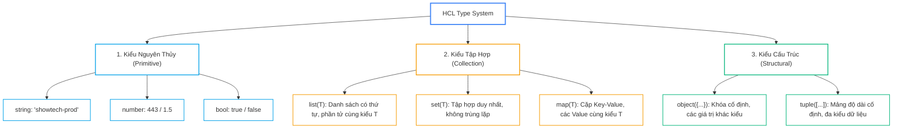


# Tối Ưu Cú Pháp HCL: Làm Chủ Dynamic Type, Heredoc, For Expressions & Type Constraints

Ngôn ngữ cấu hình **HCL (HashiCorp Configuration Language)** được thiết kế để cân bằng hoàn hảo giữa tính trực quan dễ đọc của con người (như YAML) và sức mạnh lập trình khai báo có cấu trúc dữ liệu chặt chẽ (như JSON). Tuy nhiên, khi xây dựng các Module Enterprise phục vụ hàng chục đội ngũ kỹ thuật, nhiều kỹ sư vẫn gặp khó khăn khi phải xử lý các cấu trúc dữ liệu lồng nhau phức tạp (`list(object)`), chuyển đổi mảng thành map bằng `for` expressions với toán tử nhóm Ellipsis (`...`), hoặc định dạng các tệp cấu hình JSON/YAML động bằng Heredoc templates mà không bị lỗi escape ký tự.

Bài viết này sẽ đưa bạn đi sâu vào nghệ thuật làm chủ ngôn ngữ HCL từ phiên bản Terraform 1.7+: Khám phá toàn bộ hệ thống kiểm định kiểu dữ liệu (<strong style="color: var(--accent-primary);">Type Constraints</strong>), tối ưu hóa luồng xử lý biến đổi dữ liệu với <strong style="color: var(--accent-cyan);">For Expressions</strong>, làm chủ kho tàng <strong style="color: var(--accent-amber);">Built-in Functions</strong> và học cách gỡ rối trực tiếp trên công cụ tương tác `<code style="color: var(--accent-primary); font-weight: 700;">terraform console</code>`.

---

## 1. Hệ Thống Kiểu Dữ Liệu (Type System) Chuyên Sâu Trong HCL

HCL phân chia hệ thống kiểu dữ liệu thành 3 nhóm rõ rệt với cơ chế ép kiểu tự động (Type Coercion) và thuộc tính tùy chọn `optional()`:



### 1.1. Bảng So Sánh Chi Tiết Các Kiểu Dữ Liệu Tập Hợp & Cấu Trúc

| Kiểu Dữ Liệu | Thứ Tự (Ordered) | Phần Tử Trùng Lặp | Đa Kiểu Dữ Liệu | Trường Hợp Sử Dụng Điển Hình |
| :--- | :---: | :---: | :---: | :--- |
| **`list(T)`** | Có | Có | Không | Danh sách CIDR Subnets, danh sách Security Group IDs |
| **`set(T)`** | Không | Không | Không | Danh sách Availability Zones, danh sách tên IAM Users truyền vào `for_each` |
| **`map(T)`** | Không | Không (Unique Key) | Không | Bảng Resource Tags (`map(string)`), cấu hình biến môi trường Container |
| **`tuple([...])`**| Có | Có | Có | Bộ tham số cố định trả về từ hàm hoặc API bên thứ ba |
| **`object({...})`**| Không | Không (Unique Key) | Có | Cấu hình tham số chi tiết của một Microservice hoặc Database Cluster |

---

### 1.2. Khai Báo Cấu Trúc `object` Nâng Cao với `optional()` và Default Value
Từ Terraform 1.3+, bạn có thể định nghĩa các thuộc tính tùy chọn kèm giá trị mặc định ngay trong kiểu dữ liệu `object`, giúp đơn giản hóa giao diện Module cho người dùng cuối:

```hcl
variable "app_clusters" {
  type = map(object({
    instance_type = string
    min_size      = optional(number, 2)
    max_size      = optional(number, 10)
    enable_spot   = optional(bool, false)
    subnet_ids    = list(string)
    custom_tags   = optional(map(string), {})
  }))
  description = "Danh mục cấu hình cụm máy chủ ứng dụng theo môi trường"
}
```

---

## 2. Làm Chủ For Expressions: Biến Đổi Dữ Liệu & Nhóm Ellipsis (`...`)

`for` expressions trong HCL là công cụ biến đổi dữ liệu cực kỳ mạnh mẽ, cho phép lọc (filter), ánh xạ (map) và tái cấu trúc dữ liệu đa chiều chỉ trong một biểu thức ngắn gọn.

### 2.1. Lọc và Biến Đổi Danh Sách (List-to-List Transformation)
```hcl
locals {
  raw_subnets = ["10.0.1.0/24", "10.0.2.0/24", "192.168.1.0/24", "temp-subnet"]

  # Chỉ giữ lại các subnet thuộc dải mạng 10.0.0.0/16 và hợp lệ
  valid_vpc_subnets = [
    for cidr in local.raw_subnets : cidr
    if can(cidrnetmask(cidr)) && startswith(cidr, "10.0.")
  ]
  # Kết quả: ["10.0.1.0/24", "10.0.2.0/24"]
}
```

### 2.2. Chuyển Đổi List of Objects Thành Map Phục Vụ `for_each`
Khi khởi tạo tài nguyên hạ tầng hàng loạt, `for_each` bắt buộc đầu vào phải là một `map` hoặc `set of strings`:

```hcl
locals {
  endpoints_list = [
    { name = "auth",    port = 8080, protocol = "HTTP" },
    { name = "payment", port = 8443, protocol = "HTTPS" },
    { name = "order",   port = 8081, protocol = "HTTP" }
  ]

  # Biến đổi thành Map với Key duy nhất là trường 'name'
  endpoints_map = {
    for ep in local.endpoints_list : ep.name => ep
  }
}
```

### 2.3. Kỹ Thuật Gom Nhóm Nâng Cao Với Toán Tử Ellipsis (`...`)
Khi nhiều phần tử trong danh sách có cùng một khóa phân loại (ví dụ: nhóm danh sách nhân viên theo phòng ban), sử dụng toán tử `...` ở cuối biểu thức `for` để tự động gom nhóm thành danh sách con:

```hcl
locals {
  engineers = [
    { name = "Alice", team = "DevOps" },
    { name = "Bob",   team = "Backend" },
    { name = "Carol", team = "DevOps" },
    { name = "David", team = "Frontend" }
  ]

  # Gom nhóm kỹ sư theo Team bằng cú pháp Ellipsis (...)
  team_members = {
    for eng in local.engineers : eng.team => eng.name...
  }
  # Kết quả thu được:
  # {
  #   "DevOps"   = ["Alice", "Carol"],
  #   "Backend"  = ["Bob"],
  #   "Frontend" = ["David"]
  # }
}
```

---

## 3. Xử Lý Heredoc Template, JSON/YAML Encoding Chuẩn Xác

### 3.1. Phân Biệt `<<EOT` và `<<-EOT` (Indented Heredoc)
- <span class="badge badge--amber">`<<EOT`</span>: Giữ nguyên toàn bộ khoảng trắng và thụt đầu dòng (leading whitespace) ở tất cả các dòng, khiến mã nguồn HCL nhìn bừa bộn nếu muốn căn lề đẹp.
- <span class="badge badge--emerald">`<<-EOT`</span>: Tự động loại bỏ khoảng trắng thụt lề dựa trên vị trí của từ khóa kết thúc `EOT`, cho phép bạn thụt dòng code HCL sạch sẽ mà chuỗi văn bản xuất ra vẫn chuẩn xác.

```hcl
locals {
  user_data_script = <<-EOT
    #!/bin/bash
    set -euo pipefail
    echo "Starting Server Deployment for ${var.environment}"
    yum update -y
    yum install -y nginx
    systemctl start nginx
  EOT
}
```

### 3.2. Tuyệt Đối Không Dùng String Interpolation Để Tạo JSON Policy!
> [!IMPORTANT]
> **CẠM BẪY BẢO MẬT VÀ LỖI CÚ PHÁP JSON:**
> Không bao giờ ghép chuỗi thủ công để tạo IAM Policy (`"{\"Version\": \"2012-10-17\"}"`). Hãy luôn sử dụng hàm **`jsonencode()`** hoặc data source **`aws_iam_policy_document`**. Hàm `jsonencode()` tự động escape ký tự đặc biệt, kiểm tra cú pháp và đảm bảo tính hợp lệ 100% của tệp JSON.

---

## 4. Bảng Ma Trận Các Hàm Built-in Function Trọng Yếu Trong SRE

Dưới đây là 12 hàm built-in được sử dụng thường xuyên nhất trong các hệ thống quy mô lớn:

| Phân Loại Hàm | Tên Hàm HCL | Cú Pháp Ví Dụ | Kết Quả Trả Về | Ứng Dụng Thực Tế |
| :--- | :--- | :--- | :--- | :--- |
| **IP Network** | `cidrsubnet` | `cidrsubnet("10.0.0.0/16", 4, 2)` | `"10.0.2.0/20"` | Tự động chia dải IP Subnet không sợ trùng |
| **IP Network** | `cidrhost` | `cidrhost("10.0.1.0/24", 5)` | `"10.0.1.5"` | Gán IP tĩnh cho Load Balancer hoặc Gateway |
| **Collection** | `merge` | `merge(local.default_tags, var.tags)` | Map tổng hợp | Hợp nhất bảng Tags toàn doanh nghiệp |
| **Collection** | `flatten` | `flatten([[1, 2], [3, 4]])` | `[1, 2, 3, 4]` | Làm phẳng danh sách đa cấp khi dùng lặp lồng |
| **Collection** | `lookup` | `lookup(var.amis, var.region, "ami-default")`| Giá trị hoặc Default| Tra cứu cấu hình an toàn không sợ crash |
| **Collection** | `element` | `element(var.subnet_ids, count.index)` | Phần tử theo vòng tròn | Phân bổ tài nguyên xoay vòng qua các Subnet |
| **String** | `format` | `format("web-%02d-%s", 3, "prod")` | `"web-03-prod"` | Chuẩn hóa quy tắc đặt tên máy chủ |
| **String** | `replace` | `replace("10.0.1.0/24", "/", "-")` | `"10.0.1.0-24"` | Tạo Resource ID an toàn không có dấu gạch |
| **Encoding** | `jsonencode` | `jsonencode({ env = "prod", id = 12 })` | Chuỗi JSON hợp lệ | Tạo IAM Policies, ECS Task Definitions |
| **Encoding** | `yamlencode` | `yamlencode(local.k8s_values)` | Chuỗi YAML hợp lệ | Tạo Helm Values hoặc K8s ConfigMaps |
| **Filesystem** | `file` | `file("${path.module}/user_data.sh")`| Nội dung file text | Đọc script khởi động EC2 từ tệp riêng |
| **Filesystem** | `templatefile` | `templatefile("app.tpl", { port = 80 })` | Văn bản sau render | Render tệp cấu hình động với biến HCL |

---

## 5. Kiến Trúc Mẫu Triển Khai IAM Role & Security Group (HCL Breakdown)

Dưới đây là một ví dụ ứng dụng toàn diện các kỹ thuật: `object with optional`, `jsonencode`, `for expressions` và `cidrsubnet`:

```hcl
# main.tf - Triển khai hạ tầng bảo mật phân tán với Dynamic Types
terraform {
  required_version = ">= 1.7.0"
  required_providers {
    aws = {
      source  = "hashicorp/aws"
      version = "~> 5.45.0"
    }
  }
}

# 1. Khởi tạo Security Group với các Ingress Rules được tính toán động
resource "aws_security_group" "microservice_sg" {
  name        = "showtech-microservice-sg-${var.environment}"
  description = "Security Group duoc tao tu dynamic HCL object"
  vpc_id      = var.vpc_id

  tags = merge(
    var.common_tags,
    {
      Name        = "sg-microservice-${var.environment}"
      Environment = var.environment
    }
  )
}

# 2. Sinh các Ingress Rules độc lập từ Map cấu hình
resource "aws_security_group_rule" "ingress_rules" {
  for_each = {
    for idx, rule in var.security_rules : "${rule.port}-${rule.protocol}" => rule
  }

  type              = "ingress"
  from_port         = each.value.port
  to_port           = each.value.port
  protocol          = each.value.protocol
  cidr_blocks       = each.value.cidr_blocks
  description       = each.value.description
  security_group_id = aws_security_group.microservice_sg.id
}

# 3. Khởi tạo IAM Role với Policy Document được sinh bằng jsonencode an toàn
resource "aws_iam_role" "app_execution_role" {
  name = "showtech-app-role-${var.environment}"

  assume_role_policy = jsonencode({
    Version = "2012-10-17"
    Statement = [
      {
        Action = "sts:AssumeRole"
        Effect = "Allow"
        Principal = {
          Service = "ec2.amazonaws.com"
        }
      }
    ]
  })
}

resource "aws_iam_policy" "dynamic_s3_access" {
  name        = "showtech-s3-access-policy-${var.environment}"
  description = "Cap quyen truy cap S3 cho danh sach buckets"

  policy = jsonencode({
    Version = "2012-10-17"
    Statement = [
      {
        Effect = "Allow"
        Action = [
          "s3:GetObject",
          "s3:PutObject",
          "s3:ListBucket"
        ]
        # Sử dụng For Expression để tạo danh sách ARN tự động
        Resource = flatten([
          for bucket_name in var.allowed_s3_buckets : [
            "arn:aws:s3:::${bucket_name}",
            "arn:aws:s3:::${bucket_name}/*"
          ]
        ])
      }
    ]
  })
}

resource "aws_iam_role_policy_attachment" "attach" {
  role       = aws_iam_role.app_execution_role.name
  policy_arn = aws_iam_policy.dynamic_s3_access.arn
}
```

```hcl
# variables.tf
variable "environment" {
  type    = string
  default = "production"
}

variable "vpc_id" {
  type    = string
  default = "vpc-0123456789abcdef0"
}

variable "common_tags" {
  type = map(string)
  default = {
    ManagedBy = "Terraform"
    Project   = "ShowTech"
  }
}

variable "allowed_s3_buckets" {
  type        = list(string)
  default     = ["showtech-prod-assets", "showtech-prod-logs"]
  description = "Danh sách S3 buckets được phép truy cập"
}

variable "security_rules" {
  type = list(object({
    port        = number
    protocol    = optional(string, "tcp")
    cidr_blocks = list(string)
    description = optional(string, "Managed by Terraform")
  }))
  default = [
    { port = 80,  cidr_blocks = ["0.0.0.0/0"], description = "HTTP Web" },
    { port = 443, cidr_blocks = ["0.0.0.0/0"], description = "HTTPS Web" },
    { port = 22,  cidr_blocks = ["10.0.0.0/8"], protocol = "tcp", description = "SSH Internal" }
  ]
}
```

---

## 6. Phân Tích Cạm Bẫy Thực Chiến: Lỗi "Invalid JSON String In IAM Policy"

### Tình Huống Sự Cố Thực Tế:
Vào lúc <span class="badge badge--rose">🕒 09:30 AM</span>, một nhóm kỹ sư chuyển đổi từ Ansible sang Terraform đã viết IAM Policy bằng cách nối chuỗi Heredoc truyền thống:

```hcl
# CODE GÂY LỖI: Nối chuỗi thủ công trong Heredoc
resource "aws_iam_policy" "bad_policy" {
  name   = "bad-policy"
  policy = <<-EOT
    {
      "Version": "2012-10-17",
      "Statement": [
        {
          "Effect": "Allow",
          "Action": "s3:*",
          "Resource": "arn:aws:s3:::${var.bucket_name}/*",
        }
      ]
    }
  EOT
}
```

### Log Lỗi Trả Về Khi Apply:
```diff
# Trích đoạn log lỗi từ AWS API
! [CRITICAL ERROR] Error creating IAM Policy bad-policy: MalformedPolicyDocument: 
! Syntax errors in policy. (Line 8, Column 10: Trailing comma in JSON object)
! 	status code: 400, request id: 7f8a9b1c-9921-4321-beef-123456789abc

  on main.tf line 12, in resource "aws_iam_policy" "bad_policy":
  12: resource "aws_iam_policy" "bad_policy" {
```

### 5-Whys Root Cause Analysis:
1. <span class="badge badge--primary">Why 1</span> **Tại sao IAM Policy bị từ chối tạo?** $\rightarrow$ Vì AWS API trả về lỗi `MalformedPolicyDocument` do cú pháp JSON không hợp lệ.
2. <span class="badge badge--primary">Why 2</span> **Tại sao JSON không hợp lệ?** $\rightarrow$ Vì xuất hiện dấu phẩy thừa (Trailing Comma) sau dòng `"Resource": "..."`.
3. <span class="badge badge--primary">Why 3</span> **Tại sao lại có dấu phẩy thừa?** $\rightarrow$ Do kỹ sư sao chép từ cấu hình cũ và nối chuỗi bằng Heredoc `<<-EOT` mà không qua parser kiểm tra.
4. <span class="badge badge--primary">Why 4</span> **Tại sao không phát hiện sớm ở bước `terraform validate`?** $\rightarrow$ Vì `terraform validate` chỉ kiểm tra cú pháp HCL; đối với HCL thì chuỗi trong Heredoc chỉ là một chuỗi văn bản (`string`), không kiểm tra tính đúng đắn của JSON bên trong.
5. <span class="badge badge--emerald">Root Cause Remedy</span> **Biện pháp khắc phục tận gốc:**
   - <span class="badge badge--emerald">100% JSONEncode</span> **Chuyển đổi sang `jsonencode()`:** Khi dùng `jsonencode()`, HCL parser sẽ kiểm tra cấu trúc Map/List ngay tại thời điểm biên dịch, loại bỏ 100% nguy cơ lỗi JSON.

---

## 7. Hands-on Lab: Khám Phá & Gỡ Rối Biểu Thức Với `terraform console` (8 Bước)

| Bước | Lệnh / Biểu Thức | Mục Đích Thực Thi |
| :---: | :--- | :--- |
| <span class="badge badge--primary">01</span> | `terraform console` | Khởi động môi trường dòng lệnh tương tác REPL của Terraform |
| <span class="badge badge--cyan">02</span> | `cidrsubnet(...) & cidrhost(...)` | Thử nghiệm tính toán phân bổ dải IP mạng Subnet và Host |
| <span class="badge badge--indigo">03</span> | `[for s in [...] : upper(s) if ...]` | Thử nghiệm biến đổi danh sách kèm bộ lọc điều kiện `if` |
| <span class="badge badge--amber">04</span> | `{for item in [...] : item.k => item.v...}` | Thử nghiệm gom nhóm mảng con bằng toán tử Ellipsis (`...`) |
| <span class="badge badge--emerald">05</span> | `jsonencode({ env = "prod", ... })` | Thử nghiệm mã hóa Object HCL thành chuỗi JSON chuẩn mực |
| <span class="badge badge--primary">06</span> | `coalesce(null, "", "default")` | Kiểm tra xử lý giá trị rỗng và cơ chế Fallback an toàn |
| <span class="badge badge--rose">07</span> | `flatten([["a", "b"], ["c", "d"]])` | Làm phẳng cấu trúc danh sách lồng 2 chiều thành 1 chiều |
| <span class="badge badge--emerald">08</span> | `exit` | Thoát khỏi phiên làm việc dòng lệnh tương tác Console |

```bash
# 1. Khởi động môi trường tương tác REPL
terraform console
```

```hcl
# 2. Thử nghiệm các hàm xử lý mạng IP
> cidrsubnet("10.100.0.0/16", 8, 1)
"10.100.1.0/24"

> cidrhost("10.100.1.0/24", 10)
"10.100.1.10"

# 3. Thử nghiệm For Expression với bộ lọc Filter
> [for s in ["web", "api", "db", "cache"] : upper(s) if s != "cache"]
[
  "WEB",
  "API",
  "DB",
]

# 4. Thử nghiệm toán tử nhóm Ellipsis (...)
> { for item in [{k="fruit", v="apple"}, {k="fruit", v="banana"}, {k="veg", v="carrot"}] : item.k => item.v... }
{
  "fruit" = [
    "apple",
    "banana",
  ]
  "veg" = [
    "carrot",
  ]
}

# 5. Thử nghiệm hàm jsonencode và kiểm tra cấu trúc
> jsonencode({ env = "prod", enabled = true, count = 5 })
"{\"count\":5,\"enabled\":true,\"env\":\"prod\"}"

# 6. Kiểm tra xử lý giá trị Null và hàm coalesce
> coalesce(null, "", "default-value")
"default-value"

# 7. Thử nghiệm hàm flatten trên mảng 2 chiều
> flatten([["a", "b"], ["c", "d"], ["e"]])
[
  "a",
  "b",
  "c",
  "d",
  "e",
]

# 8. Thoát khỏi Terraform Console
> exit
```

---

## 8. 10 Câu Hỏi Tự Kiểm Tra Chuyên Sâu (Self-Check Q&A)

<div class="qa-answer">
  <div class="qa-answer-header">
    <svg width="14" height="14" fill="none" stroke="currentColor" stroke-width="2" viewBox="0 0 24 24"><path d="M22 11.08V12a10 10 0 1 1-5.93-9.14"></path><polyline points="22 4 12 14.01 9 11.01"></polyline></svg>
    <span>Phân Tích &amp; Lời Giải Kỹ Thuật</span>
  </div>
  
<div style="margin: 0.35rem 0; padding-left: 1rem; border-left: 2px solid var(--accent-primary);">• <code>list</code> là danh sách có thứ tự theo chỉ mục (0, 1, 2...) và cho phép các phần tử trùng lặp giá trị.<br/></div>
  <div style="margin: 0.35rem 0; padding-left: 1rem; border-left: 2px solid var(--accent-primary);">• <code>set</code> là tập hợp các phần tử không có thứ tự và <b style="color: var(--accent-primary);">tuyệt đối không chứa phần tử trùng lặp</b>. Khi truyền vào <code>for_each</code>, <code>set</code> an toàn hơn <code>list</code> vì tránh được hiện tượng Index Shifting.</div>
</div>
</details>

<div class="qa-answer">
  <div class="qa-answer-header">
    <svg width="14" height="14" fill="none" stroke="currentColor" stroke-width="2" viewBox="0 0 24 24"><path d="M22 11.08V12a10 10 0 1 1-5.93-9.14"></path><polyline points="22 4 12 14.01 9 11.01"></polyline></svg>
    <span>Phân Tích &amp; Lời Giải Kỹ Thuật</span>
  </div>
  
Cho phép người gọi Module không bắt buộc phải truyền đủ mọi thuộc tính trong object. Kỹ sư có thể gán giá trị mặc định cho thuộc tính đó, ví dụ: <code>optional(string, "default_val")</code>. Nếu người dùng không truyền, Terraform sẽ tự gán giá trị mặc định.
</div>
</details>

<div class="qa-answer">
  <div class="qa-answer-header">
    <svg width="14" height="14" fill="none" stroke="currentColor" stroke-width="2" viewBox="0 0 24 24"><path d="M22 11.08V12a10 10 0 1 1-5.93-9.14"></path><polyline points="22 4 12 14.01 9 11.01"></polyline></svg>
    <span>Phân Tích &amp; Lời Giải Kỹ Thuật</span>
  </div>
  
Dùng để gom nhóm nhiều phần tử có cùng một Key vào một mảng giá trị (Value là danh sách). Nếu không có toán tử <code>...</code>, khi gặp 2 phần tử có cùng Key, Terraform sẽ báo lỗi <code>Duplicate key in map</code>.
</div>
</details>

<div class="qa-answer">
  <div class="qa-answer-header">
    <svg width="14" height="14" fill="none" stroke="currentColor" stroke-width="2" viewBox="0 0 24 24"><path d="M22 11.08V12a10 10 0 1 1-5.93-9.14"></path><polyline points="22 4 12 14.01 9 11.01"></polyline></svg>
    <span>Phân Tích &amp; Lời Giải Kỹ Thuật</span>
  </div>
  
<code>&lt;&lt;-EOT</code> (Indented Heredoc) cho phép thụt đầu dòng các dòng chữ bên trong để mã nguồn HCL đẹp và ngay ngắn, nhưng khi biên dịch, Terraform sẽ tự động loại bỏ khoảng trắng thụt lề bằng với vị trí của từ khóa <code>EOT</code>.
</div>
</details>

<div class="qa-answer">
  <div class="qa-answer-header">
    <svg width="14" height="14" fill="none" stroke="currentColor" stroke-width="2" viewBox="0 0 24 24"><path d="M22 11.08V12a10 10 0 1 1-5.93-9.14"></path><polyline points="22 4 12 14.01 9 11.01"></polyline></svg>
    <span>Phân Tích &amp; Lời Giải Kỹ Thuật</span>
  </div>
  
<code>jsonencode()</code> biến đổi một HCL Map/Object thành chuỗi JSON chuẩn mực, tự động escape ký tự đặc biệt, không bao giờ để xảy ra lỗi cú pháp (như thiếu ngoặc, thừa dấu phẩy) và được validate kiểu dữ liệu ngay trong quá trình biên dịch HCL.
</div>
</details>

<div class="qa-answer">
  <div class="qa-answer-header">
    <svg width="14" height="14" fill="none" stroke="currentColor" stroke-width="2" viewBox="0 0 24 24"><path d="M22 11.08V12a10 10 0 1 1-5.93-9.14"></path><polyline points="22 4 12 14.01 9 11.01"></polyline></svg>
    <span>Phân Tích &amp; Lời Giải Kỹ Thuật</span>
  </div>
  
Hàm này mở rộng độ dài subnet mask thêm <code>newbits</code> và lấy dải mạng con thứ <code>netnum</code>. Ví dụ: <code>cidrsubnet("10.0.0.0/16", 4, 1)</code> sẽ mở rộng từ /16 thành /20 (16 + 4) và lấy subnet thứ 1, trả về <code>"10.0.16.0/20"</code>.
</div>
</details>

<div class="qa-answer">
  <div class="qa-answer-header">
    <svg width="14" height="14" fill="none" stroke="currentColor" stroke-width="2" viewBox="0 0 24 24"><path d="M22 11.08V12a10 10 0 1 1-5.93-9.14"></path><polyline points="22 4 12 14.01 9 11.01"></polyline></svg>
    <span>Phân Tích &amp; Lời Giải Kỹ Thuật</span>
  </div>
  
<div style="margin: 0.35rem 0; padding-left: 1rem; border-left: 2px solid var(--accent-primary);">• <code>can(expression)</code>: Trả về <code>true</code> nếu biểu thức thực thi thành công không lỗi, trả về <code>false</code> nếu có lỗi (thường dùng trong <code>validation</code> block).<br/></div>
  <div style="margin: 0.35rem 0; padding-left: 1rem; border-left: 2px solid var(--accent-primary);">• <code>try(expr1, expr2, default)</code>: Trả về kết quả của biểu thức đầu tiên không bị lỗi, giúp xử lý các thuộc tính có thể không tồn tại mà không làm sập tiến trình chạy.</div>
</div>
</details>

<div class="qa-answer">
  <div class="qa-answer-header">
    <svg width="14" height="14" fill="none" stroke="currentColor" stroke-width="2" viewBox="0 0 24 24"><path d="M22 11.08V12a10 10 0 1 1-5.93-9.14"></path><polyline points="22 4 12 14.01 9 11.01"></polyline></svg>
    <span>Phân Tích &amp; Lời Giải Kỹ Thuật</span>
  </div>
  
Thường dùng khi duyệt qua cấu trúc dữ liệu 2 tầng lồng nhau (Nested For), ví dụ duyệt qua danh sách các VPC, trong mỗi VPC lại duyệt qua danh sách các Subnet. Biểu thức For lồng nhau sẽ tạo ra danh sách của danh sách (List of Lists), và <code>flatten()</code> sẽ làm phẳng nó thành một danh sách 1 chiều duy nhất để truyền vào <code>for_each</code>.
</div>
</details>

<div class="qa-answer">
  <div class="qa-answer-header">
    <svg width="14" height="14" fill="none" stroke="currentColor" stroke-width="2" viewBox="0 0 24 24"><path d="M22 11.08V12a10 10 0 1 1-5.93-9.14"></path><polyline points="22 4 12 14.01 9 11.01"></polyline></svg>
    <span>Phân Tích &amp; Lời Giải Kỹ Thuật</span>
  </div>
  
<b style="color: var(--accent-primary);">KHÔNG</b>. <code>terraform console</code> chỉ là một môi trường đọc (Read-Only REPL) để kiểm tra cú pháp, đánh giá các biểu thức HCL, kiểm tra giá trị biến và chạy thử các Built-in Functions. Nó không gửi bất kỳ lệnh thay đổi nào lên Cloud.
</div>
</details>

<div class="qa-answer">
  <div class="qa-answer-header">
    <svg width="14" height="14" fill="none" stroke="currentColor" stroke-width="2" viewBox="0 0 24 24"><path d="M22 11.08V12a10 10 0 1 1-5.93-9.14"></path><polyline points="22 4 12 14.01 9 11.01"></polyline></svg>
    <span>Phân Tích &amp; Lời Giải Kỹ Thuật</span>
  </div>
  
<code>templatefile()</code> là một hàm built-in chạy trực tiếp trong Terraform Core, không cần cài đặt thêm Provider ngoài (<code>template</code> provider), có hiệu năng render cực nhanh và hỗ trợ đầy đủ toàn bộ hệ thống kiểu dữ liệu hiện đại của HCL (Maps, Objects, Tuples).
</div>
</details>

---

## 9. Tổng Kết & Lộ Trình Bài Học Tiếp Theo

Làm chủ cú pháp **HCL**, hệ thống **Type Constraints**, kỹ thuật **For Expressions** và kho hàm **Built-in Functions** là bước nhảy vọt biến bạn từ một người chỉ biết copy/paste code mẫu thành một kỹ sư Platform có khả năng kiến tạo những Module hạ tầng linh hoạt và mạnh mẽ.

> [!TIP]
> **BÀI HỌC TIẾP THEO:**
> Trong **[Bài 04: Đồ Thị Phụ Thuộc (Dependency Graph): Quản Lý Phụ Thuộc Tường Minh, Ngầm Định & Xử Lý Lỗi Vòng Lặp Tuần Hoàn (Cycle)](./04-dependency-graph-dag-quan-ly-phu-thuoc-tuong-minh-ngam-dinh.md)**, chúng ta sẽ chuyên sâu vào việc xử lý các tình huống phức tạp nhất của đồ thị DAG: Tách rời tài nguyên với Security Group Rules hai chiều, kỹ thuật phá vỡ Cycle và tối ưu hóa thứ tự triển khai tài nguyên đa tầng.

