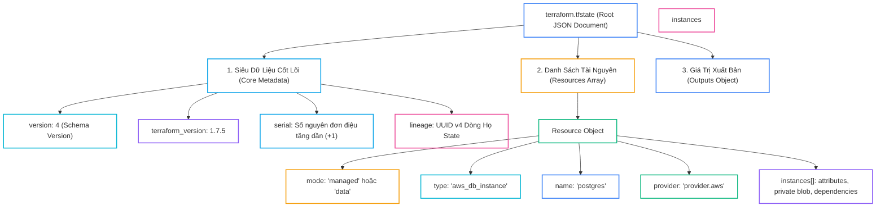
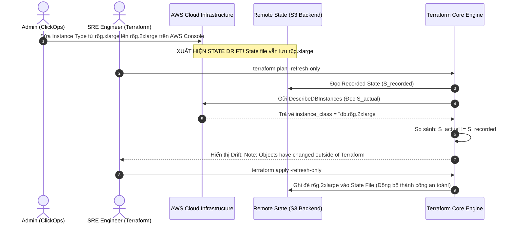


# Giải Mã Terraform State: Cấu Trúc JSON Schema v4, Cơ Chế Drift Detection & Kỹ Thuật Refresh-Only

Trong toàn bộ hệ sinh thái **Terraform**, không có thành phần nào đóng vai trò "trái tim" nhưng cũng dễ bị hiểu lầm và gây ra thảm họa vận hành nhiều như **Terraform State (`terraform.tfstate`)**. Nhiều kỹ sư mới bắt đầu thường ngộ nhận rằng Terraform là một công cụ "stateless" kết nối trực tiếp mã HCL với Cloud API, hoặc coi file state chỉ là một bộ nhớ cache tạm thời có thể xóa đi tạo lại tùy ý.

Thực tế hoàn toàn ngược lại: **State là nguồn chân lý duy nhất (Single Source of Truth)** mà Terraform Core bắt buộc phải dựa vào để ánh xạ giữa các định danh logic trừu tượng trong mã nguồn (`resource "aws_db_instance" "postgres"`) và các tài nguyên vật lý thực tế trên đám mây (`rds-prod-postgres-c9a1b2c3d4`). Mất file state đồng nghĩa với việc bạn mất hoàn toàn khả năng kiểm soát vòng đời của hạ tầng qua IaC.

Bài viết chuyên sâu này sẽ "phẫu thuật" từng trường siêu dữ liệu trong cấu trúc JSON Schema v4 của file state, bóc tách cơ chế phát hiện lệch cấu hình ngầm (**Drift Detection**) trong pha Refresh, phân tích rủi ro rò rỉ Plaintext Secrets và hướng dẫn quy trình đối soát hạ tầng an toàn tuyệt đối với cờ `-refresh-only`.

---

## 1. Phẫu Thuật Cấu Trúc JSON Schema v4 của File State

File `terraform.tfstate` là một tài liệu JSON được chuẩn hóa theo **Schema Format Version 4**. Nắm vững từng trường dữ liệu là chìa khóa để kỹ sư SRE có thể sửa chữa (troubleshoot) khi state bị lỗi định dạng (corruption) hoặc phân mảnh:



---

## 2. Bảng Tra Cứu Các Trường Siêu Dữ Liệu Trong JSON Schema v4

Dưới đây là bảng giải mã chi tiết các trường dữ liệu quan trọng nhất trong tệp `terraform.tfstate`:

| Tên Trường Dữ Liệu | Kiểu Dữ Liệu | Giá Trị Ví Dụ | Ý Nghĩa Kỹ Thuật Thực Tiễn |
| :--- | :--- | :--- | :--- |
| **`version`** | Integer | `4` | Phiên bản schema của cấu trúc state file (hiện tại luôn là 4). |
| **`terraform_version`** | String | `"1.7.5"` | Phiên bản binary Terraform đã ghi đè lên state lần gần nhất. |
| **`serial`** | Integer | `84` | Số nguyên tự động tăng sau mỗi lần apply thành công, chống Out-of-order write. |
| **`lineage`** | UUID String | `"e9b28b7a-5c1a-428a-..."` | Mã định danh "dòng họ" bất biến của State, ngăn chặn ghi đè chéo môi trường. |
| **`mode`** | String | `"managed"` / `"data"` | Phân biệt tài nguyên do Terraform quản lý (`managed`) hay chỉ đọc (`data`). |
| **`type`** | String | `"aws_security_group"` | Loại tài nguyên do Provider định nghĩa. |
| **`name`** | String | `"web_sg"` | Tên định danh logic của tài nguyên trong mã HCL. |
| **`attributes`** | Object | `{ "id": "sg-0123...", ... }` | Toàn bộ thuộc tính hiện tại của tài nguyên trên Cloud (ID, ARN, Tags). |
| **`sensitive_attributes`** | Array | `["password", "private_key"]` | Danh sách các trường được mã hóa bảo vệ khi hiển thị UI. |
| **`private`** | Base64 String | `"eyJlMmJmYjczMC..."` | Dữ liệu nhị phân nội bộ của Provider (timeout context, schema hash, private context). |
| **`dependencies`** | Array | `["aws_vpc.main"]` | Danh sách tài nguyên mà instance này phụ thuộc để xây dựng DAG. |
| **`index_key`** | String/Number| `"prod"` hoặc `0` | Chỉ số phân biệt các instance khi dùng `count` hoặc `for_each`. |

---

## 3. Trích Đoạn Cấu Trúc File State Thực Tế

```json
{
  "version": 4,
  "terraform_version": "1.7.5",
  "serial": 84,
  "lineage": "d8a1c2e3-4f5a-6b7c-8d9e-0123456789ab",
  "outputs": {
    "db_endpoint": {
      "value": "showtech-prod-db.c9a1b2c3d4.ap-southeast-1.rds.amazonaws.com:5432",
      "type": "string"
    },
    "db_master_password": {
      "value": "SecretPassword2026!",
      "type": "string",
      "sensitive": true
    }
  },
  "resources": [
    {
      "mode": "managed",
      "type": "aws_db_instance",
      "name": "postgres",
      "provider": "provider[\"registry.terraform.io/hashicorp/aws\"]",
      "instances": [
        {
          "schema_version": 2,
          "attributes": {
            "allocated_storage": 100,
            "arn": "arn:aws:rds:ap-southeast-1:123456789012:db:showtech-prod-db",
            "engine": "postgres",
            "id": "showtech-prod-db",
            "instance_class": "db.r6g.xlarge",
            "password": "SecretPassword2026!",
            "username": "dbadmin"
          },
          "sensitive_attributes": [
            [
              {
                "type": "get_attr",
                "value": "password"
              }
            ]
          ],
          "private": "eyJlMmJmYjczMC1lY2FhLTExZTYtOGY4OC0zNDM2M2JjN2M0YzAiOnsiY3JlYXRlIjo2MDAwMDAwMDAwMDAsImRlbGV0ZSI6MTIwMDAwMDAwMDAwMH19",
          "dependencies": [
            "aws_kms_key.db_kms",
            "random_password.db_master_password"
          ]
        }
      ]
    }
  ]
}
```

> [!CAUTION]
> **RỦI RO BẢO MẬT: STATE FILE LUÔN CHỨA PLAINTEXT SECRETS!**
> Như bạn thấy ở trường `attributes.password` phía trên, mặc dù ta đã đặt cờ `sensitive = true` trong HCL, mật khẩu vẫn được lưu **hoàn toàn dưới dạng văn bản thô (Plain Text)** bên trong State File. Terraform bắt buộc phải lưu giá trị thực để có thể so sánh Diff khi chạy Plan. Do đó, bảo vệ quyền truy cập State Backend là rào chắn an ninh quan trọng nhất!

---

## 4. Cơ Chế Drift Detection Trong Pha Refresh: State vs Thực Tế

Một nguyên lý nền tảng của SRE: **"State Không Phải Là Thực Tế Đang Chạy"**. File state chỉ phản ánh trạng thái tại thời điểm gần nhất lệnh `apply` chạy thành công.

Khi một quản trị viên đăng nhập vào AWS Management Console và trực tiếp sửa tham số hoặc xóa một Subnet ngoài luồng (Out-of-band change / ClickOps), sự sai lệch (**State Drift**) sẽ xuất hiện:



---

## 5. So Sánh Quy Trình Reconcile: `terraform refresh` (Cũ) vs `-refresh-only` (Mới)

```mermaid
flowchart TD
    subgraph OLD["QUY TRÌNH CŨ: terraform refresh (CỰC KỲ NGUY HIỂM)"]
        O1["Chạy 'terraform refresh'"] --> O2["Gửi API đọc Cloud"]
        O2 --> O3["GHI ĐÈ TRỰC TIẾP LÊN STATE FILE (KHÔNG CÓ PREVIEW!)"]
        O3 --> O4["Nếu API bị timeout hoặc mất mạng: Resource bị XÓA KHỎI STATE!"]
    end

    subgraph NEW["QUY TRÌNH MỚI: plan/apply -refresh-only (CHUẨN SRE 100%)"]
        N1["Chạy 'terraform plan -refresh-only'"] --> N2["Gửi API đọc Cloud"]
        N2 --> N3["Hiển thị Drift Diff trên Terminal để SRE Review"]
        N3 --> N4{"SRE Duyệt Thay Đổi?"}
        N4 -->|"Đồng ý"| N5["Chạy 'terraform apply -refresh-only' -&gt; Ghi State an toàn"]
        N4 -->|"Từ chối"| N6["Hủy bỏ lệnh, giữ nguyên State hiện tại"]
    end

    style O3 fill:none,stroke:#3b82f6,stroke-width:2px
    style N3 fill:none,stroke:#0ea5e9,stroke-width:2px
    style N1 fill:none,stroke:#10b981,stroke-width:2px
    style O2 fill:none,stroke:#f59e0b,stroke-width:2px
    style O4 fill:none,stroke:#8b5cf6,stroke-width:2px
    style O1 fill:none,stroke:#ec4899,stroke-width:2px
    style OLD fill:none,stroke:#06b6d4,stroke-width:2px
    style N6 fill:none,stroke:#3b82f6,stroke-width:2px
    style N2 fill:none,stroke:#0ea5e9,stroke-width:2px
    style NEW fill:none,stroke:#10b981,stroke-width:2px
    style N5 fill:none,stroke:#f59e0b,stroke-width:2px
```



### Bảng Đối Chiếu Sự Khác Biệt:

| Tiêu Chí So Sánh | `terraform refresh` (Legacy) | `terraform plan/apply -refresh-only` (Modern) |
| :--- | :--- | :--- |
| **Giai Đoạn Phát Hành** | Mặc định trước Terraform 0.15.4 | Chính thức từ Terraform 1.0+ trở lên |
| **Cơ Chế Xem Trước (Preview)** | Hoàn toàn không có (Blind overwrite) | Có đầy đủ Execution Plan chi tiết |
| **Khả Năng Lưu Tệp Plan** | Không hỗ trợ | Hỗ trợ xuất file binary: `-out=drift.tfplan` |
| **Xử Lý Sự Cố Mạng Tạm Thời** | Có thể làm mất tài nguyên trong State | An toàn 100%, không ghi đè nếu chưa approve |
| **Tích Hợp CI/CD Pipeline** | Bị cấm trên hệ thống chuẩn | Tiêu chuẩn bắt buộc cho Automation Drift Detection |

---

## 6. Kỹ Thuật Đối Soát & Reconcile An Toàn Với `-refresh-only`

Từ Terraform 1.0+, HashiCorp đã chính thức thay thế lệnh cũ bằng cặp lệnh an toàn:

### Bước 1: Xem trước các thay đổi Drift mà không sửa hạ tầng
```bash
terraform plan -refresh-only -out=drift_check.tfplan
```

### Bước 2: Phân tích tệp Plan để trích xuất các thay đổi ngoài luồng
```bash
terraform show -json drift_check.tfplan | jq '.resource_changes[] | select(.change.actions[] == "update")'
```

### Bước 3: Xác nhận và đồng bộ Live State vào State Backend
```bash
terraform apply drift_check.tfplan
```

> [!IMPORTANT]
> **LỢI ÍCH SỐNG CÒN CỦA `-refresh-only`:**
> Lệnh này chỉ cập nhật State file theo hạ tầng thực tế trên Cloud mà **tuyệt đối không tạo ra bất kỳ hành động Add, Modify hay Destroy nào lên hạ tầng**. Đây là cách an toàn nhất để đưa các thay đổi ClickOps khẩn cấp vào kiểm soát của IaC trước khi viết code bổ sung.

---

## 7. Phân Tích Cạm Bẫy Thực Chiến: Thảm Họa "State Lineage Mismatch & Out-of-Order Apply"

### Tình Huống Sự Cố Thực Tế:
Vào lúc <span class="badge badge--rose">🕒 10:30 AM</span>, Tại một công ty viễn thông, khi thiết lập môi trường mới cho chi nhánh Staging, một kỹ sư đã sao chép nguyên văn tệp `terraform.tfstate` từ môi trường Production và tải lên S3 bucket của Staging nhằm "tiết kiệm thời gian khởi tạo".

Khi một kỹ sư khác thực hiện lệnh deploy trên Staging:
```bash
terraform apply -var-file="staging.tfvars"
```

### Hậu Quả & Log Lỗi Thực Tế:
```log
Error: State lineage mismatch!

The given state file has lineage "d8a1c2e3-4f5a-6b7c-8d9e-0123456789ab", but the 
backend currently holds lineage "a1b2c3d4-0000-1111-2222-333344445555".

Terraform will not proceed because writing this state would destroy the history 
and ownership of existing resources in the target environment.
```

### 5-Whys Root Cause Analysis:
1. <span class="badge badge--primary">Why 1</span> **Tại sao Terraform từ chối chạy?** $\rightarrow$ Vì phát hiện trường `lineage` trong State tải lên không trùng khớp với `lineage` đã ghi nhận trong Backend.
2. <span class="badge badge--primary">Why 2</span> **Tại sao `lineage` bị sai lệch?** $\rightarrow$ Do kỹ sư sao chép file State của Production sang Staging.
3. <span class="badge badge--primary">Why 3</span> **Tại sao việc này cực kỳ nguy hiểm?** $\rightarrow$ Nếu Terraform cho phép chạy tiếp, State của Staging sẽ chứa Resource ID của Production (ví dụ ID cơ sở dữ liệu `rds-prod-db`). Khi Staging chạy lệnh hủy (`terraform destroy`), **nó sẽ xóa sạch cơ sở dữ liệu của Production**!
4. <span class="badge badge--primary">Why 4</span> **Tại sao kỹ sư lại sao chép State?** $\rightarrow$ Do thiếu kiến thức về kiến trúc State và không hiểu vai trò của mã UUID `lineage`.
5. **<span class="badge badge--emerald">Root Cause Remedy</span> **<span class="badge badge--emerald">Root Cause Remedy</span> **<span class="badge badge--emerald">Root Cause Remedy</span> **Biện pháp khắc phục chuẩn SRE:**:**:**:**
   - **Tuyệt đối không sao chép State giữa các môi trường.**
   - **Luôn khởi tạo môi trường mới bằng một State trống** (`terraform init` trên Backend S3 riêng biệt).
   - **Phân tách quyền truy cập S3 Bucket State bằng IAM Policy riêng biệt** giữa Production và Staging.

---

## 8. Hands-on Lab: Phẫu Thuật State & Đồng Bộ Drift Thực Tế (8 Bước)

| Bước | Lệnh / Thao Tác | Mục Đích Kỹ Thuật |
| :---: | :--- | :--- |
| <span class="badge badge--primary">01</span> | `Thao tác 1` | Khởi tạo thư mục thực hành thử nghiệm |
| <span class="badge badge--cyan">02</span> | `local_file` | Tạo một tài nguyên mẫu cục bộ bằng |
| <span class="badge badge--indigo">03</span> | `Thao tác 3` | Áp dụng triển khai để sinh ra file State ban đầu |
| <span class="badge badge--amber">04</span> | `jq` | Sử dụng  để mổ xẻ cấu trúc JSON Schema v4 của State |
| <span class="badge badge--emerald">05</span> | `Thao tác 5` | Cố tình tạo ra hiện tượng Drift bằng cách sửa file thủ công ngoài luồng |
| <span class="badge badge--primary">06</span> | `-refresh-only` | Chạy kiểm tra Drift bằng |
| <span class="badge badge--rose">07</span> | `Thao tác 7` | Đồng bộ trạng thái thực tế vào State mà không ghi đè file |
| <span class="badge badge--emerald">08</span> | `serial` | Xác minh  của State đã tự động tăng (+1) |

### Bước 1: Khởi tạo thư mục thực hành thử nghiệm
```bash
mkdir -p /tmp/terraform-state-lab && cd /tmp/terraform-state-lab
terraform init
```

### Bước 2: Tạo một tài nguyên mẫu cục bộ bằng `local_file`
```bash
cat << 'EOF' > main.tf
terraform {
  required_providers {
    local = {
      source  = "hashicorp/local"
      version = "~> 2.5.0"
    }
  }
}

resource "local_file" "config" {
  filename = "${path.module}/app_config.json"
  content  = jsonencode({
    environment = "staging"
    version     = "1.0.0"
    port        = 8080
  })
}

output "file_path" {
  value = local_file.config.filename
}
EOF
```

### Bước 3: Áp dụng triển khai để sinh ra file State ban đầu
```bash
terraform apply -auto-approve
```

### Bước 4: Sử dụng `jq` để mổ xẻ cấu trúc JSON Schema v4 của State
```bash
# Xem siêu dữ liệu Metadata cốt lõi
cat terraform.tfstate | jq '{version, serial, lineage, terraform_version}'

# Xem chi tiết attributes của tài nguyên vừa tạo
cat terraform.tfstate | jq '.resources[0].instances[0].attributes'
```

### Bước 5: Cố tình tạo ra hiện tượng Drift bằng cách sửa file thủ công ngoài luồng
```bash
# Giả lập hành vi ClickOps: Sửa trực tiếp tệp bên ngoài Terraform
echo '{"environment":"staging","version":"2.0.0","port":9090}' > app_config.json
```

### Bước 6: Chạy kiểm tra Drift bằng `-refresh-only`
```bash
terraform plan -refresh-only
```
Quan sát Terraform phát hiện chính xác sự thay đổi: `content: "..." -> "..."` kèm ghi chú `Objects have changed outside of Terraform`.

### Bước 7: Đồng bộ trạng thái thực tế vào State mà không ghi đè file
```bash
terraform apply -refresh-only -auto-approve
```

### Bước 8: Xác minh `serial` của State đã tự động tăng (+1)
```bash
cat terraform.tfstate | jq '.serial'

# Dọn dẹp môi trường thử nghiệm
terraform destroy -auto-approve
cd .. && rm -rf /tmp/terraform-state-lab
```

---

## 9. 10 Câu Hỏi Tự Kiểm Tra Chuyên Sâu (Self-Check Q&A)


<div class="qa-answer">
  <div class="qa-answer-header">
    <svg width="14" height="14" fill="none" stroke="currentColor" stroke-width="2" viewBox="0 0 24 24"><path d="M22 11.08V12a10 10 0 1 1-5.93-9.14"></path><polyline points="22 4 12 14.01 9 11.01"></polyline></svg>
    <span>Phân Tích &amp; Lời Giải Kỹ Thuật</span>
  </div>
  
<code>serial</code> là một số nguyên tăng dần đơn điệu (+1) sau mỗi lần cập nhật State thành công. Nó đóng vai trò là cơ chế kiểm soát phiên bản tương tranh (Optimistic Concurrency Control), giúp Backend phát hiện và ngăn chặn tình trạng ghi đè state cũ hơn khi có nhiều tiến trình chạy song song.
</div>
</details>

<div class="qa-answer">
  <div class="qa-answer-header">
    <svg width="14" height="14" fill="none" stroke="currentColor" stroke-width="2" viewBox="0 0 24 24"><path d="M22 11.08V12a10 10 0 1 1-5.93-9.14"></path><polyline points="22 4 12 14.01 9 11.01"></polyline></svg>
    <span>Phân Tích &amp; Lời Giải Kỹ Thuật</span>
  </div>
  
<code>lineage</code> là một chuỗi UUID v4 được sinh ngẫu nhiên khi khởi tạo State lần đầu. Nó định danh "dòng họ" của State file để đảm bảo bạn không vô tình ghi đè State của môi trường này (ví dụ Staging) lên môi trường khác (Production).
</div>
</details>

<div class="qa-answer">
  <div class="qa-answer-header">
    <svg width="14" height="14" fill="none" stroke="currentColor" stroke-width="2" viewBox="0 0 24 24"><path d="M22 11.08V12a10 10 0 1 1-5.93-9.14"></path><polyline points="22 4 12 14.01 9 11.01"></polyline></svg>
    <span>Phân Tích &amp; Lời Giải Kỹ Thuật</span>
  </div>
  
Vì Terraform Core cần giá trị thực tế của mật khẩu/key để có thể gửi API so sánh Diff với Cloud Provider trong chu trình điều hòa Reconcile Loop. Cờ <code>sensitive = true</code> chỉ có nhiệm vụ che giấu giá trị khi hiển thị trên màn hình CLI và log CI/CD.
</div>
</details>

<div class="qa-answer">
  <div class="qa-answer-header">
    <svg width="14" height="14" fill="none" stroke="currentColor" stroke-width="2" viewBox="0 0 24 24"><path d="M22 11.08V12a10 10 0 1 1-5.93-9.14"></path><polyline points="22 4 12 14.01 9 11.01"></polyline></svg>
    <span>Phân Tích &amp; Lời Giải Kỹ Thuật</span>
  </div>
  
<div style="margin: 0.35rem 0; padding-left: 1rem; border-left: 2px solid var(--accent-primary);">• Lệnh cũ <code>terraform refresh</code> tự động cập nhật State ngay lập tức mà <b style="color: var(--accent-primary);">không cho phép người dùng xem trước kế hoạch</b>, có thể làm mất tài nguyên trong State nếu Cloud API bị lỗi mạng tạm thời.<br/></div>
  <div style="margin: 0.35rem 0; padding-left: 1rem; border-left: 2px solid var(--accent-primary);">• Lệnh mới <code>terraform plan -refresh-only</code> hiển thị chi tiết mọi thay đổi Drift cho kỹ sư kiểm duyệt trước khi quyết định Apply.</div>
</div>
</details>

<div class="qa-answer">
  <div class="qa-answer-header">
    <svg width="14" height="14" fill="none" stroke="currentColor" stroke-width="2" viewBox="0 0 24 24"><path d="M22 11.08V12a10 10 0 1 1-5.93-9.14"></path><polyline points="22 4 12 14.01 9 11.01"></polyline></svg>
    <span>Phân Tích &amp; Lời Giải Kỹ Thuật</span>
  </div>
  
Các tài nguyên vật lý trên AWS vẫn tiếp tục hoạt động bình thường. Tuy nhiên, Terraform sẽ hoàn toàn mất dấu quyền quản lý. Khi bạn chạy lại <code>terraform apply</code>, nó sẽ cố gắng tạo mới lại từ đầu và báo lỗi xung đột <code>ResourceAlreadyExists</code>. Bạn sẽ phải thực hiện quy trình Import lại từng tài nguyên.
</div>
</details>

<div class="qa-answer">
  <div class="qa-answer-header">
    <svg width="14" height="14" fill="none" stroke="currentColor" stroke-width="2" viewBox="0 0 24 24"><path d="M22 11.08V12a10 10 0 1 1-5.93-9.14"></path><polyline points="22 4 12 14.01 9 11.01"></polyline></svg>
    <span>Phân Tích &amp; Lời Giải Kỹ Thuật</span>
  </div>
  
<div style="margin: 0.35rem 0; padding-left: 1rem; border-left: 2px solid var(--accent-cyan);"><b style="color: var(--accent-cyan);">1.</b> Bật tính năng mã hóa tại chỗ bằng AWS KMS Customer Managed Key (SSE-KMS).<br/></div>
  <div style="margin: 0.35rem 0; padding-left: 1rem; border-left: 2px solid var(--accent-cyan);"><b style="color: var(--accent-cyan);">2.</b> Bật S3 Versioning để lưu trữ lịch sử và khôi phục khi bị corrupt.<br/></div>
  <div style="margin: 0.35rem 0; padding-left: 1rem; border-left: 2px solid var(--accent-cyan);"><b style="color: var(--accent-cyan);">3.</b> Cấu hình S3 Bucket Policy và IAM Least-Privilege (chỉ cho phép CI/CD runner truy cập).<br/></div>
  <div style="margin: 0.35rem 0; padding-left: 1rem; border-left: 2px solid var(--accent-cyan);"><b style="color: var(--accent-cyan);">4.</b> Bật DynamoDB State Locking để chống ghi đè đồng thời.</div>
</div>
</details>

<div class="qa-answer">
  <div class="qa-answer-header">
    <svg width="14" height="14" fill="none" stroke="currentColor" stroke-width="2" viewBox="0 0 24 24"><path d="M22 11.08V12a10 10 0 1 1-5.93-9.14"></path><polyline points="22 4 12 14.01 9 11.01"></polyline></svg>
    <span>Phân Tích &amp; Lời Giải Kỹ Thuật</span>
  </div>
  
Chứa dữ liệu nội bộ riêng của Provider Plugin (như context timeouts, schema version metadata nội bộ). Kỹ sư <b style="color: var(--accent-primary);">tuyệt đối không được chỉnh sửa thủ công</b> trường này để tránh làm hỏng giao tiếp gRPC với Provider.
</div>
</details>

<div class="qa-answer">
  <div class="qa-answer-header">
    <svg width="14" height="14" fill="none" stroke="currentColor" stroke-width="2" viewBox="0 0 24 24"><path d="M22 11.08V12a10 10 0 1 1-5.93-9.14"></path><polyline points="22 4 12 14.01 9 11.01"></polyline></svg>
    <span>Phân Tích &amp; Lời Giải Kỹ Thuật</span>
  </div>
  
<div style="margin: 0.35rem 0; padding-left: 1rem; border-left: 2px solid var(--accent-primary);">• <code>mode: "managed"</code>: Dành cho các tài nguyên khai báo bằng từ khóa <code>resource</code> (Terraform quản lý toàn bộ vòng đời tạo, sửa, xóa).<br/></div>
  <div style="margin: 0.35rem 0; padding-left: 1rem; border-left: 2px solid var(--accent-primary);">• <code>mode: "data"</code>: Dành cho các khối <code>data source</code> (Terraform chỉ đọc thông tin, không sở hữu và không bao giờ xóa tài nguyên đó).</div>
</div>
</details>

<div class="qa-answer">
  <div class="qa-answer-header">
    <svg width="14" height="14" fill="none" stroke="currentColor" stroke-width="2" viewBox="0 0 24 24"><path d="M22 11.08V12a10 10 0 1 1-5.93-9.14"></path><polyline points="22 4 12 14.01 9 11.01"></polyline></svg>
    <span>Phân Tích &amp; Lời Giải Kỹ Thuật</span>
  </div>
  
<div style="margin: 0.35rem 0; padding-left: 1rem; border-left: 2px solid var(--accent-primary);">• <code>terraform state list</code>: Liệt kê danh sách địa chỉ của toàn bộ tài nguyên hiện có trong State.<br/></div>
  <div style="margin: 0.35rem 0; padding-left: 1rem; border-left: 2px solid var(--accent-primary);">• <code>terraform state show <address></code>: Xem chi tiết toàn bộ các thuộc tính (Attributes) của một tài nguyên cụ thể đang được lưu trong State.</div>
</div>
</details>

<div class="qa-answer">
  <div class="qa-answer-header">
    <svg width="14" height="14" fill="none" stroke="currentColor" stroke-width="2" viewBox="0 0 24 24"><path d="M22 11.08V12a10 10 0 1 1-5.93-9.14"></path><polyline points="22 4 12 14.01 9 11.01"></polyline></svg>
    <span>Phân Tích &amp; Lời Giải Kỹ Thuật</span>
  </div>
  
Vì State File chứa toàn bộ thông tin nhạy cảm của hạ tầng ở dạng Plain Text (Database Passwords, TLS Private Keys, IAM Credentials, Internal IPs), đồng thời dễ dẫn tới xung đột merge conflict khi nhiều kỹ sư cùng làm việc. Luôn phải sử dụng Remote State Backend.
</div>
</details>

---

## 10. Tổng Kết & Lộ Trình Bài Học Tiếp Theo

Làm chủ cấu trúc nội tại của **Terraform State JSON Schema v4**, cơ chế **Drift Detection** và quy trình đối soát an toàn với **`-refresh-only`** là hành trang bắt buộc để bạn bảo vệ và duy trì tính toàn vẹn của hạ tầng đám mây.

Trong **[Bài 07: Remote State Nâng Cao: S3 Backend, DynamoDB State Locking & Chiến Lược Di Trú Backend](07-remote-state-s3-backend-dynamodb-state-locking-di-tru-backend.md)**, chúng ta sẽ bước vào thiết lập hạ tầng lưu trữ State chuẩn Enterprise: Cấu hình mã hóa đa tầng KMS, cơ chế phân xử tương tranh bằng DynamoDB Lock Table và quy trình di trú State không downtime (`terraform init -migrate-state`).

