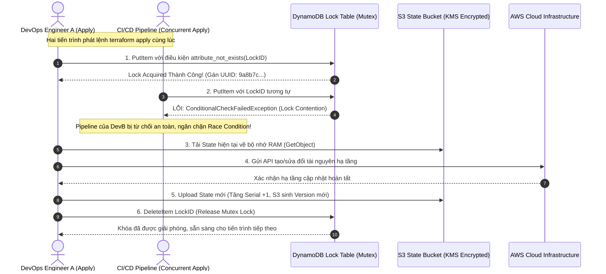


# Xây Dựng Remote State Enterprise: AWS S3 Backend, DynamoDB State Locking & Di Trú State An Toàn

Khi quy mô dự án mở rộng với nhiều kỹ sư DevOps và các pipeline CI/CD (GitHub Actions, GitLab CI, Jenkins) cùng tham gia quản trị hạ tầng, mô hình **Local State** (`local backend`) trở thành "quả bom nổ chậm". Hai kỹ sư hoặc hai pipeline chạy `terraform apply` gần như đồng thời có thể ghi đè state lẫn nhau (**Race Condition**), làm sai lệch chỉ số `serial` và khiến dữ liệu ánh xạ hạ tầng bị mất đồng bộ hoàn toàn (State Corruption).

Để giải quyết triệt để bài toán làm việc nhóm và bảo vệ tính toàn vẹn của hệ thống, **AWS S3 Backend kết hợp DynamoDB State Locking** là tiêu chuẩn công nghiệp bắt buộc.

Trong bài viết chuyên sâu này, chúng ta sẽ phân tích toàn diện kiến trúc phân tách hai tầng Lưu trữ và Khóa phân tán, mổ xẻ mã nguồn HCL bootstrap chuẩn bảo mật CIS AWS Benchmark, giải mã cơ chế Mutex Lock của DynamoDB, tối ưu hóa cấu hình động với `-backend-config` và hướng dẫn quy trình **Di Trú State (Backend Migration)** an toàn tuyệt đối không downtime.

---

## 1. Kiến Trúc Tổng Thể S3 Backend & DynamoDB State Locking

Mô hình Remote Backend phân tách rõ ràng giữa nơi **lưu trữ dữ liệu bền vững (Storage Layer - S3)** và cơ chế **phân xử khóa tương tranh (Locking Layer - DynamoDB)**:



---

## 2. Bảng So Sánh Các Giải Pháp Remote Backend Phổ Biến

| Tiêu Chí Kỹ Thuật | AWS S3 + DynamoDB | Terraform Cloud / HCP | HashiCorp Consul | Azure Blob + Lease |
| :--- | :--- | :--- | :--- | :--- |
| **Độ Phức Tạp Vận Hành** | Thấp (Managed Serverless) | Rất thấp (SaaS hoàn chỉnh) | Cao (Phải duy trì cụm Consul) | Thấp (Managed Azure) |
| **Cơ Chế Khóa (Locking)** | Bắt buộc dùng DynamoDB Table | Tích hợp sẵn trong SaaS | Native Distributed K/V Lock | Blob Lease Mutex Native |
| **Mã Hóa Lưu Trữ** | AWS KMS (CMK / SSE-S3) | Mã hóa AES-256 + TLS | TLS + Consul Encryption | Azure Key Vault SSE |
| **Khôi Phục Lịch Sử (Versioning)**| S3 Object Versioning | Lưu trữ đầy đủ lịch sử State Runs | Consul Snapshots | Blob Container Versioning |
| **Chi Phí Hàng Tháng** | Cực thấp (< $1 USD / tháng) | Miễn phí đến 500 resources | Tốn chi phí máy chủ EC2 | Cực thấp (< $1 USD / tháng) |
| **Môi Trường Khuyến Nghị** | Chuẩn công nghiệp cho AWS | Đội ngũ cần giao diện UI & RBAC | Hạ tầng On-Premise / Hybrid | Chuẩn công nghiệp cho Azure |

---

## 3. Giải Mã Bản Ghi Khóa (Lock Record) Trong DynamoDB

Khi Terraform chiếm giữ khóa, nó ghi một item vào DynamoDB với **Partition Key bắt buộc phải là `LockID`** (kiểu String `S`). Giá trị của `LockID` có định dạng: `&lt;bucket_name&gt;/<state_key>-md5`:

```json
{
  "LockID": {"S": "showtech-prod-tfstate-ap-southeast-1/core/network.tfstate-md5"},
  "Info": {
    "S": "{\"ID\":\"b3e9447d-8153-4811-9a7e-cb9192451390\",\"Operation\":\"OperationTypeApply\",\"Info\":\"\",\"Who\":\"jenkins@ci-runner-02\",\"Version\":\"1.7.5\",\"Created\":\"2026-09-06T04:45:12.128456Z\",\"Path\":\"showtech-prod-tfstate-ap-southeast-1/core/network.tfstate\"}"
  }
}
```

> [!IMPORTANT]
> **QUY ƯỚC BẮT BUỘC CỦA DYNAMODB SCHEMA:**
> Bảng DynamoDB dùng cho State Locking **bắt buộc phải đặt tên Partition Key là `LockID` (viết hoa chữ L và ID)**. Nếu bạn đặt tên là `id`, `lockId` hoặc `lock_id`, Terraform Core sẽ báo lỗi `ValidationException: The provided key element does not match the schema` và từ chối chạy.

---

## 4. Kiến Trúc Mẫu Bootstrap Hạ Tầng Remote State (HCL Breakdown)

Dưới đây là bộ mã nguồn HCL độc lập dùng để khởi tạo hạ tầng lưu trữ S3 Bucket và DynamoDB Lock Table tuân thủ tiêu chuẩn an ninh CIS Benchmark:

```hcl
# bootstrap/main.tf - Khởi tạo S3 Bucket & DynamoDB Lock Table
terraform {
  required_version = ">= 1.7.0"
  required_providers {
    aws = {
      source  = "hashicorp/aws"
      version = "~> 5.45.0"
    }
  }
}

provider "aws" {
  region = var.aws_region
}

# 1. Khóa KMS Customer Managed Key (CMK) bảo vệ State File
resource "aws_kms_key" "state_kms" {
  description             = "KMS Key ma hoa cho Terraform Remote State"
  deletion_window_in_days = 30
  enable_key_rotation     = true

  tags = {
    Name        = "kms-tfstate-${var.environment}"
    Environment = var.environment
  }
}

# 2. S3 Bucket lưu trữ State với rào chắn chống xóa nhầm
resource "aws_s3_bucket" "state_bucket" {
  bucket        = "showtech-enterprise-tfstate-${var.environment}-${var.aws_region}"
  force_destroy = false

  lifecycle {
    prevent_destroy = true # Cấm xóa bucket bằng lệnh terraform destroy
  }

  tags = {
    Name        = "tfstate-storage-${var.environment}"
    Environment = var.environment
  }
}

# 3. Kích hoạt Versioning bảo vệ lịch sử State
resource "aws_s3_bucket_versioning" "versioning" {
  bucket = aws_s3_bucket.state_bucket.id
  versioning_configuration {
    status = "Enabled"
  }
}

# 4. Ép buộc mã hóa SSE-KMS với Bucket Key
resource "aws_s3_bucket_server_side_encryption_configuration" "encryption" {
  bucket = aws_s3_bucket.state_bucket.id
  rule {
    apply_server_side_encryption_by_default {
      kms_master_key_id = aws_kms_key.state_kms.arn
      sse_algorithm     = "aws:kms"
    }
    bucket_key_enabled = true
  }
}

# 5. Chặn toàn bộ truy cập Public
resource "aws_s3_bucket_public_access_block" "block_public" {
  bucket                  = aws_s3_bucket.state_bucket.id
  block_public_acls       = true
  block_public_policy     = true
  ignore_public_acls      = true
  restrict_public_buckets = true
}

# 6. Bảng DynamoDB phân xử Mutex Lock với chế độ Pay-Per-Request
resource "aws_dynamodb_table" "state_locks" {
  name         = "showtech-tfstate-locks-${var.environment}"
  billing_mode = "PAY_PER_REQUEST" # Tiết kiệm chi phí, tự động co giãn
  hash_key     = "LockID"         # BẮT BUỘC viết đúng cú pháp

  attribute {
    name = "LockID"
    type = "S"
  }

  point_in_time_recovery {
    enabled = true # Khôi phục dữ liệu khóa khi cần kiểm toán
  }

  tags = {
    Name        = "tflocks-${var.environment}"
    Environment = var.environment
  }
}
```

---

## 5. Kỹ Thuật Nạp Backend Động Với `-backend-config` (Partial Configuration)

Để tái sử dụng chung một khối mã HCL cho nhiều môi trường (Dev, Staging, Prod) mà không cần sửa code `backend "s3"`, hãy khai báo một **khối Backend rỗng** và truyền tham số động qua file cấu hình ngoài:

```hcl
# versions.tf - Khai báo Backend rỗng (Partial Configuration)
terraform {
  required_version = ">= 1.7.0"
  backend "s3" {} # Không hardcode bucket, key, dynamodb_table
}
```

```hcl
# env/prod-backend.hcl - Cấu hình riêng cho môi trường Production
bucket         = "showtech-enterprise-tfstate-prod-ap-southeast-1"
key            = "services/payment-api/terraform.tfstate"
region         = "ap-southeast-1"
dynamodb_table = "showtech-tfstate-locks-prod"
encrypt        = true
```

Lệnh khởi tạo môi trường Production chuẩn SRE:
```bash
terraform init -backend-config="env/prod-backend.hcl" -reconfigure
```

---

## 6. Phân Tích Cạm Bẫy Thực Chiến: Thảm Họa "State Lock Deadlock & Force-Unlock"

### Tình Huống Sự Cố Thực Tế:
Vào lúc <span class="badge badge--rose">🕒 10:30 AM</span>, Trên một đường ống CI/CD GitLab, tiến trình `terraform apply` đang chạy thì Kubernetes Worker Node bị hết bộ nhớ (OOMKilled) khiến container bị tiêu diệt ngay lập tức.

### Hậu Quả & Log Lỗi Thực Tế:
```text
# Trích đoạn log lỗi từ Terraform CLI
Acquiring state lock. This may take a few moments...
Error: Error acquiring the state lock

Error message: ConditionalCheckFailedException: The conditional request failed
Lock Info:
  ID:        9a8b7c6d-5e4f-3a2b-1c0d-1234567890ab
  Path:      showtech-enterprise-tfstate-prod/services/payment.tfstate
  Operation: OperationTypeApply
  Who:       gitlab-runner@k8s-worker-pod-99
  Version:   1.7.5
  Created:   2026-09-06 08:30:15.1023 UTC

Terraform acquires a state lock to protect the state from being written
by multiple users at the same time. Please resolve the issue above and try again.
```

### 5-Whys Root Cause Analysis:
1. <span class="badge badge--primary">Why 1</span> **Tại sao Terraform báo lỗi không acquire được lock?** $\rightarrow$ Vì bản ghi khóa của Lock ID `9a8b7c6d...` vẫn còn nằm trong DynamoDB Table.
2. <span class="badge badge--primary">Why 2</span> **Tại sao bản ghi khóa chưa được xóa?** $\rightarrow$ Vì container chạy Terraform trước đó bị OOMKilled và chết đột ngột trước khi bước `Release Lock` được thực thi.
3. <span class="badge badge--primary">Why 3</span> **Tại sao runner lại bị OOMKilled?** $\rightarrow$ Do pipeline không giới hạn bộ nhớ RAM cho Docker container runner khi chạy cùng lúc nhiều tool nặng.
4. <span class="badge badge--primary">Why 4</span> **Tại sao không thể chạy tiếp lệnh apply?** $\rightarrow$ Vì DynamoDB thực hiện cơ chế bảo vệ an toàn để ngăn chặn hai người cùng ghi đè state.
5. **Quy trình cứu hộ chuẩn SRE:**
   - **Bước 1 (Xác minh an toàn):** Kiểm tra kỹ lưỡng danh sách pipeline đang chạy để chắc chắn 100% không còn tiến trình nào đang thao tác ngầm trên state đó.
   - **Bước 2 (Giải phóng khóa bằng ID):** Chạy lệnh mở khóa có chủ đích:
     ```bash
     terraform force-unlock 9a8b7c6d-5e4f-3a2b-1c0d-1234567890ab
     ```
   - **Bước 3 (Thêm tham số phòng ngừa vào CI/CD):** Luôn truyền cờ `-lock-timeout=120s` trên pipeline để tự động đợi các tiến trình ngắn hạn hoàn tất.

---

## 7. Hands-on Lab: Khởi Tạo Remote Backend & Di Trú State (8 Bước)

| Bước | Lệnh / Thao Tác | Mục Đích Kỹ Thuật |
| :---: | :--- | :--- |
| <span class="badge badge--primary">01</span> | `Thao tác 1` | Tạo tài nguyên cục bộ với Local State ban đầu |
| <span class="badge badge--cyan">02</span> | `main.tf` | Bổ sung cấu hình Remote Backend S3 vào file |
| <span class="badge badge--indigo">03</span> | `-migrate-state` | Thực hiện lệnh di trú State tự động () |
| <span class="badge badge--amber">04</span> | `Thao tác 4` | Kiểm tra State File cục bộ đã được dọn dẹp |
| <span class="badge badge--emerald">05</span> | `Thao tác 5` | Mô phỏng hành vi chiếm giữ khóa (State Lock Test) |
| <span class="badge badge--primary">06</span> | `Thao tác 6` | Kiểm tra tệp Lock trực tiếp trên AWS DynamoDB bằng AWS CLI |
| <span class="badge badge--rose">07</span> | `Thao tác 7` | Thực hiện khôi phục phiên bản State cũ từ S3 Versioning |
| <span class="badge badge--emerald">08</span> | `Thao tác 8` | Dọn dẹp tài nguyên thử nghiệm |

### Bước 1: Tạo tài nguyên cục bộ với Local State ban đầu
```bash
mkdir -p /tmp/backend-lab && cd /tmp/backend-lab

cat << 'EOF' > main.tf
terraform {
  required_providers {
    local = {
      source  = "hashicorp/local"
      version = "~> 2.5.0"
    }
  }
}

resource "local_file" "sample" {
  filename = "${path.module}/sample.txt"
  content  = "State Migration Lab - ShowTech Enterprise"
}
EOF

terraform init && terraform apply -auto-approve
```

### Bước 2: Bổ sung cấu hình Remote Backend S3 vào file `main.tf`
```bash
cat << 'EOF' >> main.tf

terraform {
  backend "s3" {
    bucket         = "showtech-enterprise-tfstate-prod-ap-southeast-1"
    key            = "labs/migration/state.tfstate"
    region         = "ap-southeast-1"
    dynamodb_table = "showtech-tfstate-locks-prod"
    encrypt        = true
  }
}
EOF
```

### Bước 3: Thực hiện lệnh di trú State tự động (`-migrate-state`)
```bash
terraform init -migrate-state
```
Khi Terraform hỏi: `Do you want to copy existing state to the new backend?`, gõ `yes` để xác nhận.

### Bước 4: Kiểm tra State File cục bộ đã được dọn dẹp
```bash
# File terraform.tfstate cục bộ giờ chỉ còn là một tệp backup rỗng
cat terraform.tfstate.backup | jq .serial
```

### Bước 5: Mô phỏng hành vi chiếm giữ khóa (State Lock Test)
Mở 2 cửa sổ terminal cùng lúc và cùng chạy lệnh:
```bash
# Terminal 1:
terraform apply

# Terminal 2 (chạy ngay sau terminal 1):
terraform apply
```
Quan sát Terminal 2 bị từ chối với thông báo `Error acquiring the state lock`.

### Bước 6: Kiểm tra tệp Lock trực tiếp trên AWS DynamoDB bằng AWS CLI
```bash
aws dynamodb scan --table-name showtech-tfstate-locks-prod
```

### Bước 7: Thực hiện khôi phục phiên bản State cũ từ S3 Versioning
```bash
# Liệt kê các phiên bản lịch sử của State File trên S3
aws s3api list-object-versions \
  --bucket showtech-enterprise-tfstate-prod-ap-southeast-1 \
  --prefix labs/migration/state.tfstate
```

### Bước 8: Dọn dẹp tài nguyên thử nghiệm
```bash
terraform destroy -auto-approve
cd .. && rm -rf /tmp/backend-lab
```

---

## 8. 10 Câu Hỏi Tự Kiểm Tra Chuyên Sâu (Self-Check Q&A)


<details class="qa-card">
<summary class="qa-summary">
  <div class="qa-summary-left">
    <span class="qa-num-badge">Q01</span>
    <span>Tại sao bảng DynamoDB dùng cho State Locking bắt buộc phải có Partition Key là <code>LockID</code>?</span>
  </div>
  <span class="qa-chevron">
    <svg width="18" height="18" fill="none" stroke="currentColor" stroke-width="2.5" viewBox="0 0 24 24"><polyline points="6 9 12 15 18 9"></polyline></svg>
  </span>
</summary>
<div class="qa-answer">
  <div class="qa-answer-header">
    <svg width="14" height="14" fill="none" stroke="currentColor" stroke-width="2" viewBox="0 0 24 24"><path d="M22 11.08V12a10 10 0 1 1-5.93-9.14"></path><polyline points="22 4 12 14.01 9 11.01"></polyline></svg>
    <span>Phân Tích &amp; Lời Giải Kỹ Thuật</span>
  </div>
  <p style="margin: 0.4rem 0;">Vì mã nguồn của S3 Backend trong Terraform Core đã được hardcode để gửi các truy vấn DynamoDB PutItem và DeleteItem với khóa chính xác là <code>LockID</code> (kiểu String). Đặt sai tên trường sẽ gây lỗi Schema Mismatch ngay lập tức.</p>
</div>
</details>

<details class="qa-card">
<summary class="qa-summary">
  <div class="qa-summary-left">
    <span class="qa-num-badge">Q02</span>
    <span>Chế độ Billing <code>PAY_PER_REQUEST</code> của DynamoDB Table mang lại lợi ích gì cho State Locking?</span>
  </div>
  <span class="qa-chevron">
    <svg width="18" height="18" fill="none" stroke="currentColor" stroke-width="2.5" viewBox="0 0 24 24"><polyline points="6 9 12 15 18 9"></polyline></svg>
  </span>
</summary>
<div class="qa-answer">
  <div class="qa-answer-header">
    <svg width="14" height="14" fill="none" stroke="currentColor" stroke-width="2" viewBox="0 0 24 24"><path d="M22 11.08V12a10 10 0 1 1-5.93-9.14"></path><polyline points="22 4 12 14.01 9 11.01"></polyline></svg>
    <span>Phân Tích &amp; Lời Giải Kỹ Thuật</span>
  </div>
  <p style="margin: 0.4rem 0;">Giúp tối ưu hóa chi phí về gần như 0 đồng (vì số lượng thao tác đọc/ghi khóa mỗi ngày chỉ diễn ra khi có deploy), đồng thời tự động đáp ứng tốc độ xử lý khi có nhiều pipeline CI/CD cùng chạy mà không sợ bị nghẽn (Throttling) như chế độ Provisioned RCU/WCU.</p>
</div>
</details>

<details class="qa-card">
<summary class="qa-summary">
  <div class="qa-summary-left">
    <span class="qa-num-badge">Q03</span>
    <span>Lệnh <code>terraform init -migrate-state</code> khác gì so với <code>terraform init -reconfigure</code>?</span>
  </div>
  <span class="qa-chevron">
    <svg width="18" height="18" fill="none" stroke="currentColor" stroke-width="2.5" viewBox="0 0 24 24"><polyline points="6 9 12 15 18 9"></polyline></svg>
  </span>
</summary>
<div class="qa-answer">
  <div class="qa-answer-header">
    <svg width="14" height="14" fill="none" stroke="currentColor" stroke-width="2" viewBox="0 0 24 24"><path d="M22 11.08V12a10 10 0 1 1-5.93-9.14"></path><polyline points="22 4 12 14.01 9 11.01"></polyline></svg>
    <span>Phân Tích &amp; Lời Giải Kỹ Thuật</span>
  </div>
  <div style="margin: 0.35rem 0; padding-left: 1rem; border-left: 2px solid var(--accent-primary);">• <code>-migrate-state</code>: Tự động sao chép toàn bộ dữ liệu State hiện tại sang Backend mới và xóa state cũ sau khi xác nhận.</div>
  <div style="margin: 0.35rem 0; padding-left: 1rem; border-left: 2px solid var(--accent-primary);">• <code>-reconfigure</code>: Bỏ qua toàn bộ dữ liệu State cũ, cấu hình lại Backend mới từ đầu (thường dùng khi muốn trỏ sang một State hoàn toàn khác mà không muốn copy dữ liệu).</div>
</div>
</details>

<details class="qa-card">
<summary class="qa-summary">
  <div class="qa-summary-left">
    <span class="qa-num-badge">Q04</span>
    <span>Vì sao S3 Versioning là yêu cầu bắt buộc đối với S3 State Bucket?</span>
  </div>
  <span class="qa-chevron">
    <svg width="18" height="18" fill="none" stroke="currentColor" stroke-width="2.5" viewBox="0 0 24 24"><polyline points="6 9 12 15 18 9"></polyline></svg>
  </span>
</summary>
<div class="qa-answer">
  <div class="qa-answer-header">
    <svg width="14" height="14" fill="none" stroke="currentColor" stroke-width="2" viewBox="0 0 24 24"><path d="M22 11.08V12a10 10 0 1 1-5.93-9.14"></path><polyline points="22 4 12 14.01 9 11.01"></polyline></svg>
    <span>Phân Tích &amp; Lời Giải Kỹ Thuật</span>
  </div>
  <p style="margin: 0.4rem 0;">S3 Versioning lưu giữ toàn bộ lịch sử các bản chụp State sau mỗi lần apply. Nếu một tiến trình apply bị lỗi làm hỏng hoặc ghi đè state rỗng, kỹ sư có thể dễ dàng tải lại phiên bản object version trước đó để phục hồi hạ tầng trong vài giây.</p>
</div>
</details>

<details class="qa-card">
<summary class="qa-summary">
  <div class="qa-summary-left">
    <span class="qa-num-badge">Q05</span>
    <span>Điều gì xảy ra nếu bạn chạy <code>terraform force-unlock</code> khi một đồng nghiệp thực tế vẫn đang apply?</span>
  </div>
  <span class="qa-chevron">
    <svg width="18" height="18" fill="none" stroke="currentColor" stroke-width="2.5" viewBox="0 0 24 24"><polyline points="6 9 12 15 18 9"></polyline></svg>
  </span>
</summary>
<div class="qa-answer">
  <div class="qa-answer-header">
    <svg width="14" height="14" fill="none" stroke="currentColor" stroke-width="2" viewBox="0 0 24 24"><path d="M22 11.08V12a10 10 0 1 1-5.93-9.14"></path><polyline points="22 4 12 14.01 9 11.01"></polyline></svg>
    <span>Phân Tích &amp; Lời Giải Kỹ Thuật</span>
  </div>
  <p style="margin: 0.4rem 0;">Tiến trình thứ hai sẽ nhảy vào chiếm quyền và cùng ghi dữ liệu lên S3, gây ra hiện tượng <b style="color: var(--accent-primary);">Race Condition</b> và phá hỏng cấu trúc State JSON v4 (State Corruption), làm mất dấu các tài nguyên đang được tạo.</p>
</div>
</details>

<details class="qa-card">
<summary class="qa-summary">
  <div class="qa-summary-left">
    <span class="qa-num-badge">Q06</span>
    <span>Tham số <code>-backend-config</code> hỗ trợ những định dạng đầu vào nào?</span>
  </div>
  <span class="qa-chevron">
    <svg width="18" height="18" fill="none" stroke="currentColor" stroke-width="2.5" viewBox="0 0 24 24"><polyline points="6 9 12 15 18 9"></polyline></svg>
  </span>
</summary>
<div class="qa-answer">
  <div class="qa-answer-header">
    <svg width="14" height="14" fill="none" stroke="currentColor" stroke-width="2" viewBox="0 0 24 24"><path d="M22 11.08V12a10 10 0 1 1-5.93-9.14"></path><polyline points="22 4 12 14.01 9 11.01"></polyline></svg>
    <span>Phân Tích &amp; Lời Giải Kỹ Thuật</span>
  </div>
  <p style="margin: 0.4rem 0;">Hỗ trợ truyền đường dẫn tới tệp cấu hình HCL/key-value (<code>-backend-config=path/to/backend.hcl</code>) hoặc truyền trực tiếp từng tham số qua dòng lệnh (<code>-backend-config="key=prod/app.tfstate"</code>).</p>
</div>
</details>

<details class="qa-card">
<summary class="qa-summary">
  <div class="qa-summary-left">
    <span class="qa-num-badge">Q07</span>
    <span>Khi nào nên sử dụng cờ <code>-lock-timeout=120s</code> trong pipeline CI/CD?</span>
  </div>
  <span class="qa-chevron">
    <svg width="18" height="18" fill="none" stroke="currentColor" stroke-width="2.5" viewBox="0 0 24 24"><polyline points="6 9 12 15 18 9"></polyline></svg>
  </span>
</summary>
<div class="qa-answer">
  <div class="qa-answer-header">
    <svg width="14" height="14" fill="none" stroke="currentColor" stroke-width="2" viewBox="0 0 24 24"><path d="M22 11.08V12a10 10 0 1 1-5.93-9.14"></path><polyline points="22 4 12 14.01 9 11.01"></polyline></svg>
    <span>Phân Tích &amp; Lời Giải Kỹ Thuật</span>
  </div>
  <p style="margin: 0.4rem 0;">Luôn luôn nên sử dụng trong các pipeline CI/CD tự động. Nếu có 2 commit được merge gần nhau, cờ này giúp commit thứ hai kiên nhẫn xếp hàng chờ commit thứ nhất hoàn tất và nhả khóa, thay vì báo lỗi fail pipeline ngay tức thì.</p>
</div>
</details>

<details class="qa-card">
<summary class="qa-summary">
  <div class="qa-summary-left">
    <span class="qa-num-badge">Q08</span>
    <span>S3 Bucket Key (<code>bucket_key_enabled = true</code>) giúp tiết kiệm chi phí như thế nào khi lưu trữ State?</span>
  </div>
  <span class="qa-chevron">
    <svg width="18" height="18" fill="none" stroke="currentColor" stroke-width="2.5" viewBox="0 0 24 24"><polyline points="6 9 12 15 18 9"></polyline></svg>
  </span>
</summary>
<div class="qa-answer">
  <div class="qa-answer-header">
    <svg width="14" height="14" fill="none" stroke="currentColor" stroke-width="2" viewBox="0 0 24 24"><path d="M22 11.08V12a10 10 0 1 1-5.93-9.14"></path><polyline points="22 4 12 14.01 9 11.01"></polyline></svg>
    <span>Phân Tích &amp; Lời Giải Kỹ Thuật</span>
  </div>
  <p style="margin: 0.4rem 0;">Giảm tới 99% số lượng request gọi trực tiếp tới AWS KMS API bằng cách sử dụng một khóa cấp bucket ngắn hạn trên hạ tầng S3, giúp tiết kiệm chi phí đáng kể khi các hệ thống CI/CD liên tục đọc State trong các bước Plan/Apply.</p>
</div>
</details>

<details class="qa-card">
<summary class="qa-summary">
  <div class="qa-summary-left">
    <span class="qa-num-badge">Q09</span>
    <span>Làm thế nào để ngăn chặn một kỹ sư vô tình chạy <code>terraform destroy</code> làm xóa mất S3 State Bucket?</span>
  </div>
  <span class="qa-chevron">
    <svg width="18" height="18" fill="none" stroke="currentColor" stroke-width="2.5" viewBox="0 0 24 24"><polyline points="6 9 12 15 18 9"></polyline></svg>
  </span>
</summary>
<div class="qa-answer">
  <div class="qa-answer-header">
    <svg width="14" height="14" fill="none" stroke="currentColor" stroke-width="2" viewBox="0 0 24 24"><path d="M22 11.08V12a10 10 0 1 1-5.93-9.14"></path><polyline points="22 4 12 14.01 9 11.01"></polyline></svg>
    <span>Phân Tích &amp; Lời Giải Kỹ Thuật</span>
  </div>
  <p style="margin: 0.4rem 0;">Khai báo khối <code>lifecycle { prevent_destroy = true }</code> bên trong tài nguyên <code>aws_s3_bucket</code> và bật tính năng <b style="color: var(--accent-primary);">S3 Object Lock (Compliance Mode)</b> kết hợp với MFA Delete trên tài khoản AWS Root.</p>
</div>
</details>

<details class="qa-card">
<summary class="qa-summary">
  <div class="qa-summary-left">
    <span class="qa-num-badge">Q10</span>
    <span>Nếu mất hoàn toàn bảng DynamoDB Lock Table thì hạ tầng thực tế có bị ảnh hưởng không?</span>
  </div>
  <span class="qa-chevron">
    <svg width="18" height="18" fill="none" stroke="currentColor" stroke-width="2.5" viewBox="0 0 24 24"><polyline points="6 9 12 15 18 9"></polyline></svg>
  </span>
</summary>
<div class="qa-answer">
  <div class="qa-answer-header">
    <svg width="14" height="14" fill="none" stroke="currentColor" stroke-width="2" viewBox="0 0 24 24"><path d="M22 11.08V12a10 10 0 1 1-5.93-9.14"></path><polyline points="22 4 12 14.01 9 11.01"></polyline></svg>
    <span>Phân Tích &amp; Lời Giải Kỹ Thuật</span>
  </div>
  <p style="margin: 0.4rem 0;">Hạ tầng thực tế trên Cloud hoàn toàn không bị ảnh hưởng. Dữ liệu State vẫn nằm an toàn trên S3 Bucket. Bạn chỉ cần tạo lại bảng DynamoDB với đúng tên và Partition Key <code>LockID</code> là có thể tiếp tục chạy Terraform bình thường.</p>
</div>
</details>

---

## 9. Tổng Kết & Lộ Trình Bài Học Tiếp Theo

Thiết lập một hệ thống **Remote State Backend** vững chắc với S3, DynamoDB State Locking và chiến lược nạp cấu hình động `-backend-config` là bước bảo vệ tối quan trọng giúp đội ngũ kỹ thuật tự tin mở rộng quy mô mà không bao giờ lo lắng về Race Condition hay mất mát dữ liệu State.

Trong **[[Bài 08] Phẫu Thuật State: Làm Chủ terraform state mv, rm, replace & Declarative Import Cứu Hộ Hạ Tầng](terraform-08-08-phau-thuat-state-state-mv-rm-replace-declarative-import-giai-cuu-ha-tang.html)**, chúng ta sẽ bước vào thế giới của những kỹ thuật giải cứu hạ tầng đỉnh cao: Đổi tên tài nguyên không gây recreate với `state mv`, tách tài nguyên ra khỏi quản lý với `state rm`, và làm chủ khối `import` khai báo mới nhất trong Terraform 1.5+!

