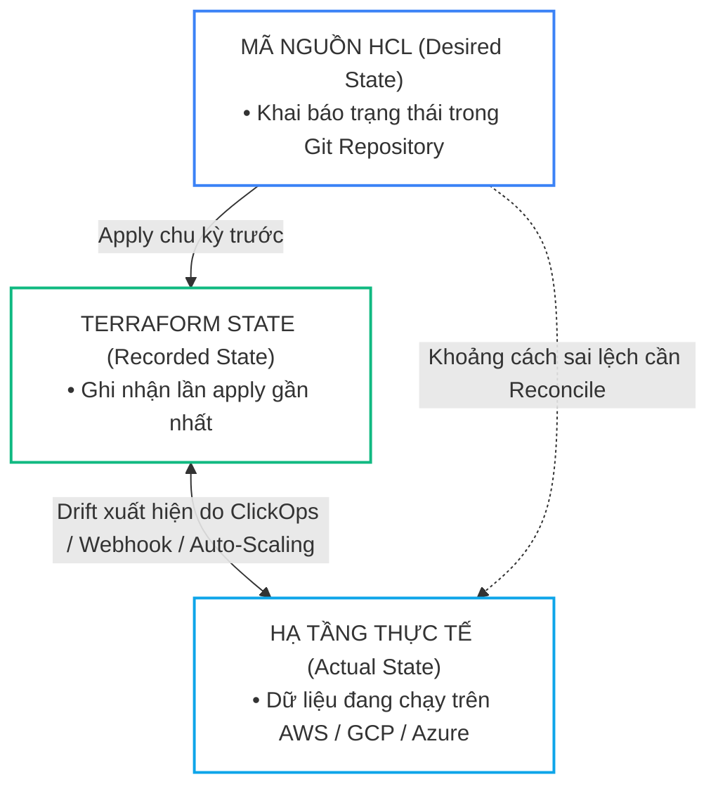
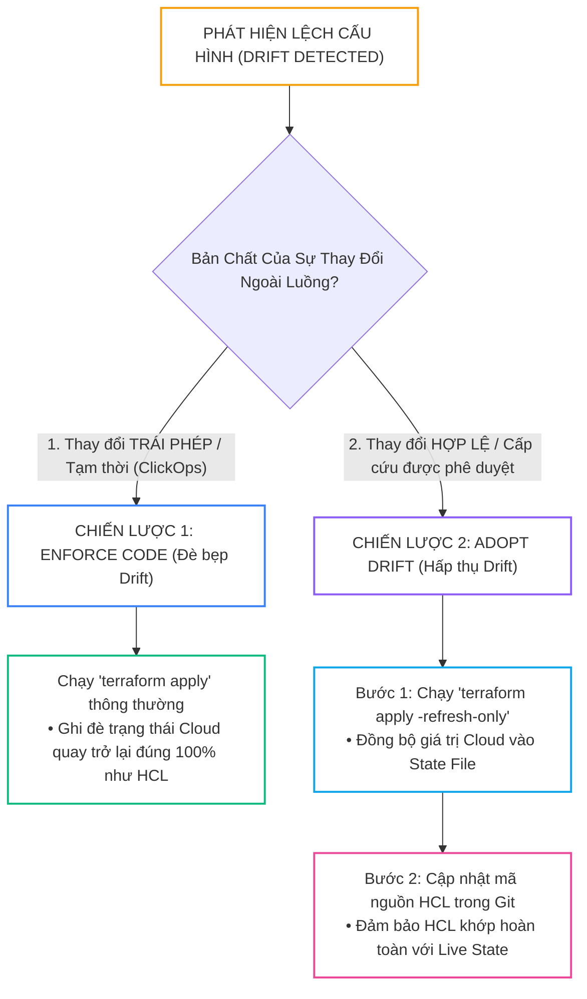
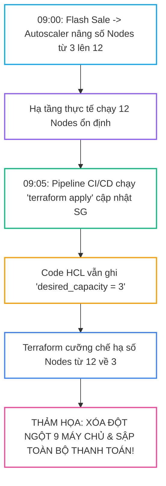


# Quản Trị Drift Hạ Tầng: Làm Chủ Refresh-Only, Chiến Lược Reconcile Hai Chiều & Tự Động Hóa Quét Lệch Cấu Hình

Trong môi trường điện toán đám mây doanh nghiệp với hàng trăm kỹ sư cùng làm việc, dù bạn có áp dụng quy trình kiểm duyệt kỷ luật đến đâu, hiện tượng **Lệch cấu hình hạ tầng (Configuration Drift)** vẫn luôn âm thầm diễn ra từng ngày:
- Một kỹ sư On-call mở tạm thời Port `22` (SSH) trong Security Group trực tiếp trên AWS Management Console lúc 2 giờ sáng để xử lý sự cố khẩn cấp nhưng sau đó quên đóng lại.
- Đội ngũ Bảo mật & Tuân thủ gắn thêm các thẻ phân loại bắt buộc (`Compliance: SOC2`, `AuditDate: 2026-09-07`) lên hàng loạt tài nguyên thông qua các dịch vụ AWS Config Remediation tự động.
- Một chính sách Auto Scaling tự động tăng giảm số lượng EC2 Instances hoặc EKS Nodes ngoài tầm kiểm soát của code HCL.
- Một quản trị viên vô tình chỉnh sửa cấu hình IAM Role hoặc xóa nhầm một Subnet phụ bằng ClickOps.

Khi mã nguồn HCL (**Desired State**), dữ liệu trong State File (**Recorded State**) và hạ tầng thực tế trên Cloud (**Actual State**) không còn đồng nhất, bất kỳ lần chạy `terraform apply` tiếp theo nào cũng có thể gây ra thảm họa: Vô tình ghi đè phá hủy bản vá bảo mật, xóa nhầm tài nguyên, hoặc làm gián đoạn toàn bộ hệ thống dịch vụ.

Bài viết này sẽ hướng dẫn bạn phân loại toàn diện các dạng Drift, làm chủ chế độ đối soát **`-refresh-only`**, xây dựng chiến lược **Reconcile 2 chiều**, sử dụng siêu tham số `ignore_changes` chuẩn mực và thiết lập hệ thống **CI/CD tự động quét Drift** bằng cờ `-detailed-exitcode`.

---

## 1. Tam Giác Trạng Thái: Bản Chất Của Infrastructure Drift

Drift xuất hiện khi có sự phân kỳ giữa ba đỉnh của tam giác trạng thái:



---

## 2. Bảng Phân Loại Các Dạng Configuration Drift Thường Gặp

| Loại Drift | Tác Nhân Gây Ra | Mức Độ Nguy Hiểm | Chiến Lược Xử Lý Chuẩn SRE |
| :--- | :--- | :--- | :--- |
| **Malicious / Unintended Drift** (Ác tính) | Sửa thủ công bằng ClickOps, tấn công mạng thay đổi Security Group, xóa nhầm subnet | **Cực Kỳ Nguy Hiểm** | **Enforce Code:** Chạy `terraform apply` để cưỡng chế đè bẹp thay đổi trái phép. |
| **Benign Operational Drift** (Lành tính) | AWS Config tự gắn tag tuân thủ, AWS GuardDuty gắn nhãn bảo mật, IAM role auto-update | **An Toàn** | **Adopt Drift:** Sử dụng `apply -refresh-only` và cập nhật lại HCL hoặc dùng `ignore_changes`. |
| **Dynamic Scaling Drift** (Động học) | AWS Auto Scaling Group, Kubernetes Cluster Autoscaler tự động co giãn nodes | **Bình Thường** | **Ignore Changes:** Cấu hình `lifecycle { ignore_changes = [desired_capacity] }`. |
| **Orphaned Resource Drift** (Mồ côi) | Tài nguyên tạo ngoài luồng bằng script Python hoặc tạo nháp rồi quên xóa | **Tốn Kém Chi Phí** | **Import hoặc Delete:** Tiếp nhận vào Terraform hoặc xóa sạch bằng Cloud CLI. |

---

## 3. Chiến Lược Reconcile Hai Chiều: Enforce Code vs Adopt Drift

Khi phát hiện sự sai lệch giữa Cloud và HCL, kỹ sư SRE có hai con đường hòa giải (**Reconciliation Path**):



---

## 4. Làm Chủ Siêu Tham Số `lifecycle { ignore_changes = [...] }`

Trong các hệ thống phân tán, nhiều thuộc tính bắt buộc phải thay đổi liên tục bởi các dịch vụ đám mây tự động. Nếu không khai báo `ignore_changes`, Terraform sẽ liên tục phát hiện Drift và cố gắng đưa giá trị về lại ban đầu:

```hcl
# main.tf - Cấu hình Auto Scaling Group và Tagging bảo mật chuẩn Enterprise
resource "aws_autoscaling_group" "web_asg" {
  name_prefix         = "showtech-web-asg-"
  vpc_zone_identifier = var.private_subnet_ids

  min_size         = 2
  max_size         = 20
  desired_capacity = 2 # Giá trị khởi tạo ban đầu

  launch_template {
    id      = aws_launch_template.web_lt.id
    version = "$Latest"
  }

  lifecycle {
    # Bỏ qua desired_capacity để Cluster Autoscaler tự do co giãn số lượng máy chủ
    ignore_changes = [
      desired_capacity,
      target_group_arns
    ]
  }
}

resource "aws_s3_bucket" "data_lake" {
  bucket = "showtech-enterprise-data-lake-prod"

  lifecycle {
    # Bỏ qua toàn bộ các tags được tự động chèn bởi AWS Security Services
    ignore_changes = [
      tags["Compliance"],
      tags["LastAudited"]
    ]
  }
}
```

> [!TIP]
> **CÚ PHÁP BỎ QUA TOÀN BỘ THẺ TAGS:**
> Nếu doanh nghiệp của bạn sử dụng một hệ thống ngoài để quản lý toàn bộ tags (như AWS Tag Editor hoặc CloudHealth), bạn có thể bỏ qua toàn bộ thuộc tính tags bằng cách khai báo: `ignore_changes = [tags, tags_all]`.

---

## 5. Tự Động Hóa Quét Drift Trong CI/CD Bằng `-detailed-exitcode`

Để phát hiện sớm các thay đổi trái phép trước khi xảy ra sự cố, giải pháp tốt nhất là thiết lập một **Scheduled Pipeline (Cron Job chạy mỗi 30 phút)** sử dụng cờ `-detailed-exitcode`:

### Bảng Giải Mã Exit Codes Của Terraform:

| Exit Code | Trạng Thái Kỹ Thuật | Ý Nghĩa Trong Pipeline CI/CD |
| :---: | :--- | :--- |
| **`0`** | Thành công (Succeeded) | Kế hoạch chạy hoàn tất và **KHÔNG CÓ BẤT KỲ SAI LỆCH NÀO** (No Diff). |
| **`1`** | Lỗi (Error) | Gặp lỗi cú pháp HCL, lỗi kết nối mạng, hoặc lỗi phân quyền IAM. |
| **`2`** | Phát hiện sai lệch (Drift / Changes) | Lệnh Plan thành công và **PHÁT HIỆN CÓ SỰ THAY ĐỔI** giữa Code và Cloud! |

---

### Pipeline GitHub Actions Quét Drift & Gửi Cảnh Báo Tự Động:

```yaml
# .github/workflows/drift-detection.yml
name: "Scheduled Infrastructure Drift Detection"

on:
  schedule:
    - cron: "*/30 * * * *" # Quét định kỳ mỗi 30 phút
  workflow_dispatch:        # Cho phép bấm chạy thủ công

jobs:
  drift-scan:
    name: "Scan Configuration Drift"
    runs-on: ubuntu-latest
    steps:
      - name: Checkout Codebase
        uses: actions/checkout@v4

      - name: Setup Terraform
        uses: hashicorp/setup-terraform@v3
        with:
          terraform_version: "1.7.5"

      - name: Configure AWS Credentials
        uses: aws-actions/configure-aws-credentials@v4
        with:
          aws-access-key-id: ${{ secrets.AWS_ACCESS_KEY_ID }}
          aws-secret-access-key: ${{ secrets.AWS_SECRET_ACCESS_KEY }}
          aws-region: "ap-southeast-1"

      - name: Terraform Init
        run: terraform init -backend-config="env/prod-backend.hcl"

      - name: Run Drift Detection Scan
        id: drift_check
        run: |
          # Chạy plan refresh-only với cờ -detailed-exitcode
          set +e
          terraform plan -refresh-only -detailed-exitcode -no-color > drift_output.txt
          EXIT_CODE=$?
          set -e

          echo "exit_code=$EXIT_CODE" >> $GITHUB_OUTPUT

          if [ $EXIT_CODE -eq 2 ]; then
            echo "::warning::Phát hiện hạ tầng thực tế bị lệch cấu hình (Drift Detected)!"
          elif [ $EXIT_CODE -eq 1 ]; then
            echo "::error::Lỗi thực thi lệnh Terraform Plan!"
            exit 1
          fi

      - name: Send Slack Alert If Drift Detected
        if: steps.drift_check.outputs.exit_code == '2'
        uses: slackapi/slack-github-action@v1.26.0
        with:
          payload: |
            {
              "text": "🚨 *CẢNH BÁO: PHÁT HIỆN CONFIGURATION DRIFT TRÊN PRODUCTION!*",
              "blocks": [
                {
                  "type": "section",
                  "text": {
                    "type": "mrkdwn",
                    "text": "Hệ thống phát hiện có sự sai lệch giữa mã nguồn HCL và hạ tầng thực tế trên AWS.\n*Chi tiết thay đổi:*\n`$(head -n 20 drift_output.txt)`"
                  }
                }
              ]
            }
        env:
          SLACK_WEBHOOK_URL: ${{ secrets.SLACK_ALERT_WEBHOOK }}
```

---

## 6. Phân Tích Cạm Bẫy Thực Chiến: Vòng Lặp Xung Đột Giữa Terraform & Cluster Autoscaler

### Tình Huống Sự Cố Thực Tế:
Vào lúc <span class="badge badge--rose">🕒 10:30 AM</span>, Tại một công ty Fintech, cụm Kubernetes EKS sử dụng `aws_autoscaling_group` với `desired_capacity = 3`. Trong giờ cao điểm Flash Sale, lưu lượng truy cập tăng vọt, công cụ **Karpenter / Kubernetes Cluster Autoscaler** đã tự động gửi API tới AWS để nâng số lượng máy chủ từ 3 lên 12 nodes.

Đúng lúc đó, một pipeline CI/CD chạy lệnh `terraform apply` để triển khai một thay đổi nhỏ về Security Group.

### Hậu Quả & Log Lỗi Thực Tế:
```text
# Trích đoạn log nguy hiểm từ Terraform CLI
Terraform will perform the following actions:

  # aws_autoscaling_group.eks_nodes will be updated in-place
  ~ resource "aws_autoscaling_group" "eks_nodes" {
      ~ desired_capacity = 12 -> 3
        # (15 unchanged attributes hidden)
    }

Plan: 0 to add, 1 to change, 0 to destroy.

aws_autoscaling_group.eks_nodes: Modifying... [id=eks-worker-asg]
aws_autoscaling_group.eks_nodes: Modifications complete after 4s

# HẬU QUẢ: 9 MÁY CHỦ BỊ TERMINATE ĐỘT NGỘT!
# HÀNG NGÀN PODS BỊ EVICTED, HỆ THỐNG THANH TOÁN BỊ TREO TRONG 10 PHÚT CAO ĐIỂM!
```



### 5-Whys Root Cause Analysis:
1. <span class="badge badge--primary">Why 1</span> **Tại sao 9 máy chủ đang xử lý giao dịch bị xóa?** $\rightarrow$ Vì Terraform cập nhật `desired_capacity` từ 12 xuống 3.
2. <span class="badge badge--primary">Why 2</span> **Tại sao Terraform lại hạ số lượng node?** $\rightarrow$ Vì trong code HCL, thuộc tính `desired_capacity` được hardcode cố định là `3`.
3. <span class="badge badge--primary">Why 3</span> **Tại sao Autoscaler và Terraform lại xung đột?** $\rightarrow$ Vì cả hai cùng sở hữu và cố gắng kiểm soát thuộc tính `desired_capacity`.
4. <span class="badge badge--primary">Why 4</span> **Tại sao kỹ sư không cấu hình bỏ qua thuộc tính này?** $\rightarrow$ Do thiếu sót không khai báo `lifecycle { ignore_changes = [desired_capacity] }`.
5. **Biện pháp khắc phục triệt để:**
   - **Bắt buộc khai báo `ignore_changes = [desired_capacity]`** trên 100% các tài nguyên Auto Scaling Group và Launch Templates được điều khiển bởi K8s Autoscaler / Karpenter.

---

## 7. Hands-on Lab: Mô Phỏng & Xử Lý Drift Bằng `-detailed-exitcode` (8 Bước)

| Bước | Lệnh / Thao Tác | Mục Đích Kỹ Thuật |
| :---: | :--- | :--- |
| <span class="badge badge--primary">01</span> | `Thao tác 1` | Khởi tạo thư mục thực hành |
| <span class="badge badge--cyan">02</span> | `local_file` | Tạo một tài nguyên mẫu ban đầu bằng |
| <span class="badge badge--indigo">03</span> | `Thao tác 3` | Kiểm tra Exit Code khi không có Drift |
| <span class="badge badge--amber">04</span> | `Thao tác 4` | Giả lập hành vi ClickOps sửa đổi file ngoài luồng |
| <span class="badge badge--emerald">05</span> | `-detailed-exitcode` | Chạy quét Drift với cờ |
| <span class="badge badge--primary">06</span> | `Thao tác 6` | Hòa giải theo hướng Enforce Code (Đè bẹp Drift) |
| <span class="badge badge--rose">07</span> | `ignore_changes` | Cấu hình  để bỏ qua sự thay đổi |
| <span class="badge badge--emerald">08</span> | `ignore_changes` | Kiểm tra lại Exit Code sau khi đã gắn |

### Bước 1: Khởi tạo thư mục thực hành
```bash
mkdir -p /tmp/drift-lab && cd /tmp/drift-lab
terraform init
```

### Bước 2: Tạo một tài nguyên mẫu ban đầu bằng `local_file`
```bash
cat << 'EOF' > main.tf
terraform {
  required_providers {
    local = {
      source  = "hashicorp/local"
      version = "~> 2.5.0"
    }
  }
}

resource "local_file" "app_settings" {
  filename = "${path.module}/settings.json"
  content  = jsonencode({
    port        = 8080
    environment = "production"
    log_level   = "INFO"
  })
}
EOF

terraform apply -auto-approve
```

### Bước 3: Kiểm tra Exit Code khi không có Drift
```bash
terraform plan -detailed-exitcode
echo "Exit Code: $?" # Kết quả trả về: 0 (No changes)
```

### Bước 4: Giả lập hành vi ClickOps sửa đổi file ngoài luồng
```bash
# Sửa file trực tiếp ngoài luồng
echo '{"port":9090,"environment":"production","log_level":"DEBUG"}' > settings.json
```

### Bước 5: Chạy quét Drift với cờ `-detailed-exitcode`
```bash
set +e
terraform plan -refresh-only -detailed-exitcode
echo "Drift Exit Code: $?" # Kết quả trả về: 2 (Drift Detected!)
set -e
```

### Bước 6: Hòa giải theo hướng Enforce Code (Đè bẹp Drift)
```bash
# Áp dụng lệnh apply để ép tệp quay trở lại Port 8080 đúng như HCL
terraform apply -auto-approve

# Kiểm tra lại nội dung tệp
cat settings.json | grep "8080"
```

### Bước 7: Cấu hình `ignore_changes` để bỏ qua sự thay đổi
```bash
cat << 'EOF' > main.tf
terraform {
  required_providers {
    local = {
      source  = "hashicorp/local"
      version = "~> 2.5.0"
    }
  }
}

resource "local_file" "app_settings" {
  filename = "${path.module}/settings.json"
  content  = jsonencode({
    port        = 8080
    environment = "production"
    log_level   = "INFO"
  })

  # Bỏ qua việc so sánh content
  lifecycle {
    ignore_changes = [content]
  }
}
EOF
```

### Bước 8: Kiểm tra lại Exit Code sau khi đã gắn `ignore_changes`
```bash
# Sửa file ngoài luồng lần nữa
echo '{"port":9999}' > settings.json

# Chạy Plan
terraform plan -detailed-exitcode
echo "Exit Code: $?" # Kết quả: 0 (Terraform bỏ qua hoàn toàn và không báo Drift!)

# Dọn dẹp môi trường
terraform destroy -auto-approve
cd .. && rm -rf /tmp/drift-lab
```

---

## 8. 10 Câu Hỏi Tự Kiểm Tra Chuyên Sâu (Self-Check Q&A)


<details class="qa-card">
<summary class="qa-summary">
  <div class="qa-summary-left">
    <span class="qa-num-badge">Q01</span>
    <span>Khái niệm "Configuration Drift" trong quản trị IaC là gì?</span>
  </div>
  <span class="qa-chevron">
    <svg width="18" height="18" fill="none" stroke="currentColor" stroke-width="2.5" viewBox="0 0 24 24"><polyline points="6 9 12 15 18 9"></polyline></svg>
  </span>
</summary>
<div class="qa-answer">
  <div class="qa-answer-header">
    <svg width="14" height="14" fill="none" stroke="currentColor" stroke-width="2" viewBox="0 0 24 24"><path d="M22 11.08V12a10 10 0 1 1-5.93-9.14"></path><polyline points="22 4 12 14.01 9 11.01"></polyline></svg>
    <span>Phân Tích &amp; Lời Giải Kỹ Thuật</span>
  </div>
  <p style="margin: 0.4rem 0;">Là hiện tượng trạng thái thực tế của hạ tầng đang chạy trên Cloud (Actual State) bị sai lệch so với trạng thái được khai báo trong mã nguồn HCL (Desired State), thường do các thao tác ClickOps thủ công, các dịch vụ tự động hóa ngoài luồng hoặc các chính sách co giãn tự động gây ra.</p>
</div>
</details>

<details class="qa-card">
<summary class="qa-summary">
  <div class="qa-summary-left">
    <span class="qa-num-badge">Q02</span>
    <span>Ý nghĩa của các giá trị Exit Code (0, 1, 2) khi chạy <code>terraform plan -detailed-exitcode</code> là gì?</span>
  </div>
  <span class="qa-chevron">
    <svg width="18" height="18" fill="none" stroke="currentColor" stroke-width="2.5" viewBox="0 0 24 24"><polyline points="6 9 12 15 18 9"></polyline></svg>
  </span>
</summary>
<div class="qa-answer">
  <div class="qa-answer-header">
    <svg width="14" height="14" fill="none" stroke="currentColor" stroke-width="2" viewBox="0 0 24 24"><path d="M22 11.08V12a10 10 0 1 1-5.93-9.14"></path><polyline points="22 4 12 14.01 9 11.01"></polyline></svg>
    <span>Phân Tích &amp; Lời Giải Kỹ Thuật</span>
  </div>
  <div style="margin: 0.35rem 0; padding-left: 1rem; border-left: 2px solid var(--accent-primary);">• <b style="color: var(--accent-primary);">Exit Code 0:</b> Thành công, không có bất kỳ sự thay đổi hay sai lệch nào.</div>
  <div style="margin: 0.35rem 0; padding-left: 1rem; border-left: 2px solid var(--accent-primary);">• <b style="color: var(--accent-primary);">Exit Code 1:</b> Lỗi cú pháp hoặc lỗi thực thi hệ thống.</div>
  <div style="margin: 0.35rem 0; padding-left: 1rem; border-left: 2px solid var(--accent-primary);">• <b style="color: var(--accent-primary);">Exit Code 2:</b> Thành công và phát hiện có sự sai lệch (Drift / Changes) cần áp dụng.</div>
</div>
</details>

<details class="qa-card">
<summary class="qa-summary">
  <div class="qa-summary-left">
    <span class="qa-num-badge">Q03</span>
    <span>Khi nào nên sử dụng chiến lược "Enforce Code" và khi nào nên dùng "Adopt Drift"?</span>
  </div>
  <span class="qa-chevron">
    <svg width="18" height="18" fill="none" stroke="currentColor" stroke-width="2.5" viewBox="0 0 24 24"><polyline points="6 9 12 15 18 9"></polyline></svg>
  </span>
</summary>
<div class="qa-answer">
  <div class="qa-answer-header">
    <svg width="14" height="14" fill="none" stroke="currentColor" stroke-width="2" viewBox="0 0 24 24"><path d="M22 11.08V12a10 10 0 1 1-5.93-9.14"></path><polyline points="22 4 12 14.01 9 11.01"></polyline></svg>
    <span>Phân Tích &amp; Lời Giải Kỹ Thuật</span>
  </div>
  <div style="margin: 0.35rem 0; padding-left: 1rem; border-left: 2px solid var(--accent-primary);">• <b style="color: var(--accent-primary);">Enforce Code:</b> Khi sự thay đổi ngoài luồng là bất hợp pháp, vi phạm bảo mật (ví dụ bị mở port lạ hoặc ai đó sửa nhầm). Ta chạy <code>terraform apply</code> để đè bẹp thay đổi.</div>
  <div style="margin: 0.35rem 0; padding-left: 1rem; border-left: 2px solid var(--accent-primary);">• <b style="color: var(--accent-primary);">Adopt Drift:</b> Khi sự thay đổi là hợp lệ (ví dụ bản vá cấp cứu đêm qua của SRE được phê duyệt). Ta chạy <code>apply -refresh-only</code> và cập nhật mã HCL tương ứng.</div>
</div>
</details>

<details class="qa-card">
<summary class="qa-summary">
  <div class="qa-summary-left">
    <span class="qa-num-badge">Q04</span>
    <span>Khối <code>lifecycle { ignore_changes = [...] }</code> hoạt động như thế nào trong chu trình Plan?</span>
  </div>
  <span class="qa-chevron">
    <svg width="18" height="18" fill="none" stroke="currentColor" stroke-width="2.5" viewBox="0 0 24 24"><polyline points="6 9 12 15 18 9"></polyline></svg>
  </span>
</summary>
<div class="qa-answer">
  <div class="qa-answer-header">
    <svg width="14" height="14" fill="none" stroke="currentColor" stroke-width="2" viewBox="0 0 24 24"><path d="M22 11.08V12a10 10 0 1 1-5.93-9.14"></path><polyline points="22 4 12 14.01 9 11.01"></polyline></svg>
    <span>Phân Tích &amp; Lời Giải Kỹ Thuật</span>
  </div>
  <p style="margin: 0.4rem 0;">Terraform sẽ bỏ qua việc so sánh Diff đối với các thuộc tính được liệt kê trong danh sách <code>ignore_changes</code>. Dù thuộc tính đó trên Cloud có bị sửa đổi khác với code HCL, Terraform vẫn giữ nguyên giá trị trên Cloud mà không đề xuất kế hoạch update.</p>
</div>
</details>

<details class="qa-card">
<summary class="qa-summary">
  <div class="qa-summary-left">
    <span class="qa-num-badge">Q05</span>
    <span>Vì sao việc bỏ quên <code>ignore_changes = [desired_capacity]</code> trên Auto Scaling Group lại gây nguy hiểm?</span>
  </div>
  <span class="qa-chevron">
    <svg width="18" height="18" fill="none" stroke="currentColor" stroke-width="2.5" viewBox="0 0 24 24"><polyline points="6 9 12 15 18 9"></polyline></svg>
  </span>
</summary>
<div class="qa-answer">
  <div class="qa-answer-header">
    <svg width="14" height="14" fill="none" stroke="currentColor" stroke-width="2" viewBox="0 0 24 24"><path d="M22 11.08V12a10 10 0 1 1-5.93-9.14"></path><polyline points="22 4 12 14.01 9 11.01"></polyline></svg>
    <span>Phân Tích &amp; Lời Giải Kỹ Thuật</span>
  </div>
  <p style="margin: 0.4rem 0;">Vì khi Kubernetes Cluster Autoscaler tự động nâng số lượng máy chủ trong giờ cao điểm, lần chạy <code>terraform apply</code> tiếp theo sẽ cưỡng chế đưa số lượng máy chủ về lại giá trị khởi tạo trong HCL, dẫn tới việc xóa đột ngột hàng loạt máy chủ đang phục vụ người dùng.</p>
</div>
</details>

<details class="qa-card">
<summary class="qa-summary">
  <div class="qa-summary-left">
    <span class="qa-num-badge">Q06</span>
    <span>Làm thế nào để bỏ qua toàn bộ sự thay đổi của tất cả các Tags trên một tài nguyên?</span>
  </div>
  <span class="qa-chevron">
    <svg width="18" height="18" fill="none" stroke="currentColor" stroke-width="2.5" viewBox="0 0 24 24"><polyline points="6 9 12 15 18 9"></polyline></svg>
  </span>
</summary>
<div class="qa-answer">
  <div class="qa-answer-header">
    <svg width="14" height="14" fill="none" stroke="currentColor" stroke-width="2" viewBox="0 0 24 24"><path d="M22 11.08V12a10 10 0 1 1-5.93-9.14"></path><polyline points="22 4 12 14.01 9 11.01"></polyline></svg>
    <span>Phân Tích &amp; Lời Giải Kỹ Thuật</span>
  </div>
  <p style="margin: 0.4rem 0;">Khai báo: <code>lifecycle { ignore_changes = [tags, tags_all] }</code> bên trong khối tài nguyên cần bỏ qua.</p>
</div>
</details>

<details class="qa-card">
<summary class="qa-summary">
  <div class="qa-summary-left">
    <span class="qa-num-badge">Q07</span>
    <span>Lệnh <code>terraform plan -refresh-only</code> có tự động sửa chữa các sai lệch trên Cloud không?</span>
  </div>
  <span class="qa-chevron">
    <svg width="18" height="18" fill="none" stroke="currentColor" stroke-width="2.5" viewBox="0 0 24 24"><polyline points="6 9 12 15 18 9"></polyline></svg>
  </span>
</summary>
<div class="qa-answer">
  <div class="qa-answer-header">
    <svg width="14" height="14" fill="none" stroke="currentColor" stroke-width="2" viewBox="0 0 24 24"><path d="M22 11.08V12a10 10 0 1 1-5.93-9.14"></path><polyline points="22 4 12 14.01 9 11.01"></polyline></svg>
    <span>Phân Tích &amp; Lời Giải Kỹ Thuật</span>
  </div>
  <p style="margin: 0.4rem 0;"><b style="color: var(--accent-primary);">HOÀN TOÀN KHÔNG</b>. Lệnh này chỉ thực hiện việc đọc dữ liệu từ Cloud và cập nhật vào State File nếu được Apply, tuyệt đối không gửi bất kỳ lệnh thay đổi nào lên Cloud Provider.</p>
</div>
</details>

<details class="qa-card">
<summary class="qa-summary">
  <div class="qa-summary-left">
    <span class="qa-num-badge">Q08</span>
    <span>Tại sao việc quét Drift định kỳ (Scheduled Drift Detection) lại quan trọng đối với tiêu chuẩn SOC 2 / PCI-DSS?</span>
  </div>
  <span class="qa-chevron">
    <svg width="18" height="18" fill="none" stroke="currentColor" stroke-width="2.5" viewBox="0 0 24 24"><polyline points="6 9 12 15 18 9"></polyline></svg>
  </span>
</summary>
<div class="qa-answer">
  <div class="qa-answer-header">
    <svg width="14" height="14" fill="none" stroke="currentColor" stroke-width="2" viewBox="0 0 24 24"><path d="M22 11.08V12a10 10 0 1 1-5.93-9.14"></path><polyline points="22 4 12 14.01 9 11.01"></polyline></svg>
    <span>Phân Tích &amp; Lời Giải Kỹ Thuật</span>
  </div>
  <p style="margin: 0.4rem 0;">Giúp phát hiện sớm các hành vi thay đổi trái phép (Backdoor, lỗ hổng bảo mật do con người cấu hình sai) trong vòng vài phút, đảm bảo hạ tầng luôn tuân thủ nghiêm ngặt theo chính sách đã được kiểm duyệt qua Git Version Control.</p>
</div>
</details>

<details class="qa-card">
<summary class="qa-summary">
  <div class="qa-summary-left">
    <span class="qa-num-badge">Q09</span>
    <span>Điều gì xảy ra nếu một tài nguyên bị xóa ngoài luồng trên Cloud và bạn chạy <code>terraform apply</code>?</span>
  </div>
  <span class="qa-chevron">
    <svg width="18" height="18" fill="none" stroke="currentColor" stroke-width="2.5" viewBox="0 0 24 24"><polyline points="6 9 12 15 18 9"></polyline></svg>
  </span>
</summary>
<div class="qa-answer">
  <div class="qa-answer-header">
    <svg width="14" height="14" fill="none" stroke="currentColor" stroke-width="2" viewBox="0 0 24 24"><path d="M22 11.08V12a10 10 0 1 1-5.93-9.14"></path><polyline points="22 4 12 14.01 9 11.01"></polyline></svg>
    <span>Phân Tích &amp; Lời Giải Kỹ Thuật</span>
  </div>
  <p style="margin: 0.4rem 0;">Pha Refresh sẽ phát hiện tài nguyên không còn tồn tại trên Cloud $\rightarrow$ Đồ thị DAG xác định trạng thái thực tế là Null $\rightarrow$ Kế hoạch Plan sẽ đề xuất hành động <b style="color: var(--accent-primary);">Create (+)</b> để tự động tái tạo lại tài nguyên đã mất (Self-Healing).</p>
</div>
</details>

<details class="qa-card">
<summary class="qa-summary">
  <div class="qa-summary-left">
    <span class="qa-num-badge">Q10</span>
    <span>Làm thế nào để gỡ bỏ hoàn toàn một tài nguyên mồ côi (Orphaned Resource) không được quản lý bởi Terraform?</span>
  </div>
  <span class="qa-chevron">
    <svg width="18" height="18" fill="none" stroke="currentColor" stroke-width="2.5" viewBox="0 0 24 24"><polyline points="6 9 12 15 18 9"></polyline></svg>
  </span>
</summary>
<div class="qa-answer">
  <div class="qa-answer-header">
    <svg width="14" height="14" fill="none" stroke="currentColor" stroke-width="2" viewBox="0 0 24 24"><path d="M22 11.08V12a10 10 0 1 1-5.93-9.14"></path><polyline points="22 4 12 14.01 9 11.01"></polyline></svg>
    <span>Phân Tích &amp; Lời Giải Kỹ Thuật</span>
  </div>
  <p style="margin: 0.4rem 0;">Có 2 cách: (1) Sử dụng Cloud CLI / Console để xóa thủ công tài nguyên đó nếu không còn dùng; hoặc (2) Sử dụng khối <code>import {}</code> để đưa tài nguyên vào quyền quản lý của Terraform rồi thực hiện xóa bằng <code>terraform destroy -target=...</code> một cách có kiểm soát.</p>
</div>
</details>

---

## 9. Tổng Kết & Lộ Trình Bài Học Tiếp Theo

Kiểm soát và chế ngự **Configuration Drift** thông qua **`-refresh-only`**, **`ignore_changes`** và **CI/CD Scheduled Scan** giúp bạn duy trì trạng thái hạ tầng luôn trong tầm kiểm soát 100%, ngăn ngừa các sự cố gián đoạn dịch vụ thảm khốc.

Trong **[[Bài 10] Thiết Kế Module Chuẩn Enterprise: Đóng Gói, Tái Sử Dụng & Chuẩn Hóa Biến Số Hóa](terraform-10-10-thiet-ke-module-chuan-enterprise-dong-goi-tai-su-dung-va-bien-so-hoa.html)**, chúng ta sẽ khép lại Giai đoạn 2 với nghệ thuật đóng gói kiến trúc hạ tầng: Cấu trúc thư mục Module chuẩn HashiCorp, xây dựng hợp đồng giao tiếp (Module Contracts), và kỹ thuật kiểm soát phiên bản Semantic Versioning!

