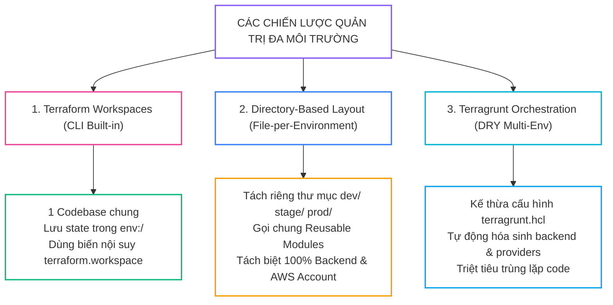
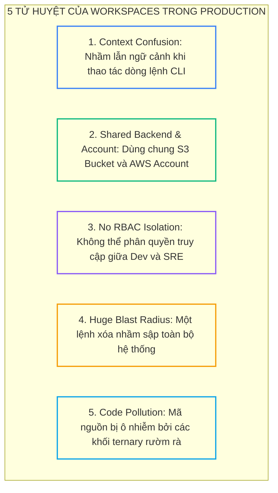
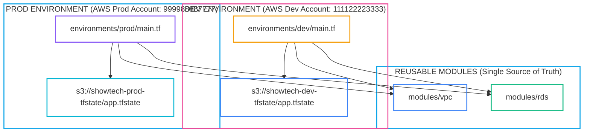
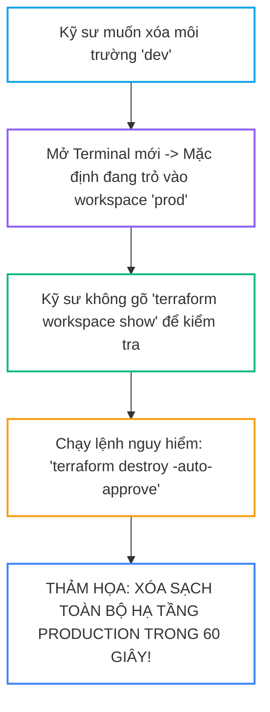


# Quản Trị Đa Môi Trường (Multi-Environment): Terraform Workspaces vs Cấu Trúc Thư Mục (Directory Layout) vs Terragrunt

Một trong những bài toán kiến trúc kinh điển nhất mà bất kỳ kỹ sư Platform SRE và DevOps nào cũng phải đối mặt khi mở rộng quy mô là: *Làm thế nào để triển khai cùng một bộ hạ tầng lên nhiều môi trường phân tán (Development, Staging, UAT, Production) một cách an toàn, nhất quán, cô lập bán kính ảnh hưởng (Blast Radius) và dễ bảo trì?*

- Làm sao để môi trường `dev` chỉ dùng máy chủ nhỏ `t3.micro` đơn lẻ, trong khi `prod` bắt buộc phải chạy cụm Multi-AZ `c5.2xlarge` với Auto Scaling, mã hóa KMS và bảo vệ xóa nhầm?
- Làm sao để ngăn chặn tuyệt đối thảm họa một kỹ sư gõ lệnh xóa hạ tầng `dev` nhưng máy trạm lại đang trỏ nhầm vào `prod` (**Context Confusion**)?
- Khi nào nên dùng tính năng có sẵn **Terraform Workspaces**, khi nào **bắt buộc phải phân tách theo Cấu trúc Thư mục (Directory-Based Layout)**, và khi nào nên áp dụng công cụ điều phối **Terragrunt**?

Bài viết này sẽ mổ xẻ chi tiết ưu nhược điểm của 3 trường phái quản trị đa môi trường hàng đầu, phân tích 5 tử huyệt khi lạm dụng Workspaces và hướng dẫn thiết lập kiến trúc phân lập tài khoản đám mây chuẩn Enterprise.

---

## 1. Ba Trường Phái Quản Trị Đa Môi Trường Trong Thực Tế



---

## 2. Bảng Ma Trận So Sánh Kỹ Thuật Chi Tiết (10 Tiêu Chí)

| Tiêu Chí Kỹ Thuật | Terraform CLI Workspaces | Directory-Based Layout | Terragrunt Orchestration |
| :--- | :--- | :--- | :--- |
| **Cấu Trúc Mã Nguồn** | 1 Thư mục HCL duy nhất | Tách thư mục `dev/`, `prod/` | Thư mục cấu hình `terragrunt.hcl` |
| **Phân Lập State Backend** | Chung S3 Bucket (`env:/<name>/...`) | **Tách biệt hoàn toàn từng S3 Bucket** | **Tách biệt hoàn toàn từng S3 Bucket** |
| **Phân Lập Tài Khoản AWS** | Rất khó (Thường chung 1 Account) | **Hoàn hảo (Mỗi env 1 AWS Account)** | **Hoàn hảo (Hỗ trợ Assume Role tự động)** |
| **Bán Kính Ảnh Hưởng (Blast Radius)**| **Cực lớn (Nguy cơ nhầm lẫn rất cao)**| **Nhỏ (Cô lập theo từng thư mục)** | **Rất nhỏ (Điều phối theo từng sub-module)** |
| **Phân Quyền RBAC / IAM** | Không thể phân quyền chi tiết | **Dễ dàng phân quyền theo thư mục & S3**| **Phân quyền chặt chẽ cấp IAM Role** |
| **Độ Phức Tạp Của Code HCL** | Rối rắm (Lạm dụng toán tử tam nguyên `? :`)| **Trong sáng, khai báo tường minh** | **Cực kỳ tinh gọn (DRY 100%)** |
| **Tự Động Hóa CI/CD** | Dễ nhầm lẫn khi switch workspace | **Rõ ràng theo đường dẫn Git path** | **Hỗ trợ `run-all plan/apply` cực mạnh** |
| **Thời Gian Thực Thi Apply** | Chạy toàn bộ tài nguyên cùng lúc | Có thể tách nhỏ từng tầng hạ tầng | Tự động chạy song song theo đồ thị DAG |
| **Công Cụ Bổ Sung** | Không (Dùng lệnh có sẵn) | Không (Thuần Terraform CLI) | Cần cài đặt thêm binary `terragrunt` |
| **Môi Trường Khuyến Nghị** | Môi trường tạm thời Ephemeral / Dev preview | **Dự án Enterprise từ vừa đến lớn** | **Tập đoàn quy mô lớn có hàng trăm cụm hạ tầng** |

---

## 3. Trường Phái 1: Terraform CLI Workspaces & 5 Tử Huyệt Production

### 3.1. Cơ Chế Hoạt Động Của Workspaces
Terraform Workspaces cho phép bạn duy trì nhiều file State độc lập nhưng sử dụng chung một thư mục code HCL:

```bash
# Tạo và chuyển đổi workspace
terraform workspace new dev
terraform workspace select prod
terraform workspace show
```

Trên S3 Remote Backend, các file State sẽ được lưu tại đường dẫn:
- Workspace `default`: `s3://tf-state-bucket/network.tfstate`
- Workspace `dev`: `s3://tf-state-bucket/env:/dev/network.tfstate`
- Workspace `prod`: `s3://tf-state-bucket/env:/prod/network.tfstate`

---

### 3.2. Năm Tử Huyệt Khi Dùng Workspaces Cho Môi Trường Production



1. **Nhầm lẫn ngữ cảnh (Context Confusion):** Dòng lệnh Terminal không hiển thị bạn đang đứng ở workspace nào. Kỹ sư tưởng mình đang ở `dev`, tự tin chạy `terraform apply -auto-approve` hoặc `terraform destroy`, nhưng thực tế máy trạm đang trỏ vào `prod`!
2. **Dùng chung S3 Bucket & Tài khoản Cloud:** Mọi workspace đều lưu state trong cùng một S3 Bucket. Một lỗi bảo mật hoặc quyền truy cập S3 ở môi trường dev có thể vô tình làm lộ mật khẩu hoặc phá hỏng state của Production.
3. **Không thể phân quyền (No RBAC Isolation):** Kỹ sư mới vào dự án (Junior) cần quyền deploy môi trường Dev cũng sẽ tự động có quyền apply lên Production nếu họ có quyền truy cập chung vào repo và backend.
4. **Bùng nổ mã nguồn rối rắm (Code Pollution):** Việc lạm dụng biến `terraform.workspace` với các biểu thức điều kiện `instance_type = terraform.workspace == "prod" ? "c5.2xlarge" : "t3.micro"` khiến file HCL trở nên cực kỳ khó đọc và dễ sai sót logic.

> [!CAUTION]
> **KHI NÀO NÊN DÙNG WORKSPACES?**
> Workspaces chỉ phù hợp cho:
> - Tạo các môi trường thử nghiệm tạm thời (**Ephemeral / Feature-branch Preview Environments**) cho từng Developer (ví dụ: `ws-alice-test`, `ws-bob-pr14`), sau khi kiểm thử xong sẽ chạy `destroy` và xóa workspace.
> - Tuyệt đối **KHÔNG DÙNG** Workspaces để phân tách giữa môi trường Development và Production của doanh nghiệp!

---

## 4. Trường Phái 2: Kiến Trúc Directory-Based Layout (Chuẩn Enterprise)

Mô hình chuẩn mực nhất là phân tách rõ ràng thành các thư mục riêng biệt cho từng môi trường, kết hợp với các **Reusable Modules** dùng chung:

```text
terraform-enterprise-root/
├── modules/                        # Kho lưu trữ các Modules dùng chung
│   ├── vpc/
│   ├── rds/
│   └── eks/
└── environments/                   # Phân lập hoàn toàn các môi trường
    ├── dev/
    │   ├── backend.hcl             # S3 Bucket riêng cho Dev Account
    │   ├── terraform.tfvars        # Giá trị biến cho Dev (instance nhỏ, 1 AZ)
    │   └── main.tf                 # Gọi modules dùng chung
    ├── staging/
    │   ├── backend.hcl             # S3 Bucket riêng cho Staging Account
    │   ├── terraform.tfvars        # Cấu hình tiệm cận Production
    │   └── main.tf
    └── prod/
        ├── backend.hcl             # S3 Bucket riêng cho Prod Account (KMS CMK)
        ├── terraform.tfvars        # Cấu hình High Availability Multi-AZ
        └── main.tf
```



### Ưu Điểm Tuyệt Đối Của Directory-Based Layout:
1. **Cô Lập Bán Kính Ảnh Hưởng (Blast Radius Containment):** Khi bạn đứng trong thư mục `environments/dev/`, bạn **hoàn toàn không có khả năng chạm vào** tài nguyên của `prod`.
2. **Phân Quyền Tuyệt Đối Cấp Độ Tài Khoản (Multi-Account Security):** Môi trường Dev chạy trên AWS Account `111122223333`, môi trường Prod chạy trên AWS Account `999988887777` với Remote State S3 nằm độc lập. Kỹ sư Dev không hề có IAM Credential của Prod Account.
3. **CI/CD Trực Quan:** Pipeline chỉ kích hoạt deploy Production khi có thay đổi trong thư mục `environments/prod/**`.

---

## 5. Trường Phái 3: Tiến Hóa Kiến Trúc Với Terragrunt

Khi số lượng môi trường tăng lên (Dev, QA, Staging, UAT, Prod-US, Prod-EU), cấu trúc Directory-Based Layout bắt đầu xuất hiện sự lặp lại của các khối `backend` và `provider`.

**Terragrunt** đóng vai trò là một tầng bọc mỏng (Thin Wrapper) giúp tự động hóa và triệt tiêu 100% sự lặp lại này:

```hcl
# File: environments/prod/terragrunt.hcl
include "root" {
  path = find_in_parent_folders()
}

terraform {
  source = "git::https://github.com/showtech-org/infrastructure-modules.git//vpc?ref=v2.0.0"
}

inputs = {
  environment = "production"
  cidr_block  = "10.100.0.0/16"
  enable_nat  = true
}
```

---

## 6. Phân Tích Cạm Bẫy Thực Chiến: Thảm Họa "Xóa Nhầm Production Do Đứng Sai Workspace"

### Tình Huống Sự Cố Thực Tế:
Vào lúc <span class="badge badge--rose">🕒 10:30 AM</span>, Tại một công ty phần mềm, đội ngũ áp dụng mô hình Terraform Workspaces (`dev`, `staging`, `prod`) trong cùng một thư mục HCL.

Vào chiều thứ Sáu, một kỹ sư cần dọn dẹp môi trường thử nghiệm `dev` để tiết kiệm chi phí cuối tuần. Kỹ sư mở cửa sổ Terminal và gõ lệnh:
```bash
terraform destroy -auto-approve
```

### Hậu Quả & Log Lỗi Thực Tế:
```log
# Trích đoạn log kinh hoàng từ Terraform CLI
aws_route53_zone.production_primary: Destroying... [id=Z0123456789ABCDEF]
aws_eks_cluster.prod_cluster: Destroying... [id=showtech-prod-eks]
aws_db_instance.postgres_prod: Destroying... [id=rds-prod-master]

# KỸ SƯ QUÊN KHÔNG KIỂM TRA WORKSPACE!
# NGỮ CẢNH TERMINAL ĐANG ĐỨNG Ở: workspace 'prod'!
# TOÀN BỘ CỤM KUBERNETES, DNS VÀ CƠ SỞ DỮ LIỆU SẢN XUẤT ĐÃ BỊ XÓA SẠCH!
```



### 5-Whys Root Cause Analysis:
1. <span class="badge badge--primary">Why 1</span> **Tại sao hạ tầng Production bị xóa sổ?** $\rightarrow$ Vì lệnh `terraform destroy` được thực thi trên State của workspace `prod`.
2. <span class="badge badge--primary">Why 2</span> **Tại sao kỹ sư lại chạy trên workspace prod?** $\rightarrow$ Vì kỹ sư ngộ nhận rằng Terminal đang ở workspace `dev` (Context Confusion).
3. <span class="badge badge--primary">Why 3</span> **Tại sao hệ thống cho phép xóa hạ tầng Production dễ dàng như vậy?** $\rightarrow$ Vì sử dụng chung một mã nguồn HCL, chung tài khoản AWS và không có rào chắn phân lập môi trường.
4. <span class="badge badge--primary">Why 4</span> **Tại sao không có bước cảnh báo?** $\rightarrow$ Do kỹ sư sử dụng cờ nguy hiểm `-auto-approve` trên môi trường dùng chung.
5. **<span class="badge badge--emerald">Root Cause Remedy</span> **<span class="badge badge--emerald">Root Cause Remedy</span> **<span class="badge badge--emerald">Root Cause Remedy</span> **Biện pháp khắc phục chuẩn SRE:**:**:**:**
   - **Xóa bỏ hoàn toàn mô hình Workspaces cho Production.**
   - **Chuyển đổi 100% sang kiến trúc Directory-Based Layout với tài khoản AWS riêng biệt.**
   - **Thêm rào chắn `prevent_destroy = true` và khóa quyền xóa State Backend của Production.**

---

## 7. Hands-on Lab: Triển Khai Kiến Trúc Directory-Based Đa Môi Trường (8 Bước)

| Bước | Lệnh / Thao Tác | Mục Đích Kỹ Thuật |
| :---: | :--- | :--- |
| <span class="badge badge--primary">01</span> | `Thao tác 1` | Tạo cấu trúc thư mục phân lập |
| <span class="badge badge--cyan">02</span> | `Thao tác 2` | Viết Reusable Module Storage |
| <span class="badge badge--indigo">03</span> | `Thao tác 3` | Cấu hình môi trường Development |
| <span class="badge badge--amber">04</span> | `Thao tác 4` | Cấu hình môi trường Production (Độc lập hoàn toàn) |
| <span class="badge badge--emerald">05</span> | `Thao tác 5` | Khởi tạo và Apply môi trường Dev |
| <span class="badge badge--primary">06</span> | `Thao tác 6` | Khởi tạo và Apply môi trường Prod |
| <span class="badge badge--rose">07</span> | `Thao tác 7` | Kiểm tra tính phân lập của 2 State File |
| <span class="badge badge--emerald">08</span> | `Thao tác 8` | Thử nghiệm xóa môi trường Dev mà Prod vẫn nguyên vẹn |

### Bước 1: Tạo cấu trúc thư mục phân lập
```bash
mkdir -p /tmp/multi-env-lab/modules/storage
mkdir -p /tmp/multi-env-lab/environments/dev
mkdir -p /tmp/multi-env-lab/environments/prod
cd /tmp/multi-env-lab
```

### Bước 2: Viết Reusable Module Storage
```bash
cat << 'EOF' > modules/storage/main.tf
terraform {
  required_version = ">= 1.7.0"
  required_providers {
    local = { source = "hashicorp/local", version = "~> 2.5.0" }
  }
}

variable "env_name" { type = string }
variable "capacity" { type = number }

resource "local_file" "storage_manifest" {
  filename = "${path.module}/storage_${var.env_name}.json"
  content  = jsonencode({
    environment = var.env_name
    capacity_gb = var.capacity
    tier        = var.env_name == "prod" ? "Premium-SSD" : "Standard-HDD"
  })
}

output "config_path" {
  value = local_file.storage_manifest.filename
}
EOF
```

### Bước 3: Cấu hình môi trường Development
```bash
cat << 'EOF' > environments/dev/main.tf
terraform {
  required_version = ">= 1.7.0"
}

module "dev_storage" {
  source   = "../../modules/storage"
  env_name = "dev"
  capacity = 20
}

output "dev_file" {
  value = module.dev_storage.config_path
}
EOF
```

### Bước 4: Cấu hình môi trường Production (Độc lập hoàn toàn)
```bash
cat << 'EOF' > environments/prod/main.tf
terraform {
  required_version = ">= 1.7.0"
}

module "prod_storage" {
  source   = "../../modules/storage"
  env_name = "prod"
  capacity = 500
}

output "prod_file" {
  value = module.prod_storage.config_path
}
EOF
```

### Bước 5: Khởi tạo và Apply môi trường Dev
```bash
cd environments/dev
terraform init && terraform apply -auto-approve
```

### Bước 6: Khởi tạo và Apply môi trường Prod
```bash
cd ../prod
terraform init && terraform apply -auto-approve
```

### Bước 7: Kiểm tra tính phân lập của 2 State File
```bash
# Kiểm tra State của Dev
cd ../dev && terraform state list

# Kiểm tra State của Prod
cd ../prod && terraform state list
```
Xác nhận State của Dev và Prod hoàn toàn tách biệt, không thể gây ảnh hưởng chéo!

### Bước 8: Thử nghiệm xóa môi trường Dev mà Prod vẫn nguyên vẹn
```bash
cd ../dev && terraform destroy -auto-approve

# Kiểm tra file của Prod vẫn còn nguyên
ls -la ../../modules/storage/storage_prod.json

# Dọn dẹp môi trường
cd ../prod && terraform destroy -auto-approve
cd /tmp && rm -rf /tmp/multi-env-lab
```

---

## 8. 10 Câu Hỏi Tự Kiểm Tra Chuyên Sâu (Self-Check Q&A)


<details class="qa-card">
<summary class="qa-summary">
  <div class="qa-summary-left">
    <span class="qa-num-badge">Q01</span>
    <span>Tại sao HashiCorp khuyến cáo KHÔNG DÙNG Terraform Workspaces cho môi trường Production?</span>
  </div>
  <span class="qa-chevron">
    <svg width="18" height="18" fill="none" stroke="currentColor" stroke-width="2.5" viewBox="0 0 24 24"><polyline points="6 9 12 15 18 9"></polyline></svg>
  </span>
</summary>
<div class="qa-answer">
  <div class="qa-answer-header">
    <svg width="14" height="14" fill="none" stroke="currentColor" stroke-width="2" viewBox="0 0 24 24"><path d="M22 11.08V12a10 10 0 1 1-5.93-9.14"></path><polyline points="22 4 12 14.01 9 11.01"></polyline></svg>
    <span>Phân Tích &amp; Lời Giải Kỹ Thuật</span>
  </div>
  <p style="margin: 0.4rem 0;">Vì Workspaces dùng chung một Remote State Bucket, chung tài khoản Cloud Provider và không có cơ chế cô lập bán kính ảnh hưởng (Blast Radius). Kỹ sư rất dễ nhầm lẫn ngữ cảnh (Context Confusion) và gõ lệnh xóa nhầm hạ tầng Production khi tưởng mình đang ở Dev.</p>
</div>
</details>

<details class="qa-card">
<summary class="qa-summary">
  <div class="qa-summary-left">
    <span class="qa-num-badge">Q02</span>
    <span>Trong trường hợp nào thì Terraform Workspaces là giải pháp lý tưởng?</span>
  </div>
  <span class="qa-chevron">
    <svg width="18" height="18" fill="none" stroke="currentColor" stroke-width="2.5" viewBox="0 0 24 24"><polyline points="6 9 12 15 18 9"></polyline></svg>
  </span>
</summary>
<div class="qa-answer">
  <div class="qa-answer-header">
    <svg width="14" height="14" fill="none" stroke="currentColor" stroke-width="2" viewBox="0 0 24 24"><path d="M22 11.08V12a10 10 0 1 1-5.93-9.14"></path><polyline points="22 4 12 14.01 9 11.01"></polyline></svg>
    <span>Phân Tích &amp; Lời Giải Kỹ Thuật</span>
  </div>
  <p style="margin: 0.4rem 0;">Workspaces cực kỳ lý tưởng cho các <b style="color: var(--accent-primary);">môi trường thử nghiệm tạm thời (Ephemeral / Preview Environments)</b> được tạo tự động cho từng Pull Request hoặc từng Developer, sau đó được hủy hoàn toàn khi kiểm thử xong.</p>
</div>
</details>

<details class="qa-card">
<summary class="qa-summary">
  <div class="qa-summary-left">
    <span class="qa-num-badge">Q03</span>
    <span>Ưu điểm lớn nhất của kiến trúc Directory-Based Layout là gì?</span>
  </div>
  <span class="qa-chevron">
    <svg width="18" height="18" fill="none" stroke="currentColor" stroke-width="2.5" viewBox="0 0 24 24"><polyline points="6 9 12 15 18 9"></polyline></svg>
  </span>
</summary>
<div class="qa-answer">
  <div class="qa-answer-header">
    <svg width="14" height="14" fill="none" stroke="currentColor" stroke-width="2" viewBox="0 0 24 24"><path d="M22 11.08V12a10 10 0 1 1-5.93-9.14"></path><polyline points="22 4 12 14.01 9 11.01"></polyline></svg>
    <span>Phân Tích &amp; Lời Giải Kỹ Thuật</span>
  </div>
  <p style="margin: 0.4rem 0;">Cô lập hoàn toàn bán kính ảnh hưởng (Blast Radius Isolation) và hỗ trợ mô hình Multi-Account Security. Môi trường Dev và Prod có thể chạy trên 2 tài khoản AWS hoàn toàn tách biệt với các S3 State Bucket riêng, giúp phân quyền IAM Least-Privilege tuyệt đối.</p>
</div>
</details>

<details class="qa-card">
<summary class="qa-summary">
  <div class="qa-summary-left">
    <span class="qa-num-badge">Q04</span>
    <span>Biến nội suy <code>terraform.workspace</code> trả về giá trị gì?</span>
  </div>
  <span class="qa-chevron">
    <svg width="18" height="18" fill="none" stroke="currentColor" stroke-width="2.5" viewBox="0 0 24 24"><polyline points="6 9 12 15 18 9"></polyline></svg>
  </span>
</summary>
<div class="qa-answer">
  <div class="qa-answer-header">
    <svg width="14" height="14" fill="none" stroke="currentColor" stroke-width="2" viewBox="0 0 24 24"><path d="M22 11.08V12a10 10 0 1 1-5.93-9.14"></path><polyline points="22 4 12 14.01 9 11.01"></polyline></svg>
    <span>Phân Tích &amp; Lời Giải Kỹ Thuật</span>
  </div>
  <p style="margin: 0.4rem 0;">Trả về tên của Workspace hiện tại đang được kích hoạt (ví dụ: <code>"default"</code>, <code>"dev"</code>, <code>"prod"</code>).</p>
</div>
</details>

<details class="qa-card">
<summary class="qa-summary">
  <div class="qa-summary-left">
    <span class="qa-num-badge">Q05</span>
    <span>Khi sử dụng S3 Remote Backend, các tệp State của các Workspace khác nhau được lưu ở đâu?</span>
  </div>
  <span class="qa-chevron">
    <svg width="18" height="18" fill="none" stroke="currentColor" stroke-width="2.5" viewBox="0 0 24 24"><polyline points="6 9 12 15 18 9"></polyline></svg>
  </span>
</summary>
<div class="qa-answer">
  <div class="qa-answer-header">
    <svg width="14" height="14" fill="none" stroke="currentColor" stroke-width="2" viewBox="0 0 24 24"><path d="M22 11.08V12a10 10 0 1 1-5.93-9.14"></path><polyline points="22 4 12 14.01 9 11.01"></polyline></svg>
    <span>Phân Tích &amp; Lời Giải Kỹ Thuật</span>
  </div>
  <p style="margin: 0.4rem 0;">Được lưu trong cùng một S3 Bucket nhưng nằm dưới tiền tố đặc biệt <code>env:/&lt;workspace_name&gt;/&lt;state_key&gt;</code>. Ví dụ: <code>s3://my-bucket/env:/dev/app.tfstate</code>.</p>
</div>
</details>

<details class="qa-card">
<summary class="qa-summary">
  <div class="qa-summary-left">
    <span class="qa-num-badge">Q06</span>
    <span>Terragrunt giải quyết nhược điểm gì của kiến trúc Directory-Based Layout?</span>
  </div>
  <span class="qa-chevron">
    <svg width="18" height="18" fill="none" stroke="currentColor" stroke-width="2.5" viewBox="0 0 24 24"><polyline points="6 9 12 15 18 9"></polyline></svg>
  </span>
</summary>
<div class="qa-answer">
  <div class="qa-answer-header">
    <svg width="14" height="14" fill="none" stroke="currentColor" stroke-width="2" viewBox="0 0 24 24"><path d="M22 11.08V12a10 10 0 1 1-5.93-9.14"></path><polyline points="22 4 12 14.01 9 11.01"></polyline></svg>
    <span>Phân Tích &amp; Lời Giải Kỹ Thuật</span>
  </div>
  <p style="margin: 0.4rem 0;">Terragrunt giúp loại bỏ 100% sự lặp lại mã nguồn (DRY Principle) của các khối cấu hình <code>backend "s3"</code> và <code>provider "aws"</code> ở từng thư mục môi trường thông qua cơ chế kế thừa <code>find_in_parent_folders()</code>.</p>
</div>
</details>

<details class="qa-card">
<summary class="qa-summary">
  <div class="qa-summary-left">
    <span class="qa-num-badge">Q07</span>
    <span>Làm thế nào để kiểm tra bạn đang đứng ở Workspace nào trước khi chạy apply?</span>
  </div>
  <span class="qa-chevron">
    <svg width="18" height="18" fill="none" stroke="currentColor" stroke-width="2.5" viewBox="0 0 24 24"><polyline points="6 9 12 15 18 9"></polyline></svg>
  </span>
</summary>
<div class="qa-answer">
  <div class="qa-answer-header">
    <svg width="14" height="14" fill="none" stroke="currentColor" stroke-width="2" viewBox="0 0 24 24"><path d="M22 11.08V12a10 10 0 1 1-5.93-9.14"></path><polyline points="22 4 12 14.01 9 11.01"></polyline></svg>
    <span>Phân Tích &amp; Lời Giải Kỹ Thuật</span>
  </div>
  <p style="margin: 0.4rem 0;">Chạy lệnh <code>terraform workspace show</code> hoặc xem dấu sao <code>*</code> khi chạy lệnh <code>terraform workspace list</code>.</p>
</div>
</details>

<details class="qa-card">
<summary class="qa-summary">
  <div class="qa-summary-left">
    <span class="qa-num-badge">Q08</span>
    <span>Tại sao việc lạm dụng toán tử điều kiện tam nguyên (<code>? :</code>) theo workspace lại là Anti-Pattern?</span>
  </div>
  <span class="qa-chevron">
    <svg width="18" height="18" fill="none" stroke="currentColor" stroke-width="2.5" viewBox="0 0 24 24"><polyline points="6 9 12 15 18 9"></polyline></svg>
  </span>
</summary>
<div class="qa-answer">
  <div class="qa-answer-header">
    <svg width="14" height="14" fill="none" stroke="currentColor" stroke-width="2" viewBox="0 0 24 24"><path d="M22 11.08V12a10 10 0 1 1-5.93-9.14"></path><polyline points="22 4 12 14.01 9 11.01"></polyline></svg>
    <span>Phân Tích &amp; Lời Giải Kỹ Thuật</span>
  </div>
  <p style="margin: 0.4rem 0;">Vì nó làm ô nhiễm mã nguồn HCL, tạo ra các khối logic rẽ nhánh phức tạp khó đọc, khó kiểm thử đơn vị và dễ dẫn tới lỗi sai cấu hình ngầm giữa các môi trường.</p>
</div>
</details>

<details class="qa-card">
<summary class="qa-summary">
  <div class="qa-summary-left">
    <span class="qa-num-badge">Q09</span>
    <span>Trong mô hình Directory-Based, làm thế nào để đảm bảo mã nguồn giữa Dev và Prod không bị lệch pha?</span>
  </div>
  <span class="qa-chevron">
    <svg width="18" height="18" fill="none" stroke="currentColor" stroke-width="2.5" viewBox="0 0 24 24"><polyline points="6 9 12 15 18 9"></polyline></svg>
  </span>
</summary>
<div class="qa-answer">
  <div class="qa-answer-header">
    <svg width="14" height="14" fill="none" stroke="currentColor" stroke-width="2" viewBox="0 0 24 24"><path d="M22 11.08V12a10 10 0 1 1-5.93-9.14"></path><polyline points="22 4 12 14.01 9 11.01"></polyline></svg>
    <span>Phân Tích &amp; Lời Giải Kỹ Thuật</span>
  </div>
  <p style="margin: 0.4rem 0;">Cả hai môi trường Dev và Prod đều phải gọi chung các <b style="color: var(--accent-primary);">Reusable Modules</b> đã được kiểm thử và gắn thẻ phiên bản bất biến (Semantic Version Tags) từ Git hoặc Private Registry.</p>
</div>
</details>

<details class="qa-card">
<summary class="qa-summary">
  <div class="qa-summary-left">
    <span class="qa-num-badge">Q10</span>
    <span>Quy trình thăng hạng hạ tầng (Promotion Pipeline) từ Dev lên Staging và Prod hoạt động như thế nào trong GitOps?</span>
  </div>
  <span class="qa-chevron">
    <svg width="18" height="18" fill="none" stroke="currentColor" stroke-width="2.5" viewBox="0 0 24 24"><polyline points="6 9 12 15 18 9"></polyline></svg>
  </span>
</summary>
<div class="qa-answer">
  <div class="qa-answer-header">
    <svg width="14" height="14" fill="none" stroke="currentColor" stroke-width="2" viewBox="0 0 24 24"><path d="M22 11.08V12a10 10 0 1 1-5.93-9.14"></path><polyline points="22 4 12 14.01 9 11.01"></polyline></svg>
    <span>Phân Tích &amp; Lời Giải Kỹ Thuật</span>
  </div>
  <p style="margin: 0.4rem 0;">Kỹ sư cập nhật phiên bản Module trong thư mục <code>environments/dev/</code> $\rightarrow$ Test thành công $\rightarrow$ Mở Pull Request cập nhật phiên bản Module trong <code>environments/staging/</code> $\rightarrow$ Kiểm thử tích hợp $\rightarrow$ Mở Pull Request cập nhật sang <code>environments/prod/</code> với sự phê duyệt của Tech Lead.</p>
</div>
</details>

---

## 9. Tổng Kết & Lộ Trình Bài Học Tiếp Theo

Lựa chọn đúng chiến lược quản trị đa môi trường bằng **Directory-Based Layout** kết hợp **Reusable Modules** là tấm khiên an ninh vững chắc bảo vệ hạ tầng Production của doanh nghiệp khỏi mọi nguy cơ nhầm lẫn thao tác.

Trong **[[Bài 13] Vòng Lặp Nâng Cao: count vs for_each, Thảm Họa Index Shifting & Khối moved Cứu Hộ](terraform-13-13-vong-lap-nang-cao-count-vs-for-each-tham-hoa-index-shifting-va-moved-block.html)**, chúng ta sẽ đi sâu vào các cơ chế lặp nâng cao: Phân tích thảm họa Index Shifting khi xóa phần tử mảng trong `count`, làm chủ `for_each` với cấu trúc Map/Set và kỹ thuật tái cấu trúc an toàn với khối `moved {}`!

