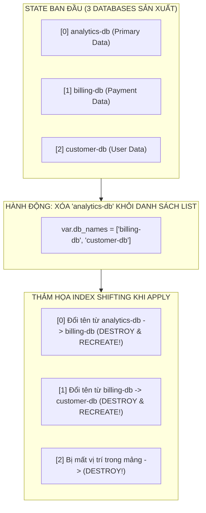
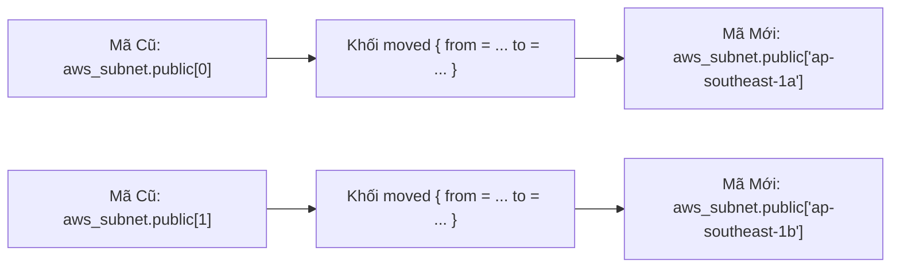


# Vòng Lặp Nâng Cao: Count vs For_Each, Thảm Họa Index Shifting & Kỹ Thuật Refactor Zero-Downtime Bằng Moved Block

Khi viết mã nguồn Terraform, nhu cầu khởi tạo hàng loạt tài nguyên có cấu trúc tương tự nhau (ví dụ: tạo 6 Subnets đa vùng, 10 máy chủ cơ sở dữ liệu phân tán, hoặc hàng chục IAM Roles) là một yêu cầu cơ bản. Để đáp ứng nhu cầu này, Terraform cung cấp hai siêu tham số vòng lặp (**Meta-arguments**): **`count`** và **`for_each`**.

Tuy nhiên, rất nhiều kỹ sư mới bắt đầu thường chọn `count` vì sự đơn giản và quen thuộc của chỉ số mảng, để rồi phải trả giá đắt bằng một trong những sự cố kinh hoàng nhất trong thế giới IaC: **Thảm họa Index Shifting (Dịch chuyển chỉ mục mảng)** — một thao tác xóa hoặc chèn 1 phần tử nhỏ ở đầu danh sách có thể khiến Terraform **xóa sạch và tái tạo lại toàn bộ các cơ sở dữ liệu và cụm máy chủ đang chạy trên Production**!

Trong bài viết chuyên sâu này, chúng ta sẽ mổ xẻ tận gốc cơ chế đánh địa chỉ của `count` vs `for_each`, hiểu rõ tại sao `for_each` là chuẩn mực bắt buộc cho mọi tài nguyên có trạng thái (**Stateful Resources**), trường hợp hợp lệ duy nhất của `count` (Conditional Resource Toggle 0/1) và làm chủ kỹ thuật di trú từ `count` sang `for_each` **không gây ra 1 giây downtime nào** bằng khối `moved {}` trong Terraform 1.1+.

---

## 1. Cơ Chế Integer Indexing Của `count` & Thảm Họa "Index Shifting"

Meta-argument `count` định vị các tài nguyên trong State theo **chỉ số số nguyên tăng dần (Integer Index: `[0], [1], [2], ...`)**:

```hcl
variable "db_names" {
  type    = list(string)
  default = ["analytics-db", "billing-db", "customer-db"]
}

resource "aws_db_instance" "databases" {
  count          = length(var.db_names)
  identifier     = var.db_names[count.index]
  instance_class = "db.t4g.medium"
  engine         = "postgres"
}
```

Trong tệp State, Terraform ghi nhận 3 tài nguyên với địa chỉ:
- `aws_db_instance.databases[0]` $\rightarrow$ `analytics-db`
- `aws_db_instance.databases[1]` $\rightarrow$ `billing-db`
- `aws_db_instance.databases[2]` $\rightarrow$ `customer-db`



### Tại Sao Thảm Họa Này Lại Diễn Ra?
Khi bạn xóa `"analytics-db"` ở vị trí đầu tiên:
1. `"billing-db"` bị đẩy lên chiếm vị trí `[0]`. Terraform nhìn vào State thấy `[0]` đang là `analytics-db`, nay HCL đòi đổi `identifier` thành `billing-db` (một thuộc tính bất biến bắt buộc phải Re-create) $\rightarrow$ **Xóa `analytics-db` và tạo mới database `billing-db` rỗng!**
2. `"customer-db"` bị đẩy lên vị trí `[1]`. Terraform thấy `[1]` trước đây là `billing-db`, nay đổi tên thành `customer-db` $\rightarrow$ **Xóa `billing-db` và tạo mới database `customer-db` rỗng!**
3. Vị trí `[2]` không còn tồn tại trong mảng $\rightarrow$ **Xóa nốt `customer-db` cũ!**

> [!CAUTION]
> **HẬU QUẢ KINH HOÀNG:**
> Chỉ vì muốn xóa 1 database thử nghiệm, **bạn đã vô tình xóa sạch và tái tạo mới toàn bộ 3 database sản xuất**, làm mất trắng toàn bộ dữ liệu giao dịch của doanh nghiệp!

---

## 2. Vị Cứu Tinh: Key-Based Addressing Của `for_each`

Khác với `count`, meta-argument **`for_each` định vị tài nguyên bằng Khóa Định Danh Chuỗi (String Map Key)** bất biến:

```hcl
variable "db_configs" {
  type = map(object({
    instance_class = string
    allocated_gb   = number
  }))
  default = {
    "analytics" = { instance_class = "db.t4g.small",  allocated_gb = 20 }
    "billing"   = { instance_class = "db.r6g.xlarge", allocated_gb = 100 }
    "customer"  = { instance_class = "db.r6g.2xlarge", allocated_gb = 200 }
  }
}

resource "aws_db_instance" "databases" {
  for_each = var.db_configs

  identifier        = "${each.key}-db"
  instance_class    = each.value.instance_class
  allocated_storage = each.value.allocated_gb
  engine            = "postgres"
}
```

Địa chỉ tài nguyên trong State lúc này là:
- `aws_db_instance.databases["analytics"]`
- `aws_db_instance.databases["billing"]`
- `aws_db_instance.databases["customer"]`

Khi bạn xóa phần tử `"analytics"` khỏi Map:
- Terraform đối chiếu State: Chỉ có duy nhất `aws_db_instance.databases["analytics"]` bị xóa.
- Hai database `["billing"]` và `["customer"]` **hoàn toàn không bị ảnh hưởng**, không bị dịch chuyển index và không có bất kỳ giây phút downtime nào!

---

## 3. Bảng So Sánh Kỹ Thuật Toàn Diện: `count` vs `for_each`

| Tiêu Chí So Sánh | Meta-Argument `count` | Meta-Argument `for_each` |
| :--- | :--- | :--- |
| **Kiểu Dữ Liệu Đầu Vào** | Số nguyên `number` (hoặc `length(list)`) | Cấu trúc `map` hoặc `set of strings` |
| **Cơ Chế Định Danh State** | Chỉ mục số nguyên (`[0], [1], [2]`) | Khóa định danh chuỗi (`["key_name"]`) |
| **Rủi Ro Khi Xóa Phần Tử** | **Cực kỳ nguy hiểm (Index Shifting)** | **Tuyệt đối an toàn (Chỉ xóa đúng key đó)** |
| **Biến Đối Tượng Nội Bộ** | `count.index` | `each.key` và `each.value` |
| **Hỗ Trợ Dynamic Attributes** | Kém (Mọi instance dùng chung 1 logic)| **Tối ưu (Mỗi instance có thuộc tính riêng)** |
| **Tài Nguyên Phù Hợp** | **Stateless Resources** (EC2 Worker rác) | **Stateful Resources** (RDS, S3, Subnets, IAM) |
| **Áp Dụng Trên Module** | Hỗ trợ từ Terraform 0.13+ | Hỗ trợ từ Terraform 0.13+ |

---

## 4. Trường Hợp Hợp Lệ Duy Nhất Của `count`: Conditional Resource Toggle (0 / 1)

Trường hợp duy nhất mà `count` được khuyến nghị sử dụng trong các hệ thống Enterprise là **Bật/Tắt sự tồn tại của một tài nguyên đơn lẻ (Conditional Feature Flag)** dựa trên biểu thức điều kiện Boolean:

```hcl
variable "enable_elastic_ip" {
  type        = bool
  default     = false
  description = "Co bat Elastic IP cho may chu hay khong"
}

# Nếu enable_elastic_ip = true -> count = 1 (Tạo tài nguyên)
# Nếu enable_elastic_ip = false -> count = 0 (Không tạo tài nguyên)
resource "aws_eip" "web_ip" {
  count  = var.enable_elastic_ip ? 1 : 0
  domain = "vpc"

  tags = {
    Name = "showtech-eip-prod"
  }
}

# Truy xuất an toàn giá trị Output bằng cú pháp splat operator [*] hoặc one()
output "public_ip" {
  value       = one(aws_eip.web_ip[*].public_ip)
  description = "Dia chi IP Public (tra ve null neu enable_elastic_ip = false)"
}
```

> [!TIP]
> **HÀM `one()` VÀ SPLAT OPERATOR `[*]`:**
> Khi dùng `count = 0/1`, hãy luôn sử dụng hàm `one(resource[*].attribute)` để truy xuất output. Hàm `one()` tự động trả về giá trị chuỗi nếu có 1 phần tử, hoặc trả về `null` an toàn nếu `count = 0` mà không gây lỗi index out of bounds.

---

## 5. Di Trú Zero-Downtime Từ `count` Sang `for_each` Bằng Khối `moved {}`

Từ phiên bản Terraform 1.1+, bạn có thể viết các khối **`moved {}`** trực tiếp trong mã HCL để thông báo cho Terraform Core tự động di chuyển State từ chỉ mục số nguyên sang Map key mà không cần chạy lệnh CLI `state mv` thủ công:



### Mã Nguồn Khối `moved {}` Khai Báo Trong HCL:

```hcl
# refactor_migration.tf - Khai báo di trú State tự động trong HCL
moved {
  from = aws_subnet.public[0]
  to   = aws_subnet.public["ap-southeast-1a"]
}

moved {
  from = aws_subnet.public[1]
  to   = aws_subnet.public["ap-southeast-1b"]
}
```

Khi bạn chạy `terraform plan`, Terraform sẽ tự động tái cấu trúc State và thông báo:
```text
Plan: 0 to add, 0 to change, 0 to destroy.
```

---

## 6. Phân Tích Cạm Bẫy Thực Chiến: Thảm Họa Mất EBS Volume Khi Xóa Subnet Bằng `count`

### Tình Huống Sự Cố Thực Tế:
Một nhóm kỹ sư cấu hình danh sách Subnets bằng `count`:
```hcl
variable "subnet_zones" {
  default = ["ap-southeast-1a", "ap-southeast-1b", "ap-southeast-1c"]
}

resource "aws_subnet" "app_subnets" {
  count             = length(var.subnet_zones)
  availability_zone = var.subnet_zones[count.index]
  # ...
}
```

Sau một đợt tối ưu hóa, kỹ sư xóa bỏ vùng `ap-southeast-1a` ở đầu danh sách vì chi phí cao.

### Hậu Quả & Log Lỗi Thực Tế:
```log
Terraform will perform the following actions:

  # aws_subnet.app_subnets[0] must be replaced
-/+ resource "aws_subnet" "app_subnets" {
      ~ availability_zone = "ap-southeast-1a" -> "ap-southeast-1b" # (forces replacement)
    }

  # aws_ebs_volume.db_volume[0] must be replaced
-/+ resource "aws_ebs_volume" "db_volume" {
      ~ availability_zone = "ap-southeast-1a" -> "ap-southeast-1b" # (forces replacement)
    }

Plan: 2 to add, 0 to change, 3 to destroy.
# TOÀN BỘ Ổ ĐĨA EBS CHỨA DỮ LIỆU ĐANG GẮN VÀO MÁY CHỦ BỊ XÓA SỔ VÌ FORCE NEW!
```

### 5-Whys Root Cause Analysis:
1. **Tại sao ổ đĩa EBS bị xóa và tạo lại?** $\rightarrow$ Vì `availability_zone` của Subnet `[0]` bị đổi từ `1a` sang `1b`.
2. **Tại sao `availability_zone` lại bị đổi?** $\rightarrow$ Do hiện tượng Index Shifting: Vùng `1b` nhảy lên chiếm vị trí index `[0]`.
3. **Tại sao kỹ sư lại dùng `count` cho tài nguyên có trạng thái?** $\rightarrow$ Do thiếu hiểu biết về sự khác biệt giữa `count` và `for_each`.
4. **Biện pháp khắc phục tận gốc:**
   - **Chuyển đổi 100% tài nguyên mạng và lưu trữ sang `for_each = toset(var.subnet_zones)`.**
   - **Sử dụng khối `moved {}` để di trú an toàn không downtime.**

---

## 7. Hands-on Lab: Tái Hiện & Hóa Giải Index Shifting Bằng `moved {}` (8 Bước)

### Bước 1: Khởi tạo thư mục thực hành
```bash
mkdir -p /tmp/count-foreach-lab && cd /tmp/count-foreach-lab
terraform init
```

### Bước 2: Tạo tài nguyên bằng `count` ban đầu
```bash
cat << 'EOF' > main.tf
terraform {
  required_providers {
    local = { source = "hashicorp/local", version = "~> 2.5.0" }
  }
}

variable "service_list" {
  type    = list(string)
  default = ["auth", "billing", "order"]
}

resource "local_file" "services" {
  count    = length(var.service_list)
  filename = "${path.module}/service_${var.service_list[count.index]}.txt"
  content  = "Service: ${var.service_list[count.index]}"
}
EOF

terraform apply -auto-approve
```

### Bước 3: Xem địa chỉ State hiện tại dạng Integer Index
```bash
terraform state list
# Kết quả:
# local_file.services[0] -> auth
# local_file.services[1] -> billing
# local_file.services[2] -> order
```

### Bước 4: Tái hiện thảm họa Index Shifting (Xóa "auth" ở đầu danh sách)
```bash
sed -i 's/"auth", //g' main.tf
terraform plan
```
Quan sát Terraform báo: **Destroy & Recreate toàn bộ file** vì bị dịch chuyển index!

### Bước 5: Khôi phục lại danh sách và chuyển đổi code sang `for_each`
```bash
cat << 'EOF' > main.tf
terraform {
  required_providers {
    local = { source = "hashicorp/local", version = "~> 2.5.0" }
  }
}

variable "service_set" {
  type    = set(string)
  default = ["auth", "billing", "order"]
}

resource "local_file" "services" {
  for_each = var.service_set
  filename = "${path.module}/service_${each.key}.txt"
  content  = "Service: ${each.key}"
}
EOF
```

### Bước 6: Khai báo khối `moved {}` để di trú State an toàn
```bash
cat << 'EOF' >> main.tf

moved {
  from = local_file.services[0]
  to   = local_file.services["auth"]
}

moved {
  from = local_file.services[1]
  to   = local_file.services["billing"]
}

moved {
  from = local_file.services[2]
  to   = local_file.services["order"]
}
EOF
```

### Bước 7: Chạy `terraform plan` để kiểm chứng Zero-Downtime
```bash
terraform plan
```
Xác nhận màn hình hiển thị: `Plan: 0 to add, 0 to change, 0 to destroy.` kèm thông báo `3 resources moved in state`!

### Bước 8: Áp dụng và dọn dẹp môi trường
```bash
terraform apply -auto-approve
terraform state list

# Dọn dẹp môi trường
terraform destroy -auto-approve
cd .. && rm -rf /tmp/count-foreach-lab
```

---

## 8. 10 Câu Hỏi Tự Kiểm Tra Chuyên Sâu (Self-Check Q&A)


<details class="qa-card">
<summary class="qa-summary">
  <div class="qa-summary-left">
    <span class="qa-num-badge">Q01</span>
    <span>Tại sao `for_each` an toàn hơn `count` khi quản lý tài nguyên Stateful (RDS, EBS, S3)?</span>
  </div>
  <span class="qa-chevron">
    <svg width="18" height="18" fill="none" stroke="currentColor" stroke-width="2.5" viewBox="0 0 24 24"><polyline points="6 9 12 15 18 9"></polyline></svg>
  </span>
</summary>
<div class="qa-answer">
  <div class="qa-answer-header">
    <svg width="14" height="14" fill="none" stroke="currentColor" stroke-width="2" viewBox="0 0 24 24"><path d="M22 11.08V12a10 10 0 1 1-5.93-9.14"></path><polyline points="22 4 12 14.01 9 11.01"></polyline></svg>
    <span>Phân Tích &amp; Lời Giải Kỹ Thuật</span>
  </div>
  Vì <code>for_each</code> định danh tài nguyên bằng Khóa chuỗi duy nhất (String Key) thay vì số nguyên. Khi một phần tử bị xóa hoặc thêm vào giữa danh sách, các phần tử khác giữ nguyên khóa và hoàn toàn không bị ảnh hưởng, loại bỏ 100% thảm họa Index Shifting.
</div>
</details>

<details class="qa-card">
<summary class="qa-summary">
  <div class="qa-summary-left">
    <span class="qa-num-badge">Q02</span>
    <span>Thảm họa "Index Shifting" trong Terraform là gì?</span>
  </div>
  <span class="qa-chevron">
    <svg width="18" height="18" fill="none" stroke="currentColor" stroke-width="2.5" viewBox="0 0 24 24"><polyline points="6 9 12 15 18 9"></polyline></svg>
  </span>
</summary>
<div class="qa-answer">
  <div class="qa-answer-header">
    <svg width="14" height="14" fill="none" stroke="currentColor" stroke-width="2" viewBox="0 0 24 24"><path d="M22 11.08V12a10 10 0 1 1-5.93-9.14"></path><polyline points="22 4 12 14.01 9 11.01"></polyline></svg>
    <span>Phân Tích &amp; Lời Giải Kỹ Thuật</span>
  </div>
  Là hiện tượng khi xóa một phần tử ở đầu hoặc giữa mảng dùng <code>count</code>, toàn bộ các phần tử phía sau bị dịch chuyển số thứ tự index (ví dụ từ [1] lùi về [0]), khiến Terraform hiểu nhầm là cần phải xóa bỏ và tạo mới lại (Destroy & Recreate) hàng loạt tài nguyên đang chạy.
</div>
</details>

<details class="qa-card">
<summary class="qa-summary">
  <div class="qa-summary-left">
    <span class="qa-num-badge">Q03</span>
    <span>Trường hợp nào là duy nhất được khuyến nghị sử dụng meta-argument `count`?</span>
  </div>
  <span class="qa-chevron">
    <svg width="18" height="18" fill="none" stroke="currentColor" stroke-width="2.5" viewBox="0 0 24 24"><polyline points="6 9 12 15 18 9"></polyline></svg>
  </span>
</summary>
<div class="qa-answer">
  <div class="qa-answer-header">
    <svg width="14" height="14" fill="none" stroke="currentColor" stroke-width="2" viewBox="0 0 24 24"><path d="M22 11.08V12a10 10 0 1 1-5.93-9.14"></path><polyline points="22 4 12 14.01 9 11.01"></polyline></svg>
    <span>Phân Tích &amp; Lời Giải Kỹ Thuật</span>
  </div>
  Dùng cho cơ chế <b style="color: var(--accent-primary);">Conditional Resource Toggle (Bật/Tắt tài nguyên 0 hoặc 1)</b> dựa trên biến boolean: <code>count = var.enable_feature ? 1 : 0</code>.
</div>
</details>

<details class="qa-card">
<summary class="qa-summary">
  <div class="qa-summary-left">
    <span class="qa-num-badge">Q04</span>
    <span>Khối `moved {}` trong Terraform 1.1+ có ưu điểm gì so với lệnh CLI `terraform state mv`?</span>
  </div>
  <span class="qa-chevron">
    <svg width="18" height="18" fill="none" stroke="currentColor" stroke-width="2.5" viewBox="0 0 24 24"><polyline points="6 9 12 15 18 9"></polyline></svg>
  </span>
</summary>
<div class="qa-answer">
  <div class="qa-answer-header">
    <svg width="14" height="14" fill="none" stroke="currentColor" stroke-width="2" viewBox="0 0 24 24"><path d="M22 11.08V12a10 10 0 1 1-5.93-9.14"></path><polyline points="22 4 12 14.01 9 11.01"></polyline></svg>
    <span>Phân Tích &amp; Lời Giải Kỹ Thuật</span>
  </div>
  1. <b style="color: var(--accent-primary);">Tính Declarative:</b> Được lưu trong mã nguồn Git, có thể review qua Pull Request.<br/>
2. <b style="color: var(--accent-primary);">Tự động hóa trong CI/CD:</b> Pipeline tự động di chuyển state khi apply mà không cần kỹ sư can thiệp SSH chạy lệnh thủ công.<br/>
3. <b style="color: var(--accent-primary);">An toàn cho Team:</b> Toàn bộ các thành viên khác trong nhóm đều tự động được cập nhật state mà không bị lỗi conflict.
</div>
</details>

<details class="qa-card">
<summary class="qa-summary">
  <div class="qa-summary-left">
    <span class="qa-num-badge">Q05</span>
    <span>Khi truyền một `list(string)` vào `for_each`, hàm nào bắt buộc phải được sử dụng?</span>
  </div>
  <span class="qa-chevron">
    <svg width="18" height="18" fill="none" stroke="currentColor" stroke-width="2.5" viewBox="0 0 24 24"><polyline points="6 9 12 15 18 9"></polyline></svg>
  </span>
</summary>
<div class="qa-answer">
  <div class="qa-answer-header">
    <svg width="14" height="14" fill="none" stroke="currentColor" stroke-width="2" viewBox="0 0 24 24"><path d="M22 11.08V12a10 10 0 1 1-5.93-9.14"></path><polyline points="22 4 12 14.01 9 11.01"></polyline></svg>
    <span>Phân Tích &amp; Lời Giải Kỹ Thuật</span>
  </div>
  Bắt buộc dùng hàm <b style="color: var(--accent-primary);"><code>toset(var.my_list)</code></b> để chuyển đổi danh sách mảng thành tập hợp các chuỗi duy nhất (Set of strings) không chứa phần tử trùng lặp.
</div>
</details>

<details class="qa-card">
<summary class="qa-summary">
  <div class="qa-summary-left">
    <span class="qa-num-badge">Q06</span>
    <span>Biến đối tượng `each.key` và `each.value` có giá trị gì khi `for_each` duyệt qua một `set`?</span>
  </div>
  <span class="qa-chevron">
    <svg width="18" height="18" fill="none" stroke="currentColor" stroke-width="2.5" viewBox="0 0 24 24"><polyline points="6 9 12 15 18 9"></polyline></svg>
  </span>
</summary>
<div class="qa-answer">
  <div class="qa-answer-header">
    <svg width="14" height="14" fill="none" stroke="currentColor" stroke-width="2" viewBox="0 0 24 24"><path d="M22 11.08V12a10 10 0 1 1-5.93-9.14"></path><polyline points="22 4 12 14.01 9 11.01"></polyline></svg>
    <span>Phân Tích &amp; Lời Giải Kỹ Thuật</span>
  </div>
  Khi duyệt qua một <code>set</code>, cả <code>each.key</code> và <code>each.value</code> đều có giá trị giống hệt nhau (chính là giá trị chuỗi của phần tử đó).
</div>
</details>

<details class="qa-card">
<summary class="qa-summary">
  <div class="qa-summary-left">
    <span class="qa-num-badge">Q07</span>
    <span>Hàm `one()` trong Terraform kết hợp với Splat Operator `[*]` giải quyết bài toán gì?</span>
  </div>
  <span class="qa-chevron">
    <svg width="18" height="18" fill="none" stroke="currentColor" stroke-width="2.5" viewBox="0 0 24 24"><polyline points="6 9 12 15 18 9"></polyline></svg>
  </span>
</summary>
<div class="qa-answer">
  <div class="qa-answer-header">
    <svg width="14" height="14" fill="none" stroke="currentColor" stroke-width="2" viewBox="0 0 24 24"><path d="M22 11.08V12a10 10 0 1 1-5.93-9.14"></path><polyline points="22 4 12 14.01 9 11.01"></polyline></svg>
    <span>Phân Tích &amp; Lời Giải Kỹ Thuật</span>
  </div>
  Dùng để truy xuất an toàn giá trị Output của tài nguyên có <code>count = 0/1</code>: Trả về giá trị chuỗi nếu tài nguyên được tạo (count = 1), và trả về <code>null</code> an toàn nếu tài nguyên không được tạo (count = 0) mà không gây lỗi Index Out of Bounds.
</div>
</details>

<details class="qa-card">
<summary class="qa-summary">
  <div class="qa-summary-left">
    <span class="qa-num-badge">Q08</span>
    <span>Có thể sử dụng cả `count` và `for_each` trên cùng một khối tài nguyên không?</span>
  </div>
  <span class="qa-chevron">
    <svg width="18" height="18" fill="none" stroke="currentColor" stroke-width="2.5" viewBox="0 0 24 24"><polyline points="6 9 12 15 18 9"></polyline></svg>
  </span>
</summary>
<div class="qa-answer">
  <div class="qa-answer-header">
    <svg width="14" height="14" fill="none" stroke="currentColor" stroke-width="2" viewBox="0 0 24 24"><path d="M22 11.08V12a10 10 0 1 1-5.93-9.14"></path><polyline points="22 4 12 14.01 9 11.01"></polyline></svg>
    <span>Phân Tích &amp; Lời Giải Kỹ Thuật</span>
  </div>
  <b style="color: var(--accent-primary);">KHÔNG</b>. <code>count</code> và <code>for_each</code> là hai cơ chế lặp loại trừ lẫn nhau (Mutually Exclusive). Một tài nguyên chỉ được phép khai báo duy nhất một trong hai meta-arguments này.
</div>
</details>

<details class="qa-card">
<summary class="qa-summary">
  <div class="qa-summary-left">
    <span class="qa-num-badge">Q09</span>
    <span>Làm thế nào để lọc (filter) bớt các phần tử trước khi truyền vào `for_each`?</span>
  </div>
  <span class="qa-chevron">
    <svg width="18" height="18" fill="none" stroke="currentColor" stroke-width="2.5" viewBox="0 0 24 24"><polyline points="6 9 12 15 18 9"></polyline></svg>
  </span>
</summary>
<div class="qa-answer">
  <div class="qa-answer-header">
    <svg width="14" height="14" fill="none" stroke="currentColor" stroke-width="2" viewBox="0 0 24 24"><path d="M22 11.08V12a10 10 0 1 1-5.93-9.14"></path><polyline points="22 4 12 14.01 9 11.01"></polyline></svg>
    <span>Phân Tích &amp; Lời Giải Kỹ Thuật</span>
  </div>
  Sử dụng <b style="color: var(--accent-primary);">For Expressions</b> kết hợp mệnh đề <code>if</code>:
<pre><code>for_each = {
  for k, v in var.apps : k => v
  if v.enabled == true
}</code></pre>
</div>
</details>

<details class="qa-card">
<summary class="qa-summary">
  <div class="qa-summary-left">
    <span class="qa-num-badge">Q10</span>
    <span>Sau khi chạy apply thành công với khối `moved {}`, có bắt buộc phải xóa khối `moved` đó không?</span>
  </div>
  <span class="qa-chevron">
    <svg width="18" height="18" fill="none" stroke="currentColor" stroke-width="2.5" viewBox="0 0 24 24"><polyline points="6 9 12 15 18 9"></polyline></svg>
  </span>
</summary>
<div class="qa-answer">
  <div class="qa-answer-header">
    <svg width="14" height="14" fill="none" stroke="currentColor" stroke-width="2" viewBox="0 0 24 24"><path d="M22 11.08V12a10 10 0 1 1-5.93-9.14"></path><polyline points="22 4 12 14.01 9 11.01"></polyline></svg>
    <span>Phân Tích &amp; Lời Giải Kỹ Thuật</span>
  </div>
  <b style="color: var(--accent-primary);">KHÔNG BẮT BUỘC</b>. Bạn nên giữ lại khối <code>moved {}</code> trong mã nguồn trong vài phiên bản để đảm bảo tất cả các môi trường (Dev, Staging, Prod) và các máy trạm của đồng nghiệp đều đã hoàn tất việc di chuyển State trước khi dọn dẹp.
</div>
</details>

---

## 9. Tổng Kết & Lộ Trình Bài Học Tiếp Theo

Hiểu rõ sự khác biệt bản chất giữa **`count`** và **`for_each`**, đồng thời làm chủ kỹ thuật di trú bằng **`moved {}`** giúp bạn loại bỏ vĩnh viễn nỗi sợ hãi "Index Shifting" và tự tin thiết kế những hệ thống co giãn quy mô lớn.

Trong **[Bài 14: Dynamic Blocks & For Expressions: Lập Trình HCL Meta-Programming Cho Cấu Trúc Lồng Nhau Phức Tạp](14-dynamic-blocks-va-for-expressions-lap-trinh-hcl-meta-programming.md)**, chúng ta sẽ bước vào thế giới của siêu lập trình HCL: Cách sinh động các khối lồng nhau `dynamic "ingress"` cho Security Groups, làm phẳng mảng đa cấp với `flatten()`, và xử lý danh sách lồng nhau chuẩn Enterprise!

