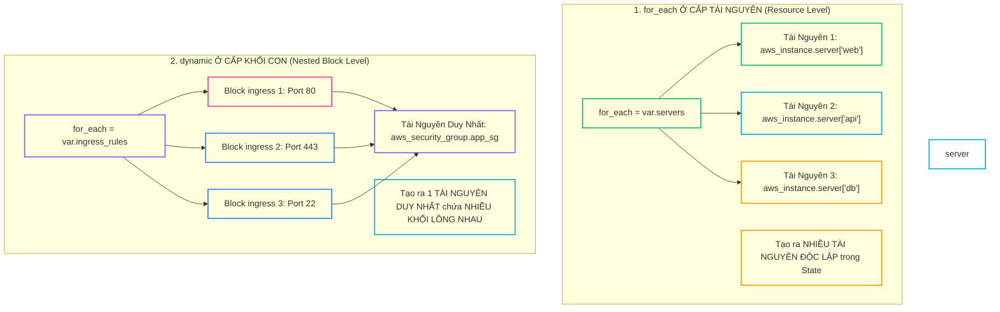


# Lập Trình HCL Nâng Cao: Làm Chủ Dynamic Blocks, Biểu Thức For (For Expressions) & Toán Tử Ellipsis

Ngôn ngữ cấu hình **HCL (HashiCorp Configuration Language)** được thiết kế theo triết lý **Khai báo (Declarative)**: Kỹ sư chỉ cần mô tả trạng thái mong muốn cuối cùng (**Desired State**) mà không cần phải viết các cấu trúc điều khiển luồng phức tạp như vòng lặp `for` hay câu lệnh `while` của các ngôn ngữ lập trình thủ tục.

Tuy nhiên, trong các bài toán thực tế chuẩn Enterprise, bạn sẽ thường xuyên gặp phải những tình huống đòi hỏi tính linh hoạt cực cao:
- Một Security Group cần mở hàng chục cổng Ingress/Egress dựa trên danh sách cấu hình được nạp động từ file JSON hoặc API bên thứ ba.
- Một S3 Bucket cần sinh động hàng loạt luật lưu trữ lồng nhau (**Nested Lifecycle Rules**) theo từng môi trường.
- Bạn cần chuyển đổi (transform / map / filter) một ma trận danh sách tài khoản, phòng ban và quyền hạn phức tạp thành các chính sách IAM Policy hợp lệ.

Để giải quyết bài toán này mà vẫn bảo đảm tính toàn vẹn của Declarative IaC, Terraform cung cấp hai công cụ lập trình meta mạnh mẽ nhất: **`dynamic` blocks** và **Biểu thức `for` (For Expressions)**. Bài viết này sẽ giúp bạn làm chủ toàn bộ kỹ thuật xử lý dữ liệu phức hợp, kỹ thuật làm phẳng mảng đa cấp với `flatten()`, cú pháp gom nhóm Ellipsis (`...`) và ranh giới an toàn để tránh rơi vào cái bẫy **Over-engineering**.

---

## 1. Phân Biệt Triệt Để: `for_each` Cấp Tài Nguyên vs `dynamic` Block

Một ngộ nhận phổ biến của nhiều kỹ sư là: *"Tôi có thể dùng `for_each` trực tiếp cho các khối con bên trong một resource không?"* Câu trả lời dứt khoát là **KHÔNG**:



---

## 2. Cú Pháp Chuẩn Thực Chiến Của `dynamic` Block

Một khối `dynamic` chuẩn mực bao gồm 4 thành phần bắt buộc:
1. **Tên khối cần sinh lặp** (ví dụ: `dynamic "ingress"`).
2. **`for_each`**: Danh sách hoặc Map dữ liệu đầu vào.
3. **`iterator`**: Tên biến con trỏ đại diện cho phần tử hiện tại (gợi nhớ, dễ đọc).
4. **`content {}`**: Khối nội dung chứa các thuộc tính thực tế được sinh ra.

```hcl
# main.tf - Cấu hình Security Group với dynamic ingress & egress
variable "firewall_ingress_rules" {
  type = list(object({
    port        = number
    protocol    = string
    cidr_blocks = list(string)
    description = string
  }))
  default = [
    { port = 80,  protocol = "tcp", cidr_blocks = ["0.0.0.0/0"], description = "Allow HTTP Web Traffic" },
    { port = 443, protocol = "tcp", cidr_blocks = ["0.0.0.0/0"], description = "Allow HTTPS Secure Traffic" },
    { port = 22,  protocol = "tcp", cidr_blocks = ["10.0.0.0/8"], description = "Allow Internal Corporate SSH" }
  ]
}

resource "aws_security_group" "web_firewall" {
  name        = "showtech-web-firewall-${var.environment}"
  description = "Security group su dung dynamic ingress blocks"
  vpc_id      = var.vpc_id

  # 1. Sinh lặp các khối ingress động
  dynamic "ingress" {
    for_each = var.firewall_ingress_rules
    iterator = rule # Đặt tên gợi nhớ thay vì để mặc định là 'ingress'

    content {
      description = rule.value.description
      from_port   = rule.value.port
      to_port     = rule.value.port
      protocol    = rule.value.protocol
      cidr_blocks = rule.value.cidr_blocks
    }
  }

  # 2. Sinh lặp khối egress động
  dynamic "egress" {
    for_each = var.allow_all_outbound ? [1] : [] # Tạo khối có điều kiện (0 hoặc 1)
    content {
      from_port   = 0
      to_port     = 0
      protocol    = "-1"
      cidr_blocks = ["0.0.0.0/0"]
    }
  }

  tags = {
    Name        = "sg-web-firewall-${var.environment}"
    Environment = var.environment
  }
}
```

> [!TIP]
> **KỸ THUẬT CONDITIONAL DYNAMIC BLOCK:**
> Để bật/tắt một khối cấu hình lồng nhau dựa trên điều kiện Boolean, hãy truyền `for_each = var.is_enabled ? [1] : []`. Nếu `true`, mảng có 1 phần tử và khối được sinh ra; nếu `false`, mảng rỗng và khối hoàn toàn bị bỏ qua!

---

## 3. Biểu Thức `for` (For Expressions): Biến Đổi & Lọc Dữ Liệu Đa Chiều

For Expressions trong HCL hoạt động tương tự List/Dictionary Comprehensions trong Python, cho phép biến đổi dữ liệu mạnh mẽ:

### 3.1. List-to-List (Lọc & Biến Đổi Mảng)
```hcl
locals {
  raw_servers = ["web-01.prod", "api-01.prod", "web-02.dev", "db-01.prod"]

  # Chỉ lấy các máy chủ Web trên môi trường Prod và viết hoa
  prod_web_servers = [
    for s in local.raw_servers : upper(s)
    if startswith(s, "web") && endswith(s, "prod")
  ]
  # Kết quả: ["WEB-01.PROD"]
}
```

### 3.2. List-to-Map (Chuyển Đổi Danh Sách Thành Bảng Tra Cứu)
```hcl
locals {
  service_configs = [
    { service = "auth",    port = 8080, cpu = 256 },
    { service = "payment", port = 8443, cpu = 512 },
    { service = "order",   port = 8081, cpu = 256 }
  ]

  # Biến đổi thành Map với key là 'service'
  service_lookup = {
    for item in local.service_configs : item.service => {
      port = item.port
      cpu  = item.cpu
    }
  }
}
```

### 3.3. Gom Nhóm Đa Phần Tử Bằng Toán Tử Ellipsis (`...`)
Khi nhiều đối tượng có cùng một thuộc tính phân loại (ví dụ: nhóm danh sách người dùng theo vai trò phân quyền), sử dụng toán tử `...` ở cuối biểu thức:

```hcl
locals {
  iam_assignments = [
    { user = "alice", role = "Admin" },
    { user = "bob",   role = "Developer" },
    { user = "carol", role = "Admin" },
    { user = "david", role = "Viewer" }
  ]

  # Gom nhóm danh sách Users theo từng Role bằng toán tử Ellipsis
  role_groups = {
    for a in local.iam_assignments : a.role => a.user...
  }
  # Kết quả thu được:
  # {
  #   "Admin"     = ["alice", "carol"],
  #   "Developer" = ["bob"],
  #   "Viewer"    = ["david"]
  # }
}
```

---

## 4. Kỹ Thuật Làm Phẳng Mảng Đa Cấp Với `flatten()` Cho Cấu Trúc Lồng Nhau

Trong các bài toán thực tế, dữ liệu thường có cấu trúc 2 tầng lồng nhau: *Mỗi tài khoản AWS có nhiều VPC, và mỗi VPC lại có nhiều Subnet*.

Để tạo tài nguyên từ cấu trúc lồng nhau này, ta sử dụng **Nested For Expressions kết hợp hàm `flatten()`**:

```hcl
locals {
  environment_networks = {
    "development" = ["10.0.1.0/24", "10.0.2.0/24"]
    "production"  = ["10.100.1.0/24", "10.100.2.0/24", "10.100.3.0/24"]
  }

  # Làm phẳng cấu trúc 2 tầng lồng nhau thành danh sách 1 chiều
  flat_subnets = flatten([
    for env_name, cidr_list in local.environment_networks : [
      for idx, cidr in cidr_list : {
        env_name = env_name
        cidr     = cidr
        key_id   = "${env_name}-sub-${idx + 1}"
      }
    ]
  ])
}

# Sử dụng danh sách phẳng cho for_each
resource "local_file" "subnet_records" {
  for_each = {
    for s in local.flat_subnets : s.key_id => s
  }

  filename = "${path.module}/subnets/${each.key}.txt"
  content  = "Env: ${each.value.env_name} - CIDR: ${each.value.cidr}"
}
```

---

## 5. Ranh Giới Thiết Kế: Khi Nào `dynamic` Block Trở Thành Over-Engineering?

Mặc dù `dynamic` block rất mạnh mẽ, nhưng việc lạm dụng quá mức có thể biến mã nguồn HCL thành "mã spaghetti khó hiểu", khó kiểm soát bảo mật và khó theo dõi lịch sử Git:

| Tiêu Chí So Sánh | Sử Dụng `dynamic` Ingress Block | Tách Rời `aws_security_group_rule` (Khuyến Nghị) |
| :--- | :--- | :--- |
| **Số Lượng Rules Nhỏ (< 5 rules)** | **Rất tốt, ngắn gọn trong 1 file** | Hơi rườm rà |
| **Số Lượng Rules Lớn (> 15 rules)** | **Khó đọc, rủi ro xóa nhầm toàn bộ** | **Tuyệt vời, mỗi rule là 1 đối tượng độc lập** |
| **Tái Cấu Trúc / Xóa 1 Rule** | Cập nhật toàn bộ Security Group | Chỉ xóa đúng 1 Node Rule trên DAG |
| **Tránh Lỗi Cyclic Dependency** | Dễ gây lỗi Cycle | **Phá vỡ hoàn toàn lỗi Cycle** |
| **Theo Dõi Git Diff / Code Review** | Khó thấy rule nào vừa bị đổi port | **Rõ ràng 100% từng dòng diff** |

> [!IMPORTANT]
> **QUY TẮC THIẾT KẾ CLEAN CODE:**
> Chỉ sử dụng `dynamic` block cho các khối cấu hình thực sự bất khả phân ly (như S3 Lifecycle Rules, EKS Log Types). Đối với **Security Group Rules**, hãy luôn ưu tiên tách rời thành các tài nguyên độc lập `aws_security_group_rule` để đảm bảo tính minh bạch khi Code Review.

---

## 6. Phân Tích Cạm Bẫy Thực Chiến: Lỗi `dynamic` Block Xóa Sạch Outbound Rules

### Tình Huống Sự Cố Thực Tế:
Vào lúc <span class="badge badge--rose">🕒 10:30 AM</span>, Một kỹ sư viết Security Group với `dynamic "egress"` dựa trên biến `var.egress_rules`. Trong môi trường Staging, biến này được truyền danh sách rỗng `[]` (với ý định là dùng cấu hình mặc định).

```hcl
resource "aws_security_group" "bad_sg" {
  name   = "bad-sg"
  vpc_id = var.vpc_id

  dynamic "egress" {
    for_each = var.egress_rules # var.egress_rules = []
    content { ... }
  }
}
```

### Hậu Quả & Log Lỗi Thực Tế:
```log
# Khi apply với var.egress_rules = [], Terraform tạo ra một Security Group
# KHÔNG CÓ BẤT KỲ EGRESS RULE NÀO! (DEFAULT DENY ALL OUTBOUND TRAFFIC)

# Toàn bộ các Pods và máy chủ EC2 gắn vào Security Group này bị ngắt kết nối Internet:
# Không thể gọi DNS resolver, không thể kéo Docker Image, sập toàn bộ dịch vụ!
```

### 5-Whys Root Cause Analysis:
1. <span class="badge badge--primary">Why 1</span> **Tại sao máy chủ không thể kết nối ra ngoài Internet?** $\rightarrow$ Vì Security Group không có bất kỳ Egress Rule nào cho phép lưu lượng đi ra.
2. <span class="badge badge--primary">Why 2</span> **Tại sao lại không có Egress Rule?** $\rightarrow$ Vì trên AWS, khi bạn khai báo thủ công khối `egress` (dù là dynamic rỗng `for_each = []`), AWS sẽ xóa bỏ luật mặc định `0.0.0.0/0` (Allow All Egress).
3. <span class="badge badge--primary">Why 3</span> **Tại sao kỹ sư lại truyền mảng rỗng?** $\rightarrow$ Kỹ sư ngộ nhận rằng nếu không có rule nào trong mảng, AWS sẽ tự giữ lại luật mặc định.
4. **<span class="badge badge--emerald">Root Cause Remedy</span> **<span class="badge badge--emerald">Root Cause Remedy</span> **<span class="badge badge--emerald">Root Cause Remedy</span> **Biện pháp khắc phục chuẩn SRE:**:**:**:**
   - **Thêm luật mặc định nếu mảng rỗng:**
     ```hcl
     for_each = length(var.egress_rules) > 0 ? var.egress_rules : local.default_allow_all_egress
     ```

---

## 7. Hands-on Lab: Thực Hành Dynamic Blocks & For Expressions (8 Bước)

| Bước | Lệnh / Thao Tác | Mục Đích Kỹ Thuật |
| :---: | :--- | :--- |
| <span class="badge badge--primary">01</span> | `Thao tác 1` | Khởi tạo thư mục thực hành thử nghiệm |
| <span class="badge badge--cyan">02</span> | `Thao tác 2` | Viết mã nguồn thử nghiệm For Expressions và Ellipsis |
| <span class="badge badge--indigo">03</span> | `terraform apply` | Chạy  để kiểm tra kết quả |
| <span class="badge badge--amber">04</span> | `terraform console` | Khởi động  để thử nghiệm trực tiếp |
| <span class="badge badge--emerald">05</span> | `flatten` | Thử nghiệm hàm  trong console |
| <span class="badge badge--primary">06</span> | `Thao tác 6` | Thử nghiệm biến đổi Map-to-List trong console |
| <span class="badge badge--rose">07</span> | `Thao tác 7` | Thoát khỏi console |
| <span class="badge badge--emerald">08</span> | `Thao tác 8` | Dọn dẹp môi trường thử nghiệm |

### Bước 1: Khởi tạo thư mục thực hành thử nghiệm
```bash
mkdir -p /tmp/meta-programming-lab && cd /tmp/meta-programming-lab
terraform init
```

### Bước 2: Viết mã nguồn thử nghiệm For Expressions và Ellipsis
```bash
cat << 'EOF' > main.tf
terraform {
  required_version = ">= 1.7.0"
}

locals {
  team_data = [
    { name = "Alice", team = "DevOps", role = "Lead" },
    { name = "Bob",   team = "DevOps", role = "Engineer" },
    { name = "Carol", team = "Backend", role = "Senior" },
    { name = "David", team = "Backend", role = "Junior" }
  ]

  # 1. Gom nhóm danh sách thành viên theo Team bằng toán tử Ellipsis (...)
  teams_grouped = {
    for member in local.team_data : member.team => member.name...
  }

  # 2. Lọc danh sách chỉ lấy các kỹ sư cấp cao (Lead/Senior)
  senior_engineers = [
    for member in local.team_data : member.name
    if contains(["Lead", "Senior"], member.role)
  ]
}

output "grouped_teams" {
  value = local.teams_grouped
}

output "senior_staff" {
  value = local.senior_engineers
}
EOF
```

### Bước 3: Chạy `terraform apply` để kiểm tra kết quả
```bash
terraform apply -auto-approve
```
Quan sát kết quả Output hiển thị đúng cấu trúc Map of Lists!

### Bước 4: Khởi động `terraform console` để thử nghiệm trực tiếp
```bash
terraform console
```

### Bước 5: Thử nghiệm hàm `flatten` trong console
```hcl
> flatten([["port-80", "port-443"], ["port-22"], ["port-8080"]])
[
  "port-80",
  "port-443",
  "port-22",
  "port-8080",
]
```

### Bước 6: Thử nghiệm biến đổi Map-to-List trong console
```hcl
> [for k, v in { a = 1, b = 2, c = 3 } : "${k}=>${v * 10}"]
[
  "a=>10",
  "b=>20",
  "c=>30",
]
```

### Bước 7: Thoát khỏi console
```hcl
> exit
```

### Bước 8: Dọn dẹp môi trường thử nghiệm
```bash
terraform destroy -auto-approve
cd .. && rm -rf /tmp/meta-programming-lab
```

---

## 8. 10 Câu Hỏi Tự Kiểm Tra Chuyên Sâu (Self-Check Q&A)


<details class="qa-card">
<summary class="qa-summary">
  <div class="qa-summary-left">
    <span class="qa-num-badge">Q01</span>
    <span>Sự khác nhau cơ bản giữa <code>for_each</code> ở cấp resource và <code>dynamic</code> block là gì?</span>
  </div>
  <span class="qa-chevron">
    <svg width="18" height="18" fill="none" stroke="currentColor" stroke-width="2.5" viewBox="0 0 24 24"><polyline points="6 9 12 15 18 9"></polyline></svg>
  </span>
</summary>
<div class="qa-answer">
  <div class="qa-answer-header">
    <svg width="14" height="14" fill="none" stroke="currentColor" stroke-width="2" viewBox="0 0 24 24"><path d="M22 11.08V12a10 10 0 1 1-5.93-9.14"></path><polyline points="22 4 12 14.01 9 11.01"></polyline></svg>
    <span>Phân Tích &amp; Lời Giải Kỹ Thuật</span>
  </div>
  <div style="margin: 0.35rem 0; padding-left: 1rem; border-left: 2px solid var(--accent-primary);">• <code>for_each</code> ở cấp resource dùng để sinh ra <b style="color: var(--accent-primary);">nhiều tài nguyên độc lập</b> (mỗi tài nguyên có State Address riêng).</div>
  <div style="margin: 0.35rem 0; padding-left: 1rem; border-left: 2px solid var(--accent-primary);">• <code>dynamic</code> block dùng để sinh lặp <b style="color: var(--accent-primary);">nhiều khối cấu hình con lồng nhau (Nested Blocks)</b> bên trong duy nhất một tài nguyên.</div>
</div>
</details>

<details class="qa-card">
<summary class="qa-summary">
  <div class="qa-summary-left">
    <span class="qa-num-badge">Q02</span>
    <span>Thuộc tính <code>iterator</code> trong <code>dynamic</code> block có bắt buộc không và có tác dụng gì?</span>
  </div>
  <span class="qa-chevron">
    <svg width="18" height="18" fill="none" stroke="currentColor" stroke-width="2.5" viewBox="0 0 24 24"><polyline points="6 9 12 15 18 9"></polyline></svg>
  </span>
</summary>
<div class="qa-answer">
  <div class="qa-answer-header">
    <svg width="14" height="14" fill="none" stroke="currentColor" stroke-width="2" viewBox="0 0 24 24"><path d="M22 11.08V12a10 10 0 1 1-5.93-9.14"></path><polyline points="22 4 12 14.01 9 11.01"></polyline></svg>
    <span>Phân Tích &amp; Lời Giải Kỹ Thuật</span>
  </div>
  <p style="margin: 0.4rem 0;">Không bắt buộc. Nếu không khai báo, biến con trỏ sẽ mặc định lấy theo tên của khối dynamic (ví dụ <code>ingress.value</code>). Tuy nhiên, khai báo rõ ràng <code>iterator = rule</code> giúp mã nguồn trong sáng, dễ đọc và tránh xung đột khi có nhiều khối dynamic lồng nhau.</p>
</div>
</details>

<details class="qa-card">
<summary class="qa-summary">
  <div class="qa-summary-left">
    <span class="qa-num-badge">Q03</span>
    <span>Làm thế nào để tạo một <code>dynamic</code> block có điều kiện (Bật/Tắt dựa trên biến Boolean)?</span>
  </div>
  <span class="qa-chevron">
    <svg width="18" height="18" fill="none" stroke="currentColor" stroke-width="2.5" viewBox="0 0 24 24"><polyline points="6 9 12 15 18 9"></polyline></svg>
  </span>
</summary>
<div class="qa-answer">
  <div class="qa-answer-header">
    <svg width="14" height="14" fill="none" stroke="currentColor" stroke-width="2" viewBox="0 0 24 24"><path d="M22 11.08V12a10 10 0 1 1-5.93-9.14"></path><polyline points="22 4 12 14.01 9 11.01"></polyline></svg>
    <span>Phân Tích &amp; Lời Giải Kỹ Thuật</span>
  </div>
  <p style="margin: 0.4rem 0;">Sử dụng biểu thức toán tử tam nguyên: <code>for_each = var.enable_feature ? [1] : []</code>. Nếu <code>true</code>, mảng có 1 phần tử giúp sinh ra khối; nếu <code>false</code>, mảng rỗng và khối sẽ bị bỏ qua.</p>
</div>
</details>

<details class="qa-card">
<summary class="qa-summary">
  <div class="qa-summary-left">
    <span class="qa-num-badge">Q04</span>
    <span>Toán tử Ellipsis (<code>...</code>) trong For Expressions giải quyết bài toán gì?</span>
  </div>
  <span class="qa-chevron">
    <svg width="18" height="18" fill="none" stroke="currentColor" stroke-width="2.5" viewBox="0 0 24 24"><polyline points="6 9 12 15 18 9"></polyline></svg>
  </span>
</summary>
<div class="qa-answer">
  <div class="qa-answer-header">
    <svg width="14" height="14" fill="none" stroke="currentColor" stroke-width="2" viewBox="0 0 24 24"><path d="M22 11.08V12a10 10 0 1 1-5.93-9.14"></path><polyline points="22 4 12 14.01 9 11.01"></polyline></svg>
    <span>Phân Tích &amp; Lời Giải Kỹ Thuật</span>
  </div>
  <p style="margin: 0.4rem 0;">Dùng để gom nhóm (Group By) nhiều phần tử có cùng một Key vào một danh sách (List of Values). Nếu không có <code>...</code>, khi gặp các phần tử trùng Key, Terraform sẽ báo lỗi <code>Duplicate key in map</code>.</p>
</div>
</details>

<details class="qa-card">
<summary class="qa-summary">
  <div class="qa-summary-left">
    <span class="qa-num-badge">Q05</span>
    <span>Hàm <code>flatten()</code> thường được dùng trong trường hợp nào khi viết HCL?</span>
  </div>
  <span class="qa-chevron">
    <svg width="18" height="18" fill="none" stroke="currentColor" stroke-width="2.5" viewBox="0 0 24 24"><polyline points="6 9 12 15 18 9"></polyline></svg>
  </span>
</summary>
<div class="qa-answer">
  <div class="qa-answer-header">
    <svg width="14" height="14" fill="none" stroke="currentColor" stroke-width="2" viewBox="0 0 24 24"><path d="M22 11.08V12a10 10 0 1 1-5.93-9.14"></path><polyline points="22 4 12 14.01 9 11.01"></polyline></svg>
    <span>Phân Tích &amp; Lời Giải Kỹ Thuật</span>
  </div>
  <p style="margin: 0.4rem 0;">Dùng để làm phẳng mảng đa cấp (List of Lists) sinh ra từ các biểu thức For lồng nhau thành một danh sách 1 chiều duy nhất để có thể truyền vào <code>for_each</code> của tài nguyên.</p>
</div>
</details>

<details class="qa-card">
<summary class="qa-summary">
  <div class="qa-summary-left">
    <span class="qa-num-badge">Q06</span>
    <span>Khi nào KHÔNG NÊN sử dụng <code>dynamic</code> block cho Security Groups?</span>
  </div>
  <span class="qa-chevron">
    <svg width="18" height="18" fill="none" stroke="currentColor" stroke-width="2.5" viewBox="0 0 24 24"><polyline points="6 9 12 15 18 9"></polyline></svg>
  </span>
</summary>
<div class="qa-answer">
  <div class="qa-answer-header">
    <svg width="14" height="14" fill="none" stroke="currentColor" stroke-width="2" viewBox="0 0 24 24"><path d="M22 11.08V12a10 10 0 1 1-5.93-9.14"></path><polyline points="22 4 12 14.01 9 11.01"></polyline></svg>
    <span>Phân Tích &amp; Lời Giải Kỹ Thuật</span>
  </div>
  <p style="margin: 0.4rem 0;">Khi số lượng rules lớn (> 15 rules) hoặc khi các rules có quan hệ phụ thuộc chéo giữa các tầng. Trong trường hợp đó, nên tách rời thành các tài nguyên độc lập <code>aws_security_group_rule</code> để dễ bảo trì, dễ review Git diff và tránh lỗi Cyclic Dependency.</p>
</div>
</details>

<details class="qa-card">
<summary class="qa-summary">
  <div class="qa-summary-left">
    <span class="qa-num-badge">Q07</span>
    <span>Thuộc tính <code>each.value</code> trong <code>dynamic</code> block chứa kiểu dữ liệu gì?</span>
  </div>
  <span class="qa-chevron">
    <svg width="18" height="18" fill="none" stroke="currentColor" stroke-width="2.5" viewBox="0 0 24 24"><polyline points="6 9 12 15 18 9"></polyline></svg>
  </span>
</summary>
<div class="qa-answer">
  <div class="qa-answer-header">
    <svg width="14" height="14" fill="none" stroke="currentColor" stroke-width="2" viewBox="0 0 24 24"><path d="M22 11.08V12a10 10 0 1 1-5.93-9.14"></path><polyline points="22 4 12 14.01 9 11.01"></polyline></svg>
    <span>Phân Tích &amp; Lời Giải Kỹ Thuật</span>
  </div>
  <p style="margin: 0.4rem 0;">Chứa giá trị của phần tử hiện tại đang được duyệt trong vòng lặp (có thể là String, Number, Map, hoặc Object tùy thuộc vào cấu trúc dữ liệu truyền vào <code>for_each</code>).</p>
</div>
</details>

<details class="qa-card">
<summary class="qa-summary">
  <div class="qa-summary-left">
    <span class="qa-num-badge">Q08</span>
    <span>Có thể lồng một khối <code>dynamic</code> bên trong một khối <code>dynamic</code> khác không (Nested Dynamic Blocks)?</span>
  </div>
  <span class="qa-chevron">
    <svg width="18" height="18" fill="none" stroke="currentColor" stroke-width="2.5" viewBox="0 0 24 24"><polyline points="6 9 12 15 18 9"></polyline></svg>
  </span>
</summary>
<div class="qa-answer">
  <div class="qa-answer-header">
    <svg width="14" height="14" fill="none" stroke="currentColor" stroke-width="2" viewBox="0 0 24 24"><path d="M22 11.08V12a10 10 0 1 1-5.93-9.14"></path><polyline points="22 4 12 14.01 9 11.01"></polyline></svg>
    <span>Phân Tích &amp; Lời Giải Kỹ Thuật</span>
  </div>
  <p style="margin: 0.4rem 0;"><b style="color: var(--accent-primary);">CÓ THỂ</b>. HCL hỗ trợ lồng nhiều tầng dynamic block (ví dụ khối <code>rule</code> lồng khối <code>action</code> trong AWS WAF hoặc S3 Lifecycle). Bắt buộc phải đặt tên <code>iterator</code> khác nhau ở từng tầng để tránh xung đột biến con trỏ.</p>
</div>
</details>

<details class="qa-card">
<summary class="qa-summary">
  <div class="qa-summary-left">
    <span class="qa-num-badge">Q09</span>
    <span>Biểu thức <code>[for k, v in var.my_map : v if v.active]</code> trả về kiểu dữ liệu gì?</span>
  </div>
  <span class="qa-chevron">
    <svg width="18" height="18" fill="none" stroke="currentColor" stroke-width="2.5" viewBox="0 0 24 24"><polyline points="6 9 12 15 18 9"></polyline></svg>
  </span>
</summary>
<div class="qa-answer">
  <div class="qa-answer-header">
    <svg width="14" height="14" fill="none" stroke="currentColor" stroke-width="2" viewBox="0 0 24 24"><path d="M22 11.08V12a10 10 0 1 1-5.93-9.14"></path><polyline points="22 4 12 14.01 9 11.01"></polyline></svg>
    <span>Phân Tích &amp; Lời Giải Kỹ Thuật</span>
  </div>
  <p style="margin: 0.4rem 0;">Trả về một danh sách (<b style="color: var(--accent-primary);">List</b>) chứa các giá trị <code>v</code> thỏa mãn điều kiện <code>v.active == true</code>.</p>
</div>
</details>

<details class="qa-card">
<summary class="qa-summary">
  <div class="qa-summary-left">
    <span class="qa-num-badge">Q10</span>
    <span>Biểu thức <code>{for s in var.server_list : s.id =&gt; s...}</code> trả về kiểu dữ liệu gì?</span>
  </div>
  <span class="qa-chevron">
    <svg width="18" height="18" fill="none" stroke="currentColor" stroke-width="2.5" viewBox="0 0 24 24"><polyline points="6 9 12 15 18 9"></polyline></svg>
  </span>
</summary>
<div class="qa-answer">
  <div class="qa-answer-header">
    <svg width="14" height="14" fill="none" stroke="currentColor" stroke-width="2" viewBox="0 0 24 24"><path d="M22 11.08V12a10 10 0 1 1-5.93-9.14"></path><polyline points="22 4 12 14.01 9 11.01"></polyline></svg>
    <span>Phân Tích &amp; Lời Giải Kỹ Thuật</span>
  </div>
  <p style="margin: 0.4rem 0;">Trả về một <b style="color: var(--accent-primary);">Map</b> trong đó mỗi Key là <code>s.id</code> và Value tương ứng là một <b style="color: var(--accent-primary);">List các object</b> có cùng ID đó (nhờ toán tử Ellipsis).</p>
</div>
</details>

---

## 9. Tổng Kết & Lộ Trình Bài Học Tiếp Theo

Làm chủ **`dynamic` blocks**, **For Expressions**, **toán tử Ellipsis (`...`)** và **`flatten()`** giúp bạn tự tin xử lý mọi cấu trúc dữ liệu phức tạp nhất, đưa mã nguồn IaC lên tầm cao của sự tinh gọn và linh hoạt.

Trong **[Bài 15: Functions, Type Constraints & Custom Variable Validation Nâng Cao: Làm Chủ can(), try() & Regex](15-functions-type-constraints-va-custom-variable-validation-chuan-enterprise.md)**, chúng ta sẽ khép lại Giai đoạn 3 với những kỹ thuật phòng thủ vững chắc: Xử lý an toàn các giá trị không tồn tại với `try()`, kiểm soát lỗi ngoại lệ với `can()`, và xây dựng bộ quy tắc kiểm định toàn diện chuẩn Enterprise!

