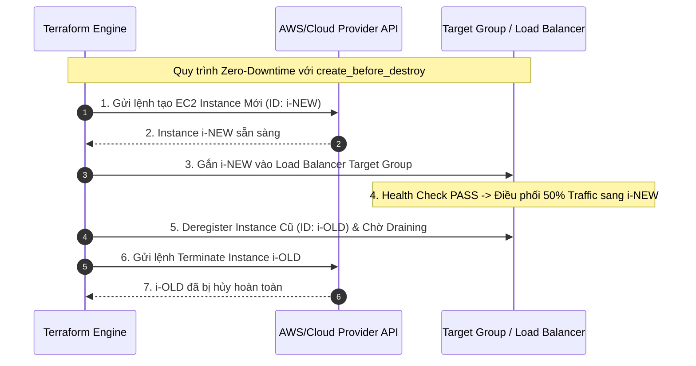
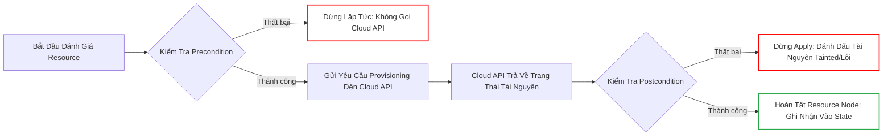
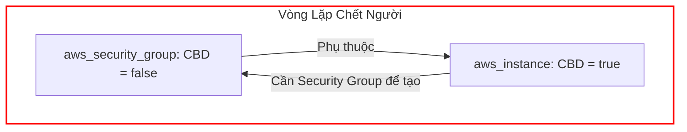
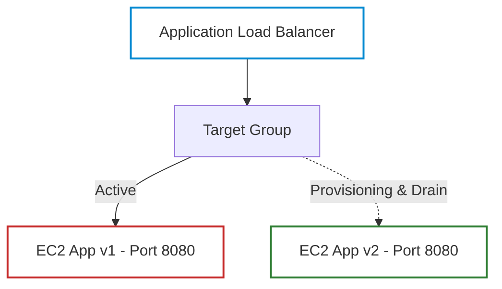
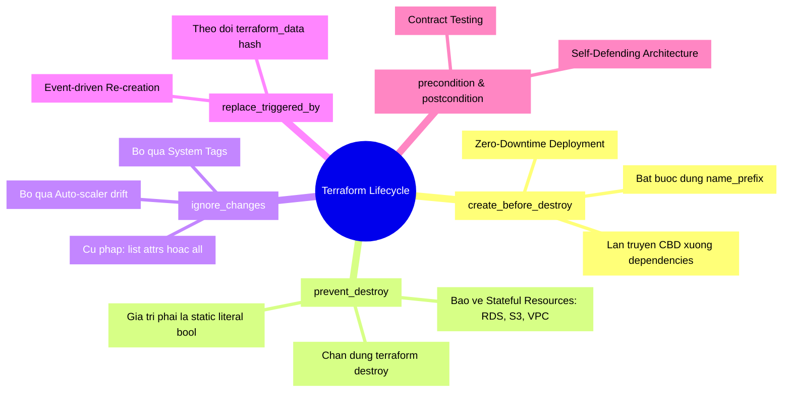


# Lifecycle Meta-Arguments: create_before_destroy, prevent_destroy, ignore_changes

Trong hành vi mặc định của Terraform, khi một thay đổi cấu hình buộc phải tái tạo tài nguyên (Replacement), engine sẽ tuân theo quy trình nghiêm ngặt: **Xóa tài nguyên cũ trước (Destroy), sau đó mới tạo tài nguyên mới (Create)**. Cơ chế này đảm bảo giải phóng tài nguyên và tránh xung đột tên định danh, nhưng lại là nguyên nhân hàng đầu gây ra **Downtime** gián đoạn dịch vụ nghiêm trọng trên môi trường Production.

Để giải quyết vấn đề này và cung cấp quyền kiểm soát vòng đời tài nguyên ở mức độ hạt nhân (granular level), Terraform trang bị khối cấu hình meta-argument `lifecycle`. Làm chủ `lifecycle` không chỉ giúp kiến trúc sư hạ tầng đạt được **Zero-Downtime Deployment**, mà còn dựng nên những bức tường lửa bảo vệ cơ sở dữ liệu khỏi nguy cơ bị xóa sổ do sai sót của con người, đồng thời quản lý hiệu quả sự bất đồng bộ giữa Terraform và các hệ thống bên ngoài (như Kubernetes Auto-scaler hay AWS Auto Scaling Group).

Bài viết này sẽ đi sâu vào kiến trúc bên dưới (under the hood), giải mã từng meta-argument trong khối `lifecycle`, phân tích các cạm bẫy vòng lặp đồ thị phụ thuộc (Graph Cycle) và thực hành triển khai Zero-Downtime Rolling Update cho hệ thống Web Service.

---

## 1. Kiến Trúc & Cơ Chế Vận Hành Của Khối Lifecycle

Khối `lifecycle` là một **Meta-argument Block** đặc biệt. Nó không được gửi đến Cloud Provider API như một thuộc tính hạ tầng, mà được Terraform Core Engine xử lý trực tiếp để can thiệp vào thuật toán xây dựng đồ thị phụ thuộc (DAG - Directed Acyclic Graph) và lập kế hoạch thay đổi (Plan Phase).

```mermaid
flowchart TD
    subgraph Default_Behavior ["Hành Vi Mặc Định: Destroy-then-Create"]
        D1["Resource Cũ: Đang Chạy"] --> D2["Bước 1: Destroy Resource Cũ"]
        D2 --> D3["Khoảng Thời Gian Downtime - Dịch Vụ Mất Kết Nối"]
        D3 --> D4["Bước 2: Create Resource Mới"]
        D4 --> D5["Dịch Vụ Phục Hồi"]
    end

    subgraph CBD_Behavior ["Hành Vi create_before_destroy: Zero-Downtime"]
        C1["Resource Cũ: Đang Chạy"] --> C2["Bước 1: Create Resource Mới Song Song"]
        C2 --> C3["Bước 2: Health Check & Chuyển Traffic An Toàn"]
        C3 --> C4["Bước 3: Destroy Resource Cũ"]
        C4 --> C5["Không Có Downtime"]
    end

    style D3 fill:none,stroke:#ff0000,stroke-width:2px
    style C3 fill:none,stroke:#28a745,stroke-width:2px


```



### 1.1. Bảng Tổng Hợp Toàn Bộ Thuộc Tính Trong Khối Lifecycle

| Thuộc Tính Meta-argument | Phiên Bản Hỗ Trợ | Mục Đích Cốt Lõi | Tác Động Lên Quá Trình Plan/Apply |
| :--- | :--- | :--- | :--- |
| `create_before_destroy` | Mọi phiên bản | Đảo ngược thứ tự tái tạo tài nguyên để ngăn chặn downtime | Tạo node `(create)` trước node `(destroy)` trong DAG |
| `prevent_destroy` | Mọi phiên bản | Khóa an toàn chống xóa tài nguyên trọng yếu | Báo lỗi Fatal Error ngay trong Plan phase nếu có hành động Destroy |
| `ignore_changes` | Mọi phiên bản | Bỏ qua sự thay đổi/drift của một số thuộc tính cụ thể | Loại bỏ thuộc tính khỏi thuật toán so sánh Diff |
| `replace_triggered_by` | Terraform 1.2+ | Tự động kích hoạt thay thế khi tài nguyên khác thay đổi | Ép buộc node chuyển sang trạng thái `Replace` dựa trên event |
| `precondition` | Terraform 1.2+ | Kiểm tra điều kiện tiên quyết trước khi áp dụng tài nguyên | Dừng apply nếu điều kiện logic không thỏa mãn |
| `postcondition` | Terraform 1.2+ | Kiểm tra điều kiện nghiệm thu sau khi tài nguyên đã tạo | Dừng apply và cảnh báo nếu kết quả thực tế không đúng cam kết |

---

## 2. Giải Mã Chi Tiết Từng Meta-Argument Thực Chiến

### 2.1. `create_before_destroy`: Chìa Khóa Của Zero-Downtime Deployment

Khi cập nhật một thuộc tính yêu cầu thay thế (Force Replacement) như thay đổi `ami` của máy chủ EC2 hay `engine_version` của cơ sở dữ liệu, `create_before_destroy = true` sẽ chỉ thị cho Terraform tạo tài nguyên mới, khởi động thành công, rồi mới tiến hành hủy tài nguyên cũ.

```hcl
resource "aws_instance" "web_app" {
  ami           = "ami-0c55b159cbfafe1f0" # Cập nhật AMI mới
  instance_type = "t3.medium"

  # CẤU HÌNH VÒNG ĐỜI ZERO-DOWNTIME
  lifecycle {
    create_before_destroy = true
  }

  tags = {
    Name = "production-web-server"
  }
}
```

> [!CAUTION]
> **Cạm bẫy Name Collision (Xung đột tên tài nguyên)**:
> Nếu tài nguyên có thuộc tính đặt tên tĩnh cố định (như `name = "my-unique-bucket"` hoặc `name = "web-sg"`), `create_before_destroy` sẽ **THẤT BẠI 100%**! Lý do: Khi tài nguyên mới cố gắng tạo ra với cùng một tên định danh trong khi tài nguyên cũ chưa bị xóa, Cloud Provider sẽ trả về lỗi `EntityAlreadyExistsException`.
> 
> **Giải pháp chuẩn Enterprise**: Luôn sử dụng tiền tố ngẫu nhiên `name_prefix` thay vì `name`:
> ```hcl
> resource "aws_security_group" "web_access" {
>   name_prefix = "web-sg-" # AWS sẽ tự sinh đuôi hash ngẫu nhiên: web-sg-20260330...
>   vpc_id      = aws_vpc.main.id
> 
>   lifecycle {
>     create_before_destroy = true
>   }
> }
> ```



---

### 2.2. `prevent_destroy`: Bức Tường Lửa Bảo Vệ Data Khỏi Thảm Họa

Trên môi trường Production, các tài nguyên chứa dữ liệu trạng thái (Stateful Resources) như Amazon RDS, DynamoDB, ElasticSearch, S3 Bucket chứa tài liệu kế toán, hoặc Production VPC tuyệt đối không bao giờ được phép bị xóa bỏ do một câu lệnh `terraform destroy` vô tình hay một refactoring code sai sót.

```hcl
resource "aws_db_instance" "production_database" {
  identifier        = "corp-finance-db-prod"
  allocated_storage = 500
  engine            = "postgres"
  engine_version    = "15.4"
  instance_class    = "db.r6g.2xlarge"

  # BẢO VỆ TUYỆT ĐỐI KHỎI THẢM HỌA XÓA NHẦM
  lifecycle {
    prevent_destroy = true
  }
}
```

#### Hành vi của `prevent_destroy`:
Khi bất kỳ kỹ sư nào chạy `terraform destroy` hoặc thay đổi một thuộc tính khiến DB bị buộc phải recreate, Terraform sẽ ném ra lỗi Fatal Error ngay trong bước phân tích:

```text
╷
│ Error: Instance cannot be destroyed
│ 
│   on main.tf line 1:
│    1: resource "aws_db_instance" "production_database" {
│ 
│ Resource aws_db_instance.production_database has lifecycle.prevent_destroy set,
│ but the plan calls for this resource to be destroyed. To avoid this error and
│ continue with the plan, either disable lifecycle.prevent_destroy or use the
│ -target flag to exclude this resource.
╵
```

> [!NOTE]
> `prevent_destroy` chỉ bảo vệ tài nguyên khỏi việc bị hủy qua Terraform CLI. Nó không ngăn cản một ai đó đăng nhập trực tiếp vào AWS Console và nhấn nút Delete. Để bảo vệ toàn diện, bạn cần kết hợp `prevent_destroy` với AWS IAM SCP (Service Control Policies) và thuộc tính `deletion_protection = true` của chính tài nguyên đó.

---

### 2.3. `ignore_changes`: Kiểm Soát Drift & Hòa Giải Hệ Thống Bên Ngoài

Trong mô hình vận hành hiện đại, hạ tầng thường xuyên bị điều chỉnh bởi các Controller bên ngoài:
- AWS Auto Scaling Group tự động thay đổi `desired_capacity` dựa trên CPU metrics.
- Kubernetes HPA thay đổi số lượng replicas của Pods.
- Hệ thống quản lý thẻ Tag tự động của doanh nghiệp (như Cloud Custodian) tự động gắn thêm các metadata tags như `CostCenter`, `AuditDate`.

Nếu không cấu hình `ignore_changes`, mỗi lần chạy `terraform apply`, Terraform sẽ coi những thay đổi bên ngoài này là **State Drift** và cố gắng ghi đè hạ tầng trở lại giá trị khai báo trong code, gây xung đột liên tục với Auto-scaler.

```hcl
resource "aws_autoscaling_group" "web_asg" {
  name_prefix         = "web-asg-"
  min_size            = 2
  max_size            = 20
  desired_capacity    = 4 # Giá trị khởi tạo ban đầu
  target_group_arns   = [aws_lb_target_group.web.arn]
  vpc_zone_identifier = aws_subnet.private[*].id

  lifecycle {
    # Bỏ qua sự thay đổi của desired_capacity do Auto Scaling Policy quản lý
    # Bỏ qua các tags tự động được gắn bởi Security Tool
    ignore_changes = [
      desired_capacity,
      tags["LastScanned"],
      tags["SecurityCompliant"]
    ]
  }
}
```

> [!TIP]
> Bạn có thể sử dụng cú pháp `ignore_changes = all` để chỉ thị cho Terraform tạo tài nguyên ban đầu nhưng không bao giờ theo dõi hay cập nhật bất kỳ thuộc tính nào của nó nữa (thường dùng cho tài nguyên được bàn giao cho hệ thống bên thứ ba quản lý).

---

### 2.4. `replace_triggered_by`: Thay Thế Thông Minh Theo Sự Kiện (Terraform 1.2+)

Trước đây, khi bạn thay đổi cấu hình `user_data` trong một file script shell hoặc cập nhật một ConfigMap/Secret, máy chủ EC2 không tự động bị recreate trừ khi bạn cố tình thay đổi một thuộc tính của chính nó.

Kể từ Terraform 1.2+, meta-argument `replace_triggered_by` cho phép thiết lập quan hệ phụ thuộc thay thế: **Khi tài nguyên A thay đổi, tài nguyên B bắt buộc phải bị Destroy & Recreate**.

```hcl
# File script khởi tạo máy chủ EC2
resource "terraform_data" "bootstrap_script" {
  input = filebase64sha256("${path.module}/scripts/bootstrap.sh")
}

resource "aws_instance" "app_server" {
  ami           = "ami-0c55b159cbfafe1f0"
  instance_type = "t3.large"
  user_data     = file("${path.module}/scripts/bootstrap.sh")

  lifecycle {
    create_before_destroy = true
    # Tự động thay thế EC2 Instance khi nội dung file bootstrap.sh thay đổi hash!
    replace_triggered_by = [
      terraform_data.bootstrap_script
    ]
  }
}
```

---

### 2.5. `precondition` & `postcondition`: Kiểm Thử Hợp Đồng Hạ Tầng Tại Runtime

Hai meta-argument này biến mã nguồn Terraform thành các bài kiểm thử hợp đồng (Contract Testing) trực tiếp trong quá trình Plan và Apply:



```hcl
resource "aws_instance" "secure_workstation" {
  ami           = var.custom_ami_id
  instance_type = "m6i.xlarge"

  lifecycle {
    # PRECONDITION: Chặn việc deploy nếu AMI không được bộ phận Security phê duyệt
    precondition {
      condition     = data.aws_ami.selected.tags["ComplianceApproved"] == "true"
      error_message = "VI PHẠM BẢO MẬT: AMI ${var.custom_ami_id} chưa được gắn tag ComplianceApproved=true bởi Đội ngũ An ninh Thông tin!"
    }

    # POSTCONDITION: Đảm bảo máy chủ sau khi tạo phải được gán địa chỉ IP Private trong dải mạng bảo mật
    postcondition {
      condition     = can(regex("^10\\.200\\.", self.private_ip))
      error_message = "LỖI PHÂN VÙNG MẠNG: Máy chủ được cấp IP ${self.private_ip} không nằm trong dải mạng bảo mật nội bộ 10.200.0.0/16!"
    }
  }
}
```

---

## 3. Cạm Bẫy Cốt Lõi: The Dreaded "Cycle with create_before_destroy"

Một trong những lỗi đau đầu nhất đối với các kỹ sư Terraform là **Vòng lặp đồ thị phụ thuộc (Graph Cycle)** sinh ra khi kết hợp `create_before_destroy` với các tài nguyên phụ thuộc.



### 3.1. Phân Tích Cơ Chế Gây Lỗi
Giả sử:
1. `aws_instance.app` có `create_before_destroy = true`.
2. `aws_security_group.app_sg` có `create_before_destroy = false` (mặc định).
3. `aws_security_group` tham chiếu đến `aws_instance` (hoặc ngược lại).

Khi bạn sửa đổi Security Group buộc phải thay thế:
- Terraform cố gắng tạo `aws_instance` mới trước khi xóa cái cũ.
- Nhưng `aws_instance` mới lại cần `aws_security_group` mới.
- `aws_security_group` mới lại không thể tạo trước vì nó có `create_before_destroy = false` (nó phải đợi xóa cái cũ trước).
- Nhưng `aws_security_group` cũ lại không thể xóa vì `aws_instance` cũ vẫn đang dùng nó!
- **Hậu quả**: Terraform báo lỗi `Error: Cycle: aws_instance.app, aws_security_group.app_sg`.

### 3.2. Quy Tắc Khắc Phục Chuẩn Enterprise
> [!IMPORTANT]
> **Quy tắc lan truyền (CBD Propagation Rule)**:
> Nếu bạn đặt `create_before_destroy = true` cho một tài nguyên, bạn **BẮT BUỘC PHẢI ĐẶT** `create_before_destroy = true` cho **TẤT CẢ các tài nguyên mà nó phụ thuộc vào** (Subnets, Security Groups, IAM Roles, Launch Templates) nếu những tài nguyên đó có nguy cơ bị replace cùng lúc.

---

## 4. Hands-On Lab: Xây Dựng Kiến Trúc Rolling Update Zero-Downtime

Trong bài lab này, chúng ta sẽ xây dựng một Web Cluster gồm 2 Instance đứng sau Application Load Balancer (ALB), cấu hình `create_before_destroy` và `replace_triggered_by` để cập nhật phiên bản ứng dụng mà không gây rớt bất kỳ request HTTP nào.



### Bước 1: Khởi tạo thư mục làm việc
```bash
mkdir -p terraform-lab16-lifecycle
cd terraform-lab16-lifecycle
```

### Bước 2: Tạo file `main.tf` với cấu hình Zero-Downtime chuẩn
Tạo file `main.tf`:
```hcl
terraform {
  required_version = ">= 1.5.0"
  required_providers {
    local = {
      source  = "hashicorp/local"
      version = "~> 2.4"
    }
  }
}

# Giả lập tham số phiên bản ứng dụng
variable "app_version" {
  type        = string
  default     = "1.0.0"
  description = "Phiên bản ứng dụng web"
}

# Giả lập tài nguyên config hash
resource "terraform_data" "app_manifest" {
  input = {
    version     = var.app_version
    config_hash = sha256("app-code-version-${var.app_version}")
  }
}

# Giả lập Security Group với name_prefix và CBD
resource "terraform_data" "security_group" {
  input = {
    name_prefix = "web-sg-"
    rules       = ["allow_http_8080", "allow_healthcheck"]
  }

  lifecycle {
    create_before_destroy = true
  }
}

# Giả lập Server Cluster với Zero-Downtime Lifecycle
resource "terraform_data" "web_server_primary" {
  input = {
    server_id       = "web-server-01"
    version         = var.app_version
    sg_id           = terraform_data.security_group.id
    deployed_at     = timestamp()
  }

  lifecycle {
    # 1. Luôn tạo server mới trước khi hủy server cũ
    create_before_destroy = true

    # 2. Tự động trigger replace khi manifest phiên bản thay đổi
    replace_triggered_by = [
      terraform_data.app_manifest
    ]

    # 3. Postcondition xác thực server sẵn sàng
    postcondition {
      condition     = self.input.version != ""
      error_message = "Lỗi nghiêm trọng: Phiên bản ứng dụng không được để trống!"
    }
  }
}

# Giả lập Database chứa dữ liệu với prevent_destroy
resource "terraform_data" "core_database" {
  input = {
    db_name        = "production-master-db"
    retention_days = 30
  }

  lifecycle {
    # KHÓA AN TOÀN TUYỆT ĐỐI
    prevent_destroy = true
  }
}

output "deployment_status" {
  value = {
    app_version   = var.app_version
    server_status = "HEALTHY"
    sg_attached   = terraform_data.security_group.id
    database      = terraform_data.core_database.input.db_name
  }
}
```

### Bước 3: Khởi tạo và Apply phiên bản 1.0.0
```bash
terraform init
terraform apply -auto-approve
```
Quan sát output: Toàn bộ tài nguyên được tạo mới thành công.

### Bước 4: Nâng cấp ứng dụng lên phiên bản 2.0.0 (Zero-Downtime Rollout)
Chạy lệnh apply với phiên bản mới:
```bash
terraform apply -var="app_version=2.0.0"
```

Quan sát kế hoạch trong terminal:
```text
  # terraform_data.web_server_primary must be replaced
-/+ resource "terraform_data" "web_server_primary" {
      ~ input = {
          ~ version     = "1.0.0" -> "2.0.0"
            # (3 unchanged attributes hidden)
        }
    }

Plan: 2 to add, 0 to change, 2 to destroy.
```
> [!NOTE]
> Nhìn vào phần Plan: `2 to add, 2 to destroy`. Terraform sẽ tiến hành **Add (Tạo mới) trước**, sau đó mới **Destroy (Xóa cũ)**!

### Bước 5: Kiểm tra cơ chế `prevent_destroy` bảo vệ Database
Thử nghiệm chạy lệnh xóa toàn bộ hạ tầng:
```bash
terraform destroy
```

**Kết quả terminal:**
```text
╷
│ Error: Instance cannot be destroyed
│ 
│   on main.tf line 48:
│   48: resource "terraform_data" "core_database" {
│ 
│ Resource terraform_data.core_database has lifecycle.prevent_destroy set,
│ but the plan calls for this resource to be destroyed.
╵
```
Terraform đã từ chối lệnh destroy và giữ nguyên toàn bộ cơ sở dữ liệu!

### Bước 6: Thử nghiệm bỏ qua thay đổi với `ignore_changes`
Thêm `ignore_changes` vào `terraform_data.web_server_primary`:
```hcl
  lifecycle {
    create_before_destroy = true
    ignore_changes        = [input.deployed_at]
  }
```

### Bước 7: Thử nghiệm gỡ bỏ an toàn khi muốn decommission
Để xóa tài nguyên có `prevent_destroy`, bạn bắt buộc phải:
1. Đổi `prevent_destroy = false` trong mã nguồn.
2. Chạy `terraform apply` để cập nhật State.
3. Sau đó mới được chạy `terraform destroy`.

### Bước 8: Dọn dẹp môi trường lab
Sửa `prevent_destroy = false` trong file `main.tf`, sau đó chạy:
```bash
terraform apply -auto-approve
terraform destroy -auto-approve
cd ..
rm -rf terraform-lab16-lifecycle
```

---

## 5. 10 Câu Hỏi Trắc Nghiệm & Phỏng Vấn Chuyên Sâu (Self-Check Q&A)

<details class="qa-card">
<summary class="qa-summary">
  <div class="qa-summary-left">
    <span class="qa-num-badge">Q01</span>
    <span>Điều gì xảy ra khi bạn cấu hình `create_before_destroy = true` cho một AWS S3 Bucket có tên tĩnh `bucket = "company-finance-reports"`?</span>
  </div>
  <span class="qa-chevron">
    <svg width="18" height="18" fill="none" stroke="currentColor" stroke-width="2.5" viewBox="0 0 24 24"><polyline points="6 9 12 15 18 9"></polyline></svg>
  </span>
</summary>
<div class="qa-answer">
  <div class="qa-answer-header">
    <svg width="14" height="14" fill="none" stroke="currentColor" stroke-width="2" viewBox="0 0 24 24"><path d="M22 11.08V12a10 10 0 1 1-5.93-9.14"></path><polyline points="22 4 12 14.01 9 11.01"></polyline></svg>
    <span>Phân Tích &amp; Lời Giải Kỹ Thuật</span>
  </div>
  : Quá trình `terraform apply` sẽ bị lỗi `BucketAlreadyExists` khi cố gắng tạo bucket mới. Do tên S3 bucket là duy nhất toàn cầu và không thể trùng lặp, việc tạo bucket mới trước khi xóa bucket cũ sẽ thất bại. Với S3 bucket hoặc các tài nguyên tên tĩnh, bắt buộc phải dùng `bucket_prefix` hoặc chấp nhận quy trình destroy-then-create.
</div>
</details>

<details class="qa-card">
<summary class="qa-summary">
  <div class="qa-summary-left">
    <span class="qa-num-badge">Q02</span>
    <span>Tại sao `prevent_destroy` không bảo vệ được tài nguyên nếu ai đó xóa khối resource đó khỏi mã nguồn `.tf`?</span>
  </div>
  <span class="qa-chevron">
    <svg width="18" height="18" fill="none" stroke="currentColor" stroke-width="2.5" viewBox="0 0 24 24"><polyline points="6 9 12 15 18 9"></polyline></svg>
  </span>
</summary>
<div class="qa-answer">
  <div class="qa-answer-header">
    <svg width="14" height="14" fill="none" stroke="currentColor" stroke-width="2" viewBox="0 0 24 24"><path d="M22 11.08V12a10 10 0 1 1-5.93-9.14"></path><polyline points="22 4 12 14.01 9 11.01"></polyline></svg>
    <span>Phân Tích &amp; Lời Giải Kỹ Thuật</span>
  </div>
  : Nếu xóa hoàn toàn khối resource khỏi file `.tf`, Terraform hiểu rằng định nghĩa tài nguyên không còn tồn tại và sẽ lên kế hoạch xóa nó trong State. Tuy nhiên, nếu trong State vẫn còn lưu metadata của resource đó, Terraform vẫn chặn lại nếu file code cũ còn hiệu lực. Nhưng nếu kỹ sư xóa code và cố tình ép apply, Terraform sẽ báo lỗi `prevent_destroy`. Cách duy nhất để xóa tài nguyên có `prevent_destroy` là sửa tường minh `prevent_destroy = false` trong code trước.
</div>
</details>

<details class="qa-card">
<summary class="qa-summary">
  <div class="qa-summary-left">
    <span class="qa-num-badge">Q03</span>
    <span>Cú pháp `ignore_changes` có hỗ trợ biểu thức chính quy (Regex) hoặc ký tự đại diện wildcard `*` không?</span>
  </div>
  <span class="qa-chevron">
    <svg width="18" height="18" fill="none" stroke="currentColor" stroke-width="2.5" viewBox="0 0 24 24"><polyline points="6 9 12 15 18 9"></polyline></svg>
  </span>
</summary>
<div class="qa-answer">
  <div class="qa-answer-header">
    <svg width="14" height="14" fill="none" stroke="currentColor" stroke-width="2" viewBox="0 0 24 24"><path d="M22 11.08V12a10 10 0 1 1-5.93-9.14"></path><polyline points="22 4 12 14.01 9 11.01"></polyline></svg>
    <span>Phân Tích &amp; Lời Giải Kỹ Thuật</span>
  </div>
  : **KHÔNG**. `ignore_changes` chỉ chấp nhận danh sách các thuộc tính tĩnh cụ thể (ví dụ: `tags["Environment"]`, `ami`, `user_data`) hoặc từ khóa toàn phần `all`. Nó không hỗ trợ cú pháp wildcard như `tags["*"]` hay regex.
</div>
</details>

<details class="qa-card">
<summary class="qa-summary">
  <div class="qa-summary-left">
    <span class="qa-num-badge">Q04</span>
    <span>replace_triggered_by` khác gì so with `depends_on`?</span>
  </div>
  <span class="qa-chevron">
    <svg width="18" height="18" fill="none" stroke="currentColor" stroke-width="2.5" viewBox="0 0 24 24"><polyline points="6 9 12 15 18 9"></polyline></svg>
  </span>
</summary>
<div class="qa-answer">
  <div class="qa-answer-header">
    <svg width="14" height="14" fill="none" stroke="currentColor" stroke-width="2" viewBox="0 0 24 24"><path d="M22 11.08V12a10 10 0 1 1-5.93-9.14"></path><polyline points="22 4 12 14.01 9 11.01"></polyline></svg>
    <span>Phân Tích &amp; Lời Giải Kỹ Thuật</span>
  </div>
  : 
  - `depends_on` chỉ định **thứ tự tạo/cập nhật** tài nguyên (tài nguyên A phải được tạo xong trước tài nguyên B).
  - `replace_triggered_by` định nghĩa **quan hệ kích hoạt tái tạo** (khi tài nguyên A bị thay đổi hoặc recreate, tài nguyên B bắt buộc phải bị Destroy & Recreate theo).
</div>
</details>

<details class="qa-card">
<summary class="qa-summary">
  <div class="qa-summary-left">
    <span class="qa-num-badge">Q05</span>
    <span>Khi nào một `postcondition` trong khối `lifecycle` được thực thi?</span>
  </div>
  <span class="qa-chevron">
    <svg width="18" height="18" fill="none" stroke="currentColor" stroke-width="2.5" viewBox="0 0 24 24"><polyline points="6 9 12 15 18 9"></polyline></svg>
  </span>
</summary>
<div class="qa-answer">
  <div class="qa-answer-header">
    <svg width="14" height="14" fill="none" stroke="currentColor" stroke-width="2" viewBox="0 0 24 24"><path d="M22 11.08V12a10 10 0 1 1-5.93-9.14"></path><polyline points="22 4 12 14.01 9 11.01"></polyline></svg>
    <span>Phân Tích &amp; Lời Giải Kỹ Thuật</span>
  </div>
  : `postcondition` được đánh giá ngay **sau khi** Cloud Provider API phản hồi rằng tài nguyên đã được tạo/cập nhật thành công trong bước Apply Phase. Nếu điều kiện trong `postcondition` trả về `false`, Terraform sẽ ném ra lỗi, dừng pipeline ngay lập tức và đánh dấu tài nguyên trong State là `tainted` hoặc ghi nhận lỗi.
</div>
</details>

<details class="qa-card">
<summary class="qa-summary">
  <div class="qa-summary-left">
    <span class="qa-num-badge">Q06</span>
    <span>Làm thế nào để bỏ qua sự thay đổi của tất cả các Tags do hệ thống bên ngoài tự động gắn thêm vào AWS Resource?</span>
  </div>
  <span class="qa-chevron">
    <svg width="18" height="18" fill="none" stroke="currentColor" stroke-width="2.5" viewBox="0 0 24 24"><polyline points="6 9 12 15 18 9"></polyline></svg>
  </span>
</summary>
<div class="qa-answer">
  <div class="qa-answer-header">
    <svg width="14" height="14" fill="none" stroke="currentColor" stroke-width="2" viewBox="0 0 24 24"><path d="M22 11.08V12a10 10 0 1 1-5.93-9.14"></path><polyline points="22 4 12 14.01 9 11.01"></polyline></svg>
    <span>Phân Tích &amp; Lời Giải Kỹ Thuật</span>
  </div>
  : Nếu muốn bỏ qua toàn bộ tags, dùng `ignore_changes = [tags, tags_all]`. Nếu muốn chỉ giữ các tags trong code và bỏ qua tags lạ, người ta thường dùng thuộc tính `ignore_tags` ở tầng AWS Provider configuration.
</div>
</details>

<details class="qa-card">
<summary class="qa-summary">
  <div class="qa-summary-left">
    <span class="qa-num-badge">Q07</span>
    <span>Tại sao việc sử dụng `create_before_destroy = true` có thể làm tăng chi phí hạ tầng tạm thời?</span>
  </div>
  <span class="qa-chevron">
    <svg width="18" height="18" fill="none" stroke="currentColor" stroke-width="2.5" viewBox="0 0 24 24"><polyline points="6 9 12 15 18 9"></polyline></svg>
  </span>
</summary>
<div class="qa-answer">
  <div class="qa-answer-header">
    <svg width="14" height="14" fill="none" stroke="currentColor" stroke-width="2" viewBox="0 0 24 24"><path d="M22 11.08V12a10 10 0 1 1-5.93-9.14"></path><polyline points="22 4 12 14.01 9 11.01"></polyline></svg>
    <span>Phân Tích &amp; Lời Giải Kỹ Thuật</span>
  </div>
  : Trong quá trình chuyển giao, cả hai phiên bản tài nguyên (cũ và mới) cùng tồn tại song song trong vài phút đến vài chục phút (cho đến khi Health Check pass và Draining hoàn tất). Trong khoảng thời gian đó, doanh nghiệp phải trả tiền thuê cho gấp đôi số lượng máy chủ/IPs/Load Balancers.
</div>
</details>

<details class="qa-card">
<summary class="qa-summary">
  <div class="qa-summary-left">
    <span class="qa-num-badge">Q08</span>
    <span>Có thể truyền biến số (variable) vào `prevent_destroy = var.enable_protection` được không?</span>
  </div>
  <span class="qa-chevron">
    <svg width="18" height="18" fill="none" stroke="currentColor" stroke-width="2.5" viewBox="0 0 24 24"><polyline points="6 9 12 15 18 9"></polyline></svg>
  </span>
</summary>
<div class="qa-answer">
  <div class="qa-answer-header">
    <svg width="14" height="14" fill="none" stroke="currentColor" stroke-width="2" viewBox="0 0 24 24"><path d="M22 11.08V12a10 10 0 1 1-5.93-9.14"></path><polyline points="22 4 12 14.01 9 11.01"></polyline></svg>
    <span>Phân Tích &amp; Lời Giải Kỹ Thuật</span>
  </div>
  : **KHÔNG**. Thuộc tính `prevent_destroy` (cũng như `create_before_destroy`) bắt buộc phải là một giá trị boolean tĩnh (`true` hoặc `false`) được gán trực tiếp (hardcoded literal). Terraform Core Engine phân tích các trường này trước khi tính toán biểu thức biến số, do đó không hỗ trợ `var.*` hay `local.*`.
</div>
</details>

<details class="qa-card">
<summary class="qa-summary">
  <div class="qa-summary-left">
    <span class="qa-num-badge">Q09</span>
    <span>precondition` bên trong `lifecycle` của một `data source` có tác dụng gì?</span>
  </div>
  <span class="qa-chevron">
    <svg width="18" height="18" fill="none" stroke="currentColor" stroke-width="2.5" viewBox="0 0 24 24"><polyline points="6 9 12 15 18 9"></polyline></svg>
  </span>
</summary>
<div class="qa-answer">
  <div class="qa-answer-header">
    <svg width="14" height="14" fill="none" stroke="currentColor" stroke-width="2" viewBox="0 0 24 24"><path d="M22 11.08V12a10 10 0 1 1-5.93-9.14"></path><polyline points="22 4 12 14.01 9 11.01"></polyline></svg>
    <span>Phân Tích &amp; Lời Giải Kỹ Thuật</span>
  </div>
  : Dùng để kiểm tra dữ liệu đọc về từ Cloud có thỏa mãn yêu cầu nghiệp vụ hay không trước khi các tài nguyên khác sử dụng dữ liệu đó. Ví dụ: Đảm bảo Data Source `aws_vpc` tìm thấy ít nhất 3 Availability Zones trước khi tiến hành tạo Subnets.
</div>
</details>

<details class="qa-card">
<summary class="qa-summary">
  <div class="qa-summary-left">
    <span class="qa-num-badge">Q10</span>
    <span>Nếu một tài nguyên có `create_before_destroy = true` bị lỗi ở bước tạo tài nguyên mới, tài nguyên cũ có bị xóa không?</span>
  </div>
  <span class="qa-chevron">
    <svg width="18" height="18" fill="none" stroke="currentColor" stroke-width="2.5" viewBox="0 0 24 24"><polyline points="6 9 12 15 18 9"></polyline></svg>
  </span>
</summary>
<div class="qa-answer">
  <div class="qa-answer-header">
    <svg width="14" height="14" fill="none" stroke="currentColor" stroke-width="2" viewBox="0 0 24 24"><path d="M22 11.08V12a10 10 0 1 1-5.93-9.14"></path><polyline points="22 4 12 14.01 9 11.01"></polyline></svg>
    <span>Phân Tích &amp; Lời Giải Kỹ Thuật</span>
  </div>
  : **KHÔNG**. Vì tài nguyên mới tạo thất bại (Apply Error), Terraform sẽ dừng pipeline ngay lập tức. Tài nguyên cũ vẫn đang hoạt động bình thường và tiếp tục phục vụ lưu lượng truy cập, giúp bảo toàn tính sẵn sàng cao của hệ thống.
</div>
</details>

---

## 6. Tổng Kết & Cheat Sheet Thực Chiến



- **Quy tắc an toàn Production**: Mọi cơ sở dữ liệu (RDS, Mongo, Redis, ElasticSearch) và S3 Data Lake bắt buộc phải có `prevent_destroy = true`.
- **Quy tắc Zero-Downtime**: Mọi Web Server, ASG, Launch Template, Target Group bắt buộc phải có `create_before_destroy = true` kết hợp với `name_prefix`.
- **Bước tiếp theo**: Trong [Bài 17: Provisioners, terraform_data và Chuyển Đổi State Không Phá Hủy Hạ Tầng](./17-provisioners-terraform-data-va-chuyen-doi-state-khong-pha-huy-ha-tang.md), chúng ta sẽ phân tích lý do HashiCorp khuyến cáo hạn chế `local-exec`/`remote-exec`, cách thay thế hoàn hảo bằng `terraform_data`, và các kỹ thuật chạy script an toàn chuẩn Cloud-init.

