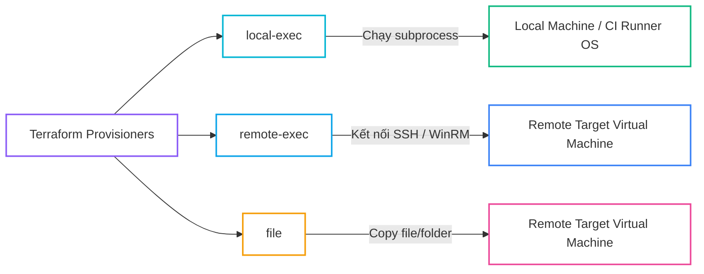
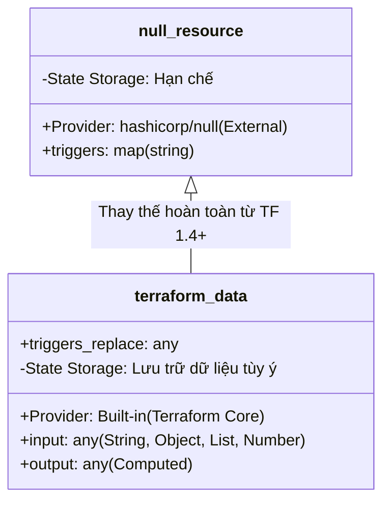
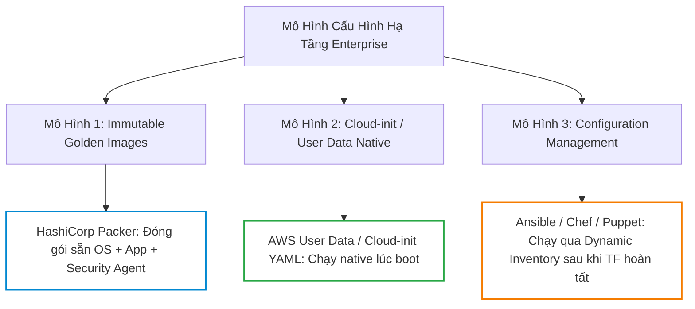
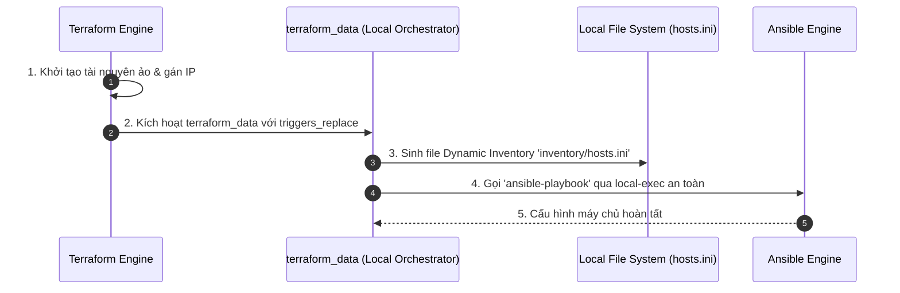
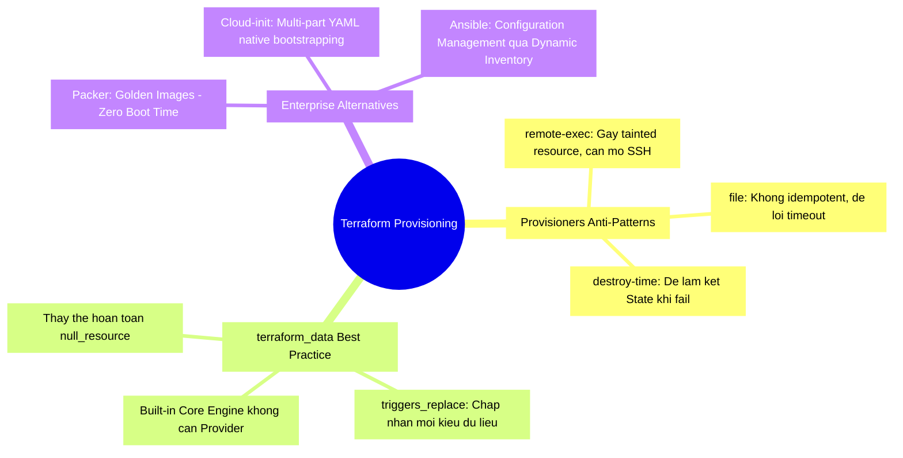


# Provisioners, terraform_data và Chuyển Đổi State Không Phá Hủy Hạ Tầng

Trong những ngày đầu tiếp cận Infrastructure as Code, hầu hết các kỹ sư đều có xu hướng sử dụng **Provisioners** (`local-exec`, `remote-exec`, `file`) để cài đặt phần mềm, chạy lệnh Bash, hoặc kích hoạt các script cấu hình ngay sau khi máy chủ vừa được khởi tạo. Tuy nhiên, trong tài liệu chính thức của mình, HashiCorp đã đưa ra lời cảnh báo đanh thép: **"Provisioners are a Last Resort" (Provisioners là giải pháp đường cùng)**.

Tại sao một tính năng tưởng chừng tiện lợi lại bị xem là "anti-pattern" trong kiến trúc IaC hiện đại? Bản chất của Provisioners phá vỡ tính **Declarative** (khai báo), **Idempotent** (bất biến) và gây rủi ro làm hỏng **Terraform State** như thế nào? Và quan trọng nhất: Làm thế nào để thay thế `null_resource` cũ kỹ bằng tài nguyên tích hợp sẵn **`terraform_data`** (kể từ Terraform 1.4+), đồng thời kết hợp hoàn hảo với **Cloud-init**, **Packer (Golden Images)** và **Ansible**?

Bài viết này sẽ mổ xẻ toàn diện cơ chế hoạt động bên dưới của Provisioners, phân tích các rủi ro chết người, và hướng dẫn xây dựng quy trình cấu hình máy chủ chuẩn Enterprise không gây gián đoạn hạ tầng.

---

## 1. Bản Chất Kỹ Thuật: Tại Sao Provisioners Là "Last Resort"?

Để hiểu tại sao Provisioners bị hạn chế, chúng ta cần phân tích sự khác biệt giữa mô hình **Declarative (Khai báo)** của Terraform Core và mô hình **Imperative (Mệnh lệnh)** của Shell Script.

```mermaid
flowchart TD
    subgraph Declarative_Model ["Mô Hình Declarative Chuẩn: Terraform Native"]
        D1["Đọc Code Khai Báo .tf"] --> D2["So Sánh State & Thực Tế API"]
        D2 --> D3["Tính Toán Diff Tối Thiểu"]
        D3 --> D4["Gọi Cloud API Chuẩn Idempotent"]
        D4 --> D5["Ghi Nhận ID Vào State"]
    end

    subgraph Provisioner_Model ["Mô Hình Imperative: Provisioners Phá Vỡ Luồng"]
        P1["Tạo Xong Resource Thô"] --> P2["Mở Kết Nối SSH / WinRM / Local Subprocess"]
        P2 --> P3["Chạy Shell Script Mệnh Lệnh"]
        P3 -->|Nếu Mất Mạng Hoặc Script Lỗi| P4["Terraform Đánh Dấu Resource Là TAINTED"]
        P4 --> P5["Lần Chạy Sau: BẮT BUỘC HỦY & TẠO LẠI TOÀN BỘ MÁY CHỦ!"]
        P3 -->|Thành công| P6["Không Lưu Lại Lịch Sử Script Vào State"]
    end

    style D4 fill:none,stroke:#28a745,stroke-width:2px
    style P4 fill:none,stroke:#ff0000,stroke-width:2px
    style P5 fill:none,stroke:#ff0000,stroke-width:2px


```



### 1.1. 5 Rủi Ro Nghiêm Trọng Khi Lạm Dụng Provisioners

1. **Phá Vỡ Tính Idempotency (Bất Biến)**: Shell script không thể tự kiểm tra trạng thái xem gói phần mềm đã cài đặt hay chưa. Nếu chạy lại, script có thể ghi đè file cấu hình, gây lỗi xung đột tiến trình hoặc restart dịch vụ ngoài ý muốn.
2. **Hội Chứng "Tainted Resource"**: Nếu một `remote-exec` script bị lỗi (ví dụ: `apt-get update` bị timeout do mạng), Terraform coi như tài nguyên chưa hoàn tất và đánh dấu là `tainted`. Ở lần apply tiếp theo, Terraform sẽ **XÓA SỔ MÁY CHỦ VÀ TẠO MỚI**, ngay cả khi phần cứng máy chủ hoàn toàn bình thường!
3. **Phụ Thuộc Mạng & Bảo Mật Yếu**: `remote-exec` đòi hỏi máy chạy Terraform (hoặc CI/CD Runner) phải có quyền truy cập trực tiếp qua cổng SSH (22) hoặc WinRM (5985/5986), buộc doanh nghiệp phải mở cổng mạng hoặc lưu trữ Private SSH Keys rủi ro.
4. **Không Có Khả Năng Drift Detection**: Terraform State chỉ lưu ID của máy chủ, **hoàn toàn không lưu vết trạng thái của những gì script đã làm**. Nếu ai đó thay đổi file config trên server, `terraform plan` sẽ hoàn toàn "mù tò" (không phát hiện được drift).
5. **Không Thể Rollback Khi Thất Bại**: Nếu script chạy dở dang đến bước 5 thì chết, Terraform không có cơ chế hoàn tác lại bước 1, 2, 3, 4, để lại máy chủ ở trạng thái "nửa vời" (Half-baked State).

---

## 2. Phân Loại 3 Dạng Provisioners & Cách Hoạt Động

Mặc dù bị khuyến cáo hạn chế, Provisioners vẫn tồn tại trong HCL để phục vụ các tình huống đặc thù (ví dụ: gọi Webhook nội bộ, kích hoạt Ansible Playbook từ local).



### 2.1. `local-exec`: Thực Thi Lệnh Trên Máy Chạy Terraform

Thường được sử dụng để ghi log, tạo file cấu hình cục bộ, hoặc gọi script Python/Ansible trên máy trạm hoặc CI/CD runner.

```hcl
resource "aws_instance" "web" {
  ami           = "ami-0c55b159cbfafe1f0"
  instance_type = "t3.micro"

  # Creation-time provisioner: Chạy ngay sau khi máy chủ tạo xong
  provisioner "local-exec" {
    command = "echo 'Server ${self.id} created at ${self.public_ip}' >> ./inventory.txt"
  }

  # Destroy-time provisioner: Chạy TRƯỚC KHI máy chủ bị xóa
  provisioner "local-exec" {
    when    = destroy
    command = "echo 'Decommissioning server ${self.id}...' >> ./audit.log"
  }
}
```

> [!WARNING]
> Thuộc tính `on_failure`: Mặc định là `fail` (gặp lỗi sẽ dừng và taint resource). Bạn có thể đổi thành `on_failure = continue` để bỏ qua lỗi, nhưng cần hết sức cẩn trọng!

### 2.2. `remote-exec` & `file`: Thao Tác Từ Xa Qua SSH/WinRM

```hcl
resource "aws_instance" "legacy_app" {
  ami           = "ami-0c55b159cbfafe1f0"
  instance_type = "t3.small"
  key_name      = "devops-keypair"

  # Cấu hình kết nối SSH
  connection {
    type        = "ssh"
    user        = "ubuntu"
    private_key = file("~/.ssh/id_rsa")
    host        = self.public_ip
    timeout     = "5m"
  }

  # Copy file cấu hình lên máy chủ
  provisioner "file" {
    source      = "configs/nginx.conf"
    destination = "/tmp/nginx.conf"
  }

  # Thực thi shell script từ xa
  provisioner "remote-exec" {
    inline = [
      "sudo apt-get update -y",
      "sudo apt-get install -y nginx",
      "sudo mv /tmp/nginx.conf /etc/nginx/nginx.conf",
      "sudo systemctl restart nginx"
    ]
  }
}
```

---

## 3. Khai Thác `terraform_data` (Terraform 1.4+) Thay Thế `null_resource`

Trước Terraform 1.4, các kỹ sư thường phải import thêm provider bên thứ ba `hashicorp/null` và dùng tài nguyên `null_resource` để thực thi logic tùy biến hoặc trigger vòng lặp. 

Kể từ **Terraform 1.4+**, HashiCorp đã tích hợp trực tiếp **`terraform_data`** vào Terraform Core Engine mà **không cần cài thêm bất kỳ provider nào**, đồng thời bổ sung các tính năng quản lý state vượt trội.



### 3.1. Bảng So Sánh Chuyên Sâu: `null_resource` vs `terraform_data`

| Tiêu Chí | `null_resource` (Cũ) | `terraform_data` (Hiện Đại) |
| :--- | :--- | :--- |
| **Nguồn gốc** | Provider riêng `hashicorp/null` (Phải tải plugin) | Tích hợp sẵn trong Core Engine (Không cần tải) |
| **Trigger Recreate** | Chỉ hỗ trợ `triggers = map(string)` | Hỗ trợ `triggers_replace = any` (Object, Set, List, Hash) |
| **Lưu trữ dữ liệu vào State** | Không hỗ trợ lưu giá trị tùy ý | Hỗ trợ thuộc tính `input` và `output` cho mọi Data Type |
| **Khả năng phối hợp lifecycle** | Kém linh hoạt | Tương thích hoàn hảo với `replace_triggered_by` |
| **Khuyến nghị sử dụng** | **DEPRECATED / Không nên dùng mới** | **TIÊU CHUẨN VÀNG (Best Practice)** |

### 3.2. Ứng Dụng Thực Chiến Của `terraform_data`

#### Tình huống 1: Kích hoạt chạy lại lệnh khi file cấu hình thay đổi
```hcl
resource "terraform_data" "kubernetes_bootstrap" {
  # Tự động trigger lại khi hash của file kubeconfig hoặc version thay đổi
  triggers_replace = [
    filebase64sha256("${path.module}/manifests/app.yaml"),
    var.app_release_version
  ]

  provisioner "local-exec" {
    command = "kubectl apply -f ${path.module}/manifests/app.yaml --kubeconfig=${var.kubeconfig_path}"
  }
}
```

#### Tình huống 2: Lưu trữ giá trị lịch sử để kiểm soát chuyển đổi State (State Migration)
`terraform_data` có thể lưu giữ giá trị của chu kỳ trước đó (`output`) và so sánh với giá trị mới (`input`) để đưa ra quyết định mà không phá hủy tài nguyên:

```hcl
variable "revision" {
  type    = string
  default = "v1"
}

resource "terraform_data" "state_tracker" {
  input = var.revision
}

output "previous_revision" {
  # Giá trị trước đó trong State
  value = terraform_data.state_tracker.output
}
```

---

## 4. Giải Pháp Thay Thế Chuẩn Enterprise Cho Provisioners

Thay vì dùng `remote-exec` đầy rủi ro, các tổ chức lớn áp dụng 3 mô hình tiêu chuẩn sau:



### 4.1. Giải Pháp 1: Cloud-init / User Data (Khuyến Nghị Hàng Đầu)
Toàn bộ logic cài đặt được đẩy sang cơ chế khởi động bản địa của Cloud Provider. Terraform chỉ làm duy nhất một việc: Giao bản thiết kế cho máy chủ và để hệ điều hành tự xử lý khi khởi động (Bootstrapping).

```hcl
data "cloudinit_config" "server_config" {
  gzip          = true
  base64_encode = true

  part {
    content_type = "text/cloud-config"
    content = yamlencode({
      package_update = true
      packages = [
        "docker.io",
        "curl",
        "jq"
      ]
      write_files = [
        {
          path        = "/etc/app/config.json"
          permissions = "0644"
          content = jsonencode({
            environment = "production"
            api_endpoint = "https://api.internal.corp"
          })
        }
      ]
      runcmd = [
        ["systemctl", "enable", "--now", "docker"],
        ["docker", "run", "-d", "-p", "80:80", "nginx:alpine"]
      ]
    })
  }
}

resource "aws_instance" "app_server" {
  ami           = "ami-0c55b159cbfafe1f0"
  instance_type = "t3.medium"
  user_data     = data.cloudinit_config.server_config.rendered

  tags = {
    Name = "cloudinit-app-server"
  }
}
```

---

## 5. Hands-On Lab: Kết Hợp `terraform_data`, Cloud-init & Dynamic Ansible Inventory

Trong bài lab này, chúng ta sẽ xây dựng một kiến trúc kết hợp hoàn hảo: Sử dụng `terraform_data` để tự động sinh file **Ansible Inventory** từ dữ liệu đầu ra của Terraform, đồng thời cấu hình máy chủ an toàn không dùng `remote-exec`.



### Bước 1: Khởi tạo thư mục lab
```bash
mkdir -p terraform-lab17-provisioners
cd terraform-lab17-provisioners
mkdir -p inventories scripts
```

### Bước 2: Tạo script giả lập Ansible Playbook
Tạo file `scripts/mock_ansible.sh`:
```bash
#!/bin/bash
INVENTORY_FILE=$1
echo "=== [ANSIBLE PLAYBOOK EXECUTION] ==="
echo "Đang đọc danh sách máy chủ từ: $INVENTORY_FILE"
cat "$INVENTORY_FILE"
echo ">> Kiểm tra kết nối Ping: SUCCESS"
echo ">> Triển khai Microservice Container: DONE"
echo "=== [HOÀN TẤT CẤU HÌNH THÀNH CÔNG] ==="
```
Cấp quyền thực thi:
```bash
chmod +x scripts/mock_ansible.sh
```

### Bước 3: Định nghĩa `main.tf` với `terraform_data`
Tạo file `main.tf`:
```hcl
terraform {
  required_version = ">= 1.5.0"
}

variable "cluster_nodes" {
  type = map(object({
    role = string
    ip   = string
  }))
  default = {
    "node-01" = { role = "master", ip = "192.168.10.11" }
    "node-02" = { role = "worker", ip = "192.168.10.12" }
    "node-03" = { role = "worker", ip = "192.168.10.13" }
  }
}

# Giả lập danh sách máy chủ
resource "terraform_data" "servers" {
  for_each = var.cluster_nodes
  input = {
    hostname = each.key
    role     = each.value.role
    ip       = each.value.ip
  }
}

# Tự động sinh nội dung Ansible Inventory
locals {
  inventory_content = <<-EOT
    # Tự động sinh bởi Terraform Data Engine - ${timestamp()}
    [masters]
    %{ for name, node in var.cluster_nodes ~}
    %{ if node.role == "master" ~}
    ${name} ansible_host=${node.ip}
    %{ endif ~}
    %{ endfor ~}

    [workers]
    %{ for name, node in var.cluster_nodes ~}
    %{ if node.role == "worker" ~}
    ${name} ansible_host=${node.ip}
    %{ endif ~}
    %{ endfor ~}
  EOT
}

# Tự động kích hoạt cấu hình Ansible khi danh sách Nodes thay đổi
resource "terraform_data" "ansible_orchestrator" {
  # Bất cứ khi nào danh sách nodes hoặc IP thay đổi, trigger chạy lại
  triggers_replace = [
    sha256(local.inventory_content)
  ]

  # Tạo file inventory
  provisioner "local-exec" {
    command = <<-EOT
      mkdir -p inventories
      cat << 'EOF' > inventories/hosts.ini
${local.inventory_content}
EOF
      echo "Đã ghi nhận file inventories/hosts.ini"
    EOT
  }

  # Kích hoạt Ansible chạy
  provisioner "local-exec" {
    command     = "bash ./scripts/mock_ansible.sh ./inventories/hosts.ini"
    working_dir = path.module
  }
}

output "generated_inventory" {
  value = local.inventory_content
}
```

### Bước 4: Chạy `terraform init` và `terraform apply`
```bash
terraform init
terraform apply -auto-approve
```

**Quan sát kết quả terminal:**
```text
terraform_data.ansible_orchestrator: Provisioning with 'local-exec'...
terraform_data.ansible_orchestrator (local-exec): Executing: ["/bin/sh" "-c" "..."]
terraform_data.ansible_orchestrator (local-exec): === [ANSIBLE PLAYBOOK EXECUTION] ===
terraform_data.ansible_orchestrator (local-exec): Đang đọc danh sách máy chủ từ: ./inventories/hosts.ini
terraform_data.ansible_orchestrator (local-exec): [masters]
terraform_data.ansible_orchestrator (local-exec): node-01 ansible_host=192.168.10.11
terraform_data.ansible_orchestrator (local-exec): [workers]
terraform_data.ansible_orchestrator (local-exec): node-02 ansible_host=192.168.10.12
terraform_data.ansible_orchestrator (local-exec): node-03 ansible_host=192.168.10.13
terraform_data.ansible_orchestrator (local-exec): >> Cấu hình máy chủ hoàn tất
```

### Bước 5: Kiểm tra file inventory thực tế
```bash
cat inventories/hosts.ini
```

### Bước 6: Thử nghiệm thêm 1 Worker Node mới
Chạy lệnh apply với node mới:
```bash
terraform apply -var='cluster_nodes={"node-01":{"role":"master","ip":"192.168.10.11"},"node-02":{"role":"worker","ip":"192.168.10.12"},"node-03":{"role":"worker","ip":"192.168.10.13"},"node-04":{"role":"worker","ip":"192.168.10.14"}}' -auto-approve
```
**Nhận xét**: `terraform_data.ansible_orchestrator` phát hiện `triggers_replace` bị thay đổi mã hash SHA256 và tự động tái chạy script đồng bộ hóa node mới ngay tức thì!

### Bước 7: Dọn dẹp môi trường lab
```bash
terraform destroy -auto-approve
cd ..
rm -rf terraform-lab17-provisioners
```

---

## 6. 10 Câu Hỏi Trắc Nghiệm & Phỏng Vấn Chuyên Sâu (Self-Check Q&A)

<details class="qa-card">
<summary class="qa-summary">
  <div class="qa-summary-left">
    <span class="qa-num-badge">Q01</span>
    <span>Tại sao <code>remote-exec</code> thất bại lại khiến máy chủ bị đánh dấu là "Tainted"?</span>
  </div>
  <span class="qa-chevron">
    <svg width="18" height="18" fill="none" stroke="currentColor" stroke-width="2.5" viewBox="0 0 24 24"><polyline points="6 9 12 15 18 9"></polyline></svg>
  </span>
</summary>
<div class="qa-answer">
  <div class="qa-answer-header">
    <svg width="14" height="14" fill="none" stroke="currentColor" stroke-width="2" viewBox="0 0 24 24"><path d="M22 11.08V12a10 10 0 1 1-5.93-9.14"></path><polyline points="22 4 12 14.01 9 11.01"></polyline></svg>
    <span>Phân Tích &amp; Lời Giải Kỹ Thuật</span>
  </div>
  <p style="margin: 0.4rem 0;">Vì Terraform coi việc khởi tạo tài nguyên bao gồm cả hai bước: Tạo phần cứng Cloud và chạy Provisioner cấu hình. Nếu provisioner ném ra exit code khác 0, Terraform hiểu rằng máy chủ đang ở trạng thái lỗi/chưa sẵn sàng phục vụ. Để đảm bảo tính toàn vẹn (integrity), Terraform taint máy chủ đó để buộc phải xóa và dựng lại ở lần chạy sau.</p>
</div>
</details>

<details class="qa-card">
<summary class="qa-summary">
  <div class="qa-summary-left">
    <span class="qa-num-badge">Q02</span>
    <span>Khối <code>connection</code> bên trong resource có tác dụng gì và hỗ trợ những giao thức nào?</span>
  </div>
  <span class="qa-chevron">
    <svg width="18" height="18" fill="none" stroke="currentColor" stroke-width="2.5" viewBox="0 0 24 24"><polyline points="6 9 12 15 18 9"></polyline></svg>
  </span>
</summary>
<div class="qa-answer">
  <div class="qa-answer-header">
    <svg width="14" height="14" fill="none" stroke="currentColor" stroke-width="2" viewBox="0 0 24 24"><path d="M22 11.08V12a10 10 0 1 1-5.93-9.14"></path><polyline points="22 4 12 14.01 9 11.01"></polyline></svg>
    <span>Phân Tích &amp; Lời Giải Kỹ Thuật</span>
  </div>
  <p style="margin: 0.4rem 0;">Khối <code>connection</code> định nghĩa phương thức và thông tin xác thực để các provisioner <code>file</code> và <code>remote-exec</code> kết nối vào máy chủ đích. Nó hỗ trợ 2 giao thức chính: <b style="color: var(--accent-primary);">SSH</b> (mặc định cho Linux, port 22) và <b style="color: var(--accent-primary);">WinRM</b> (dành cho Windows Server, port 5985/5986).</p>
</div>
</details>

<details class="qa-card">
<summary class="qa-summary">
  <div class="qa-summary-left">
    <span class="qa-num-badge">Q03</span>
    <span>destroy-time provisioner (when = destroy) có những hạn chế nghiêm trọng nào?</span>
  </div>
  <span class="qa-chevron">
    <svg width="18" height="18" fill="none" stroke="currentColor" stroke-width="2.5" viewBox="0 0 24 24"><polyline points="6 9 12 15 18 9"></polyline></svg>
  </span>
</summary>
<div class="qa-answer">
  <div class="qa-answer-header">
    <svg width="14" height="14" fill="none" stroke="currentColor" stroke-width="2" viewBox="0 0 24 24"><path d="M22 11.08V12a10 10 0 1 1-5.93-9.14"></path><polyline points="22 4 12 14.01 9 11.01"></polyline></svg>
    <span>Phân Tích &amp; Lời Giải Kỹ Thuật</span>
  </div>
  <p style="margin: 0.4rem 0;">Trong destroy-time provisioner:</p>
  <div style="margin: 0.35rem 0; padding-left: 1rem; border-left: 2px solid var(--accent-primary);">• Khối provisioner chỉ có thể truy cập <code>self.*</code> và <code>count.index</code>, <b style="color: var(--accent-primary);">hoàn toàn không thể tham chiếu</b> đến các resource khác (vì các resource khác có thể đã bị xóa trước đó).</div>
  <div style="margin: 0.35rem 0; padding-left: 1rem; border-left: 2px solid var(--accent-primary);">• Nếu destroy-time provisioner gặp lỗi thất bại, lệnh <code>terraform destroy</code> sẽ dừng lại và tài nguyên không bị xóa khỏi State, dễ dẫn đến tình trạng State bị kẹt.</div>
</div>
</details>

<details class="qa-card">
<summary class="qa-summary">
  <div class="qa-summary-left">
    <span class="qa-num-badge">Q04</span>
    <span>Điểm khác nhau căn bản giữa <code>triggers</code> trong <code>null_resource</code> và <code>triggers_replace</code> trong <code>terraform_data</code>?</span>
  </div>
  <span class="qa-chevron">
    <svg width="18" height="18" fill="none" stroke="currentColor" stroke-width="2.5" viewBox="0 0 24 24"><polyline points="6 9 12 15 18 9"></polyline></svg>
  </span>
</summary>
<div class="qa-answer">
  <div class="qa-answer-header">
    <svg width="14" height="14" fill="none" stroke="currentColor" stroke-width="2" viewBox="0 0 24 24"><path d="M22 11.08V12a10 10 0 1 1-5.93-9.14"></path><polyline points="22 4 12 14.01 9 11.01"></polyline></svg>
    <span>Phân Tích &amp; Lời Giải Kỹ Thuật</span>
  </div>
  <p style="margin: 0.4rem 0;"></p>
  <div style="margin: 0.35rem 0; padding-left: 1rem; border-left: 2px solid var(--accent-primary);">• <code>null_resource.triggers</code> chỉ chấp nhận một map các chuỗi string (<code>map(string)</code>).</div>
  <div style="margin: 0.35rem 0; padding-left: 1rem; border-left: 2px solid var(--accent-primary);">• <code>terraform_data.triggers_replace</code> chấp nhận bất kỳ kiểu dữ liệu nào (<code>any</code>), bao gồm complex objects, lists, sets, hoặc kết quả băm sha256, mang lại sự linh hoạt tối đa.</div>
</div>
</details>

<details class="qa-card">
<summary class="qa-summary">
  <div class="qa-summary-left">
    <span class="qa-num-badge">Q05</span>
    <span>Tại sao HashiCorp Packer (Golden Images) được coi là giải pháp tối ưu hơn cả Provisioners lẫn Cloud-init khi scale lớn?</span>
  </div>
  <span class="qa-chevron">
    <svg width="18" height="18" fill="none" stroke="currentColor" stroke-width="2.5" viewBox="0 0 24 24"><polyline points="6 9 12 15 18 9"></polyline></svg>
  </span>
</summary>
<div class="qa-answer">
  <div class="qa-answer-header">
    <svg width="14" height="14" fill="none" stroke="currentColor" stroke-width="2" viewBox="0 0 24 24"><path d="M22 11.08V12a10 10 0 1 1-5.93-9.14"></path><polyline points="22 4 12 14.01 9 11.01"></polyline></svg>
    <span>Phân Tích &amp; Lời Giải Kỹ Thuật</span>
  </div>
  <p style="margin: 0.4rem 0;">Packer thực hiện việc cài đặt phần mềm, vá lỗi bảo mật OS (OS Hardening), và cấu hình runtime <b style="color: var(--accent-primary);">ngay trong giai đoạn Build Image</b> (Bake time). Khi máy chủ khởi động (Boot time), nó chỉ mất 30-45 giây để sẵn sàng nhận traffic thay vì mất 10-15 phút để chạy script tải packages qua mạng, giúp Auto-scaling phản ứng tức thì khi có đột biến lưu lượng.</p>
</div>
</details>

<details class="qa-card">
<summary class="qa-summary">
  <div class="qa-summary-left">
    <span class="qa-num-badge">Q06</span>
    <span>Nếu bạn bắt buộc phải dùng <code>local-exec</code>, làm thế nào để truyền các biến môi trường bí mật (Secrets) vào script an toàn?</span>
  </div>
  <span class="qa-chevron">
    <svg width="18" height="18" fill="none" stroke="currentColor" stroke-width="2.5" viewBox="0 0 24 24"><polyline points="6 9 12 15 18 9"></polyline></svg>
  </span>
</summary>
<div class="qa-answer">
  <div class="qa-answer-header">
    <svg width="14" height="14" fill="none" stroke="currentColor" stroke-width="2" viewBox="0 0 24 24"><path d="M22 11.08V12a10 10 0 1 1-5.93-9.14"></path><polyline points="22 4 12 14.01 9 11.01"></polyline></svg>
    <span>Phân Tích &amp; Lời Giải Kỹ Thuật</span>
  </div>
  <p style="margin: 0.4rem 0;">Sử dụng khối <code>environment</code> bên trong <code>provisioner "local-exec"</code> thay vì chèn trực tiếp chuỗi vào <code>command</code>:</p>
  <pre style="background: rgba(0,0,0,0.35); padding: 0.75rem 1rem; border-radius: 6px; border: 1px solid var(--border-color); font-size: 0.85rem; overflow-x: auto; margin: 0.5rem 0;"><code class="language-hcl">provisioner &quot;local-exec&quot; {
  command = &quot;bash ./deploy.sh&quot;
  environment = {
    API_TOKEN = var.vault_token # Không bị lộ trực tiếp trên process list ps aux
  }
}</code></pre>
</div>
</details>

<details class="qa-card">
<summary class="qa-summary">
  <div class="qa-summary-left">
    <span class="qa-num-badge">Q07</span>
    <span>Thuộc tính <code>on_failure = continue</code> trong provisioner hoạt động ra sao?</span>
  </div>
  <span class="qa-chevron">
    <svg width="18" height="18" fill="none" stroke="currentColor" stroke-width="2.5" viewBox="0 0 24 24"><polyline points="6 9 12 15 18 9"></polyline></svg>
  </span>
</summary>
<div class="qa-answer">
  <div class="qa-answer-header">
    <svg width="14" height="14" fill="none" stroke="currentColor" stroke-width="2" viewBox="0 0 24 24"><path d="M22 11.08V12a10 10 0 1 1-5.93-9.14"></path><polyline points="22 4 12 14.01 9 11.01"></polyline></svg>
    <span>Phân Tích &amp; Lời Giải Kỹ Thuật</span>
  </div>
  <p style="margin: 0.4rem 0;">Nếu script của provisioner trả về mã lỗi (non-zero exit code), Terraform sẽ ghi lại cảnh báo (Warning) trong terminal nhưng <b style="color: var(--accent-primary);">vẫn coi như tài nguyên thành công</b>, không đánh dấu tainted và tiếp tục thực thi các bước tiếp theo của pipeline.</p>
</div>
</details>

<details class="qa-card">
<summary class="qa-summary">
  <div class="qa-summary-left">
    <span class="qa-num-badge">Q08</span>
    <span>Có thể dùng <code>terraform_data</code> để thay thế một resource mà không làm thay đổi ID hạ tầng trên Cloud không?</span>
  </div>
  <span class="qa-chevron">
    <svg width="18" height="18" fill="none" stroke="currentColor" stroke-width="2.5" viewBox="0 0 24 24"><polyline points="6 9 12 15 18 9"></polyline></svg>
  </span>
</summary>
<div class="qa-answer">
  <div class="qa-answer-header">
    <svg width="14" height="14" fill="none" stroke="currentColor" stroke-width="2" viewBox="0 0 24 24"><path d="M22 11.08V12a10 10 0 1 1-5.93-9.14"></path><polyline points="22 4 12 14.01 9 11.01"></polyline></svg>
    <span>Phân Tích &amp; Lời Giải Kỹ Thuật</span>
  </div>
  <p style="margin: 0.4rem 0;">Có thể. <code>terraform_data</code> là một logical resource chỉ tồn tại trong State của Terraform. Bạn có thể thêm, sửa, xóa, hoặc recreate <code>terraform_data</code> tùy ý mà không gửi bất kỳ API call nào làm ảnh hưởng đến các tài nguyên thực tế trên AWS/GCP/Azure.</p>
</div>
</details>

<details class="qa-card">
<summary class="qa-summary">
  <div class="qa-summary-left">
    <span class="qa-num-badge">Q09</span>
    <span>Sự khác biệt giữa <code>user_data</code> thông thường và <code>data.cloudinit_config</code> là gì?</span>
  </div>
  <span class="qa-chevron">
    <svg width="18" height="18" fill="none" stroke="currentColor" stroke-width="2.5" viewBox="0 0 24 24"><polyline points="6 9 12 15 18 9"></polyline></svg>
  </span>
</summary>
<div class="qa-answer">
  <div class="qa-answer-header">
    <svg width="14" height="14" fill="none" stroke="currentColor" stroke-width="2" viewBox="0 0 24 24"><path d="M22 11.08V12a10 10 0 1 1-5.93-9.14"></path><polyline points="22 4 12 14.01 9 11.01"></polyline></svg>
    <span>Phân Tích &amp; Lời Giải Kỹ Thuật</span>
  </div>
  <p style="margin: 0.4rem 0;"><code>user_data</code> thông thường chỉ là một chuỗi shell script đơn lẻ. <code>cloudinit_config</code> là cơ chế đa thành phần (multi-part MIME), cho phép kết hợp song song Cloud-Config YAML (quản lý files, users, packages) và nhiều đoạn Shell Scripts độc lập, hỗ trợ nén <code>gzip</code> và mã hóa <code>base64</code> tự động.</p>
</div>
</details>

<details class="qa-card">
<summary class="qa-summary">
  <div class="qa-summary-left">
    <span class="qa-num-badge">Q10</span>
    <span>Khi nào thì việc sử dụng <code>local-exec</code> được coi là chấp nhận được (Acceptable Practice)?</span>
  </div>
  <span class="qa-chevron">
    <svg width="18" height="18" fill="none" stroke="currentColor" stroke-width="2.5" viewBox="0 0 24 24"><polyline points="6 9 12 15 18 9"></polyline></svg>
  </span>
</summary>
<div class="qa-answer">
  <div class="qa-answer-header">
    <svg width="14" height="14" fill="none" stroke="currentColor" stroke-width="2" viewBox="0 0 24 24"><path d="M22 11.08V12a10 10 0 1 1-5.93-9.14"></path><polyline points="22 4 12 14.01 9 11.01"></polyline></svg>
    <span>Phân Tích &amp; Lời Giải Kỹ Thuật</span>
  </div>
  <p style="margin: 0.4rem 0;">Khi dùng để thực hiện các tác vụ điều phối bên ngoài (Orchestration glue) không can thiệp vào bên trong máy chủ, ví dụ: kích hoạt Webhook thông báo Slack khi hạ tầng tạo xong, ghi file output cục bộ cho tool khác sử dụng, hoặc gọi CLI công cụ bảo mật nội bộ để quét tuân thủ.</p>
</div>
</details>

---

## 7. Tổng Kết & Cheat Sheet Thực Chiến



- **Quy tắc bất biến**: Tuyệt đối không dùng `remote-exec` để cài đặt phần mềm trên Production. Hãy đóng gói sẵn vào AMI/Image bằng **Packer** hoặc chuyển giao cho **Cloud-init / Ansible**.
- **Tiêu chuẩn Terraform 1.4+**: Xóa bỏ vĩnh viễn `null_resource` khỏi codebase và chuyển sang sử dụng `terraform_data`.
- **Bước tiếp theo**: Trong [Bài 18: Provider Alias, Multi-Region và Multi-Account Enterprise Architecture](./18-provider-alias-multi-region-va-multi-account-enterprise-architecture.md), chúng ta sẽ khám phá cách quản trị hạ tầng xuyên lục địa (Multi-Region Disaster Recovery) và mở rộng mô hình Multi-Account chuẩn AWS Landing Zone!

