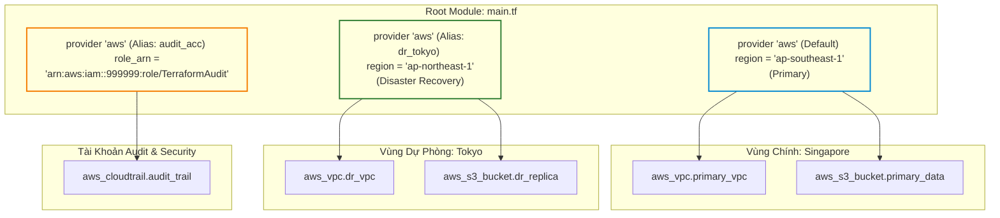
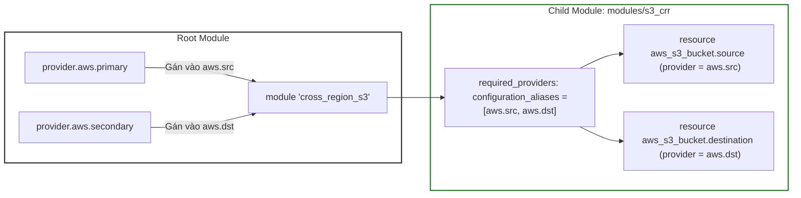
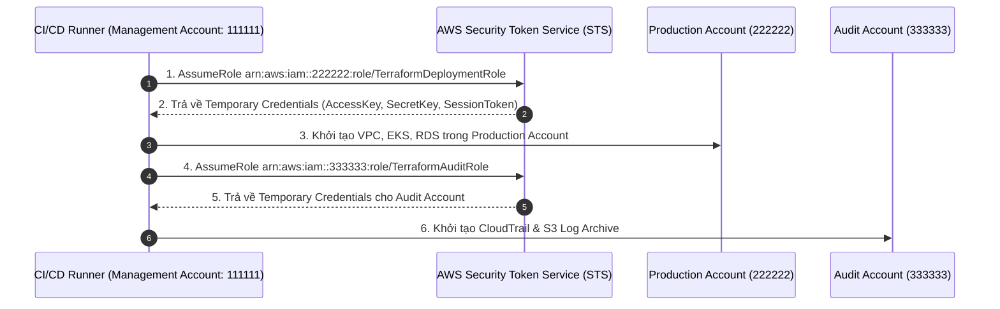
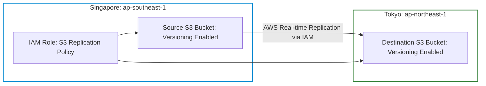
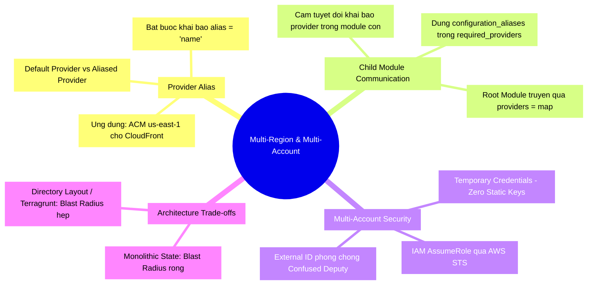


# Provider Alias, Multi-Region và Multi-Account Enterprise Architecture

Trong các tập đoàn công nghệ và doanh nghiệp tài chính quy mô lớn, hạ tầng không bao giờ gói gọn trong một vùng địa lý (Single-Region) hay một tài khoản Cloud duy nhất (Single-Account). Để đạt được các tiêu chuẩn khắt khe về **Disaster Recovery (RPO/RTO tính bằng giây)**, **Phân lập bảo mật (Blast Radius Isolation)** và **Tuân thủ quy định dữ liệu (Data Residency Compliance)**, các kiến trúc sư buộc phải thiết kế hạ tầng trải dài trên nhiều Region và phân bổ trên hàng chục tài khoản AWS/GCP/Azure độc lập.

Làm thế nào để một đoạn mã Terraform duy nhất có thể khởi tạo tài nguyên song song tại Singapore (`ap-southeast-1`) và Tokyo (`ap-northeast-1`)? Làm thế nào để tự động thiết lập quyền **IAM AssumeRole** xuyên tài khoản (Cross-Account) từ Pipeline trung tâm vào tài khoản Production? Và làm thế nào để truyền tải các cấu hình Provider tùy biến vào trong **Child Modules** một cách bài bản thông qua `configuration_aliases`?

Bài viết này sẽ đi sâu vào kiến trúc **Provider Alias**, giải mã luồng xác thực đa tài khoản và hướng dẫn xây dựng hệ thống **Multi-Region S3 Cross-Region Replication (CRR)** chuẩn Enterprise.

---

## 1. Kiến Trúc Provider System: Single vs Multiple Provider Instances

Mặc định, khi bạn khai báo một khối `provider "aws"`, Terraform Core Engine sẽ khởi tạo một **Default Provider Instance** duy nhất. Tất cả các tài nguyên và data sources không khai báo thuộc tính `provider` sẽ tự động liên kết với thực thể mặc định này.

Tuy nhiên, khi cần tương tác với nhiều Region hoặc nhiều Account khác nhau trong cùng một lần chạy, bạn cần khai báo thêm các **Aliased Provider Instances** bằng meta-argument `alias`.



### 1.1. Khai Báo Provider Alias Chuẩn Ở Root Module

```hcl
terraform {
  required_version = ">= 1.5.0"
  required_providers {
    aws = {
      source  = "hashicorp/aws"
      version = "~> 5.0"
    }
  }
}

# 1. Provider mặc định (Primary Region - Singapore)
provider "aws" {
  region = "ap-southeast-1"
  default_tags {
    tags = {
      Environment = "Production"
      Region      = "Primary-Singapore"
      ManagedBy   = "Terraform"
    }
  }
}

# 2. Provider phụ với Alias (Disaster Recovery - Tokyo)
provider "aws" {
  alias  = "dr_tokyo"
  region = "ap-northeast-1"
  default_tags {
    tags = {
      Environment = "Production"
      Region      = "DR-Tokyo"
      ManagedBy   = "Terraform"
    }
  }
}

# 3. Provider đặc biệt dành cho CloudFront Certificate (bắt buộc us-east-1)
provider "aws" {
  alias  = "us_east_1_acm"
  region = "us-east-1"
}
```

---

## 2. Truyền Tải Provider Vào Child Modules Với `configuration_aliases`

Một trong những sai lầm phổ biến nhất của các kỹ sư là cố gắng khai báo khối `provider` trực tiếp bên trong Child Module. 

> [!CAUTION]
> **Quy tắc Vàng của Terraform Architecture**:
> **TUYỆT ĐỐI KHÔNG KHAI BÁO KHỐI `provider` BÊN TRONG CHILD MODULES!** 
> Child Module chỉ được phép khai báo `required_providers` và `configuration_aliases`. Việc khởi tạo provider phải hoàn toàn do **Root Module** chịu trách nhiệm.



### 2.1. Cấu Hình Bên Trong Child Module (`modules/s3_crr/versions.tf`)

```hcl
terraform {
  required_version = ">= 1.5.0"
  required_providers {
    aws = {
      source  = "hashicorp/aws"
      version = ">= 5.0"
      # Khai báo các bí danh mà module này yêu cầu nhận từ bên ngoài
      configuration_aliases = [
        aws.src,
        aws.dst
      ]
    }
  }
}
```

### 2.2. Khởi Tạo Tài Nguyên Bên Trong Child Module (`modules/s3_crr/main.tf`)

```hcl
# Tạo Bucket nguồn tại Primary Region thông qua alias aws.src
resource "aws_s3_bucket" "source" {
  provider      = aws.src
  bucket_prefix = "corp-primary-data-"
}

# Tạo Bucket đích tại DR Region thông qua alias aws.dst
resource "aws_s3_bucket" "destination" {
  provider      = aws.dst
  bucket_prefix = "corp-dr-replica-"
}
```

### 2.3. Gọi Module Từ Root Module (`main.tf`)

```hcl
module "s3_cross_region_backup" {
  source = "./modules/s3_crr"

  # Truyền các Provider Instances thực tế vào bí danh của Child Module
  providers = {
    aws.src = aws
    aws.dst = aws.dr_tokyo
  }
}
```

---

## 3. Kiến Trúc Multi-Account Với IAM AssumeRole

Trong các tổ chức áp dụng AWS Landing Zone (AWS Control Tower / AWS Organizations), các môi trường như `Shared-Services`, `Development`, `Staging`, `Production`, và `Security-Audit` nằm ở các AWS Account hoàn toàn tách biệt.

Thay vì phải tạo Access Key tĩnh nguy hiểm cho từng tài khoản, hệ thống CI/CD Pipeline trung tâm chỉ giữ một IAM Identity duy nhất và sử dụng **STS AssumeRole** để mượn quyền tạm thời sang các tài khoản đích.



### 3.1. Code Khai Báo Multi-Account Provider

```hcl
# Provider cho Tài Khoản Production (Deploy Workloads)
provider "aws" {
  alias  = "production"
  region = "ap-southeast-1"

  assume_role {
    role_arn     = "arn:aws:iam::222222222222:role/TerraformDeploymentRole"
    session_name = "Terraform-Production-Deployment"
    external_id  = "Corp-Security-Strict-ID-99"
  }
}

# Provider cho Tài Khoản Security & Audit (Deploy Logging)
provider "aws" {
  alias  = "security_audit"
  region = "ap-southeast-1"

  assume_role {
    role_arn     = "arn:aws:iam::333333333333:role/TerraformSecurityAuditRole"
    session_name = "Terraform-Security-Audit"
  }
}
```

---

## 4. Bảng So Sánh Các Giải Pháp Triển Khai Đa Vùng & Đa Tài Khoản

| Tiêu Chí | Monolithic Single-State Multi-Provider | Multi-Directory Layout (Từng State Riêng) | Terragrunt Multi-Account Orchestration |
| :--- | :--- | :--- | :--- |
| **Cơ chế hoạt động** | Dùng chung 1 State file, khai báo nhiều Provider Alias | Chia nhỏ thư mục: `prod-sg/`, `prod-jp/`, mỗi nơi 1 state | Sử dụng Terragrunt include tự động sinh Provider động |
| **Blast Radius (Phạm vi rủi ro)** | Rộng (Nếu State bị lock hoặc lỗi, ảnh hưởng toàn cầu) | Rất hẹp (Lỗi ở Tokyo không ảnh hưởng đến Singapore) | Rất hẹp (Tách biệt State 100% giữa các Accounts) |
| **Tốc độ Plan & Apply** | Chậm (Phải quét toàn bộ tài nguyên ở tất cả Regions) | Nhanh (Chỉ quét Region hoặc Account được chỉ định) | Nhanh và hỗ trợ chạy song song (`run-all apply`) |
| **Trường hợp áp dụng phù hợp** | Tài nguyên liên kết trực tiếp (S3 CRR, Transit GW Peering) | Hạ tầng tiêu chuẩn (VPC, EKS, Database độc lập) | Toàn bộ hệ thống Enterprise quy mô lớn |

---

## 5. Hands-On Lab: Xây Dựng Hệ Thống Sao Chép Dữ Liệu Đa Vùng (S3 CRR)

Trong bài lab này, chúng ta sẽ xây dựng một kiến trúc sao lưu đa vùng hoàn chỉnh: S3 Bucket nguồn tại `ap-southeast-1` (Singapore) tự động nhân bản dữ liệu (Replication) theo thời gian thực sang S3 Bucket đích tại `ap-northeast-1` (Tokyo) với IAM Role phân quyền chặt chẽ.



### Bước 1: Khởi tạo cấu trúc thư mục
```bash
mkdir -p terraform-lab18-multiregion
cd terraform-lab18-multiregion
```

### Bước 2: Tạo file `providers.tf`
Tạo file `providers.tf`:
```hcl
terraform {
  required_version = ">= 1.5.0"
  required_providers {
    aws = {
      source  = "hashicorp/aws"
      version = "~> 5.0"
    }
  }
}

# Primary Provider (Singapore)
provider "aws" {
  region = "ap-southeast-1"
}

# Secondary Provider với Alias (Tokyo)
provider "aws" {
  alias  = "tokyo"
  region = "ap-northeast-1"
}
```

### Bước 3: Tạo file `main.tf` triển khai S3 Replication Đa Vùng
Tạo file `main.tf`:
```hcl
# 1. TẠO BUCKET ĐÍCH TẠI TOKYO (DÙNG ALIAS PROVIDER)
resource "aws_s3_bucket" "destination" {
  provider      = aws.tokyo
  bucket_prefix = "corp-s3-backup-tokyo-"
}

resource "aws_s3_bucket_versioning" "destination" {
  provider = aws.tokyo
  bucket   = aws_s3_bucket.destination.id
  versioning_configuration {
    status = "Enabled"
  }
}

# 2. TẠO IAM ROLE CHO PHÉP REPLICATION TẠI SINGAPORE
resource "aws_iam_role" "replication" {
  name = "s3-cross-region-replication-role"

  assume_role_policy = jsonencode({
    Version = "2012-10-17"
    Statement = [
      {
        Action = "sts:AssumeRole"
        Effect = "Allow"
        Principal = {
          Service = "s3.amazonaws.com"
        }
      }
    ]
  })
}

# 3. GẮN POLICY PHÂN QUYỀN ĐỌC SOURCE VÀ GHI DESTINATION
resource "aws_iam_policy" "replication" {
  name = "s3-cross-region-replication-policy"

  policy = jsonencode({
    Version = "2012-10-17"
    Statement = [
      {
        Action = [
          "s3:GetReplicationConfiguration",
          "s3:ListBucket"
        ]
        Effect   = "Allow"
        Resource = [aws_s3_bucket.source.arn]
      },
      {
        Action = [
          "s3:GetObjectVersionForReplication",
          "s3:GetObjectVersionAcl",
          "s3:GetObjectVersionTagging"
        ]
        Effect   = "Allow"
        Resource = ["${aws_s3_bucket.source.arn}/*"]
      },
      {
        Action = [
          "s3:ReplicateObject",
          "s3:ReplicateDelete",
          "s3:ReplicateTags"
        ]
        Effect   = "Allow"
        Resource = ["${aws_s3_bucket.destination.arn}/*"]
      }
    ]
  })
}

resource "aws_iam_role_policy_attachment" "replication" {
  role       = aws_iam_role.replication.name
  policy_arn = aws_iam_policy.replication.arn
}

# 4. TẠO BUCKET NGUỒN TẠI SINGAPORE (DÙNG DEFAULT PROVIDER)
resource "aws_s3_bucket" "source" {
  bucket_prefix = "corp-s3-primary-sg-"
}

resource "aws_s3_bucket_versioning" "source" {
  bucket = aws_s3_bucket.source.id
  versioning_configuration {
    status = "Enabled"
  }
}

# 5. CẤU HÌNH REPLICATION RULE TẠI NGUỒN
resource "aws_s3_bucket_replication_configuration" "replication" {
  depends_on = [aws_s3_bucket_versioning.source, aws_s3_bucket_versioning.destination]

  role   = aws_iam_role.replication.arn
  bucket = aws_s3_bucket.source.id

  rule {
    id     = "FullBackupToTokyo"
    status = "Enabled"

    destination {
      bucket        = aws_s3_bucket.destination.arn
      storage_class = "STANDARD_IA" # Tối ưu chi phí lưu trữ dự phòng
    }
  }
}

output "primary_bucket_name" {
  value = aws_s3_bucket.source.id
}

output "dr_replica_bucket_name" {
  value = aws_s3_bucket.destination.id
}
```

### Bước 4: Chạy `terraform init` và `terraform plan`
```bash
terraform init
terraform plan
```
Quan sát: Terraform tải duy nhất AWS Provider plugin nhưng khởi tạo **2 phiên bản thực thi độc lập** kết nối tới 2 Region khác nhau.

### Bước 5: Apply hạ tầng và kiểm tra State
```bash
terraform apply -auto-approve
```

### Bước 6: Kiểm tra tài nguyên tạo ở 2 vùng
Chạy lệnh kiểm tra metadata:
```bash
terraform state list
```
**Kết quả:**
- `aws_s3_bucket.source` được định vị tại Singapore.
- `aws_s3_bucket.destination` được định vị tại Tokyo.

### Bước 7: Thử nghiệm kiểm tra độ trễ và ràng buộc
Kiểm tra cấu hình replication đã được kích hoạt thành công:
```bash
terraform state show aws_s3_bucket_replication_configuration.replication
```

### Bước 8: Dọn dẹp môi trường lab
```bash
terraform destroy -auto-approve
cd ..
rm -rf terraform-lab18-multiregion
```

---

## 6. 10 Câu Hỏi Trắc Nghiệm & Phỏng Vấn Chuyên Sâu (Self-Check Q&A)

<details class="qa-card">
<summary class="qa-summary">
  <div class="qa-summary-left">
    <span class="qa-num-badge">Q01</span>
    <span>Điều gì xảy ra nếu một resource trong file <code>.tf</code> không khai báo thuộc tính <code>provider = ...</code>?</span>
  </div>
  <span class="qa-chevron">
    <svg width="18" height="18" fill="none" stroke="currentColor" stroke-width="2.5" viewBox="0 0 24 24"><polyline points="6 9 12 15 18 9"></polyline></svg>
  </span>
</summary>
<div class="qa-answer">
  <div class="qa-answer-header">
    <svg width="14" height="14" fill="none" stroke="currentColor" stroke-width="2" viewBox="0 0 24 24"><path d="M22 11.08V12a10 10 0 1 1-5.93-9.14"></path><polyline points="22 4 12 14.01 9 11.01"></polyline></svg>
    <span>Phân Tích &amp; Lời Giải Kỹ Thuật</span>
  </div>
  <p style="margin: 0.4rem 0;">Terraform sẽ tự động liên kết resource đó với <b style="color: var(--accent-primary);">Default Provider Instance</b> của loại provider tương ứng (tức là khối <code>provider</code> không có meta-argument <code>alias</code>).</p>
</div>
</details>

<details class="qa-card">
<summary class="qa-summary">
  <div class="qa-summary-left">
    <span class="qa-num-badge">Q02</span>
    <span>Tại sao Child Module không được phép chứa khối cấu hình <code>provider</code> có thông tin xác thực (Credentials)?</span>
  </div>
  <span class="qa-chevron">
    <svg width="18" height="18" fill="none" stroke="currentColor" stroke-width="2.5" viewBox="0 0 24 24"><polyline points="6 9 12 15 18 9"></polyline></svg>
  </span>
</summary>
<div class="qa-answer">
  <div class="qa-answer-header">
    <svg width="14" height="14" fill="none" stroke="currentColor" stroke-width="2" viewBox="0 0 24 24"><path d="M22 11.08V12a10 10 0 1 1-5.93-9.14"></path><polyline points="22 4 12 14.01 9 11.01"></polyline></svg>
    <span>Phân Tích &amp; Lời Giải Kỹ Thuật</span>
  </div>
  <p style="margin: 0.4rem 0;">Vì Child Module được thiết kế để tái sử dụng nhiều lần ở nhiều môi trường và ngữ cảnh khác nhau. Nếu hardcode cấu hình provider bên trong Child Module, module sẽ mất đi tính linh hoạt, gây xung đột định danh provider khi gọi nhiều lần trong cùng một Root Module, và làm lộ thông tin nhạy cảm.</p>
</div>
</details>

<details class="qa-card">
<summary class="qa-summary">
  <div class="qa-summary-left">
    <span class="qa-num-badge">Q03</span>
    <span><code>configuration_aliases</code> trong khối <code>required_providers</code> của Child Module có mục đích gì?</span>
  </div>
  <span class="qa-chevron">
    <svg width="18" height="18" fill="none" stroke="currentColor" stroke-width="2.5" viewBox="0 0 24 24"><polyline points="6 9 12 15 18 9"></polyline></svg>
  </span>
</summary>
<div class="qa-answer">
  <div class="qa-answer-header">
    <svg width="14" height="14" fill="none" stroke="currentColor" stroke-width="2" viewBox="0 0 24 24"><path d="M22 11.08V12a10 10 0 1 1-5.93-9.14"></path><polyline points="22 4 12 14.01 9 11.01"></polyline></svg>
    <span>Phân Tích &amp; Lời Giải Kỹ Thuật</span>
  </div>
  <p style="margin: 0.4rem 0;">Nó đóng vai trò như một <b style="color: var(--accent-primary);">Interface Contract</b> (Hợp đồng giao diện), thông báo cho Root Module biết rằng Child Module này yêu cầu nhận vào bao nhiêu Provider Instances với những tên bí danh cụ thể nào (ví dụ: <code>aws.source</code>, <code>aws.destination</code>).</p>
</div>
</details>

<details class="qa-card">
<summary class="qa-summary">
  <div class="qa-summary-left">
    <span class="qa-num-badge">Q04</span>
    <span>Khi nào bắt buộc phải dùng Provider với Region <code>us-east-1</code> ngay cả khi toàn bộ hệ thống của bạn nằm ở Singapore (<code>ap-southeast-1</code>)?</span>
  </div>
  <span class="qa-chevron">
    <svg width="18" height="18" fill="none" stroke="currentColor" stroke-width="2.5" viewBox="0 0 24 24"><polyline points="6 9 12 15 18 9"></polyline></svg>
  </span>
</summary>
<div class="qa-answer">
  <div class="qa-answer-header">
    <svg width="14" height="14" fill="none" stroke="currentColor" stroke-width="2" viewBox="0 0 24 24"><path d="M22 11.08V12a10 10 0 1 1-5.93-9.14"></path><polyline points="22 4 12 14.01 9 11.01"></polyline></svg>
    <span>Phân Tích &amp; Lời Giải Kỹ Thuật</span>
  </div>
  <p style="margin: 0.4rem 0;">Khi tạo các tài nguyên toàn cầu của AWS như <b style="color: var(--accent-primary);">AWS WAFv2 (Global Scope)</b> hoặc chứng chỉ SSL/TLS bằng <b style="color: var(--accent-primary);">AWS Certificate Manager (ACM)</b> để gắn vào <b style="color: var(--accent-primary);">Amazon CloudFront Distribution</b>. AWS quy định các chứng chỉ và WAF dành cho CloudFront bắt buộc phải được tạo tại region <code>us-east-1</code>.</p>
</div>
</details>

<details class="qa-card">
<summary class="qa-summary">
  <div class="qa-summary-left">
    <span class="qa-num-badge">Q05</span>
    <span>Khi dùng <code>assume_role</code> trong Provider, cơ chế xác thực diễn ra như thế nào?</span>
  </div>
  <span class="qa-chevron">
    <svg width="18" height="18" fill="none" stroke="currentColor" stroke-width="2.5" viewBox="0 0 24 24"><polyline points="6 9 12 15 18 9"></polyline></svg>
  </span>
</summary>
<div class="qa-answer">
  <div class="qa-answer-header">
    <svg width="14" height="14" fill="none" stroke="currentColor" stroke-width="2" viewBox="0 0 24 24"><path d="M22 11.08V12a10 10 0 1 1-5.93-9.14"></path><polyline points="22 4 12 14.01 9 11.01"></polyline></svg>
    <span>Phân Tích &amp; Lời Giải Kỹ Thuật</span>
  </div>
  <p style="margin: 0.4rem 0;">Máy chạy Terraform dùng danh tính ban đầu (như IAM User, IAM Instance Profile, OIDC Token) để gọi API <code>sts:AssumeRole</code> tới AWS STS. STS kiểm tra chính sách tin cậy (Trust Policy) của IAM Role đích và cấp ngược lại một bộ thông tin xác thực tạm thời (AccessKey, SecretKey, SessionToken có hạn sử dụng 1 giờ). Terraform sau đó dùng bộ khóa tạm thời này để tương tác với tài khoản đích.</p>
</div>
</details>

<details class="qa-card">
<summary class="qa-summary">
  <div class="qa-summary-left">
    <span class="qa-num-badge">Q06</span>
    <span>Làm thế nào để truyền một Provider Alias từ Root Module vào một Module con lồng nhau 2 cấp (Nested Child Module)?</span>
  </div>
  <span class="qa-chevron">
    <svg width="18" height="18" fill="none" stroke="currentColor" stroke-width="2.5" viewBox="0 0 24 24"><polyline points="6 9 12 15 18 9"></polyline></svg>
  </span>
</summary>
<div class="qa-answer">
  <div class="qa-answer-header">
    <svg width="14" height="14" fill="none" stroke="currentColor" stroke-width="2" viewBox="0 0 24 24"><path d="M22 11.08V12a10 10 0 1 1-5.93-9.14"></path><polyline points="22 4 12 14.01 9 11.01"></polyline></svg>
    <span>Phân Tích &amp; Lời Giải Kỹ Thuật</span>
  </div>
  <p style="margin: 0.4rem 0;">Cần phải truyền liên tục qua thuộc tính <code>providers</code> ở từng cấp độ gọi module. Root Module truyền vào Module Cấp 1, và Module Cấp 1 tiếp tục định nghĩa <code>configuration_aliases</code> và truyền tiếp vào Module Cấp 2.</p>
</div>
</details>

<details class="qa-card">
<summary class="qa-summary">
  <div class="qa-summary-left">
    <span class="qa-num-badge">Q07</span>
    <span>Tại sao việc gom quá nhiều Provider Alias vào một State file duy nhất lại được coi là nguy cơ tiềm ẩn (Operational Risk)?</span>
  </div>
  <span class="qa-chevron">
    <svg width="18" height="18" fill="none" stroke="currentColor" stroke-width="2.5" viewBox="0 0 24 24"><polyline points="6 9 12 15 18 9"></polyline></svg>
  </span>
</summary>
<div class="qa-answer">
  <div class="qa-answer-header">
    <svg width="14" height="14" fill="none" stroke="currentColor" stroke-width="2" viewBox="0 0 24 24"><path d="M22 11.08V12a10 10 0 1 1-5.93-9.14"></path><polyline points="22 4 12 14.01 9 11.01"></polyline></svg>
    <span>Phân Tích &amp; Lời Giải Kỹ Thuật</span>
  </div>
  <p style="margin: 0.4rem 0;"></p>
  <div style="margin: 0.35rem 0; padding-left: 1rem; border-left: 2px solid var(--accent-primary);">• <b style="color: var(--accent-primary);">Tăng Blast Radius</b>: Nếu State file bị lỗi hoặc bị lock trong lúc apply, toàn bộ hạ tầng trên tất cả các Region/Account liên quan đều bị đình trệ.</div>
  <div style="margin: 0.35rem 0; padding-left: 1rem; border-left: 2px solid var(--accent-primary);">• <b style="color: var(--accent-primary);">Giảm Tốc Độ (Performance Degrade)</b>: Mỗi lần <code>terraform plan</code>, Terraform phải gửi hàng trăm API calls đồng thời đến nhiều Region trên toàn cầu, làm tăng thời gian thực thi lên gấp nhiều lần và dễ bị dính lỗi Cloud API Rate Limit (Throttling).</div>
</div>
</details>

<details class="qa-card">
<summary class="qa-summary">
  <div class="qa-summary-left">
    <span class="qa-num-badge">Q08</span>
    <span>Sự khác biệt giữa <code>alias</code> trong Provider và <code>alias</code> trong Module call là gì?</span>
  </div>
  <span class="qa-chevron">
    <svg width="18" height="18" fill="none" stroke="currentColor" stroke-width="2.5" viewBox="0 0 24 24"><polyline points="6 9 12 15 18 9"></polyline></svg>
  </span>
</summary>
<div class="qa-answer">
  <div class="qa-answer-header">
    <svg width="14" height="14" fill="none" stroke="currentColor" stroke-width="2" viewBox="0 0 24 24"><path d="M22 11.08V12a10 10 0 1 1-5.93-9.14"></path><polyline points="22 4 12 14.01 9 11.01"></polyline></svg>
    <span>Phân Tích &amp; Lời Giải Kỹ Thuật</span>
  </div>
  <p style="margin: 0.4rem 0;"></p>
  <div style="margin: 0.35rem 0; padding-left: 1rem; border-left: 2px solid var(--accent-primary);">• <code>alias</code> trong Provider: Đặt bí danh để phân biệt các phiên bản thực thi khác nhau của cùng một Cloud Provider (ví dụ: <code>aws.tokyo</code>, <code>aws.singapore</code>).</div>
  <div style="margin: 0.35rem 0; padding-left: 1rem; border-left: 2px solid var(--accent-primary);">• <code>alias</code> không tồn tại trong Module call (Module chỉ có tên gọi định danh instance như <code>module "web_sg"</code> hoặc <code>module "web_jp"</code>).</div>
</div>
</details>

<details class="qa-card">
<summary class="qa-summary">
  <div class="qa-summary-left">
    <span class="qa-num-badge">Q09</span>
    <span>Tham số <code>external_id</code> trong khối <code>assume_role</code> có vai trò quan trọng gì về mặt bảo mật?</span>
  </div>
  <span class="qa-chevron">
    <svg width="18" height="18" fill="none" stroke="currentColor" stroke-width="2.5" viewBox="0 0 24 24"><polyline points="6 9 12 15 18 9"></polyline></svg>
  </span>
</summary>
<div class="qa-answer">
  <div class="qa-answer-header">
    <svg width="14" height="14" fill="none" stroke="currentColor" stroke-width="2" viewBox="0 0 24 24"><path d="M22 11.08V12a10 10 0 1 1-5.93-9.14"></path><polyline points="22 4 12 14.01 9 11.01"></polyline></svg>
    <span>Phân Tích &amp; Lời Giải Kỹ Thuật</span>
  </div>
  <p style="margin: 0.4rem 0;">Ngăn chặn tấn công <b style="color: var(--accent-primary);">Confused Deputy Problem</b> trong mô hình Multi-Tenant (nhiều khách hàng/bên thứ ba cùng truy cập vào một tài khoản AWS). <code>external_id</code> đóng vai trò như một mật khẩu bí mật bổ sung mà bên mượn quyền bắt buộc phải cung cấp khi gọi AssumeRole.</p>
</div>
</details>

<details class="qa-card">
<summary class="qa-summary">
  <div class="qa-summary-left">
    <span class="qa-num-badge">Q10</span>
    <span>Có thể sử dụng <code>count</code> hoặc <code>for_each</code> trực tiếp trên khối <code>provider</code> để tự động tạo 20 Providers cho 20 Regions không?</span>
  </div>
  <span class="qa-chevron">
    <svg width="18" height="18" fill="none" stroke="currentColor" stroke-width="2.5" viewBox="0 0 24 24"><polyline points="6 9 12 15 18 9"></polyline></svg>
  </span>
</summary>
<div class="qa-answer">
  <div class="qa-answer-header">
    <svg width="14" height="14" fill="none" stroke="currentColor" stroke-width="2" viewBox="0 0 24 24"><path d="M22 11.08V12a10 10 0 1 1-5.93-9.14"></path><polyline points="22 4 12 14.01 9 11.01"></polyline></svg>
    <span>Phân Tích &amp; Lời Giải Kỹ Thuật</span>
  </div>
  <p style="margin: 0.4rem 0;"><b style="color: var(--accent-primary);">KHÔNG</b>. Terraform HCL không hỗ trợ <code>count</code> hoặc <code>for_each</code> trên khối <code>provider</code>. Mỗi khối <code>provider</code> bắt buộc phải được khai báo tĩnh (static declaration) tại thời điểm viết code vì Terraform Core cần dựng Provider Plugins trước khi parse biến số và vòng lặp. Để tự động hóa nhiều Regions, người ta dùng các công cụ wrapper như <b style="color: var(--accent-primary);">Terragrunt</b> hoặc module layout.</p>
</div>
</details>

---

## 7. Tổng Kết & Cheat Sheet Thực Chiến



- **Quy tắc thiết kế Child Module**: Luôn giữ Child Module "vô tính" (Provider-agnostic), chỉ khai báo `configuration_aliases` và nhận provider instance từ Root Module.
- **Tiêu chuẩn bảo mật Multi-Account**: 100% kết nối xuyên tài khoản phải thông qua **IAM AssumeRole** và có chính sách Session Name tường minh để phục vụ kiểm toán CloudTrail.
- **Bước tiếp theo**: Trong [[Bài 19] Terraform Trong CI/CD: Tự Động Hóa Pipeline Với GitLab CI, GitHub Actions & OIDC](terraform-19-19-terraform-trong-cicd-gitlab-ci-github-actions-va-oidc.html), chúng ta sẽ tự động hóa hoàn toàn quy trình Plan/Apply và loại bỏ vĩnh viễn Long-lived Cloud Credentials bằng OpenID Connect (OIDC)!

