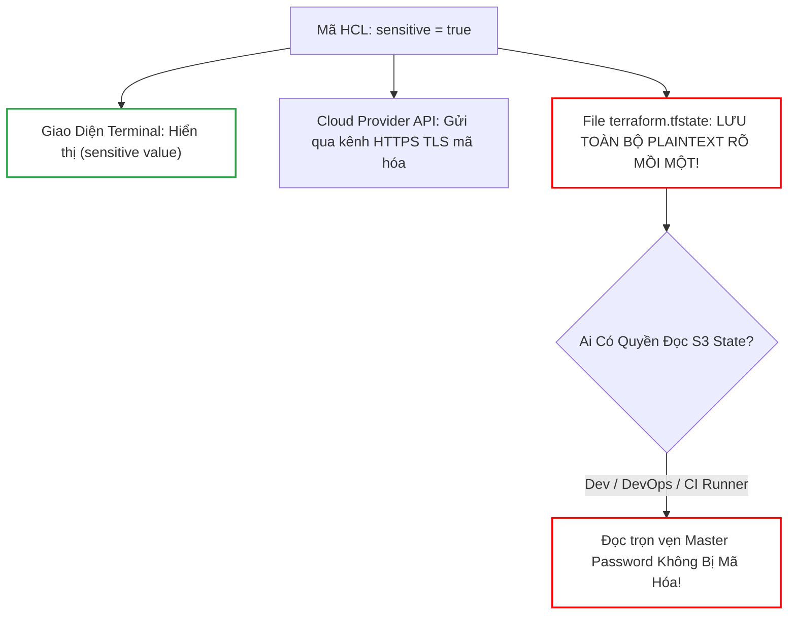
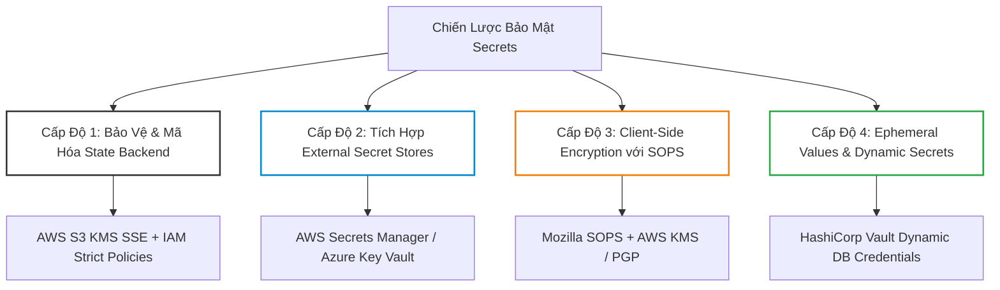
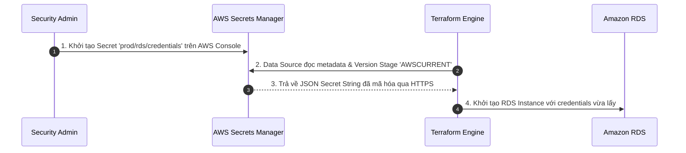
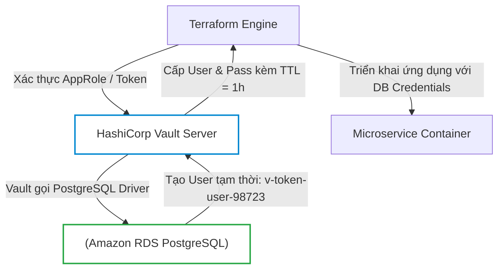
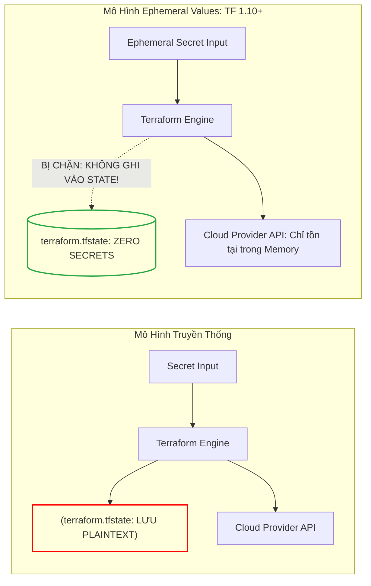
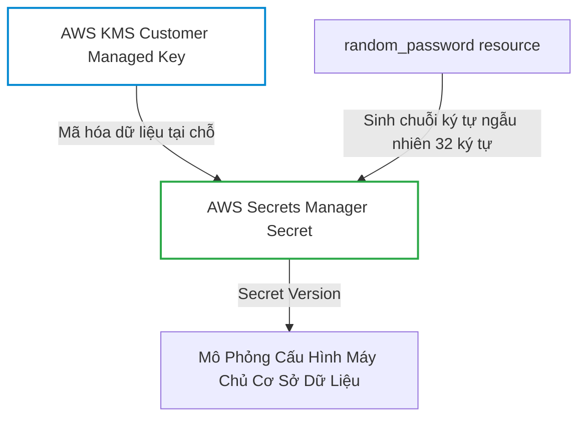
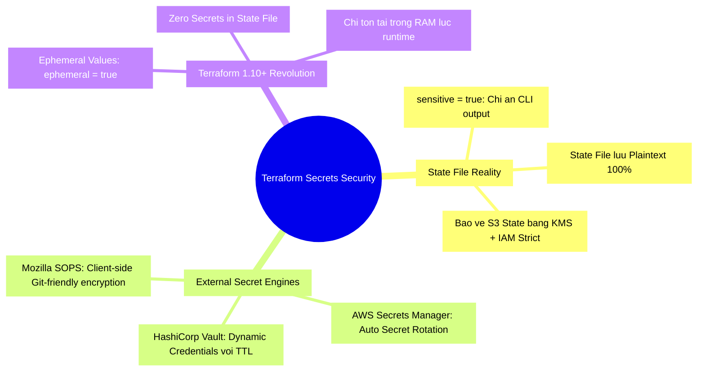


# Quản Lý Secrets và Dữ Liệu Sensitive Trong Terraform Chuẩn Doanh Nghiệp

Trong toàn bộ hệ sinh thái Infrastructure as Code, không có chủ đề nào nhạy cảm và tiềm ẩn nhiều rủi ro an ninh mạng như việc **Quản lý Thông tin Bí mật (Secrets Management)**. Khi triển khai hạ tầng, mã nguồn Terraform của bạn bắt buộc phải tương tác với hàng chục loại dữ liệu mật: mật khẩu quản trị cơ sở dữ liệu (Master Database Password), Private SSL Keys, API Tokens của dịch vụ thanh toán, hoặc các cặp khóa mã hóa đối xứng.

Một sai lầm kinh điển mà ngay cả những kỹ sư giàu kinh nghiệm cũng thường mắc phải là tin rằng việc khai báo `sensitive = true` trên biến số hoặc outputs là đủ để bảo vệ dữ liệu. **SỰ THẬT LÀ**: Cờ `sensitive = true` chỉ có tác dụng ẩn giá trị trên màn hình dòng lệnh (CLI Output), trong khi **toàn bộ bí mật vẫn được lưu trữ dưới dạng văn bản thuần (Plaintext)** bên trong tệp `terraform.tfstate`!

Làm thế nào để bảo vệ State file khỏi các cuộc tấn công đánh cắp dữ liệu? Làm thế nào để tích hợp **HashiCorp Vault** nhằm sinh mật khẩu động tự hủy (Dynamic Secrets)? Và làm thế nào để sử dụng tính năng **Ephemeral Values** (vừa ra mắt trong Terraform 1.10+) để ngăn chặn hoàn toàn việc ghi secrets vào State?

Bài viết này sẽ mổ xẻ toàn diện các góc khuất bảo mật của Terraform State và cung cấp các mẫu thiết kế kiến trúc bảo mật chuẩn Enterprise.

---

## 1. Mổ Xẻ Cạm Bẫy: "Bí Mật Trần Trụi" Trong Terraform State

Khi bạn định nghĩa một biến số với thuộc tính `sensitive = true`:

```hcl
variable "db_password" {
  type        = string
  sensitive   = true # Chỉ ẩn giá trị trên terminal!
  description = "Mật khẩu quản trị cơ sở dữ liệu"
}

resource "aws_db_instance" "core_db" {
  allocated_storage = 20
  engine            = "postgres"
  instance_class    = "db.t3.micro"
  username          = "dbadmin"
  password          = var.db_password # TRUYỀN VÀO RESOURCE
}
```

Khi bạn chạy `terraform plan` hoặc `terraform apply`, Terraform sẽ che giấu giá trị:
```text
  # aws_db_instance.core_db will be created
  + resource "aws_db_instance" "core_db" {
      + username = "dbadmin"
      + password = (sensitive value)
    }
```



### 1.1. Bằng Chứng Thực Tế Từ Tệp State
Nếu bạn mở trực tiếp tệp `terraform.tfstate` hoặc tải từ S3 Backend về:
```json
{
  "version": 4,
  "terraform_version": "1.6.0",
  "resources": [
    {
      "mode": "managed",
      "type": "aws_db_instance",
      "name": "core_db",
      "instances": [
        {
          "attributes": {
            "id": "db-ABC123XYZ",
            "username": "dbadmin",
            "password": "MySuperSecretPassword2026!#",
            "engine": "postgres"
          },
          "sensitive_attributes": [
            [
              {
                "type": "get_attr",
                "value": "password"
              }
            ]
          ]
        }
      ]
    }
  ]
}
```
> [!CAUTION]
> Mặc dù `sensitive_attributes` ghi nhận rằng trường `password` là nhạy cảm (để CLI biết đường che đi), nhưng giá trị thật `"MySuperSecretPassword2026!#"` nằm ngay tại trường `attributes.password` dưới dạng **Plaintext 100%**. Bất kỳ ai có quyền `s3:GetObject` trên S3 State Bucket đều có thể đọc được toàn bộ mật khẩu hạ tầng!

---

## 2. Ma Trận Chiến Lược Quản Trị Secrets Trong Doanh Nghiệp

Để giải quyết vấn đề trên, các tổ chức áp dụng 4 cấp độ bảo vệ Secrets:



### 2.1. So Sánh Các Giải Pháp Quản Lý Secrets

| Giải Pháp | Cơ Chế Hoạt Động | Ưu Điểm | Nhược Điểm | Vết Lưu Trong State File |
| :--- | :--- | :--- | :--- | :--- |
| **Input Variables (`sensitive = true`)** | Truyền qua file `.tfvars` hoặc ENV | Dễ cấu hình, không cần công cụ ngoài | Phải bảo vệ file `.tfvars`, nguy cơ commit Git | **Có lưu Plaintext** |
| **AWS Secrets Manager / SSM** | Đọc dữ liệu qua Data Source lúc Apply | Quản lý tập trung trên Cloud | Phải cấp quyền IAM cho máy chạy Terraform | **Có lưu Plaintext** (trừ khi dùng Ephemeral) |
| **Mozilla SOPS + KMS** | Mã hóa file `.enc.yaml` và commit vào Git | GitOps thân thiện, an toàn trên Git Repo | Cần cài thêm plugin SOPS, quản lý khóa KMS | **Có lưu Plaintext** (lúc giải mã trong memory) |
| **HashiCorp Vault Dynamic Secrets** | Sinh mật khẩu tạm thời tự động hủy sau TTL | Tự động hủy mật khẩu, quyền hạn tối thiểu | Cần vận hành cụm HashiCorp Vault Cluster | **Có lưu Plaintext** (nhưng mật khẩu tự hết hạn) |
| **Terraform Ephemeral Values (1.10+)** | Khai báo biến/tài nguyên dạng ephemeral | **KHÔNG BAO GIỜ LƯU VÀO STATE FILE!** | Chỉ hỗ trợ từ Terraform 1.10+ | **HOÀN TOÀN KHÔNG LƯU (Zero State)** |

---

## 3. Tích Hợp AWS Secrets Manager & Data Source

Mô hình phổ biến nhất trên AWS là tạo Secret trên AWS Secrets Manager, sau đó Terraform chỉ đọc dữ liệu thông qua Data Source hoặc chuyển giao trực tiếp ARN cho dịch vụ đích.



```hcl
# 1. Khai báo Data Source để lấy thông tin Secret từ AWS Secrets Manager
data "aws_secretsmanager_secret" "db_secret_meta" {
  name = "production/core-database/credentials"
}

data "aws_secretsmanager_secret_version" "db_credentials" {
  secret_id = data.aws_secretsmanager_secret.db_secret_meta.id
}

locals {
  # Parse chuỗi JSON lưu trong Secret Manager
  db_creds = jsondecode(data.aws_secretsmanager_secret_version.db_credentials.secret_string)
}

# 2. Sử dụng trong Resource
resource "aws_db_instance" "production_db" {
  identifier        = "corp-prod-db"
  allocated_storage = 100
  engine            = "postgres"
  instance_class    = "db.r6g.large"
  username          = local.db_creds.username
  password          = local.db_creds.password

  # Không in password ra log
  lifecycle {
    ignore_changes = [password]
  }
}
```

---

## 4. HashiCorp Vault & Dynamic Database Secrets: Đỉnh Cao Bảo Mật

Thay vì lưu một mật khẩu cố định (Static Credentials) dùng chung từ năm này qua năm khác, **HashiCorp Vault** cung cấp tính năng **Dynamic Database Secrets**: Mỗi khi Terraform hoặc Ứng dụng cần kết nối DB, Vault sẽ tự động kết nối vào PostgreSQL, tạo ra một user mới toanh với mật khẩu ngẫu nhiên kèm thời hạn sử dụng (Time-to-Live - TTL). Sau khi hết hạn TTL, Vault tự động xóa user đó khỏi database!



```hcl
# Cấu hình Vault Provider
provider "vault" {
  address = "https://vault.internal.corp:8200"
}

# Yêu cầu Vault sinh Dynamic Database Credentials với role 'readonly-analyst'
data "vault_generic_secret" "dynamic_db_creds" {
  path = "database/creds/readonly-analyst"
}

output "db_temporary_username" {
  value     = data.vault_generic_secret.dynamic_db_creds.data["username"]
  sensitive = true
}

output "db_temporary_password" {
  value     = data.vault_generic_secret.dynamic_db_creds.data["password"]
  sensitive = true
}
```

---

## 5. Cuộc Cách Mạng: Ephemeral Values Trong Terraform 1.10+

Kể từ **Terraform 1.10+**, HashiCorp đã giới thiệu khái niệm **Ephemeral Values (Giá trị Phù du)** và **Ephemeral Resources**. Đây là bước tiến quan trọng nhất trong lịch sử Terraform nhằm giải quyết triệt để vấn đề rò rỉ Secrets trong State file!



### 5.1. Khai Báo Biến Số Dạng Ephemeral
```hcl
# Yêu cầu Terraform >= 1.10.0
variable "api_secret_token" {
  type      = string
  ephemeral = true # ĐÁNH DẤU LÀ GIÁ TRỊ PHÙ DU (KHÔNG GHI VÀO STATE)
}

# Biến số này chỉ được phép truyền vào các tài nguyên hoặc provider hỗ trợ ephemeral
# Nếu cố tình gán vào một Managed Resource thông thường, Terraform sẽ báo lỗi compile time!
```

---

## 6. Hands-On Lab: Xây Dựng Quy Trình Quản Lý Secrets Bằng AWS Secrets Manager & Terraform

Trong bài lab này, chúng ta sẽ xây dựng một quy trình chuẩn doanh nghiệp: Khởi tạo một Secret được mã hóa bằng AWS KMS Customer Managed Key (CMK), tự động sinh mật khẩu ngẫu nhiên bảo mật cao và truyền vào tài nguyên hạ tầng.



### Bước 1: Khởi tạo thư mục thực hành
```bash
mkdir -p terraform-lab20-secrets
cd terraform-lab20-secrets
```

### Bước 2: Tạo file `main.tf`
Tạo file `main.tf`:
```hcl
terraform {
  required_version = ">= 1.5.0"
  required_providers {
    aws = {
      source  = "hashicorp/aws"
      version = "~> 5.0"
    }
    random = {
      source  = "hashicorp/random"
      version = "~> 3.5"
    }
  }
}

provider "aws" {
  region = "ap-southeast-1"
}

# 1. TẠO KHÓA MÃ HÓA RIÊNG (KMS CUSTOMER MANAGED KEY)
resource "aws_kms_key" "secrets_key" {
  description             = "KMS Key ma hoa Secrets cho Production Database"
  deletion_window_in_days = 7
  enable_key_rotation     = true

  tags = {
    Environment = "Production"
    ManagedBy   = "Terraform"
  }
}

# 2. SINH MẬT KHẨU NGẪU NHIÊN CHUẨN DOANH NGHIỆP (32 KÝ TỰ, ĐA DẠNG BẢNG MÃ)
resource "random_password" "master_password" {
  length           = 32
  special          = true
  override_special = "!#$%&*()-_=+[]{}<>:?"
}

# 3. TẠO CONTAINER SECRET TRÊN AWS SECRETS MANAGER ĐƯỢC MÃ HÓA BẰNG KMS
resource "aws_secretsmanager_secret" "db_master_credentials" {
  name_prefix             = "corp-prod-db-credentials-"
  description             = "Thong tin xac thuc quan tri Production Database"
  kms_key_id              = aws_kms_key.secrets_key.arn
  recovery_window_in_days = 0 # Xoa ngay lap tuc khi destroy de tiet kiem chi phi lab
}

# 4. GHI NỘI DUNG MẬT KHẨU VÀO SECRET VERSION DƯỚI DẠNG JSON
resource "aws_secretsmanager_secret_version" "db_master_credentials_val" {
  secret_id = aws_secretsmanager_secret.db_master_credentials.id
  secret_string = jsonencode({
    engine   = "postgres"
    host     = "db.prod.internal.corp"
    port     = 5432
    username = "superadmin_user"
    password = random_password.master_password.result
  })
}

# 5. OUTPUT AN TOÀN: CHỈ XUẤT ARN, TUYỆT ĐỐI KHÔNG XUẤT PLAINTEXT PASSWORD
output "secret_metadata" {
  value = {
    secret_arn = aws_secretsmanager_secret.db_master_credentials.arn
    kms_key_id = aws_kms_key.secrets_key.key_id
  }
  description = "Thong tin ARN cua Secret de cac ung dung tham chieu an toan"
}
```

### Bước 3: Khởi tạo và Apply cấu hình
```bash
terraform init
terraform apply -auto-approve
```

### Bước 4: Kiểm tra Secret trên AWS CLI (Xác thực đã được mã hóa)
```bash
SECRET_ARN=$(terraform output -json secret_metadata | jq -r .secret_arn)
aws secretsmanager get-secret-value --secret-id "$SECRET_ARN" --query SecretString --output text | jq .
```
**Kết quả:** JSON Secret được trả về an toàn từ AWS Secrets Manager qua kênh TLS mã hóa.

### Bước 5: Kiểm tra rủi ro trong Local State File
Chạy lệnh kiểm tra State:
```bash
cat terraform.tfstate | grep -i "superadmin_user" -C 3
```
> [!WARNING]
> Quan sát: Bạn sẽ thấy chuỗi mật khẩu vẫn nằm trong State file cục bộ! Điều này một lần nữa khẳng định rằng: **State file phải được bảo vệ nghiêm ngặt bằng S3 Server-Side Encryption (SSE-KMS) và kiểm soát quyền truy cập IAM chặt chẽ.**

### Bước 6: Dọn dẹp môi trường lab
```bash
terraform destroy -auto-approve
cd ..
rm -rf terraform-lab20-secrets
```

---

## 7. 10 Câu Hỏi Trắc Nghiệm & Phỏng Vấn Chuyên Sâu (Self-Check Q&A)

<div class="qa-answer">
  <div class="qa-answer-header">
    <svg width="14" height="14" fill="none" stroke="currentColor" stroke-width="2" viewBox="0 0 24 24"><path d="M22 11.08V12a10 10 0 1 1-5.93-9.14"></path><polyline points="22 4 12 14.01 9 11.01"></polyline></svg>
    <span>Phân Tích &amp; Lời Giải Kỹ Thuật</span>
  </div>
  
<b style="color: var(--accent-primary);">HOÀN TOÀN KHÔNG</b>. Cờ <code>sensitive = true</code> chỉ là một tính năng hiển thị ở tầng UI/CLI của Terraform Core, nhằm ngăn chặn việc in giá trị ra màn hình console hoặc log CI/CD. Trong file <code>terraform.tfstate</code>, dữ liệu vẫn được lưu trữ nguyên vẹn dưới dạng văn bản thuần (Plaintext JSON).
</div>
</details>

<div class="qa-answer">
  <div class="qa-answer-header">
    <svg width="14" height="14" fill="none" stroke="currentColor" stroke-width="2" viewBox="0 0 24 24"><path d="M22 11.08V12a10 10 0 1 1-5.93-9.14"></path><polyline points="22 4 12 14.01 9 11.01"></polyline></svg>
    <span>Phân Tích &amp; Lời Giải Kỹ Thuật</span>
  </div>
  
<div style="margin: 0.35rem 0; padding-left: 1rem; border-left: 2px solid var(--accent-primary);">• <b style="color: var(--accent-primary);">Mã Hóa Lưu Trữ (Encryption at Rest)</b>: Sử dụng AWS KMS Customer Managed Key (SSE-KMS) hoặc Azure Key Vault để mã hóa State Bucket.</div>
  <div style="margin: 0.35rem 0; padding-left: 1rem; border-left: 2px solid var(--accent-primary);">• <b style="color: var(--accent-primary);">Mã Hóa Đường Truyền (Encryption in Transit)</b>: Ép buộc kết nối qua TLS 1.2/1.3 với S3 Bucket Policy (<code>aws:SecureTransport = true</code>).</div>
  <div style="margin: 0.35rem 0; padding-left: 1rem; border-left: 2px solid var(--accent-primary);">• <b style="color: var(--accent-primary);">Kiểm Soát Quyền Truy Cập Tối Thiểu (Least Privilege)</b>: Chỉ cấp quyền đọc State cho CI/CD Execution Role, cấm toàn bộ Developer đọc trực tiếp S3 State của Production.</div>
  <div style="margin: 0.35rem 0; padding-left: 1rem; border-left: 2px solid var(--accent-primary);">• <b style="color: var(--accent-primary);">Bật Versioning & Object Lock</b>: Ngăn chặn việc ghi đè hoặc xóa State độc hại.</div>
</div>
</details>

<div class="qa-answer">
  <div class="qa-answer-header">
    <svg width="14" height="14" fill="none" stroke="currentColor" stroke-width="2" viewBox="0 0 24 24"><path d="M22 11.08V12a10 10 0 1 1-5.93-9.14"></path><polyline points="22 4 12 14.01 9 11.01"></polyline></svg>
    <span>Phân Tích &amp; Lời Giải Kỹ Thuật</span>
  </div>
  
SOPS cho phép bạn viết file <code>.yaml</code> chứa secrets, sau đó dùng AWS KMS, GCP KMS, Azure Key Vault hoặc PGP Key để <b style="color: var(--accent-primary);">chỉ mã hóa các giá trị (values)</b> trong khi giữ nguyên các key. File mã hóa này (<code>secrets.enc.yaml</code>) có thể commit an toàn vào Git. Khi chạy Terraform, provider <code>carlpett/sops</code> sẽ giải mã file trực tiếp trong bộ nhớ RAM lúc runtime.
</div>
</details>

<div class="qa-answer">
  <div class="qa-answer-header">
    <svg width="14" height="14" fill="none" stroke="currentColor" stroke-width="2" viewBox="0 0 24 24"><path d="M22 11.08V12a10 10 0 1 1-5.93-9.14"></path><polyline points="22 4 12 14.01 9 11.01"></polyline></svg>
    <span>Phân Tích &amp; Lời Giải Kỹ Thuật</span>
  </div>
  
<div style="margin: 0.35rem 0; padding-left: 1rem; border-left: 2px solid var(--accent-primary);">• <b style="color: var(--accent-primary);">SSM Parameter Store</b>: Thích hợp cho cấu hình phân cấp, chi phí rẻ (Standard parameters miễn phí), hỗ trợ mã hóa KMS (SecureString).</div>
  <div style="margin: 0.35rem 0; padding-left: 1rem; border-left: 2px solid var(--accent-primary);">• <b style="color: var(--accent-primary);">AWS Secrets Manager</b>: Được thiết kế chuyên biệt cho thông tin xác thực, có chi phí cao hơn ($0.40/secret/tháng), hỗ trợ tính năng <b style="color: var(--accent-primary);">Tự động Xoay Vòng Mật Khẩu (Automatic Secret Rotation)</b> tích hợp sẵn với RDS/Lambda.</div>
</div>
</details>

<div class="qa-answer">
  <div class="qa-answer-header">
    <svg width="14" height="14" fill="none" stroke="currentColor" stroke-width="2" viewBox="0 0 24 24"><path d="M22 11.08V12a10 10 0 1 1-5.93-9.14"></path><polyline points="22 4 12 14.01 9 11.01"></polyline></svg>
    <span>Phân Tích &amp; Lời Giải Kỹ Thuật</span>
  </div>
  
Vì file <code>terraform.tfvars</code> rất dễ bị kỹ sư vô tình commit lên Git repository. Biến môi trường <code>TF_VAR_xyz</code> được inject động trực tiếp từ bộ nhớ của CI/CD Runner và tự hủy khi Job kết thúc, không để lại dấu vết file trên đĩa cứng.
</div>
</details>

<div class="qa-answer">
  <div class="qa-answer-header">
    <svg width="14" height="14" fill="none" stroke="currentColor" stroke-width="2" viewBox="0 0 24 24"><path d="M22 11.08V12a10 10 0 1 1-5.93-9.14"></path><polyline points="22 4 12 14.01 9 11.01"></polyline></svg>
    <span>Phân Tích &amp; Lời Giải Kỹ Thuật</span>
  </div>
  
Nó cho phép định nghĩa các biến số, data sources và tài nguyên chỉ tồn tại tạm thời trong bộ nhớ RAM của quá trình Plan/Apply và <b style="color: var(--accent-primary);">bị loại trừ hoàn toàn khỏi tệp <code>terraform.tfstate</code></b>. Nhờ đó, State file không còn chứa bất kỳ Plaintext Secret nào.
</div>
</details>

<div class="qa-answer">
  <div class="qa-answer-header">
    <svg width="14" height="14" fill="none" stroke="currentColor" stroke-width="2" viewBox="0 0 24 24"><path d="M22 11.08V12a10 10 0 1 1-5.93-9.14"></path><polyline points="22 4 12 14.01 9 11.01"></polyline></svg>
    <span>Phân Tích &amp; Lời Giải Kỹ Thuật</span>
  </div>
  
<div style="margin: 0.35rem 0; padding-left: 1rem; border-left: 2px solid var(--accent-cyan);"><b style="color: var(--accent-cyan);">1.</b> Coi như mật khẩu đã bị xâm phạm (Compromised).</div>
  <div style="margin: 0.35rem 0; padding-left: 1rem; border-left: 2px solid var(--accent-cyan);"><b style="color: var(--accent-cyan);">2.</b> Lập tức đổi mật khẩu trực tiếp trên Database hoặc kích hoạt xoay vòng khóa trên Secrets Manager.</div>
  <div style="margin: 0.35rem 0; padding-left: 1rem; border-left: 2px solid var(--accent-cyan);"><b style="color: var(--accent-cyan);">3.</b> Cập nhật mã nguồn Terraform để đọc secret mới.</div>
  <div style="margin: 0.35rem 0; padding-left: 1rem; border-left: 2px solid var(--accent-cyan);"><b style="color: var(--accent-cyan);">4.</b> Chạy <code>terraform apply</code> để ghi đè State.</div>
  <div style="margin: 0.35rem 0; padding-left: 1rem; border-left: 2px solid var(--accent-cyan);"><b style="color: var(--accent-cyan);">5.</b> Xóa các phiên bản State cũ (State Versions) trong S3 Versioning để loại bỏ hoàn toàn dấu vết mật khẩu cũ.</div>
</div>
</details>

<div class="qa-answer">
  <div class="qa-answer-header">
    <svg width="14" height="14" fill="none" stroke="currentColor" stroke-width="2" viewBox="0 0 24 24"><path d="M22 11.08V12a10 10 0 1 1-5.93-9.14"></path><polyline points="22 4 12 14.01 9 11.01"></polyline></svg>
    <span>Phân Tích &amp; Lời Giải Kỹ Thuật</span>
  </div>
  
Vì hàm <code>file()</code> sẽ nạp toàn bộ nội dung của Private Key vào bộ nhớ HCL và ghi thẳng chuỗi Private Key đó vào thuộc tính của resource trong State file. Thay vào đó, nên quản lý SSH Keys thông qua AWS EC2 Key Pair (chỉ lưu Public Key) hoặc truyền qua AWS SSM Session Manager (không cần SSH Key).
</div>
</details>

<div class="qa-answer">
  <div class="qa-answer-header">
    <svg width="14" height="14" fill="none" stroke="currentColor" stroke-width="2" viewBox="0 0 24 24"><path d="M22 11.08V12a10 10 0 1 1-5.93-9.14"></path><polyline points="22 4 12 14.01 9 11.01"></polyline></svg>
    <span>Phân Tích &amp; Lời Giải Kỹ Thuật</span>
  </div>
  
Khai báo cờ <code>sensitive = true</code> trong khối output:
```hcl
output "db_connection_string" {
  value     = "postgresql://${aws_db_instance.core.username}:${aws_db_instance.core.password}@${aws_db_instance.core.endpoint}"
  sensitive = true
}
```
Nếu output tham chiếu đến một thuộc tính đã được đánh dấu nhạy cảm mà bạn không đặt <code>sensitive = true</code>, Terraform sẽ báo lỗi ngay trong bước Plan.
</div>
</details>

<div class="qa-answer">
  <div class="qa-answer-header">
    <svg width="14" height="14" fill="none" stroke="currentColor" stroke-width="2" viewBox="0 0 24 24"><path d="M22 11.08V12a10 10 0 1 1-5.93-9.14"></path><polyline points="22 4 12 14.01 9 11.01"></polyline></svg>
    <span>Phân Tích &amp; Lời Giải Kỹ Thuật</span>
  </div>
  
Sử dụng phương thức xác thực <b style="color: var(--accent-primary);">Vault AppRole</b> (truyền qua ENV <code>VAULT_ROLE_ID</code> và <code>VAULT_SECRET_ID</code>), <b style="color: var(--accent-primary);">AWS IAM Auth</b> (Terraform ký request bằng AWS STS identity để Vault xác thực), hoặc <b style="color: var(--accent-primary);">Kubernetes Service Account Token</b> nếu Terraform chạy trong Kubernetes Pod.
</div>
</details>

---

## 8. Tổng Kết & Cheat Sheet Thực Chiến



- **Quy tắc sinh tồn**: Coi `terraform.tfstate` là một tài liệu mật cấp độ tối cao. Bất kỳ ai kiểm soát State đều kiểm soát toàn bộ hạ tầng doanh nghiệp của bạn.
- **Tiêu chuẩn thiết kế**: Không bao giờ hardcode mật khẩu, luôn sử dụng **AWS Secrets Manager / Vault** và chuyển dịch dần sang **Ephemeral Values** của Terraform 1.10+.
- **Bước tiếp theo**: Trong [Bài 21: Kiểm Thử Hạ Tầng: terraform test, TFLint, Trivy và Validate](./21-kiem-thu-ha-tang-terraform-test-tflint-trivy-va-validate.md), chúng ta sẽ khám phá framework kiểm thử hạ tầng tích hợp sẵn `terraform test` và bộ công cụ Static Analysis đa tầng!

