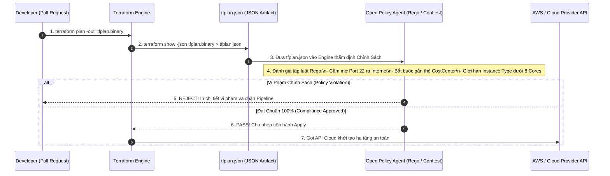
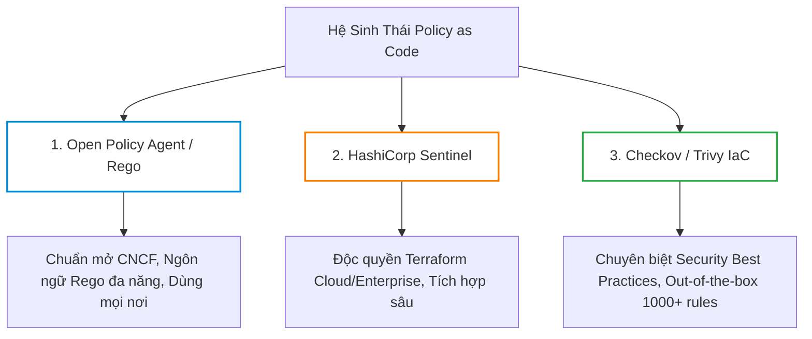
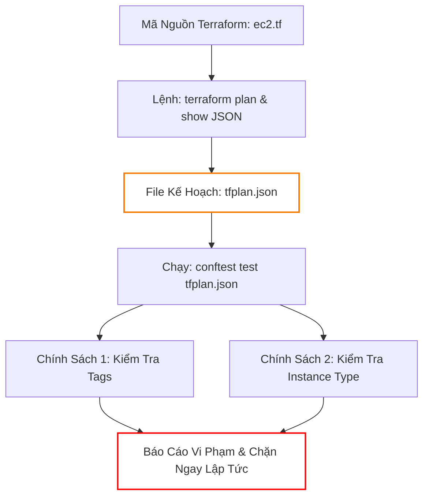
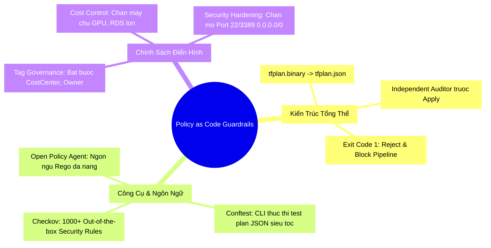


# Quản Trị Chính Sách Policy as Code: OPA/Rego, Conftest và Checkov

Khi quy mô hạ tầng doanh nghiệp phát triển lên hàng nghìn tài nguyên đám mây với hàng trăm kỹ sư tham gia đóng góp mã nguồn, việc chỉ dựa vào quy trình đánh giá thủ công (Manual Code Review qua Pull Request) là một "cơn ác mộng" quản trị. Con người luôn có thể mệt mỏi, bỏ sót các lỗ hổng bảo mật nghiêm trọng hoặc vô tình phê duyệt một cấu hình sai sót làm tiêu tốn ngân sách hàng trăm triệu đồng mỗi tháng.

Làm thế nào để hệ thống CI/CD tự động từ chối một Pull Request nếu kỹ sư khai báo máy chủ vượt quá ngân sách cho phép (ví dụ: `instance_type = "p4de.24xlarge"` đắt đỏ)? Làm thế nào để ép buộc 100% cơ sở dữ liệu phải bật mã hóa ổ đĩa (Encryption at Rest) và có thẻ Tag định danh trung tâm chi phí (`CostCenter`)?

Câu trả lời nằm ở mô hình **Policy as Code (PaC)**. Bằng cách biến các quy chuẩn bảo mật và quản trị tài chính thành mã nguồn có thể thực thi tự động, bạn thiết lập nên những **Rào chắn Bảo vệ Bất khả Xâm phạm (Automated Guardrails)** đứng chặn ngay trước bước `terraform apply`.

Bài viết này sẽ mổ xẻ toàn diện kiến trúc Policy as Code, hướng dẫn lập trình chính sách với **Open Policy Agent (OPA) / ngôn ngữ Rego**, thực thi kiểm thử trên `tfplan.json` bằng **Conftest**, và so sánh OPA với **HashiCorp Sentinel** cùng **Checkov**.

---

## 1. Kiến Trúc & Vị Trí Của Policy as Code Trong Pipeline

Policy as Code không thay thế Terraform, mà đóng vai trò như một **Cơ Quan Thẩm Phán Độc Lập (Independent Auditor)** đánh giá kế hoạch thay đổi hạ tầng trước khi nó được hiện thực hóa trên Cloud.



---

## 2. Ma Trận So Sánh: OPA/Rego vs HashiCorp Sentinel vs Checkov

Hiện nay trong thế giới IaC có 3 trường phái Policy as Code phổ biến nhất:



| Tiêu Chí So Sánh | Open Policy Agent (OPA) / Conftest | HashiCorp Sentinel | Checkov (Bridgecrew / Prisma) |
| :--- | :--- | :--- | :--- |
| **Bản quyền** | Mã nguồn mở (CNCF Graduated Project) | Độc quyền (Chỉ có trên HCP / Terraform Cloud Enterprise) | Mã nguồn mở (Apache 2.0) |
| **Ngôn ngữ định nghĩa** | **Rego** (Declarative Query Language) | **Sentinel Language** (Cú pháp dạng Procedural) | **Python** hoặc **YAML Policies** |
| **Phạm vi áp dụng** | **Toàn diện**: Terraform, Kubernetes, Envoy, Linux PAM, API | Chỉ chuyên sâu cho các sản phẩm của HashiCorp (Terraform, Vault, Nomad) | Chuyên sâu cho quét cấu hình bảo mật Cloud & Kubernetes |
| **Độ linh hoạt tùy biến** | Cực kỳ cao, viết được mọi logic nghiệp vụ phức tạp | Rất cao, hỗ trợ truy cập trực tiếp đối tượng HCL | Trung bình (Tập trung vào Security Rules có sẵn) |
| **Cơ chế hoạt động** | Phân tích tệp `tfplan.json` đã được render | Nhúng trực tiếp vào Engine của Terraform Cloud | Quét trực tiếp file `.tf` hoặc `tfplan.json` |

---

## 3. Lập Trình Chính Sách Với Open Policy Agent (OPA) & Ngôn Ngữ Rego

Ngôn ngữ **Rego** được thiết kế riêng cho việc truy vấn và đánh giá các cấu trúc dữ liệu phân cấp phức tạp (như JSON). Khi bạn chuyển đổi file plan của Terraform sang định dạng JSON (`terraform show -json tfplan.binary > tfplan.json`), toàn bộ cấu trúc hạ tầng sẽ nằm trong trường `resource_changes`.

### 3.1. Phân Tích Cấu Trúc `tfplan.json`
```json
{
  "resource_changes": [
    {
      "address": "aws_instance.web",
      "type": "aws_instance",
      "change": {
        "actions": ["create"],
        "after": {
          "instance_type": "t3.micro",
          "tags": {
            "Environment": "production",
            "CostCenter": "CC-9081"
          }
        }
      }
    }
  ]
}
```

### 3.2. Viết Chính Sách Rego 1: Bắt Buộc Gắn Thẻ Tag Bắt Buộc (Tag Governance)

Tạo file `policy/tags.rego`:
```rego
package terraform.governance

import future.keywords.in

# Danh sách các tags bắt buộc phải có
required_tags := ["Environment", "Owner", "CostCenter"]

# Luật: Tìm các tài nguyên AWS đang được tạo mới hoặc sửa đổi mà thiếu tags
deny[msg] {
    # Lấy từng tài nguyên trong mảng resource_changes
    some resource in input.resource_changes
    
    # Chỉ kiểm tra các tài nguyên thuộc AWS
    startswith(resource.type, "aws_")
    
    # Chỉ kiểm tra hành động create hoặc update
    resource.change.actions[_] in ["create", "update"]
    
    # Kiểm tra từng tag bắt buộc
    some tag in required_tags
    not resource.change.after.tags[tag]
    
    # Tạo thông báo lỗi vi phạm
    msg := sprintf("VI PHẠM QUY CHUẨN TAGS: Tài nguyên '%v' (kiểu '%v') thiếu thẻ tag bắt buộc '%v'!", [
        resource.address,
        resource.type,
        tag
    ])
}
```

### 3.3. Viết Chính Sách Rego 2: Chặn Các Máy Chủ Đắt Đỏ (Cost Guardrail)

Tạo file `policy/costs.rego`:
```rego
package terraform.costs

import future.keywords.in

# Danh sách các Instance Types được phép dùng (Allowlist)
allowed_instance_types := [
    "t3.nano", "t3.micro", "t3.small", "t3.medium",
    "m6i.large", "m6i.xlarge", "c6i.large", "c6i.xlarge"
]

deny[msg] {
    some resource in input.resource_changes
    resource.type == "aws_instance"
    resource.change.actions[_] in ["create", "update"]
    
    # Lấy instance_type được khai báo
    actual_type := resource.change.after.instance_type
    
    # Nếu không nằm trong danh sách cho phép
    not actual_type in allowed_instance_types
    
    msg := sprintf("VI PHẠM QUY ĐỊNH CHI PHÍ: EC2 '%v' sử dụng loại máy chủ '%v' không được phê duyệt! Chỉ chấp nhận: %v", [
        resource.address,
        actual_type,
        allowed_instance_types
    ])
}
```

### 3.4. Viết Chính Sách Rego 3: Chặn Mở Port Nhạy Cảm 22/3389 Ra Toàn Internet

Tạo file `policy/security.rego`:
```rego
package terraform.security

import future.keywords.in

dangerous_ports := [22, 3389, 1433, 3306, 5432]

deny[msg] {
    some resource in input.resource_changes
    resource.type == "aws_security_group"
    resource.change.actions[_] in ["create", "update"]
    
    some rule in resource.change.after.ingress
    rule.cidr_blocks[_] == "0.0.0.0/0"
    
    # Kiểm tra xem port có nằm trong dải port nguy hiểm không
    some port in dangerous_ports
    rule.from_port <= port
    rule.to_port >= port
    
    msg := sprintf("LỖ HỔNG BẢO MẬT NGHIÊM TRỌNG: Security Group '%v' đang mở Port nhạy cảm %v ra toàn Internet (0.0.0.0/0)!", [
        resource.address,
        port
    ])
}
```

---

## 4. Conftest: Tiện Ích Thực Thi Chính Sách OPA Cực Nhanh

**Conftest** là một công cụ dòng lệnh (CLI utility) được xây dựng trên Open Policy Agent, chuyên biệt hóa cho việc kiểm tra các tệp cấu hình có cấu trúc (JSON, YAML, HCL, Dockerfile).

```mermaid
graph LR
    A["tfplan.json"] --> B["Conftest CLI Engine"]
    C["Thư mục chính sách: policy/*.rego"] --> B
    B -->|Đánh giá Rule deny[...] | D{Có thông báo vi phạm?}
    D -->|Có| E["Exit Code 1: In danh sách vi phạm & Dừng Pipeline"]
    D -->|Không| F["Exit Code 0: In 'All policies passed successfully'"]

    style B fill:none,stroke:#0288d1,stroke-width:2px
    style E fill:none,stroke:#ff0000,stroke-width:2px
    style F fill:none,stroke:#28a745,stroke-width:2px


```

### 4.1. Lệnh Thực Thi Conftest Trong CI/CD
```bash
# Chạy kiểm tra toàn bộ các file rego trong thư mục policy/ đối chiếu với tfplan.json
conftest test tfplan.json --policy ./policy/ --namespace terraform
```

---

## 5. Checkov: Đánh Giá Tuân Thủ Tự Động Hơn 1000+ Quy Chuẩn Có Sẵn

Nếu OPA/Rego là công cụ để bạn tự viết các chính sách đặc thù của doanh nghiệp, thì **Checkov** là giải pháp "Out-of-the-box" cung cấp sẵn hàng nghìn chính sách bảo mật tuân thủ theo tiêu chuẩn **CIS AWS Benchmark, SOC2, HIPAA, ISO 27001**.

```bash
# Quét trực tiếp kế hoạch thay đổi tfplan.json
checkov -f tfplan.json --framework terraform_plan --compact --quiet
```

---

## 6. Hands-On Lab: Xây Dựng Hệ Thống Guardrails Ngăn Chặn Vi Phạm Chi Phí & Bảo Mật

Trong bài lab này, chúng ta sẽ viết mã nguồn Terraform tạo hạ tầng AWS, xuất file kế hoạch ra JSON và sử dụng Conftest để kiểm tra 2 chính sách: **Bắt buộc gắn thẻ CostCenter** và **Chặn EC2 loại lớn `p3.2xlarge`**.



### Bước 1: Khởi tạo cấu trúc thư mục
```bash
mkdir -p terraform-lab22-pac/policy
cd terraform-lab22-pac
```

### Bước 2: Tạo file `policy/guardrails.rego`
Tạo file `policy/guardrails.rego`:
```rego
package main

import future.keywords.in

# 1. CHÍNH SÁCH TAGS: Bắt buộc phải có tag CostCenter
deny[msg] {
    some resource in input.resource_changes
    startswith(resource.type, "aws_")
    resource.change.actions[_] in ["create", "update"]
    
    not resource.change.after.tags.CostCenter
    
    msg := sprintf("[TAG-01] Tài nguyên '%v' thiếu thẻ bắt buộc 'CostCenter'!", [resource.address])
}

# 2. CHÍNH SÁCH CHI PHÍ: Cấm tuyệt đối máy chủ GPU đắt đỏ p3/p4
deny[msg] {
    some resource in input.resource_changes
    resource.type == "aws_instance"
    resource.change.actions[_] in ["create", "update"]
    
    instance_type := resource.change.after.instance_type
    startswith(instance_type, "p3.")
    
    msg := sprintf("[COST-01] Vi phạm ngân sách nghiêm trọng: EC2 '%v' sử dụng máy chủ GPU '%v'!", [
        resource.address,
        instance_type
    ])
}
```

### Bước 3: Tạo file `main.tf` chứa cấu hình cố tình vi phạm cả 2 chính sách
Tạo file `main.tf`:
```hcl
terraform {
  required_version = ">= 1.5.0"
  required_providers {
    aws = {
      source  = "hashicorp/aws"
      version = "~> 5.0"
    }
  }
}

provider "aws" {
  region                      = "ap-southeast-1"
  skip_credentials_validation = true
  skip_requesting_account_id  = true
}

# Máy chủ cố tình dùng loại GPU đắt đỏ và thiếu thẻ CostCenter
resource "aws_instance" "rogue_ai_server" {
  ami           = "ami-0c55b159cbfafe1f0"
  instance_type = "p3.2xlarge" # VI PHẠM CHÍNH SÁCH CHI PHÍ!

  tags = {
    Name        = "Rogue-Training-Node"
    Environment = "Development"
    # THIẾU THẺ CostCenter -> VI PHẠM CHÍNH SÁCH TAGS!
  }
}
```

### Bước 4: Khởi tạo và Xuất file Kế Hoạch sang JSON
```bash
terraform init
terraform plan -out=tfplan.binary
terraform show -json tfplan.binary > tfplan.json
```

### Bước 5: Thử nghiệm thẩm định chính sách bằng Conftest
Cài đặt conftest (nếu chưa có) hoặc chạy qua Docker:
```bash
# Cách chạy trực tiếp nếu có binary conftest:
conftest test tfplan.json --policy ./policy/

# Hoặc dùng Docker:
# docker run --rm -v $(pwd):/work -w /work openpolicyagent/conftest test tfplan.json --policy ./policy/
```

**Kết quả kiểm tra (Terminal Output):**
```text
FAIL - tfplan.json - main - [TAG-01] Tài nguyên 'aws_instance.rogue_ai_server' thiếu thẻ bắt buộc 'CostCenter'!
FAIL - tfplan.json - main - [COST-01] Vi phạm ngân sách nghiêm trọng: EC2 'aws_instance.rogue_ai_server' sử dụng máy chủ GPU 'p3.2xlarge'!

2 tests, 0 passed, 0 warnings, 2 failures, 0 exceptions
```
> [!NOTE]
> Hệ thống Guardrails đã phát hiện cả 2 lỗi vi phạm ngay lập tức và chặn đứng kế hoạch triển khai mà không làm thay đổi bất kỳ tài nguyên nào trên AWS!

### Bước 6: Sửa mã nguồn hợp lệ và kiểm tra lại
Sửa `main.tf`:
```hcl
resource "aws_instance" "rogue_ai_server" {
  ami           = "ami-0c55b159cbfafe1f0"
  instance_type = "t3.medium" # Đổi sang loại hợp lệ

  tags = {
    Name        = "Clean-Node"
    Environment = "Development"
    CostCenter  = "CC-FINANCE-889" # Bổ sung thẻ hợp lệ
  }
}
```

Tạo lại file JSON và test lại:
```bash
terraform plan -out=tfplan.binary
terraform show -json tfplan.binary > tfplan.json
conftest test tfplan.json --policy ./policy/
```

**Kết quả:**
```text
1 test, 1 passed, 0 warnings, 0 failures, 0 exceptions
```

### Bước 7: Dọn dẹp môi trường lab
```bash
cd ..
rm -rf terraform-lab22-pac
```

---

## 7. 10 Câu Hỏi Trắc Nghiệm & Phỏng Vấn Chuyên Sâu (Self-Check Q&A)

<details class="qa-card">
<summary class="qa-summary">
  <div class="qa-summary-left">
    <span class="qa-num-badge">Q01</span>
    <span>Tại sao việc kiểm tra chính sách trên `tfplan.json` lại ưu việt hơn việc quét trực tiếp mã nguồn file `.tf` tĩnh?</span>
  </div>
  <span class="qa-chevron">
    <svg width="18" height="18" fill="none" stroke="currentColor" stroke-width="2.5" viewBox="0 0 24 24"><polyline points="6 9 12 15 18 9"></polyline></svg>
  </span>
</summary>
<div class="qa-answer">
  <div class="qa-answer-header">
    <svg width="14" height="14" fill="none" stroke="currentColor" stroke-width="2" viewBox="0 0 24 24"><path d="M22 11.08V12a10 10 0 1 1-5.93-9.14"></path><polyline points="22 4 12 14.01 9 11.01"></polyline></svg>
    <span>Phân Tích &amp; Lời Giải Kỹ Thuật</span>
  </div>
  : File `.tf` tĩnh chỉ chứa các biểu thức khai báo chưa qua tính toán (chứa các biến `var.*`, các hàm `locals`, `dynamic blocks`, và module inputs). Chỉ khi Terraform biên dịch xong và xuất ra `tfplan.json`, tất cả các giá trị động, thuộc tính kế thừa và danh sách hành động thực tế (`create`, `update`, `delete`, `replace`) mới được xác định rõ ràng 100%, giúp chính sách đánh giá chính xác mà không bị bỏ sót.
</div>
</details>

<details class="qa-card">
<summary class="qa-summary">
  <div class="qa-summary-left">
    <span class="qa-num-badge">Q02</span>
    <span>Trong ngôn ngữ Rego, từ khóa `deny[msg]` có ý nghĩa gì?</span>
  </div>
  <span class="qa-chevron">
    <svg width="18" height="18" fill="none" stroke="currentColor" stroke-width="2.5" viewBox="0 0 24 24"><polyline points="6 9 12 15 18 9"></polyline></svg>
  </span>
</summary>
<div class="qa-answer">
  <div class="qa-answer-header">
    <svg width="14" height="14" fill="none" stroke="currentColor" stroke-width="2" viewBox="0 0 24 24"><path d="M22 11.08V12a10 10 0 1 1-5.93-9.14"></path><polyline points="22 4 12 14.01 9 11.01"></polyline></svg>
    <span>Phân Tích &amp; Lời Giải Kỹ Thuật</span>
  </div>
  : `deny` là một tập hợp (Set) các thông báo lỗi. Khi tất cả các biểu thức điều kiện bên trong thân khối `{ ... }` đều thỏa mãn là `true` (tức là phát hiện vi phạm), chuỗi `msg` sẽ được thêm vào tập hợp `deny`. Nếu tập hợp `deny` có ít nhất một phần tử, bài test sẽ bị coi là **FAIL**.
</div>
</details>

<details class="qa-card">
<summary class="qa-summary">
  <div class="qa-summary-left">
    <span class="qa-num-badge">Q03</span>
    <span>Sự khác biệt giữa mức độ thực thi chính sách `Advisory (Cảnh báo)` và `Mandatory / Hard-Mandatory (Bắt buộc)` là gì?</span>
  </div>
  <span class="qa-chevron">
    <svg width="18" height="18" fill="none" stroke="currentColor" stroke-width="2.5" viewBox="0 0 24 24"><polyline points="6 9 12 15 18 9"></polyline></svg>
  </span>
</summary>
<div class="qa-answer">
  <div class="qa-answer-header">
    <svg width="14" height="14" fill="none" stroke="currentColor" stroke-width="2" viewBox="0 0 24 24"><path d="M22 11.08V12a10 10 0 1 1-5.93-9.14"></path><polyline points="22 4 12 14.01 9 11.01"></polyline></svg>
    <span>Phân Tích &amp; Lời Giải Kỹ Thuật</span>
  </div>
  : 
  - **Advisory / Soft-Mandatory**: Khi phát hiện vi phạm, hệ thống chỉ in cảnh báo ra terminal nhưng vẫn cho phép pipeline tiếp tục, hoặc cho phép người có thẩm quyền (Tech Lead) bấm nút Override bỏ qua.
  - **Hard-Mandatory**: Chặn đứng Pipeline ngay lập tức với exit code khác 0, tuyệt đối không cho phép chạy `terraform apply` cho đến khi mã nguồn được sửa đúng quy chuẩn.
</div>
</details>

<details class="qa-card">
<summary class="qa-summary">
  <div class="qa-summary-left">
    <span class="qa-num-badge">Q04</span>
    <span>Làm thế nào để lọc ra những tài nguyên bị XÓA (`destroy`) trong file `tfplan.json` bằng ngôn ngữ Rego?</span>
  </div>
  <span class="qa-chevron">
    <svg width="18" height="18" fill="none" stroke="currentColor" stroke-width="2.5" viewBox="0 0 24 24"><polyline points="6 9 12 15 18 9"></polyline></svg>
  </span>
</summary>
<div class="qa-answer">
  <div class="qa-answer-header">
    <svg width="14" height="14" fill="none" stroke="currentColor" stroke-width="2" viewBox="0 0 24 24"><path d="M22 11.08V12a10 10 0 1 1-5.93-9.14"></path><polyline points="22 4 12 14.01 9 11.01"></polyline></svg>
    <span>Phân Tích &amp; Lời Giải Kỹ Thuật</span>
  </div>
  : Kiểm tra trường `resource.change.actions`:
```rego
deny[msg] {
    some resource in input.resource_changes
    resource.change.actions[_] == "delete"
    # Viết logic chặn việc xóa tài nguyên Production quan trọng
    msg := sprintf("HÀNH ĐỘNG BỊ CẤM: Không được phép xóa tài nguyên '%v'!", [resource.address])
}
```
</div>
</details>

<details class="qa-card">
<summary class="qa-summary">
  <div class="qa-summary-left">
    <span class="qa-num-badge">Q05</span>
    <span>HashiCorp Sentinel có những ưu thế gì nổi bật khi doanh nghiệp đã mua bản quyền Terraform Cloud (HCP Terraform)?</span>
  </div>
  <span class="qa-chevron">
    <svg width="18" height="18" fill="none" stroke="currentColor" stroke-width="2.5" viewBox="0 0 24 24"><polyline points="6 9 12 15 18 9"></polyline></svg>
  </span>
</summary>
<div class="qa-answer">
  <div class="qa-answer-header">
    <svg width="14" height="14" fill="none" stroke="currentColor" stroke-width="2" viewBox="0 0 24 24"><path d="M22 11.08V12a10 10 0 1 1-5.93-9.14"></path><polyline points="22 4 12 14.01 9 11.01"></polyline></svg>
    <span>Phân Tích &amp; Lời Giải Kỹ Thuật</span>
  </div>
  : Sentinel được tích hợp trực tiếp vào Terraform Cloud Core Engine, có khả năng chặn lệnh trước khi apply tự động mà không cần bước xuất file JSON thủ công, hỗ trợ 3 cấp độ bảo vệ (`advisory`, `soft-mandatory`, `hard-mandatory`), và quản lý chính sách tập trung qua giao diện Web UI và VCS Integration.
</div>
</details>

<details class="qa-card">
<summary class="qa-summary">
  <div class="qa-summary-left">
    <span class="qa-num-badge">Q06</span>
    <span>Tại sao nên sử dụng Conftest thay vì cài đặt binary OPA thuần túy trong Pipeline CI/CD?</span>
  </div>
  <span class="qa-chevron">
    <svg width="18" height="18" fill="none" stroke="currentColor" stroke-width="2.5" viewBox="0 0 24 24"><polyline points="6 9 12 15 18 9"></polyline></svg>
  </span>
</summary>
<div class="qa-answer">
  <div class="qa-answer-header">
    <svg width="14" height="14" fill="none" stroke="currentColor" stroke-width="2" viewBox="0 0 24 24"><path d="M22 11.08V12a10 10 0 1 1-5.93-9.14"></path><polyline points="22 4 12 14.01 9 11.01"></polyline></svg>
    <span>Phân Tích &amp; Lời Giải Kỹ Thuật</span>
  </div>
  : Conftest được đóng gói sẵn các bộ parser cho hàng chục định dạng tệp (JSON, YAML, HCL, INI), tự động tìm kiếm các tệp chính sách `.rego` trong thư mục mà không cần viết lệnh nạp dữ liệu phức tạp qua OPA REST API, và hỗ trợ xuất báo cáo theo nhiều định dạng chuẩn như JUnit XML, TAP, JSON để tích hợp trực tiếp vào Dashboard của CI/CD.
</div>
</details>

<details class="qa-card">
<summary class="qa-summary">
  <div class="qa-summary-left">
    <span class="qa-num-badge">Q07</span>
    <span>Trong tệp `tfplan.json`, thuộc tính `resource.change.after_unknown` đại diện cho điều gì?</span>
  </div>
  <span class="qa-chevron">
    <svg width="18" height="18" fill="none" stroke="currentColor" stroke-width="2.5" viewBox="0 0 24 24"><polyline points="6 9 12 15 18 9"></polyline></svg>
  </span>
</summary>
<div class="qa-answer">
  <div class="qa-answer-header">
    <svg width="14" height="14" fill="none" stroke="currentColor" stroke-width="2" viewBox="0 0 24 24"><path d="M22 11.08V12a10 10 0 1 1-5.93-9.14"></path><polyline points="22 4 12 14.01 9 11.01"></polyline></svg>
    <span>Phân Tích &amp; Lời Giải Kỹ Thuật</span>
  </div>
  : Đại diện cho những thuộc tính mà giá trị của chúng **chỉ được biết sau khi Cloud API hoàn tất việc tạo tài nguyên** (Computed Attributes, ví dụ: `id`, `arn`, `private_ip` được cấp phát động). Khi viết chính sách Rego, cần chú ý rằng những thuộc tính này sẽ không nằm trong `after` mà nằm trong `after_unknown`.
</div>
</details>

<details class="qa-card">
<summary class="qa-summary">
  <div class="qa-summary-left">
    <span class="qa-num-badge">Q08</span>
    <span>Làm thế nào để viết một chính sách Rego cho phép ngoại lệ (Exemption / Whitelist) cho một số tài nguyên cụ thể?</span>
  </div>
  <span class="qa-chevron">
    <svg width="18" height="18" fill="none" stroke="currentColor" stroke-width="2.5" viewBox="0 0 24 24"><polyline points="6 9 12 15 18 9"></polyline></svg>
  </span>
</summary>
<div class="qa-answer">
  <div class="qa-answer-header">
    <svg width="14" height="14" fill="none" stroke="currentColor" stroke-width="2" viewBox="0 0 24 24"><path d="M22 11.08V12a10 10 0 1 1-5.93-9.14"></path><polyline points="22 4 12 14.01 9 11.01"></polyline></svg>
    <span>Phân Tích &amp; Lời Giải Kỹ Thuật</span>
  </div>
  : Định nghĩa một tập danh sách ngoại lệ và dùng toán tử `not` để loại trừ:
```rego
exempt_resources := ["aws_security_group.bastion_ssh_public"]

deny[msg] {
    some resource in input.resource_changes
    # Bỏ qua nếu nằm trong danh sách ngoại lệ
    not resource.address in exempt_resources
    # Các điều kiện kiểm tra bảo mật khác...
}
```
</div>
</details>

<details class="qa-card">
<summary class="qa-summary">
  <div class="qa-summary-left">
    <span class="qa-num-badge">Q09</span>
    <span>Checkov hỗ trợ những framework IaC nào ngoài Terraform?</span>
  </div>
  <span class="qa-chevron">
    <svg width="18" height="18" fill="none" stroke="currentColor" stroke-width="2.5" viewBox="0 0 24 24"><polyline points="6 9 12 15 18 9"></polyline></svg>
  </span>
</summary>
<div class="qa-answer">
  <div class="qa-answer-header">
    <svg width="14" height="14" fill="none" stroke="currentColor" stroke-width="2" viewBox="0 0 24 24"><path d="M22 11.08V12a10 10 0 1 1-5.93-9.14"></path><polyline points="22 4 12 14.01 9 11.01"></polyline></svg>
    <span>Phân Tích &amp; Lời Giải Kỹ Thuật</span>
  </div>
  : Checkov hỗ trợ đa nền tảng toàn diện: **Terraform**, **CloudFormation**, **Azure Resource Manager (ARM / Bicep)**, **Kubernetes Manifests & Helm Charts**, **Serverless Framework**, và **Dockerfiles**.
</div>
</details>

<details class="qa-card">
<summary class="qa-summary">
  <div class="qa-summary-left">
    <span class="qa-num-badge">Q10</span>
    <span>Khi nào nên chuyển một luật từ Variable Validation trong HCL sang Policy as Code (OPA/Rego)?</span>
  </div>
  <span class="qa-chevron">
    <svg width="18" height="18" fill="none" stroke="currentColor" stroke-width="2.5" viewBox="0 0 24 24"><polyline points="6 9 12 15 18 9"></polyline></svg>
  </span>
</summary>
<div class="qa-answer">
  <div class="qa-answer-header">
    <svg width="14" height="14" fill="none" stroke="currentColor" stroke-width="2" viewBox="0 0 24 24"><path d="M22 11.08V12a10 10 0 1 1-5.93-9.14"></path><polyline points="22 4 12 14.01 9 11.01"></polyline></svg>
    <span>Phân Tích &amp; Lời Giải Kỹ Thuật</span>
  </div>
  : 
  - Dùng **Variable Validation**: Cho các ràng buộc kỹ thuật đơn giản của một module cụ thể (regex tên, dải số port).
  - Dùng **Policy as Code**: Cho các chính sách **quản trị toàn doanh nghiệp (Enterprise Governance)** mang tính bắt buộc xuyên suốt hàng trăm modules và repositories khác nhau (chính sách chi phí toàn công ty, tiêu chuẩn an ninh thông tin SOC2/ISO, quản trị thẻ tags kế toán).
</div>
</details>

---

## 8. Tổng Kết & Cheat Sheet Thực Chiến



- **Nguyên tắc bảo vệ Enterprise**: "Trust, but Verify" — Không một đoạn mã Terraform nào được phép chạy `terraform apply` trên Production nếu chưa vượt qua cổng kiểm thử tự động của **Conftest / OPA Policy Engine**.
- **Quy tắc viết Rego**: Luôn viết thông điệp `msg` trong `deny` thật rõ ràng, chứa mã định danh lỗi (ví dụ: `[TAG-01]`, `[COST-02]`) để lập trình viên biết chính xác vị trí và cách khắc phục.
- **Bước tiếp theo**: Trong [Bài 23: DRY Terraform Với Terragrunt: Remote State, Inputs và Dependencies](./23-dry-terraform-voi-terragrunt-remote-state-inputs-va-dependencies.md), chúng ta sẽ làm chủ công cụ Terragrunt để xóa bỏ 100% mã nguồn lặp lại (Don't Repeat Yourself) khi quản trị hàng trăm môi trường đa tài khoản!

