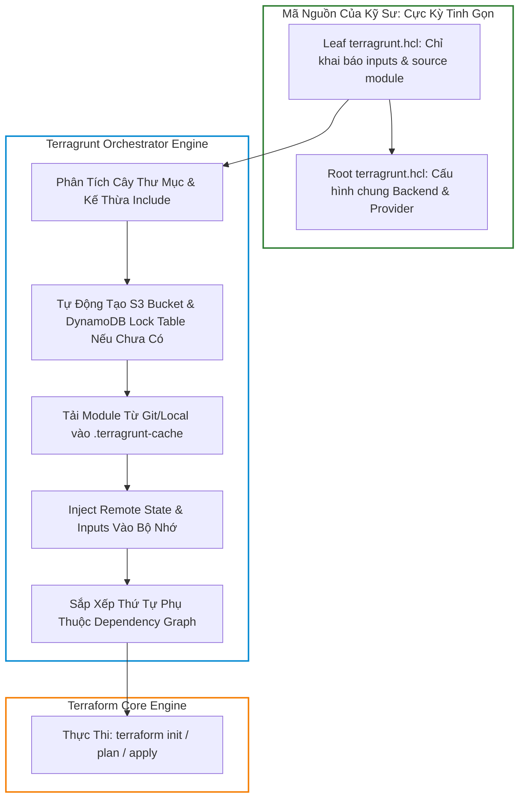
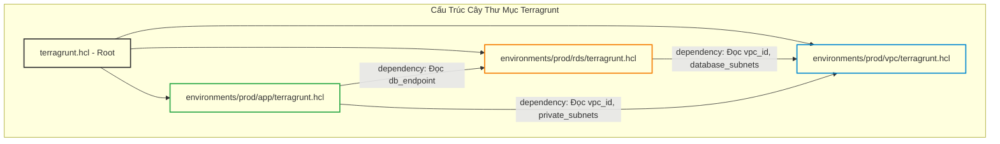
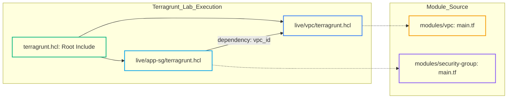
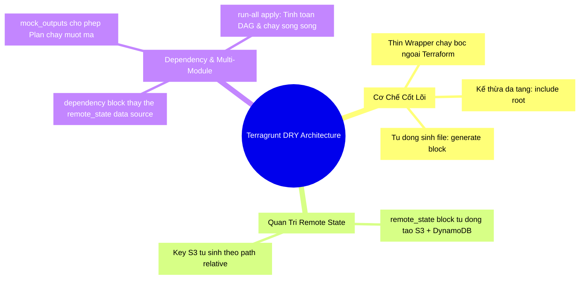


# DRY Terraform Với Terragrunt: Remote State, Inputs và Dependencies

Khi quản trị một vài máy chủ đơn lẻ, mã nguồn Terraform thuần túy (Vanilla Terraform) hoạt động vô cùng mượt mà. Tuy nhiên, khi doanh nghiệp của bạn mở rộng lên **hàng chục tài khoản AWS/GCP/Azure**, trải dài trên **nhiều vùng địa lý (Multi-Region)** và phân chia thành **nhiều môi trường độc lập (Dev, Staging, UAT, Production)**, bạn sẽ nhanh chóng đối mặt với "cơn ác mộng" lặp code (Copy-Paste Nightmare):
- Hàng trăm file `backend.tf` giống hệt nhau, chỉ khác mỗi đường dẫn S3 Key.
- Hàng trăm file `providers.tf` lặp đi lặp lại cùng một cấu hình Region và AssumeRole.
- Khó khăn trong việc truyền dữ liệu đầu ra (Outputs) từ tầng Mạng (VPC) sang tầng Cụm máy chủ (EKS) và Cơ sở dữ liệu (RDS) mà không làm phình to State file thành một khối Monolith nguy hiểm.

Để giải quyết triệt để vấn đề này, Gruntwork đã phát triển **Terragrunt** — một công cụ mỏng (Thin Wrapper) chạy bọc ngoài Terraform, mang lại khả năng tái sử dụng cấu hình đỉnh cao theo triết lý **DRY (Don't Repeat Yourself)**.

Bài viết này sẽ đi sâu vào kiến trúc Terragrunt, giải mã cơ chế sinh Backend tự động (`generate` & `remote_state`), quản trị luồng phụ thuộc đa module với **`dependency` blocks & Mock Outputs**, và hướng dẫn thiết lập kiến trúc thư mục chuẩn Enterprise.

---

## 1. Kiến Trúc Hoạt Động Của Terragrunt (Under The Hood)

Terragrunt không thay thế Terraform, cũng không sử dụng một ngôn ngữ lập trình mới. Terragrunt đọc tệp cấu hình **`terragrunt.hcl`**, tự động tải các Terraform Modules tương ứng từ Git hoặc thư mục cục bộ, sinh ra các file `.tf` tạm thời (như Backend, Provider, Variables) ngay trong bộ nhớ RAM hoặc thư mục `.terragrunt-cache/`, rồi sau đó gọi lệnh `terraform` tương ứng.



---

## 2. Ma Trận So Sánh: Vanilla Terraform vs Terragrunt

| Tính Năng Kiến Trúc | Vanilla Terraform (Thuần Túy) | Terragrunt (Mô Hình DRY) |
| :--- | :--- | :--- |
| **Quản trị Remote State Backend** | Phải cấu hình tĩnh `backend "s3"` trong từng thư mục; không hỗ trợ biến số `var.*` trong backend block | **Tự động sinh 100%** qua `remote_state` kế thừa từ file root; tự động tạo S3 Bucket & DynamoDB Table |
| **Chia sẻ Provider Config** | Phải copy-paste khối `provider "aws"` ở mọi thư mục | **Định nghĩa 1 lần duy nhất** ở file Root qua khối `generate` |
| **Liên kết giữa các tầng hạ tầng** | Phải dùng `terraform_remote_state` (Dễ lộ toàn bộ state, chậm) hoặc gom chung 1 file to | Dùng khối **`dependency`**: Chỉ đọc đúng Outputs cần thiết, tự động khóa thứ tự thực thi |
| **Thực thi đa môi trường** | Phải chạy thủ công từng thư mục hoặc viết bash script phức tạp | Hỗ trợ lệnh **`terragrunt run-all apply`**: Tự động tính toán đồ thị phụ thuộc và chạy song song |
| **Xử lý Mock Outputs trong Plan** | Rất khó khăn khi module cha chưa từng được Apply | Hỗ trợ **`mock_outputs`**: Cho phép chạy `plan` mượt mà ngay cả khi module phụ thuộc chưa tồn tại |

---

## 3. Khai Thác Sức Mạnh DRY Với `include`, `generate` & `remote_state`

### 3.1. Cấu Hình Root: `terragrunt.hcl` (Đặt ở thư mục gốc)

File root này chịu trách nhiệm tự động sinh Backend S3 và Provider cho toàn bộ hàng trăm module con bên dưới:

```hcl
# /terragrunt.hcl (Root Level)

locals {
  # Tự động parse thông tin từ đường dẫn thư mục: /accounts/<account>/<region>/<env>/<service>
  path_relative_to_include = path_relative_to_include()
  account_vars             = read_terragrunt_config(find_in_parent_folders("account.hcl", "empty.hcl"), { locals = {} })
  region_vars              = read_terragrunt_config(find_in_parent_folders("region.hcl", "empty.hcl"), { locals = {} })
  env_vars                 = read_terragrunt_config(find_in_parent_folders("env.hcl", "empty.hcl"), { locals = {} })

  aws_region = local.region_vars.locals.aws_region
  aws_role   = local.account_vars.locals.iam_role_arn
}

# 1. TỰ ĐỘNG CẤU HÌNH VÀ TẠO REMOTE STATE BACKEND
remote_state {
  backend = "s3"
  generate = {
    path      = "backend.tf"
    if_exists = "overwrite_terragrunt"
  }
  config = {
    bucket         = "corp-terraform-state-${local.account_vars.locals.account_name}"
    key            = "${path_relative_to_include()}/terraform.tfstate"
    region         = "ap-southeast-1"
    encrypt        = true
    dynamodb_table = "corp-terraform-locks"
  }
}

# 2. TỰ ĐỘNG SINH CẤU HÌNH PROVIDER CHO TỪNG REGION/ACCOUNT
generate "provider" {
  path      = "provider.tf"
  if_exists = "overwrite_terragrunt"
  contents  = <<-EOF
    provider "aws" {
      region = "${local.aws_region}"
      assume_role {
        role_arn = "${local.aws_role}"
      }
      default_tags {
        tags = {
          ManagedBy   = "Terragrunt"
          Environment = "${local.env_vars.locals.environment}"
        }
      }
    }
  EOF
}
```

---

## 4. Quản Lý Phụ Thuộc Giữa Các Tầng Với `dependency` & `mock_outputs`

Trong kiến trúc chuẩn, chúng ta chia nhỏ hạ tầng thành 3 tầng độc lập:
1. **Tầng 1 (VPC)**: Tạo mạng nền tảng.
2. **Tầng 2 (RDS / Security Groups)**: Phụ thuộc vào `vpc_id` và `subnet_ids` của Tầng 1.
3. **Tầng 3 (EKS / App Workload)**: Phụ thuộc vào VPC và RDS Endpoint.



### 4.1. File Cấu Hình Tầng Database: `environments/prod/rds/terragrunt.hcl`

```hcl
# Kế thừa toàn bộ cấu hình Backend và Provider từ file Root
include "root" {
  path = find_in_parent_folders()
}

# Chỉ định Module nguồn (tái sử dụng từ Git hoặc thư mục modules)
terraform {
  source = "git::git@github.com:my-org/terraform-aws-rds.git?ref=v2.4.0"
}

# KHAI BÁO PHỤ THUỘC VÀO TẦNG VPC
dependency "vpc" {
  config_path = "../vpc"

  # Mock outputs cho phép chạy 'terragrunt plan' mượt mà khi VPC chưa được apply
  mock_outputs = {
    vpc_id          = "vpc-mock-0123456789"
    database_subnet_ids = ["subnet-mock-1", "subnet-mock-2"]
  }
  mock_outputs_allowed_terraform_commands = ["validate", "plan"]
}

# TRUYỀN THAM SỐ VÀO MODULE MỘT CÁCH TRONG SÁNG
inputs = {
  db_name              = "production_core_db"
  instance_class       = "db.r6g.xlarge"
  vpc_id               = dependency.vpc.outputs.vpc_id
  subnet_ids           = dependency.vpc.outputs.database_subnet_ids
  allocated_storage_gb = 200
}
```

---

## 5. Tổ Chức Cây Thư Mục Chuẩn Enterprise Multi-Account

Một cấu trúc thư mục Terragrunt đẳng cấp doanh nghiệp phản ánh trực tiếp cấu trúc phân cấp của tổ chức Cloud:

```text
infrastructure-live/
├── terragrunt.hcl                     # Root config: Backend & Base Providers
├── accounts/
│   ├── dev-account/
│   │   ├── account.hcl                # Account ID & IAM Role cho Dev
│   │   └── ap-southeast-1/
│   │       ├── region.hcl             # Region: ap-southeast-1
│   │       └── dev/
│   │           ├── env.hcl            # Environment: dev
│   │           ├── vpc/
│   │           │   └── terragrunt.hcl # Leaf config
│   │           ├── rds/
│   │           │   └── terragrunt.hcl # Leaf config
│   │           └── eks/
│   │               └── terragrunt.hcl # Leaf config
│   └── prod-account/
│       ├── account.hcl                # Account ID & IAM Role cho Prod
│       └── ap-southeast-1/
│           ├── region.hcl
│           └── prod/
│               ├── env.hcl
│               ├── vpc/
│               │   └── terragrunt.hcl
│               ├── rds/
│               │   └── terragrunt.hcl
│               └── eks/
│                   └── terragrunt.hcl
```

---

## 6. Hands-On Lab: Xây Dựng Hạ Tầng Đa Tầng DRY Với Terragrunt

Trong bài lab này, chúng ta sẽ xây dựng 2 tầng hạ tầng liên kết nhau: **Module VPC** (Tầng 1) và **Module App Security Group** (Tầng 2) sử dụng Terragrunt với đầy đủ cơ chế kế thừa, dependency và mock outputs.



### Bước 1: Khởi tạo cấu trúc thư mục
```bash
mkdir -p terraform-lab23-terragrunt/{modules/vpc,modules/security-group,live/vpc,live/app-sg}
cd terraform-lab23-terragrunt
```

### Bước 2: Tạo Terraform Module Tầng 1 (`modules/vpc/main.tf`)
```hcl
variable "cidr_block" {
  type = string
}

variable "environment" {
  type = string
}

resource "terraform_data" "mock_vpc" {
  input = {
    vpc_id = "vpc-${md5(var.cidr_block)}"
    cidr   = var.cidr_block
    env    = var.environment
  }
}

output "vpc_id" {
  value = terraform_data.mock_vpc.input.vpc_id
}
```

### Bước 3: Tạo Terraform Module Tầng 2 (`modules/security-group/main.tf`)
```hcl
variable "vpc_id" {
  type = string
}

variable "sg_name" {
  type = string
}

resource "terraform_data" "mock_sg" {
  input = {
    sg_id   = "sg-${md5(var.sg_name)}"
    vpc_ref = var.vpc_id
  }
}

output "security_group_id" {
  value = terraform_data.mock_sg.input.sg_id
}

output "attached_vpc_id" {
  value = terraform_data.mock_sg.input.vpc_ref
}
```

### Bước 4: Tạo file Root `terragrunt.hcl`
Tạo file `live/terragrunt.hcl`:
```hcl
# File Root chứa cấu hình dùng chung
locals {
  common_tags = {
    ManagedBy = "Terragrunt"
    Lab       = "Lab-23-DRY"
  }
}

# Tự động sinh file versions.tf cho mọi module
generate "versions" {
  path      = "versions_generated.tf"
  if_exists = "overwrite_terragrunt"
  contents  = <<-EOF
    terraform {
      required_version = ">= 1.5.0"
    }
  EOF
}
```

### Bước 5: Tạo file `live/vpc/terragrunt.hcl`
```hcl
include "root" {
  path = find_in_parent_folders()
}

terraform {
  source = "../../modules/vpc"
}

inputs = {
  cidr_block  = "10.100.0.0/16"
  environment = "production"
}
```

### Bước 6: Tạo file `live/app-sg/terragrunt.hcl` với Dependency
```hcl
include "root" {
  path = find_in_parent_folders()
}

terraform {
  source = "../../modules/security-group"
}

dependency "vpc" {
  config_path = "../vpc"

  mock_outputs = {
    vpc_id = "vpc-mock-pending-apply"
  }
  mock_outputs_allowed_terraform_commands = ["validate", "plan"]
}

inputs = {
  sg_name = "production-web-sg"
  vpc_id  = dependency.vpc.outputs.vpc_id
}
```

### Bước 7: Thực thi toàn bộ hệ sinh thái với `run-all apply`
Di chuyển vào thư mục `live/` và chạy lệnh điều phối toàn diện:
```bash
cd live
terragrunt run-all apply --terragrunt-non-interactive
```

**Quan sát kết quả:** Terragrunt tự động nhận diện `live/vpc` là dependency của `live/app-sg`, tự động apply VPC trước, bóc tách `vpc_id` thực tế và truyền vào cấu hình của `live/app-sg` một cách hoàn toàn tự động!

### Bước 8: Dọn dẹp môi trường lab
```bash
terragrunt run-all destroy --terragrunt-non-interactive
cd ../..
rm -rf terraform-lab23-terragrunt
```

---

## 7. 10 Câu Hỏi Trắc Nghiệm & Phỏng Vấn Chuyên Sâu (Self-Check Q&A)

<details class="qa-card">
<summary class="qa-summary">
  <div class="qa-summary-left">
    <span class="qa-num-badge">Q01</span>
    <span>Terragrunt hoạt động như thế nào khi bạn chạy lệnh `terragrunt apply`?</span>
  </div>
  <span class="qa-chevron">
    <svg width="18" height="18" fill="none" stroke="currentColor" stroke-width="2.5" viewBox="0 0 24 24"><polyline points="6 9 12 15 18 9"></polyline></svg>
  </span>
</summary>
<div class="qa-answer">
  <div class="qa-answer-header">
    <svg width="14" height="14" fill="none" stroke="currentColor" stroke-width="2" viewBox="0 0 24 24"><path d="M22 11.08V12a10 10 0 1 1-5.93-9.14"></path><polyline points="22 4 12 14.01 9 11.01"></polyline></svg>
    <span>Phân Tích &amp; Lời Giải Kỹ Thuật</span>
  </div>
  : Terragrunt đọc tệp `terragrunt.hcl`, tìm kiếm file root thông qua `find_in_parent_folders()`, nạp các giá trị biến `inputs`, giải quyết các `dependency`, tải module nguồn (source) vào thư mục tạm `.terragrunt-cache/`, tự động sinh các file `.tf` đã được chỉ định trong khối `generate`, rồi chuyển tiếp lệnh sang binary `terraform` nguyên bản.
</div>
</details>

<details class="qa-card">
<summary class="qa-summary">
  <div class="qa-summary-left">
    <span class="qa-num-badge">Q02</span>
    <span>Tại sao việc sử dụng khối `dependency` trong Terragrunt lại an toàn và tối ưu hơn việc dùng Data Source `terraform_remote_state` trong HCL?</span>
  </div>
  <span class="qa-chevron">
    <svg width="18" height="18" fill="none" stroke="currentColor" stroke-width="2.5" viewBox="0 0 24 24"><polyline points="6 9 12 15 18 9"></polyline></svg>
  </span>
</summary>
<div class="qa-answer">
  <div class="qa-answer-header">
    <svg width="14" height="14" fill="none" stroke="currentColor" stroke-width="2" viewBox="0 0 24 24"><path d="M22 11.08V12a10 10 0 1 1-5.93-9.14"></path><polyline points="22 4 12 14.01 9 11.01"></polyline></svg>
    <span>Phân Tích &amp; Lời Giải Kỹ Thuật</span>
  </div>
  : 
  - `terraform_remote_state` đòi hỏi module con phải có quyền đọc toàn bộ State file của module cha (nguy cơ lộ secrets lưu trong State cha).
  - Khối `dependency` của Terragrunt chỉ trích xuất đúng các giá trị nằm trong khối `output` của module cha, hỗ trợ `mock_outputs` khi chạy plan, và tự động xây dựng đồ thị DAG để chạy lệnh `run-all` đúng thứ tự.
</div>
</details>

<details class="qa-card">
<summary class="qa-summary">
  <div class="qa-summary-left">
    <span class="qa-num-badge">Q03</span>
    <span>Khối `mock_outputs` trong `dependency` có vai trò quan trọng gì trong quy trình CI/CD?</span>
  </div>
  <span class="qa-chevron">
    <svg width="18" height="18" fill="none" stroke="currentColor" stroke-width="2.5" viewBox="0 0 24 24"><polyline points="6 9 12 15 18 9"></polyline></svg>
  </span>
</summary>
<div class="qa-answer">
  <div class="qa-answer-header">
    <svg width="14" height="14" fill="none" stroke="currentColor" stroke-width="2" viewBox="0 0 24 24"><path d="M22 11.08V12a10 10 0 1 1-5.93-9.14"></path><polyline points="22 4 12 14.01 9 11.01"></polyline></svg>
    <span>Phân Tích &amp; Lời Giải Kỹ Thuật</span>
  </div>
  : Khi bạn khởi tạo một môi trường mới toanh (Greenfield Deployment) hoặc chạy Pull Request Plan, module cha (VPC) chưa từng được apply và chưa có State file. Không có `mock_outputs`, lệnh `plan` ở module con (EKS/RDS) sẽ bị lỗi sập vì không tìm thấy outputs. `mock_outputs` cung cấp các giá trị giả lập tạm thời để lệnh `terragrunt plan` có thể vượt qua bước kiểm tra schema thành công.
</div>
</details>

<details class="qa-card">
<summary class="qa-summary">
  <div class="qa-summary-left">
    <span class="qa-num-badge">Q04</span>
    <span>Lệnh `terragrunt run-all apply` khác gì so với việc viết một vòng lặp Bash Script chạy `terraform apply`?</span>
  </div>
  <span class="qa-chevron">
    <svg width="18" height="18" fill="none" stroke="currentColor" stroke-width="2.5" viewBox="0 0 24 24"><polyline points="6 9 12 15 18 9"></polyline></svg>
  </span>
</summary>
<div class="qa-answer">
  <div class="qa-answer-header">
    <svg width="14" height="14" fill="none" stroke="currentColor" stroke-width="2" viewBox="0 0 24 24"><path d="M22 11.08V12a10 10 0 1 1-5.93-9.14"></path><polyline points="22 4 12 14.01 9 11.01"></polyline></svg>
    <span>Phân Tích &amp; Lời Giải Kỹ Thuật</span>
  </div>
  : Vòng lặp Bash chạy tuần tự theo thứ tự thư mục tĩnh và không hiểu được mối quan hệ logic giữa các tầng. `terragrunt run-all` phân tích tất cả các khối `dependency` để dựng nên một cây đồ thị phụ thuộc (DAG), tự động chạy **song song (concurrency)** các module độc lập để tiết kiệm thời gian, và dừng lại ngay lập tức nếu một module cha gặp sự cố.
</div>
</details>

<details class="qa-card">
<summary class="qa-summary">
  <div class="qa-summary-left">
    <span class="qa-num-badge">Q05</span>
    <span>Khối `generate` trong Terragrunt có tác dụng gì?</span>
  </div>
  <span class="qa-chevron">
    <svg width="18" height="18" fill="none" stroke="currentColor" stroke-width="2.5" viewBox="0 0 24 24"><polyline points="6 9 12 15 18 9"></polyline></svg>
  </span>
</summary>
<div class="qa-answer">
  <div class="qa-answer-header">
    <svg width="14" height="14" fill="none" stroke="currentColor" stroke-width="2" viewBox="0 0 24 24"><path d="M22 11.08V12a10 10 0 1 1-5.93-9.14"></path><polyline points="22 4 12 14.01 9 11.01"></polyline></svg>
    <span>Phân Tích &amp; Lời Giải Kỹ Thuật</span>
  </div>
  : Cho phép Terragrunt tự động tạo ra các file `.tf` tùy biến (như `provider.tf`, `backend.tf`, `versions.tf`) ngay trước khi Terraform chạy, giúp bạn định nghĩa cấu hình Provider hoặc Version Constraints một lần duy nhất ở file root và tái sử dụng cho hàng trăm thư mục con.
</div>
</details>

<details class="qa-card">
<summary class="qa-summary">
  <div class="qa-summary-left">
    <span class="qa-num-badge">Q06</span>
    <span>Làm thế nào để truyền một biến môi trường bí mật (Secrets) vào Terragrunt mà không hardcode vào `terragrunt.hcl`?</span>
  </div>
  <span class="qa-chevron">
    <svg width="18" height="18" fill="none" stroke="currentColor" stroke-width="2.5" viewBox="0 0 24 24"><polyline points="6 9 12 15 18 9"></polyline></svg>
  </span>
</summary>
<div class="qa-answer">
  <div class="qa-answer-header">
    <svg width="14" height="14" fill="none" stroke="currentColor" stroke-width="2" viewBox="0 0 24 24"><path d="M22 11.08V12a10 10 0 1 1-5.93-9.14"></path><polyline points="22 4 12 14.01 9 11.01"></polyline></svg>
    <span>Phân Tích &amp; Lời Giải Kỹ Thuật</span>
  </div>
  : Sử dụng hàm `get_env("ENV_VAR_NAME", "default_val")` hoặc đọc trực tiếp từ AWS SSM / Vault thông qua các hàm helper tích hợp của HCL.
</div>
</details>

<details class="qa-card">
<summary class="qa-summary">
  <div class="qa-summary-left">
    <span class="qa-num-badge">Q07</span>
    <span>Thư mục `.terragrunt-cache/` chứa những gì và có nên commit vào Git không?</span>
  </div>
  <span class="qa-chevron">
    <svg width="18" height="18" fill="none" stroke="currentColor" stroke-width="2.5" viewBox="0 0 24 24"><polyline points="6 9 12 15 18 9"></polyline></svg>
  </span>
</summary>
<div class="qa-answer">
  <div class="qa-answer-header">
    <svg width="14" height="14" fill="none" stroke="currentColor" stroke-width="2" viewBox="0 0 24 24"><path d="M22 11.08V12a10 10 0 1 1-5.93-9.14"></path><polyline points="22 4 12 14.01 9 11.01"></polyline></svg>
    <span>Phân Tích &amp; Lời Giải Kỹ Thuật</span>
  </div>
  : Chứa bản sao mã nguồn của Terraform Module được tải về từ Git/Local, các plugin Provider đã tải, và các file `.tf` tạm thời được sinh bởi Terragrunt. Thư mục này **BẮT BUỘC PHẢI THÊM VÀO `.gitignore`** và tuyệt đối không commit vào Git.
</div>
</details>

<details class="qa-card">
<summary class="qa-summary">
  <div class="qa-summary-left">
    <span class="qa-num-badge">Q08</span>
    <span>Cờ `--terragrunt-parallelism` trong lệnh `run-all` có ý nghĩa gì?</span>
  </div>
  <span class="qa-chevron">
    <svg width="18" height="18" fill="none" stroke="currentColor" stroke-width="2.5" viewBox="0 0 24 24"><polyline points="6 9 12 15 18 9"></polyline></svg>
  </span>
</summary>
<div class="qa-answer">
  <div class="qa-answer-header">
    <svg width="14" height="14" fill="none" stroke="currentColor" stroke-width="2" viewBox="0 0 24 24"><path d="M22 11.08V12a10 10 0 1 1-5.93-9.14"></path><polyline points="22 4 12 14.01 9 11.01"></polyline></svg>
    <span>Phân Tích &amp; Lời Giải Kỹ Thuật</span>
  </div>
  : Giới hạn số lượng module được Terragrunt thực thi song song cùng một lúc (mặc định là không giới hạn hoặc dựa trên CPU). Việc giới hạn (ví dụ: `--terragrunt-parallelism 4`) giúp tránh tình trạng gửi quá nhiều request cùng lúc làm chạm ngưỡng Cloud API Rate Limit (Throttling).
</div>
</details>

<details class="qa-card">
<summary class="qa-summary">
  <div class="qa-summary-left">
    <span class="qa-num-badge">Q09</span>
    <span>Hàm `find_in_parent_folders()` trong Terragrunt hoạt động ra sao?</span>
  </div>
  <span class="qa-chevron">
    <svg width="18" height="18" fill="none" stroke="currentColor" stroke-width="2.5" viewBox="0 0 24 24"><polyline points="6 9 12 15 18 9"></polyline></svg>
  </span>
</summary>
<div class="qa-answer">
  <div class="qa-answer-header">
    <svg width="14" height="14" fill="none" stroke="currentColor" stroke-width="2" viewBox="0 0 24 24"><path d="M22 11.08V12a10 10 0 1 1-5.93-9.14"></path><polyline points="22 4 12 14.01 9 11.01"></polyline></svg>
    <span>Phân Tích &amp; Lời Giải Kỹ Thuật</span>
  </div>
  : Hàm này bắt đầu tìm kiếm từ thư mục hiện tại ngược lên các thư mục cha cho đến khi tìm thấy tệp tin có tên chỉ định (mặc định là `terragrunt.hcl`). Nếu tìm thấy, nó trả về đường dẫn tuyệt đối đến tệp đó, giúp module con dễ dàng kế thừa cấu hình từ Root.
</div>
</details>

<details class="qa-card">
<summary class="qa-summary">
  <div class="qa-summary-left">
    <span class="qa-num-badge">Q10</span>
    <span>Khi nào KHÔNG NÊN sử dụng Terragrunt?</span>
  </div>
  <span class="qa-chevron">
    <svg width="18" height="18" fill="none" stroke="currentColor" stroke-width="2.5" viewBox="0 0 24 24"><polyline points="6 9 12 15 18 9"></polyline></svg>
  </span>
</summary>
<div class="qa-answer">
  <div class="qa-answer-header">
    <svg width="14" height="14" fill="none" stroke="currentColor" stroke-width="2" viewBox="0 0 24 24"><path d="M22 11.08V12a10 10 0 1 1-5.93-9.14"></path><polyline points="22 4 12 14.01 9 11.01"></polyline></svg>
    <span>Phân Tích &amp; Lời Giải Kỹ Thuật</span>
  </div>
  : Khi dự án có quy mô rất nhỏ (chỉ có 1-2 môi trường đơn giản, dưới 20 tài nguyên), đội ngũ kỹ sư chưa quen với kiến trúc phân tầng, hoặc khi tổ chức đã đầu tư toàn diện vào giải pháp **Terraform Cloud / HCP Terraform Workspaces** (vốn đã có sẵn giao diện quản trị biến số và state phân tầng).
</div>
</details>

---

## 8. Tổng Kết & Cheat Sheet Thực Chiến



- **Quy tắc vàng của Terragrunt**: File `terragrunt.hcl` ở các thư mục lá (Leaf Directories) chỉ được phép chứa: `include`, `terraform.source`, `dependency`, và `inputs`. Tuyệt đối không viết logic phức tạp ở tầng lá.
- **Tiêu chuẩn vận hành**: Luôn khai báo `mock_outputs` cho mọi `dependency` để đảm bảo hệ thống CI/CD có thể chạy `terragrunt run-all plan` trơn tru trên mọi nhánh Pull Request.
- **Bước tiếp theo**: Trong [Bài 24: Tái Cấu Trúc Quy Mô Lớn: Khối moved và Import Declarative](./24-tai-cau-truc-quy-mo-lon-khoi-moved-va-import-declarative.md), chúng ta sẽ làm chủ khối `moved` (Terraform 1.1+) và khối `import` khai báo (Terraform 1.5+) để thực hiện các cuộc đại phẫu thuật tái cấu trúc hạ tầng mà không gây phá hủy tài nguyên!

