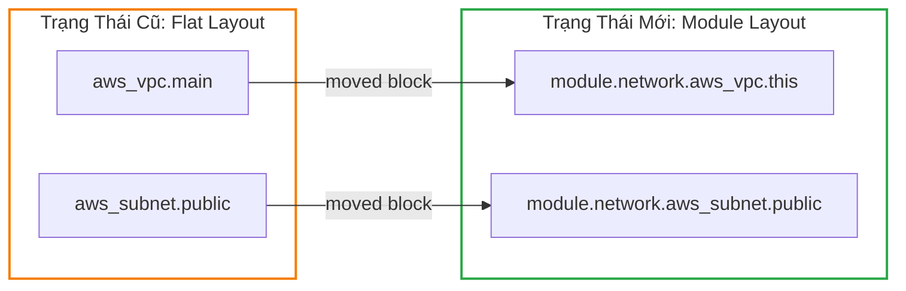
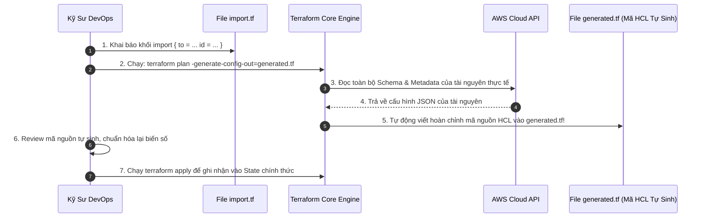
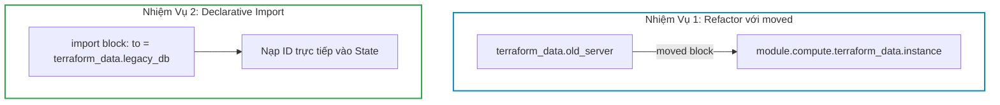
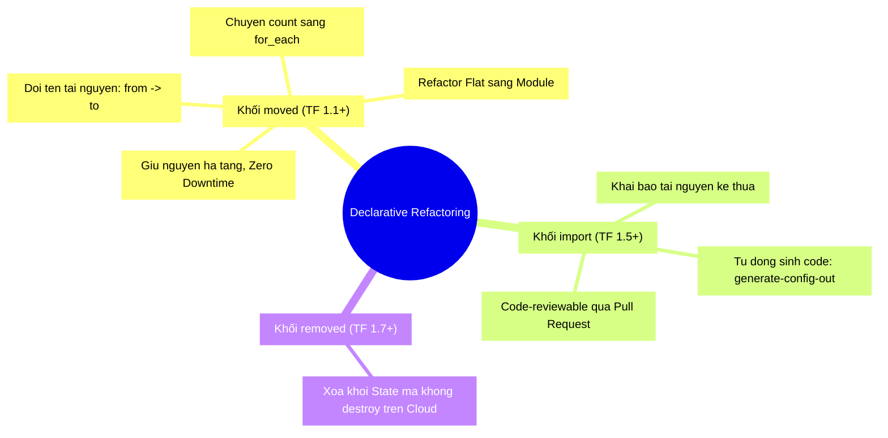


# Tái Cấu Trúc Quy Mô Lớn: Khối moved và Import Declarative

Trong vòng đời phát triển hạ tầng đám mây của doanh nghiệp, không có kiến trúc nào là bất biến. Một codebase Terraform ban đầu được viết theo kiểu phẳng (Flat monolithic layout) chỉ sau vài tháng sẽ phình to thành hàng nghìn dòng, đòi hỏi phải được **tái cấu trúc (Refactoring)**: chia nhỏ thành các Modules độc lập, đổi tên tài nguyên cho đúng chuẩn định danh mới, hoặc chuyển đổi từ vòng lặp danh sách số nguyên `count` sang cấu hình khóa định danh `for_each`.

Trước phiên bản Terraform 1.1, việc tái cấu trúc mã nguồn là một nỗi ám ảnh kinh hoàng đối với các kỹ sư DevOps. Nếu bạn đổi tên một tài nguyên từ `aws_instance.server` thành `aws_instance.web_server` hoặc chuyển nó vào trong một `module.compute`, Terraform sẽ hiểu rằng bạn vừa **xóa tài nguyên cũ và muốn tạo mới tài nguyên mới** -> dẫn đến việc **PHÁ HỦY TOÀN BỘ MÁY CHỦ VÀ DỮ LIỆU ĐANG CHẠY TRÊN PRODUCTION!**

Để khắc phục điều đó, các kỹ sư phải chạy hàng chục lệnh CLI mệnh lệnh thủ công `terraform state mv` đầy rủi ro.

Kể từ **Terraform 1.1+** với sự xuất hiện của **khối `moved`** và **Terraform 1.5+** với **khối `import` khai báo (Declarative Import)**, toàn bộ quá trình tái cấu trúc hạ tầng và nạp tài nguyên kế thừa (Legacy Infrastructure) đã trở thành chuẩn **Khai báo 100% (Declarative & Code-Reviewable)**.

Bài viết này sẽ hướng dẫn bạn làm chủ nghệ thuật "Đại phẫu thuật hạ tầng" mà không gây rớt bất kỳ một gói tin nào trên môi trường Production.

---

## 1. Cơ Chế Tái Cấu Trúc Khai Báo (Declarative Refactoring)

Mô hình cũ (Imperative) và Mô hình mới (Declarative) thể hiện sự khác biệt mang tính bước ngoặt về an toàn vận hành:

```mermaid
flowchart TD
    subgraph Imperative_Old ["Mô Hình Cũ: Lệnh CLI terraform state mv"]
        O1["Sửa Code .tf"] --> O2["Kỹ Sư Gõ Thủ Công Lệnh CLI: terraform state mv ..."]
        O2 -->|Nguy Cơ: Gõ Sai Tên Node Trong Terminal| O3["Hỏng State / Không Có Peer Review"]
        O3 --> O4["Chạy terraform apply Trong Lo Sợ"]
    end

    subgraph Declarative_Modern ["Mô Hình Hiện Đại: Khối moved & import Trong Code"]
        N1["Sửa Code Đổi Tên / Gom Module"] --> N2["Thêm Khối moved { from = ... to = ... }"]
        N2 --> N3["Tạo Pull Request: Toàn Đội Review Khối moved"]
        N3 --> N4["CI/CD Chạy terraform plan: Báo cáo 'Resource has moved' - 0 Destroy"]
        N4 --> N5["Merge Code & Apply An Toàn 100%"]
    end

    style Imperative_Old fill:none,stroke:#c62828,stroke-width:2px
    style Declarative_Modern fill:none,stroke:#2e7d32,stroke-width:2px


```



---

## 2. Làm Chủ Khối `moved` (Terraform 1.1+)

Khối `moved` là một khối meta-argument ở mức cao nhất (Top-level Block), đóng vai trò như một bảng chỉ dẫn (Redirection Map) thông báo cho Terraform Core Engine biết rằng: **Một node trong State đã được đổi tên hoặc chuyển vị trí trong cây thư mục module**.

### 2.1. Trường Hợp 1: Đổi Tên Tài Nguyên Nội Bộ (Rename Resource)

```hcl
# Code cũ: resource "aws_instance" "web"
# Code mới: Đổi tên thành "web_app"
resource "aws_instance" "web_app" {
  ami           = "ami-0c55b159cbfafe1f0"
  instance_type = "t3.medium"
}

# KHAI BÁO CHUYỂN DỊCH STATE AN TOÀN
moved {
  from = aws_instance.web
  to   = aws_instance.web_app
}
```

Khi chạy `terraform plan`, bạn sẽ nhận được thông báo màu xanh tuyệt đẹp:
```text
Terraform will perform the following actions:

  # aws_instance.web has moved to aws_instance.web_app
    resource "aws_instance" "web_app" {
        id               = "i-0123456789abcdef0"
        # (unchanged attributes hidden)
    }

Plan: 0 to add, 0 to change, 0 to destroy.
```

---

### 2.2. Trường Hợp 2: Chuyển Tài Nguyên Phẳng Vào Bên Trong Module (Refactor to Module)

Khi bạn muốn đóng gói các tài nguyên đơn lẻ (VPC, Subnets, Gateways) vào trong một reusable child module:



```hcl
# Gọi Module mới
module "network" {
  source   = "./modules/vpc"
  vpc_cidr = "10.0.0.0/16"
}

# CHUYỂN ĐỔI TOÀN BỘ VỊ TRÍ STATE VÀO MODULE
moved {
  from = aws_vpc.main
  to   = module.network.aws_vpc.this
}

moved {
  from = aws_subnet.public
  to   = module.network.aws_subnet.public
}
```

---

### 2.3. Trường Hợp 3: Chuyển Đổi Từ `count` Sang `for_each` Không Gây Recreate

Đây là một trong những bài toán phức tạp nhất khi refactoring. Khi chuyển từ mảng index số nguyên `[0]`, `[1]` sang Map key chuỗi, `moved` xử lý cực kỳ trực quan:

```hcl
# TRƯỚC ĐÂY (DÙNG COUNT):
# resource "aws_instance" "server" {
#   count = length(var.server_names) # ["web", "api"] -> server[0], server[1]
# }

# HIỆN TẠI (DÙNG FOR_EACH):
resource "aws_instance" "server" {
  for_each = toset(["web", "api"])
  ami      = "ami-0c55b159cbfafe1f0"
}

# ÁNH XẠ CHÍNH XÁC TỪ INDEX SỐ SANG KEY CHUỖI
moved {
  from = aws_instance.server[0]
  to   = aws_instance.server["web"]
}

moved {
  from = aws_instance.server[1]
  to   = aws_instance.server["api"]
}
```

---

## 3. Khai Phá Khối `import` Khai Báo (Terraform 1.5+)

Trước Terraform 1.5, việc nạp các tài nguyên đám mây đã tạo thủ công trên AWS Web Console vào quyền quản lý của Terraform đòi hỏi bạn phải:
1. Viết code HCL bằng tay.
2. Chạy lệnh CLI: `terraform import aws_s3_bucket.data my-bucket-name`.
3. Chạy `terraform plan` và liên tục sửa code cho đến khi không còn diff.

Kể từ **Terraform 1.5+**, khối `import` chính thức biến quy trình này thành khai báo và hỗ trợ **Tự động sinh mã nguồn (Code Generation)**!



### 3.1. Cú Pháp Khối `import` Chuẩn
```hcl
# File: imports.tf

import {
  to = aws_security_group.legacy_sg
  id = "sg-08a91b2c3d4e5f678" # ID thực tế trên AWS
}

import {
  to = aws_s3_bucket.finance_reports
  id = "corp-finance-archive-2026"
}
```

### 3.2. Lệnh Kích Hoạt Tự Động Sinh Code
```bash
terraform plan -generate-config-out=generated_resources.tf
```

Terraform sẽ tự động tạo file `generated_resources.tf` chứa đầy đủ tất cả các thuộc tính của Security Group và S3 Bucket tương ứng!

---

## 4. Hands-On Lab: Đại Phẫu Thuật Codebase & Declarative Import

Trong bài lab này, chúng ta sẽ thực hiện 2 nhiệm vụ:
1. Đổi tên và chuyển một tài nguyên từ Flat Layout vào Module bằng khối `moved`.
2. Nạp một tài nguyên giả lập kế thừa vào State bằng khối `import` khai báo.



### Bước 1: Khởi tạo thư mục thực hành
```bash
mkdir -p terraform-lab24-refactor/modules/compute
cd terraform-lab24-refactor
```

### Bước 2: Tạo trạng thái ban đầu (Flat Code)
Tạo file `main.tf`:
```hcl
terraform {
  required_version = ">= 1.5.0"
}

# Tài nguyên ban đầu đang chạy trên hệ thống
resource "terraform_data" "old_server" {
  input = {
    server_name = "production-app-node-01"
    role        = "backend-api"
  }
}
```

Khởi tạo và apply:
```bash
terraform init
terraform apply -auto-approve
```
Quan sát: `terraform_data.old_server` đã nằm an toàn trong State file.

### Bước 3: Xây dựng Module mới (`modules/compute/main.tf`)
Tạo file `modules/compute/main.tf`:
```hcl
variable "server_name" {
  type = string
}

variable "role" {
  type = string
}

resource "terraform_data" "instance" {
  input = {
    server_name = var.server_name
    role        = var.role
  }
}
```

### Bước 4: Tái cấu trúc file `main.tf` và thêm khối `moved`
Sửa file `main.tf`:
```hcl
terraform {
  required_version = ">= 1.5.0"
}

# 1. GỌI MODULE THAY THẾ CHO RESOURCE CŨ
module "compute" {
  source      = "./modules/compute"
  server_name = "production-app-node-01"
  role        = "backend-api"
}

# 2. KHAI BÁO KHỐI MOVED ĐỂ CHUYỂN DỊCH STATE
moved {
  from = terraform_data.old_server
  to   = module.compute.terraform_data.instance
}

# 3. NẠP MỘT TÀI NGUYÊN KẾ THỪA BẰNG IMPORT KHAI BÁO
import {
  to = terraform_data.legacy_database
  id = "db-enterprise-core-9988"
}

resource "terraform_data" "legacy_database" {
  input = {
    database_id = "db-enterprise-core-9988"
    engine      = "postgres"
  }
}
```

### Bước 5: Kiểm tra kế hoạch với `terraform plan`
```bash
terraform plan
```

**Kết quả terminal:**
```text
Terraform will perform the following actions:

  # terraform_data.old_server has moved to module.compute.terraform_data.instance
    resource "terraform_data" "instance" {
        id               = "4c3d82a1..."
        # (unchanged attributes hidden)
    }

  # terraform_data.legacy_database will be imported
    resource "terraform_data" "legacy_database" {
        id    = "db-enterprise-core-9988"
        input = {
            database_id = "db-enterprise-core-9988"
            engine      = "postgres"
        }
    }

Plan: 1 to import, 0 to add, 0 to change, 0 to destroy.
```
> [!IMPORTANT]
> Hãy nhìn kỹ dòng thông báo: **`Plan: 1 to import, 0 to add, 0 to change, 0 to destroy.`**
> Tài nguyên cũ không bị phá hủy, tài nguyên mới được chuyển đổi mượt mà và tài nguyên import được nạp trọn vẹn!

### Bước 6: Apply thay đổi
```bash
terraform apply -auto-approve
```

### Bước 7: Kiểm tra danh sách State sau khi Refactor
```bash
terraform state list
```
**Kết quả hiển thị:**
```text
module.compute.terraform_data.instance
terraform_data.legacy_database
```

### Bước 8: Dọn dẹp môi trường lab
```bash
terraform destroy -auto-approve
cd ..
rm -rf terraform-lab24-refactor
```

---

## 5. 10 Câu Hỏi Trắc Nghiệm & Phỏng Vấn Chuyên Sâu (Self-Check Q&A)

<details class="qa-card">
<summary class="qa-summary">
  <div class="qa-summary-left">
    <span class="qa-num-badge">Q01</span>
    <span>Sau khi đã chạy <code>terraform apply</code> thành công và các tài nguyên đã được chuyển đổi vị trí trong State, bạn có nên xóa các khối <code>moved</code> khỏi file <code>.tf</code> không?</span>
  </div>
  <span class="qa-chevron">
    <svg width="18" height="18" fill="none" stroke="currentColor" stroke-width="2.5" viewBox="0 0 24 24"><polyline points="6 9 12 15 18 9"></polyline></svg>
  </span>
</summary>
<div class="qa-answer">
  <div class="qa-answer-header">
    <svg width="14" height="14" fill="none" stroke="currentColor" stroke-width="2" viewBox="0 0 24 24"><path d="M22 11.08V12a10 10 0 1 1-5.93-9.14"></path><polyline points="22 4 12 14.01 9 11.01"></polyline></svg>
    <span>Phân Tích &amp; Lời Giải Kỹ Thuật</span>
  </div>
  <p style="margin: 0.4rem 0;"></p>
  <div style="margin: 0.35rem 0; padding-left: 1rem; border-left: 2px solid var(--accent-primary);">• <b style="color: var(--accent-primary);">Với Root Module nội bộ</b>: Bạn có thể xóa khối <code>moved</code> sau khi apply thành công trên tất cả các môi trường (Dev, Staging, Prod).</div>
  <div style="margin: 0.35rem 0; padding-left: 1rem; border-left: 2px solid var(--accent-primary);">• <b style="color: var(--accent-primary);">Với Shared Module phát hành ra công chúng / Private Registry</b>: <b style="color: var(--accent-primary);">BẮT BUỘC PHẢI GIỮ LẠI</b> khối <code>moved</code> qua ít nhất 1-2 phiên bản Major/Minor tiếp theo để đảm bảo những người dùng khác khi nâng cấp module không bị phá hủy tài nguyên của họ.</div>
</div>
</details>

<details class="qa-card">
<summary class="qa-summary">
  <div class="qa-summary-left">
    <span class="qa-num-badge">Q02</span>
    <span>Khối <code>moved</code> có thể di chuyển tài nguyên xuyên qua các State files khác nhau (Cross-State) không?</span>
  </div>
  <span class="qa-chevron">
    <svg width="18" height="18" fill="none" stroke="currentColor" stroke-width="2.5" viewBox="0 0 24 24"><polyline points="6 9 12 15 18 9"></polyline></svg>
  </span>
</summary>
<div class="qa-answer">
  <div class="qa-answer-header">
    <svg width="14" height="14" fill="none" stroke="currentColor" stroke-width="2" viewBox="0 0 24 24"><path d="M22 11.08V12a10 10 0 1 1-5.93-9.14"></path><polyline points="22 4 12 14.01 9 11.01"></polyline></svg>
    <span>Phân Tích &amp; Lời Giải Kỹ Thuật</span>
  </div>
  <p style="margin: 0.4rem 0;"><b style="color: var(--accent-primary);">KHÔNG</b>. Khối <code>moved</code> chỉ có hiệu lực bên trong phạm vi của một State file duy nhất (cùng Root Module). Nếu muốn chuyển tài nguyên sang một State file hoàn toàn khác (ví dụ: tách từ monolith state sang micro-state), bạn bắt buộc phải dùng lệnh <code>terraform state rm</code> ở state cũ và dùng khối <code>import</code> ở state mới.</p>
</div>
</details>

<details class="qa-card">
<summary class="qa-summary">
  <div class="qa-summary-left">
    <span class="qa-num-badge">Q03</span>
    <span>Tính năng <code>-generate-config-out</code> trong <code>terraform plan</code> (Terraform 1.5+) có những giới hạn nào cần lưu ý?</span>
  </div>
  <span class="qa-chevron">
    <svg width="18" height="18" fill="none" stroke="currentColor" stroke-width="2.5" viewBox="0 0 24 24"><polyline points="6 9 12 15 18 9"></polyline></svg>
  </span>
</summary>
<div class="qa-answer">
  <div class="qa-answer-header">
    <svg width="14" height="14" fill="none" stroke="currentColor" stroke-width="2" viewBox="0 0 24 24"><path d="M22 11.08V12a10 10 0 1 1-5.93-9.14"></path><polyline points="22 4 12 14.01 9 11.01"></polyline></svg>
    <span>Phân Tích &amp; Lời Giải Kỹ Thuật</span>
  </div>
  <p style="margin: 0.4rem 0;">Mã HCL tự sinh thường chứa tất cả các giá trị mặc định của Cloud Provider và có thể bị hardcode các chuỗi ID. Kỹ sư vẫn bắt buộc phải thực hiện bước kiểm tra (Review & Refactor) để biến đổi các giá trị hardcode đó thành biến số (<code>var.*</code>) và hàm liên kết trước khi commit vào Git.</p>
</div>
</details>

<details class="qa-card">
<summary class="qa-summary">
  <div class="qa-summary-left">
    <span class="qa-num-badge">Q04</span>
    <span>Điều gì xảy ra nếu bạn khai báo khối <code>import</code> cho một tài nguyên nhưng địa chỉ <code>to = ...</code> đó đã tồn tại sẵn trong State file?</span>
  </div>
  <span class="qa-chevron">
    <svg width="18" height="18" fill="none" stroke="currentColor" stroke-width="2.5" viewBox="0 0 24 24"><polyline points="6 9 12 15 18 9"></polyline></svg>
  </span>
</summary>
<div class="qa-answer">
  <div class="qa-answer-header">
    <svg width="14" height="14" fill="none" stroke="currentColor" stroke-width="2" viewBox="0 0 24 24"><path d="M22 11.08V12a10 10 0 1 1-5.93-9.14"></path><polyline points="22 4 12 14.01 9 11.01"></polyline></svg>
    <span>Phân Tích &amp; Lời Giải Kỹ Thuật</span>
  </div>
  <p style="margin: 0.4rem 0;">Terraform sẽ báo lỗi xung đột (Conflict Error) trong bước Plan: <code>Resource already managed by Terraform</code>. Khối <code>import</code> chỉ áp dụng cho các tài nguyên chưa có mặt trong State file hiện tại.</p>
</div>
</details>

<details class="qa-card">
<summary class="qa-summary">
  <div class="qa-summary-left">
    <span class="qa-num-badge">Q05</span>
    <span>Có thể lồng khối <code>moved</code> bên trong một Child Module không?</span>
  </div>
  <span class="qa-chevron">
    <svg width="18" height="18" fill="none" stroke="currentColor" stroke-width="2.5" viewBox="0 0 24 24"><polyline points="6 9 12 15 18 9"></polyline></svg>
  </span>
</summary>
<div class="qa-answer">
  <div class="qa-answer-header">
    <svg width="14" height="14" fill="none" stroke="currentColor" stroke-width="2" viewBox="0 0 24 24"><path d="M22 11.08V12a10 10 0 1 1-5.93-9.14"></path><polyline points="22 4 12 14.01 9 11.01"></polyline></svg>
    <span>Phân Tích &amp; Lời Giải Kỹ Thuật</span>
  </div>
  <p style="margin: 0.4rem 0;">Có thể. Một Child Module có thể tự định nghĩa khối <code>moved</code> nội bộ để tái cấu trúc cấu trúc file bên trong nó mà không làm ảnh hưởng đến cấu hình gọi module của Root Module.</p>
</div>
</details>

<details class="qa-card">
<summary class="qa-summary">
  <div class="qa-summary-left">
    <span class="qa-num-badge">Q06</span>
    <span>Làm thế nào để chuyển đổi một Module con <code>module.a</code> thành <code>module.b</code> bằng khối <code>moved</code>?</span>
  </div>
  <span class="qa-chevron">
    <svg width="18" height="18" fill="none" stroke="currentColor" stroke-width="2.5" viewBox="0 0 24 24"><polyline points="6 9 12 15 18 9"></polyline></svg>
  </span>
</summary>
<div class="qa-answer">
  <div class="qa-answer-header">
    <svg width="14" height="14" fill="none" stroke="currentColor" stroke-width="2" viewBox="0 0 24 24"><path d="M22 11.08V12a10 10 0 1 1-5.93-9.14"></path><polyline points="22 4 12 14.01 9 11.01"></polyline></svg>
    <span>Phân Tích &amp; Lời Giải Kỹ Thuật</span>
  </div>
  <p style="margin: 0.4rem 0;"></p>
  <pre style="background: rgba(0,0,0,0.35); padding: 0.75rem 1rem; border-radius: 6px; border: 1px solid var(--border-color); font-size: 0.85rem; overflow-x: auto; margin: 0.5rem 0;"><code class="language-hcl">moved {
  from = module.old_network_name
  to   = module.new_network_name
}</code></pre>
  <p style="margin: 0.4rem 0;">Terraform sẽ tự động chuyển toàn bộ tất cả các tài nguyên con bên trong <code>module.old_network_name</code> sang <code>module.new_network_name</code> chỉ với một khối <code>moved</code> duy nhất!</p>
</div>
</details>

<details class="qa-card">
<summary class="qa-summary">
  <div class="qa-summary-left">
    <span class="qa-num-badge">Q07</span>
    <span>Tại sao khối <code>moved</code> được coi là an toàn hơn nhiều so với việc chạy lệnh CLI <code>terraform state mv</code>?</span>
  </div>
  <span class="qa-chevron">
    <svg width="18" height="18" fill="none" stroke="currentColor" stroke-width="2.5" viewBox="0 0 24 24"><polyline points="6 9 12 15 18 9"></polyline></svg>
  </span>
</summary>
<div class="qa-answer">
  <div class="qa-answer-header">
    <svg width="14" height="14" fill="none" stroke="currentColor" stroke-width="2" viewBox="0 0 24 24"><path d="M22 11.08V12a10 10 0 1 1-5.93-9.14"></path><polyline points="22 4 12 14.01 9 11.01"></polyline></svg>
    <span>Phân Tích &amp; Lời Giải Kỹ Thuật</span>
  </div>
  <p style="margin: 0.4rem 0;">Vì khối <code>moved</code> được lưu dưới dạng mã nguồn (Code-defined), có thể lưu vết lịch sử trên Git, được kiểm tra qua Pull Request bởi các kỹ sư khác, và được mô phỏng chi tiết trong <code>terraform plan</code> trước khi thực sự thay đổi dữ liệu trong State.</p>
</div>
</details>

<details class="qa-card">
<summary class="qa-summary">
  <div class="qa-summary-left">
    <span class="qa-num-badge">Q08</span>
    <span>Khối <code>import</code> trong Terraform 1.5+ có hỗ trợ import danh sách nhiều tài nguyên thông qua vòng lặp <code>for_each</code> không?</span>
  </div>
  <span class="qa-chevron">
    <svg width="18" height="18" fill="none" stroke="currentColor" stroke-width="2.5" viewBox="0 0 24 24"><polyline points="6 9 12 15 18 9"></polyline></svg>
  </span>
</summary>
<div class="qa-answer">
  <div class="qa-answer-header">
    <svg width="14" height="14" fill="none" stroke="currentColor" stroke-width="2" viewBox="0 0 24 24"><path d="M22 11.08V12a10 10 0 1 1-5.93-9.14"></path><polyline points="22 4 12 14.01 9 11.01"></polyline></svg>
    <span>Phân Tích &amp; Lời Giải Kỹ Thuật</span>
  </div>
  <p style="margin: 0.4rem 0;">Có hỗ trợ. Khối <code>import</code> có thể kết hợp với <code>for_each</code> (kể từ Terraform 1.7+) để import hàng loạt tài nguyên có cấu trúc tương tự nhau:</p>
  <pre style="background: rgba(0,0,0,0.35); padding: 0.75rem 1rem; border-radius: 6px; border: 1px solid var(--border-color); font-size: 0.85rem; overflow-x: auto; margin: 0.5rem 0;"><code class="language-hcl">import {
  for_each = var.subnet_mapping
  to       = aws_subnet.imported[each.key]
  id       = each.value.id
}</code></pre>
</div>
</details>

<details class="qa-card">
<summary class="qa-summary">
  <div class="qa-summary-left">
    <span class="qa-num-badge">Q09</span>
    <span>Nếu trong quá trình tái cấu trúc, bạn muốn xóa một tài nguyên khỏi sự quản lý của Terraform nhưng KHÔNG MUỐN Cloud Provider xóa tài nguyên thực tế đó, bạn phải làm gì?</span>
  </div>
  <span class="qa-chevron">
    <svg width="18" height="18" fill="none" stroke="currentColor" stroke-width="2.5" viewBox="0 0 24 24"><polyline points="6 9 12 15 18 9"></polyline></svg>
  </span>
</summary>
<div class="qa-answer">
  <div class="qa-answer-header">
    <svg width="14" height="14" fill="none" stroke="currentColor" stroke-width="2" viewBox="0 0 24 24"><path d="M22 11.08V12a10 10 0 1 1-5.93-9.14"></path><polyline points="22 4 12 14.01 9 11.01"></polyline></svg>
    <span>Phân Tích &amp; Lời Giải Kỹ Thuật</span>
  </div>
  <p style="margin: 0.4rem 0;"></p>
  <div style="margin: 0.35rem 0; padding-left: 1rem; border-left: 2px solid var(--accent-primary);">• Cách 1: Chạy lệnh <code>terraform state rm &lt;resource_address&gt;</code>.</div>
  <div style="margin: 0.35rem 0; padding-left: 1rem; border-left: 2px solid var(--accent-primary);">• Cách 2: Kể từ Terraform 1.7+, sử dụng khối cấu hình <code>removed</code> khai báo:</div>
  <pre style="background: rgba(0,0,0,0.35); padding: 0.75rem 1rem; border-radius: 6px; border: 1px solid var(--border-color); font-size: 0.85rem; overflow-x: auto; margin: 0.5rem 0;"><code class="language-hcl">removed {
  from = aws_instance.legacy_server
  lifecycle {
    destroy = false # Chỉ xóa khỏi State, giữ nguyên máy chủ trên AWS!
  }
}</code></pre>
</div>
</details>

<details class="qa-card">
<summary class="qa-summary">
  <div class="qa-summary-left">
    <span class="qa-num-badge">Q10</span>
    <span>Khi nào thì việc tái cấu trúc hạ tầng bắt buộc phải chấp nhận Downtime?</span>
  </div>
  <span class="qa-chevron">
    <svg width="18" height="18" fill="none" stroke="currentColor" stroke-width="2.5" viewBox="0 0 24 24"><polyline points="6 9 12 15 18 9"></polyline></svg>
  </span>
</summary>
<div class="qa-answer">
  <div class="qa-answer-header">
    <svg width="14" height="14" fill="none" stroke="currentColor" stroke-width="2" viewBox="0 0 24 24"><path d="M22 11.08V12a10 10 0 1 1-5.93-9.14"></path><polyline points="22 4 12 14.01 9 11.01"></polyline></svg>
    <span>Phân Tích &amp; Lời Giải Kỹ Thuật</span>
  </div>
  <p style="margin: 0.4rem 0;">Khi thay đổi liên quan đến các thuộc tính bất biến của chính Cloud Provider mà nhà cung cấp không hỗ trợ sửa đổi trực tiếp (In-place update) lẫn <code>create_before_destroy</code> (ví dụ: đổi dải CIDR gốc của một AWS VPC đang chứa hàng trăm máy chủ đang chạy). Trong trường hợp này, bắt buộc phải dựng VPC mới song song và lập kế hoạch di trú dữ liệu (Data Migration Window).</p>
</div>
</details>

---

## 6. Tổng Kết & Cheat Sheet Thực Chiến



- **Tiêu chuẩn Refactoring**: Tuyệt đối không chạy lệnh `terraform state mv` thủ công trên môi trường Production. 100% việc đổi tên và chuyển module phải được định nghĩa bằng **khối `moved`**.
- **Tiêu chuẩn di trú hạ tầng cũ**: Khai thác sức mạnh của **khối `import`** kết hợp với cờ `-generate-config-out` để chuẩn hóa các tài nguyên legacy vào Terraform.
- **Bước tiếp theo**: Trong [Bài 25: Quản Trị Blast Radius và Tổ Chức Codebase Hạ Tầng Enterprise](./25-quan-tri-blast-radius-va-to-chuc-codebase-ha-tang-enterprise.md), chúng ta sẽ phân tích chiến lược phân rã Monolith State thành Micro-States để cô lập hoàn toàn phạm vi rủi ro khi có sự cố!

