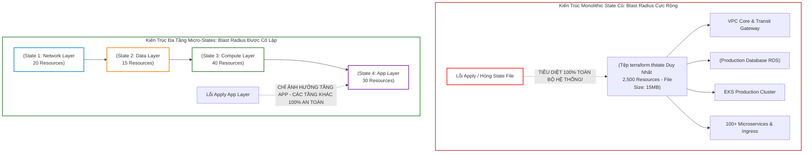
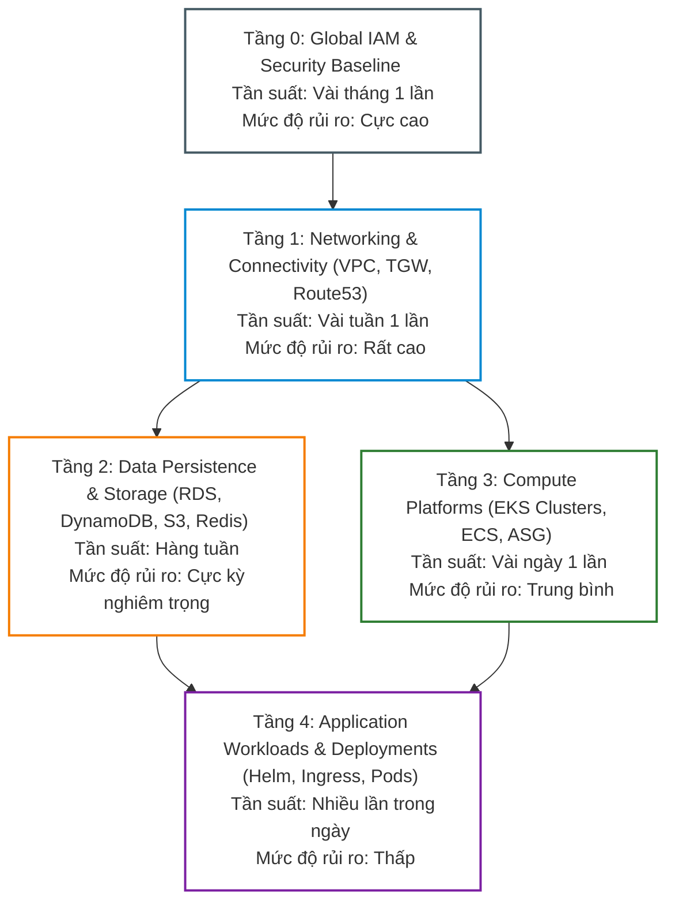
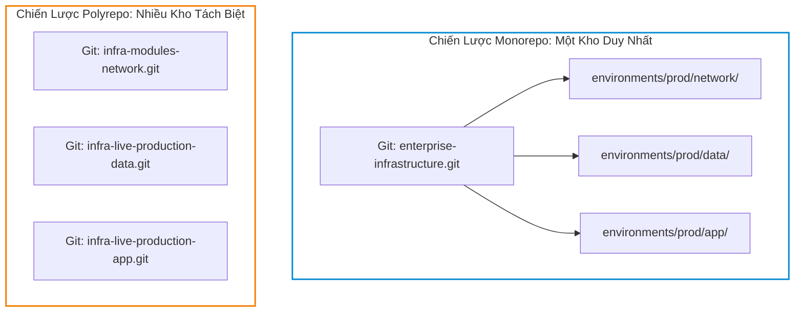
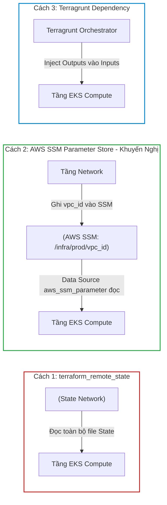
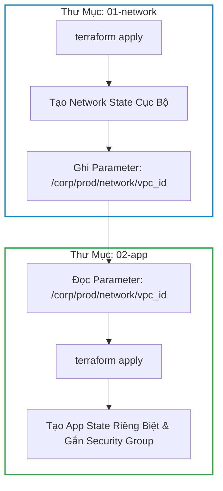
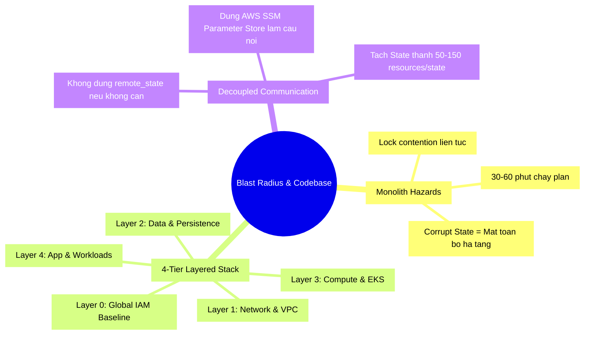


# Quản Trị Blast Radius và Tổ Chức Codebase Hạ Tầng Enterprise

Trong lĩnh vực an toàn kỹ thuật và quản trị rủi ro hệ thống, thuật ngữ **Blast Radius (Bán kính Thiệt hại / Vùng Ảnh Hưởng)** mô tả phạm vi tàn phá tối đa của một hệ thống khi một sự cố nghiêm trọng xảy ra. Đối với Terraform, Blast Radius được đo lường bằng câu hỏi cốt lõi của các Giám đốc Công nghệ (CTO / Head of Infrastructure): **"Nếu một lệnh `terraform apply` bị lỗi, hoặc một tệp State bị hỏng (Corrupted), có bao nhiêu phần trăm hệ thống của doanh nghiệp sẽ bị sập theo?"**

Một sai lầm sơ đẳng nhưng cực kỳ phổ biến tại nhiều doanh nghiệp là lưu trữ toàn bộ hạ tầng đám mây (từ VPC, Subnets, DNS, IAM, Kubernetes Cluster cho đến toàn bộ cơ sở dữ liệu Production RDS) vào **một tệp State duy nhất (Monolithic State File)**.

Hậu quả của mô hình Monolith này là:
1. **Rủi ro tuyệt đối**: Một sai sót nhỏ khi cập nhật cấu hình Web App có thể vô tình kích hoạt việc xóa sổ luôn Database và sập mạng toàn công ty.
2. **Hiệu năng tồi tệ**: Mỗi lần chạy `terraform plan`, hệ thống mất từ **30 đến 60 phút** chỉ để gửi hàng nghìn API calls đồng bộ hóa toàn bộ tài nguyên trên Cloud, làm tê liệt quy trình CI/CD.
3. **Kẹt khóa (Locking Contention)**: Hàng chục kỹ sư phải xếp hàng chờ đợi một người chạy xong thì người khác mới được phép deploy.

Bài viết này sẽ cung cấp bản thiết kế kiến trúc toàn diện để **phân rã Monolith State thành Micro-States**, thiết lập mô hình phân tầng **Layered Architecture** chuẩn Enterprise, so sánh chiến lược **Monorepo vs Multi-repo**, và giảm thời gian thực thi của Pipeline xuống dưới 2 phút.

---

## 1. Bản Đồ So Sánh: Monolithic State vs Phân Tầng Micro-States



### 1.1. Ma Trận So Sánh Kỹ Thuật Chi Tiết

| Tiêu Chí Đánh Giá | Monolithic State (Một File Duy Nhất) | Layered Micro-States (Phân Tầng Độc Lập) |
| :--- | :--- | :--- |
| **Blast Radius (Phạm vi rủi ro)** | **Rộng tối đa (100%)**: Lỗi một nơi làm sập toàn bộ | **Hẹp tối đa (5-10%)**: Sự cố được cô lập hoàn toàn |
| **Thời gian chạy `plan` / `apply`** | **30 - 60 phút** (Gửi hàng nghìn API calls refresh) | **30 - 90 giây** (Chỉ quét các tài nguyên của tầng đó) |
| **Tần suất thay đổi (Change Velocity)** | Kém linh hoạt (Tài nguyên tĩnh kìm hãm tài nguyên động) | Tối ưu: Tầng Network ít đổi, tầng App deploy liên tục |
| **Kiểm soát phân quyền (RBAC)** | Không thể phân quyền (Ai có quyền apply là sửa được DB) | Phân quyền chi tiết: Dev chỉ sửa tầng App, SRE sửa Network |
| **Rủi ro State Locking** | Cực cao: CI/CD thường xuyên bị kẹt do tranh chấp lock | Rất thấp: Các nhóm làm việc song song trên các tầng khác nhau |
| **Độ khó khi debug và cứu hộ** | Cực kỳ phức tạp, file JSON nặng hàng chục MB | Cực kỳ nhanh chóng, dễ dàng xác định chính xác tầng lỗi |

---

## 2. 4 Tầng Hạ Tầng Chuẩn Doanh Nghiệp (The 4-Tier Infrastructure Stack)

Để phân chia hạ tầng một cách khoa học, chúng ta phân loại tài nguyên dựa trên **Tần suất thay đổi (Change Frequency)** và **Mức độ rủi ro (Risk Level)**:



### 2.1. Phân Tích Chi Tiết Từng Tầng Hạ Tầng

1. **Tầng 0: Global Foundation & IAM Baseline**
   - **Tài nguyên**: AWS Organizations, SCP Policies, IAM Roles dùng chung cho CI/CD, GuardDuty, KMS Master Keys.
   - **Đặc điểm**: Cực kỳ ít thay đổi, chỉ có Cloud Security Architects có quyền truy cập.
2. **Tầng 1: Networking Layer (Mạng)**
   - **Tài nguyên**: VPC, Internet Gateway, NAT Gateway, Transit Gateway, Route Tables, VPN Direct Connect.
   - **Đặc điểm**: Là xương sống của toàn bộ hệ thống. Nếu tầng này bị sửa sai, toàn bộ ứng dụng sẽ mất kết nối.
3. **Tầng 2: Data & Storage Layer (Lưu Trữ Dữ Liệu)**
   - **Tài nguyên**: Amazon RDS Aurora, Elasticache Redis, DynamoDB Tables, S3 Data Lake Buckets.
   - **Đặc điểm**: Chứa toàn bộ tài sản dữ liệu của công ty. Bắt buộc phải có `prevent_destroy = true` và cô lập state tuyệt đối.
4. **Tầng 3: Compute Platform Layer (Nền Tảng Tính Toán)**
   - **Tài nguyên**: EKS Control Plane, EKS Managed Node Groups, ECS Clusters, Launch Templates.
   - **Đặc điểm**: Cung cấp năng lực tính toán cho ứng dụng.
5. **Tầng 4: Application Workload Layer (Ứng Dụng)**
   - **Tài nguyên**: Kubernetes Ingress Rules, IAM Role for Service Account (IRSA), CloudWatch Alarms cho từng Microservice.
   - **Đặc điểm**: Thay đổi liên tục theo từng commit của các nhóm phát triển phần mềm (Software Engineers).

---

## 3. Chiến Lược Tổ Chức Repository: Monorepo vs Polyrepo (Multi-Repo)

Một quyết định kiến trúc quan trọng là: Nên lưu trữ toàn bộ các tầng hạ tầng trong một Git Repository duy nhất (**Monorepo**) hay chia nhỏ ra nhiều Repositories độc lập (**Polyrepo**)?



### 3.1. Bảng So Sánh Monorepo vs Polyrepo

| Tiêu Chí | Monorepo (Khuyến Nghị cho Phần Lớn Doanh Nghiệp) | Polyrepo / Multi-Repo |
| :--- | :--- | :--- |
| **Độ phức tạp quản lý Git** | Thấp (Tất cả nằm ở một nơi, dễ tìm kiếm và refactor) | Cao (Phải quản trị quyền, CI/CD, branch trên hàng chục repos) |
| **Kích hoạt CI/CD Pipeline** | Cần cấu hình `paths:` filter để chỉ chạy đúng thư mục bị sửa | Tự nhiên: Commit vào repo nào thì chỉ repo đó chạy |
| **Phân quyền truy cập (RBAC)** | Phải dùng CODEOWNERS hoặc Branch Protection Rules | Phân quyền triệt để ở cấp độ Repository Settings |
| **Tầm nhìn tổng thể (Visibility)** | Rất cao: Dễ dàng audit toàn bộ hạ tầng công ty | Thấp: Hạ tầng bị phân mảnh, khó có cái nhìn toàn cảnh |
| **Tính thuận tiện khi Refactor** | Cực kỳ thuận tiện, chuyển code giữa các module dễ dàng | Rất khó khăn, phải tạo nhiều PR trên nhiều repo khác nhau |

---

## 4. Giao Tiếp Giữa Các Tầng State: Data Source vs SSM Parameter Store

Khi chia nhỏ thành nhiều State files độc lập, tầng sau cần đọc thông tin của tầng trước (ví dụ: Tầng EKS cần `vpc_id` và `private_subnet_ids` của Tầng Network). Có 3 phương pháp giao tiếp:



> [!TIP]
> **Khuyến Nghị Chuẩn Enterprise**:
> Thay vì dùng `terraform_remote_state` (vốn đòi hỏi cấp quyền đọc trực tiếp S3 State của tầng khác và làm lộ thông tin nhạy cảm), hãy để tầng Network ghi các thông tin công khai (như `vpc_id`, `subnet_ids`) vào **AWS SSM Parameter Store**. Các tầng sau chỉ cần dùng Data Source `aws_ssm_parameter` để lấy thông tin. Mô hình này giúp các tầng hoàn toàn độc lập (Decoupled Architecture)!

---

## 5. Cấu Trúc File & Mã Nguồn Giao Tiếp Chuẩn Giữa Các Tầng

### 5.1. Tầng Mạng: Xuất Thông Tin Ra SSM Parameter Store (`network/outputs.tf`)

```hcl
# Ghi nhận VPC ID vào SSM Parameter Store
resource "aws_ssm_parameter" "vpc_id" {
  name        = "/corp/production/network/vpc_id"
  description = "VPC ID chính của môi trường Production"
  type        = "String"
  value       = aws_vpc.main.id

  tags = {
    Layer       = "01-network"
    Environment = "Production"
  }
}

# Ghi nhận danh sách Private Subnet IDs
resource "aws_ssm_parameter" "private_subnet_ids" {
  name        = "/corp/production/network/private_subnet_ids"
  description = "Danh sách Private Subnet IDs dành cho App Workloads"
  type        = "StringList"
  value       = join(",", aws_subnet.private[*].id)

  tags = {
    Layer       = "01-network"
    Environment = "Production"
  }
}
```

### 5.2. Tầng Máy Chủ: Đọc Dữ Liệu Từ SSM (`compute/data.tf`)

```hcl
# Đọc VPC ID mà không cần đọc trực tiếp Network State File
data "aws_ssm_parameter" "vpc_id" {
  name = "/corp/production/network/vpc_id"
}

# Đọc danh sách Private Subnets
data "aws_ssm_parameter" "private_subnets" {
  name = "/corp/production/network/private_subnet_ids"
}

locals {
  vpc_id     = data.aws_ssm_parameter.vpc_id.value
  subnet_ids = split(",", data.aws_ssm_parameter.private_subnets.value)
}

# Sử dụng an toàn trong tài nguyên Compute
resource "aws_security_group" "eks_cluster_sg" {
  name        = "corp-prod-eks-cluster-sg"
  description = "Security group cho EKS Control Plane"
  vpc_id      = local.vpc_id

  egress {
    from_port   = 0
    to_port     = 0
    protocol    = "-1"
    cidr_blocks = ["0.0.0.0/0"]
  }
}
```

---

## 6. Hands-On Lab: Xây Dựng Kiến Trúc Phân Tầng Decoupled Bằng AWS SSM

Trong bài lab này, chúng ta sẽ xây dựng 2 tầng hạ tầng hoàn toàn tách biệt về State:
- **Tầng 1 (Network Layer)**: Tạo VPC giả lập và ghi `vpc_id` vào SSM Parameter Store.
- **Tầng 2 (App Layer)**: Đọc `vpc_id` từ SSM Parameter Store và khởi tạo Security Group mà không hề phụ thuộc vào State của Tầng 1.



### Bước 1: Khởi tạo cấu trúc thư mục phân tầng
```bash
mkdir -p terraform-lab25-blastradius/{01-network,02-app}
cd terraform-lab25-blastradius
```

### Bước 2: Viết mã nguồn cho Tầng 1 (`01-network/main.tf`)
Tạo file `01-network/main.tf`:
```hcl
terraform {
  required_version = ">= 1.5.0"
}

# Giả lập khởi tạo VPC
resource "terraform_data" "vpc" {
  input = {
    vpc_id     = "vpc-prod-apac-009988"
    cidr_block = "10.50.0.0/16"
  }
}

# Giả lập ghi nhận ID vào SSM Parameter Store
resource "terraform_data" "ssm_vpc_param" {
  input = {
    param_name  = "/corp/production/network/vpc_id"
    param_value = terraform_data.vpc.input.vpc_id
  }
}

output "network_status" {
  value = "Tầng 1 Network đã sẵn sàng với VPC ID: ${terraform_data.vpc.input.vpc_id}"
}
```

### Bước 3: Apply Tầng 1 (Network)
```bash
cd 01-network
terraform init
terraform apply -auto-approve
cd ..
```
Quan sát: Tệp `01-network/terraform.tfstate` chỉ chứa 2 tài nguyên mạng, cực kỳ nhỏ nhẹ.

### Bước 4: Viết mã nguồn cho Tầng 2 (`02-app/main.tf`)
Tạo file `02-app/main.tf`:
```hcl
terraform {
  required_version = ">= 1.5.0"
}

# Giả lập đọc tham số từ SSM Parameter Store
variable "ssm_mock_vpc_id" {
  type        = string
  default     = "vpc-prod-apac-009988"
  description = "Đọc từ SSM Parameter Store"
}

# Khởi tạo Security Group của tầng Ứng dụng
resource "terraform_data" "app_security_group" {
  input = {
    sg_name        = "production-web-sg"
    attached_vpc   = var.ssm_mock_vpc_id
    allowed_ports  = [80, 443]
  }
}

output "app_deployment_status" {
  value = {
    sg_id        = "sg-${md5(terraform_data.app_security_group.input.sg_name)}"
    attached_vpc = terraform_data.app_security_group.input.attached_vpc
    status       = "DEPLOYED_SUCCESSFULLY"
  }
}
```

### Bước 5: Apply Tầng 2 (App)
```bash
cd 02-app
terraform init
terraform apply -auto-approve
cd ..
```

### Bước 6: Kiểm tra tính cô lập của Blast Radius (Chaos Simulation)
Giả sử có sự cố làm hỏng hoàn toàn State file của Tầng 2:
```bash
rm 02-app/terraform.tfstate
```
Bây giờ kiểm tra lại Tầng 1:
```bash
cd 01-network
terraform plan
```
**Kết quả:**
```text
No changes. Your infrastructure matches the configuration.
```
> [!NOTE]
> Mặc dù Tầng 2 bị xóa sạch State, Tầng 1 (Network) hoàn toàn không hề bị ảnh hưởng một mảy may! Đây chính là sức mạnh tối thượng của việc cô lập **Blast Radius**!

### Bước 7: Dọn dẹp môi trường lab
```bash
cd 01-network && terraform destroy -auto-approve
cd ../02-app && terraform destroy -auto-approve 2>/dev/null || true
cd ../..
rm -rf terraform-lab25-blastradius
```

---

## 7. 10 Câu Hỏi Trắc Nghiệm & Phỏng Vấn Chuyên Sâu (Self-Check Q&A)

<details class="qa-card">
<summary class="qa-summary">
  <div class="qa-summary-left">
    <span class="qa-num-badge">Q01</span>
    <span>Tại sao việc gom hơn 1,000 tài nguyên vào một file State duy nhất lại khiến <code>terraform plan</code> chạy cực kỳ chậm?</span>
  </div>
  <span class="qa-chevron">
    <svg width="18" height="18" fill="none" stroke="currentColor" stroke-width="2.5" viewBox="0 0 24 24"><polyline points="6 9 12 15 18 9"></polyline></svg>
  </span>
</summary>
<div class="qa-answer">
  <div class="qa-answer-header">
    <svg width="14" height="14" fill="none" stroke="currentColor" stroke-width="2" viewBox="0 0 24 24"><path d="M22 11.08V12a10 10 0 1 1-5.93-9.14"></path><polyline points="22 4 12 14.01 9 11.01"></polyline></svg>
    <span>Phân Tích &amp; Lời Giải Kỹ Thuật</span>
  </div>
  <p style="margin: 0.4rem 0;">Vì theo cơ chế mặc định, mỗi lần chạy <code>plan</code>, Terraform phải thực hiện bước <b style="color: var(--accent-primary);">State Refresh</b>: Gửi hàng nghìn HTTP REST API requests đồng thời đến AWS/GCP để kiểm tra từng thuộc tính của từng tài nguyên. Việc này không chỉ tốn băng thông mạng và CPU mà còn dễ bị Cloud Provider kích hoạt cơ chế <b style="color: var(--accent-primary);">API Rate Limiting / Throttling</b>, khiến pipeline bị treo từ 30-60 phút.</p>
</div>
</details>

<details class="qa-card">
<summary class="qa-summary">
  <div class="qa-summary-left">
    <span class="qa-num-badge">Q02</span>
    <span>Điểm khác nhau căn bản giữa việc chia sẻ dữ liệu qua <code>terraform_remote_state</code> và qua AWS SSM Parameter Store là gì?</span>
  </div>
  <span class="qa-chevron">
    <svg width="18" height="18" fill="none" stroke="currentColor" stroke-width="2.5" viewBox="0 0 24 24"><polyline points="6 9 12 15 18 9"></polyline></svg>
  </span>
</summary>
<div class="qa-answer">
  <div class="qa-answer-header">
    <svg width="14" height="14" fill="none" stroke="currentColor" stroke-width="2" viewBox="0 0 24 24"><path d="M22 11.08V12a10 10 0 1 1-5.93-9.14"></path><polyline points="22 4 12 14.01 9 11.01"></polyline></svg>
    <span>Phân Tích &amp; Lời Giải Kỹ Thuật</span>
  </div>
  <p style="margin: 0.4rem 0;"></p>
  <div style="margin: 0.35rem 0; padding-left: 1rem; border-left: 2px solid var(--accent-primary);">• <code>terraform_remote_state</code>: Tầng con phải kết nối trực tiếp vào S3 Backend của tầng cha và nạp toàn bộ State file của cha vào RAM. Nếu State cha chứa secrets, tầng con sẽ đọc được hết (vi phạm nguyên lý Least Privilege).</div>
  <div style="margin: 0.35rem 0; padding-left: 1rem; border-left: 2px solid var(--accent-primary);">• <code>AWS SSM Parameter Store</code>: Tầng cha chủ động trích xuất các ID công khai cần chia sẻ và đẩy lên SSM. Tầng con chỉ cần quyền IAM đọc đúng tham số SSM đó, giúp phân tách quyền hạn (Decoupling) và bảo mật tuyệt đối.</div>
</div>
</details>

<details class="qa-card">
<summary class="qa-summary">
  <div class="qa-summary-left">
    <span class="qa-num-badge">Q03</span>
    <span>Quy tắc đặt kích thước tối ưu cho một State file trong doanh nghiệp là bao nhiêu tài nguyên?</span>
  </div>
  <span class="qa-chevron">
    <svg width="18" height="18" fill="none" stroke="currentColor" stroke-width="2.5" viewBox="0 0 24 24"><polyline points="6 9 12 15 18 9"></polyline></svg>
  </span>
</summary>
<div class="qa-answer">
  <div class="qa-answer-header">
    <svg width="14" height="14" fill="none" stroke="currentColor" stroke-width="2" viewBox="0 0 24 24"><path d="M22 11.08V12a10 10 0 1 1-5.93-9.14"></path><polyline points="22 4 12 14.01 9 11.01"></polyline></svg>
    <span>Phân Tích &amp; Lời Giải Kỹ Thuật</span>
  </div>
  <p style="margin: 0.4rem 0;">Theo tiêu chuẩn kiến trúc SRE của HashiCorp và AWS, một State file tối ưu nên chứa từ <b style="color: var(--accent-primary);">50 đến 150 tài nguyên</b>. Không nên vượt quá 300 tài nguyên trên một State để đảm bảo thời gian chạy <code>terraform plan</code> luôn duy trì dưới 60 giây.</p>
</div>
</details>

<details class="qa-card">
<summary class="qa-summary">
  <div class="qa-summary-left">
    <span class="qa-num-badge">Q04</span>
    <span>Trong mô hình Monorepo, làm thế nào để CI/CD Pipeline biết chỉ chạy Terraform cho thư mục vừa có code thay đổi?</span>
  </div>
  <span class="qa-chevron">
    <svg width="18" height="18" fill="none" stroke="currentColor" stroke-width="2.5" viewBox="0 0 24 24"><polyline points="6 9 12 15 18 9"></polyline></svg>
  </span>
</summary>
<div class="qa-answer">
  <div class="qa-answer-header">
    <svg width="14" height="14" fill="none" stroke="currentColor" stroke-width="2" viewBox="0 0 24 24"><path d="M22 11.08V12a10 10 0 1 1-5.93-9.14"></path><polyline points="22 4 12 14.01 9 11.01"></polyline></svg>
    <span>Phân Tích &amp; Lời Giải Kỹ Thuật</span>
  </div>
  <p style="margin: 0.4rem 0;">Sử dụng tính năng <b style="color: var(--accent-primary);">Path-based Triggering</b> của hệ thống CI/CD. Ví dụ trên GitHub Actions dùng <code>paths: ['environments/production/network/<b style="color: var(--accent-primary);">']</code>, trên GitLab CI dùng <code>rules: changes: ['environments/production/network/</b>']</code>.</p>
</div>
</details>

<details class="qa-card">
<summary class="qa-summary">
  <div class="qa-summary-left">
    <span class="qa-num-badge">Q05</span>
    <span>Nếu một sự cố xảy ra làm corrupt (hỏng) State file của tầng Compute (EKS), các tầng Network và Database có bị downtime không?</span>
  </div>
  <span class="qa-chevron">
    <svg width="18" height="18" fill="none" stroke="currentColor" stroke-width="2.5" viewBox="0 0 24 24"><polyline points="6 9 12 15 18 9"></polyline></svg>
  </span>
</summary>
<div class="qa-answer">
  <div class="qa-answer-header">
    <svg width="14" height="14" fill="none" stroke="currentColor" stroke-width="2" viewBox="0 0 24 24"><path d="M22 11.08V12a10 10 0 1 1-5.93-9.14"></path><polyline points="22 4 12 14.01 9 11.01"></polyline></svg>
    <span>Phân Tích &amp; Lời Giải Kỹ Thuật</span>
  </div>
  <p style="margin: 0.4rem 0;"><b style="color: var(--accent-primary);">HOÀN TOÀN KHÔNG</b>. Nhờ kiến trúc Micro-States, State file của Network và Database nằm ở các S3 Key hoàn toàn riêng biệt. Các máy chủ cơ sở dữ liệu và đường truyền mạng vẫn hoạt động bình thường trên AWS mà không bị gián đoạn.</p>
</div>
</details>

<details class="qa-card">
<summary class="qa-summary">
  <div class="qa-summary-left">
    <span class="qa-num-badge">Q06</span>
    <span>Khi nào thì việc sử dụng <code>terraform plan -refresh=false</code> được coi là giải pháp tình thế chấp nhận được?</span>
  </div>
  <span class="qa-chevron">
    <svg width="18" height="18" fill="none" stroke="currentColor" stroke-width="2.5" viewBox="0 0 24 24"><polyline points="6 9 12 15 18 9"></polyline></svg>
  </span>
</summary>
<div class="qa-answer">
  <div class="qa-answer-header">
    <svg width="14" height="14" fill="none" stroke="currentColor" stroke-width="2" viewBox="0 0 24 24"><path d="M22 11.08V12a10 10 0 1 1-5.93-9.14"></path><polyline points="22 4 12 14.01 9 11.01"></polyline></svg>
    <span>Phân Tích &amp; Lời Giải Kỹ Thuật</span>
  </div>
  <p style="margin: 0.4rem 0;">Khi hệ thống đang gặp sự cố khẩn cấp (Incident Response / Hotfix) cần apply một thay đổi nhỏ ngay lập tức mà không muốn chờ 20 phút để refresh toàn bộ 1,000 tài nguyên. Tuy nhiên, cờ này chỉ nên dùng trong tình huống khẩn cấp vì nó bỏ qua bước phát hiện Drift.</p>
</div>
</details>

<details class="qa-card">
<summary class="qa-summary">
  <div class="qa-summary-left">
    <span class="qa-num-badge">Q07</span>
    <span>Tại sao các tài nguyên Stateful (như RDS, DynamoDB) bắt buộc phải nằm ở một State file riêng biệt so với tài nguyên Stateless (như Web App, Pods)?</span>
  </div>
  <span class="qa-chevron">
    <svg width="18" height="18" fill="none" stroke="currentColor" stroke-width="2.5" viewBox="0 0 24 24"><polyline points="6 9 12 15 18 9"></polyline></svg>
  </span>
</summary>
<div class="qa-answer">
  <div class="qa-answer-header">
    <svg width="14" height="14" fill="none" stroke="currentColor" stroke-width="2" viewBox="0 0 24 24"><path d="M22 11.08V12a10 10 0 1 1-5.93-9.14"></path><polyline points="22 4 12 14.01 9 11.01"></polyline></svg>
    <span>Phân Tích &amp; Lời Giải Kỹ Thuật</span>
  </div>
  <p style="margin: 0.4rem 0;">Vì tần suất thay đổi và mức độ rủi ro của 2 nhóm tài nguyên này hoàn toàn trái ngược nhau. Stateless App thay đổi hàng chục lần mỗi ngày và có thể xóa tạo lại tùy ý. Stateful Database thay đổi rất ít và chứa dữ liệu sống còn của doanh nghiệp. Tách riêng giúp loại trừ 100% rủi ro việc cập nhật App vô tình kích hoạt lệnh xóa Database.</p>
</div>
</details>

<details class="qa-card">
<summary class="qa-summary">
  <div class="qa-summary-left">
    <span class="qa-num-badge">Q08</span>
    <span>Khái niệm "Blast Radius Reduction via AWS Account Separation" có nghĩa là gì?</span>
  </div>
  <span class="qa-chevron">
    <svg width="18" height="18" fill="none" stroke="currentColor" stroke-width="2.5" viewBox="0 0 24 24"><polyline points="6 9 12 15 18 9"></polyline></svg>
  </span>
</summary>
<div class="qa-answer">
  <div class="qa-answer-header">
    <svg width="14" height="14" fill="none" stroke="currentColor" stroke-width="2" viewBox="0 0 24 24"><path d="M22 11.08V12a10 10 0 1 1-5.93-9.14"></path><polyline points="22 4 12 14.01 9 11.01"></polyline></svg>
    <span>Phân Tích &amp; Lời Giải Kỹ Thuật</span>
  </div>
  <p style="margin: 0.4rem 0;">Là việc sử dụng nhiều tài khoản AWS riêng biệt (AWS Multi-Account Architecture) cho từng môi trường: <code>Dev-Account</code>, <code>Staging-Account</code>, <code>Prod-Account</code>, <code>Security-Account</code>. Khi đó, ngay cả khi một kỹ sư vô tình chạy nhầm lệnh <code>terraform destroy</code> với quyền Admin trên Dev Account, hạ tầng Production trên tài khoản khác vẫn được bảo vệ an toàn 100%.</p>
</div>
</details>

<details class="qa-card">
<summary class="qa-summary">
  <div class="qa-summary-left">
    <span class="qa-num-badge">Q09</span>
    <span>File <code>CODEOWNERS</code> trong Git Repository giúp ích gì cho việc quản trị Blast Radius trong Terraform?</span>
  </div>
  <span class="qa-chevron">
    <svg width="18" height="18" fill="none" stroke="currentColor" stroke-width="2.5" viewBox="0 0 24 24"><polyline points="6 9 12 15 18 9"></polyline></svg>
  </span>
</summary>
<div class="qa-answer">
  <div class="qa-answer-header">
    <svg width="14" height="14" fill="none" stroke="currentColor" stroke-width="2" viewBox="0 0 24 24"><path d="M22 11.08V12a10 10 0 1 1-5.93-9.14"></path><polyline points="22 4 12 14.01 9 11.01"></polyline></svg>
    <span>Phân Tích &amp; Lời Giải Kỹ Thuật</span>
  </div>
  <p style="margin: 0.4rem 0;"><code>CODEOWNERS</code> cho phép thiết lập quy tắc bắt buộc phê duyệt Pull Request theo từng thư mục. Ví dụ: Bất kỳ thay đổi nào trong thư mục <code>environments/production/networking/</code> bắt buộc phải có sự phê duyệt (Approve) của nhóm <code>@network-sre-leads</code>, trong khi thư mục <code>apps/</code> chỉ cần nhóm <code>@app-devs</code> phê duyệt.</p>
</div>
</details>

<details class="qa-card">
<summary class="qa-summary">
  <div class="qa-summary-left">
    <span class="qa-num-badge">Q10</span>
    <span>Làm thế nào để di chuyển một nhóm tài nguyên từ Monolithic State cũ sang Micro-State mới mà không làm sập hệ thống?</span>
  </div>
  <span class="qa-chevron">
    <svg width="18" height="18" fill="none" stroke="currentColor" stroke-width="2.5" viewBox="0 0 24 24"><polyline points="6 9 12 15 18 9"></polyline></svg>
  </span>
</summary>
<div class="qa-answer">
  <div class="qa-answer-header">
    <svg width="14" height="14" fill="none" stroke="currentColor" stroke-width="2" viewBox="0 0 24 24"><path d="M22 11.08V12a10 10 0 1 1-5.93-9.14"></path><polyline points="22 4 12 14.01 9 11.01"></polyline></svg>
    <span>Phân Tích &amp; Lời Giải Kỹ Thuật</span>
  </div>
  <p style="margin: 0.4rem 0;">Sử dụng quy trình 4 bước an toàn:</p>
  <div style="margin: 0.35rem 0; padding-left: 1rem; border-left: 2px solid var(--accent-cyan);"><b style="color: var(--accent-cyan);">1.</b> Chạy <code>terraform state rm &lt;resource_address&gt;</code> tại Monolithic State cũ (để giải phóng tài nguyên khỏi state cũ mà không destroy trên Cloud).</div>
  <div style="margin: 0.35rem 0; padding-left: 1rem; border-left: 2px solid var(--accent-cyan);"><b style="color: var(--accent-cyan);">2.</b> Viết mã nguồn HCL tương ứng tại thư mục Micro-State mới.</div>
  <div style="margin: 0.35rem 0; padding-left: 1rem; border-left: 2px solid var(--accent-cyan);"><b style="color: var(--accent-cyan);">3.</b> Dùng khối <code>import</code> hoặc lệnh <code>terraform import</code> để nạp tài nguyên vào State mới.</div>
  <div style="margin: 0.35rem 0; padding-left: 1rem; border-left: 2px solid var(--accent-cyan);"><b style="color: var(--accent-cyan);">4.</b> Chạy <code>terraform plan</code> tại cả 2 nơi để đảm bảo 0 add, 0 change, 0 destroy.</div>
</div>
</details>

---

## 8. Tổng Kết & Cheat Sheet Thực Chiến



- **Quy tắc bất biến**: Không bao giờ để tài nguyên Mạng (Network), Lưu trữ (Data) và Ứng dụng (App) sống chung trong một tệp State duy nhất.
- **Tiêu chuẩn hiệu năng**: Tối ưu hóa kích thước State file sao cho lệnh `terraform plan` luôn hoàn tất dưới 90 giây trong Pipeline CI/CD.
- **Bước tiếp theo**: Trong [Bài 26: Gỡ Rối State Lock, Apply Nửa Chừng và Cứu Hộ State Corruption](./26-go-roi-state-lock-apply-nua-chung-va-cuu-ho-state-corruption.md), chúng ta sẽ bước vào khóa huấn luyện SRE Cứu hộ thảm họa: giải cứu State bị khóa chết, khôi phục apply dở dang và phục hồi State file bị hỏng!

