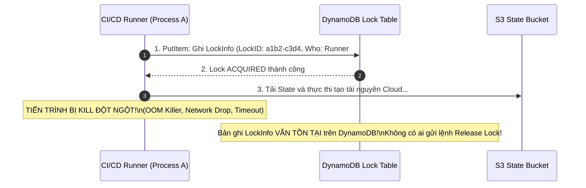
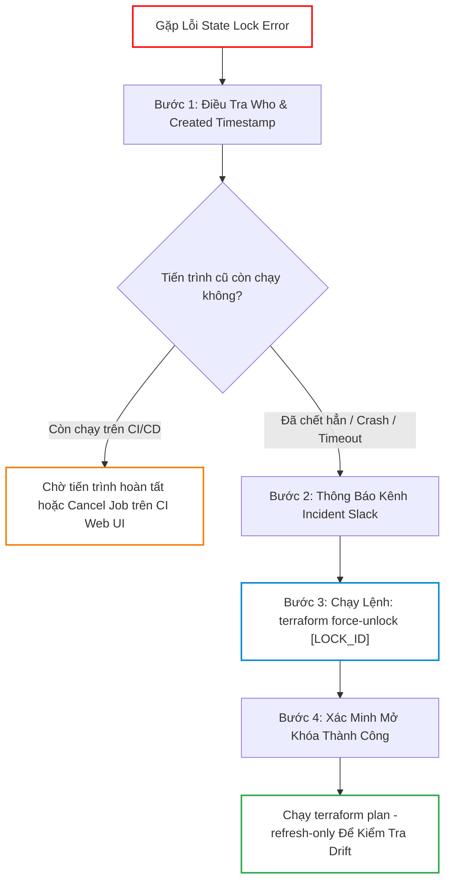
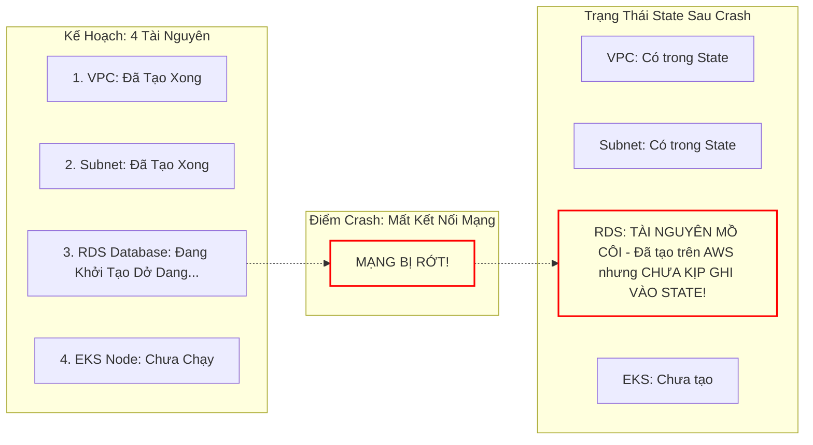
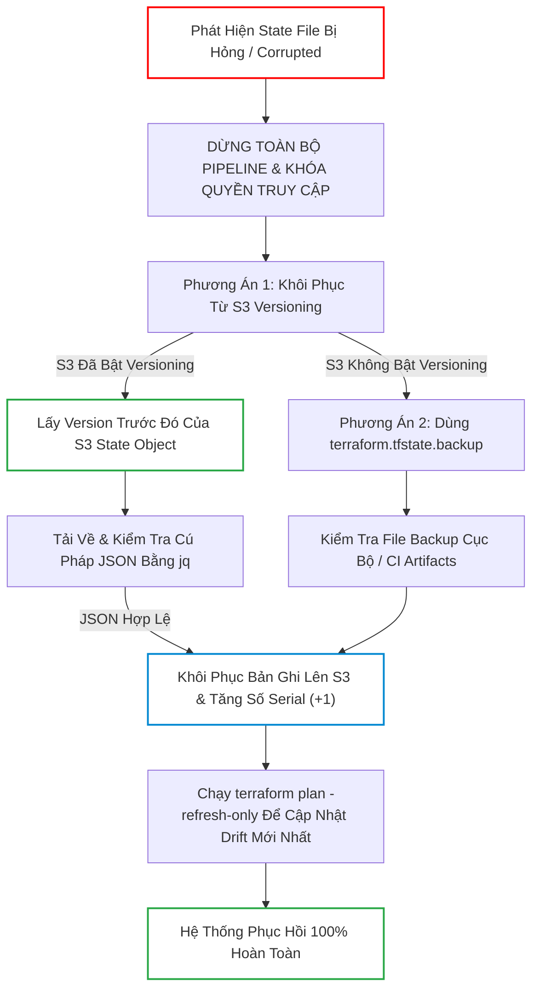
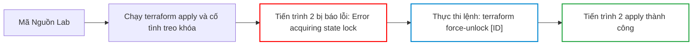
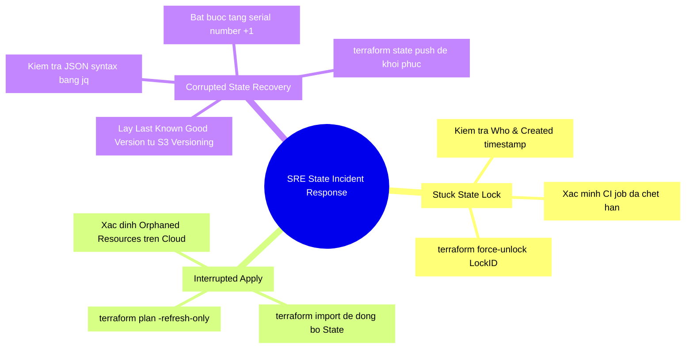


# Gỡ Rối State Lock, Apply Nửa Chừng và Cứu Hộ State Corruption

Trong sự nghiệp của một kỹ sư SRE / DevOps, không có khoảnh khắc nào làm tăng nhịp tim nhanh bằng việc nhận được thông báo đỏ lòm từ kênh Slack Incident: **"Terraform State bị kẹt Lock trong lúc Release, toàn bộ CI/CD Pipeline bị tê liệt!"** hoặc tồi tệ hơn: **"Máy chủ CI Runner bị sập nguồn giữa chừng khi đang chạy `terraform apply`, State file bị hỏng (Corrupted) và Terraform báo lỗi Invalid JSON!"**

Khi thảm họa xảy ra, mọi thao tác hoảng loạn như nhấn `Ctrl+C` liên tục, tự ý xóa DynamoDB Lock Table hoặc chỉnh sửa mò mẫm tệp State đều có thể biến một sự cố nhỏ thành thảm họa xóa sổ toàn bộ hạ tầng Production.

Để ứng phó với các tình huống khẩn cấp cấp độ P0 (Incident Severity Level 0), kỹ sư vận hành bắt buộc phải nắm vững **Sổ tay Ứng cứu Sự cố (Runbook / Incident Playbook)**: hiểu rõ cơ chế State Locking hoạt động bên dưới, quy trình sử dụng lệnh **`terraform force-unlock`**, cách hòa giải tài nguyên mồ côi (Orphaned Resources) sau một lần apply dở dang, và kỹ thuật phẫu thuật JSON State khôi phục thông qua **S3 Versioning**.

Bài viết này sẽ mổ xẻ toàn diện các nguyên nhân gốc rễ (5-Whys Root Cause) và cung cấp quy trình cứu hộ từng bước chuẩn SRE.

---

## 1. Sự Cố 1: State Lock Bị Kẹt (Stuck State Lock)

### 1.1. Bản Chất Kỹ Thuật Của Cơ Chế State Locking
Khi bạn thực hiện `terraform plan`, `apply` hoặc `destroy`, Terraform gửi một yêu cầu ghi bản ghi khóa vào cơ chế Locking Backend (ví dụ: bảng DynamoDB trên AWS hoặc Blob Lease trên Azure) để ngăn chặn các tiến trình khác can thiệp đồng thời.



Khi một kỹ sư khác (hoặc Pipeline tiếp theo) kích hoạt lệnh, Terraform sẽ ném ra lỗi Fatal:

```text
╷
│ Error: Error acquiring the state lock
│ 
│ Error message: ConditionalCheckFailedException: The conditional request failed
│ Lock Info:
│   ID:        e8a71b2c-9014-41d3-9f82-a0b81c2d3e4f
│   Path:      corp-prod-terraform-state/production/terraform.tfstate
│   Operation: OperationTypeApply
│   Who:       runner@ip-10-0-12-88
│   Version:   1.6.0
│   Created:   2026-04-09 03:15:22.981021 +0000 UTC
│   Info:      
╵
```

---

### 1.2. Quy Trình SRE 4 Bước Gỡ Khóa Bằng `terraform force-unlock`

> [!CAUTION]
> **CẢNH BÁO NGUY HIỂM CHẾT NGƯỜI**:
> Tuyệt đối **KHÔNG BAO GIỜ** chạy `force-unlock` ngay lập tức mà chưa xác minh xem có tiến trình nào đang thực sự ghi dữ liệu vào Cloud hay không! Nếu bạn mở khóa trong khi một CI Runner khác đang apply dở, hai tiến trình sẽ ghi đè State lẫn nhau và làm hỏng hoàn toàn State file!



#### Chi tiết các bước thực hiện:

1. **Bước 1: Điều tra danh tính tiến trình sở hữu Lock**
   - Đọc trường `Who` và `Created` trong thông báo lỗi.
   - Kiểm tra trên GitHub Actions / GitLab CI xem Job đó còn sống không. Nếu Job đã bị Terminated/Cancelled thì xác nhận Lock đã bị "bỏ hoang" (Orphaned Lock).
2. **Bước 2: Thông báo tới toàn đội**
   - Đăng thông báo lên kênh Slack SRE: *"Đang tiến hành force-unlock State `production/network` do CI Job #1092 bị crash."*
3. **Bước 3: Thực thi lệnh giải phóng khóa**
   ```bash
   terraform force-unlock e8a71b2c-9014-41d3-9f82-a0b81c2d3e4f
   ```
   Terraform sẽ yêu cầu xác nhận `yes`.
4. **Bước 4: Xác minh tính toàn vẹn**
   ```bash
   terraform plan -refresh-only
   ```

---

## 2. Sự Cố 2: Apply Nửa Chừng (Interrupted / Partial Apply)

Tình huống này xảy ra khi lệnh `terraform apply` đang chạy đến tài nguyên thứ 5 (trong tổng số 10 tài nguyên) thì bị ngắt kết nối mạng hoặc kỹ sư nhấn `Ctrl+C`.



### 2.1. Hậu Quả Của Tài Nguyên Mồ Côi (Orphaned Resources)
Khi bạn chạy lại `terraform apply`:
- Terraform đọc State và thấy chưa có RDS Database.
- Terraform gửi lệnh tạo RDS mới với cùng tên `corp-prod-db`.
- Cloud API trả về lỗi: `DBInstanceAlreadyExists: Database corp-prod-db already exists`!

### 2.2. Quy Trình Khắc Phục Chuẩn SRE
1. **Bước 1**: Đăng nhập AWS CLI / Console để xác định chính xác ID của tài nguyên đã được tạo dở.
2. **Bước 2**: Sử dụng khối `import` hoặc lệnh `terraform import` để nạp tài nguyên mồ côi đó vào State hiện tại:
   ```bash
   terraform import aws_db_instance.core corp-prod-db
   ```
3. **Bước 3**: Chạy `terraform plan` để kiểm tra độ lệch cấu hình (Diff) và đảm bảo State đã khớp 100% với thực tế.
4. **Bước 4**: Tiếp tục chạy `terraform apply` để hoàn tất các tài nguyên còn lại.

---

## 3. Sự Cố 3: Cứu Hộ Thảm Họa State Bị Hỏng (State Corruption Recovery)

Đây là tình huống thảm khốc nhất: File `terraform.tfstate` bị lỗi cú pháp JSON do lỗi ổ cứng, hoặc bị ghi đè bởi một file rỗng dung lượng 0 bytes.



### 3.1. Phẫu Thuật Trường `serial` Trong JSON State
Mỗi khi Terraform State được cập nhật, trường `"serial"` bên trong JSON sẽ tự động tăng thêm 1 đơn vị. Terraform Backend sử dụng trường này để chống việc nạp nhầm bản State cũ.

```json
{
  "version": 4,
  "terraform_version": "1.6.0",
  "serial": 42,
  "lineage": "8b92c10a-3456-4789-abcd-0123456789ab",
  "resources": [
    {
      "mode": "managed",
      "type": "aws_instance",
      "name": "web",
      "provider": "provider[\"registry.terraform.io/hashicorp/aws\"]",
      "instances": [
        {
          "schema_version": 1,
          "attributes": {
            "id": "i-0123456789abcdef0",
            "ami": "ami-0c55b159cbfafe1f0",
            "instance_type": "t3.medium"
          }
        }
      ]
    }
  ]
}
```

> [!IMPORTANT]
> **Quy Tắc Serial Increment**:
> Nếu bạn buộc phải chỉnh sửa thủ công file State JSON để sửa lỗi, bạn **BẮT BUỘC PHẢI TĂNG GIÁ TRỊ `serial` LÊN ÍT NHẤT 1 ĐƠN VỊ** (ví dụ từ `42` lên `43`). Nếu không, Terraform Backend sẽ từ chối nạp file với lỗi: `State serial number is older than current remote state`.

---

## 4. Bảng Ma Trận Các Lệnh Khôi Phục & Phẫu Thuật State

| Câu Lệnh CLI | Mục Đích SRE | Mức Độ Rủi Ro | Biện Pháp Phòng Ngừa |
| :--- | :--- | :--- | :--- |
| `terraform state pull > backup.json` | Tải State an toàn về máy | **Không có rủi ro (Read-only)** | Luôn chạy trước khi can thiệp State |
| `terraform force-unlock <ID>` | Mở khóa khẩn cấp | **Cao** | Kiểm tra kỹ tiến trình cũ trước khi chạy |
| `terraform import <ADDR> <ID>` | Nạp tài nguyên mồ côi | **Thấp** | Chạy `plan` sau khi import |
| `terraform state rm <ADDR>` | Xóa khỏi State, giữ trên Cloud | **Trung bình** | Chỉ dùng khi muốn tách State hoặc xóa quản lý |
| `terraform state push state.json` | Ghi đè State lên Remote Backend | **CỰC KỲ NGUY HIỂM** | Phải tăng `serial` và kiểm tra JSON bằng `jq` |

---

## 5. Hands-On Lab: Mô Phỏng & Xử Lý Sự Cố State Lock Bị Kẹt

Trong bài lab này, chúng ta sẽ cố tình tạo ra một tình trạng kẹt State Lock giả lập và thực hành quy trình mở khóa khẩn cấp bằng `terraform force-unlock`.



### Bước 1: Khởi tạo thư mục lab
```bash
mkdir -p terraform-lab26-staterecovery
cd terraform-lab26-staterecovery
```

### Bước 2: Tạo file `main.tf`
Tạo file `main.tf`:
```hcl
terraform {
  required_version = ">= 1.5.0"
}

# Giả lập một tài nguyên hạ tầng
resource "terraform_data" "critical_service" {
  input = {
    service_name = "payment-engine"
    status       = "RUNNING"
    timestamp    = timestamp()
  }
}

output "service_info" {
  value = terraform_data.critical_service.input
}
```

### Bước 3: Khởi tạo và Apply ban đầu
```bash
terraform init
terraform apply -auto-approve
```

### Bước 4: Giả lập sự cố kẹt State Lock (Tạo file lock nhân tạo)
Trong môi trường Backend local hoặc S3, chúng ta có thể mô phỏng một Lock Info bị bỏ quên:
Tạo file `.terraform.tfstate.lock.info`:
```json
{
  "ID": "incident-lock-9988-aabb-ccdd",
  "Operation": "OperationTypeApply",
  "Info": "CI Runner Crash Simulation",
  "Who": "ci-runner@worker-node-99",
  "Version": "1.6.0",
  "Created": "2026-04-09T08:00:00Z",
  "Path": "terraform.tfstate"
}
```

### Bước 5: Kích hoạt lệnh và quan sát lỗi State Lock
Chạy:
```bash
terraform plan
```

**Kết quả terminal:**
```text
╷
│ Error: Error acquiring the state lock
│ 
│ Lock Info:
│   ID:        incident-lock-9988-aabb-ccdd
│   Path:      terraform.tfstate
│   Operation: OperationTypeApply
│   Who:       ci-runner@worker-node-99
│   Created:   2026-04-09T08:00:00Z
│   Info:      CI Runner Crash Simulation
╵
```
Terraform đã chặn toàn bộ thao tác do State đang bị khóa!

### Bước 6: Thực hiện quy trình mở khóa khẩn cấp
Chạy lệnh `force-unlock` kèm theo ID lấy từ thông báo lỗi:
```bash
terraform force-unlock incident-lock-9988-aabb-ccdd
```

Hệ thống hỏi xác nhận:
```text
Do you really want to force-unlock?
  Terraform will remove the lock on the remote state.
  This will allow local or remote tasks to modify state, which
  may resolve issues where Terraform has failed to lock the state.

  Only 'yes' will be accepted to confirm.

  Enter a value: yes
```
Nhập `yes` và nhấn Enter.

**Kết quả:**
```text
Terraform state has been successfully unlocked!
Force-unlock successful!
```

### Bước 7: Kiểm tra lại hoạt động của hệ thống
Chạy lại:
```bash
terraform plan
```
**Kết quả:** Kế hoạch thực thi thành công, không còn bất kỳ lỗi Lock nào!

### Bước 8: Dọn dẹp môi trường lab
```bash
terraform destroy -auto-approve
cd ..
rm -rf terraform-lab26-staterecovery
```

---

## 6. 10 Câu Hỏi Trắc Nghiệm & Phỏng Vấn Chuyên Sâu (Self-Check Q&A)

<details class="qa-card">
<summary class="qa-summary">
  <div class="qa-summary-left">
    <span class="qa-num-badge">Q01</span>
    <span>Điều gì nguy hiểm nhất có thể xảy ra nếu bạn chạy `terraform force-unlock` khi tiến trình `apply` cũ vẫn đang thực sự chạy ngầm?</span>
  </div>
  <span class="qa-chevron">
    <svg width="18" height="18" fill="none" stroke="currentColor" stroke-width="2.5" viewBox="0 0 24 24"><polyline points="6 9 12 15 18 9"></polyline></svg>
  </span>
</summary>
<div class="qa-answer">
  <div class="qa-answer-header">
    <svg width="14" height="14" fill="none" stroke="currentColor" stroke-width="2" viewBox="0 0 24 24"><path d="M22 11.08V12a10 10 0 1 1-5.93-9.14"></path><polyline points="22 4 12 14.01 9 11.01"></polyline></svg>
    <span>Phân Tích &amp; Lời Giải Kỹ Thuật</span>
  </div>
  : Nếu tiến trình cũ vẫn đang gửi API và chuẩn bị ghi cập nhật vào State, việc bạn mở khóa sẽ cho phép một tiến trình thứ hai ghi đè lên State cùng một lúc (Race Condition). Hậu quả là State file sẽ bị **Race Condition Corruption (ghi đè mất dữ liệu)** hoặc tạo ra các tài nguyên mồ côi ngoài Cloud mà Terraform không còn theo dõi được nữa.
</div>
</details>

<details class="qa-card">
<summary class="qa-summary">
  <div class="qa-summary-left">
    <span class="qa-num-badge">Q02</span>
    <span>Tại sao tính năng S3 Versioning là yêu cầu bắt buộc tối thiểu cho mọi S3 Backend lưu trữ Terraform State?</span>
  </div>
  <span class="qa-chevron">
    <svg width="18" height="18" fill="none" stroke="currentColor" stroke-width="2.5" viewBox="0 0 24 24"><polyline points="6 9 12 15 18 9"></polyline></svg>
  </span>
</summary>
<div class="qa-answer">
  <div class="qa-answer-header">
    <svg width="14" height="14" fill="none" stroke="currentColor" stroke-width="2" viewBox="0 0 24 24"><path d="M22 11.08V12a10 10 0 1 1-5.93-9.14"></path><polyline points="22 4 12 14.01 9 11.01"></polyline></svg>
    <span>Phân Tích &amp; Lời Giải Kỹ Thuật</span>
  </div>
  : S3 Versioning lưu giữ lại toàn bộ lịch sử của mọi lần sửa đổi tệp State. Khi có sự cố State bị hỏng (corrupted), bị ghi đè sai sót hoặc bị ai đó xóa nhầm, kỹ sư SRE chỉ mất 30 giây để khôi phục lại phiên bản State nguyên vẹn trước đó (Last Known Good Version) từ S3 Version History.
</div>
</details>

<details class="qa-card">
<summary class="qa-summary">
  <div class="qa-summary-left">
    <span class="qa-num-badge">Q03</span>
    <span>Tham số `lineage` trong file `terraform.tfstate` có ý nghĩa gì?</span>
  </div>
  <span class="qa-chevron">
    <svg width="18" height="18" fill="none" stroke="currentColor" stroke-width="2.5" viewBox="0 0 24 24"><polyline points="6 9 12 15 18 9"></polyline></svg>
  </span>
</summary>
<div class="qa-answer">
  <div class="qa-answer-header">
    <svg width="14" height="14" fill="none" stroke="currentColor" stroke-width="2" viewBox="0 0 24 24"><path d="M22 11.08V12a10 10 0 1 1-5.93-9.14"></path><polyline points="22 4 12 14.01 9 11.01"></polyline></svg>
    <span>Phân Tích &amp; Lời Giải Kỹ Thuật</span>
  </div>
  : `lineage` là một chuỗi UUID duy nhất được tạo ra khi State file được khởi tạo lần đầu tiên. Nó đóng vai trò như "mã định danh ADN" của State. Terraform kiểm tra trường này để đảm bảo bạn không vô tình nạp một file State của một dự án/hạ tầng hoàn toàn khác vào Backend hiện tại.
</div>
</details>

<details class="qa-card">
<summary class="qa-summary">
  <div class="qa-summary-left">
    <span class="qa-num-badge">Q04</span>
    <span>Nếu bạn vô tình làm mất hoàn toàn file `terraform.tfstate` và không có bản sao lưu (Backup), điều gì sẽ xảy ra với hạ tầng đang chạy trên Cloud?</span>
  </div>
  <span class="qa-chevron">
    <svg width="18" height="18" fill="none" stroke="currentColor" stroke-width="2.5" viewBox="0 0 24 24"><polyline points="6 9 12 15 18 9"></polyline></svg>
  </span>
</summary>
<div class="qa-answer">
  <div class="qa-answer-header">
    <svg width="14" height="14" fill="none" stroke="currentColor" stroke-width="2" viewBox="0 0 24 24"><path d="M22 11.08V12a10 10 0 1 1-5.93-9.14"></path><polyline points="22 4 12 14.01 9 11.01"></polyline></svg>
    <span>Phân Tích &amp; Lời Giải Kỹ Thuật</span>
  </div>
  : Hạ tầng trên Cloud (máy chủ EC2, cơ sở dữ liệu RDS, mạng VPC) **VẪN TIẾP TỤC HOẠT ĐỘNG BÌNH THƯỜNG** mà không bị sập. Tuy nhiên, Terraform đã hoàn toàn mất quyền kiểm soát (bị "mù"). Để khôi phục quyền quản lý, bạn bắt buộc phải viết lại mã nguồn HCL và sử dụng khối `import` để nạp từng tài nguyên trở lại một State file mới.
</div>
</details>

<details class="qa-card">
<summary class="qa-summary">
  <div class="qa-summary-left">
    <span class="qa-num-badge">Q05</span>
    <span>Khi nào thì bạn nên sử dụng lệnh `terraform refresh` (hoặc `terraform apply -refresh-only`)?</span>
  </div>
  <span class="qa-chevron">
    <svg width="18" height="18" fill="none" stroke="currentColor" stroke-width="2.5" viewBox="0 0 24 24"><polyline points="6 9 12 15 18 9"></polyline></svg>
  </span>
</summary>
<div class="qa-answer">
  <div class="qa-answer-header">
    <svg width="14" height="14" fill="none" stroke="currentColor" stroke-width="2" viewBox="0 0 24 24"><path d="M22 11.08V12a10 10 0 1 1-5.93-9.14"></path><polyline points="22 4 12 14.01 9 11.01"></polyline></svg>
    <span>Phân Tích &amp; Lời Giải Kỹ Thuật</span>
  </div>
  : Khi có những thay đổi hạ tầng diễn ra trực tiếp ngoài Cloud Console (Drift), hoặc sau khi bạn vừa mở khóa State / khôi phục State từ bản sao lưu và muốn đồng bộ hóa lại các giá trị thuộc tính thực tế mới nhất vào State mà không làm thay đổi hạ tầng.
</div>
</details>

<details class="qa-card">
<summary class="qa-summary">
  <div class="qa-summary-left">
    <span class="qa-num-badge">Q06</span>
    <span>Trong bảng DynamoDB dùng cho State Lock, khóa chính (Primary Key / Partition Key) bắt buộc phải có tên là gì?</span>
  </div>
  <span class="qa-chevron">
    <svg width="18" height="18" fill="none" stroke="currentColor" stroke-width="2.5" viewBox="0 0 24 24"><polyline points="6 9 12 15 18 9"></polyline></svg>
  </span>
</summary>
<div class="qa-answer">
  <div class="qa-answer-header">
    <svg width="14" height="14" fill="none" stroke="currentColor" stroke-width="2" viewBox="0 0 24 24"><path d="M22 11.08V12a10 10 0 1 1-5.93-9.14"></path><polyline points="22 4 12 14.01 9 11.01"></polyline></svg>
    <span>Phân Tích &amp; Lời Giải Kỹ Thuật</span>
  </div>
  : Bắt buộc phải có tên chính xác là **`LockID`** (kiểu dữ liệu String). Nếu đặt tên khác (như `id` hay `lock_id`), Terraform AWS Provider sẽ báo lỗi `ResourceNotFoundException` hoặc không thể ghi bản ghi khóa.
</div>
</details>

<details class="qa-card">
<summary class="qa-summary">
  <div class="qa-summary-left">
    <span class="qa-num-badge">Q07</span>
    <span>Tại sao lệnh `terraform state pull` lại là bước đầu tiên bắt buộc phải làm trước khi can thiệp thủ công vào State?</span>
  </div>
  <span class="qa-chevron">
    <svg width="18" height="18" fill="none" stroke="currentColor" stroke-width="2.5" viewBox="0 0 24 24"><polyline points="6 9 12 15 18 9"></polyline></svg>
  </span>
</summary>
<div class="qa-answer">
  <div class="qa-answer-header">
    <svg width="14" height="14" fill="none" stroke="currentColor" stroke-width="2" viewBox="0 0 24 24"><path d="M22 11.08V12a10 10 0 1 1-5.93-9.14"></path><polyline points="22 4 12 14.01 9 11.01"></polyline></svg>
    <span>Phân Tích &amp; Lời Giải Kỹ Thuật</span>
  </div>
  : Lệnh `terraform state pull > backup_state.json` tải bản State hiện tại từ Remote Backend về máy cục bộ kèm theo việc xác thực tính toàn vẹn của mã checksum SHA256. Đây là tấm lưới an toàn giúp bạn luôn có một bản snapshot để rollback nếu các thao tác chỉnh sửa sau đó gặp sự cố.
</div>
</details>

<details class="qa-card">
<summary class="qa-summary">
  <div class="qa-summary-left">
    <span class="qa-num-badge">Q08</span>
    <span>Khối `terraform.tfstate.backup` cục bộ được tạo ra vào thời điểm nào?</span>
  </div>
  <span class="qa-chevron">
    <svg width="18" height="18" fill="none" stroke="currentColor" stroke-width="2.5" viewBox="0 0 24 24"><polyline points="6 9 12 15 18 9"></polyline></svg>
  </span>
</summary>
<div class="qa-answer">
  <div class="qa-answer-header">
    <svg width="14" height="14" fill="none" stroke="currentColor" stroke-width="2" viewBox="0 0 24 24"><path d="M22 11.08V12a10 10 0 1 1-5.93-9.14"></path><polyline points="22 4 12 14.01 9 11.01"></polyline></svg>
    <span>Phân Tích &amp; Lời Giải Kỹ Thuật</span>
  </div>
  : Được tạo ra tự động ngay trước mỗi lần Terraform chuẩn bị ghi đè một trạng thái mới vào file `terraform.tfstate`. File `.backup` này lưu giữ trạng thái của ngay trước chu kỳ thực thi gần nhất.
</div>
</details>

<details class="qa-card">
<summary class="qa-summary">
  <div class="qa-summary-left">
    <span class="qa-num-badge">Q09</span>
    <span>Làm thế nào để tự động xóa các bản ghi State Lock đã quá hạn (Stale Locks) trong DynamoDB?</span>
  </div>
  <span class="qa-chevron">
    <svg width="18" height="18" fill="none" stroke="currentColor" stroke-width="2.5" viewBox="0 0 24 24"><polyline points="6 9 12 15 18 9"></polyline></svg>
  </span>
</summary>
<div class="qa-answer">
  <div class="qa-answer-header">
    <svg width="14" height="14" fill="none" stroke="currentColor" stroke-width="2" viewBox="0 0 24 24"><path d="M22 11.08V12a10 10 0 1 1-5.93-9.14"></path><polyline points="22 4 12 14.01 9 11.01"></polyline></svg>
    <span>Phân Tích &amp; Lời Giải Kỹ Thuật</span>
  </div>
  : Thông thường không nên bật TTL tự động trên bảng Lock DynamoDB vì có những tác vụ provisioning lớn (như tạo RDS Multi-AZ hoặc EKS) có thể mất từ 20-40 phút. Việc giải phóng lock phải luôn tuân theo quy trình kiểm tra thủ công có chủ đích của kỹ sư SRE.
</div>
</details>

<details class="qa-card">
<summary class="qa-summary">
  <div class="qa-summary-left">
    <span class="qa-num-badge">Q10</span>
    <span>Khi sửa đổi thủ công JSON State, làm thế nào để kiểm tra cú pháp file JSON hợp lệ trước khi đẩy lên Backend bằng `terraform state push`?</span>
  </div>
  <span class="qa-chevron">
    <svg width="18" height="18" fill="none" stroke="currentColor" stroke-width="2.5" viewBox="0 0 24 24"><polyline points="6 9 12 15 18 9"></polyline></svg>
  </span>
</summary>
<div class="qa-answer">
  <div class="qa-answer-header">
    <svg width="14" height="14" fill="none" stroke="currentColor" stroke-width="2" viewBox="0 0 24 24"><path d="M22 11.08V12a10 10 0 1 1-5.93-9.14"></path><polyline points="22 4 12 14.01 9 11.01"></polyline></svg>
    <span>Phân Tích &amp; Lời Giải Kỹ Thuật</span>
  </div>
  : Sử dụng công cụ `jq` hoặc lệnh python:
```bash
jq empty state_modified.json && echo "JSON VALID"
```
Sau đó, nạp lên Backend một cách an toàn:
```bash
terraform state push state_modified.json
```
</div>
</details>

---

## 7. Tổng Kết & Cheat Sheet Thực Chiến



- **Quy tắc vàng ứng cứu**: Bình tĩnh điều tra danh tính `Who` trước khi bấm `force-unlock`.
- **Tiêu chuẩn thiết kế Backend**: 100% S3 State Buckets bắt buộc phải bật **S3 Versioning + S3 Object Lock**.
- **Bước tiếp theo**: Trong [Bài 27: Quản Trị Hạ Tầng Doanh Nghiệp Với HCP Terraform & Terraform Cloud](./27-quan-tri-ha-tang-doanh-nghiep-voi-hcp-terraform-cloud.md), chúng ta sẽ khám phá nền tảng SaaS Enterprise hàng đầu của HashiCorp với Private Registry, Remote Execution và Quản trị Chi phí chuyên sâu!

