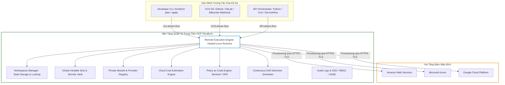
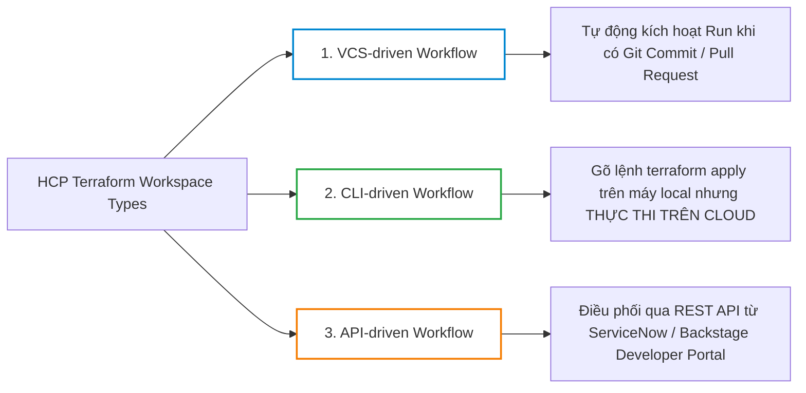
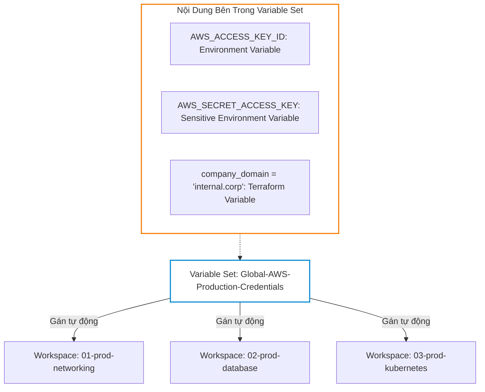
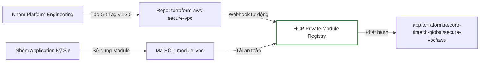
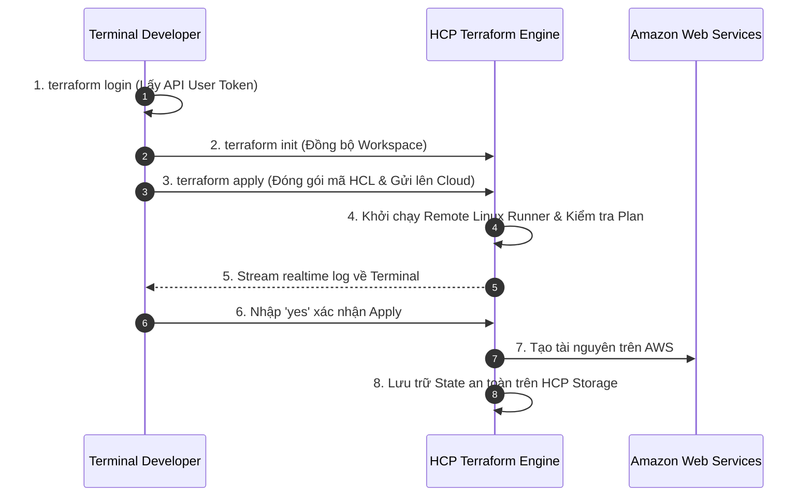
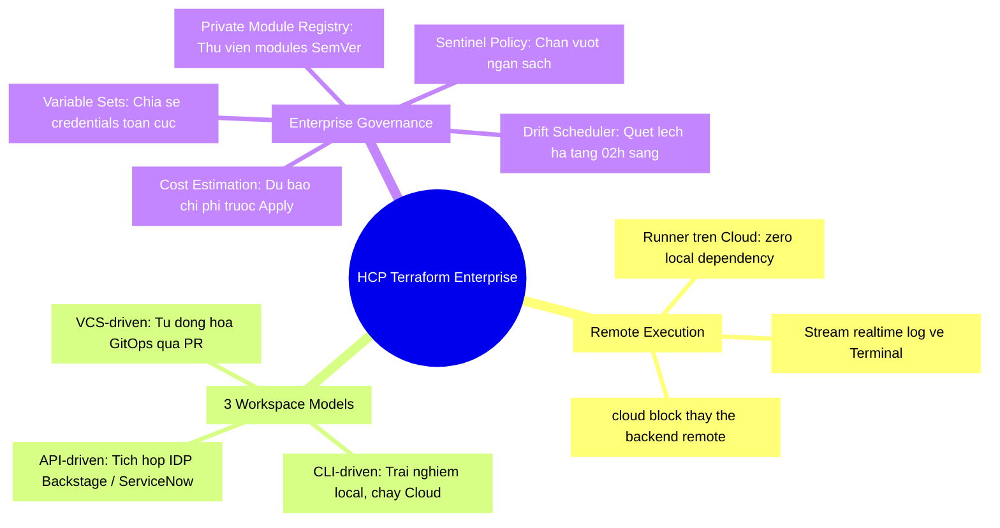


# Quản Trị Hạ Tầng Doanh Nghiệp Với HCP Terraform & Terraform Cloud

Khi doanh nghiệp phát triển từ một vài nhóm nhỏ lên quy mô hàng chục bộ phận độc lập (Platform Engineering, Data Platform, Security, Application Teams), việc tự vận hành hệ thống lưu trữ State trên S3/DynamoDB kết hợp với các pipeline CI/CD tự chế (Custom Scripts trên Jenkins hoặc GitHub Actions) bắt đầu bộc lộ các điểm nghẽn nghiêm trọng:
- Thiếu một giao diện trực quan (Single Pane of Glass) để theo dõi toàn bộ tài nguyên và chi phí trên mọi môi trường.
- Khó khăn trong việc chia sẻ và quản trị phiên bản các **Terraform Modules nội bộ (Private Module Registry)**.
- Không có cơ chế dự báo chi phí đám mây (Cost Estimation) tự động trước khi hạ tầng được tạo ra.
- Thiếu một hệ thống quản lý biến số bảo mật tập trung (Centralized Secrets & Variable Sets) có thể tái sử dụng cho hàng trăm dự án.
- Không có cơ chế kiểm tra và phát hiện Drift tự động theo lịch định kỳ (Health & Drift Schedules).

Để giải quyết toàn diện bài toán quản trị hạ tầng ở quy mô Enterprise, HashiCorp đã xây dựng **HCP Terraform (tiền thân là Terraform Cloud)** và **Terraform Enterprise (Self-hosted)**.

Bài viết này sẽ mổ xẻ toàn diện kiến trúc của HCP Terraform, phân tích 3 mô hình vận hành Workspaces (CLI-driven, VCS-driven, API-driven), cách thiết lập Variable Sets, xuất bản Module lên Private Registry, khai thác tính năng ước tính chi phí Cost Estimation và thực thi chính sách quản trị với **HashiCorp Sentinel**.

---

## 1. Kiến Trúc Tổng Thể: HCP Terraform vs Self-Hosted Open-Source



---

## 2. 3 Mô Hình Vận Hành Workspaces Trong HCP Terraform

Trong HCP Terraform, một **Workspace** không chỉ là một file state đơn thuần (như CLI workspace), mà là một không gian làm việc hoàn chỉnh chứa: **Mã nguồn, Lịch sử State, Biến số (Variables), Nhật ký chạy (Run History) và Quyền truy cập (RBAC)**.



### 2.1. Ma Trận So Sánh 3 Mô Hình Workspaces

| Tiêu Chí | VCS-driven (Phổ biến nhất) | CLI-driven (Linh hoạt cho Dev) | API-driven (Tự động hóa hoàn toàn) |
| :--- | :--- | :--- | :--- |
| **Nguồn kích hoạt** | Git Webhooks (GitHub, GitLab, Azure DevOps) | Lệnh `terraform plan/apply` từ terminal | Gọi REST API / Webhooks của Terraform Cloud |
| **Trải nghiệm người dùng** | Giao diện Pull Request Comments & Web UI | Trực tiếp trên terminal quen thuộc của kỹ sư | Không tương tác trực tiếp (Headless) |
| **Vị trí thực thi (Execution)** | Remote trên Container của HCP | Remote trên Container của HCP | Remote trên Container của HCP |
| **Tính phù hợp** | Quy trình chuẩn GitOps, kiểm soát phiên bản | Debug nhanh, thử nghiệm tính năng mới | Tích hợp vào Internal Developer Platform (IDP) |
| **Kiểm soát phân quyền** | Gắn chặt với quyền Review trên Git | Dựa trên API Token cá nhân của User | Dựa trên Service Account Token chuyên dụng |

---

## 3. Cấu Hình Remote Backend Với `cloud` Block

Kể từ Terraform 1.1+, khối cấu hình `cloud` được giới thiệu để thay thế khối `backend "remote"` cũ, mang lại trải nghiệm tích hợp mượt mà nhất.

```hcl
terraform {
  required_version = ">= 1.5.0"

  # CẤU HÌNH KẾT NỐI VÀO HCP TERRAFORM
  cloud {
    organization = "corp-fintech-global"

    workspaces {
      name = "production-core-network"
      # Hoặc sử dụng tags để liên kết nhiều workspaces động:
      # tags = ["networking", "production"]
    }
  }

  required_providers {
    aws = {
      source  = "hashicorp/aws"
      version = "~> 5.0"
    }
  }
}

resource "aws_vpc" "main" {
  cidr_block           = "10.200.0.0/16"
  enable_dns_hostnames = true

  tags = {
    Name        = "hcp-managed-production-vpc"
    Environment = "Production"
  }
}
```

Khi bạn gõ `terraform apply` trên máy cá nhân:
1. Terraform CLI đóng gói toàn bộ mã nguồn HCL thành một tệp nén tarball.
2. Tải tarball lên HCP Terraform qua API.
3. HCP Terraform cấp phát một máy ảo Linux tạm thời (Ephemeral Runner), nạp biến số từ Workspace, thực thi `terraform plan/apply` trên Cloud.
4. Toàn bộ log thực thi được stream trực tiếp về terminal của bạn theo thời gian thực!

---

## 4. Quản Lý Biến Số Toàn Cục Với Variable Sets

Trong môi trường lớn, việc lặp lại các biến số xác thực (như `AWS_ACCESS_KEY_ID`, `AWS_SECRET_ACCESS_KEY`, hoặc `environment = "production"`) trên 50 Workspaces khác nhau là một gánh nặng bảo trì lớn. **Variable Sets** cho phép gom nhóm các biến số và gán hàng loạt cho nhiều Workspaces chỉ với một cú click chuột.



---

## 5. Private Module Registry: Xây Dựng Thư Viện Hạ Tầng Dùng Chung

Một trong những giá trị lớn nhất của HCP Terraform là **Private Module Registry**: Cho phép các nhóm Platform Engineering xuất bản các module chuẩn hóa, có gắn thẻ phiên bản SemVer (`v1.0.0`, `v1.1.0`), kèm tài liệu hướng dẫn và schema tự sinh.



### 5.1. Cách Sử Dụng Private Module Trong Mã Nguồn HCL
```hcl
module "production_vpc" {
  # Định dạng chuẩn: <HOSTNAME>/<ORGANIZATION>/<MODULE_NAME>/<PROVIDER>
  source  = "app.terraform.io/corp-fintech-global/secure-vpc/aws"
  version = "1.2.0"

  vpc_cidr    = "10.100.0.0/16"
  environment = "production"
}
```

---

## 6. Tính Năng Dự Báo Chi Phí (Cost Estimation) & Sentinel Policy

### 6.1. Tự Động Phân Tích Chi Phí Hàng Tháng
HCP Terraform tích hợp sẵn công cụ **Cost Estimation**. Trong mỗi lần chạy `terraform plan`, hệ thống tự động phân tích các tài nguyên phần cứng (EC2, EBS, RDS, NAT Gateway, Load Balancer) và hiển thị bảng so sánh chi phí hàng tháng chi tiết:

```text
Cost Estimation Summary:
  + Monthly Cost Diff: +$284.50
  + Prior Monthly Cost: $1,420.00
  + New Monthly Cost:   $1,704.50

Breakdown:
  + aws_instance.web (t3.xlarge): +$121.18/month
  + aws_db_instance.postgres (db.r6g.large): +$163.32/month
```

### 6.2. Thiết Lập Rào Chắn Chi Phí Với HashiCorp Sentinel
Sentinel là ngôn ngữ Policy as Code độc quyền của HashiCorp chạy trực tiếp bên trong HCP Terraform:

```sentinel
# policy/cost_limits.sentinel
import "tfrun"
import "decimal"

# Giới hạn mức tăng chi phí tối đa cho mỗi lượt thay đổi là $200/tháng
max_allowed_cost = decimal.new(200.00)

# Lấy thông tin chi phí từ Cost Estimation Engine
proposed_cost = decimal.new(tfrun.cost_estimate.proposed_monthly_cost)
prior_cost    = decimal.new(tfrun.cost_estimate.prior_monthly_cost)
delta_cost    = proposed_cost.subtract(prior_cost)

# Luật: Chặn apply nếu chi phí tăng vượt mức cho phép
main = rule {
  delta_cost.less_than_or_equals(max_allowed_cost)
}
```

---

## 7. Phát Hiện Drift Tự Động Định Kỳ (Continuous Drift Detection)

Một trong những tính năng cao cấp của HCP Terraform là **Scheduled Health & Drift Checks**:
- Hệ thống tự động kích hoạt `terraform plan -refresh-only` vào lúc 02:00 sáng mỗi ngày.
- Nếu phát hiện có ai đó tự ý đổi Security Group hoặc gán thêm IP trực tiếp trên Cloud Console ngoài tầm kiểm soát của code, HCP sẽ gửi cảnh báo ngay lập tức vào kênh Slack SRE kèm theo danh sách các thuộc tính bị lệch (Drifted Attributes).

---

## 8. Hands-On Lab: Thiết Lập Workspace & Thực Thi Remote Run Trên HCP Terraform

Trong bài lab này, chúng ta sẽ cấu hình khối `cloud` liên kết với HCP Terraform và trải nghiệm quy trình Remote Plan/Apply trực tiếp từ dòng lệnh.



### Bước 1: Khởi tạo thư mục thực hành
```bash
mkdir -p terraform-lab27-hcp
cd terraform-lab27-hcp
```

### Bước 2: Đăng nhập vào HCP Terraform CLI
```bash
terraform login
```
Hệ thống sẽ mở trình duyệt web để bạn tạo **User API Token**, sau đó paste token vào terminal để lưu vào `~/.terraform.d/credentials.tfrc.json`.

### Bước 3: Tạo file `main.tf` với khối `cloud`
Tạo file `main.tf` (Thay thế tên Organization của bạn):
```hcl
terraform {
  required_version = ">= 1.5.0"

  cloud {
    # Thay bằng tên Organization thực tế của bạn trên HCP Terraform
    organization = "ntk-devops-lab"

    workspaces {
      name = "lab27-remote-execution"
    }
  }
}

# Giả lập tài nguyên hạ tầng
resource "terraform_data" "cloud_workload" {
  input = {
    app_name    = "enterprise-portal"
    deployed_by = "HCP-Terraform-Remote-Runner"
    timestamp   = timestamp()
  }
}

output "execution_metadata" {
  value = {
    workspace_name = "lab27-remote-execution"
    message        = "Hạ tầng được quản trị thành công qua HCP Terraform SaaS!"
    app_data       = terraform_data.cloud_workload.input
  }
}
```

### Bước 4: Khởi tạo kết nối với Cloud
```bash
terraform init
```

**Quan sát terminal:**
```text
Initializing Terraform Cloud...
Initializing provider plugins...

Terraform Cloud has been successfully initialized!
```
Terraform tự động nhận diện và tạo mới Workspace `lab27-remote-execution` trên giao diện web của HCP Terraform nếu nó chưa tồn tại!

### Bước 5: Chạy `terraform plan` (Remote Evaluation)
```bash
terraform plan
```
Quan sát: Quá trình phân tích đồ thị không diễn ra trên CPU máy của bạn mà diễn ra trên hạ tầng của HashiCorp Cloud!

### Bước 6: Chạy `terraform apply` và theo dõi Stream Log
```bash
terraform apply
```
Hệ thống hiển thị đường dẫn URL trực tiếp tới Web UI để theo dõi tiến độ:
```text
To view this run in a browser, visit:
https://app.terraform.io/app/ntk-devops-lab/workspaces/lab27-remote-execution/runs/run-9988aabb
```

Nhập `yes` để hoàn tất việc apply.

### Bước 7: Dọn dẹp môi trường lab
```bash
terraform destroy -auto-approve
cd ..
rm -rf terraform-lab27-hcp
```

---

## 9. 10 Câu Hỏi Trắc Nghiệm & Phỏng Vấn Chuyên Sâu (Self-Check Q&A)

<details class="qa-card">
<summary class="qa-summary">
  <div class="qa-summary-left">
    <span class="qa-num-badge">Q01</span>
    <span>Sự khác biệt cốt lõi giữa "CLI Workspace" thông thường và "HCP Terraform Workspace" là gì?</span>
  </div>
  <span class="qa-chevron">
    <svg width="18" height="18" fill="none" stroke="currentColor" stroke-width="2.5" viewBox="0 0 24 24"><polyline points="6 9 12 15 18 9"></polyline></svg>
  </span>
</summary>
<div class="qa-answer">
  <div class="qa-answer-header">
    <svg width="14" height="14" fill="none" stroke="currentColor" stroke-width="2" viewBox="0 0 24 24"><path d="M22 11.08V12a10 10 0 1 1-5.93-9.14"></path><polyline points="22 4 12 14.01 9 11.01"></polyline></svg>
    <span>Phân Tích &amp; Lời Giải Kỹ Thuật</span>
  </div>
  : 
  - **CLI Workspace**: Chỉ là một phân vùng State file riêng biệt trên cùng một Backend cục bộ hoặc S3.
  - **HCP Terraform Workspace**: Là một đơn vị quản trị hoàn chỉnh bao gồm State file, cấu hình VCS Git liên kết, tập hợp biến số (Variables), lịch sử Audit Runs, cấu hình phân quyền người dùng (RBAC) và các chính sách Policy as Code gắn kèm.
</div>
</details>

<details class="qa-card">
<summary class="qa-summary">
  <div class="qa-summary-left">
    <span class="qa-num-badge">Q02</span>
    <span>Cơ chế "Run Triggers" trong HCP Terraform hoạt động như thế nào?</span>
  </div>
  <span class="qa-chevron">
    <svg width="18" height="18" fill="none" stroke="currentColor" stroke-width="2.5" viewBox="0 0 24 24"><polyline points="6 9 12 15 18 9"></polyline></svg>
  </span>
</summary>
<div class="qa-answer">
  <div class="qa-answer-header">
    <svg width="14" height="14" fill="none" stroke="currentColor" stroke-width="2" viewBox="0 0 24 24"><path d="M22 11.08V12a10 10 0 1 1-5.93-9.14"></path><polyline points="22 4 12 14.01 9 11.01"></polyline></svg>
    <span>Phân Tích &amp; Lời Giải Kỹ Thuật</span>
  </div>
  : Run Triggers cho phép thiết lập quan hệ phụ thuộc giữa các Workspaces. Khi Workspace nguồn (ví dụ: `01-networking`) thực thi `apply` thành công một thay đổi mới, HCP Terraform sẽ **tự động kích hoạt một lượt chạy `plan` mới** trên Workspace đích (ví dụ: `02-kubernetes-cluster`), giúp đồng bộ hóa hạ tầng tự động xuyên suốt các tầng.
</div>
</details>

<details class="qa-card">
<summary class="qa-summary">
  <div class="qa-summary-left">
    <span class="qa-num-badge">Q03</span>
    <span>Tính năng "Speculative Plan" trong mô hình VCS-driven có ý nghĩa gì đối với Pull Requests?</span>
  </div>
  <span class="qa-chevron">
    <svg width="18" height="18" fill="none" stroke="currentColor" stroke-width="2.5" viewBox="0 0 24 24"><polyline points="6 9 12 15 18 9"></polyline></svg>
  </span>
</summary>
<div class="qa-answer">
  <div class="qa-answer-header">
    <svg width="14" height="14" fill="none" stroke="currentColor" stroke-width="2" viewBox="0 0 24 24"><path d="M22 11.08V12a10 10 0 1 1-5.93-9.14"></path><polyline points="22 4 12 14.01 9 11.01"></polyline></svg>
    <span>Phân Tích &amp; Lời Giải Kỹ Thuật</span>
  </div>
  : Khi một kỹ sư tạo Pull Request trên GitHub/GitLab, HCP Terraform tự động kích hoạt một lượt chạy `plan` giả định (Speculative Plan) để tính toán trước các thay đổi và chi phí phát sinh mà **không khóa State file (No State Lock)** và **không cho phép apply**. Kết quả được post trực tiếp vào thảo luận PR để hỗ trợ thẩm định mã nguồn.
</div>
</details>

<details class="qa-card">
<summary class="qa-summary">
  <div class="qa-summary-left">
    <span class="qa-num-badge">Q04</span>
    <span>Sự khác biệt giữa Terraform Variables và Environment Variables trong bảng cấu hình Workspace của HCP Terraform là gì?</span>
  </div>
  <span class="qa-chevron">
    <svg width="18" height="18" fill="none" stroke="currentColor" stroke-width="2.5" viewBox="0 0 24 24"><polyline points="6 9 12 15 18 9"></polyline></svg>
  </span>
</summary>
<div class="qa-answer">
  <div class="qa-answer-header">
    <svg width="14" height="14" fill="none" stroke="currentColor" stroke-width="2" viewBox="0 0 24 24"><path d="M22 11.08V12a10 10 0 1 1-5.93-9.14"></path><polyline points="22 4 12 14.01 9 11.01"></polyline></svg>
    <span>Phân Tích &amp; Lời Giải Kỹ Thuật</span>
  </div>
  : 
  - **Terraform Variables**: Tương đương với các giá trị truyền vào `var.<variable_name>` trong code HCL.
  - **Environment Variables**: Là các biến môi trường của hệ điều hành Linux Runner (ví dụ: `AWS_DEFAULT_REGION`, `TF_LOG = "DEBUG"`, `CONFTEST_VERSION`).
</div>
</details>

<details class="qa-card">
<summary class="qa-summary">
  <div class="qa-summary-left">
    <span class="qa-num-badge">Q05</span>
    <span>Khi nào nên sử dụng Agent Pools (Terraform Cloud Agents) thay vì Standard Hosted Runners của HashiCorp?</span>
  </div>
  <span class="qa-chevron">
    <svg width="18" height="18" fill="none" stroke="currentColor" stroke-width="2.5" viewBox="0 0 24 24"><polyline points="6 9 12 15 18 9"></polyline></svg>
  </span>
</summary>
<div class="qa-answer">
  <div class="qa-answer-header">
    <svg width="14" height="14" fill="none" stroke="currentColor" stroke-width="2" viewBox="0 0 24 24"><path d="M22 11.08V12a10 10 0 1 1-5.93-9.14"></path><polyline points="22 4 12 14.01 9 11.01"></polyline></svg>
    <span>Phân Tích &amp; Lời Giải Kỹ Thuật</span>
  </div>
  : Khi hạ tầng đám mây của doanh nghiệp nằm trong các mạng riêng biệt (Isolated Private VPCs / On-Premise Data Centers) không mở cổng truy cập ra Internet công cộng. Bằng cách cài đặt **Terraform Cloud Agent** bên trong mạng nội bộ, Agent sẽ chủ động thiết lập kết nối ra ngoài (Outbound HTTPS) tới HCP để nhận lệnh mà không cần mở bất kỳ cổng Inbound nào.
</div>
</details>

<details class="qa-card">
<summary class="qa-summary">
  <div class="qa-summary-left">
    <span class="qa-num-badge">Q06</span>
    <span>Làm thế nào để bảo vệ một biến số nhạy cảm (như DB Password) trong giao diện HCP Terraform?</span>
  </div>
  <span class="qa-chevron">
    <svg width="18" height="18" fill="none" stroke="currentColor" stroke-width="2.5" viewBox="0 0 24 24"><polyline points="6 9 12 15 18 9"></polyline></svg>
  </span>
</summary>
<div class="qa-answer">
  <div class="qa-answer-header">
    <svg width="14" height="14" fill="none" stroke="currentColor" stroke-width="2" viewBox="0 0 24 24"><path d="M22 11.08V12a10 10 0 1 1-5.93-9.14"></path><polyline points="22 4 12 14.01 9 11.01"></polyline></svg>
    <span>Phân Tích &amp; Lời Giải Kỹ Thuật</span>
  </div>
  : Tích chọn vào ô **"Sensitive"** khi tạo biến số. Sau khi lưu, giá trị sẽ được mã hóa bằng thuật toán Vault của HashiCorp, vĩnh viễn bị ẩn trên giao diện Web UI và terminal, và không ai (kể cả Admin) có thể đọc lại giá trị plaintext đó nữa.
</div>
</details>

<details class="qa-card">
<summary class="qa-summary">
  <div class="qa-summary-left">
    <span class="qa-num-badge">Q07</span>
    <span>Private Module Registry trong HCP Terraform yêu cầu cấu trúc đặt tên Repository trên Git như thế nào?</span>
  </div>
  <span class="qa-chevron">
    <svg width="18" height="18" fill="none" stroke="currentColor" stroke-width="2.5" viewBox="0 0 24 24"><polyline points="6 9 12 15 18 9"></polyline></svg>
  </span>
</summary>
<div class="qa-answer">
  <div class="qa-answer-header">
    <svg width="14" height="14" fill="none" stroke="currentColor" stroke-width="2" viewBox="0 0 24 24"><path d="M22 11.08V12a10 10 0 1 1-5.93-9.14"></path><polyline points="22 4 12 14.01 9 11.01"></polyline></svg>
    <span>Phân Tích &amp; Lời Giải Kỹ Thuật</span>
  </div>
  : Bắt buộc phải tuân theo cấu trúc: `terraform-<PROVIDER>-<NAME>`. Ví dụ: `terraform-aws-secure-vpc` hoặc `terraform-azurerm-aks-cluster`.
</div>
</details>

<details class="qa-card">
<summary class="qa-summary">
  <div class="qa-summary-left">
    <span class="qa-num-badge">Q08</span>
    <span>Chức năng "Structured Run Output" trong giao diện HCP Terraform mang lại lợi ích gì?</span>
  </div>
  <span class="qa-chevron">
    <svg width="18" height="18" fill="none" stroke="currentColor" stroke-width="2.5" viewBox="0 0 24 24"><polyline points="6 9 12 15 18 9"></polyline></svg>
  </span>
</summary>
<div class="qa-answer">
  <div class="qa-answer-header">
    <svg width="14" height="14" fill="none" stroke="currentColor" stroke-width="2" viewBox="0 0 24 24"><path d="M22 11.08V12a10 10 0 1 1-5.93-9.14"></path><polyline points="22 4 12 14.01 9 11.01"></polyline></svg>
    <span>Phân Tích &amp; Lời Giải Kỹ Thuật</span>
  </div>
  : Thay vì hiển thị một khối văn bản log đen trắng khổng lồ hàng nghìn dòng, Structured Run Output bóc tách kết quả thành các thẻ UI trực quan: phân loại rõ ràng tài nguyên nào bị Add (+), Change (~), Destroy (-), Read (<=), giúp kỹ sư nắm bắt thay đổi chỉ trong vài giây.
</div>
</details>

<details class="qa-card">
<summary class="qa-summary">
  <div class="qa-summary-left">
    <span class="qa-num-badge">Q09</span>
    <span>Bản quyền HCP Terraform Free Tier cung cấp những tính năng nào miễn phí?</span>
  </div>
  <span class="qa-chevron">
    <svg width="18" height="18" fill="none" stroke="currentColor" stroke-width="2.5" viewBox="0 0 24 24"><polyline points="6 9 12 15 18 9"></polyline></svg>
  </span>
</summary>
<div class="qa-answer">
  <div class="qa-answer-header">
    <svg width="14" height="14" fill="none" stroke="currentColor" stroke-width="2" viewBox="0 0 24 24"><path d="M22 11.08V12a10 10 0 1 1-5.93-9.14"></path><polyline points="22 4 12 14.01 9 11.01"></polyline></svg>
    <span>Phân Tích &amp; Lời Giải Kỹ Thuật</span>
  </div>
  : Cung cấp miễn phí quản trị State không giới hạn, hỗ trợ tối đa 500 tài nguyên được quản lý (Managed Resources) mỗi tháng, tích hợp VCS Git, phân quyền cơ bản và tính năng Remote Execution hoàn toàn miễn phí.
</div>
</details>

<details class="qa-card">
<summary class="qa-summary">
  <div class="qa-summary-left">
    <span class="qa-num-badge">Q10</span>
    <span>Khi sử dụng `cloud` block, làm thế nào để chuyển đổi linh hoạt giữa môi trường Dev và Prod?</span>
  </div>
  <span class="qa-chevron">
    <svg width="18" height="18" fill="none" stroke="currentColor" stroke-width="2.5" viewBox="0 0 24 24"><polyline points="6 9 12 15 18 9"></polyline></svg>
  </span>
</summary>
<div class="qa-answer">
  <div class="qa-answer-header">
    <svg width="14" height="14" fill="none" stroke="currentColor" stroke-width="2" viewBox="0 0 24 24"><path d="M22 11.08V12a10 10 0 1 1-5.93-9.14"></path><polyline points="22 4 12 14.01 9 11.01"></polyline></svg>
    <span>Phân Tích &amp; Lời Giải Kỹ Thuật</span>
  </div>
  : Sử dụng thẻ `tags` bên trong khối `workspaces`:
```hcl
cloud {
  organization = "my-org"
  workspaces {
    tags = ["infra", "network"]
  }
}
```
Sau đó sử dụng biến môi trường `TF_WORKSPACE=prod-network` hoặc lệnh `terraform workspace select prod-network` trên CLI để chuyển đổi môi trường.
</div>
</details>

---

## 10. Tổng Kết & Cheat Sheet Thực Chiến



- **Tiêu chuẩn vận hành hiện đại**: Chuyển đổi từ mô hình tự quản lý S3 Backend sang **HCP Terraform Workspaces** để đạt được tính minh bạch, kiểm soát chi phí và bảo mật tuyệt đối.
- **Tiêu chuẩn Module Doanh Nghiệp**: 100% Shared Modules phải được xuất bản và quản trị phiên bản thông qua **Private Module Registry**.
- **Bước tiếp theo**: Trong [Bài 28: CDKTF và Kiến Trúc Phát Triển Custom Terraform Provider](./28-cdktf-va-kien-truc-phat-trien-custom-terraform-provider.md), chúng ta sẽ bước ra khỏi giới hạn của HCL để viết hạ tầng bằng Python/TypeScript với CDKTF và tự lập trình một Terraform Provider tùy biến bằng ngôn ngữ Golang!

