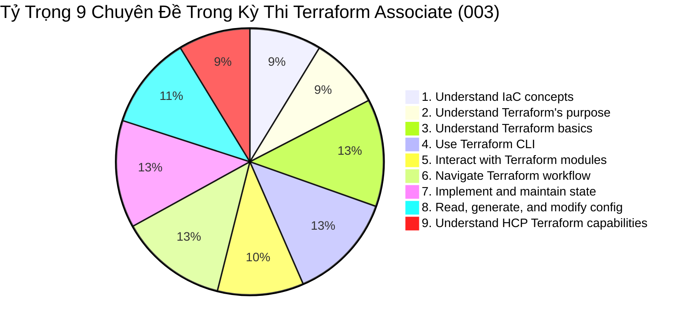
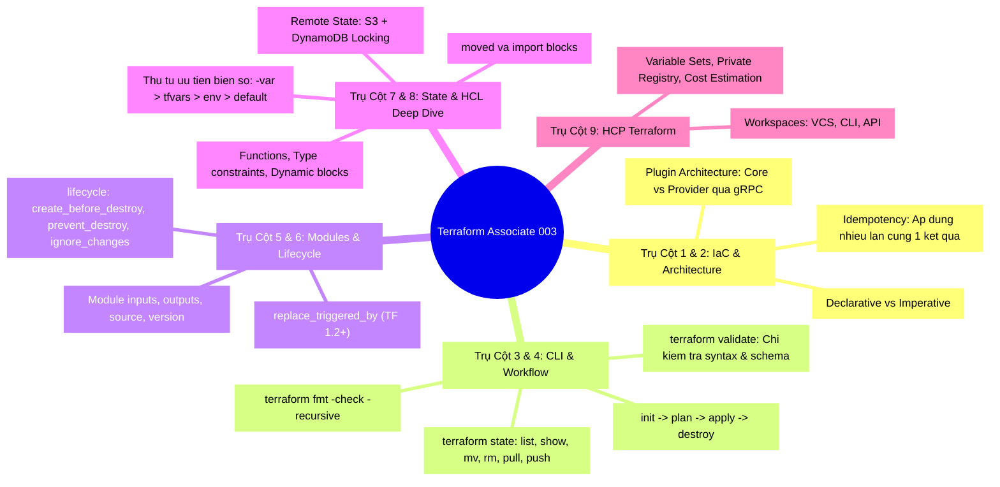
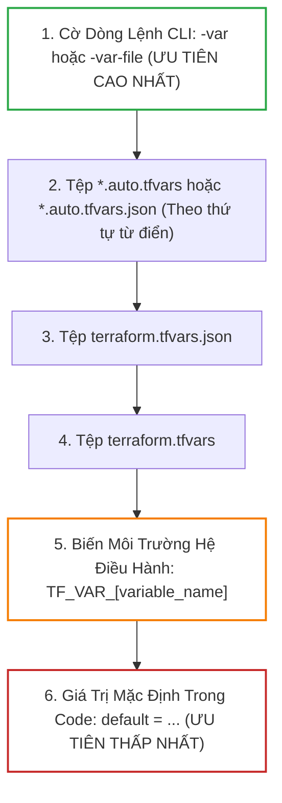
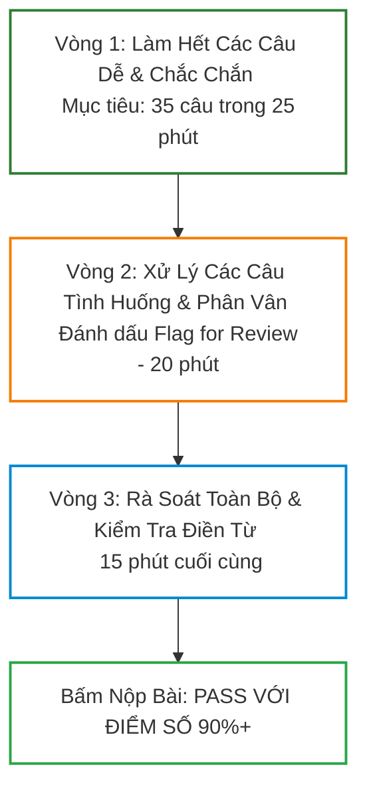


# Tổng Ôn và Bí Kíp Chinh Phục Chứng Chỉ Terraform Associate (003)

Chứng chỉ **HashiCorp Certified: Terraform Associate (003)** là một trong những chứng chỉ nghề nghiệp danh giá và được săn đón hàng đầu trong ngành công nghiệp Cloud & DevOps toàn cầu. Sở hữu chứng chỉ này không chỉ là bằng chứng khẳng định năng lực chuyên môn của bạn về Infrastructure as Code (IaC), mà còn mở ra những cơ hội thăng tiến vượt bậc với mức đãi ngộ hấp dẫn tại các tập đoàn công nghệ lớn.

Tuy nhiên, kỳ thi phiên bản **003** đã được HashiCorp nâng cấp toàn diện với nhiều câu hỏi tình huống thực tế hóc búa, tập trung sâu vào các tính năng hiện đại (như Terraform 1.3+ structural types, khối `moved`, `import` khai báo, `terraform test`, HCP Terraform Workspaces, và các câu hỏi bẫy về thứ tự ưu tiên của biến số).

Bài viết này được thiết kế như một **Khóa Huấn Luyện Cấp Tốc (Crash Course)**: hệ thống hóa trọn vẹn 9 chuyên đề thi cốt lõi, mổ xẻ các cạm bẫy thường gặp trong đề thi thật, hướng dẫn chiến lược làm bài thi trực tuyến và cung cấp **Bộ đề thi mô phỏng 25 câu hỏi độc quyền** sát đề thi 100% kèm phân tích đáp án chi tiết.

---

## 1. Cấu Trúc Đề Thi & 9 Chuyên Đề Cốt Lõi (Exam Objectives)

### 1.1. Thông Tin Tổng Quan Về Kỳ Thi
- **Mã kỳ thi**: `TA-003` (Terraform Associate 003).
- **Hình thức thi**: Trắc nghiệm trực tuyến có giám thị (Online Proctored qua PSI / Webassessor).
- **Thời gian làm bài**: **60 phút**.
- **Số lượng câu hỏi**: **45 - 57 câu** (Bao gồm Multiple Choice, Multiple Select, và Fill-in-the-blank điền từ vào chỗ trống).
- **Điểm đạt (Passing Score)**: Thường khoảng **70% - 75%** trở lên.
- **Thời hạn hiệu lực**: **2 năm**.

---

## 2. Hệ Thống Hóa 9 Trụ Cột Kiến Thức Trọng Tâm

---

## 3. Bảng Thứ Tự Ưu Tiên Biến Số (Variable Precedence) - Câu Hỏi Chắc Chắn Xuất Hiện!

Một trong những câu hỏi bẫy kinh điển nhất trong phòng thi là xác định giá trị cuối cùng của biến số khi được khai báo ở nhiều nơi.

> [!IMPORTANT]
> **Quy Tắc Vàng Cần Nhớ**:
> **CLI Flag `-var` > `*.auto.tfvars` > `terraform.tfvars` > `TF_VAR_*` > `default`**.
> Nếu đề thi hỏi biến môi trường `TF_VAR_region="us-west-1"` có ghi đè được file `terraform.tfvars` có giá trị `"ap-southeast-1"` không? Câu trả lời dứt khoát là **KHÔNG**! File `terraform.tfvars` luôn có độ ưu tiên cao hơn biến môi trường!

---

## 4. Phân Tích 5 Cạm Bẫy Đề Thi Kinh Điển (Trap Analysis)

### Bẫy 1: Sự Khác Biệt Giữa `terraform fmt` và `terraform validate`
- **Đề bài thường hỏi**: *"Lệnh nào dùng để kiểm tra xem cấu hình có đúng cú pháp HCL và schema thuộc tính không?"*
- **Bẫy**: Nhiều thí sinh chọn `terraform fmt`.
- **Sự thật**: 
  - `terraform fmt`: Chỉ định dạng lại code (thụt lề khoảng trắng, căn lề dấu bằng `=`). Nó **không kiểm tra tính đúng đắn của logic**.
  - `terraform validate`: Kiểm tra cú pháp HCL và đối chiếu với Provider Schema (xem thuộc tính có tồn tại không). Nó **yêu cầu phải chạy `terraform init` trước**.

### Bẫy 2: `terraform refresh` có làm thay đổi hạ tầng thực tế trên Cloud không?
- **Đề bài thường hỏi**: *"Lệnh `terraform refresh` sẽ cập nhật Cloud theo State hay cập nhật State theo Cloud?"*
- **Sự thật**: `terraform refresh` (hoặc `terraform apply -refresh-only`) **CHỈ ĐỌC DỮ LIỆU TỪ CLOUD ĐỂ CẬP NHẬT VÀO STATE FILE**. Nó **tuyệt đối không làm thay đổi hay tạo/xóa bất kỳ tài nguyên nào trên Cloud**!

### Bẫy 3: Biến Môi Trường Bật Debug Log
- **Câu hỏi điền từ (Fill-in-the-blank)**: *"Biến môi trường nào được sử dụng để thiết lập mức độ chi tiết của nhật ký ghi log trong Terraform?"*
- **Đáp án chính xác**: **`TF_LOG`** (Các giá trị hợp lệ: `TRACE`, `DEBUG`, `INFO`, `WARN`, `ERROR`, `OFF`).
- **Biến chỉ định đường dẫn file log**: **`TF_LOG_PATH`**.

### Bẫy 4: Module Source và Tự Động Tải Plugin
- **Đề bài thường hỏi**: *"Khi bạn thêm một module mới vào file `main.tf`, bạn cần chạy lệnh nào để Terraform tải module đó về?"*
- **Sự thật**: Bắt buộc phải chạy **`terraform init`** (hoặc `terraform get`). Lệnh `terraform plan` sẽ bị lỗi nếu module mới chưa được khởi tạo.

### Bẫy 5: `prevent_destroy` có bảo vệ tài nguyên khi chạy `terraform destroy` không?
- **Sự thật**: **CÓ**. Nếu bất kỳ tài nguyên nào trong State có `lifecycle { prevent_destroy = true }`, lệnh `terraform destroy` sẽ bị chặn đứng ngay lập tức và ném ra lỗi Fatal Error.

---

## 5. Bộ Đề Thi Thử Nghiệm 25 Câu Sát Đề Thi Thật (kèm Lời Giải Chi Tiết)

  

    <svg width="14" height="14" fill="none" stroke="currentColor" stroke-width="2" viewBox="0 0 24 24"><path d="M22 11.08V12a10 10 0 1 1-5.93-9.14"></path><polyline points="22 4 12 14.01 9 11.01"></polyline></svg>
    Phân Tích &amp; Lời Giải Kỹ Thuật
  

  
<b style="color: var(--accent-primary);">Đáp án đúng: B</b>
<b style="color: var(--accent-primary);">Giải thích</b>: <code>terraform validate</code> kiểm tra cú pháp HCL và tính hợp lệ của các thuộc tính schema cục bộ dựa trên các plugin provider đã tải về trong thư mục <code>.terraform/</code>, không cần gửi yêu cầu mạng đến Cloud API.

---

  

    <svg width="14" height="14" fill="none" stroke="currentColor" stroke-width="2" viewBox="0 0 24 24"><path d="M22 11.08V12a10 10 0 1 1-5.93-9.14"></path><polyline points="22 4 12 14.01 9 11.01"></polyline></svg>
    Phân Tích &amp; Lời Giải Kỹ Thuật
  

  
<b style="color: var(--accent-primary);">Đáp án đúng: D</b>
<b style="color: var(--accent-primary);">Giải thích</b>: Cờ dòng lệnh <code>-var</code> có mức độ ưu tiên cao nhất trong toàn bộ hệ thống phân cấp biến số của Terraform.

---

  

    <svg width="14" height="14" fill="none" stroke="currentColor" stroke-width="2" viewBox="0 0 24 24"><path d="M22 11.08V12a10 10 0 1 1-5.93-9.14"></path><polyline points="22 4 12 14.01 9 11.01"></polyline></svg>
    Phân Tích &amp; Lời Giải Kỹ Thuật
  

  
<b style="color: var(--accent-primary);">Đáp án đúng: B</b>
<b style="color: var(--accent-primary);">Giải thích</b>: S3 Remote Backend sử dụng bảng DynamoDB (với Partition Key là <code>LockID</code>) để thực hiện cơ chế Distributed State Locking.

---

  

    <svg width="14" height="14" fill="none" stroke="currentColor" stroke-width="2" viewBox="0 0 24 24"><path d="M22 11.08V12a10 10 0 1 1-5.93-9.14"></path><polyline points="22 4 12 14.01 9 11.01"></polyline></svg>
    Phân Tích &amp; Lời Giải Kỹ Thuật
  

  
<b style="color: var(--accent-primary);">Đáp án đúng: TRACE</b> (hoặc <code>trace</code>)
<b style="color: var(--accent-primary);">Giải thích</b>: <code>TRACE</code> là mức độ log chi tiết nhất của Terraform, ghi nhận toàn bộ payload HTTP request/response và các bước phân tích đồ thị DAG.

---

  

    <svg width="14" height="14" fill="none" stroke="currentColor" stroke-width="2" viewBox="0 0 24 24"><path d="M22 11.08V12a10 10 0 1 1-5.93-9.14"></path><polyline points="22 4 12 14.01 9 11.01"></polyline></svg>
    Phân Tích &amp; Lời Giải Kỹ Thuật
  

  
<b style="color: var(--accent-primary);">Đáp án đúng: B và C</b>
<b style="color: var(--accent-primary);">Giải thích</b>: Cả khối khai báo <code>moved</code> (Terraform 1.1+) và lệnh CLI <code>terraform state mv</code> đều thực hiện việc cập nhật lại địa chỉ định danh của tài nguyên trong State file mà không gửi lệnh hủy tài nguyên lên Cloud.

---

  

    <svg width="14" height="14" fill="none" stroke="currentColor" stroke-width="2" viewBox="0 0 24 24"><path d="M22 11.08V12a10 10 0 1 1-5.93-9.14"></path><polyline points="22 4 12 14.01 9 11.01"></polyline></svg>
    Phân Tích &amp; Lời Giải Kỹ Thuật
  

  
<b style="color: var(--accent-primary);">Đáp án đúng: B</b>
<b style="color: var(--accent-primary);">Giải thích</b>: <code>Idempotency</code> (Tính bất biến / Tính lũy đẳng) là nguyên lý cốt lõi: Áp dụng một cấu hình N lần sẽ tạo ra kết quả giống hệt như áp dụng 1 lần duy nhất nếu không có sự thay đổi trong code.

---

  

    <svg width="14" height="14" fill="none" stroke="currentColor" stroke-width="2" viewBox="0 0 24 24"><path d="M22 11.08V12a10 10 0 1 1-5.93-9.14"></path><polyline points="22 4 12 14.01 9 11.01"></polyline></svg>
    Phân Tích &amp; Lời Giải Kỹ Thuật
  

  
<b style="color: var(--accent-primary);">Đáp án đúng: B</b>
<b style="color: var(--accent-primary);">Giải thích</b>: Provisioners chạy shell script mệnh lệnh (Imperative), Terraform không thể theo dõi trạng thái thay đổi bên trong máy chủ, và nếu script lỗi thì máy chủ bị taint, buộc phải tạo lại ở lần apply sau.

---

  

    <svg width="14" height="14" fill="none" stroke="currentColor" stroke-width="2" viewBox="0 0 24 24"><path d="M22 11.08V12a10 10 0 1 1-5.93-9.14"></path><polyline points="22 4 12 14.01 9 11.01"></polyline></svg>
    Phân Tích &amp; Lời Giải Kỹ Thuật
  

  
<b style="color: var(--accent-primary);">Đáp án đúng: B</b>
<b style="color: var(--accent-primary);">Giải thích</b>: Variable Sets cho phép quản lý tập trung các biến số môi trường và bí mật, sau đó áp dụng cho toàn bộ Organization hoặc các Workspaces được chỉ định.

---

  

    <svg width="14" height="14" fill="none" stroke="currentColor" stroke-width="2" viewBox="0 0 24 24"><path d="M22 11.08V12a10 10 0 1 1-5.93-9.14"></path><polyline points="22 4 12 14.01 9 11.01"></polyline></svg>
    Phân Tích &amp; Lời Giải Kỹ Thuật
  

  
<b style="color: var(--accent-primary);">Đáp án đúng: B</b>
<b style="color: var(--accent-primary);">Giải thích</b>: Cấu trúc <code><NAMESPACE>/<NAME>/<PROVIDER></code> là định dạng chuẩn để kéo module trực tiếp từ Terraform Public Registry.

---

  

    <svg width="14" height="14" fill="none" stroke="currentColor" stroke-width="2" viewBox="0 0 24 24"><path d="M22 11.08V12a10 10 0 1 1-5.93-9.14"></path><polyline points="22 4 12 14.01 9 11.01"></polyline></svg>
    Phân Tích &amp; Lời Giải Kỹ Thuật
  

  
<b style="color: var(--accent-primary);">Đáp án đúng: B</b>
<b style="color: var(--accent-primary);">Giải thích</b>: Với các phụ thuộc tường minh qua biến (<code>aws_vpc.main.id</code>), Terraform tự động dựng DAG. <code>depends_on</code> chỉ được dùng cho các phụ thuộc ẩn (Implicit/Hidden dependencies) mà HCL không thể tự suy diễn.

---

  

    <svg width="14" height="14" fill="none" stroke="currentColor" stroke-width="2" viewBox="0 0 24 24"><path d="M22 11.08V12a10 10 0 1 1-5.93-9.14"></path><polyline points="22 4 12 14.01 9 11.01"></polyline></svg>
    Phân Tích &amp; Lời Giải Kỹ Thuật
  

  
<b style="color: var(--accent-primary);">Đáp án đúng: C</b>
<b style="color: var(--accent-primary);">Giải thích</b>: <code>prevent_destroy = true</code> sẽ từ chối bất kỳ kế hoạch nào có chứa hành động hủy tài nguyên.

---

  

    <svg width="14" height="14" fill="none" stroke="currentColor" stroke-width="2" viewBox="0 0 24 24"><path d="M22 11.08V12a10 10 0 1 1-5.93-9.14"></path><polyline points="22 4 12 14.01 9 11.01"></polyline></svg>
    Phân Tích &amp; Lời Giải Kỹ Thuật
  

  
<b style="color: var(--accent-primary);">Đáp án đúng: B</b>
<b style="color: var(--accent-primary);">Giải thích</b>: <code>terraform state list</code> in ra danh sách đầy đủ địa chỉ của tất cả các resources và data sources trong State.

---

  

    <svg width="14" height="14" fill="none" stroke="currentColor" stroke-width="2" viewBox="0 0 24 24"><path d="M22 11.08V12a10 10 0 1 1-5.93-9.14"></path><polyline points="22 4 12 14.01 9 11.01"></polyline></svg>
    Phân Tích &amp; Lời Giải Kỹ Thuật
  

  
<b style="color: var(--accent-primary);">Đáp án đúng: A</b>
<b style="color: var(--accent-primary);">Giải thích</b>: <code>alias</code> cho phép khởi tạo nhiều thực thể Provider khác nhau của cùng một Cloud Provider.

---

  

    <svg width="14" height="14" fill="none" stroke="currentColor" stroke-width="2" viewBox="0 0 24 24"><path d="M22 11.08V12a10 10 0 1 1-5.93-9.14"></path><polyline points="22 4 12 14.01 9 11.01"></polyline></svg>
    Phân Tích &amp; Lời Giải Kỹ Thuật
  

  
<b style="color: var(--accent-primary);">Đáp án đúng: B</b>
<b style="color: var(--accent-primary);">Giải thích</b>: Data sources là các khối truy vấn dữ liệu chỉ đọc (Read-only), không tạo ra hay quản lý vòng đời tài nguyên.

---

  

    <svg width="14" height="14" fill="none" stroke="currentColor" stroke-width="2" viewBox="0 0 24 24"><path d="M22 11.08V12a10 10 0 1 1-5.93-9.14"></path><polyline points="22 4 12 14.01 9 11.01"></polyline></svg>
    Phân Tích &amp; Lời Giải Kỹ Thuật
  

  
<b style="color: var(--accent-primary);">Đáp án đúng: A</b>
<b style="color: var(--accent-primary);">Giải thích</b>: HCL sử dụng cú pháp toán tử 3 ngôi chuẩn: <code>condition ? true_val : false_val</code>.

---

  

    <svg width="14" height="14" fill="none" stroke="currentColor" stroke-width="2" viewBox="0 0 24 24"><path d="M22 11.08V12a10 10 0 1 1-5.93-9.14"></path><polyline points="22 4 12 14.01 9 11.01"></polyline></svg>
    Phân Tích &amp; Lời Giải Kỹ Thuật
  

  
<b style="color: var(--accent-primary);">Đáp án đúng: key</b>
<b style="color: var(--accent-primary);">Giải thích</b>: Tham số <code>key</code> trong khối cấu hình <code>backend "s3"</code> định nghĩa đường dẫn S3 Object Key (ví dụ: <code>key = "prod/network/terraform.tfstate"</code>).

---

  

    <svg width="14" height="14" fill="none" stroke="currentColor" stroke-width="2" viewBox="0 0 24 24"><path d="M22 11.08V12a10 10 0 1 1-5.93-9.14"></path><polyline points="22 4 12 14.01 9 11.01"></polyline></svg>
    Phân Tích &amp; Lời Giải Kỹ Thuật
  

  
<b style="color: var(--accent-primary);">Đáp án đúng: B</b>
<b style="color: var(--accent-primary);">Giải thích</b>: Cú pháp <code>optional(type, default_value)</code> cho phép tạo thuộc tính tùy chọn với giá trị mặc định bên trong structural object types.

---

  

    <svg width="14" height="14" fill="none" stroke="currentColor" stroke-width="2" viewBox="0 0 24 24"><path d="M22 11.08V12a10 10 0 1 1-5.93-9.14"></path><polyline points="22 4 12 14.01 9 11.01"></polyline></svg>
    Phân Tích &amp; Lời Giải Kỹ Thuật
  

  
<b style="color: var(--accent-primary);">Đáp án đúng: B</b>
<b style="color: var(--accent-primary);">Giải thích</b>: Terraform test engine tự động tìm kiếm các tệp có đuôi <code>.tftest.hcl</code> hoặc <code>.tftest.json</code> trong thư mục <code>tests/</code>.

---

  

    <svg width="14" height="14" fill="none" stroke="currentColor" stroke-width="2" viewBox="0 0 24 24"><path d="M22 11.08V12a10 10 0 1 1-5.93-9.14"></path><polyline points="22 4 12 14.01 9 11.01"></polyline></svg>
    Phân Tích &amp; Lời Giải Kỹ Thuật
  

  
<b style="color: var(--accent-primary);">Đáp án đúng: B</b>
<b style="color: var(--accent-primary);">Giải thích</b>: VCS-driven Workspace tích hợp trực tiếp qua Webhooks với các hệ thống Git (GitHub, GitLab) để tự động hóa kiểm tra PR.

---

  

    <svg width="14" height="14" fill="none" stroke="currentColor" stroke-width="2" viewBox="0 0 24 24"><path d="M22 11.08V12a10 10 0 1 1-5.93-9.14"></path><polyline points="22 4 12 14.01 9 11.01"></polyline></svg>
    Phân Tích &amp; Lời Giải Kỹ Thuật
  

  
<b style="color: var(--accent-primary);">Đáp án đúng: B</b>
<b style="color: var(--accent-primary);">Giải thích</b>: <code>terraform force-unlock <LOCK_ID></code> là lệnh chuẩn để gỡ bỏ Distributed State Lock bị kẹt.

---

  

    <svg width="14" height="14" fill="none" stroke="currentColor" stroke-width="2" viewBox="0 0 24 24"><path d="M22 11.08V12a10 10 0 1 1-5.93-9.14"></path><polyline points="22 4 12 14.01 9 11.01"></polyline></svg>
    Phân Tích &amp; Lời Giải Kỹ Thuật
  

  
<b style="color: var(--accent-primary);">Đáp án đúng: B</b>
<b style="color: var(--accent-primary);">Giải thích</b>: <code>soft-mandatory</code> sẽ chặn pipeline nhưng cho phép người có quyền quản trị (Admin/Lead) thực hiện hành động Override để tiếp tục apply.

---

  

    <svg width="14" height="14" fill="none" stroke="currentColor" stroke-width="2" viewBox="0 0 24 24"><path d="M22 11.08V12a10 10 0 1 1-5.93-9.14"></path><polyline points="22 4 12 14.01 9 11.01"></polyline></svg>
    Phân Tích &amp; Lời Giải Kỹ Thuật
  

  
<b style="color: var(--accent-primary);">Đáp án đúng: B</b>
<b style="color: var(--accent-primary);">Giải thích</b>: Toán tử Pessimistic constraint <code>~> 2.1.0</code> chỉ cho phép cập nhật chữ số cuối cùng bên phải (Patch version: <code>>= 2.1.0</code> và <code>< 2.2.0</code>).

---

  

    <svg width="14" height="14" fill="none" stroke="currentColor" stroke-width="2" viewBox="0 0 24 24"><path d="M22 11.08V12a10 10 0 1 1-5.93-9.14"></path><polyline points="22 4 12 14.01 9 11.01"></polyline></svg>
    Phân Tích &amp; Lời Giải Kỹ Thuật
  

  
<b style="color: var(--accent-primary);">Đáp án đúng: B</b>
<b style="color: var(--accent-primary);">Giải thích</b>: <code>sensitive = true</code> chỉ có tác dụng ở tầng giao diện hiển thị CLI/Logs, dữ liệu vẫn được lưu trữ nguyên vẹn dưới dạng plaintext trong State file.

---

  

    <svg width="14" height="14" fill="none" stroke="currentColor" stroke-width="2" viewBox="0 0 24 24"><path d="M22 11.08V12a10 10 0 1 1-5.93-9.14"></path><polyline points="22 4 12 14.01 9 11.01"></polyline></svg>
    Phân Tích &amp; Lời Giải Kỹ Thuật
  

  
<b style="color: var(--accent-primary);">Đáp án đúng: C</b>
<b style="color: var(--accent-primary);">Giải thích</b>: Khối <code>moved</code> chính thức ra mắt từ phiên bản <b style="color: var(--accent-primary);">Terraform 1.1+</b>.

---

  

    <svg width="14" height="14" fill="none" stroke="currentColor" stroke-width="2" viewBox="0 0 24 24"><path d="M22 11.08V12a10 10 0 1 1-5.93-9.14"></path><polyline points="22 4 12 14.01 9 11.01"></polyline></svg>
    Phân Tích &amp; Lời Giải Kỹ Thuật
  

  
<b style="color: var(--accent-primary);">Đáp án đúng: A</b>
<b style="color: var(--accent-primary);">Giải thích</b>: Khối <code>cloud { organization = ... workspaces { ... } }</code> là tiêu chuẩn hiện đại để tích hợp với HCP Terraform.

---

## 6. Chiến Lược Làm Bài Thi Trực Tuyến Đạt Điểm Cao

### 3 Lời Khuyên Vàng Trong Phòng Thi:
1. **Quản trị thời gian (Time Management)**: Bạn có 60 phút cho ~50 câu hỏi, tương đương **khoảng 1 phút 10 giây cho mỗi câu**. Đừng bao giờ dừng lại quá 2 phút ở một câu hỏi khó. Hãy chọn tạm một đáp án khả dĩ nhất, bấm nút **"Flag for Review"** và đi tiếp!
2. **Kỹ thuật loại trừ (Elimination Technique)**: Mỗi câu hỏi trắc nghiệm thường có 2 đáp án sai ngớ ngẩn (chứa các lệnh hoặc cú pháp không hề tồn tại trong Terraform, ví dụ: `terraform update` hay `terraform state delete`). Hãy gạch bỏ chúng trước để tăng tỷ lệ chọn đúng lên 50%.
3. **Cẩn thận với câu hỏi điền từ**: Kiểm tra kỹ lỗi chính tả (Spelling). Viết đúng chữ thường/chữ hoa theo quy ước CLI (ví dụ: `terraform.tfstate`, `TF_LOG`, `local-exec`).

---

## 7. Tổng Kết & Lộ Trình Về Đích

- **Bản lĩnh phòng thi**: Tự tin vào nền tảng thực chiến đã tích lũy qua 28 bài học chuyên sâu trước đó.
- **Tài liệu ôn tập cốt lõi**: Xem lại bảng thứ tự ưu tiên biến số, các câu lệnh State CLI (`mv`, `rm`, `pull`, `push`), và các meta-arguments trong khối `lifecycle`.
- **Bước tiếp theo**: Trong [Bài 30: Capstone Project: Xây Dựng Nền Tảng Hạ Tầng Enterprise Đa Tầng End-to-End](./30-capstone-xay-dung-nen-tang-ha-tang-enterprise-da-tang-end-to-end.md), chúng ta sẽ bước vào trận đánh lớn cuối cùng: Tự tay hiện thực hóa toàn bộ các kỹ thuật đã học vào một đồ án tốt nghiệp Capstone Project quy mô lớn chuẩn Production!

