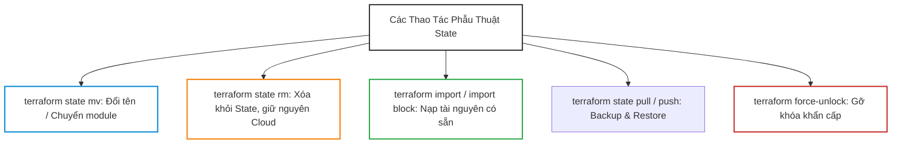
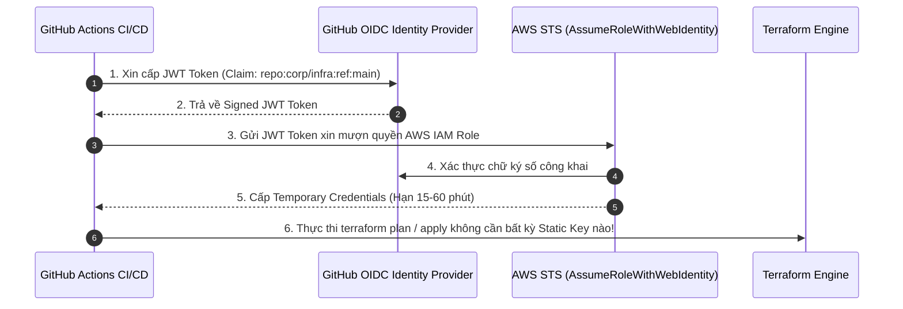
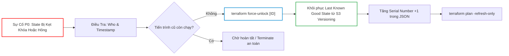
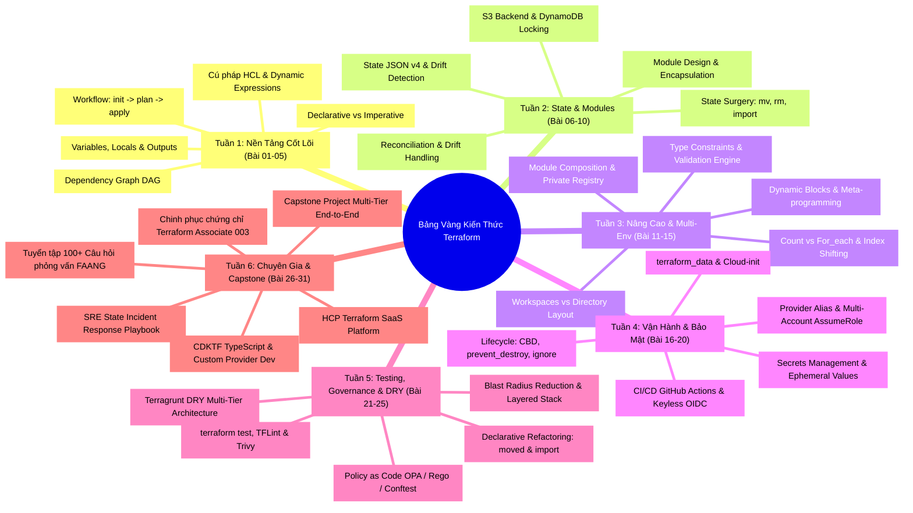


# Tuyển Tập 100+ Câu Hỏi Phỏng Vấn Terraform & DevOps Chuyên Sâu (30 Buổi)

Trong các buổi phỏng vấn kỹ thuật cho vị trí **Senior DevOps Engineer**, **Cloud Platform Lead** hay **Principal Infrastructure Architect**, Terraform luôn là một trong những chủ đề trọng tâm chiếm thời lượng lớn nhất. Người phỏng vấn tại các tập đoàn công nghệ lớn (FAANG / Big Tech / Fintech Unicorns) sẽ không chỉ hỏi các câu hỏi lý thuyết cơ bản (như "Terraform là gì?" hay "Kể tên các lệnh CLI"), mà họ sẽ đưa bạn vào những **tình huống sự cố nghẹt thở (Scenario-based & War-room Incidents)**:
- *Làm thế nào để xử lý khi State file bị race condition và ghi đè mất dữ liệu trên Production?*
- *Giải thích bản chất tại sao việc dùng `count` với danh sách tài nguyên lại có thể gây ra thảm họa Index Shifting?*
- *Làm thế nào để tái cấu trúc một codebase Monolith 3,000 tài nguyên thành Micro-states mà không gây 1 giây gián đoạn dịch vụ?*

Để giúp bạn hoàn toàn làm chủ và tự tin tỏa sáng trước bất kỳ hội đồng tuyển dụng khó tính nào, bài viết này tổng hợp và phân tích **100+ câu hỏi phỏng vấn chuyên sâu nhất**, chia thành **6 Cấp Độ Kỹ Năng** từ nền tảng đến kiến trúc sư tối cao.

---

## 1. Cấp Độ 1: Kiến Trúc Lõi, HCL & Workflow Cơ Bản (Junior -> Mid)

<details class="qa-card">
<summary class="qa-summary">
  <div class="qa-summary-left">
    <span class="qa-num-badge">Q01</span>
    <span>Giải thích sự khác biệt bản chất giữa mô hình Declarative (Khai báo) của Terraform và Imperative (Mệnh lệnh) của Ansible / Bash Script?</span>
  </div>
  <span class="qa-chevron">
    <svg width="18" height="18" fill="none" stroke="currentColor" stroke-width="2.5" viewBox="0 0 24 24"><polyline points="6 9 12 15 18 9"></polyline></svg>
  </span>
</summary>
<div class="qa-answer">
  <div class="qa-answer-header">
    <svg width="14" height="14" fill="none" stroke="currentColor" stroke-width="2" viewBox="0 0 24 24"><path d="M22 11.08V12a10 10 0 1 1-5.93-9.14"></path><polyline points="22 4 12 14.01 9 11.01"></polyline></svg>
    <span>Phân Tích &amp; Lời Giải Kỹ Thuật</span>
  </div>
  : 
  - **Declarative (Terraform)**: Bạn chỉ cần khai báo **Trạng thái mong muốn cuối cùng (Desired State)** của hạ tầng (ví dụ: "Tôi muốn có đúng 3 máy chủ web"). Terraform Core Engine sẽ tự động so sánh trạng thái mong muốn với trạng thái thực tế hiện có (Current State) và tự động tính toán chuỗi hành động tối thiểu cần làm (Diff) để đạt được đích.
  - **Imperative (Ansible / Script)**: Bạn phải viết từng dòng lệnh hướng dẫn máy tính **Các bước thực hiện cụ thể từng bước một (Step-by-step instructions)** (ví dụ: "Kiểm tra máy chủ 1, nếu chưa có thì tải gói A, sau đó chạy lệnh B"). Nếu script không được viết cẩn thận, việc chạy lại nhiều lần sẽ dễ gây lỗi trùng lặp.
</div>
</details>

<details class="qa-card">
<summary class="qa-summary">
  <div class="qa-summary-left">
    <span class="qa-num-badge">Q02</span>
    <span>Quá trình "Two-Phase Execution" (Khởi tạo 2 giai đoạn) của Terraform diễn ra như thế nào?</span>
  </div>
  <span class="qa-chevron">
    <svg width="18" height="18" fill="none" stroke="currentColor" stroke-width="2.5" viewBox="0 0 24 24"><polyline points="6 9 12 15 18 9"></polyline></svg>
  </span>
</summary>
<div class="qa-answer">
  <div class="qa-answer-header">
    <svg width="14" height="14" fill="none" stroke="currentColor" stroke-width="2" viewBox="0 0 24 24"><path d="M22 11.08V12a10 10 0 1 1-5.93-9.14"></path><polyline points="22 4 12 14.01 9 11.01"></polyline></svg>
    <span>Phân Tích &amp; Lời Giải Kỹ Thuật</span>
  </div>
  : Gồm 2 giai đoạn tách biệt:
  1. **Plan Phase (Giai đoạn Lập kế hoạch)**: Đọc cấu hình HCL, tải State file hiện tại, gửi API đọc trạng thái thực tế trên Cloud (State Refresh), dựng đồ thị phụ thuộc (DAG), và xuất ra bản kế hoạch chi tiết (Plan Diff: Add, Change, Destroy) mà không làm thay đổi bất kỳ tài nguyên nào.
  2. **Apply Phase (Giai đoạn Thực thi)**: Chỉ thực thi chính xác những hành động đã được phê duyệt trong bản Plan, gửi các lệnh HTTP REST API tới Cloud Provider, và ghi nhận ID mới vào State file.
</div>
</details>

<details class="qa-card">
<summary class="qa-summary">
  <div class="qa-summary-left">
    <span class="qa-num-badge">Q03</span>
    <span>Tệp `terraform.lock.hcl` có vai trò gì và tại sao bắt buộc phải commit vào Git?</span>
  </div>
  <span class="qa-chevron">
    <svg width="18" height="18" fill="none" stroke="currentColor" stroke-width="2.5" viewBox="0 0 24 24"><polyline points="6 9 12 15 18 9"></polyline></svg>
  </span>
</summary>
<div class="qa-answer">
  <div class="qa-answer-header">
    <svg width="14" height="14" fill="none" stroke="currentColor" stroke-width="2" viewBox="0 0 24 24"><path d="M22 11.08V12a10 10 0 1 1-5.93-9.14"></path><polyline points="22 4 12 14.01 9 11.01"></polyline></svg>
    <span>Phân Tích &amp; Lời Giải Kỹ Thuật</span>
  </div>
  : `terraform.lock.hcl` (Dependency Lock File) lưu trữ phiên bản chính xác và mã băm cryptographic checksums (hashes) của các Provider Plugins đã được tải về. Việc commit file này vào Git đảm bảo **tính nhất quán 100% (Reproducibility)** giữa máy tính cá nhân của tất cả các kỹ sư trong đội ngũ và các máy chủ CI/CD Runners, ngăn chặn nguy cơ tự động tải phải một phiên bản Provider mới có chứa breaking changes hoặc mã độc.
</div>
</details>

<details class="qa-card">
<summary class="qa-summary">
  <div class="qa-summary-left">
    <span class="qa-num-badge">Q04</span>
    <span>Đồ thị DAG (Directed Acyclic Graph) trong Terraform hoạt động như thế nào để tối ưu hóa tốc độ provisioning?</span>
  </div>
  <span class="qa-chevron">
    <svg width="18" height="18" fill="none" stroke="currentColor" stroke-width="2.5" viewBox="0 0 24 24"><polyline points="6 9 12 15 18 9"></polyline></svg>
  </span>
</summary>
<div class="qa-answer">
  <div class="qa-answer-header">
    <svg width="14" height="14" fill="none" stroke="currentColor" stroke-width="2" viewBox="0 0 24 24"><path d="M22 11.08V12a10 10 0 1 1-5.93-9.14"></path><polyline points="22 4 12 14.01 9 11.01"></polyline></svg>
    <span>Phân Tích &amp; Lời Giải Kỹ Thuật</span>
  </div>
  : Terraform phân tích các tham chiếu giữa các tài nguyên (ví dụ: `aws_instance.web` cần `aws_security_group.sg.id`) để dựng nên một cây đồ thị có hướng không chu trình (DAG). Những tài nguyên không phụ thuộc lẫn nhau (ví dụ: 10 S3 Buckets độc lập) sẽ được Terraform kích hoạt tạo **song song đồng thời (Parallel Concurrency, mặc định 10 workers)**, giúp rút ngắn thời gian khởi tạo toàn bộ hạ tầng.
</div>
</details>

<details class="qa-card">
<summary class="qa-summary">
  <div class="qa-summary-left">
    <span class="qa-num-badge">Q05</span>
    <span>Phân biệt sự khác nhau giữa `variable`, `local`, và `output` trong HCL?</span>
  </div>
  <span class="qa-chevron">
    <svg width="18" height="18" fill="none" stroke="currentColor" stroke-width="2.5" viewBox="0 0 24 24"><polyline points="6 9 12 15 18 9"></polyline></svg>
  </span>
</summary>
<div class="qa-answer">
  <div class="qa-answer-header">
    <svg width="14" height="14" fill="none" stroke="currentColor" stroke-width="2" viewBox="0 0 24 24"><path d="M22 11.08V12a10 10 0 1 1-5.93-9.14"></path><polyline points="22 4 12 14.01 9 11.01"></polyline></svg>
    <span>Phân Tích &amp; Lời Giải Kỹ Thuật</span>
  </div>
  :
  - `variable` (Input Variables): Đóng vai trò như các tham số truyền vào hàm (Function Arguments), cho phép người dùng bên ngoài tùy biến cấu hình khi gọi module.
  - `local` (Local Values): Đóng vai trò như các biến nội bộ (Internal Constants / Calculated Expressions), giúp đặt tên cho các biểu thức tính toán phức tạp để tránh lặp code trong module.
  - `output` (Output Values): Đóng vai trò như giá trị trả về của hàm (Return Values), cho phép xuất dữ liệu ra màn hình CLI hoặc truyền dữ liệu cho các module khác sử dụng.
</div>
</details>

<details class="qa-card">
<summary class="qa-summary">
  <div class="qa-summary-left">
    <span class="qa-num-badge">Q06</span>
    <span>terraform init` thực hiện những tác vụ gì dưới nền tảng?</span>
  </div>
  <span class="qa-chevron">
    <svg width="18" height="18" fill="none" stroke="currentColor" stroke-width="2.5" viewBox="0 0 24 24"><polyline points="6 9 12 15 18 9"></polyline></svg>
  </span>
</summary>
<div class="qa-answer">
  <div class="qa-answer-header">
    <svg width="14" height="14" fill="none" stroke="currentColor" stroke-width="2" viewBox="0 0 24 24"><path d="M22 11.08V12a10 10 0 1 1-5.93-9.14"></path><polyline points="22 4 12 14.01 9 11.01"></polyline></svg>
    <span>Phân Tích &amp; Lời Giải Kỹ Thuật</span>
  </div>
  : Khi chạy `terraform init`, Terraform thực hiện 4 tác vụ chính:
  1. Đọc và cấu hình Backend (Remote State storage).
  2. Tải các Child Modules từ Git/Registry vào thư mục `.terraform/modules/`.
  3. Tìm kiếm, tải và xác thực checksums của các Provider Plugins vào `.terraform/providers/`.
  4. Tạo hoặc cập nhật tệp khóa phụ thuộc `.terraform.lock.hcl`.
</div>
</details>

<details class="qa-card">
<summary class="qa-summary">
  <div class="qa-summary-left">
    <span class="qa-num-badge">Q07</span>
    <span>Sự khác nhau giữa `terraform.tfvars`, `*.auto.tfvars`, và cờ `-var` là gì?</span>
  </div>
  <span class="qa-chevron">
    <svg width="18" height="18" fill="none" stroke="currentColor" stroke-width="2.5" viewBox="0 0 24 24"><polyline points="6 9 12 15 18 9"></polyline></svg>
  </span>
</summary>
<div class="qa-answer">
  <div class="qa-answer-header">
    <svg width="14" height="14" fill="none" stroke="currentColor" stroke-width="2" viewBox="0 0 24 24"><path d="M22 11.08V12a10 10 0 1 1-5.93-9.14"></path><polyline points="22 4 12 14.01 9 11.01"></polyline></svg>
    <span>Phân Tích &amp; Lời Giải Kỹ Thuật</span>
  </div>
  :
  - `terraform.tfvars`: Tệp chứa giá trị biến mặc định tự động được nạp nếu tồn tại.
  - `*.auto.tfvars`: Bất kỳ tệp nào có đuôi này đều tự động được nạp và có độ ưu tiên cao hơn `terraform.tfvars`.
  - `-var "key=value"`: Cờ truyền trực tiếp từ dòng lệnh CLI, có độ ưu tiên cao nhất, ghi đè tất cả các tệp `.tfvars` và biến môi trường `TF_VAR_*`.

---
</div>
</details>

## 2. Cấp Độ 2: Quản Trị State & Phẫu Thuật Dữ Liệu Chuyên Sâu (Mid -> Senior)



<details class="qa-card">
<summary class="qa-summary">
  <div class="qa-summary-left">
    <span class="qa-num-badge">Q08</span>
    <span>Trình bày cấu trúc JSON bên trong của một tệp State file phiên bản 4 (`"version": 4`)?</span>
  </div>
  <span class="qa-chevron">
    <svg width="18" height="18" fill="none" stroke="currentColor" stroke-width="2.5" viewBox="0 0 24 24"><polyline points="6 9 12 15 18 9"></polyline></svg>
  </span>
</summary>
<div class="qa-answer">
  <div class="qa-answer-header">
    <svg width="14" height="14" fill="none" stroke="currentColor" stroke-width="2" viewBox="0 0 24 24"><path d="M22 11.08V12a10 10 0 1 1-5.93-9.14"></path><polyline points="22 4 12 14.01 9 11.01"></polyline></svg>
    <span>Phân Tích &amp; Lời Giải Kỹ Thuật</span>
  </div>
  : Tệp State JSON v4 bao gồm các trường cốt lõi:
  - `"version"`: Phiên bản schema của state file (hiện tại là 4).
  - `"terraform_version"`: Phiên bản Terraform CLI đã ghi state.
  - `"serial"`: Số nguyên tự động tăng sau mỗi lần apply thành công, dùng để chống xung đột phiên bản cũ/mới.
  - `"lineage"`: Chuỗi UUID duy nhất của state file để nhận diện dự án.
  - `"resources"`: Mảng chứa danh sách tất cả các tài nguyên được quản lý, bao gồm `mode` (managed/data), `type`, `name`, `provider`, và mảng `instances` chứa toàn bộ `attributes` (cả nhạy cảm lẫn công khai) và `dependencies`.
</div>
</details>

<details class="qa-card">
<summary class="qa-summary">
  <div class="qa-summary-left">
    <span class="qa-num-badge">Q09</span>
    <span>Tại sao việc sử dụng `count` để lặp danh sách tài nguyên lại tiềm ẩn rủi ro "Index Shifting" và cách khắc phục?</span>
  </div>
  <span class="qa-chevron">
    <svg width="18" height="18" fill="none" stroke="currentColor" stroke-width="2.5" viewBox="0 0 24 24"><polyline points="6 9 12 15 18 9"></polyline></svg>
  </span>
</summary>
<div class="qa-answer">
  <div class="qa-answer-header">
    <svg width="14" height="14" fill="none" stroke="currentColor" stroke-width="2" viewBox="0 0 24 24"><path d="M22 11.08V12a10 10 0 1 1-5.93-9.14"></path><polyline points="22 4 12 14.01 9 11.01"></polyline></svg>
    <span>Phân Tích &amp; Lời Giải Kỹ Thuật</span>
  </div>
  : 
  - Khi dùng `count = length(var.subnet_cidrs)` với mảng `["10.0.1.0/24", "10.0.2.0/24", "10.0.3.0/24"]`, Terraform định danh tài nguyên theo index số nguyên: `subnet[0]`, `subnet[1]`, `subnet[2]`.
  - Nếu bạn xóa phần tử ở giữa (`"10.0.2.0/24"`), phần tử thứ 3 sẽ bị đẩy lên vị trí index `[1]`.
  - Khi chạy `terraform apply`, Terraform hiểu rằng `subnet[1]` bị thay đổi thuộc tính CIDR -> **BUỘC PHẢI PHÁ HỦY VÀ TẠO LẠI TOÀN BỘ CÁC SUBNETS PHÍA SAU**, gây gián đoạn dịch vụ nghiêm trọng!
  - **Khắc phục**: Luôn sử dụng vòng lặp **`for_each`** với Map hoặc Set có khóa định danh chuỗi tĩnh (`toset(...)`), khi đó xóa một phần tử không làm ảnh hưởng đến các phần tử còn lại.
</div>
</details>

<details class="qa-card">
<summary class="qa-summary">
  <div class="qa-summary-left">
    <span class="qa-num-badge">Q10</span>
    <span>Khối `moved` (Terraform 1.1+) giải quyết triệt để bài toán Refactoring như thế nào so với lệnh `terraform state mv`?</span>
  </div>
  <span class="qa-chevron">
    <svg width="18" height="18" fill="none" stroke="currentColor" stroke-width="2.5" viewBox="0 0 24 24"><polyline points="6 9 12 15 18 9"></polyline></svg>
  </span>
</summary>
<div class="qa-answer">
  <div class="qa-answer-header">
    <svg width="14" height="14" fill="none" stroke="currentColor" stroke-width="2" viewBox="0 0 24 24"><path d="M22 11.08V12a10 10 0 1 1-5.93-9.14"></path><polyline points="22 4 12 14.01 9 11.01"></polyline></svg>
    <span>Phân Tích &amp; Lời Giải Kỹ Thuật</span>
  </div>
  : Lệnh `terraform state mv` là lệnh mệnh lệnh (Imperative CLI), đòi hỏi kỹ sư phải gõ thủ công trên terminal, dễ gõ sai tên, không thể lưu vết trên Git và không có cơ chế Peer Review qua Pull Request. Khối `moved { from = ... to = ... }` biến việc chuyển dịch State thành **Khai báo mã nguồn (Declarative)**: có thể commit vào Git, được CI/CD hiển thị trong `terraform plan` dưới dạng *"Resource has moved (0 to destroy)"*, và áp dụng đồng loạt an toàn trên mọi môi trường.
</div>
</details>

<details class="qa-card">
<summary class="qa-summary">
  <div class="qa-summary-left">
    <span class="qa-num-badge">Q11</span>
    <span>Làm thế nào để xóa một tài nguyên ra khỏi quyền quản lý của Terraform mà KHÔNG XÓA tài nguyên thực tế trên Cloud?</span>
  </div>
  <span class="qa-chevron">
    <svg width="18" height="18" fill="none" stroke="currentColor" stroke-width="2.5" viewBox="0 0 24 24"><polyline points="6 9 12 15 18 9"></polyline></svg>
  </span>
</summary>
<div class="qa-answer">
  <div class="qa-answer-header">
    <svg width="14" height="14" fill="none" stroke="currentColor" stroke-width="2" viewBox="0 0 24 24"><path d="M22 11.08V12a10 10 0 1 1-5.93-9.14"></path><polyline points="22 4 12 14.01 9 11.01"></polyline></svg>
    <span>Phân Tích &amp; Lời Giải Kỹ Thuật</span>
  </div>
  : 
  - Cách 1 (CLI): Chạy lệnh `terraform state rm <resource_address>`.
  - Cách 2 (Declarative - TF 1.7+): Khai báo khối `removed`:
    ```hcl
    removed {
      from = aws_instance.legacy_node
      lifecycle {
        destroy = false
      }
    }
    ```
</div>
</details>

<details class="qa-card">
<summary class="qa-summary">
  <div class="qa-summary-left">
    <span class="qa-num-badge">Q12</span>
    <span>Giải thích sự khác biệt giữa `terraform import` qua CLI và khối `import` khai báo trong Terraform 1.5+?</span>
  </div>
  <span class="qa-chevron">
    <svg width="18" height="18" fill="none" stroke="currentColor" stroke-width="2.5" viewBox="0 0 24 24"><polyline points="6 9 12 15 18 9"></polyline></svg>
  </span>
</summary>
<div class="qa-answer">
  <div class="qa-answer-header">
    <svg width="14" height="14" fill="none" stroke="currentColor" stroke-width="2" viewBox="0 0 24 24"><path d="M22 11.08V12a10 10 0 1 1-5.93-9.14"></path><polyline points="22 4 12 14.01 9 11.01"></polyline></svg>
    <span>Phân Tích &amp; Lời Giải Kỹ Thuật</span>
  </div>
  : Lệnh CLI `terraform import` chỉ ghi đè vào State và yêu cầu kỹ sư phải tự viết code HCL bằng tay. Khối `import { to = ... id = ... }` trong Terraform 1.5+ cho phép đưa vào file `.tf`, lưu vào Git, và hỗ trợ cờ **`-generate-config-out=generated.tf`** để Terraform tự động viết hoàn chỉnh mã nguồn HCL tương ứng với tài nguyên thực tế trên Cloud.
</div>
</details>

<details class="qa-card">
<summary class="qa-summary">
  <div class="qa-summary-left">
    <span class="qa-num-badge">Q13</span>
    <span>State Drift là gì và Terraform xử lý Drift như thế nào?</span>
  </div>
  <span class="qa-chevron">
    <svg width="18" height="18" fill="none" stroke="currentColor" stroke-width="2.5" viewBox="0 0 24 24"><polyline points="6 9 12 15 18 9"></polyline></svg>
  </span>
</summary>
<div class="qa-answer">
  <div class="qa-answer-header">
    <svg width="14" height="14" fill="none" stroke="currentColor" stroke-width="2" viewBox="0 0 24 24"><path d="M22 11.08V12a10 10 0 1 1-5.93-9.14"></path><polyline points="22 4 12 14.01 9 11.01"></polyline></svg>
    <span>Phân Tích &amp; Lời Giải Kỹ Thuật</span>
  </div>
  : State Drift là hiện tượng bất đồng bộ giữa cấu hình khai báo trong code HCL, dữ liệu ghi trong State file và trạng thái thực tế của tài nguyên trên Cloud (thường do ai đó sửa trực tiếp trên Web Console). Khi chạy `terraform plan`, Terraform thực hiện **State Refresh**: gửi API tới Cloud để cập nhật State file, sau đó so sánh Desired State (code) với Refreshed State để đề xuất kế hoạch đưa tài nguyên thực tế trở lại đúng như trong code (Reconciliation).

---
</div>
</details>

## 3. Cấp Độ 3: Thiết Kế Module, Vòng Đời & Meta-Arguments (Senior Level)

<details class="qa-card">
<summary class="qa-summary">
  <div class="qa-summary-left">
    <span class="qa-num-badge">Q14</span>
    <span>Giải thích cơ chế hoạt động của `create_before_destroy = true` và cạm bẫy Name Collision?</span>
  </div>
  <span class="qa-chevron">
    <svg width="18" height="18" fill="none" stroke="currentColor" stroke-width="2.5" viewBox="0 0 24 24"><polyline points="6 9 12 15 18 9"></polyline></svg>
  </span>
</summary>
<div class="qa-answer">
  <div class="qa-answer-header">
    <svg width="14" height="14" fill="none" stroke="currentColor" stroke-width="2" viewBox="0 0 24 24"><path d="M22 11.08V12a10 10 0 1 1-5.93-9.14"></path><polyline points="22 4 12 14.01 9 11.01"></polyline></svg>
    <span>Phân Tích &amp; Lời Giải Kỹ Thuật</span>
  </div>
  : 
  - Khi một thay đổi thuộc tính buộc tài nguyên phải bị Replace, mặc định Terraform sẽ Destroy tài nguyên cũ trước rồi mới Create tài nguyên mới (gây Downtime). `create_before_destroy = true` đảo ngược thứ tự: Tạo mới tài nguyên trước, kiểm tra sẵn sàng, rồi mới hủy tài nguyên cũ (Zero-Downtime).
  - **Cạm bẫy Name Collision**: Nếu tài nguyên có thuộc tính đặt tên tĩnh cố định (`name = "my-bucket"`), việc tạo tài nguyên mới song song với cùng một tên sẽ bị Cloud Provider từ chối với lỗi `AlreadyExistsException`. Bắt buộc phải chuyển sang dùng tiền tố ngẫu nhiên **`name_prefix`**!
</div>
</details>

<details class="qa-card">
<summary class="qa-summary">
  <div class="qa-summary-left">
    <span class="qa-num-badge">Q15</span>
    <span>prevent_destroy = true` bảo vệ tài nguyên như thế nào và làm sao để decommission một tài nguyên có gắn cờ này?</span>
  </div>
  <span class="qa-chevron">
    <svg width="18" height="18" fill="none" stroke="currentColor" stroke-width="2.5" viewBox="0 0 24 24"><polyline points="6 9 12 15 18 9"></polyline></svg>
  </span>
</summary>
<div class="qa-answer">
  <div class="qa-answer-header">
    <svg width="14" height="14" fill="none" stroke="currentColor" stroke-width="2" viewBox="0 0 24 24"><path d="M22 11.08V12a10 10 0 1 1-5.93-9.14"></path><polyline points="22 4 12 14.01 9 11.01"></polyline></svg>
    <span>Phân Tích &amp; Lời Giải Kỹ Thuật</span>
  </div>
  : Khi bất kỳ kế hoạch nào (kể cả lệnh `terraform destroy` hoặc một thay đổi code gây force-replacement) có chứa hành động xóa tài nguyên có `prevent_destroy = true`, Terraform Core sẽ dừng lại ngay trong bước Plan và báo lỗi Fatal Error. Để decommission, kỹ sư bắt buộc phải sửa tường minh `prevent_destroy = false` trong code, chạy `terraform apply` để nạp vào State, sau đó mới được phép xóa.
</div>
</details>

<details class="qa-card">
<summary class="qa-summary">
  <div class="qa-summary-left">
    <span class="qa-num-badge">Q16</span>
    <span>replace_triggered_by` trong khối `lifecycle` (Terraform 1.2+) khác gì so với `depends_on`?</span>
  </div>
  <span class="qa-chevron">
    <svg width="18" height="18" fill="none" stroke="currentColor" stroke-width="2.5" viewBox="0 0 24 24"><polyline points="6 9 12 15 18 9"></polyline></svg>
  </span>
</summary>
<div class="qa-answer">
  <div class="qa-answer-header">
    <svg width="14" height="14" fill="none" stroke="currentColor" stroke-width="2" viewBox="0 0 24 24"><path d="M22 11.08V12a10 10 0 1 1-5.93-9.14"></path><polyline points="22 4 12 14.01 9 11.01"></polyline></svg>
    <span>Phân Tích &amp; Lời Giải Kỹ Thuật</span>
  </div>
  : `depends_on` chỉ quy định thứ tự khởi tạo (Tài nguyên A phải tạo trước B). `replace_triggered_by` định nghĩa quan hệ kích hoạt tái tạo: Khi tài nguyên được chỉ định (hoặc một `terraform_data` hash) bị thay đổi hoặc recreate, tài nguyên hiện tại bắt buộc phải bị **Destroy & Recreate theo**.
</div>
</details>

<details class="qa-card">
<summary class="qa-summary">
  <div class="qa-summary-left">
    <span class="qa-num-badge">Q17</span>
    <span>Tại sao tài nguyên `terraform_data` (Terraform 1.4+) lại thay thế hoàn toàn `null_resource`?</span>
  </div>
  <span class="qa-chevron">
    <svg width="18" height="18" fill="none" stroke="currentColor" stroke-width="2.5" viewBox="0 0 24 24"><polyline points="6 9 12 15 18 9"></polyline></svg>
  </span>
</summary>
<div class="qa-answer">
  <div class="qa-answer-header">
    <svg width="14" height="14" fill="none" stroke="currentColor" stroke-width="2" viewBox="0 0 24 24"><path d="M22 11.08V12a10 10 0 1 1-5.93-9.14"></path><polyline points="22 4 12 14.01 9 11.01"></polyline></svg>
    <span>Phân Tích &amp; Lời Giải Kỹ Thuật</span>
  </div>
  : `null_resource` đòi hỏi phải tải thêm một provider bên ngoài `hashicorp/null` và chỉ hỗ trợ trigger dạng `map(string)`. `terraform_data` là tài nguyên tích hợp sẵn trong Terraform Core (không cần tải provider), hỗ trợ lưu trữ kiểu dữ liệu tùy ý (`input`/`output`), và hỗ trợ `triggers_replace` cho mọi Complex Types.
</div>
</details>

<details class="qa-card">
<summary class="qa-summary">
  <div class="qa-summary-left">
    <span class="qa-num-badge">Q18</span>
    <span>Làm thế nào để truyền nhiều Provider Instances khác nhau vào bên trong Child Module một cách bài bản?</span>
  </div>
  <span class="qa-chevron">
    <svg width="18" height="18" fill="none" stroke="currentColor" stroke-width="2.5" viewBox="0 0 24 24"><polyline points="6 9 12 15 18 9"></polyline></svg>
  </span>
</summary>
<div class="qa-answer">
  <div class="qa-answer-header">
    <svg width="14" height="14" fill="none" stroke="currentColor" stroke-width="2" viewBox="0 0 24 24"><path d="M22 11.08V12a10 10 0 1 1-5.93-9.14"></path><polyline points="22 4 12 14.01 9 11.01"></polyline></svg>
    <span>Phân Tích &amp; Lời Giải Kỹ Thuật</span>
  </div>
  : Trong Child Module, khai báo danh sách bí danh trong khối `required_providers`:
  ```hcl
  terraform {
    required_providers {
      aws = {
        source = "hashicorp/aws"
        configuration_aliases = [aws.primary, aws.secondary]
      }
    }
  }
  ```
  Tại Root Module, truyền các Provider Instances thực tế qua thuộc tính `providers = { aws.primary = aws, aws.secondary = aws.tokyo }`. Tuyệt đối không khai báo khối `provider` bên trong Child Module!
</div>
</details>

<details class="qa-card">
<summary class="qa-summary">
  <div class="qa-summary-left">
    <span class="qa-num-badge">Q19</span>
    <span>Dynamic Blocks trong HCL là gì và khi nào nên/không nên sử dụng?</span>
  </div>
  <span class="qa-chevron">
    <svg width="18" height="18" fill="none" stroke="currentColor" stroke-width="2.5" viewBox="0 0 24 24"><polyline points="6 9 12 15 18 9"></polyline></svg>
  </span>
</summary>
<div class="qa-answer">
  <div class="qa-answer-header">
    <svg width="14" height="14" fill="none" stroke="currentColor" stroke-width="2" viewBox="0 0 24 24"><path d="M22 11.08V12a10 10 0 1 1-5.93-9.14"></path><polyline points="22 4 12 14.01 9 11.01"></polyline></svg>
    <span>Phân Tích &amp; Lời Giải Kỹ Thuật</span>
  </div>
  : `dynamic` block cho phép sinh lặp các khối cấu hình lồng nhau (nested blocks như `ingress`, `tag`, `setting`) dựa trên một danh sách hoặc map dữ liệu. Chỉ nên dùng khi số lượng khối con là động và biến đổi tùy theo tham số truyền vào. Không nên lạm dụng cho các cấu hình tĩnh vì làm giảm tính trực quan của mã nguồn HCL.

---
</div>
</details>

## 4. Cấp Độ 4: Bảo Mật, Secrets & CI/CD OIDC (Lead / Staff Engineer)



<details class="qa-card">
<summary class="qa-summary">
  <div class="qa-summary-left">
    <span class="qa-num-badge">Q20</span>
    <span>Tại sao cờ `sensitive = true` không ngăn chặn được việc rò rỉ mật khẩu trong Terraform State?</span>
  </div>
  <span class="qa-chevron">
    <svg width="18" height="18" fill="none" stroke="currentColor" stroke-width="2.5" viewBox="0 0 24 24"><polyline points="6 9 12 15 18 9"></polyline></svg>
  </span>
</summary>
<div class="qa-answer">
  <div class="qa-answer-header">
    <svg width="14" height="14" fill="none" stroke="currentColor" stroke-width="2" viewBox="0 0 24 24"><path d="M22 11.08V12a10 10 0 1 1-5.93-9.14"></path><polyline points="22 4 12 14.01 9 11.01"></polyline></svg>
    <span>Phân Tích &amp; Lời Giải Kỹ Thuật</span>
  </div>
  : Cờ `sensitive = true` chỉ là một tính năng định dạng ở tầng giao diện hiển thị (CLI/UI), nhằm ngăn chặn in chuỗi mật khẩu ra màn hình terminal hoặc nhật ký CI/CD. Tuy nhiên, trong tệp `terraform.tfstate`, **toàn bộ dữ liệu mật khẩu vẫn được ghi dưới dạng văn bản thuần (Plaintext JSON)**. Bất kỳ ai có quyền đọc file State đều có thể lấy được mật khẩu.
</div>
</details>

<details class="qa-card">
<summary class="qa-summary">
  <div class="qa-summary-left">
    <span class="qa-num-badge">Q21</span>
    <span>Trình bày cơ chế hoạt động của tính năng Ephemeral Values trong Terraform 1.10+?</span>
  </div>
  <span class="qa-chevron">
    <svg width="18" height="18" fill="none" stroke="currentColor" stroke-width="2.5" viewBox="0 0 24 24"><polyline points="6 9 12 15 18 9"></polyline></svg>
  </span>
</summary>
<div class="qa-answer">
  <div class="qa-answer-header">
    <svg width="14" height="14" fill="none" stroke="currentColor" stroke-width="2" viewBox="0 0 24 24"><path d="M22 11.08V12a10 10 0 1 1-5.93-9.14"></path><polyline points="22 4 12 14.01 9 11.01"></polyline></svg>
    <span>Phân Tích &amp; Lời Giải Kỹ Thuật</span>
  </div>
  : Biến số hoặc tài nguyên được đánh dấu `ephemeral = true` chỉ tồn tại tạm thời trong bộ nhớ RAM trong suốt quá trình Plan và Apply để gửi tới Cloud API. Sau khi hoàn tất, Terraform Core **chủ động loại bỏ hoàn toàn giá trị này khỏi tệp `terraform.tfstate`**, giúp State file hoàn toàn sạch bóng các Plaintext Secrets.
</div>
</details>

<details class="qa-card">
<summary class="qa-summary">
  <div class="qa-summary-left">
    <span class="qa-num-badge">Q22</span>
    <span>Cơ chế xác thực Keyless OIDC (OpenID Connect) giữa GitHub Actions và AWS hoạt động như thế nào?</span>
  </div>
  <span class="qa-chevron">
    <svg width="18" height="18" fill="none" stroke="currentColor" stroke-width="2.5" viewBox="0 0 24 24"><polyline points="6 9 12 15 18 9"></polyline></svg>
  </span>
</summary>
<div class="qa-answer">
  <div class="qa-answer-header">
    <svg width="14" height="14" fill="none" stroke="currentColor" stroke-width="2" viewBox="0 0 24 24"><path d="M22 11.08V12a10 10 0 1 1-5.93-9.14"></path><polyline points="22 4 12 14.01 9 11.01"></polyline></svg>
    <span>Phân Tích &amp; Lời Giải Kỹ Thuật</span>
  </div>
  : GitHub Actions Runner gửi yêu cầu tới GitHub OIDC Provider để nhận một JWT Token có chữ ký số chứa các Claims (tên repo, branch, commit). Runner gửi JWT này tới AWS STS thông qua API `sts:AssumeRoleWithWebIdentity`. AWS STS xác thực chữ ký của GitHub, đối chiếu Trust Policy của IAM Role (khớp chính xác `repo:org/repo:ref:refs/heads/main`), và cấp ngược lại một bộ thông tin xác thực tạm thời (Temporary Credentials có hạn 1 giờ). Quá trình này **loại bỏ 100% việc lưu trữ IAM Access Keys tĩnh** trên GitHub Secrets.
</div>
</details>

<details class="qa-card">
<summary class="qa-summary">
  <div class="qa-summary-left">
    <span class="qa-num-badge">Q23</span>
    <span>Tại sao trong CI/CD Pipeline bắt buộc phải lưu file kế hoạch nhị phân `terraform plan -out=tfplan.binary`?</span>
  </div>
  <span class="qa-chevron">
    <svg width="18" height="18" fill="none" stroke="currentColor" stroke-width="2.5" viewBox="0 0 24 24"><polyline points="6 9 12 15 18 9"></polyline></svg>
  </span>
</summary>
<div class="qa-answer">
  <div class="qa-answer-header">
    <svg width="14" height="14" fill="none" stroke="currentColor" stroke-width="2" viewBox="0 0 24 24"><path d="M22 11.08V12a10 10 0 1 1-5.93-9.14"></path><polyline points="22 4 12 14.01 9 11.01"></polyline></svg>
    <span>Phân Tích &amp; Lời Giải Kỹ Thuật</span>
  </div>
  : Để đảm bảo **tính tất định (Determinism)**. File plan nhị phân là một snapshot cố định chứa chính xác những gì đã được thẩm định và phê duyệt trong Pull Request. Khi chạy `terraform apply tfplan.binary`, Terraform chỉ thực thi đúng những gì trong file đó, ngăn chặn nguy cơ ai đó thay đổi cấu hình Cloud ngầm giữa thời điểm Plan và Apply.
</div>
</details>

<details class="qa-card">
<summary class="qa-summary">
  <div class="qa-summary-left">
    <span class="qa-num-badge">Q24</span>
    <span>Phân tích sự khác biệt giữa Policy as Code bằng Open Policy Agent (OPA/Rego) và HashiCorp Sentinel?</span>
  </div>
  <span class="qa-chevron">
    <svg width="18" height="18" fill="none" stroke="currentColor" stroke-width="2.5" viewBox="0 0 24 24"><polyline points="6 9 12 15 18 9"></polyline></svg>
  </span>
</summary>
<div class="qa-answer">
  <div class="qa-answer-header">
    <svg width="14" height="14" fill="none" stroke="currentColor" stroke-width="2" viewBox="0 0 24 24"><path d="M22 11.08V12a10 10 0 1 1-5.93-9.14"></path><polyline points="22 4 12 14.01 9 11.01"></polyline></svg>
    <span>Phân Tích &amp; Lời Giải Kỹ Thuật</span>
  </div>
  : 
  - **OPA / Rego**: Là chuẩn mở của CNCF, mã nguồn mở, hỗ trợ đa nền tảng (Terraform, Kubernetes, Envoy), sử dụng ngôn ngữ truy vấn Rego, thẩm định thông qua file `tfplan.json` đã được xuất ra.
  - **HashiCorp Sentinel**: Là sản phẩm độc quyền của HCP Terraform / Terraform Enterprise, nhúng trực tiếp vào Core Engine, hỗ trợ 3 mức độ thực thi (`advisory`, `soft-mandatory`, `hard-mandatory`), và quản lý chính sách tập trung qua giao diện Web UI.

---
</div>
</details>

## 5. Cấp Độ 5: Xử Lý Sự Cố SRE & Thảm Họa Thực Chiến (SRE Incident Playbook)



<details class="qa-card">
<summary class="qa-summary">
  <div class="qa-summary-left">
    <span class="qa-num-badge">Q25</span>
    <span>Khi nhận được lỗi "Error acquiring the state lock: ConditionalCheckFailedException", bạn xử lý như thế nào theo đúng quy trình SRE?</span>
  </div>
  <span class="qa-chevron">
    <svg width="18" height="18" fill="none" stroke="currentColor" stroke-width="2.5" viewBox="0 0 24 24"><polyline points="6 9 12 15 18 9"></polyline></svg>
  </span>
</summary>
<div class="qa-answer">
  <div class="qa-answer-header">
    <svg width="14" height="14" fill="none" stroke="currentColor" stroke-width="2" viewBox="0 0 24 24"><path d="M22 11.08V12a10 10 0 1 1-5.93-9.14"></path><polyline points="22 4 12 14.01 9 11.01"></polyline></svg>
    <span>Phân Tích &amp; Lời Giải Kỹ Thuật</span>
  </div>
  : 
  1. Đọc kỹ thông tin `Lock Info` (trường `Who`, `Created`, `ID`).
  2. Kiểm tra trên hệ thống CI/CD xem Job tương ứng có đang thực sự chạy hay đã bị crash/terminated.
  3. Nếu tiến trình đã chết hẳn, thông báo lên kênh Slack Incident và thực thi lệnh: `terraform force-unlock <LOCK_ID>`.
  4. Sau khi mở khóa, chạy `terraform plan -refresh-only` để kiểm tra tính toàn vẹn của State.
</div>
</details>

<details class="qa-card">
<summary class="qa-summary">
  <div class="qa-summary-left">
    <span class="qa-num-badge">Q26</span>
    <span>Nếu máy chủ CI Runner bị mất điện giữa chừng khi đang chạy `terraform apply`, dẫn đến việc tài nguyên đã được tạo trên Cloud nhưng chưa kịp ghi vào State (Orphaned Resource), bạn khắc phục ra sao?</span>
  </div>
  <span class="qa-chevron">
    <svg width="18" height="18" fill="none" stroke="currentColor" stroke-width="2.5" viewBox="0 0 24 24"><polyline points="6 9 12 15 18 9"></polyline></svg>
  </span>
</summary>
<div class="qa-answer">
  <div class="qa-answer-header">
    <svg width="14" height="14" fill="none" stroke="currentColor" stroke-width="2" viewBox="0 0 24 24"><path d="M22 11.08V12a10 10 0 1 1-5.93-9.14"></path><polyline points="22 4 12 14.01 9 11.01"></polyline></svg>
    <span>Phân Tích &amp; Lời Giải Kỹ Thuật</span>
  </div>
  : 
  1. Đăng nhập Cloud Console / CLI để xác định ID thực tế của tài nguyên đã được tạo dở (ví dụ: `vpc-0123456789`).
  2. Sử dụng khối `import` khai báo hoặc lệnh `terraform import <resource_address> <cloud_id>` để nạp tài nguyên mồ côi đó vào State hiện tại.
  3. Chạy `terraform plan` để đảm bảo không còn diff nào và State đã khớp 100% với Cloud.
  4. Tiếp tục thực hiện `terraform apply` để hoàn tất các tài nguyên còn lại trong kế hoạch.
</div>
</details>

<details class="qa-card">
<summary class="qa-summary">
  <div class="qa-summary-left">
    <span class="qa-num-badge">Q27</span>
    <span>Tại sao khi chỉnh sửa thủ công một tệp State JSON bị hỏng, việc tăng số `"serial"` là bắt buộc?</span>
  </div>
  <span class="qa-chevron">
    <svg width="18" height="18" fill="none" stroke="currentColor" stroke-width="2.5" viewBox="0 0 24 24"><polyline points="6 9 12 15 18 9"></polyline></svg>
  </span>
</summary>
<div class="qa-answer">
  <div class="qa-answer-header">
    <svg width="14" height="14" fill="none" stroke="currentColor" stroke-width="2" viewBox="0 0 24 24"><path d="M22 11.08V12a10 10 0 1 1-5.93-9.14"></path><polyline points="22 4 12 14.01 9 11.01"></polyline></svg>
    <span>Phân Tích &amp; Lời Giải Kỹ Thuật</span>
  </div>
  : Terraform Remote Backend sử dụng trường `"serial"` như một cơ chế kiểm tra tính mới của dữ liệu (Optimistic Concurrency Control). Nếu bạn đẩy lên một file State có `serial` nhỏ hơn hoặc bằng số `serial` hiện tại mà Backend đang lưu trữ, Backend sẽ từ chối nạp với lỗi `State serial number is older than current remote state`. Tăng `serial` lên +1 đảm bảo Backend chấp nhận file khôi phục mới.
</div>
</details>

<details class="qa-card">
<summary class="qa-summary">
  <div class="qa-summary-left">
    <span class="qa-num-badge">Q28</span>
    <span>Làm thế nào để xử lý lỗi "Cycle: module.a, module.b" (Vòng lặp đồ thị phụ thuộc) khi sử dụng `create_before_destroy`?</span>
  </div>
  <span class="qa-chevron">
    <svg width="18" height="18" fill="none" stroke="currentColor" stroke-width="2.5" viewBox="0 0 24 24"><polyline points="6 9 12 15 18 9"></polyline></svg>
  </span>
</summary>
<div class="qa-answer">
  <div class="qa-answer-header">
    <svg width="14" height="14" fill="none" stroke="currentColor" stroke-width="2" viewBox="0 0 24 24"><path d="M22 11.08V12a10 10 0 1 1-5.93-9.14"></path><polyline points="22 4 12 14.01 9 11.01"></polyline></svg>
    <span>Phân Tích &amp; Lời Giải Kỹ Thuật</span>
  </div>
  : Lỗi Cycle xảy ra khi Tài nguyên A (có CBD=true) phụ thuộc vào Tài nguyên B (có CBD=false). Khi sửa B, Terraform cố tạo A trước, nhưng A cần B mới tạo xong, trong khi B lại phải đợi xóa A cũ trước. Cách khắc phục: **Lan truyền CBD (CBD Propagation)** bằng cách đặt `create_before_destroy = true` cho cả Tài nguyên B và tất cả các tài nguyên phụ thuộc liên quan.
</div>
</details>

<details class="qa-card">
<summary class="qa-summary">
  <div class="qa-summary-left">
    <span class="qa-num-badge">Q29</span>
    <span>Một kỹ sư vô tình chạy `terraform state rm` trên toàn bộ cơ sở dữ liệu Production RDS. Hạ tầng có bị xóa không và làm sao để cứu hộ?</span>
  </div>
  <span class="qa-chevron">
    <svg width="18" height="18" fill="none" stroke="currentColor" stroke-width="2.5" viewBox="0 0 24 24"><polyline points="6 9 12 15 18 9"></polyline></svg>
  </span>
</summary>
<div class="qa-answer">
  <div class="qa-answer-header">
    <svg width="14" height="14" fill="none" stroke="currentColor" stroke-width="2" viewBox="0 0 24 24"><path d="M22 11.08V12a10 10 0 1 1-5.93-9.14"></path><polyline points="22 4 12 14.01 9 11.01"></polyline></svg>
    <span>Phân Tích &amp; Lời Giải Kỹ Thuật</span>
  </div>
  : 
  - Cơ sở dữ liệu RDS trên AWS **HOÀN TOÀN KHÔNG BỊ XÓA**, nó chỉ bị xóa khỏi danh sách theo dõi trong State file.
  - Cứu hộ: Sử dụng tính năng **S3 Versioning** trên S3 State Bucket để rollback về phiên bản State trước đó, hoặc sử dụng khối `import` để nạp lại RDS Instance ID vào State file hiện tại.

---
</div>
</details>

## 6. Cấp Độ 6: Thiết Kế Hệ Thống Quy Mô Lớn & Kiến Trúc Sư (Enterprise Architect)

<details class="qa-card">
<summary class="qa-summary">
  <div class="qa-summary-left">
    <span class="qa-num-badge">Q30</span>
    <span>Phân tích chiến lược kiểm soát "Blast Radius" khi quy mô hạ tầng đạt hơn 5,000 tài nguyên đám mây?</span>
  </div>
  <span class="qa-chevron">
    <svg width="18" height="18" fill="none" stroke="currentColor" stroke-width="2.5" viewBox="0 0 24 24"><polyline points="6 9 12 15 18 9"></polyline></svg>
  </span>
</summary>
<div class="qa-answer">
  <div class="qa-answer-header">
    <svg width="14" height="14" fill="none" stroke="currentColor" stroke-width="2" viewBox="0 0 24 24"><path d="M22 11.08V12a10 10 0 1 1-5.93-9.14"></path><polyline points="22 4 12 14.01 9 11.01"></polyline></svg>
    <span>Phân Tích &amp; Lời Giải Kỹ Thuật</span>
  </div>
  : 
  - **Phân rã Monolith State**: Chia nhỏ hạ tầng thành kiến trúc 4 tầng Micro-states (Global Security -> Network -> Data Persistence -> Compute/App), giới hạn mỗi State chỉ chứa từ 50-150 tài nguyên.
  - **Phân tách Tài khoản AWS (Multi-Account)**: Sử dụng AWS Organizations tách riêng các môi trường (Dev, Staging, Prod, Security-Audit) vào các AWS Accounts độc lập.
  - **Giao tiếp Decoupled**: Các tầng không dùng `terraform_remote_state` mà giao tiếp thông qua **AWS SSM Parameter Store** hoặc **Terragrunt Dependencies**.
</div>
</details>

<details class="qa-card">
<summary class="qa-summary">
  <div class="qa-summary-left">
    <span class="qa-num-badge">Q31</span>
    <span>Terragrunt hiện thực hóa triết lý DRY (Don't Repeat Yourself) như thế nào so với Terraform thuần túy?</span>
  </div>
  <span class="qa-chevron">
    <svg width="18" height="18" fill="none" stroke="currentColor" stroke-width="2.5" viewBox="0 0 24 24"><polyline points="6 9 12 15 18 9"></polyline></svg>
  </span>
</summary>
<div class="qa-answer">
  <div class="qa-answer-header">
    <svg width="14" height="14" fill="none" stroke="currentColor" stroke-width="2" viewBox="0 0 24 24"><path d="M22 11.08V12a10 10 0 1 1-5.93-9.14"></path><polyline points="22 4 12 14.01 9 11.01"></polyline></svg>
    <span>Phân Tích &amp; Lời Giải Kỹ Thuật</span>
  </div>
  : Terragrunt cung cấp:
  - Khối `remote_state`: Tự động sinh backend S3 và DynamoDB table kế thừa từ file root.
  - Khối `generate`: Tự động sinh cấu hình Provider dùng chung cho hàng trăm thư mục con.
  - Khối `dependency` kèm `mock_outputs`: Quản trị phụ thuộc giữa các tầng, hỗ trợ chạy plan mượt mà ngay cả khi module cha chưa apply.
  - Lệnh `terragrunt run-all apply`: Tự động dựng đồ thị DAG và chạy song song đa cụm.
</div>
</details>

<details class="qa-card">
<summary class="qa-summary">
  <div class="qa-summary-left">
    <span class="qa-num-badge">Q32</span>
    <span>Khi nào một tập đoàn nên lựa chọn CDKTF thay vì HCL truyền thống?</span>
  </div>
  <span class="qa-chevron">
    <svg width="18" height="18" fill="none" stroke="currentColor" stroke-width="2.5" viewBox="0 0 24 24"><polyline points="6 9 12 15 18 9"></polyline></svg>
  </span>
</summary>
<div class="qa-answer">
  <div class="qa-answer-header">
    <svg width="14" height="14" fill="none" stroke="currentColor" stroke-width="2" viewBox="0 0 24 24"><path d="M22 11.08V12a10 10 0 1 1-5.93-9.14"></path><polyline points="22 4 12 14.01 9 11.01"></polyline></svg>
    <span>Phân Tích &amp; Lời Giải Kỹ Thuật</span>
  </div>
  : Khi đội ngũ phát triển ứng dụng (Software Developers) chiếm đa số và muốn tự vận hành hạ tầng bằng TypeScript/Python, khi hạ tầng có các thuật toán phân bổ tài nguyên phức tạp cần cấu trúc dữ liệu hướng đối tượng (OOP), hoặc khi doanh nghiệp muốn tích hợp các bộ framework Unit Test tiêu chuẩn như Jest/PyTest vào quy trình kiểm thử hạ tầng.
</div>
</details>

<details class="qa-card">
<summary class="qa-summary">
  <div class="qa-summary-left">
    <span class="qa-num-badge">Q33</span>
    <span>Làm thế nào để quản trị vấn đề Cloud API Throttling (Rate Limiting) khi chạy `terraform plan` trên hàng nghìn tài nguyên?</span>
  </div>
  <span class="qa-chevron">
    <svg width="18" height="18" fill="none" stroke="currentColor" stroke-width="2.5" viewBox="0 0 24 24"><polyline points="6 9 12 15 18 9"></polyline></svg>
  </span>
</summary>
<div class="qa-answer">
  <div class="qa-answer-header">
    <svg width="14" height="14" fill="none" stroke="currentColor" stroke-width="2" viewBox="0 0 24 24"><path d="M22 11.08V12a10 10 0 1 1-5.93-9.14"></path><polyline points="22 4 12 14.01 9 11.01"></polyline></svg>
    <span>Phân Tích &amp; Lời Giải Kỹ Thuật</span>
  </div>
  : 
  - Sử dụng cờ `-parallelism=N` (giảm từ 10 xuống 3-5 workers) để hạn chế số lượng request gửi đồng thời.
  - Sử dụng cờ `-refresh=false` trong các tình huống khẩn cấp.
  - Phân rã Monolith State thành Micro-States để mỗi lần plan chỉ quét một lượng nhỏ tài nguyên.
  - Kích hoạt cơ chế Exponential Backoff trong Provider configuration.
</div>
</details>

<details class="qa-card">
<summary class="qa-summary">
  <div class="qa-summary-left">
    <span class="qa-num-badge">Q34</span>
    <span>Trình bày tầm nhìn thiết kế một "Internal Developer Platform (IDP)" sử dụng Terraform làm Engine cốt lõi?</span>
  </div>
  <span class="qa-chevron">
    <svg width="18" height="18" fill="none" stroke="currentColor" stroke-width="2.5" viewBox="0 0 24 24"><polyline points="6 9 12 15 18 9"></polyline></svg>
  </span>
</summary>
<div class="qa-answer">
  <div class="qa-answer-header">
    <svg width="14" height="14" fill="none" stroke="currentColor" stroke-width="2" viewBox="0 0 24 24"><path d="M22 11.08V12a10 10 0 1 1-5.93-9.14"></path><polyline points="22 4 12 14.01 9 11.01"></polyline></svg>
    <span>Phân Tích &amp; Lời Giải Kỹ Thuật</span>
  </div>
  : Xây dựng một cổng thông tin tự phục vụ (Self-Service Portal như Spotify Backstage) nơi lập trình viên chỉ cần chọn Template hạ tầng (ví dụ: "Microservice Node + PostgreSQL"). Cổng IDP sẽ gọi API của **HCP Terraform (API-driven Workspace)**, tự động inject các biến số chuẩn doanh nghiệp, áp dụng các rào chắn chính sách **OPA/Rego Guardrails**, cấp phát hạ tầng và trả lại Endpoint cho lập trình viên chỉ trong vòng 3 phút mà không cần can thiệp thủ công của đội ngũ SRE.
</div>
</details>

<details class="qa-card">
<summary class="qa-summary">
  <div class="qa-summary-left">
    <span class="qa-num-badge">Q35</span>
    <span>Tại sao việc hardcode Provider trong Child Module là một Anti-pattern nghiêm trọng?</span>
  </div>
  <span class="qa-chevron">
    <svg width="18" height="18" fill="none" stroke="currentColor" stroke-width="2.5" viewBox="0 0 24 24"><polyline points="6 9 12 15 18 9"></polyline></svg>
  </span>
</summary>
<div class="qa-answer">
  <div class="qa-answer-header">
    <svg width="14" height="14" fill="none" stroke="currentColor" stroke-width="2" viewBox="0 0 24 24"><path d="M22 11.08V12a10 10 0 1 1-5.93-9.14"></path><polyline points="22 4 12 14.01 9 11.01"></polyline></svg>
    <span>Phân Tích &amp; Lời Giải Kỹ Thuật</span>
  </div>
  : Vì Child Module được thiết kế để tái sử dụng ở nhiều ngữ cảnh khác nhau. Nếu khai báo khối `provider "aws"` cứng bên trong Child Module, module sẽ không thể thừa hưởng cấu hình từ Root Module, gây lỗi xung đột khi gọi module nhiều lần trong cùng một cấu hình và phá vỡ khả năng hỗ trợ Multi-Region/Multi-Account thông qua `configuration_aliases`.
</div>
</details>

<details class="qa-card">
<summary class="qa-summary">
  <div class="qa-summary-left">
    <span class="qa-num-badge">Q36</span>
    <span>Làm thế nào để kiểm soát chi phí đám mây tự động trước khi hạ tầng được tạo ra?</span>
  </div>
  <span class="qa-chevron">
    <svg width="18" height="18" fill="none" stroke="currentColor" stroke-width="2.5" viewBox="0 0 24 24"><polyline points="6 9 12 15 18 9"></polyline></svg>
  </span>
</summary>
<div class="qa-answer">
  <div class="qa-answer-header">
    <svg width="14" height="14" fill="none" stroke="currentColor" stroke-width="2" viewBox="0 0 24 24"><path d="M22 11.08V12a10 10 0 1 1-5.93-9.14"></path><polyline points="22 4 12 14.01 9 11.01"></polyline></svg>
    <span>Phân Tích &amp; Lời Giải Kỹ Thuật</span>
  </div>
  : Tích hợp các công cụ FinOps như **Infracost** hoặc **HCP Terraform Cost Estimation** vào CI/CD Pipeline. Khi có Pull Request, công cụ tự động phân tích file plan và comment chi tiết chi phí thay đổi (Diff monthly cost) vào PR. Có thể kết hợp với OPA/Conftest hoặc Sentinel để tự động chặn PR nếu chi phí phát sinh vượt ngưỡng cho phép.
</div>
</details>

<details class="qa-card">
<summary class="qa-summary">
  <div class="qa-summary-left">
    <span class="qa-num-badge">Q37</span>
    <span>Sự khác biệt giữa `can()` và `try()` trong HCL là gì?</span>
  </div>
  <span class="qa-chevron">
    <svg width="18" height="18" fill="none" stroke="currentColor" stroke-width="2.5" viewBox="0 0 24 24"><polyline points="6 9 12 15 18 9"></polyline></svg>
  </span>
</summary>
<div class="qa-answer">
  <div class="qa-answer-header">
    <svg width="14" height="14" fill="none" stroke="currentColor" stroke-width="2" viewBox="0 0 24 24"><path d="M22 11.08V12a10 10 0 1 1-5.93-9.14"></path><polyline points="22 4 12 14.01 9 11.01"></polyline></svg>
    <span>Phân Tích &amp; Lời Giải Kỹ Thuật</span>
  </div>
  :
  - `can(expression)`: Đánh giá biểu thức và chỉ trả về boolean `true` nếu không có lỗi, hoặc `false` nếu gặp bất kỳ lỗi runtime nào. Thường dùng trong `validation { condition = can(...) }`.
  - `try(expr1, expr2, fallback)`: Đánh giá lần lượt các biểu thức từ trái qua phải và trả về giá trị của biểu thức đầu tiên không bị lỗi.
</div>
</details>

<details class="qa-card">
<summary class="qa-summary">
  <div class="qa-summary-left">
    <span class="qa-num-badge">Q38</span>
    <span>Trong mô hình GitOps cho Terraform, công cụ Atlantis hoạt động như thế nào?</span>
  </div>
  <span class="qa-chevron">
    <svg width="18" height="18" fill="none" stroke="currentColor" stroke-width="2.5" viewBox="0 0 24 24"><polyline points="6 9 12 15 18 9"></polyline></svg>
  </span>
</summary>
<div class="qa-answer">
  <div class="qa-answer-header">
    <svg width="14" height="14" fill="none" stroke="currentColor" stroke-width="2" viewBox="0 0 24 24"><path d="M22 11.08V12a10 10 0 1 1-5.93-9.14"></path><polyline points="22 4 12 14.01 9 11.01"></polyline></svg>
    <span>Phân Tích &amp; Lời Giải Kỹ Thuật</span>
  </div>
  : Atlantis là một server lắng nghe Webhook từ Git. Lập trình viên tương tác với Terraform thông qua comment trong Pull Request (ví dụ: `atlantis plan`, `atlantis apply`). Atlantis tự động khóa nhánh (Branch Lock), chạy lệnh trên môi trường cô lập, comment kết quả vào PR và chỉ cho phép apply khi PR đã được Approve đầy đủ.
</div>
</details>

<details class="qa-card">
<summary class="qa-summary">
  <div class="qa-summary-left">
    <span class="qa-num-badge">Q39</span>
    <span>Làm thế nào để quản trị hàng trăm Kubernetes Clusters xuyên qua nhiều Cloud Providers bằng Terraform?</span>
  </div>
  <span class="qa-chevron">
    <svg width="18" height="18" fill="none" stroke="currentColor" stroke-width="2.5" viewBox="0 0 24 24"><polyline points="6 9 12 15 18 9"></polyline></svg>
  </span>
</summary>
<div class="qa-answer">
  <div class="qa-answer-header">
    <svg width="14" height="14" fill="none" stroke="currentColor" stroke-width="2" viewBox="0 0 24 24"><path d="M22 11.08V12a10 10 0 1 1-5.93-9.14"></path><polyline points="22 4 12 14.01 9 11.01"></polyline></svg>
    <span>Phân Tích &amp; Lời Giải Kỹ Thuật</span>
  </div>
  : Sử dụng kiến trúc Module Composition kết hợp với Provider Aliases hoặc Terragrunt Multi-Account Layout. Mỗi Cluster được quản lý bởi một Micro-state riêng biệt, chia sẻ chung các base modules (EKS, GKE, AKS) và tích hợp với Helm/Kubernetes Provider để triển khai các Core Addons đồng bộ (như ArgoCD, Prometheus, Cilium).
</div>
</details>

<details class="qa-card">
<summary class="qa-summary">
  <div class="qa-summary-left">
    <span class="qa-num-badge">Q40</span>
    <span>Lời khuyên quan trọng nhất của bạn dành cho một Cloud Engineer bắt đầu thiết kế hệ thống IaC cho doanh nghiệp là gì?</span>
  </div>
  <span class="qa-chevron">
    <svg width="18" height="18" fill="none" stroke="currentColor" stroke-width="2.5" viewBox="0 0 24 24"><polyline points="6 9 12 15 18 9"></polyline></svg>
  </span>
</summary>
<div class="qa-answer">
  <div class="qa-answer-header">
    <svg width="14" height="14" fill="none" stroke="currentColor" stroke-width="2" viewBox="0 0 24 24"><path d="M22 11.08V12a10 10 0 1 1-5.93-9.14"></path><polyline points="22 4 12 14.01 9 11.01"></polyline></svg>
    <span>Phân Tích &amp; Lời Giải Kỹ Thuật</span>
  </div>
  : **"Start Modular, Keep States Small, and Automate Governance Early"** — Hãy thiết kế module hóa ngay từ ngày đầu, chia nhỏ State files để cô lập Blast Radius dưới 150 tài nguyên/state, và thiết lập CI/CD Pipeline không dùng Static Keys (OIDC) kết hợp với Policy as Code (OPA/Rego) trước khi hạ tầng phình to vượt tầm kiểm soát.
</div>
</details>

<details class="qa-card">
<summary class="qa-summary">
  <div class="qa-summary-left">
    <span class="qa-num-badge">Q41</span>
    <span>Tại sao nên sử dụng Data Source `aws_ami` với bộ lọc `most_recent = true` và `owners` thay vì hardcode AMI ID cố định?</span>
  </div>
  <span class="qa-chevron">
    <svg width="18" height="18" fill="none" stroke="currentColor" stroke-width="2.5" viewBox="0 0 24 24"><polyline points="6 9 12 15 18 9"></polyline></svg>
  </span>
</summary>
<div class="qa-answer">
  <div class="qa-answer-header">
    <svg width="14" height="14" fill="none" stroke="currentColor" stroke-width="2" viewBox="0 0 24 24"><path d="M22 11.08V12a10 10 0 1 1-5.93-9.14"></path><polyline points="22 4 12 14.01 9 11.01"></polyline></svg>
    <span>Phân Tích &amp; Lời Giải Kỹ Thuật</span>
  </div>
  : Vì AMI ID thay đổi theo từng Region và được cập nhật các bản vá bảo mật định kỳ hàng tháng. Việc hardcode ID sẽ làm mã nguồn không thể tái sử dụng trên nhiều Region và nhanh chóng bị lỗi thời. Sử dụng Data Source với bộ lọc `name`, `owner` và `most_recent = true` giúp code luôn tự động lấy phiên bản Golden Image mới nhất đã qua kiểm duyệt bảo mật.
</div>
</details>

<details class="qa-card">
<summary class="qa-summary">
  <div class="qa-summary-left">
    <span class="qa-num-badge">Q42</span>
    <span>Trong kịch bản Disaster Recovery Multi-Region, làm thế nào để đồng bộ hóa Route53 DNS Failover tự động với Terraform?</span>
  </div>
  <span class="qa-chevron">
    <svg width="18" height="18" fill="none" stroke="currentColor" stroke-width="2.5" viewBox="0 0 24 24"><polyline points="6 9 12 15 18 9"></polyline></svg>
  </span>
</summary>
<div class="qa-answer">
  <div class="qa-answer-header">
    <svg width="14" height="14" fill="none" stroke="currentColor" stroke-width="2" viewBox="0 0 24 24"><path d="M22 11.08V12a10 10 0 1 1-5.93-9.14"></path><polyline points="22 4 12 14.01 9 11.01"></polyline></svg>
    <span>Phân Tích &amp; Lời Giải Kỹ Thuật</span>
  </div>
  : Sử dụng `aws_route53_record` với chính sách định tuyến `Failover Routing Policy`. Khởi tạo 2 records: Primary Record trỏ về Load Balancer tại Region chính (Singapore) kèm theo `health_check_id`, và Secondary Record trỏ về Load Balancer tại DR Region (Tokyo). Khi Health Check của vùng chính thất bại, Route53 sẽ tự động chuyển 100% traffic sang vùng dự phòng.
</div>
</details>

<details class="qa-card">
<summary class="qa-summary">
  <div class="qa-summary-left">
    <span class="qa-num-badge">Q43</span>
    <span>Sự khác biệt giữa `terraform plan -target` và việc chạy plan bình thường là gì và tại sao việc lạm dụng `-target` lại nguy hiểm?</span>
  </div>
  <span class="qa-chevron">
    <svg width="18" height="18" fill="none" stroke="currentColor" stroke-width="2.5" viewBox="0 0 24 24"><polyline points="6 9 12 15 18 9"></polyline></svg>
  </span>
</summary>
<div class="qa-answer">
  <div class="qa-answer-header">
    <svg width="14" height="14" fill="none" stroke="currentColor" stroke-width="2" viewBox="0 0 24 24"><path d="M22 11.08V12a10 10 0 1 1-5.93-9.14"></path><polyline points="22 4 12 14.01 9 11.01"></polyline></svg>
    <span>Phân Tích &amp; Lời Giải Kỹ Thuật</span>
  </div>
  : 
  - `-target=resource_address`: Chỉ nhắm vào một tài nguyên cụ thể và các phụ thuộc trực tiếp của nó, bỏ qua các phần còn lại của đồ thị.
  - **Mối nguy hiểm**: Lạm dụng `-target` tạo ra sự bất đồng bộ trong State file (Partial State), dễ bỏ sót các tài nguyên phụ thuộc khác và dẫn đến tình trạng State Drift ngầm. Chỉ nên dùng `-target` trong các tình huống cứu hộ sự cố khẩn cấp (Break-glass Operations).
</div>
</details>

<details class="qa-card">
<summary class="qa-summary">
  <div class="qa-summary-left">
    <span class="qa-num-badge">Q44</span>
    <span>Làm thế nào để kiểm tra tính hợp lệ của cú pháp HCL trong toàn bộ thư mục lồng nhau mà không cần cài đặt Terraform trên máy dev?</span>
  </div>
  <span class="qa-chevron">
    <svg width="18" height="18" fill="none" stroke="currentColor" stroke-width="2.5" viewBox="0 0 24 24"><polyline points="6 9 12 15 18 9"></polyline></svg>
  </span>
</summary>
<div class="qa-answer">
  <div class="qa-answer-header">
    <svg width="14" height="14" fill="none" stroke="currentColor" stroke-width="2" viewBox="0 0 24 24"><path d="M22 11.08V12a10 10 0 1 1-5.93-9.14"></path><polyline points="22 4 12 14.01 9 11.01"></polyline></svg>
    <span>Phân Tích &amp; Lời Giải Kỹ Thuật</span>
  </div>
  : Sử dụng Docker Container chính thức của HashiCorp:
  ```bash
  docker run --rm -v $(pwd):/workspace -w /workspace hashicorp/terraform:latest fmt -check -recursive
  ```
</div>
</details>

<details class="qa-card">
<summary class="qa-summary">
  <div class="qa-summary-left">
    <span class="qa-num-badge">Q45</span>
    <span>Giải thích vai trò của `precondition` và `postcondition` trong khối `lifecycle`?</span>
  </div>
  <span class="qa-chevron">
    <svg width="18" height="18" fill="none" stroke="currentColor" stroke-width="2.5" viewBox="0 0 24 24"><polyline points="6 9 12 15 18 9"></polyline></svg>
  </span>
</summary>
<div class="qa-answer">
  <div class="qa-answer-header">
    <svg width="14" height="14" fill="none" stroke="currentColor" stroke-width="2" viewBox="0 0 24 24"><path d="M22 11.08V12a10 10 0 1 1-5.93-9.14"></path><polyline points="22 4 12 14.01 9 11.01"></polyline></svg>
    <span>Phân Tích &amp; Lời Giải Kỹ Thuật</span>
  </div>
  :
  - `precondition`: Kiểm tra các điều kiện logic trước khi thực hiện hành động trên tài nguyên (ví dụ: đảm bảo biến số thỏa mãn điều kiện hoặc AMI được phê duyệt). Nếu sai, Terraform dừng ngay lập tức mà không gọi Cloud API.
  - `postcondition`: Kiểm tra các giá trị thực tế sau khi Cloud API đã tạo xong tài nguyên (ví dụ: đảm bảo máy chủ được cấp IP nằm trong dải Private). Nếu sai, Terraform báo lỗi và đánh dấu tài nguyên tainted để ngăn các tài nguyên sau sử dụng dữ liệu sai.
</div>
</details>

<details class="qa-card">
<summary class="qa-summary">
  <div class="qa-summary-left">
    <span class="qa-num-badge">Q46</span>
    <span>Khi gặp lỗi "Error: Invalid count argument" khi truyền một computed value từ data source vào count, nguyên nhân gốc rễ là gì?</span>
  </div>
  <span class="qa-chevron">
    <svg width="18" height="18" fill="none" stroke="currentColor" stroke-width="2.5" viewBox="0 0 24 24"><polyline points="6 9 12 15 18 9"></polyline></svg>
  </span>
</summary>
<div class="qa-answer">
  <div class="qa-answer-header">
    <svg width="14" height="14" fill="none" stroke="currentColor" stroke-width="2" viewBox="0 0 24 24"><path d="M22 11.08V12a10 10 0 1 1-5.93-9.14"></path><polyline points="22 4 12 14.01 9 11.01"></polyline></svg>
    <span>Phân Tích &amp; Lời Giải Kỹ Thuật</span>
  </div>
  : Trong quá trình dựng đồ thị Graph ban đầu, Terraform cần biết chính xác số lượng tài nguyên cần tạo để vẽ các Node. Nếu giá trị `count` phụ thuộc vào một thuộc tính chỉ được tính toán sau khi Cloud API phản hồi (Computed Value từ data source hoặc resource khác), Terraform không thể xác định số lượng Node và sẽ báo lỗi. Khắc phục: Phải sử dụng giá trị đã biết trước (known static value) hoặc cấu trúc `for_each` với tập hợp keys tĩnh.
</div>
</details>

<details class="qa-card">
<summary class="qa-summary">
  <div class="qa-summary-left">
    <span class="qa-num-badge">Q47</span>
    <span>Làm thế nào để cấu hình AWS S3 Bucket với Object Lock để chống lại tấn công Ransomware xóa State file?</span>
  </div>
  <span class="qa-chevron">
    <svg width="18" height="18" fill="none" stroke="currentColor" stroke-width="2.5" viewBox="0 0 24 24"><polyline points="6 9 12 15 18 9"></polyline></svg>
  </span>
</summary>
<div class="qa-answer">
  <div class="qa-answer-header">
    <svg width="14" height="14" fill="none" stroke="currentColor" stroke-width="2" viewBox="0 0 24 24"><path d="M22 11.08V12a10 10 0 1 1-5.93-9.14"></path><polyline points="22 4 12 14.01 9 11.01"></polyline></svg>
    <span>Phân Tích &amp; Lời Giải Kỹ Thuật</span>
  </div>
  : Khởi tạo tài nguyên `aws_s3_bucket_object_lock_configuration` với chế độ `COMPLIANCE` mode và thời hạn `retention_period` (ví dụ: 30 ngày). Khi kích hoạt, không bất kỳ người dùng IAM nào (kể cả Root Account) có thể ghi đè hoặc xóa các phiên bản State trong khoảng thời gian retention.
</div>
</details>

<details class="qa-card">
<summary class="qa-summary">
  <div class="qa-summary-left">
    <span class="qa-num-badge">Q48</span>
    <span>Làm thế nào để tối ưu hóa chi phí NAT Gateway trong kiến trúc Multi-AZ VPC bằng Terraform?</span>
  </div>
  <span class="qa-chevron">
    <svg width="18" height="18" fill="none" stroke="currentColor" stroke-width="2.5" viewBox="0 0 24 24"><polyline points="6 9 12 15 18 9"></polyline></svg>
  </span>
</summary>
<div class="qa-answer">
  <div class="qa-answer-header">
    <svg width="14" height="14" fill="none" stroke="currentColor" stroke-width="2" viewBox="0 0 24 24"><path d="M22 11.08V12a10 10 0 1 1-5.93-9.14"></path><polyline points="22 4 12 14.01 9 11.01"></polyline></svg>
    <span>Phân Tích &amp; Lời Giải Kỹ Thuật</span>
  </div>
  :
  - Trên môi trường **Production**: Tạo 1 NAT Gateway cho mỗi AZ (tổng 3 NAT GW) để đảm bảo tính sẵn sàng cao (High Availability).
  - Trên môi trường **Development / Staging**: Tạo duy nhất 1 Single NAT Gateway dùng chung cho tất cả các AZs (tiết kiệm khoảng $65/tháng cho mỗi NAT GW dư thừa). Điều này dễ dàng cấu hình bằng biến số:
  ```hcl
  enable_single_nat_gateway = var.environment != "production"
  ```
</div>
</details>

<details class="qa-card">
<summary class="qa-summary">
  <div class="qa-summary-left">
    <span class="qa-num-badge">Q49</span>
    <span>Tại sao việc sử dụng `jsonencode()` trong HCL lại được khuyến nghị hơn việc sử dụng Heredoc string `<<EOF` khi viết IAM Policy?</span>
  </div>
  <span class="qa-chevron">
    <svg width="18" height="18" fill="none" stroke="currentColor" stroke-width="2.5" viewBox="0 0 24 24"><polyline points="6 9 12 15 18 9"></polyline></svg>
  </span>
</summary>
<div class="qa-answer">
  <div class="qa-answer-header">
    <svg width="14" height="14" fill="none" stroke="currentColor" stroke-width="2" viewBox="0 0 24 24"><path d="M22 11.08V12a10 10 0 1 1-5.93-9.14"></path><polyline points="22 4 12 14.01 9 11.01"></polyline></svg>
    <span>Phân Tích &amp; Lời Giải Kỹ Thuật</span>
  </div>
  : Vì `jsonencode()` đảm bảo tính hợp lệ của cú pháp JSON (chống lỗi syntax thiếu dấu phẩy, thiếu ngoặc nhọn), hỗ trợ ép kiểu dữ liệu HCL chính xác, và tự động bỏ qua các trường null, giúp code sạch và dễ bảo trì hơn rất nhiều so với chuỗi văn bản thuần túy.
</div>
</details>

<details class="qa-card">
<summary class="qa-summary">
  <div class="qa-summary-left">
    <span class="qa-num-badge">Q50</span>
    <span>Nguyên lý "Immutable Infrastructure" (Hạ tầng bất biến) được Terraform hiện thực hóa như thế nào?</span>
  </div>
  <span class="qa-chevron">
    <svg width="18" height="18" fill="none" stroke="currentColor" stroke-width="2.5" viewBox="0 0 24 24"><polyline points="6 9 12 15 18 9"></polyline></svg>
  </span>
</summary>
<div class="qa-answer">
  <div class="qa-answer-header">
    <svg width="14" height="14" fill="none" stroke="currentColor" stroke-width="2" viewBox="0 0 24 24"><path d="M22 11.08V12a10 10 0 1 1-5.93-9.14"></path><polyline points="22 4 12 14.01 9 11.01"></polyline></svg>
    <span>Phân Tích &amp; Lời Giải Kỹ Thuật</span>
  </div>
  : Thay vì đăng nhập SSH vào máy chủ đang chạy để vá lỗi và cập nhật phần mềm (Mutable Infrastructure), Terraform kết hợp với Packer để đóng gói AMI mới và thực hiện quy trình **Destroy & Recreate (hoặc Create-before-Destroy Rolling Update)**. Mọi phiên bản máy chủ mới đều bắt đầu từ trạng thái sạch (Clean State), giúp loại bỏ hoàn toàn hiện tượng Configuration Drift.
</div>
</details>

<details class="qa-card">
<summary class="qa-summary">
  <div class="qa-summary-left">
    <span class="qa-num-badge">Q51</span>
    <span>Làm thế nào để mã hóa toàn bộ dữ liệu State file bằng AWS KMS Customer Managed Key thay vì dùng khóa mặc định SSE-S3?</span>
  </div>
  <span class="qa-chevron">
    <svg width="18" height="18" fill="none" stroke="currentColor" stroke-width="2.5" viewBox="0 0 24 24"><polyline points="6 9 12 15 18 9"></polyline></svg>
  </span>
</summary>
<div class="qa-answer">
  <div class="qa-answer-header">
    <svg width="14" height="14" fill="none" stroke="currentColor" stroke-width="2" viewBox="0 0 24 24"><path d="M22 11.08V12a10 10 0 1 1-5.93-9.14"></path><polyline points="22 4 12 14.01 9 11.01"></polyline></svg>
    <span>Phân Tích &amp; Lời Giải Kỹ Thuật</span>
  </div>
  : Trong cấu hình Backend S3, chỉ định thuộc tính `kms_key_id`:
  ```hcl
  terraform {
    backend "s3" {
      bucket         = "corp-prod-state-bucket"
      key            = "prod/terraform.tfstate"
      region         = "ap-southeast-1"
      encrypt        = true
      kms_key_id     = "arn:aws:kms:ap-southeast-1:123456789012:key/mrk-abcd1234efgh"
      dynamodb_table = "terraform-locks"
    }
  }
  ```
</div>
</details>

<details class="qa-card">
<summary class="qa-summary">
  <div class="qa-summary-left">
    <span class="qa-num-badge">Q52</span>
    <span>Khi nào bạn nên sử dụng `terraform_remote_state` data source và khi nào nên tránh tuyệt đối?</span>
  </div>
  <span class="qa-chevron">
    <svg width="18" height="18" fill="none" stroke="currentColor" stroke-width="2.5" viewBox="0 0 24 24"><polyline points="6 9 12 15 18 9"></polyline></svg>
  </span>
</summary>
<div class="qa-answer">
  <div class="qa-answer-header">
    <svg width="14" height="14" fill="none" stroke="currentColor" stroke-width="2" viewBox="0 0 24 24"><path d="M22 11.08V12a10 10 0 1 1-5.93-9.14"></path><polyline points="22 4 12 14.01 9 11.01"></polyline></svg>
    <span>Phân Tích &amp; Lời Giải Kỹ Thuật</span>
  </div>
  :
  - **Nên dùng**: Trong các hệ thống nhỏ nội bộ nơi các nhóm tin tưởng lẫn nhau 100% và không có dữ liệu bí mật nào trong State cha.
  - **Tránh tuyệt đối**: Trong môi trường Enterprise lớn có phân chia quyền hạn (Multi-Tenant). Vì `terraform_remote_state` nạp toàn bộ State file của module cha vào bộ nhớ RAM của module con, làm lộ toàn bộ Plaintext Secrets và tạo ra sự phụ thuộc chặt chẽ (Tight Coupling) giữa các nhóm. Thay vào đó, hãy sử dụng **AWS SSM Parameter Store** hoặc **Terragrunt Dependencies**.
</div>
</details>

<details class="qa-card">
<summary class="qa-summary">
  <div class="qa-summary-left">
    <span class="qa-num-badge">Q53</span>
    <span>Làm thế nào để kiểm tra sự tồn tại của một file cục bộ trước khi nạp vào Terraform resource?</span>
  </div>
  <span class="qa-chevron">
    <svg width="18" height="18" fill="none" stroke="currentColor" stroke-width="2.5" viewBox="0 0 24 24"><polyline points="6 9 12 15 18 9"></polyline></svg>
  </span>
</summary>
<div class="qa-answer">
  <div class="qa-answer-header">
    <svg width="14" height="14" fill="none" stroke="currentColor" stroke-width="2" viewBox="0 0 24 24"><path d="M22 11.08V12a10 10 0 1 1-5.93-9.14"></path><polyline points="22 4 12 14.01 9 11.01"></polyline></svg>
    <span>Phân Tích &amp; Lời Giải Kỹ Thuật</span>
  </div>
  : Sử dụng hàm `fileexists(path)` kết hợp với `can()` hoặc `precondition`:
  ```hcl
  lifecycle {
    precondition {
      condition     = fileexists("${path.module}/scripts/bootstrap.sh")
      error_message = "File bootstrap script không tồn tại trên đĩa!"
    }
  }
  ```
</div>
</details>

<details class="qa-card">
<summary class="qa-summary">
  <div class="qa-summary-left">
    <span class="qa-num-badge">Q54</span>
    <span>Sự khác biệt giữa `toset()` và `tolist()` trong HCL là gì?</span>
  </div>
  <span class="qa-chevron">
    <svg width="18" height="18" fill="none" stroke="currentColor" stroke-width="2.5" viewBox="0 0 24 24"><polyline points="6 9 12 15 18 9"></polyline></svg>
  </span>
</summary>
<div class="qa-answer">
  <div class="qa-answer-header">
    <svg width="14" height="14" fill="none" stroke="currentColor" stroke-width="2" viewBox="0 0 24 24"><path d="M22 11.08V12a10 10 0 1 1-5.93-9.14"></path><polyline points="22 4 12 14.01 9 11.01"></polyline></svg>
    <span>Phân Tích &amp; Lời Giải Kỹ Thuật</span>
  </div>
  :
  - `tolist()`: Danh sách có thứ tự (Ordered list), các phần tử có thể trùng lặp, truy cập bằng chỉ số số nguyên `[0]`, `[1]`.
  - `toset()`: Tập hợp không có thứ tự (Unordered set), tự động loại bỏ tất cả các phần tử trùng lặp, các phần tử đóng vai trò là khóa định danh duy nhất (dùng hoàn hảo cho `for_each`).
</div>
</details>

<details class="qa-card">
<summary class="qa-summary">
  <div class="qa-summary-left">
    <span class="qa-num-badge">Q55</span>
    <span>Trong trường hợp bạn có 100 EC2 instances được tạo bằng `for_each`, làm thế nào để chỉ áp dụng thay đổi cho đúng 1 instance cụ thể?</span>
  </div>
  <span class="qa-chevron">
    <svg width="18" height="18" fill="none" stroke="currentColor" stroke-width="2.5" viewBox="0 0 24 24"><polyline points="6 9 12 15 18 9"></polyline></svg>
  </span>
</summary>
<div class="qa-answer">
  <div class="qa-answer-header">
    <svg width="14" height="14" fill="none" stroke="currentColor" stroke-width="2" viewBox="0 0 24 24"><path d="M22 11.08V12a10 10 0 1 1-5.93-9.14"></path><polyline points="22 4 12 14.01 9 11.01"></polyline></svg>
    <span>Phân Tích &amp; Lời Giải Kỹ Thuật</span>
  </div>
  : Sử dụng cờ `-target` với cú pháp nhắm chính xác vào key:
  ```bash
  terraform apply -target='aws_instance.server["web-worker-01"]'
  ```

---
</div>
</details>

## 7. Tổng Kết Toàn Diện Series: Bảng Vàng Kiến Thức 30 Buổi



- **Lời kết**: Chúc mừng bạn đã hoàn thành trọn vẹn khóa huấn luyện chuyên sâu 31 bài về Terraform và Infrastructure as Code! Với khối lượng tri thức, kinh nghiệm thực chiến và tư duy kiến trúc đã tích lũy, bạn đã sẵn sàng tự tin dẫn dắt các dự án hạ tầng đám mây quy mô lớn và chinh phục những đỉnh cao mới trong sự nghiệp DevOps / Cloud Architect!

