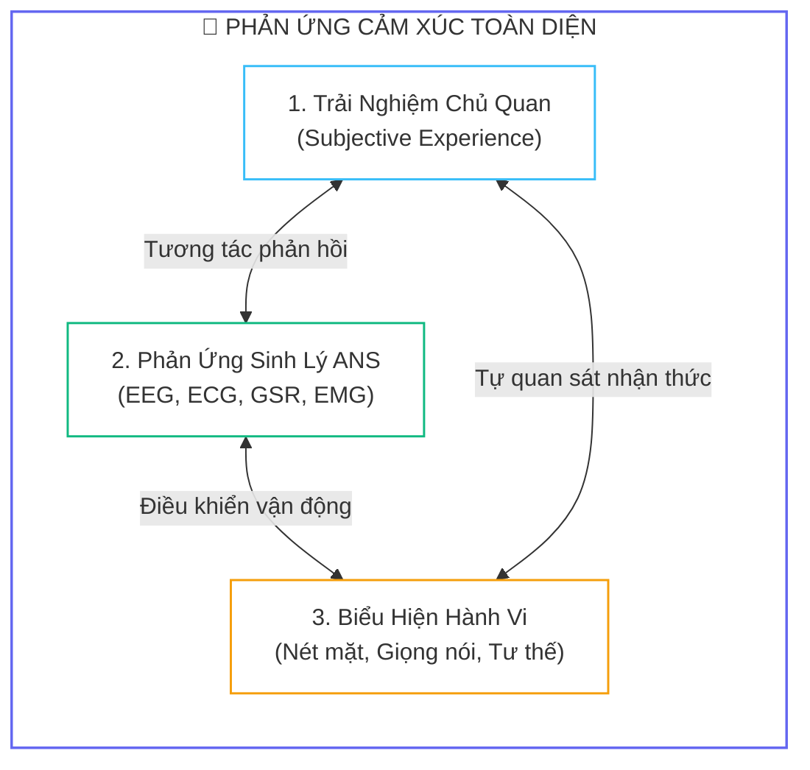
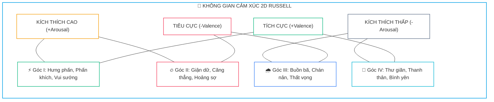
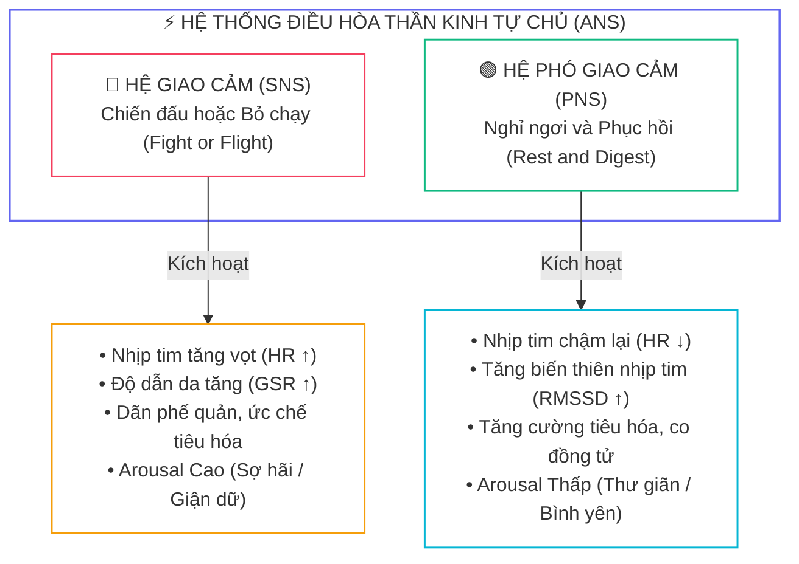
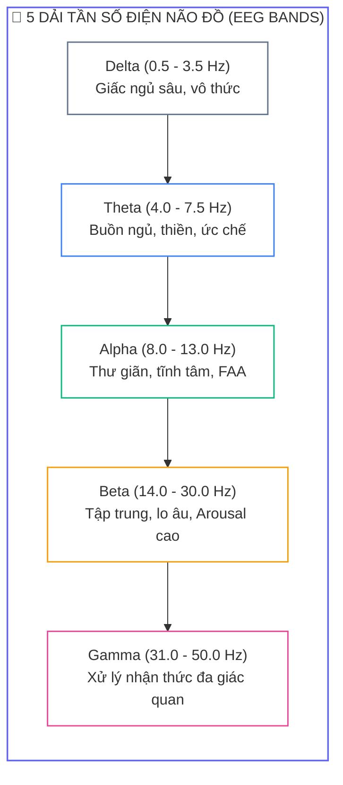
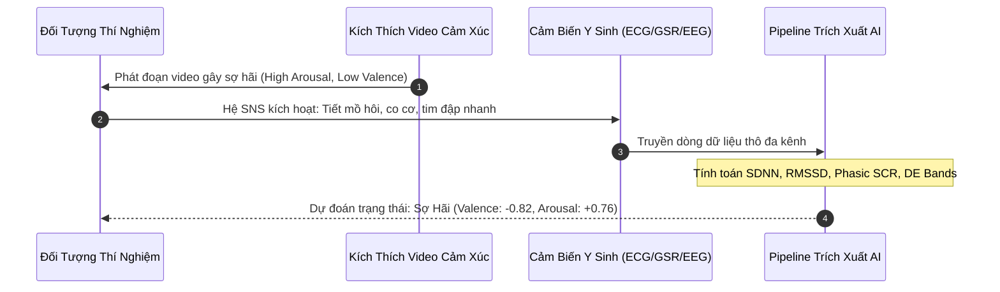


# Tổng Quan Về Cảm Xúc & Tín Hiệu Y Sinh: Mô Hình Circumplex, Điện Não Đồ EEG, ECG & GSR

Trong kỷ nguyên giao tiếp thông minh giữa người và máy (**Human-Computer Interaction - HCI**) cùng sự phát triển vũ bão của trí tuệ nhân tạo, khả năng thấu hiểu trạng thái cảm xúc con người (**Affective Computing**) đã trở thành một trong những mục tiêu nghiên cứu đột phá nhất. Thay vì chỉ dựa vào các biểu hiện bên ngoài có thể bị che giấu hoặc giả mạo như nét mặt hay giọng nói, việc thu thập và phân tích trực tiếp các **tín hiệu y sinh** (<span class="badge badge--purple">Biomedical Signals</span>) từ hệ thần kinh trung ương và ngoại biên mở ra cánh cửa giải mã chân thực nhất trạng thái tâm lý và cảm xúc của con người.

---

## 1. Bản Chất Sinh Học Của Cảm Xúc

Cảm xúc (*emotion*) không đơn thuần là một cảm giác trừu tượng mà là một chuỗi phản ứng sinh lý thần kinh phức tạp liên quan đến ba thành phần cốt lõi:



* **Trải nghiệm chủ quan:** Cách cá nhân tự ý thức và gọi tên cảm xúc của bản thân (vui vẻ, sợ hãi, buồn bã).
* **Phản ứng sinh lý:** Các biến đổi tức thời bên trong cơ thể được điều khiển bởi <strong style="color: var(--accent-primary);">Hệ thần kinh tự chủ (Autonomic Nervous System - ANS)</strong> và <strong style="color: var(--accent-primary);">Hệ thần kinh trung ương (CNS)</strong> như thay đổi nhịp tim, điện não, độ dẫn da và trương lực cơ.
* **Biểu hiện hành vi:** Các phản xạ vận động ra bên ngoài như dãn đồng tử, co cơ mặt, biến đổi ngữ điệu âm thanh.

> [!NOTE]
> **PHÂN BIỆT CẢM XÚC (EMOTION) VÀ TÂM TRẠNG (MOOD):**
> Cảm xúc là phản ứng ngắn hạn (kéo dài từ vài giây đến vài phút) xuất hiện do một tác nhân kích thích cụ thể. Ngược lại, tâm trạng là trạng thái cảm xúc nền kéo dài (vài giờ hoặc vài ngày) với cường độ thấp hơn và thường không gắn liền với một sự kiện kích hoạt rõ ràng.

---

## 2. Các Mô Hình Biểu Diễn Cảm Xúc Trong AI

Để máy tính và các thuật toán học máy có thể xử lý, cảm xúc cần được chuẩn hóa thành các mô hình toán học rõ ràng:

### 2.1. Mô hình cảm xúc rời rạc (Discrete Emotion Model)
Được đề xuất bởi nhà tâm lý học **Paul Ekman**, mô hình này phân chia phổ cảm xúc của con người thành $6$ loại cảm xúc cơ bản mang tính phổ quát sinh học trên toàn thế giới:
1. <span class="badge badge--emerald">Vui vẻ (Happy)</span>
2. <span class="badge badge--primary">Buồn bã (Sad)</span>
3. <span class="badge badge--rose">Giận dữ (Angry)</span>
4. <span class="badge badge--rose">Sợ hãi (Fear)</span>
5. <span class="badge badge--amber">Ngạc nhiên (Surprise)</span>
6. <span class="badge badge--purple">Ghê tởm (Disgust)</span>

* **Ưu điểm:** Rất trực quan, phù hợp cho bài toán phân loại đa lớp thông thường (*Multi-class Classification*).
* **Hạn chế:** Không thể diễn tả được các trạng thái cảm xúc pha trộn (vừa vui mừng vừa âu lo) và thiếu tính liên tục về cường độ.

### 2.2. Mô hình không gian 2 chiều Circumplex của Russell

Nhà tâm lý học James Russell (1980) đã trừu tượng hóa mọi trạng thái cảm xúc thành các điểm tọa độ $(v, a)$ trong không gian hai chiều liên tục:



1. <strong style="color: var(--accent-emerald);">Trục Hoành - Valence (Hóa trị cảm xúc):</strong> Trải dài từ Tiêu cực ($-1$) đến Tích cực ($+1$), biểu thị mức độ dễ chịu hay khó chịu.
2. <strong style="color: var(--accent-amber);">Trục Tung - Arousal (Mức độ kích hoạt sinh lý):</strong> Trải dài từ Thấp ($-1$) đến Cao ($+1$), biểu thị mức độ tỉnh táo, hưng phấn và năng lượng thần kinh.

Vector trạng thái cảm xúc $e$ được định nghĩa:

$$e = (v, a) \quad \text{với } v, a \in [-1, 1]$$

Khoảng cách Euclidean giữa hai trạng thái cảm xúc $e_1 = (v_1, a_1)$ và $e_2 = (v_2, a_2)$:

$$d(e_1, e_2) = \sqrt{(v_1 - v_2)^2 + (a_1 - a_2)^2}$$

### 2.3. Bảng So Sánh Các Mô Hình Cảm Xúc

| Tiêu Chí So Sánh | Mô Hình Rời Rạc (Discrete) | Mô Hình Không Gian Circumplex |
| :---: | :--- | :--- |
| <span class="badge badge--primary">01</span> | **Cấu trúc nhãn** | Nhãn danh định hữu hạn ($6 - 9$ nhãn cơ bản) | Không gian vector thực liên tục $(v, a) \in \mathbb{R}^2$ |
| <span class="badge badge--cyan">02</span> | **Dạng bài toán AI** | Phân loại đa lớp (*Multi-class Classification*) | Hồi quy (*Regression*) hoặc Phân loại góc phần tư (*Quadrant*) |
| <span class="badge badge--emerald">03</span> | **Dataset tiêu biểu** | SEED, FACED, SEED-IV | DEAP, DREAMER, MAHNOB-HCI |
| <span class="badge badge--amber">04</span> | **Khả năng khái quát** | Bị gò bó trong các khuôn mẫu cứng | Biểu diễn được toàn bộ các sắc thái chuyển tiếp mịn |

---

## 3. Hệ Thần Kinh Tự Chủ (ANS) & Các Tín Hiệu Y Sinh

Khi gặp kích thích cảm xúc, **Hệ thần kinh tự chủ (ANS)** tự động điều phối cơ thể thông qua hai nhánh đối kháng:



### 3.1. Bảng Tổng Hợp Các Loại Tín Hiệu Y Sinh

| Tín Hiệu | Bản Chất Vật Lý Đo Lường | Mối Liên Hệ Với Cảm Xúc | Ưu Điểm Nổi Bật | Thách Thức Kỹ Thuật |
| :---: | :--- | :--- | :--- | :--- |
| <span class="badge badge--purple">EEG</span> | Điện thế sau synapse vỏ não | Phản ánh hoạt động nhận thức và cảm xúc sâu | Độ phân giải thời gian cao (mili-giây) | Tỷ số SNR thấp, nhiều nhiễu cơ học |
| <span class="badge badge--rose">ECG</span> | Hoạt động điện thế cơ tim | Kích hoạt giao cảm/phó giao cảm qua HRV | Tín hiệu mạnh, dạng sóng chuẩn rõ ràng | Độ trễ phản ứng chậm hơn EEG |
| <span class="badge badge--amber">GSR</span> | Độ dẫn điện bề mặt da | Đo lường thuần túy mức độ kích thích Arousal | Cảm biến đơn giản, độ nhạy cao với stress | Không phân biệt được chiều Valence |
| <span class="badge badge--indigo">EMG</span> | Điện thế co cơ bề mặt | Phát hiện vi biểu cảm cơ mặt (chau mày, cười) | Bắt trọn phản ứng cảm xúc vi mô tức thì | Rất nhạy cảm với chuyển động cơ thể |

---

## 4. Tín Hiệu Điện Não Đồ (EEG) & Chuẩn Quốc Tế 10-20

**EEG** (*Electroencephalogram*) là tín hiệu y sinh trung tâm trong các nghiên cứu BCI (*Brain-Computer Interface*). Tín hiệu này phản ánh sự thay đổi điện thế do dòng ion phát sinh trong quá trình truyền xung thần kinh qua các synapse của hàng triệu nơ-ron hình tháp (*pyramidal neurons*) ở vỏ não.

### 4.1. Hệ thống định vị điện cực chuẩn quốc tế 10-20
Quy tắc 10-20 chia hộp sọ thành các khoảng cách tỷ lệ $10\%$ và $20\%$ giữa các mốc giải phẫu: **Nasion** (gốc sống mũi) và **Inion** (ụ chẩm sau gáy):

* **Ký tự chữ cái biểu thị vùng não:**
  * <span class="badge badge--primary">Fp</span>: Thùy cực trán (*Frontopolar*)
  * <span class="badge badge--cyan">F</span>: Thùy trán (*Frontal*)
  * <span class="badge badge--indigo">C</span>: Vùng trung tâm (*Central*)
  * <span class="badge badge--purple">T</span>: Thùy thái dương (*Temporal*)
  * <span class="badge badge--amber">P</span>: Thùy đỉnh (*Parietal*)
  * <span class="badge badge--rose">O</span>: Thùy chẩm (*Occipital*)
* **Ký tự số theo sau:**
  * Số **lẻ** ($1, 3, 5, 7$): Thuộc bán cầu não **trái**.
  * Số **chẵn** ($2, 4, 6, 8$): Thuộc bán cầu não **phải**.
  * Chữ **z** (*Zero*): Nằm trên trục giữa đường phân cách đỉnh đầu (*Midline*).

### 4.2. Năm dải tần số đặc trưng của tín hiệu EEG



```python
import numpy as np
from scipy.signal import butter, filtfilt

def extract_band(signal: np.ndarray, fs: int, low_freq: float, high_freq: float, order: int = 5) -> np.ndarray:
    """
    Trích xuất dải tần số EEG bằng bộ lọc số Butterworth Bandpass hai chiều (zero-phase filtfilt).
    """
    nyquist = 0.5 * fs
    low = low_freq / nyquist
    high = high_freq / nyquist
    b, a = butter(order, [low, high], btype='band')
    filtered_signal = filtfilt(b, a, signal)
    return filtered_signal
```

### 4.3. Chỉ số bất đối xứng sóng Alpha vùng trán (Frontal Alpha Asymmetry - FAA)
Một trong những phát hiện sinh lý thần kinh quan trọng nhất về cảm xúc là mối tương quan nghịch giữa công suất sóng Alpha và mức độ kích hoạt vỏ não:
* **Bán cầu não trái:** Chi phối hệ thống động cơ **tiếp cận** (*Approach System* - hứng thú, vui vẻ, tích cực).
* **Bán cầu não phải:** Chi phối hệ thống động cơ **né tránh** (*Withdrawal System* - sợ hãi, lo âu, tiêu cực).

Chỉ số **FAA** được tính bằng sự chênh lệch logarit công suất sóng Alpha giữa điện cực F4 (trán phải) và F3 (trán trái):

$$\text{FAA} = \ln(P_{\alpha, F4}) - \ln(P_{\alpha, F3})$$

* $\text{FAA} > 0$: Công suất Alpha bên phải cao hơn $\rightarrow$ Vỏ não trán trái hoạt động mạnh hơn $\rightarrow$ <b style="color: var(--accent-emerald);">Cảm xúc tích cực (Approach Motivation)</b>.
* $\text{FAA} < 0$: Công suất Alpha bên trái cao hơn $\rightarrow$ Vỏ não trán phải hoạt động mạnh hơn $\rightarrow$ <b style="color: var(--accent-rose);">Cảm xúc tiêu cực (Withdrawal Motivation)</b>.

```python
def compute_faa(eeg_f3: np.ndarray, eeg_f4: np.ndarray, fs: int = 128) -> float:
    """
    Tính chỉ số bất đối xứng sóng Alpha vùng trán (FAA) giữa hai kênh F3 và F4.
    """
    alpha_f3 = extract_band(eeg_f3, fs, 8.0, 13.0)
    alpha_f4 = extract_band(eeg_f4, fs, 8.0, 13.0)
    
    power_f3 = np.mean(alpha_f3 ** 2)
    power_f4 = np.mean(alpha_f4 ** 2)
    
    faa = float(np.log(power_f4 + 1e-12) - np.log(power_f3 + 1e-12))
    return faa
```

---

## 5. Các Tín Hiệu Y Sinh Ngoại Biên Bổ Trợ



### 5.1. Tín hiệu điện tim (ECG) & Biến thiên nhịp tim (HRV)
Phân tích khoảng cách giữa các đỉnh R sóng tim ($RR\text{-interval}$) cho ra các chỉ số HRV phản ánh trực tiếp sức khỏe và cảm xúc:
* **SDNN:** Độ lệch chuẩn các khoảng RR, đo tổng mức độ biến thiên nhịp tim.
* **RMSSD:** Căn bậc hai trung bình bình phương các sai phân liên tiếp, phản ánh hoạt động của <span class="badge badge--emerald">Hệ phó giao cảm (PNS)</span>.
* **Tỷ số LF/HF:** Đo sự cân bằng giữa hệ giao cảm và phó giao cảm:
  $$\text{LF/HF} = \frac{\text{Power}_{0.04 - 0.15\text{Hz}}}{\text{Power}_{0.15 - 0.40\text{Hz}}}$$

### 5.2. Độ dẫn điện da (GSR / EDA)
Được cấu thành từ hai thành phần:
1. **SCL (Tonic component):** Mức độ dẫn điện nền biến thiên chậm theo thời gian.
2. **SCR (Phasic component):** Các xung đáp ứng nhanh xuất hiện sau $1 - 5\ \text{s}$ gặp kích thích đột ngột.

---

## 6. Trích Xuất Đặc Trưng: Differential Entropy (DE)

Trong các bài toán nhận dạng cảm xúc từ EEG, **Differential Entropy (DE)** được chứng minh là đặc trưng mạnh mẽ và ổn định nhất, vượt trội hoàn toàn so với Mật độ phổ công suất (**PSD**).

### 6.1. Chứng minh toán học Differential Entropy
Entropy vi phân mở rộng khái niệm Shannon entropy cho biến ngẫu nhiên liên tục $X$ có hàm mật độ xác suất $f(x)$:

$$h(X) = -\int_{-\infty}^{+\infty} f(x) \ln f(x) \, dx$$

Khi một đoạn tín hiệu EEG trong một dải tần số xác định tuân theo phân phối chuẩn Gaussian $X \sim \mathcal{N}(\mu, \sigma^2)$:

$$f(x) = \frac{1}{\sqrt{2\pi\sigma^2}} \ exp\left(-\frac{(x-\mu)^2}{2\sigma^2}\right)$$

Khai triển biểu thức tích phân:

$$h(X) = -\int_{-\infty}^{+\infty} f(x) \left[ -\frac{1}{2}\ln(2\pi\sigma^2) - \frac{(x-\mu)^2}{2\sigma^2} \right] dx = \frac{1}{2}\ln(2\pi e \sigma^2)$$

Do phương sai $\sigma^2$ đồng thời đại diện cho năng lượng công suất của đoạn tín hiệu, ta có công thức trích xuất đặc trưng DE:

$$\text{DE} = \frac{1}{2}\ln\left(2\pi e \cdot \text{Var}(X)\right)$$

```python
def compute_de(signal: np.ndarray) -> float:
    """
    Tính đặc trưng Differential Entropy (DE) cho một đoạn tín hiệu EEG đã lọc dải tần.
    """
    variance = np.var(signal, ddof=1)
    if variance <= 1e-12:
        variance = 1e-12
    return float(0.5 * np.log(2.0 * np.pi * np.e * variance))
```

---

## 7. Phân Tích Cạm Bẫy Thực Chiến (5-Whys Incident Analysis)

### Tình Huống Sự Cố Thực Tế:
<span class="badge badge--rose">🕒 02:30 AM</span> Trong một nghiên cứu xây dựng mô hình AI nhận dạng cảm xúc từ tập dữ liệu **DEAP** (32 người tham gia), nhóm nghiên cứu ghi nhận độ chính xác kỷ lục lên tới **$98.5\%$** khi phân loại 2 mức Valence (High vs Low) bằng mô hình MLP và SVM. Tuy nhiên, khi chuyển sang thử nghiệm thực tế (*Real-world Online Testing*) trên các đối tượng mới trong phòng lab, độ chính xác của hệ thống sụt giảm thảm hại xuống chỉ còn **$51.2\%$** (tương đương đoán ngẫu nhiên).

### Hậu Quả & Log Lỗi Thực Tế:
Khi kiểm tra ma trận nhầm lẫn và log đánh giá kiểm thử chéo người tham gia (*Cross-Subject Testing*), mô hình hoàn toàn mất khả năng tổng quát hóa:

```text
================================================================================
CRITICAL EVALUATION REPORT: SUBJECT-INDEPENDENT BENCHMARK FAILURE
================================================================================
[INFO] Model Architecture: Deep MLP (4 layers, BatchNorm, Dropout 0.3)
[INFO] Feature Set: Differential Entropy (32 channels x 5 bands = 160 features)
[INFO] Total Samples: 2400 windows (across 32 subjects)

>> EVALUATION MODE 1: Random Train/Test Split (80/20) [LEAKAGE CONTAMINATED]
   - Train Accuracy: 99.1%
   - Test Accuracy : 98.5%  <-- FALSE SENSE OF SUPERIORITY!

>> EVALUATION MODE 2: Leave-One-Subject-Out (LOSO) [STRICT ZERO-LEAKAGE]
   - Subject 01 Test Acc: 52.1%
   - Subject 02 Test Acc: 49.8%
   - Subject 03 Test Acc: 51.5%
   - Mean LOSO Accuracy : 51.2% +/- 2.4%  [TOTAL MODEL COLLAPSE]
================================================================================
```

### 5-Whys Root Cause Analysis:
1. <span class="badge badge--primary">Why 1</span> **Tại sao độ chính xác kiểm thử ban đầu đạt $98.5\%$ nhưng thực tế chỉ đạt $51.2\%$?** $\rightarrow$ Do mô hình bị học vẹt (*Data Leakage*) các đặc trưng định danh cá nhân (*Subject Biometrics*) thay vì học các đặc trưng cảm xúc tổng quát.
2. <span class="badge badge--primary">Why 2</span> **Tại sao đặc trưng cá nhân lại bị rò rỉ vào tập kiểm thử?** $\rightarrow$ Do pipeline tiền xử lý đã trộn lẫn ngẫu nhiên toàn bộ các đoạn cửa sổ thời gian (*Epochs*) của tất cả người tham gia rồi mới chia tập `train_test_split(test_size=0.2)`.
3. <span class="badge badge--primary">Why 3</span> **Tại sao việc trộn cửa sổ thời gian lại làm rò rỉ thông tin cá nhân?** $\rightarrow$ Vì các cửa sổ thời gian liên tiếp của cùng một người trong cùng một phiên ghi có độ tương đồng tín hiệu nền rất cao (cùng hình dạng hộp sọ, cùng trở kháng điện cực).
4. <span class="badge badge--primary">Why 4</span> **Tại sao chuẩn hóa Z-Score toàn cục cũng góp phần gây rò rỉ?** $\rightarrow$ Việc tính toán `mean` và `std` trên toàn bộ tập dữ liệu trước khi chia phân tách đã bơm thông tin phân phối của tập Test vào tập Train.
5. <span class="badge badge--emerald">Root Cause Remedy</span> **Biện pháp khắc phục chuẩn SRE & AI Y Sinh:**
   - <span class="badge badge--rose">Cấm Random Split</span> Tuyệt đối không dùng random shuffle split trên chuỗi tín hiệu y sinh.
   - <span class="badge badge--cyan">Áp dụng LOSO Cross-Validation</span> Luôn sử dụng chiến lược **Leave-One-Subject-Out (LOSO)**: Dùng dữ liệu của $N-1$ người để train và kiểm thử trên người thứ $N$.
   - <span class="badge badge--emerald">Fit Scaler On Train Only</span> Chỉ tính toán giá trị chuẩn hóa Z-score/MinMax trên tập Train và biến đổi (*transform*) cho tập Test.

---

## 8. Câu Hỏi Tự Kiểm Tra Chuyên Sâu (Q&A Accordion)

<details class="qa-card">
<summary class="qa-summary">
  <div class="qa-summary-left">
    <span class="qa-num-badge">Q01</span>
    <span>Sự khác biệt căn bản giữa tín hiệu điện thế vỏ não EEG và tín hiệu điện tim ECG là gì?</span>
  </div>
  <span class="qa-chevron">
    <svg width="18" height="18" fill="none" stroke="currentColor" stroke-width="2.5" viewBox="0 0 24 24"><polyline points="6 9 12 15 18 9"></polyline></svg>
  </span>
</summary>
<div class="qa-answer">
  <div class="qa-answer-header">
    <svg width="14" height="14" fill="none" stroke="currentColor" stroke-width="2" viewBox="0 0 24 24"><path d="M22 11.08V12a10 10 0 1 1-5.93-9.14"></path><polyline points="22 4 12 14.01 9 11.01"></polyline></svg>
    <span>Phân Tích &amp; Lời Giải Kỹ Thuật</span>
  </div>
  <div style="margin-bottom: 8px;">EEG đo lường các <b style="color: var(--accent-primary);">điện thế sau synapse</b> phát sinh từ hệ thần kinh trung ương (vỏ não) với biên độ cực nhỏ (10-100 uV) và tỷ số SNR thấp. Ngược lại, ECG ghi nhận hoạt động khử cực cơ tim do <b style="color: var(--accent-emerald);">hệ thần kinh tự chủ (ANS)</b> điều khiển với biên độ lớn hơn (khoảng 1 mV) và dạng sóng P-QRS-T có chu kỳ giải phẫu rất rõ ràng.</div>
</div>
</details>

<details class="qa-card">
<summary class="qa-summary">
  <div class="qa-summary-left">
    <span class="qa-num-badge">Q02</span>
    <span>Tại sao mô hình không gian Circumplex 2D của Russell lại được ưa chuộng hơn mô hình phân loại rời rạc trong nghiên cứu BCI?</span>
  </div>
  <span class="qa-chevron">
    <svg width="18" height="18" fill="none" stroke="currentColor" stroke-width="2.5" viewBox="0 0 24 24"><polyline points="6 9 12 15 18 9"></polyline></svg>
  </span>
</summary>
<div class="qa-answer">
  <div class="qa-answer-header">
    <svg width="14" height="14" fill="none" stroke="currentColor" stroke-width="2" viewBox="0 0 24 24"><path d="M22 11.08V12a10 10 0 1 1-5.93-9.14"></path><polyline points="22 4 12 14.01 9 11.01"></polyline></svg>
    <span>Phân Tích &amp; Lời Giải Kỹ Thuật</span>
  </div>
  <div style="margin-bottom: 8px;">Mô hình Circumplex biểu diễn cảm xúc như một <b style="color: var(--accent-primary);">không gian vector liên tục</b> gồm hai trục Valence và Arousal. Điều này phản ánh chính xác tính chất mờ và sự biến chuyển dần của trạng thái tâm lý, cho phép áp dụng các giải thuật hồi quy toán học và đánh giá khoảng cách hình học, thay vì ép buộc cảm xúc vào một số ít các nhãn rời rạc cứng nhắc.</div>
</div>
</details>

<details class="qa-card">
<summary class="qa-summary">
  <div class="qa-summary-left">
    <span class="qa-num-badge">Q03</span>
    <span>Chỉ số Frontal Alpha Asymmetry (FAA) dương mang ý nghĩa sinh lý thần kinh gì?</span>
  </div>
  <span class="qa-chevron">
    <svg width="18" height="18" fill="none" stroke="currentColor" stroke-width="2.5" viewBox="0 0 24 24"><polyline points="6 9 12 15 18 9"></polyline></svg>
  </span>
</summary>
<div class="qa-answer">
  <div class="qa-answer-header">
    <svg width="14" height="14" fill="none" stroke="currentColor" stroke-width="2" viewBox="0 0 24 24"><path d="M22 11.08V12a10 10 0 1 1-5.93-9.14"></path><polyline points="22 4 12 14.01 9 11.01"></polyline></svg>
    <span>Phân Tích &amp; Lời Giải Kỹ Thuật</span>
  </div>
  <div style="margin-bottom: 8px;">Do công suất sóng Alpha tỷ lệ nghịch với mức độ kích hoạt vỏ não, khi <code>FAA = ln(P_F4) - ln(P_F3) &gt; 0</code> đồng nghĩa công suất Alpha ở bán cầu phải lớn hơn bên trái, tức là <b style="color: var(--accent-emerald);">vỏ não trán trái đang hoạt động mạnh hơn trán phải</b>. Trán trái liên quan đến hệ thống động cơ tiếp cận (Approach Motivation), phản ánh trạng thái cảm xúc tích cực hoặc vui vẻ.</div>
</div>
</details>

<details class="qa-card">
<summary class="qa-summary">
  <div class="qa-summary-left">
    <span class="qa-num-badge">Q04</span>
    <span>Tại sao tín hiệu phản ứng da điện (GSR/EDA) chỉ phản ánh được trục Arousal mà không phản ánh được trục Valence?</span>
  </div>
  <span class="qa-chevron">
    <svg width="18" height="18" fill="none" stroke="currentColor" stroke-width="2.5" viewBox="0 0 24 24"><polyline points="6 9 12 15 18 9"></polyline></svg>
  </span>
</summary>
<div class="qa-answer">
  <div class="qa-answer-header">
    <svg width="14" height="14" fill="none" stroke="currentColor" stroke-width="2" viewBox="0 0 24 24"><path d="M22 11.08V12a10 10 0 1 1-5.93-9.14"></path><polyline points="22 4 12 14.01 9 11.01"></polyline></svg>
    <span>Phân Tích &amp; Lời Giải Kỹ Thuật</span>
  </div>
  <div style="margin-bottom: 8px;">Tuyến mồ hôi ngoại tiết ở da chỉ được chi phối đơn hướng bởi <b style="color: var(--accent-rose);">Hệ thần kinh giao cảm (SNS)</b>. Dù đối tượng trải qua cảm xúc hưng phấn tột độ (Valence dương) hay hoảng sợ tột độ (Valence âm), hệ giao cảm đều phát tín hiệu làm tăng tiết mồ hôi và tăng độ dẫn da, do đó GSR chỉ đo được cường độ kích thích thần kinh (Arousal).</div>
</div>
</details>

<details class="qa-card">
<summary class="qa-summary">
  <div class="qa-summary-left">
    <span class="qa-num-badge">Q05</span>
    <span>Tại sao đặc trưng Differential Entropy (DE) lại vượt trội hơn Power Spectral Density (PSD) trong phân loại cảm xúc EEG?</span>
  </div>
  <span class="qa-chevron">
    <svg width="18" height="18" fill="none" stroke="currentColor" stroke-width="2.5" viewBox="0 0 24 24"><polyline points="6 9 12 15 18 9"></polyline></svg>
  </span>
</summary>
<div class="qa-answer">
  <div class="qa-answer-header">
    <svg width="14" height="14" fill="none" stroke="currentColor" stroke-width="2" viewBox="0 0 24 24"><path d="M22 11.08V12a10 10 0 1 1-5.93-9.14"></path><polyline points="22 4 12 14.01 9 11.01"></polyline></svg>
    <span>Phân Tích &amp; Lời Giải Kỹ Thuật</span>
  </div>
  <div style="margin-bottom: 8px;">Nhờ sử dụng hàm Logarit tự nhiên trên phương sai của tín hiệu phân phối Gauss: <code>DE = 0.5 * ln(2 * pi * e * Var(X))</code>, DE thực hiện <b style="color: var(--accent-cyan);">nén dải động phi tuyến</b> của năng lượng tín hiệu. Điều này giúp giảm thiểu độ nhạy cảm với các biến động biên độ bất thường và triệt tiêu phương sai giữa các phiên đo, mang lại độ phân tách lớp cao hơn cho mô hình học máy.</div>
</div>
</details>

<details class="qa-card">
<summary class="qa-summary">
  <div class="qa-summary-left">
    <span class="qa-num-badge">Q06</span>
    <span>Ý nghĩa của chỉ số RMSSD trong phân tích biến thiên nhịp tim (HRV) là gì?</span>
  </div>
  <span class="qa-chevron">
    <svg width="18" height="18" fill="none" stroke="currentColor" stroke-width="2.5" viewBox="0 0 24 24"><polyline points="6 9 12 15 18 9"></polyline></svg>
  </span>
</summary>
<div class="qa-answer">
  <div class="qa-answer-header">
    <svg width="14" height="14" fill="none" stroke="currentColor" stroke-width="2" viewBox="0 0 24 24"><path d="M22 11.08V12a10 10 0 1 1-5.93-9.14"></path><polyline points="22 4 12 14.01 9 11.01"></polyline></svg>
    <span>Phân Tích &amp; Lời Giải Kỹ Thuật</span>
  </div>
  <div style="margin-bottom: 8px;">RMSSD (Root Mean Square of Successive Differences) phản ánh trực tiếp mức độ hoạt động của <b style="color: var(--accent-emerald);">hệ thần kinh phó giao cảm (PNS)</b> tác động lên nút xoang tim. Giá trị RMSSD cao biểu thị trạng thái cơ thể đang thư giãn, tĩnh tâm và phục hồi tốt; ngược lại RMSSD giảm mạnh khi cá nhân rơi vào trạng thái căng thẳng hoặc quá tải cảm xúc.</div>
</div>
</details>

<details class="qa-card">
<summary class="qa-summary">
  <div class="qa-summary-left">
    <span class="qa-num-badge">Q07</span>
    <span>Điện thế sau synapse (Postsynaptic Potential) đóng vai trò gì trong việc hình thành tín hiệu EEG đo được ngoài da đầu?</span>
  </div>
  <span class="qa-chevron">
    <svg width="18" height="18" fill="none" stroke="currentColor" stroke-width="2.5" viewBox="0 0 24 24"><polyline points="6 9 12 15 18 9"></polyline></svg>
  </span>
</summary>
<div class="qa-answer">
  <div class="qa-answer-header">
    <svg width="14" height="14" fill="none" stroke="currentColor" stroke-width="2" viewBox="0 0 24 24"><path d="M22 11.08V12a10 10 0 1 1-5.93-9.14"></path><polyline points="22 4 12 14.01 9 11.01"></polyline></svg>
    <span>Phân Tích &amp; Lời Giải Kỹ Thuật</span>
  </div>
  <div style="margin-bottom: 8px;">Điện thế hoạt động (Action Potential) của một sợi trục diễn ra quá nhanh (1-2 ms) nên khó tích lũy đồng bộ. Trong khi đó, các điện thế sau synapse (EPSP và IPSP) kéo dài từ 10-100 ms tại các đuôi gai nơ-ron hình tháp xếp song song trong vỏ não tạo thành một <b style="color: var(--accent-primary);">lưỡng cực điện (dipole) không gian</b>. Khi hàng triệu nơ-ron cùng khử cực đồng bộ, điện trường này đủ mạnh để lan truyền qua xương sọ đến các điện cực EEG.</div>
</div>
</details>

<details class="qa-card">
<summary class="qa-summary">
  <div class="qa-summary-left">
    <span class="qa-num-badge">Q08</span>
    <span>Tại sao hai cơ mặt Corrugator Supercilii và Zygomaticus Major lại là hai vị trí đo EMG quan trọng nhất cho nhận dạng cảm xúc?</span>
  </div>
  <span class="qa-chevron">
    <svg width="18" height="18" fill="none" stroke="currentColor" stroke-width="2.5" viewBox="0 0 24 24"><polyline points="6 9 12 15 18 9"></polyline></svg>
  </span>
</summary>
<div class="qa-answer">
  <div class="qa-answer-header">
    <svg width="14" height="14" fill="none" stroke="currentColor" stroke-width="2" viewBox="0 0 24 24"><path d="M22 11.08V12a10 10 0 1 1-5.93-9.14"></path><polyline points="22 4 12 14.01 9 11.01"></polyline></svg>
    <span>Phân Tích &amp; Lời Giải Kỹ Thuật</span>
  </div>
  <div style="margin-bottom: 8px;">Cơ <b style="color: var(--accent-rose);">Corrugator Supercilii</b> (cơ chau mày) co lại khi có kích thích khó chịu, đau đớn hoặc tức giận, tương quan trực tiếp với <code>Valence tiêu cực</code>. Ngược lại, cơ <b style="color: var(--accent-emerald);">Zygomaticus Major</b> (cơ gò má lớn) kéo khóe môi lên khi mỉm cười, tương quan trực tiếp với <code>Valence tích cực</code>. Sự kết hợp của hai kênh này cung cấp thước đo sinh lý rất nhạy cho chiều hóa trị cảm xúc.</div>
</div>
</details>

<details class="qa-card">
<summary class="qa-summary">
  <div class="qa-summary-left">
    <span class="qa-num-badge">Q09</span>
    <span>Trong hệ thống chuẩn quốc tế 10-20, điện cực Fp1 và Fp2 nằm ở vị trí nào và thường bị ảnh hưởng bởi loại nhiễu nào nhất?</span>
  </div>
  <span class="qa-chevron">
    <svg width="18" height="18" fill="none" stroke="currentColor" stroke-width="2.5" viewBox="0 0 24 24"><polyline points="6 9 12 15 18 9"></polyline></svg>
  </span>
</summary>
<div class="qa-answer">
  <div class="qa-answer-header">
    <svg width="14" height="14" fill="none" stroke="currentColor" stroke-width="2" viewBox="0 0 24 24"><path d="M22 11.08V12a10 10 0 1 1-5.93-9.14"></path><polyline points="22 4 12 14.01 9 11.01"></polyline></svg>
    <span>Phân Tích &amp; Lời Giải Kỹ Thuật</span>
  </div>
  <div style="margin-bottom: 8px;">Fp1 và Fp2 nằm ở vùng cực trán (ngay phía trên lông mày bên trái và phải). Do vị trí sát mắt, hai kênh này chịu ảnh hưởng nghiêm trọng nhất từ <b style="color: var(--accent-amber);">nhiễu điện nhãn EOG (Electrooculogram)</b> sinh ra do cử động chớp mắt và đảo mắt, với biên độ nhiễu có thể lớn gấp 10 lần tín hiệu EEG thực.</div>
</div>
</details>

<details class="qa-card">
<summary class="qa-summary">
  <div class="qa-summary-left">
    <span class="qa-num-badge">Q10</span>
    <span>Chiến lược kiểm thử chéo người tham gia (Leave-One-Subject-Out - LOSO) giải quyết vấn đề gì trong các hệ thống AI cảm xúc?</span>
  </div>
  <span class="qa-chevron">
    <svg width="18" height="18" fill="none" stroke="currentColor" stroke-width="2.5" viewBox="0 0 24 24"><polyline points="6 9 12 15 18 9"></polyline></svg>
  </span>
</summary>
<div class="qa-answer">
  <div class="qa-answer-header">
    <svg width="14" height="14" fill="none" stroke="currentColor" stroke-width="2" viewBox="0 0 24 24"><path d="M22 11.08V12a10 10 0 1 1-5.93-9.14"></path><polyline points="22 4 12 14.01 9 11.01"></polyline></svg>
    <span>Phân Tích &amp; Lời Giải Kỹ Thuật</span>
  </div>
  <div style="margin-bottom: 8px;">LOSO đảm bảo dữ liệu của đối tượng kiểm thử hoàn toàn <b style="color: var(--accent-rose);">chưa từng xuất hiện trong quá trình huấn luyện</b>. Điều này giúp loại trừ hoàn toàn nguy cơ rò rỉ dữ liệu sinh trắc học cá nhân, phản ánh chính xác khả năng tổng quát hóa thực tế của mô hình khi triển khai cho một người dùng hoàn toàn mới (Subject-Independent).</div>
</div>
</details>

---

## 9. Tổng Kết & Lộ Trình Bài Học Tiếp Theo

Nắm vững cơ sở sinh lý thần kinh của cảm xúc, mô hình không gian 2D Valence-Arousal, hệ thống điện cực EEG 10-20 cùng các chỉ số then chốt như **FAA** và đặc trưng **Differential Entropy (DE)** là nền tảng cốt lõi trước khi bước vào xây dựng các pipeline tiền xử lý và học sâu chuyên sâu.

> [!TIP]
> **BÀI HỌC TIẾP THEO:**
> Trong **[[Bài 02] Xử Lý Tín Hiệu Y Sinh Cơ Bản: Bộ Lọc Số, Khử Nhiễu ICA, Biến Đổi Sóng Con Wavelet & Trích Xuất Đặc Trưng](eeg-02-02-xu-ly-tin-hieu-y-sinh-co-ban.html)**, chúng ta sẽ trực tiếp thực hành xử lý tín hiệu: Xây dựng bộ lọc số Bandpass/Notch khử nhiễu điện lưới 50Hz, phân tích thành phần độc lập (**ICA**) để bóc tách nhiễu mắt EOG, và kỹ thuật Wavelet Transform bảo toàn độ phân giải thời gian - tần số.

