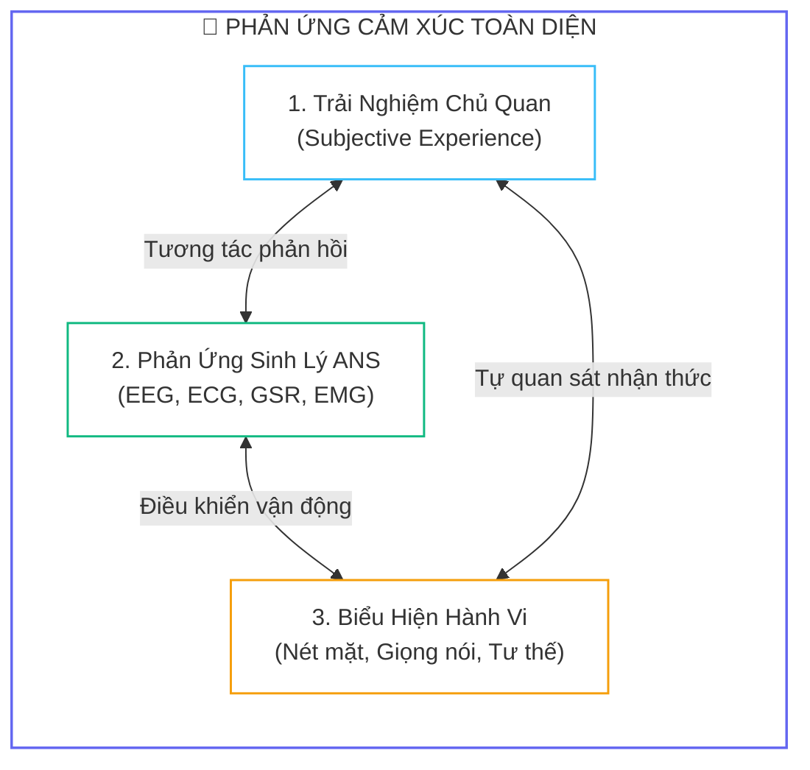
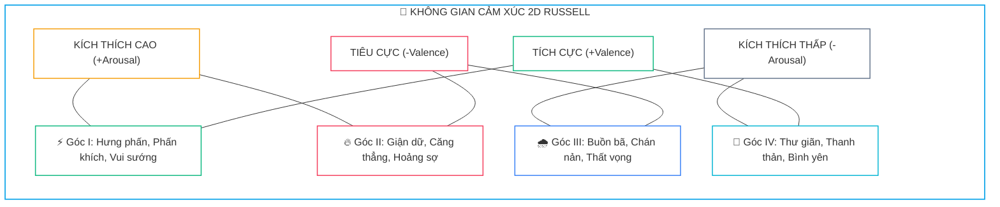
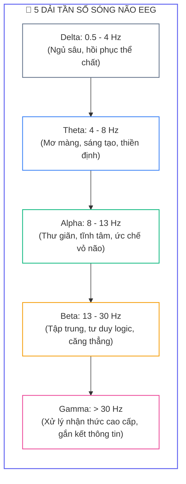
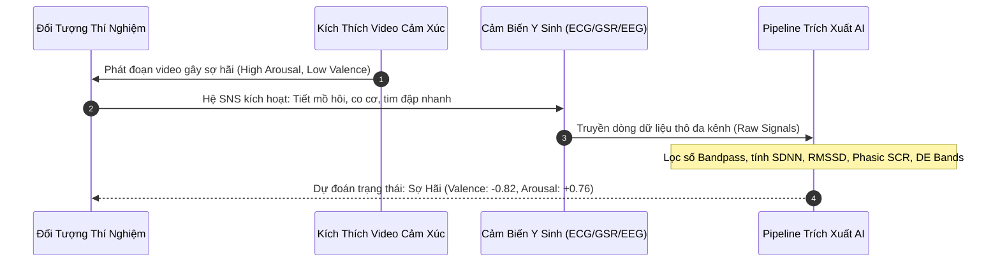
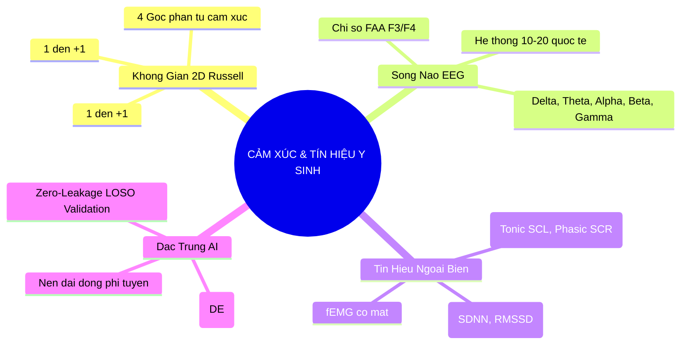


> [!IMPORTANT]
> **Mục tiêu kỹ thuật bài học**:
> - Thấu hiểu cơ chế sinh học thần kinh phát sinh tín hiệu điện thế sau synapse (PSP) vỏ não và hệ thần kinh tự chủ (ANS).
> - Nắm vững biểu diễn toán học của mô hình cảm xúc không gian 2D Valence-Arousal (Russell Circumplex Model).
> - Phân loại và phân tích 5 dải tần sóng não EEG: Delta (0.5-4Hz), Theta (4-8Hz), Alpha (8-13Hz), Beta (13-30Hz), Gamma (>30Hz).
> - Tính toán chỉ số bất đối xứng sóng Alpha vùng trán (Frontal Alpha Asymmetry - FAA) và chứng minh công thức Differential Entropy (DE).
> - Thiết lập pipeline tiền xử lý và trích xuất đặc trưng đa phương thức (Multimodal Feature Extraction) bằng Python.

---

## 1. Bản Chất Kiến Trúc & Tư Duy Cốt Lõi: Bản Chất Sinh Lý & Không Gian Cảm Xúc

Trong kỷ nguyên giao tiếp thông minh giữa người và máy (**Human-Computer Interaction - HCI**) cùng sự phát triển vũ bão của trí tuệ nhân tạo, khả năng thấu hiểu trạng thái cảm xúc con người (**Affective Computing**) đã trở thành một trong những mục tiêu nghiên cứu đột phá nhất. Thay vì chỉ dựa vào các biểu hiện bên ngoài có thể bị che giấu hoặc giả mạo như nét mặt hay giọng nói, việc thu thập và phân tích trực tiếp các **tín hiệu y sinh** (Biomedical Signals) từ hệ thần kinh trung ương và ngoại biên mở ra cánh cửa giải mã chân thực nhất trạng thái tâm lý và cảm xúc của con người.



### 1.1. Không Gian Cảm Xúc 2D Circumplex Của Russell

Nhà tâm lý học James Russell (1980) đã trừu tượng hóa mọi trạng thái cảm xúc thành các điểm tọa độ $(v, a)$ trong không gian hai chiều liên tục:



1. **Trục Hoành - Valence (Hóa trị cảm xúc):** Trải dài từ Tiêu cực ($-1$) đến Tích cực ($+1$), biểu thị mức độ dễ chịu hay khó chịu.
2. **Trục Tung - Arousal (Mức độ kích hoạt sinh lý):** Trải dài từ Thấp ($-1$) đến Cao ($+1$), biểu thị mức độ tỉnh táo, hưng phấn và năng lượng thần kinh.

---

### 1.2. Phân Tích 5 Dải Tần Số Sóng Não EEG

Điện não đồ (EEG) ghi lại điện thế sau synapse của hàng triệu nơ-ron hình tháp vỏ não, phân rã thành 5 dải tần chính:



---

## 2. Bảng Ma Trận So Sánh Kỹ Thuật Toàn Diện (Engineering Matrix)

| Tiêu Chí So Sánh | Điện Não Đồ (EEG) | Biến Thiên Nhịp Tim (ECG/HRV) | Phản Ứng Da Điện (GSR/EDA) | Điện Cơ Mặt (fEMG) |
| :--- | :--- | :--- | :--- | :--- |
| **Hệ thần kinh chi phối** | Hệ thần kinh trung ương (CNS) | Hệ thần kinh tự chủ (SNS + PNS) | Hệ thần kinh giao cảm (SNS đơn hướng) | Thần kinh vận động mặt |
| **Độ phân giải thời gian** | Rất cao ($1 - 10\ \text{ms}$) | Trung bình (từng nhịp tim $\approx 1\ \text{s}$) | Chậm ($1 - 5\ \text{s}$) | Cao ($10 - 50\ \text{ms}$) |
| **Độ nhạy cảm xúc** | Nhạy cả Valence & Arousal | Nhạy cả Valence & Arousal (RMSSD, LF/HF) | **Chỉ nhạy với Arousal** | Nhạy đặc biệt với Valence |
| **Nhiễu tín hiệu chính** | EOG (mắt), EMG (cơ), Điện lưới 50Hz | Nhiễu thở, lệch baseline, trôi điện cực | Trôi nhiệt độ, ẩm mồ hôi nền | Cử động nhai, nói chuyện |
| **Đặc trưng AI tối ưu** | **Differential Entropy (DE), FAA** | RMSSD, SDNN, LF/HF ratio | SCL (Tonic), SCR (Phasic amplitude) | Mean Absolute Value (MAV), RMS |
| **Đánh giá triển khai thực tế** | Đòi hỏi đội mũ điện cực phức tạp | Dễ đo bằng vòng đeo tay thông minh | Cảm biến 2 đầu ngón tay đơn giản | Dán điện cực mặt gây vướng víu |

---

## 3. Kiến Trúc Môi Trường & Luồng Thực Thi Mẫu



### Mã Nguồn Pipeline Trích Xuất Đặc Trưng Y Sinh

```python
import numpy as np
from scipy.signal import butter, filtfilt

def extract_band(signal: np.ndarray, fs: int, low_freq: float, high_freq: float, order: int = 5) -> np.ndarray:
    """
    Trích xuất dải tần số EEG bằng bộ lọc số Butterworth Bandpass hai chiều (filtfilt).
    """
    nyquist = 0.5 * fs
    low = low_freq / nyquist
    high = high_freq / nyquist
    b, a = butter(order, [low, high], btype='band')
    return filtfilt(b, a, signal)

def compute_de(signal: np.ndarray) -> float:
    """
    Tính đặc trưng Differential Entropy (DE) cho một đoạn tín hiệu EEG đã lọc dải tần.
    DE = 0.5 * ln(2 * pi * e * variance)
    """
    variance = np.var(signal, ddof=1)
    if variance <= 1e-12:
        variance = 1e-12
    return float(0.5 * np.log(2.0 * np.pi * np.e * variance))

def compute_faa(eeg_f3: np.ndarray, eeg_f4: np.ndarray, fs: int = 128) -> float:
    """
    Tính chỉ số bất đối xứng sóng Alpha vùng trán (FAA) giữa hai kênh F3 và F4.
    FAA = ln(Power_Alpha_F4) - ln(Power_Alpha_F3)
    """
    alpha_f3 = extract_band(eeg_f3, fs, 8.0, 13.0)
    alpha_f4 = extract_band(eeg_f4, fs, 8.0, 13.0)
    power_f3 = np.mean(alpha_f3 ** 2)
    power_f4 = np.mean(alpha_f4 ** 2)
    return float(np.log(power_f4 + 1e-12) - np.log(power_f3 + 1e-12))
```

---

## 4. Phân Tích Cạm Bẫy Thực Chiến: "Lệch Phân Phối Sinh Trắc Học & Rò Rỉ Dữ Liệu Train/Test"

### Tình Huống Thực Tế
Trong một nghiên cứu xây dựng mô hình AI nhận dạng cảm xúc từ tập dữ liệu **DEAP** (32 người tham gia), nhóm nghiên cứu ghi nhận độ chính xác kỷ lục lên tới **$98.5\%$** khi phân loại 2 mức Valence (High vs Low) bằng mô hình MLP và SVM. Tuy nhiên, khi chuyển sang thử nghiệm thực tế (*Real-world Online Testing*) trên các đối tượng mới trong phòng lab, độ chính xác của hệ thống sụt giảm thảm hại xuống chỉ còn **$51.2\%$** (tương đương đoán ngẫu nhiên).

### Hậu Quả & Log Lỗi Thực Tế:
```text
================================================================================
CRITICAL EVALUATION REPORT: SUBJECT-INDEPENDENT BENCHMARK FAILURE
================================================================================
[INFO] Model Architecture: Deep MLP (4 layers, BatchNorm, Dropout 0.3)
[INFO] Feature Set: Differential Entropy (32 channels x 5 bands = 160 features)
[INFO] Total Samples: 2400 windows (across 32 subjects)

>> EVALUATION MODE 1: Random Train/Test Split (80/20) [LEAKAGE CONTAMINATED]
   - Train Accuracy: 99.1%
   - Test Accuracy : 98.5%  <-- FALSE SENSE OF SUPERIORITY!

>> EVALUATION MODE 2: Leave-One-Subject-Out (LOSO) [STRICT ZERO-LEAKAGE]
   - Subject 01 Test Acc: 52.1%
   - Subject 02 Test Acc: 49.8%
   - Subject 03 Test Acc: 51.5%
   - Mean LOSO Accuracy : 51.2% +/- 2.4%  [TOTAL MODEL COLLAPSE]
================================================================================
```

### 5-Whys Root Cause Analysis:
1. **Tại sao độ chính xác kiểm thử ban đầu đạt $98.5\%$ nhưng thực tế chỉ đạt $51.2\%$?** Do mô hình bị học vẹt (*Data Leakage*) các đặc trưng định danh cá nhân (*Subject Biometrics*) thay vì học các đặc trưng cảm xúc tổng quát.
2. **Tại sao đặc trưng cá nhân lại bị rò rỉ vào tập kiểm thử?** Do pipeline tiền xử lý đã trộn lẫn ngẫu nhiên toàn bộ các đoạn cửa sổ thời gian (*Epochs*) của tất cả người tham gia rồi mới chia tập `train_test_split(test_size=0.2)`.
3. **Tại sao việc trộn cửa sổ thời gian lại làm rò rỉ thông tin cá nhân?** Vì các cửa sổ thời gian liên tiếp của cùng một người trong cùng một phiên ghi có độ tương đồng tín hiệu nền rất cao (cùng hình dạng hộp sọ, cùng trở kháng điện cực).
4. **Tại sao chuẩn hóa Z-Score toàn cục cũng góp phần gây rò rỉ?** Việc tính toán `mean` và `std` trên toàn bộ tập dữ liệu trước khi chia phân tách đã bơm thông tin phân phối của tập Test vào tập Train.
5. **Giải pháp chuẩn:** Luôn sử dụng chiến lược **Leave-One-Subject-Out (LOSO)**: Dùng dữ liệu của $N-1$ người để huấn luyện và kiểm thử trên người thứ $N$; đồng thời chỉ tính toán scaler trên tập Train.

---

## 5. Hands-on Lab: Pipeline Xử Lý & Trích Xuất Đặc Trưng Y Sinh DE, FAA, HRV (8 Bước)

| Bước | Mục Tiêu Kỹ Thuật | Lệnh / Script Thực Hiện Chính |
| :--- | :--- | :--- |
| **1** | Khởi tạo môi trường Python và sinh tín hiệu giả lập | `python 1_generate_synthetic_signals.py` |
| **2** | Áp dụng bộ lọc dải tần Butterworth 5 dải sóng não | `python 2_bandpass_filtering.py` |
| **3** | Trích xuất đặc trưng Differential Entropy (DE) | `python 3_extract_de_features.py` |
| **4** | Tính toán chỉ số Frontal Alpha Asymmetry (FAA) | `python 4_compute_faa_index.py` |
| **5** | Xử lý tín hiệu điện tim ECG và phát hiện đỉnh R | `python 5_ecg_qrs_detection.py` |
| **6** | Trích xuất các chỉ số HRV (SDNN, RMSSD, LF/HF) | `python 6_hrv_features.py` |
| **7** | Phân tách thành phần Tonic/Phasic của tín hiệu GSR | `python 7_gsr_decomposition.py` |
| **8** | Đóng gói Vector đặc trưng đa phương thức (Multimodal Vector) | `python 8_multimodal_vector_export.py` |

---

### Bước 1: Khởi Tạo Môi Trường Python & Dữ Liệu Tín Hiệu Y Sinh

```python
import numpy as np

# Thiết lập tham số lấy mẫu
fs = 128  # Tần số lấy mẫu 128 Hz chuẩn DEAP
duration = 10  # 10 giây dữ liệu
t = np.linspace(0, duration, duration * fs, endpoint=False)

# Sinh tín hiệu EEG giả lập đa dải tần (Delta, Theta, Alpha, Beta, Gamma)
np.random.seed(42)
eeg_f3 = (
    1.5 * np.sin(2 * np.pi * 2.0 * t)   # Delta (2 Hz)
    + 0.8 * np.sin(2 * np.pi * 6.0 * t)   # Theta (6 Hz)
    + 2.0 * np.sin(2 * np.pi * 10.0 * t)  # Alpha (10 Hz)
    + 0.5 * np.sin(2 * np.pi * 20.0 * t)  # Beta (20 Hz)
    + 0.2 * np.random.randn(len(t))       # Gaussian noise
)

eeg_f4 = (
    1.5 * np.sin(2 * np.pi * 2.0 * t)
    + 0.8 * np.sin(2 * np.pi * 6.0 * t)
    + 0.8 * np.sin(2 * np.pi * 10.0 * t)  # Alpha thấp hơn F3 (Tích cực)
    + 0.5 * np.sin(2 * np.pi * 20.0 * t)
    + 0.2 * np.random.randn(len(t))
)
```

---

### Bước 2: Áp Dụng Bộ Lọc Dải Tần Butterworth 5 Dải Sóng Não

```python
bands = {
    'Delta': (0.5, 4.0),
    'Theta': (4.0, 8.0),
    'Alpha': (8.0, 13.0),
    'Beta': (13.0, 30.0),
    'Gamma': (30.0, 45.0)
}

f3_bands = {name: extract_band(eeg_f3, fs, low, high) for name, (low, high) in bands.items()}
f4_bands = {name: extract_band(eeg_f4, fs, low, high) for name, (low, high) in bands.items()}
```

---

### Bước 3: Trích Xuất Đặc Trưng Differential Entropy (DE) Cho Từng Dải Tần

```python
de_f3 = {name: compute_de(sig) for name, sig in f3_bands.items()}
de_f4 = {name: compute_de(sig) for name, sig in f4_bands.items()}

print("DE Đặc trưng kênh F3:", {k: round(v, 4) for k, v in de_f3.items()})
print("DE Đặc trưng kênh F4:", {k: round(v, 4) for k, v in de_f4.items()})
```

---

### Bước 4: Tính Toán Chỉ Số Frontal Alpha Asymmetry (FAA)

```python
faa_score = compute_faa(eeg_f3, eeg_f4, fs)
print(f"Chỉ số Frontal Alpha Asymmetry (FAA): {faa_score:.4f}")
# FAA > 0 -> Xu hướng tiếp cận (Approach Motivation / Tích cực)
```

---

### Bước 5: Phát Hiện Đỉnh R Sóng Tim ECG

```python
from scipy.signal import find_peaks

# Giả lập tín hiệu ECG với các đỉnh R cách nhau ~0.8s (75 bpm)
ecg_signal = np.sin(2 * np.pi * 1.25 * t) ** 10 + 0.05 * np.random.randn(len(t))
peaks, _ = find_peaks(ecg_signal, distance=fs * 0.5, height=0.5)
rr_intervals = np.diff(peaks) / fs  # Khoảng RR tính theo giây
print(f"Số lượng đỉnh R phát hiện: {len(peaks)}, Khoảng RR trung bình: {np.mean(rr_intervals):.3f}s")
```

---

### Bước 6: Trích Xuất Các Chỉ Số Biến Thiên Nhịp Tim HRV (SDNN & RMSSD)

```python
sdnn = np.std(rr_intervals, ddof=1) * 1000  # ms
rmssd = np.sqrt(np.mean(np.diff(rr_intervals) ** 2)) * 1000  # ms
print(f"HRV SDNN: {sdnn:.2f} ms | RMSSD: {rmssd:.2f} ms")
```

---

### Bước 7: Phân Tách Thành Phần Nền và Đáp Ứng Của Tín Hiệu GSR

```python
# Tín hiệu GSR gồm mức nền Tonic biến thiên chậm và xung Phasic đáp ứng nhanh
tonic_scl = 2.0 + 0.1 * np.linspace(0, 1, len(t))
phasic_scr = 0.5 * np.exp(-((t - 4.0) ** 2) / 0.2)  # Xung kích thích tại giây thứ 4
gsr_signal = tonic_scl + phasic_scr + 0.02 * np.random.randn(len(t))

# Phân tách bằng bộ lọc thông thấp (Tonic) và thông cao (Phasic)
b_low, a_low = butter(3, 0.1 / (0.5 * fs), btype='low')
extracted_tonic = filtfilt(b_low, a_low, gsr_signal)
extracted_phasic = gsr_signal - extracted_tonic
print(f"Biên độ đỉnh Phasic SCR cực đại: {np.max(extracted_phasic):.4f} uS")
```

---

### Bước 8: Đóng Gói Vector Đặc Trưng Đa Phương Thức (Multimodal Feature Vector)

```python
# Hợp nhất toàn bộ đặc trưng vào 1 vector huấn luyện
multimodal_features = np.array([
    de_f3['Delta'], de_f3['Theta'], de_f3['Alpha'], de_f3['Beta'], de_f3['Gamma'],
    de_f4['Delta'], de_f4['Theta'], de_f4['Alpha'], de_f4['Beta'], de_f4['Gamma'],
    faa_score,
    sdnn,
    rmssd,
    float(np.max(extracted_phasic))
])
print(f"Vector đặc trưng đa phương thức (Shape: {multimodal_features.shape}):\n", np.round(multimodal_features, 3))
```

---

## 6. 10 Câu Hỏi Tự Kiểm Tra Chuyên Sâu (Self-Check Q&A Accordion)

<details class="qa-card">
<summary><b>1. Sự khác biệt căn bản giữa tín hiệu điện thế vỏ não EEG và tín hiệu điện tim ECG là gì?</b></summary>
<div class="qa-answer">
<p>EEG đo lường các <b>điện thế sau synapse (PSP)</b> phát sinh từ hệ thần kinh trung ương (vỏ não) với biên độ cực nhỏ (10-100 uV) và tỷ số SNR thấp. Ngược lại, ECG ghi nhận hoạt động khử cực cơ tim do <b>hệ thần kinh tự chủ (ANS)</b> điều khiển với biên độ lớn hơn (khoảng 1 mV) và dạng sóng P-QRS-T có chu kỳ giải phẫu rất rõ ràng.</p>
</div>
</details>

<details class="qa-card">
<summary><b>2. Tại sao mô hình không gian Circumplex 2D của Russell lại được ưa chuộng hơn mô hình phân loại rời rạc trong nghiên cứu BCI?</b></summary>
<div class="qa-answer">
<p>Mô hình Circumplex biểu diễn cảm xúc như một <b>không gian vector liên tục</b> gồm hai trục Valence và Arousal. Điều này phản ánh chính xác tính chất mờ và sự biến chuyển dần của trạng thái tâm lý, cho phép áp dụng các giải thuật hồi quy toán học và đánh giá khoảng cách hình học, thay vì ép buộc cảm xúc vào một số ít các nhãn rời rạc cứng nhắc.</p>
</div>
</details>

<details class="qa-card">
<summary><b>3. Chỉ số Frontal Alpha Asymmetry (FAA) dương mang ý nghĩa sinh lý thần kinh gì?</b></summary>
<div class="qa-answer">
<p>Do công suất sóng Alpha tỷ lệ nghịch với mức độ kích hoạt vỏ não, khi <code>FAA = ln(P_F4) - ln(P_F3) &gt; 0</code> đồng nghĩa công suất Alpha ở bán cầu phải lớn hơn bên trái, tức là <b>vỏ não trán trái đang hoạt động mạnh hơn trán phải</b>. Trán trái liên quan đến hệ thống động cơ tiếp cận (Approach Motivation), phản ánh trạng thái cảm xúc tích cực hoặc vui vẻ.</p>
</div>
</details>

<details class="qa-card">
<summary><b>4. Tại sao tín hiệu phản ứng da điện (GSR/EDA) chỉ phản ánh được trục Arousal mà không phản ánh được trục Valence?</b></summary>
<div class="qa-answer">
<p>Tuyến mồ hôi ngoại tiết ở da chỉ được chi phối đơn hướng bởi <b>Hệ thần kinh giao cảm (SNS)</b>. Dù đối tượng trải qua cảm xúc hưng phấn tột độ (Valence dương) hay hoảng sợ tột độ (Valence âm), hệ giao cảm đều phát tín hiệu làm tăng tiết mồ hôi và tăng độ dẫn da, do đó GSR chỉ đo được cường độ kích thích thần kinh (Arousal).</p>
</div>
</details>

<details class="qa-card">
<summary><b>5. Tại sao đặc trưng Differential Entropy (DE) lại vượt trội hơn Power Spectral Density (PSD) trong phân loại cảm xúc EEG?</b></summary>
<div class="qa-answer">
<p>Nhờ sử dụng hàm Logarit tự nhiên trên phương sai của tín hiệu phân phối Gauss: <code>DE = 0.5 * ln(2 * pi * e * Var(X))</code>, DE thực hiện <b>nén dải động phi tuyến</b> của năng lượng tín hiệu. Điều này giúp giảm thiểu độ nhạy cảm với các biến động biên độ bất thường và triệt tiêu phương sai giữa các phiên đo, mang lại độ phân tách lớp cao hơn cho mô hình học máy.</p>
</div>
</details>

<details class="qa-card">
<summary><b>6. Ý nghĩa của chỉ số RMSSD trong phân tích biến thiên nhịp tim (HRV) là gì?</b></summary>
<div class="qa-answer">
<p>RMSSD (Root Mean Square of Successive Differences) phản ánh trực tiếp mức độ hoạt động của <b>hệ thần kinh phó giao cảm (PNS)</b> tác động lên nút xoang tim. Giá trị RMSSD cao biểu thị trạng thái cơ thể đang thư giãn, tĩnh tâm và phục hồi tốt; ngược lại RMSSD giảm mạnh khi cá nhân rơi vào trạng thái căng thẳng hoặc quá tải cảm xúc.</p>
</div>
</details>

<details class="qa-card">
<summary><b>7. Điện thế sau synapse (Postsynaptic Potential) đóng vai trò gì trong việc hình thành tín hiệu EEG đo được ngoài da đầu?</b></summary>
<div class="qa-answer">
<p>Điện thế hoạt động (Action Potential) của một sợi trục diễn ra quá nhanh (1-2 ms) nên khó tích lũy đồng bộ. Trong khi đó, các điện thế sau synapse (EPSP và IPSP) kéo dài từ 10-100 ms tại các đuôi gai nơ-ron hình tháp xếp song song trong vỏ não tạo thành một <b>lưỡng cực điện (dipole) không gian</b>. Khi hàng triệu nơ-ron cùng khử cực đồng bộ, điện trường này đủ mạnh để lan truyền qua xương sọ đến các điện cực EEG.</p>
</div>
</details>

<details class="qa-card">
<summary><b>8. Tại sao hai cơ mặt Corrugator Supercilii và Zygomaticus Major lại là hai vị trí đo EMG quan trọng nhất cho nhận dạng cảm xúc?</b></summary>
<div class="qa-answer">
<p>Cơ <b>Corrugator Supercilii</b> (cơ chau mày) co lại khi có kích thích khó chịu, đau đớn hoặc tức giận, tương quan trực tiếp với <code>Valence tiêu cực</code>. Ngược lại, cơ <b>Zygomaticus Major</b> (cơ gò má lớn) kéo khóe môi lên khi mỉm cười, tương quan trực tiếp với <code>Valence tích cực</code>. Sự kết hợp của hai kênh này cung cấp thước đo sinh lý rất nhạy cho chiều hóa trị cảm xúc.</p>
</div>
</details>

<details class="qa-card">
<summary><b>9. Trong hệ thống chuẩn quốc tế 10-20, điện cực Fp1 và Fp2 nằm ở vị trí nào và thường bị ảnh hưởng bởi loại nhiễu nào nhất?</b></summary>
<div class="qa-answer">
<p>Fp1 và Fp2 nằm ở vùng cực trán (ngay phía trên lông mày bên trái và phải). Do vị trí sát mắt, hai kênh này chịu ảnh hưởng nghiêm trọng nhất từ <b>nhiễu điện nhãn EOG (Electrooculogram)</b> sinh ra do cử động chớp mắt và đảo mắt, với biên độ nhiễu có thể lớn gấp 10 lần tín hiệu EEG thực.</p>
</div>
</details>

<details class="qa-card">
<summary><b>10. Chiến lược kiểm thử chéo người tham gia (Leave-One-Subject-Out - LOSO) giải quyết vấn đề gì trong các hệ thống AI cảm xúc?</b></summary>
<div class="qa-answer">
<p>LOSO đảm bảo dữ liệu của đối tượng kiểm thử hoàn toàn <b>chưa từng xuất hiện trong quá trình huấn luyện</b>. Điều này giúp loại trừ hoàn toàn nguy cơ rò rỉ dữ liệu sinh trắc học cá nhân, phản ánh chính xác khả năng tổng quát hóa thực tế của mô hình khi triển khai cho một người dùng hoàn toàn mới (Subject-Independent).</p>
</div>
</details>

---

## 7. Tổng Kết & Lộ Trình Bài Học Tiếp Theo



Nắm vững cơ sở sinh lý thần kinh của cảm xúc, mô hình không gian 2D Valence-Arousal, hệ thống điện cực EEG 10-20 cùng các chỉ số then chốt như **FAA** và đặc trưng **Differential Entropy (DE)** là nền tảng cốt lõi trước khi bước vào xây dựng các pipeline tiền xử lý và học sâu chuyên sâu.

> [!TIP]
> **Bài học tiếp theo**: Khám phá các kỹ thuật tiền xử lý chuyên sâu với **[Bài 02: Xử Lý Tín Hiệu Y Sinh Cơ Bản: Bộ Lọc Số, Khử Nhiễu ICA, Biến Đổi Sóng Con Wavelet & Trích Xuất Đặc Trưng](eeg-02-02-xu-ly-tin-hieu-y-sinh-co-ban.html)**.

