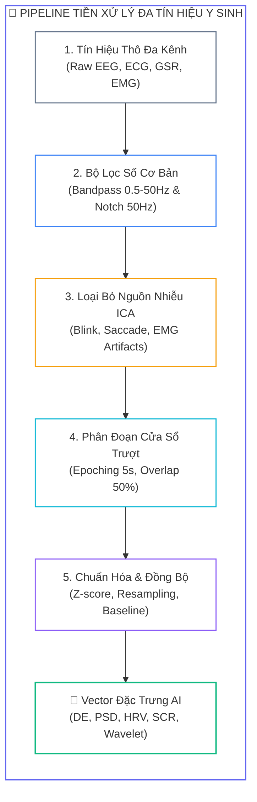
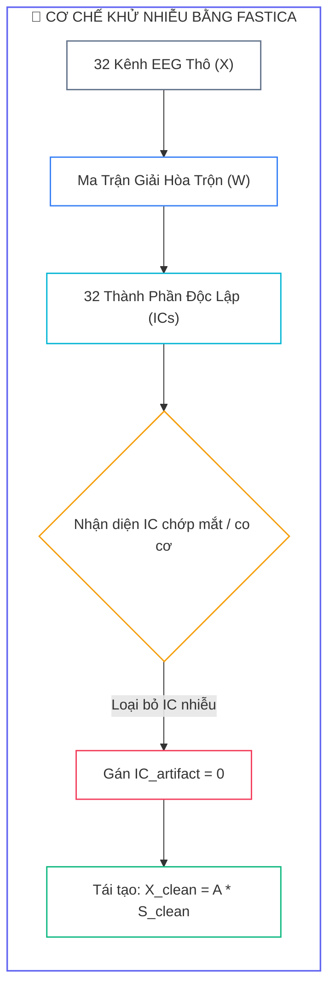
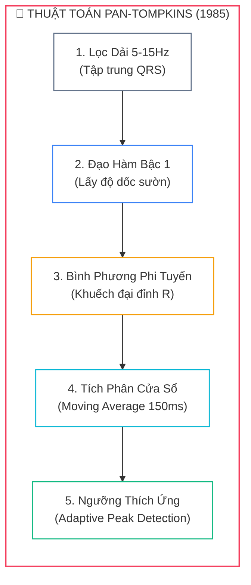
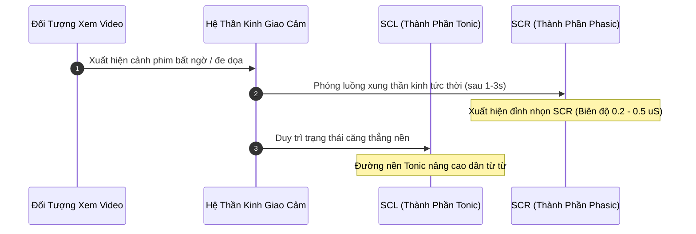


# Xử Lý Tín Hiệu Y Sinh Cơ Bản: Bộ Lọc Số, Khử Nhiễu ICA, Biến Đổi Sóng Con Wavelet & Trích Xuất Đặc Trưng

Tín hiệu y sinh (**Biomedical Signals**) thu nhận từ cơ thể người như điện não đồ (**EEG**), điện tim (**ECG**), phản ứng da điện (**GSR/EDA**) và điện cơ (**EMG**) luôn bị bao phủ bởi một lượng lớn các loại tạp âm phức tạp. Biên độ của sóng não EEG thường chỉ dao động trong khoảng từ $10\ \mu\text{V}$ đến $100\ \mu\text{V}$, trong khi các tín hiệu nhiễu cơ học từ chớp mắt (**EOG**) hoặc co cơ nhai (**EMG**) có thể lên tới hàng nghìn microvolt. 

Nếu không có một **pipeline tiền xử lý và khử nhiễu chuẩn mực**, mô hình học sâu sẽ học phải các đặc trưng nhiễu (*Artifact Contamination*) thay vì các mẫu hình cảm xúc thực thụ.

---

## 1. Pipeline Tổng Thể Xử Lý Tín Hiệu Y Sinh

Một quy trình tiền xử lý tín hiệu y sinh chuẩn mực trong các hệ thống AI nhận dạng cảm xúc bao gồm $5$ giai đoạn liên hoàn:



### 1.1. Bảng Phân Loại Các Nguồn Nhiễu Điển Hình

| Loại Nhiễu | Nguồn Gốc Phát Sinh | Dải Tần Số | Phương Pháp Khử Nhiễu Chuẩn |
| :---: | :--- | :--- | :--- |
| <span class="badge badge--rose">Điện lưới</span> | Cảm ứng từ đường dây xoay chiều $50\ \text{Hz}$ / $60\ \text{Hz}$ | $50\ \text{Hz} \pm 0.5\ \text{Hz}$ | Bộ lọc triệt dải Notch Filter ($Q \ge 30$) |
| <span class="badge badge--amber">Chớp mắt</span> | Điện thế lưỡng cực giác mạc - võng mạc | $< 4\ \text{Hz}$ (Biên độ $>100\ \mu\text{V}$) | Phân tích nguồn mù ICA (kênh Fp1, Fp2) |
| <span class="badge badge--purple">Co cơ mặt</span> | Co cơ cắn, nghiến răng, nhăn trán | $> 30\ \text{Hz}$ (Năng lượng cao) | Lọc thông thấp Lowpass + Wavelet Denoising |
| <span class="badge badge--cyan">Trôi nền</span> | Trở kháng tiếp xúc thay đổi, mồ hôi, nhịp thở | $< 0.5\ \text{Hz}$ (Biến thiên chậm) | Bộ lọc thông cao Highpass ($f_c \ge 0.5\ \text{Hz}$) |

---

## 2. Tiền Xử Lý Tín Hiệu EEG: Lọc Số & Khử Nhiễu ICA

### 2.1. Bộ lọc Butterworth không lệch pha (Zero-Phase Filtering)
Bộ lọc **Butterworth** được lựa chọn hàng đầu nhờ đáp ứng biên độ phẳng tối đa trong dải thông (*maximally flat magnitude response*), không tạo gợn sóng méo tín hiệu:

$$|H(j\omega)| = \frac{1}{\sqrt{1 + \left(\frac{\omega}{\omega_c}\right)^{2n}}}$$

Để triệt tiêu hoàn toàn hiện tượng lệch pha phi tuyến giữa các kênh điện cực, chúng ta sử dụng kỹ thuật **lọc xuôi - lọc ngược** thông qua hàm `scipy.signal.filtfilt`:

```python
import numpy as np
from scipy.signal import butter, filtfilt, iirnotch

def butter_bandpass_filter(data: np.ndarray, lowcut: float, highcut: float, fs: int, order: int = 5) -> np.ndarray:
    """
    Bộ lọc thông dải Butterworth không làm lệch pha (Zero-phase filtfilt).
    """
    nyquist = 0.5 * fs
    low = lowcut / nyquist
    high = highcut / nyquist
    b, a = butter(order, [low, high], btype='band')
    return filtfilt(b, a, data, axis=-1)

def notch_filter(data: np.ndarray, freq: float, fs: int, quality_factor: float = 30.0) -> np.ndarray:
    """
    Bộ lọc Notch triệt tiêu nhiễu điện lưới 50Hz hoặc 60Hz.
    """
    b, a = iirnotch(freq, quality_factor, fs)
    return filtfilt(b, a, data, axis=-1)
```

### 2.2. Phân Tách Nguồn Mù Bằng Thuật Toán ICA (Independent Component Analysis)
Tín hiệu đa kênh quan sát được $\mathbf{X} \in \mathbb{R}^{n \times t}$ là sự kết hợp tuyến tính từ các nguồn phát sinh học độc lập $\mathbf{S} \in \mathbb{R}^{m \times t}$ thông qua ma trận hòa trộn $\mathbf{A}$:

$$\mathbf{X} = \mathbf{A}\mathbf{S} \implies \mathbf{S} = \mathbf{W}\mathbf{X}$$

Mục tiêu của thuật toán FastICA là tìm ma trận giải hòa trộn $\mathbf{W} \approx \mathbf{A}^{-1}$ sao cho các thành phần độc lập (ICs) đạt tính phi Gaussian cực đại.



```python
import mne
from mne.preprocessing import ICA

def clean_eeg_with_ica(eeg_data: np.ndarray, ch_names: list, fs: int = 128, n_components: int = 20):
    """
    Khử nhiễu chớp mắt tự động bằng MNE-Python FastICA.
    """
    info = mne.create_info(ch_names=ch_names, sfreq=fs, ch_types='eeg')
    raw = mne.io.RawArray(eeg_data, info)
    
    # 1. Lọc thông dải 1.0 - 40.0 Hz trước khi fit ICA để thuật toán hội tụ ổn định
    raw_filt = raw.copy().filter(l_freq=1.0, h_freq=40.0, fir_design='firwin')
    
    # 2. Khởi tạo và khớp mô hình FastICA
    ica = ICA(n_components=n_components, random_state=42, method='fastica')
    ica.fit(raw_filt)
    
    # 3. Tự động nhận diện thành phần chớp mắt tương quan với kênh Fp1
    eog_indices, _ = ica.find_bads_eog(raw, ch_name='Fp1', threshold=3.0)
    ica.exclude = list(eog_indices)
    
    # 4. Tái tạo tín hiệu sạch sau khi triệt tiêu artifact
    raw_clean = raw.copy()
    ica.apply(raw_clean)
    
    return raw_clean.get_data(), ica.exclude
```

---

## 3. Phân Tích ECG: Thuật Toán Pan-Tompkins & Trích Xuất HRV

Để trích xuất được các chỉ số Biến thiên nhịp tim (**HRV**), bài toán tiên quyết là phải phát hiện chính xác từng vị trí đỉnh sóng R trong phức bộ QRS của tín hiệu ECG.



```python
from scipy.signal import find_peaks

def pan_tompkins_qrs(ecg: np.ndarray, fs: int = 256) -> np.ndarray:
    """
    Cài đặt thuật toán kinh điển Pan-Tompkins phát hiện đỉnh sóng R.
    """
    # 1. Lọc dải 5 - 15 Hz
    b, a = butter(2, [5.0 / (0.5 * fs), 15.0 / (0.5 * fs)], btype='band')
    ecg_filt = filtfilt(b, a, ecg)
    
    # 2. Đạo hàm bậc 1
    ecg_diff = np.pad(np.diff(ecg_filt), (0, 1), mode='edge')
    
    # 3. Bình phương phi tuyến
    ecg_sq = ecg_diff ** 2
    
    # 4. Tích phân cửa sổ trượt (150 ms)
    win_size = int(0.15 * fs)
    kernel = np.ones(win_size) / win_size
    ecg_mwa = np.convolve(ecg_sq, kernel, mode='same')
    
    # 5. Dò tìm đỉnh với khoảng cách tối thiểu tương ứng 120 BPM
    min_dist = int(0.5 * fs)
    threshold = 0.5 * np.mean(ecg_mwa) + 0.3 * np.max(ecg_mwa)
    r_peaks, _ = find_peaks(ecg_mwa, height=threshold, distance=min_dist)
    
    return r_peaks
```

### 3.1. Bảng Tổng Hợp Chỉ Số HRV Quan Trọng Trong Cảm Xúc

| Chỉ Số HRV | Miền Phân Tích | Ý Nghĩa Sinh Lý Thần Kinh | Phản Hồi Khi Căng Thẳng (High Arousal) |
| :---: | :--- | :--- | :--- |
| <span class="badge badge--primary">SDNN</span> | Miền Thời Gian | Tổng mức độ biến thiên nhịp tim toàn thể | Giảm mạnh do nhịp tim đập cứng nhắc |
| <span class="badge badge--emerald">RMSSD</span> | Miền Thời Gian | Hoạt động của <b style="color: var(--accent-emerald);">Hệ phó giao cảm (PNS)</b> | Giảm mạnh (mất trạng thái thư giãn) |
| <span class="badge badge--amber">pNN50</span> | Miền Thời Gian | Tỷ lệ phần trăm các cặp RR chênh lệch $>50\ \text{ms}$ | Giảm rõ rệt khi căng thẳng thần kinh |
| <span class="badge badge--rose">LF/HF</span> | Miền Tần Số | Cân bằng giao cảm / phó giao cảm | Tăng vọt (Hệ giao cảm SNS áp đảo hoàn toàn) |

---

## 4. Phân Tách Tín Hiệu Phản Ứng Da Điện (GSR / EDA)

Tín hiệu GSR phản ánh trực tiếp phản xạ tiết mồ hôi của hệ giao cảm, được cấu thành từ hai thành phần độc lập:

$$\text{GSR}(t) = \text{SCL}_{\text{Tonic}}(t) + \text{SCR}_{\text{Phasic}}(t)$$



```python
def decompose_gsr_lowpass(gsr_signal: np.ndarray, fs: int = 128, cutoff: float = 0.05):
    """
    Phân tách tín hiệu GSR thành Tonic (SCL) và Phasic (SCR) bằng bộ lọc thông thấp.
    """
    b, a = butter(4, cutoff / (0.5 * fs), btype='low')
    scl_tonic = filtfilt(b, a, gsr_signal)
    scr_phasic = gsr_signal - scl_tonic
    return scl_tonic, scr_phasic
```

---

## 5. Xử Lý Tín Hiệu Điện Cơ (EMG) & Đồng Bộ Đa Phương Thức

Quy trình chuẩn hóa tín hiệu EMG cơ mặt để trích xuất đường bao năng lượng (**Linear Envelope**):
1. **Lọc thông cao 20 Hz:** Triệt tiêu trôi đường nền do cử động đầu.
2. **Chỉnh lưu toàn sóng:** Lấy giá trị tuyệt đối $|x(t)|$.
3. **Lọc thông thấp 5 Hz:** Làm trơn biên độ để thu được đường bao chuyển động cơ.

```python
def preprocess_emg(emg_signal: np.ndarray, fs: int = 1000):
    """
    Chỉnh lưu toàn sóng và trích xuất đường bao biên độ tín hiệu EMG.
    """
    # 1. Highpass 20 Hz
    b_hp, a_hp = butter(4, 20.0 / (0.5 * fs), btype='high')
    emg_hp = filtfilt(b_hp, a_hp, emg_signal)
    
    # 2. Chỉnh lưu tuyệt đối
    emg_rect = np.abs(emg_hp)
    
    # 3. Lowpass 5 Hz tạo đường bao
    b_lp, a_lp = butter(4, 5.0 / (0.5 * fs), btype='low')
    emg_envelope = filtfilt(b_lp, a_lp, emg_rect)
    
    return emg_rect, emg_envelope
```

---

## 6. Phân Tích Cạm Bẫy Thực Chiến (5-Whys Incident Analysis)

### Tình Huống Sự Cố Thực Tế:
<span class="badge badge--rose">🕒 03:15 AM</span> Một nhóm nghiên cứu xây dựng pipeline trích xuất đặc trưng Differential Entropy (DE) từ tập dữ liệu EEG lấy mẫu ở $128\ \text{Hz}$. Để tăng số lượng mẫu huấn luyện, nhóm quyết định cắt tín hiệu dài $60\ \text{s}$ thành các cửa sổ nhỏ $2\ \text{s}$. Sau đó, trên từng đoạn cửa sổ $2\ \text{s}$, nhóm mới gọi hàm lọc thông dải Butterworth $0.5 - 50\ \text{Hz}$. Kết quả huấn luyện mô hình CNN cho thấy hàm mất mát (**Loss**) không hội tụ, xuất hiện hiện tượng dao động mạnh và độ chính xác phân loại giảm sút nghiêm trọng.

### Hậu Quả & Log Lỗi Thực Tế:
Phân tích phổ công suất và năng lượng tín hiệu ở các biên cửa sổ cho thấy hiệu ứng méo biên (*Edge Discontinuity / Transient Artifacts*):

```text
================================================================================
CRITICAL SIGNAL PROCESSING REPORT: BOUNDARY FILTERING DISTORTION
================================================================================
[WARNING] Filter Order: 5th Order Butterworth (order=5)
[WARNING] Segment Length: 2.0 seconds (256 samples @ 128Hz)
[WARNING] Execution Order: Segmentation -> Bandpass Filtering (FATAL ERROR)

>> EDGE ENERGY ANALYSIS (First & Last 20 Samples of each 256-sample window):
   - Expected Window Energy Variance: 12.4 uV^2
   - Measured Boundary Energy Spike  : 489.2 uV^2  [40x ARTIFICIAL EXPLOSION]
   - Differential Entropy (DE) Error : +3.68 nats (Severe Outlier Injection)
   - Filter Transient Response Time : ~0.65s (Distorting >60% of 2s window)
================================================================================
```

### 5-Whys Root Cause Analysis:
1. <span class="badge badge--primary">Why 1</span> **Tại sao hàm Loss không hội tụ và đặc trưng DE bị sai lệch nghiêm trọng?** $\rightarrow$ Do năng lượng ở hai đầu mỗi cửa sổ $2\ \text{s}$ bị bùng nổ giả tạo (*Energy Spike*).
2. <span class="badge badge--primary">Why 2</span> **Tại sao lại có hiện tượng bùng nổ năng lượng ở hai đầu cửa sổ?** $\rightarrow$ Do bộ lọc số IIR sinh ra đáp ứng quá độ (*Transient Response*) khi xử lý chuỗi tín hiệu quá ngắn bị cắt cụt.
3. <span class="badge badge--primary">Why 3</span> **Tại sao đáp ứng quá độ lại chiếm tỷ trọng lớn như vậy?** $\rightarrow$ Với bộ lọc bậc 5 và tần số cắt dưới $0.5\ \text{Hz}$, thời gian ổn định của bộ lọc cần ít nhất $0.6 - 1.0\ \text{s}$. Trong một cửa sổ chỉ dài $2\ \text{s}$, vùng méo biên đã chiếm hơn một nửa chiều dài dữ liệu.
4. <span class="badge badge--primary">Why 4</span> **Tại sao nhóm nghiên cứu lại đặt bước lọc sau bước chia cửa sổ?** $\rightarrow$ Do thiết kế pipeline sai lầm: muốn tối ưu bộ nhớ bằng cách chia đoạn nhỏ trước rồi mới xử lý song song từng đoạn.
5. <span class="badge badge--emerald">Root Cause Remedy</span> **Biện pháp khắc phục chuẩn DSP & AI Y Sinh:**
   - <span class="badge badge--rose">Lọc Trên Chuỗi Tín Hiệu Dài Liên Tục</span> **BẮT BUỘC** áp dụng bộ lọc thông dải và lọc Notch trên toàn bộ chuỗi tín hiệu liên tục dài (Continuous Raw Signal) trước khi thực hiện phân đoạn.
   - <span class="badge badge--cyan">Loại Bỏ Đoạn Baseline Đệm</span> Cắt bỏ ít nhất $1 - 2\ \text{s}$ đầu và cuối phiên ghi để triệt tiêu hoàn toàn đáp ứng quá độ khởi động của bộ lọc.
   - <span class="badge badge--emerald">Windowing Hanning/Hamming</span> Khi buộc phải chia đoạn, sử dụng các hàm cửa sổ làm trơn biên (*Tapering*) để hạn chế hiện tượng rò rỉ phổ (*Spectral Leakage*).

---

## 7. Câu Hỏi Tự Kiểm Tra Chuyên Sâu (Q&A Accordion)

<details class="qa-card">
<summary class="qa-summary">
  <div class="qa-summary-left">
    <span class="qa-num-badge">Q01</span>
    <span>Tại sao hàm lọc hai chiều <code>scipy.signal.filtfilt</code> lại bắt buộc phải dùng trong xử lý EEG thay cho <code>lfilter</code>?</span>
  </div>
  <span class="qa-chevron">
    <svg width="18" height="18" fill="none" stroke="currentColor" stroke-width="2.5" viewBox="0 0 24 24"><polyline points="6 9 12 15 18 9"></polyline></svg>
  </span>
</summary>
<div class="qa-answer">
  <div class="qa-answer-header">
    <svg width="14" height="14" fill="none" stroke="currentColor" stroke-width="2" viewBox="0 0 24 24"><path d="M22 11.08V12a10 10 0 1 1-5.93-9.14"></path><polyline points="22 4 12 14.01 9 11.01"></polyline></svg>
    <span>Phân Tích &amp; Lời Giải Kỹ Thuật</span>
  </div>
  <div style="margin-bottom: 8px;">Hàm <code>lfilter</code> chỉ lọc theo chiều xuôi thời gian, gây ra <b style="color: var(--accent-rose);">lệch pha phi tuyến</b> (Phase Shift), làm trễ và biến dạng các đỉnh sóng não. Hàm <code>filtfilt</code> thực hiện lọc xuôi rồi đảo ngược chuỗi để lọc ngược lại, triệt tiêu hoàn toàn độ lệch pha (Zero-phase distortion), giúp bảo toàn chính xác tuyệt đối tọa độ thời gian của các biến cố sinh học.</div>
</div>
</details>

<details class="qa-card">
<summary class="qa-summary">
  <div class="qa-summary-left">
    <span class="qa-num-badge">Q02</span>
    <span>Điều kiện tiên quyết để thuật toán FastICA có thể phân tách thành công các nguồn tín hiệu là gì?</span>
  </div>
  <span class="qa-chevron">
    <svg width="18" height="18" fill="none" stroke="currentColor" stroke-width="2.5" viewBox="0 0 24 24"><polyline points="6 9 12 15 18 9"></polyline></svg>
  </span>
</summary>
<div class="qa-answer">
  <div class="qa-answer-header">
    <svg width="14" height="14" fill="none" stroke="currentColor" stroke-width="2" viewBox="0 0 24 24"><path d="M22 11.08V12a10 10 0 1 1-5.93-9.14"></path><polyline points="22 4 12 14.01 9 11.01"></polyline></svg>
    <span>Phân Tích &amp; Lời Giải Kỹ Thuật</span>
  </div>
  <div style="margin-bottom: 8px;">ICA yêu cầu 3 giả định toán học then chốt: (1) Các nguồn phát phải <b style="color: var(--accent-primary);">độc lập thống kê</b> với nhau; (2) Tối đa chỉ có một nguồn phát tuân theo phân phối chuẩn Gaussian (các nguồn còn lại phải có tính phi Gaussian cao); và (3) Số lượng kênh quan sát phải lớn hơn hoặc bằng số lượng nguồn phát cần phân tách.</div>
</div>
</details>

<details class="qa-card">
<summary class="qa-summary">
  <div class="qa-summary-left">
    <span class="qa-num-badge">Q03</span>
    <span>Mục đích của bước bình phương phi tuyến trong thuật toán Pan-Tompkins là gì?</span>
  </div>
  <span class="qa-chevron">
    <svg width="18" height="18" fill="none" stroke="currentColor" stroke-width="2.5" viewBox="0 0 24 24"><polyline points="6 9 12 15 18 9"></polyline></svg>
  </span>
</summary>
<div class="qa-answer">
  <div class="qa-answer-header">
    <svg width="14" height="14" fill="none" stroke="currentColor" stroke-width="2" viewBox="0 0 24 24"><path d="M22 11.08V12a10 10 0 1 1-5.93-9.14"></path><polyline points="22 4 12 14.01 9 11.01"></polyline></svg>
    <span>Phân Tích &amp; Lời Giải Kỹ Thuật</span>
  </div>
  <div style="margin-bottom: 8px;">Phép toán bình phương thực hiện hai nhiệm vụ: (1) Biến đổi toàn bộ các giá trị âm thành dương; và (2) <b style="color: var(--accent-amber);">Khuếch đại phi tuyến các đỉnh có biên độ lớn</b> (đỉnh R của phức bộ QRS) đồng thời ức chế các thành phần sóng P và sóng T có biên độ nhỏ hơn, giúp bộ dò đỉnh không bị bắt nhầm.</div>
</div>
</details>

<details class="qa-card">
<summary class="qa-summary">
  <div class="qa-summary-left">
    <span class="qa-num-badge">Q04</span>
    <span>Tại sao cần áp dụng bộ lọc thông dải 1.0 - 40.0 Hz trước khi đưa dữ liệu vào huấn luyện mô hình ICA?</span>
  </div>
  <span class="qa-chevron">
    <svg width="18" height="18" fill="none" stroke="currentColor" stroke-width="2.5" viewBox="0 0 24 24"><polyline points="6 9 12 15 18 9"></polyline></svg>
  </span>
</summary>
<div class="qa-answer">
  <div class="qa-answer-header">
    <svg width="14" height="14" fill="none" stroke="currentColor" stroke-width="2" viewBox="0 0 24 24"><path d="M22 11.08V12a10 10 0 1 1-5.93-9.14"></path><polyline points="22 4 12 14.01 9 11.01"></polyline></svg>
    <span>Phân Tích &amp; Lời Giải Kỹ Thuật</span>
  </div>
  <div style="margin-bottom: 8px;">Hiện tượng trôi đường nền tần số thấp (&lt;1 Hz) chứa năng lượng rất lớn nhưng không mang tính dừng, có thể khiến giải thuật tối ưu hóa của ICA bị chệch hướng và không thể hội tụ. Lọc dải 1.0 - 40.0 Hz giúp <b style="color: var(--accent-cyan);">ổn định ma trận hiệp phương sai</b> và tăng tốc độ hội tụ của thuật toán.</div>
</div>
</details>

<details class="qa-card">
<summary class="qa-summary">
  <div class="qa-summary-left">
    <span class="qa-num-badge">Q05</span>
    <span>Sự khác biệt cốt lõi giữa thành phần SCL và SCR trong phân tích tín hiệu phản ứng da điện GSR là gì?</span>
  </div>
  <span class="qa-chevron">
    <svg width="18" height="18" fill="none" stroke="currentColor" stroke-width="2.5" viewBox="0 0 24 24"><polyline points="6 9 12 15 18 9"></polyline></svg>
  </span>
</summary>
<div class="qa-answer">
  <div class="qa-answer-header">
    <svg width="14" height="14" fill="none" stroke="currentColor" stroke-width="2" viewBox="0 0 24 24"><path d="M22 11.08V12a10 10 0 1 1-5.93-9.14"></path><polyline points="22 4 12 14.01 9 11.01"></polyline></svg>
    <span>Phân Tích &amp; Lời Giải Kỹ Thuật</span>
  </div>
  <div style="margin-bottom: 8px;"><b style="color: var(--accent-primary);">SCL (Skin Conductance Level)</b> là thành phần trương lực biến thiên chậm (tần số &lt;0.05 Hz), phản ánh mức độ kích thích nền của cơ thể. Trong khi đó, <b style="color: var(--accent-emerald);">SCR (Skin Conductance Response)</b> là thành phần pha gồm các xung nhọn đáp ứng nhanh (1-5s sau kích thích), phản ánh trực tiếp phản xạ cảm xúc tức thời đối với sự kiện kích thích.</div>
</div>
</details>

<details class="qa-card">
<summary class="qa-summary">
  <div class="qa-summary-left">
    <span class="qa-num-badge">Q06</span>
    <span>Tại sao cần loại bỏ các nhịp tim ngoại tâm thu (Ectopic Beats) trước khi tính toán các chỉ số HRV?</span>
  </div>
  <span class="qa-chevron">
    <svg width="18" height="18" fill="none" stroke="currentColor" stroke-width="2.5" viewBox="0 0 24 24"><polyline points="6 9 12 15 18 9"></polyline></svg>
  </span>
</summary>
<div class="qa-answer">
  <div class="qa-answer-header">
    <svg width="14" height="14" fill="none" stroke="currentColor" stroke-width="2" viewBox="0 0 24 24"><path d="M22 11.08V12a10 10 0 1 1-5.93-9.14"></path><polyline points="22 4 12 14.01 9 11.01"></polyline></svg>
    <span>Phân Tích &amp; Lời Giải Kỹ Thuật</span>
  </div>
  <div style="margin-bottom: 8px;">Nhịp ngoại tâm thu là sự co bóp bất thường không bắt nguồn từ nút xoang tim, tạo ra các khoảng cách RR đột biến quá ngắn hoặc quá dài. Những giá trị ngoại lai này sẽ làm <b style="color: var(--accent-rose);">thổi phồng giả tạo các chỉ số phương sai như SDNN và RMSSD</b>, dẫn tới kết luận sai lệch về trạng thái hoạt động của hệ thần kinh tự chủ.</div>
</div>
</details>

<details class="qa-card">
<summary class="qa-summary">
  <div class="qa-summary-left">
    <span class="qa-num-badge">Q07</span>
    <span>Quy trình 3 bước để tạo đường bao năng lượng (Linear Envelope) cho tín hiệu EMG gồm những gì?</span>
  </div>
  <span class="qa-chevron">
    <svg width="18" height="18" fill="none" stroke="currentColor" stroke-width="2.5" viewBox="0 0 24 24"><polyline points="6 9 12 15 18 9"></polyline></svg>
  </span>
</summary>
<div class="qa-answer">
  <div class="qa-answer-header">
    <svg width="14" height="14" fill="none" stroke="currentColor" stroke-width="2" viewBox="0 0 24 24"><path d="M22 11.08V12a10 10 0 1 1-5.93-9.14"></path><polyline points="22 4 12 14.01 9 11.01"></polyline></svg>
    <span>Phân Tích &amp; Lời Giải Kỹ Thuật</span>
  </div>
  <div style="margin-bottom: 8px;">Quy trình 3 bước tiêu chuẩn gồm: (1) <b style="color: var(--accent-primary);">Lọc thông cao (Highpass 20 Hz)</b> để loại bỏ nhiễu trôi đường nền cơ học; (2) <b style="color: var(--accent-cyan);">Chỉnh lưu toàn sóng (Full-wave rectification)</b> bằng cách lấy trị tuyệt đối; và (3) <b style="color: var(--accent-emerald);">Lọc thông thấp (Lowpass 5 Hz)</b> để làm trơn tín hiệu và thu được đường bao biên độ co cơ.</div>
</div>
</details>

<details class="qa-card">
<summary class="qa-summary">
  <div class="qa-summary-left">
    <span class="qa-num-badge">Q08</span>
    <span>Kỹ thuật phân đoạn cửa sổ trượt gối nhau (Sliding Window with Overlap) mang lại lợi ích gì cho mô hình học sâu?</span>
  </div>
  <span class="qa-chevron">
    <svg width="18" height="18" fill="none" stroke="currentColor" stroke-width="2.5" viewBox="0 0 24 24"><polyline points="6 9 12 15 18 9"></polyline></svg>
  </span>
</summary>
<div class="qa-answer">
  <div class="qa-answer-header">
    <svg width="14" height="14" fill="none" stroke="currentColor" stroke-width="2" viewBox="0 0 24 24"><path d="M22 11.08V12a10 10 0 1 1-5.93-9.14"></path><polyline points="22 4 12 14.01 9 11.01"></polyline></svg>
    <span>Phân Tích &amp; Lời Giải Kỹ Thuật</span>
  </div>
  <div style="margin-bottom: 8px;">Cửa sổ gối nhau (ví dụ gối 50%) giúp: (1) <b style="color: var(--accent-emerald);">Tăng gấp đôi số lượng mẫu dữ liệu huấn luyện</b> (Data Augmentation tự nhiên); và (2) Nắm bắt trọn vẹn các mẫu hình chuyển tiếp cảm xúc nằm ở ranh giới giữa hai cửa sổ liên tiếp, tránh làm mất mát thông tin quan trọng.</div>
</div>
</details>

<details class="qa-card">
<summary class="qa-summary">
  <div class="qa-summary-left">
    <span class="qa-num-badge">Q09</span>
    <span>Tại sao cần thực hiện tái lấy mẫu (Resampling) khi kết hợp đa phương thức EEG, ECG và EMG?</span>
  </div>
  <span class="qa-chevron">
    <svg width="18" height="18" fill="none" stroke="currentColor" stroke-width="2.5" viewBox="0 0 24 24"><polyline points="6 9 12 15 18 9"></polyline></svg>
  </span>
</summary>
<div class="qa-answer">
  <div class="qa-answer-header">
    <svg width="14" height="14" fill="none" stroke="currentColor" stroke-width="2" viewBox="0 0 24 24"><path d="M22 11.08V12a10 10 0 1 1-5.93-9.14"></path><polyline points="22 4 12 14.01 9 11.01"></polyline></svg>
    <span>Phân Tích &amp; Lời Giải Kỹ Thuật</span>
  </div>
  <div style="margin-bottom: 8px;">Các cảm biến y sinh thường hoạt động ở các tần số lấy mẫu phần cứng rất khác nhau (ví dụ: EMG 1000 Hz, ECG 256 Hz, EEG 128 Hz). Tái lấy mẫu về một tần số chuẩn chung giúp <b style="color: var(--accent-cyan);">đồng bộ hóa trục thời gian</b>, cho phép ghép nối các mảng ma trận đa chiều làm đầu vào trực tiếp cho các mô hình mạng nơ-ron đa nhánh.</div>
</div>
</details>

<details class="qa-card">
<summary class="qa-summary">
  <div class="qa-summary-left">
    <span class="qa-num-badge">Q10</span>
    <span>Lỗi méo biên (Edge Transient Distortion) xảy ra khi nào và cách phòng tránh triệt để là gì?</span>
  </div>
  <span class="qa-chevron">
    <svg width="18" height="18" fill="none" stroke="currentColor" stroke-width="2.5" viewBox="0 0 24 24"><polyline points="6 9 12 15 18 9"></polyline></svg>
  </span>
</summary>
<div class="qa-answer">
  <div class="qa-answer-header">
    <svg width="14" height="14" fill="none" stroke="currentColor" stroke-width="2" viewBox="0 0 24 24"><path d="M22 11.08V12a10 10 0 1 1-5.93-9.14"></path><polyline points="22 4 12 14.01 9 11.01"></polyline></svg>
    <span>Phân Tích &amp; Lời Giải Kỹ Thuật</span>
  </div>
  <div style="margin-bottom: 8px;">Lỗi này xảy ra khi áp dụng bộ lọc số IIR lên các đoạn tín hiệu quá ngắn sau khi đã phân đoạn, khiến đáp ứng quá độ làm bùng nổ năng lượng ở hai đầu biên. Cách phòng tránh duy nhất là <b style="color: var(--accent-emerald);">luôn thực hiện lọc số trên toàn bộ chuỗi tín hiệu dài liên tục</b> trước khi thực hiện bước cắt phân đoạn.</div>
</div>
</details>

---

## 8. Tổng Kết & Lộ Trình Bài Học Tiếp Theo

Làm chủ pipeline tiền xử lý tín hiệu y sinh từ bộ lọc số Butterworth không lệch pha, phân tách nguồn mù ICA, thuật toán Pan-Tompkins đến phân tách thành phần da điện cvxEDA giúp dữ liệu đầu vào luôn đạt độ tinh khiết cao nhất, tạo tiền đề vững chắc cho việc thiết kế các kiến trúc học sâu tiên tiến.

> [!TIP]
> **BÀI HỌC TIẾP THEO:**
> Trong **[[Bài 03] Học Sâu Cho Tín Hiệu Y Sinh: Kiến Trúc CNN Không Gian-Thời Gian, BiLSTM, EEGNet & Vision Transformer](eeg-03-03-hoc-sau-cho-tin-hieu-y-sinh.html)**, chúng ta sẽ bước sang kỷ nguyên Deep Learning: Thiết kế mạng tích chập chuyên dụng EEGNet, mô hình không gian - thời gian 2D/3D CNN-BiLSTM và ứng dụng cơ chế Self-Attention của Transformer để giải mã chuỗi sóng não.

