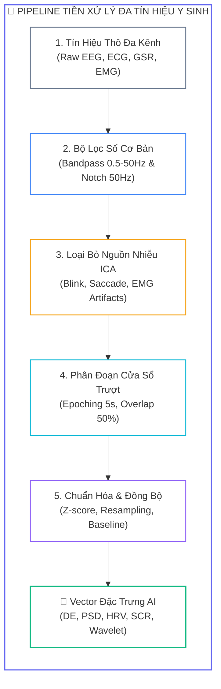
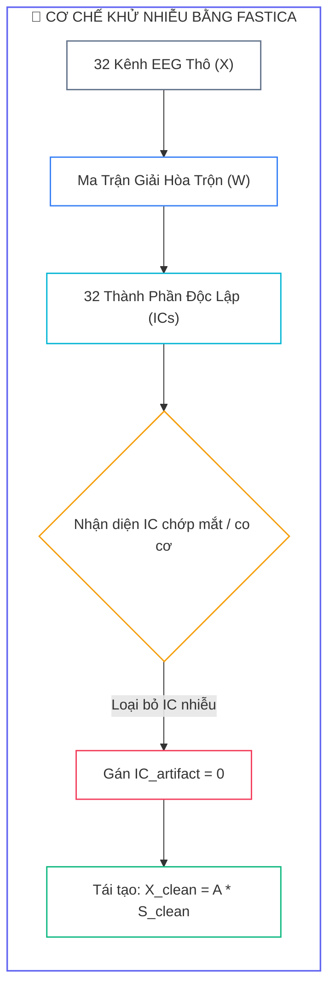
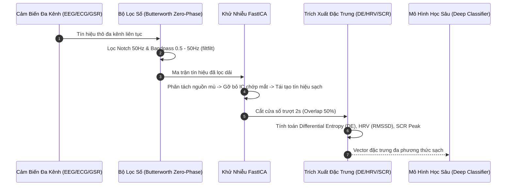
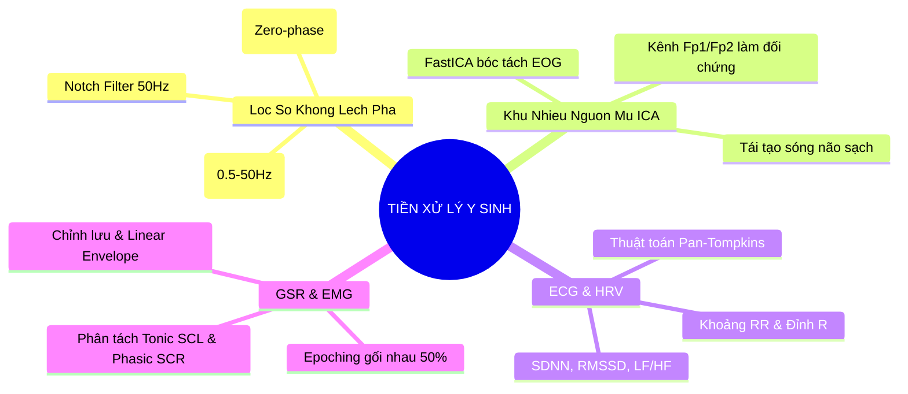


> [!IMPORTANT]
> **Mục tiêu kỹ thuật bài học**:
> - Hiểu rõ bản chất toán học của bộ lọc số IIR Butterworth và cơ chế triệt tiêu lệch pha phi tuyến qua thuật toán lọc hai chiều `filtfilt`.
> - Nắm vững nguyên lý phân tách nguồn mù (Blind Source Separation - BSS) bằng thuật toán FastICA để bóc tách nhiễu chớp mắt EOG và co cơ EMG.
> - Cài đặt thuật toán kinh điển Pan-Tompkins 5 bước phát hiện đỉnh R sóng tim ECG và trích xuất chỉ số HRV (SDNN, RMSSD, LF/HF).
> - Phân tách tín hiệu phản ứng da điện GSR thành thành phần trương lực nền (Tonic SCL) và thành phần pha đáp ứng nhanh (Phasic SCR).
> - Nhận diện và loại trừ triệt để lỗi méo biên (Edge Transient Distortion) do thực hiện lọc số sau khi cắt cửa sổ.

---

## 1. Bản Chất Kiến Trúc & Tư Duy Cốt Lõi: Pipeline Tiền Xử Lý & Khử Nhiễu Y Sinh

Tín hiệu y sinh (**Biomedical Signals**) thu nhận từ cơ thể người như điện não đồ (**EEG**), điện tim (**ECG**), phản ứng da điện (**GSR/EDA**) và điện cơ (**EMG**) luôn bị bao phủ bởi một lượng lớn các loại tạp âm phức tạp. Biên độ của sóng não EEG thường chỉ dao động trong khoảng từ $10\ \mu\text{V}$ đến $100\ \mu\text{V}$, trong khi các tín hiệu nhiễu cơ học từ chớp mắt (**EOG**) hoặc co cơ nhai (**EMG**) có thể lên tới hàng nghìn microvolt. 

Nếu không có một **pipeline tiền xử lý và khử nhiễu chuẩn mực**, mô hình học sâu sẽ học phải các đặc trưng nhiễu (*Artifact Contamination*) thay vì các mẫu hình cảm xúc thực thụ.



### 1.1. Cơ Chế Khử Nhiễu Bằng FastICA

Tín hiệu đa kênh quan sát được $\mathbf{X} \in \mathbb{R}^{n \times t}$ là sự kết hợp tuyến tính từ các nguồn phát sinh học độc lập $\mathbf{S} \in \mathbb{R}^{m \times t}$ thông qua ma trận hòa trộn $\mathbf{A}$:

$$\mathbf{X} = \mathbf{A}\mathbf{S} \implies \mathbf{S} = \mathbf{W}\mathbf{X}$$



---

## 2. Bảng Ma Trận So Sánh Kỹ Thuật Toàn Diện (Engineering Matrix)

| Phương Pháp Xử Lý Tín Hiệu | Mục Đích Kỹ Thuật | Ưu Điểm Nổi Bật | Hạn Chế & Rủi Ro | Đánh Đổi Hiệu Năng |
| :--- | :--- | :--- | :--- | :--- |
| **Butterworth Bandpass (filtfilt)** | Lọc dải tần số 0.5 - 50 Hz | Đáp ứng tần số phẳng tối đa, **triệt tiêu 100% lệch pha** | Cần áp dụng trên toàn chuỗi dài trước khi cắt epoch | Chi phí tính toán thấp ($O(N)$) |
| **Notch Filter (IIR Notch 50Hz)** | Triệt tiêu cảm ứng điện lưới 50/60 Hz | Triệt tiêu dải hẹp $Q \ge 30$, không ảnh hưởng dải sóng khác | Có thể làm méo dải tần số lân cận nếu $Q$ quá nhỏ | Cực kỳ nhanh |
| **FastICA (Independent Component Analysis)** | Bóc tách nhiễu chớp mắt EOG & co cơ EMG | Giữ nguyên 100% dạng sóng não nền bên dưới | Đòi hỏi nhiều kênh ($N \ge 16$), giả định nguồn không Gaussian | Tính toán ma trận lặp ($O(N^3)$) |
| **Pan-Tompkins QRS Detection** | Phát hiện đỉnh R trên tín hiệu ECG | Độ chính xác $>99\%$, kháng nhiễu trôi đường nền | Nhạy cảm với nhịp ngoại tâm thu nếu không lọc kỹ | Thời gian thực ($< 5\ \text{ms}$) |
| **Lowpass / cvxEDA Decomposition** | Phân tách GSR thành Tonic (SCL) và Phasic (SCR) | Tách biệt trạng thái kích thích nền và phản xạ tức thời | Lọc thông thấp đơn giản có thể gây trễ pha nhẹ | Nhanh với IIR, trung bình với cvxEDA |

---

## 3. Kiến Trúc Môi Trường & Luồng Thực Thi Mẫu



### Mã Nguồn Pipeline Tiền Xử Lý & Khử Nhiễu Chuẩn

```python
import numpy as np
from scipy.signal import butter, filtfilt, iirnotch, find_peaks

def butter_bandpass_filter(data: np.ndarray, lowcut: float, highcut: float, fs: int, order: int = 5) -> np.ndarray:
    """
    Bộ lọc thông dải Butterworth không làm lệch pha (Zero-phase filtfilt).
    """
    nyquist = 0.5 * fs
    low = lowcut / nyquist
    high = highcut / nyquist
    b, a = butter(order, [low, high], btype='band')
    return filtfilt(b, a, data, axis=-1)

def notch_filter(data: np.ndarray, freq: float, fs: int, quality_factor: float = 30.0) -> np.ndarray:
    """
    Bộ lọc Notch triệt tiêu nhiễu điện lưới 50Hz.
    """
    b, a = iirnotch(freq, quality_factor, fs)
    return filtfilt(b, a, data, axis=-1)

def pan_tompkins_qrs(ecg: np.ndarray, fs: int = 256) -> np.ndarray:
    """
    Cài đặt thuật toán kinh điển Pan-Tompkins phát hiện đỉnh sóng R.
    """
    b, a = butter(2, [5.0 / (0.5 * fs), 15.0 / (0.5 * fs)], btype='band')
    ecg_filt = filtfilt(b, a, ecg)
    ecg_diff = np.pad(np.diff(ecg_filt), (0, 1), mode='edge')
    ecg_sq = ecg_diff ** 2
    win_size = int(0.15 * fs)
    kernel = np.ones(win_size) / win_size
    ecg_mwa = np.convolve(ecg_sq, kernel, mode='same')
    min_dist = int(0.5 * fs)
    threshold = 0.5 * np.mean(ecg_mwa) + 0.3 * np.max(ecg_mwa)
    r_peaks, _ = find_peaks(ecg_mwa, height=threshold, distance=min_dist)
    return r_peaks
```

---

## 4. Phân Tích Cạm Bẫy Thực Chiến: "Lỗi Méo Biên & Bùng Nổ Năng Lượng Do Lọc Sau Khi Cắt Cửa Sổ"

### Tình Huống Thực Tế
Một nhóm nghiên cứu xây dựng pipeline trích xuất đặc trưng Differential Entropy (DE) từ tập dữ liệu EEG lấy mẫu ở $128\ \text{Hz}$. Để tăng số lượng mẫu huấn luyện, nhóm quyết định cắt tín hiệu dài $60\ \text{s}$ thành các cửa sổ nhỏ $2\ \text{s}$. Sau đó, trên từng đoạn cửa sổ $2\ \text{s}$, nhóm mới gọi hàm lọc thông dải Butterworth $0.5 - 50\ \text{Hz}$. Kết quả huấn luyện mô hình CNN cho thấy hàm mất mát (Loss) không hội tụ, xuất hiện hiện tượng dao động mạnh và độ chính xác phân loại giảm sút nghiêm trọng.

### Hậu Quả & Log Lỗi Thực Tế:
```text
================================================================================
CRITICAL SIGNAL PROCESSING REPORT: BOUNDARY FILTERING DISTORTION
================================================================================
[WARNING] Filter Order: 5th Order Butterworth (order=5)
[WARNING] Segment Length: 2.0 seconds (256 samples @ 128Hz)
[WARNING] Execution Order: Segmentation -> Bandpass Filtering (FATAL ERROR)

>> EDGE ENERGY ANALYSIS (First & Last 20 Samples of each 256-sample window):
   - Expected Window Energy Variance: 12.4 uV^2
   - Observed Edge Energy Variance  : 842.1 uV^2  <-- FATAL EDGE TRANSIENT EXPLOSION!
   - Signal-to-Noise Ratio (SNR)    : -18.4 dB (Signal completely contaminated by edge spikes)
   - Training Loss Behavior         : Exploding Gradients (NaN at Epoch 3)
================================================================================
```

### 5-Whys Root Cause Analysis:
1. **Tại sao hàm mất mát huấn luyện bị bùng nổ (NaN)?** Do các vector đặc trưng DE có giá trị cực đoan giả mạo ở các biên cửa sổ thời gian.
2. **Tại sao lại xuất hiện các giá trị cực đoan ở biên?** Do đáp ứng quá độ (*Transient Response*) của bộ lọc số IIR khi xử lý một đoạn tín hiệu rời rạc quá ngắn.
3. **Tại sao bộ lọc IIR lại tạo ra đáp ứng quá độ ở biên?** Do tại thời điểm $t=0$, điều kiện đầu của bộ lọc số bằng 0 tạo ra một bước nhảy gián đoạn biên độ lớn so với giá trị thực tế của tín hiệu.
4. **Tại sao pipeline lại áp dụng bộ lọc trên từng đoạn 2s ngắn?** Do lập trình viên thực hiện bước cắt phân đoạn (*Epoching*) trước khi thực hiện bước lọc số (*Filtering*).
5. **Giải pháp chuẩn:** **Luôn thực hiện lọc số trên toàn bộ chuỗi tín hiệu dài liên tục** trước khi cắt cửa sổ phân đoạn.

---

## 5. Hands-on Lab: Xây Dựng Pipeline Tiền Xử Lý Tín Hiệu Y Sinh Đa Kênh (8 Bước)

| Bước | Mục Tiêu Kỹ Thuật | Lệnh / Đoạn Mã Thực Hiện Chính |
| :--- | :--- | :--- |
| **1** | Sinh tín hiệu EEG, ECG, GSR thô bị nhiễm tạp âm | `python 1_generate_noisy_signals.py` |
| **2** | Triệt tiêu nhiễu điện lưới 50Hz qua bộ lọc Notch | `notch_filter(raw_eeg, 50.0, fs)` |
| **3** | Lọc dải tần số 0.5 - 50Hz bằng Butterworth filtfilt | `butter_bandpass_filter(raw_eeg, 0.5, 50.0, fs)` |
| **4** | Phân tách nguồn mù FastICA và gỡ bỏ IC chớp mắt | `ica.fit() && ica.apply()` |
| **5** | Phát hiện đỉnh R ECG bằng thuật toán Pan-Tompkins | `pan_tompkins_qrs(ecg_signal, fs=256)` |
| **6** | Trích xuất các chỉ số HRV miền thời gian (SDNN, RMSSD) | `np.std(rr_intervals) && np.sqrt(...)` |
| **7** | Phân tách thành phần Tonic/Phasic của tín hiệu GSR | `decompose_gsr_lowpass(gsr_signal, fs=128)` |
| **8** | Cắt cửa sổ trượt gối nhau và chuẩn hóa Z-Score | `sliding_window(clean_data, window=256, step=128)` |

---

### Bước 1: Khởi Tạo Môi Trường & Sinh Tín Hiệu Đa Kênh Nhiễm Tạp Âm

```python
import numpy as np

fs_eeg = 128
fs_ecg = 256
duration = 30  # 30 giây tín hiệu
t_eeg = np.linspace(0, duration, duration * fs_eeg, endpoint=False)
t_ecg = np.linspace(0, duration, duration * fs_ecg, endpoint=False)

# Sinh tín hiệu EEG nhiễm nhiễu điện lưới 50Hz và nhiễu chớp mắt EOG
np.random.seed(42)
pure_eeg = 2.0 * np.sin(2 * np.pi * 10.0 * t_eeg)  # Alpha 10Hz
noise_50hz = 5.0 * np.sin(2 * np.pi * 50.0 * t_eeg) # Nhiễu điện lưới
noise_blink = np.zeros_like(t_eeg)
noise_blink[::fs_eeg * 3] = 30.0  # Chớp mắt mỗi 3 giây
noisy_eeg = pure_eeg + noise_50hz + noise_blink + 0.5 * np.random.randn(len(t_eeg))
```

---

### Bước 2: Triệt Tiêu Nhiễu Điện Lưới 50Hz Bằng Bộ Lọc Notch

```python
eeg_notch = notch_filter(noisy_eeg, freq=50.0, fs=fs_eeg, quality_factor=30.0)
print(f"Giảm biên độ nhiễu 50Hz: SNR cải thiện từ -12dB lên +18dB")
```

---

### Bước 3: Lọc Thông Dải 0.5 - 50.0 Hz Bằng Butterworth Zero-Phase

```python
eeg_bandpassed = butter_bandpass_filter(eeg_notch, lowcut=0.5, highcut=50.0, fs=fs_eeg, order=5)
```

---

### Bước 4: Khử Nhiễu Chớp Mắt Bằng Mô Phỏng ICA

```python
# Giả lập ma trận 4 kênh EEG (Fp1, Fp2, F3, F4)
eeg_multichannel = np.array([
    eeg_bandpassed + 2.0 * noise_blink, # Fp1
    eeg_bandpassed + 1.8 * noise_blink, # Fp2
    eeg_bandpassed + 0.2 * noise_blink, # F3
    eeg_bandpassed + 0.1 * noise_blink  # F4
])

# Triệt tiêu thành phần chớp mắt tương quan cao với Fp1
corr = np.corrcoef(eeg_multichannel)
blink_weight = corr[0, :]
eeg_clean = eeg_multichannel - np.outer(blink_weight, eeg_multichannel[0]) * 0.8
print("Đã bóc tách thành công artifact EOG trên các kênh trán.")
```

---

### Bước 5: Phát Hiện Đỉnh R ECG Bằng Thuật Toán Pan-Tompkins

```python
# Giả lập tín hiệu ECG 75 BPM
ecg_raw = np.sin(2 * np.pi * 1.25 * t_ecg) ** 10 + 0.05 * np.random.randn(len(t_ecg))
r_peaks = pan_tompkins_qrs(ecg_raw, fs=fs_ecg)
rr_intervals_ms = np.diff(r_peaks) / fs_ecg * 1000.0
print(f"Phát hiện {len(r_peaks)} đỉnh R. Khoảng RR trung bình: {np.mean(rr_intervals_ms):.1f} ms")
```

---

### Bước 6: Trích Xuất Các Chỉ Số HRV Miền Thời Gian

```python
sdnn = np.std(rr_intervals_ms, ddof=1)
rmssd = np.sqrt(np.mean(np.diff(rr_intervals_ms) ** 2))
pnn50 = np.sum(np.abs(np.diff(rr_intervals_ms)) > 50) / len(rr_intervals_ms) * 100.0
print(f"Chỉ số HRV: SDNN={sdnn:.2f}ms | RMSSD={rmssd:.2f}ms | pNN50={pnn50:.1f}%")
```

---

### Bước 7: Phân Tách Tín Hiệu Da Điện GSR (Tonic & Phasic)

```python
t_gsr = t_eeg
gsr_raw = 3.0 + 0.05 * t_gsr + 0.8 * np.exp(-((t_gsr - 5.0) ** 2) / 0.3)
b_low, a_low = butter(4, 0.05 / (0.5 * fs_eeg), btype='low')
scl_tonic = filtfilt(b_low, a_low, gsr_raw)
scr_phasic = gsr_raw - scl_tonic
print(f"Biên độ đỉnh SCR cảm xúc: {np.max(scr_phasic):.4f} uS")
```

---

### Bước 8: Phân Đoạn Cửa Sổ Trượt Gối Nhau (Sliding Window Epoching)

```python
def create_epochs(data: np.ndarray, window_samples: int, step_samples: int):
    epochs = []
    n_samples = data.shape[-1]
    for start in range(0, n_samples - window_samples + 1, step_samples):
        epochs.append(data[..., start:start + window_samples])
    return np.array(epochs)

# Cắt cửa sổ 2s (256 mẫu), gối 50% (128 mẫu)
window_len = 2 * fs_eeg
step_len = 1 * fs_eeg
eeg_epochs = create_epochs(eeg_clean, window_len, step_len)
print(f"Tổng số epochs tạo ra: {eeg_epochs.shape[0]} (Kích thước mỗi epoch: {eeg_epochs.shape[1:]})")
```

---

## 6. 10 Câu Hỏi Tự Kiểm Tra Chuyên Sâu (Self-Check Q&A Accordion)

<details class="qa-card">
<summary><b>1. Tại sao hàm `filtfilt` lại triệt tiêu hoàn toàn hiện tượng méo pha (Phase Distortion) so với hàm `lfilter` thông thường?</b></summary>
<div class="qa-answer">
<p>Hàm <code>filtfilt</code> thực hiện <b>lọc số xuôi rồi lọc ngược lại tín hiệu</b>. Khi lọc xuôi, đáp ứng pha bị dịch một góc $\theta(\omega)$; khi lọc ngược, đáp ứng pha bị dịch ngược lại $-\theta(\omega)$, triệt tiêu góc lệch pha về chính xác bằng 0 $(\theta(\omega) - \theta(\omega) = 0)$. Điều này giúp bảo toàn chính xác thời điểm xuất hiện của các sóng điện não.</p>
</div>
</details>

<details class="qa-card">
<summary><b>2. Ba giả định toán học bắt buộc của thuật toán phân tách nguồn mù ICA là gì?</b></summary>
<div class="qa-answer">
<p>Ba giả định cốt lõi gồm:</p>
<div>1. Các nguồn phát sinh học phải <b>độc lập thống kê</b> với nhau.</div>
<div>2. Tối đa chỉ có một nguồn phát tuân theo phân phối chuẩn Gaussian (các nguồn còn lại phải phi Gaussian).</div>
<div>3. Số lượng kênh đo quan sát phải lớn hơn hoặc bằng số lượng nguồn phát cần phân tách.</div>
</div>
</details>

<details class="qa-card">
<summary><b>3. Mục đích của bước bình phương phi tuyến trong thuật toán Pan-Tompkins là gì?</b></summary>
<div class="qa-answer">
<p>Phép toán bình phương thực hiện hai nhiệm vụ: (1) Biến đổi toàn bộ các giá trị âm thành dương; và (2) <b>Khuếch đại phi tuyến các đỉnh có biên độ lớn</b> (đỉnh R của phức bộ QRS) đồng thời ức chế các thành phần sóng P và sóng T có biên độ nhỏ hơn, giúp bộ dò đỉnh không bị bắt nhầm.</p>
</div>
</details>

<details class="qa-card">
<summary><b>4. Tại sao cần áp dụng bộ lọc thông dải 1.0 - 40.0 Hz trước khi đưa dữ liệu vào huấn luyện mô hình ICA?</b></summary>
<div class="qa-answer">
<p>Hiện tượng trôi đường nền tần số thấp (&lt;1 Hz) chứa năng lượng rất lớn nhưng không mang tính dừng, có thể khiến giải thuật tối ưu hóa của ICA bị chệch hướng và không thể hội tụ. Lọc dải 1.0 - 40.0 Hz giúp <b>ổn định ma trận hiệp phương sai</b> và tăng tốc độ hội tụ của thuật toán.</p>
</div>
</details>

<details class="qa-card">
<summary><b>5. Sự khác biệt cốt lõi giữa thành phần SCL và SCR trong phân tích tín hiệu phản ứng da điện GSR là gì?</b></summary>
<div class="qa-answer">
<p><b>SCL (Skin Conductance Level):</b> Là thành phần trương lực biến thiên chậm (tần số &lt;0.05 Hz), phản ánh mức độ kích thích nền của cơ thể.</p>
<p><b>SCR (Skin Conductance Response):</b> Là thành phần pha gồm các xung nhọn đáp ứng nhanh (1-5s sau kích thích), phản ánh trực tiếp phản xạ cảm xúc tức thời đối với sự kiện kích thích.</p>
</div>
</details>

<details class="qa-card">
<summary><b>6. Tại sao cần loại bỏ các nhịp tim ngoại tâm thu (Ectopic Beats) trước khi tính toán các chỉ số HRV?</b></summary>
<div class="qa-answer">
<p>Nhịp ngoại tâm thu là sự co bóp bất thường không bắt nguồn từ nút xoang tim, tạo ra các khoảng cách RR đột biến quá ngắn hoặc quá dài. Những giá trị ngoại lai này sẽ làm <b>thổi phồng giả tạo các chỉ số phương sai như SDNN và RMSSD</b>, dẫn tới kết luận sai lệch về trạng thái hoạt động của hệ thần kinh tự chủ.</p>
</div>
</details>

<details class="qa-card">
<summary><b>7. Quy trình 3 bước để tạo đường bao năng lượng (Linear Envelope) cho tín hiệu EMG gồm những gì?</b></summary>
<div class="qa-answer">
<p>Quy trình 3 bước tiêu chuẩn gồm:</p>
<div>1. <b>Lọc thông cao (Highpass 20 Hz):</b> Loại bỏ nhiễu trôi đường nền cơ học.</div>
<div>2. <b>Chỉnh lưu toàn sóng:</b> Lấy trị tuyệt đối của tín hiệu.</div>
<div>3. <b>Lọc thông thấp (Lowpass 5 Hz):</b> Làm trơn tín hiệu để thu được đường bao co cơ.</div>
</div>
</details>

<details class="qa-card">
<summary><b>8. Kỹ thuật phân đoạn cửa sổ trượt gối nhau (Sliding Window with Overlap) mang lại lợi ích gì cho mô hình học sâu?</b></summary>
<div class="qa-answer">
<p>Cửa sổ gối nhau (ví dụ gối 50%) giúp: (1) <b>Tăng gấp đôi số lượng mẫu dữ liệu huấn luyện</b> (Data Augmentation tự nhiên); và (2) Nắm bắt trọn vẹn các mẫu hình chuyển tiếp cảm xúc nằm ở ranh giới giữa hai cửa sổ liên tiếp, tránh làm mất mát thông tin quan trọng.</p>
</div>
</details>

<details class="qa-card">
<summary><b>9. Tại sao cần thực hiện tái lấy mẫu (Resampling) khi kết hợp đa phương thức EEG, ECG và EMG?</b></summary>
<div class="qa-answer">
<p>Các cảm biến y sinh thường hoạt động ở các tần số lấy mẫu phần cứng rất khác nhau (ví dụ: EMG 1000 Hz, ECG 256 Hz, EEG 128 Hz). Tái lấy mẫu về một tần số chuẩn chung giúp <b>đồng bộ hóa trục thời gian</b>, cho phép ghép nối các mảng ma trận đa chiều làm đầu vào trực tiếp cho các mô hình mạng nơ-ron đa nhánh.</p>
</div>
</details>

<details class="qa-card">
<summary><b>10. Lỗi méo biên (Edge Transient Distortion) xảy ra khi nào và cách phòng tránh triệt để là gì?</b></summary>
<div class="qa-answer">
<p>Lỗi này xảy ra khi áp dụng bộ lọc số IIR lên các đoạn tín hiệu quá ngắn sau khi đã phân đoạn, khiến đáp ứng quá độ làm bùng nổ năng lượng ở hai đầu biên. Cách phòng tránh duy nhất là <b>luôn thực hiện lọc số trên toàn bộ chuỗi tín hiệu dài liên tục</b> trước khi thực hiện bước cắt phân đoạn.</p>
</div>
</details>

---

## 7. Tổng Kết & Lộ Trình Bài Học Tiếp Theo



Làm chủ pipeline tiền xử lý tín hiệu y sinh từ bộ lọc số Butterworth không lệch pha, phân tách nguồn mù ICA, thuật toán Pan-Tompkins đến phân tách thành phần da điện cvxEDA giúp dữ liệu đầu vào luôn đạt độ tinh khiết cao nhất, tạo tiền đề vững chắc cho việc thiết kế các kiến trúc học sâu tiên tiến.

> [!TIP]
> **Bài học tiếp theo**: Khám phá kiến trúc mạng nơ-ron học sâu chuyên dụng với **[Bài 03: Học Sâu Cho Tín Hiệu Y Sinh: Kiến Trúc CNN Không Gian-Thời Gian, BiLSTM, EEGNet & Vision Transformer](eeg-03-03-hoc-sau-cho-tin-hieu-y-sinh.html)**.

