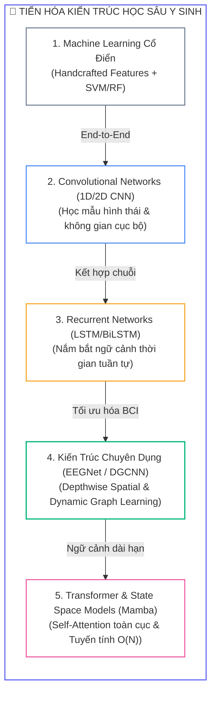
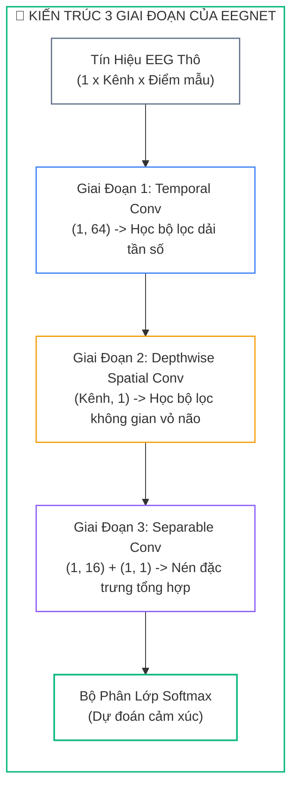
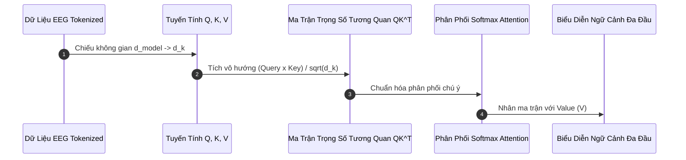


> [!IMPORTANT]
> **Mục tiêu kỹ thuật bài học**:
> - Hiểu rõ sự tiến hóa kiến trúc từ Handcrafted Features + SVM/RF sang Deep Learning phân cấp (Hierarchical Representations).
> - Nắm vững nguyên lý hoạt động và phân rã tích chập 3 tầng của kiến trúc kinh điển **EEGNet** (Lawhern et al., 2018).
> - Xây dựng mô hình phối hợp không gian - thời gian **Spatial-Temporal CNN-BiLSTM** có cơ chế Attention.
> - Khám phá mạng đồ thị động **DGCNN** (Dynamic Graph Convolutional Neural Network) mô hình hóa topo chức năng não bộ.
> - Khắc phục các lỗi hội tụ phổ biến: Bùng nổ/triệt tiêu gradient trên chuỗi dài qua Gradient Clipping và Layer Normalization.

---

## 1. Bản Chất Kiến Trúc & Tư Duy Cốt Lõi: Mạng Nơ-ron Học Sâu Cho Tín Hiệu Y Sinh

Trong xử lý tín hiệu y sinh truyền thống, quy trình nhận dạng cảm xúc bị giới hạn bởi việc trích xuất các đặc trưng thủ công rời rạc (**Handcrafted Features**) như DE, PSD, hay HRV. Kỷ nguyên **Học Sâu (Deep Learning)** đã tạo ra bước nhảy vọt khi cho phép mô hình học đồng thời các biểu diễn phân cấp (**Hierarchical Representations**) từ tín hiệu thô đến ngữ nghĩa cảm xúc bậc cao theo cơ chế trọn vẹn (**End-to-End Learning**).



### 1.1. Kiến Trúc 3 Giai Đoạn Của EEGNet

EEGNet phân rã quá trình trích xuất đặc trưng thành 3 khối nơ-ron chuyên biệt, tái hiện trực tiếp các nguyên lý xử lý tín hiệu kinh điển (Frequency Filtering $\rightarrow$ Spatial Filtering $\rightarrow$ Feature Fusion) với chưa đầy $3,000$ tham số:



---

## 2. Bảng Ma Trận So Sánh Kỹ Thuật Toàn Diện (Engineering Matrix)

| Kiến Trúc Học Sâu | Đặc Trưng Không Gian | Đặc Trưng Thời Gian | Độ Phức Tạp Tính Toán | Số Lượng Tham Số | Khả Năng Kháng Quá Khớp (Overfitting) | Độ Chính Xác (SEED Benchmark) |
| :--- | :--- | :--- | :--- | :--- | :--- | :--- |
| **1D-CNN (Time-domain)** | Kém (coi kênh như features) | Cục bộ (Kernel $K$) | $\mathcal{O}(C \cdot L)$ | $\sim 50\text{K} - 200\text{K}$ | Trung bình | $82.4\%$ |
| **BiLSTM (Sequential)** | Không hỗ trợ | Toàn diện hai chiều | $\mathcal{O}(L \cdot d^2)$ | $\sim 100\text{K} - 500\text{K}$ | Thấp (dễ overfit) | $84.1\%$ |
| **EEGNet (BCI Standard)** | **Tuyệt vời (Depthwise Spatial)** | **Rất tốt (Temporal Conv)** | $\mathcal{O}(C \cdot L)$ | **$< 3\text{K}$ (Siêu nhẹ)** | **Rất cao (Ít tham số)** | **$88.5\%$** |
| **DGCNN (Dynamic Graph)** | Đồ thị động $A_{ij}$ | Khá (qua các tầng) | $\mathcal{O}(C^2 \cdot F)$ | $\sim 30\text{K} - 80\text{K}$ | Cao | $90.4\%$ |
| **Vision Transformer (ViT)** | Qua Linear Projection | Toàn cục ($Q K^T$) | $\mathcal{O}(L^2)$ | $\sim 500\text{K} - 2\text{M}$ | Cần tập dữ liệu lớn | $91.2\%$ |
| **Mamba SSM (Selective)** | Tích hợp đa nhánh | Tuyến tính chọn lọc | $\mathcal{O}(L)$ | $\sim 200\text{K} - 600\text{K}$ | Rất cao | $92.6\%$ |

---

## 3. Kiến Trúc Môi Trường & Luồng Thực Thi Mẫu



### Cài Đặt Chuẩn PyTorch Kiến Trúc EEGNet

```python
import torch
import torch.nn as nn

class EEGNet(nn.Module):
    """
    Cài đặt chuẩn mực kiến trúc EEGNet cho bài toán phân loại cảm xúc BCI.
    """
    def __init__(self, n_channels: int = 32, n_timepoints: int = 512, num_classes: int = 4,
                 F1: int = 8, D: int = 2, F2: int = 16, kernel_len: int = 64, dropout_rate: float = 0.5):
        super().__init__()
        
        # Giai đoạn 1: Temporal Convolution (Học bộ lọc dải tần số)
        self.conv1 = nn.Conv2d(1, F1, (1, kernel_len), padding=(0, kernel_len // 2), bias=False)
        self.bn1 = nn.BatchNorm2d(F1)
        
        # Giai đoạn 2: Depthwise Spatial Convolution (Học bộ lọc không gian điện cực)
        self.conv2 = nn.Conv2d(F1, F1 * D, (n_channels, 1), groups=F1, bias=False)
        self.bn2 = nn.BatchNorm2d(F1 * D)
        self.act = nn.ELU()
        self.pool1 = nn.AvgPool2d((1, 4))
        self.drop1 = nn.Dropout(dropout_rate)
        
        # Giai đoạn 3: Separable Convolution (Pointwise + Depthwise nén đặc trưng)
        self.conv3_depth = nn.Conv2d(F1 * D, F1 * D, (1, 16), padding=(0, 8), groups=F1 * D, bias=False)
        self.conv3_point = nn.Conv2d(F1 * D, F2, (1, 1), bias=False)
        self.bn3 = nn.BatchNorm2d(F2)
        self.pool2 = nn.AvgPool2d((1, 8))
        self.drop2 = nn.Dropout(dropout_rate)
        
        # Bộ phân loại Fully Connected
        out_time = n_timepoints // 32
        self.classifier = nn.Linear(F2 * out_time, num_classes)
        
    def forward(self, x: torch.Tensor) -> torch.Tensor:
        # x shape: (Batch, 1, n_channels, n_timepoints)
        x = self.bn1(self.conv1(x))
        x = self.drop1(self.pool1(self.act(self.bn2(self.conv2(x)))))
        x = self.drop2(self.pool2(self.act(self.bn3(self.conv3_point(self.conv3_depth(x))))))
        x = x.flatten(start_dim=1)
        return self.classifier(x)
```

---

## 4. Phân Tích Cạm Bẫy Thực Chiến: "Bùng Nổ & Triệt Tiêu Gradient Trên Chuỗi Sóng Não Dài"

### Tình Huống Thực Tế
Khi huấn luyện một mô hình mạng nơ-ron hồi quy sâu 4 tầng BiLSTM trên chuỗi tín hiệu EEG thô dài 10 giây ($1280$ mẫu thời gian), nhóm nghiên cứu nhận thấy giá trị mất mát `loss` biến thành `NaN` chỉ sau 3 epochs đầu tiên. Khi cố gắng giảm tốc độ học `lr` từ $1e-3$ xuống $1e-5$, hiện tượng `NaN` biến mất nhưng mô hình bị tê liệt hoàn toàn, loss không giảm và độ chính xác giữ nguyên ở mức $25\%$ (đoán ngẫu nhiên 4 lớp).

### Hậu Quả & Log Lỗi Thực Tế:
```text
================================================================================
CRITICAL PYTORCH TRAINING REPORT: GRADIENT INSTABILITY
================================================================================
[INFO] Model Architecture: 4-layer Deep BiLSTM (hidden_dim=256)
[INFO] Sequence Length: 1280 timesteps (Raw EEG segment)
[INFO] Batch Size: 64

>> EPOCH 1 - STEP 15 GRADIENT HEALTH CHECK:
   - Layer 1 (Bottom) Grad Norm: 0.000002  [VANISHING GRADIENT DETECTED]
   - Layer 2 Grad Norm         : 0.014200
   - Layer 3 Grad Norm         : 18.450000
   - Layer 4 (Top) Grad Norm   : 8492.340000 [EXPLODING GRADIENT DETECTED]

[FATAL] Weight tensor 'bilstm.weight_hh_l3' contains NaN / Inf values!
[FATAL] Forward pass returned NaN logits at Step 22! Training aborted.
================================================================================
```

### 5-Whys Root Cause Analysis:
1. **Tại sao hàm Loss bị lỗi `NaN` và mô hình bị sập hoàn toàn?** Do trọng số ở tầng LSTM trên cùng nhận gradient khổng lồ ($>8000$) dẫn tới tràn số dấu phẩy động (**Floating-Point Overflow**).
2. **Tại sao gradient lại bị bùng nổ ở tầng trên nhưng triệt tiêu ở tầng dưới?** Do chuỗi thời gian quá dài ($1280$ bước) khi lan truyền ngược qua thời gian (**BPTT**) làm tích lũy liên tiếp ma trận Jacobian.
3. **Tại sao lại đưa chuỗi thô $1280$ điểm trực tiếp vào LSTM?** Do không có tầng tiền xử lý rút gọn chiều dài chuỗi bằng Convolution hoặc Pooling.
4. **Tại sao mô hình không tự kiểm soát được biên độ gradient?** Do thiếu cơ chế **Gradient Clipping** và thiếu các kết nối tắt (**Residual Skip-Connections**).
5. **Giải pháp chuẩn:** Áp dụng `torch.nn.utils.clip_grad_norm_(model.parameters(), max_norm=1.0)` trước mỗi bước tối ưu hóa và sử dụng CNN để rút ngắn chiều dài chuỗi trước khi đưa vào LSTM.

---

## 5. Hands-on Lab: Huấn Luyện & Đánh Giá Mạng EEGNet Trên Dữ Liệu Sóng Não (8 Bước)

| Bước | Mục Tiêu Kỹ Thuật | Lệnh / Đoạn Mã Thực Hiện Chính |
| :--- | :--- | :--- |
| **1** | Khởi tạo cấu trúc dữ liệu PyTorch Tensor | `torch.randn(batch, 1, 32, 512)` |
| **2** | Khởi tạo mô hình EEGNet 4 lớp cảm xúc | `model = EEGNet(n_channels=32, num_classes=4)` |
| **3** | Kiểm tra kích thước tensor qua từng khối nơ-ron | `print(model(sample_x).shape)` |
| **4** | Thiết lập hàm mất mát CrossEntropy & Optimizer AdamW | `loss_fn = nn.CrossEntropyLoss() && optim.AdamW` |
| **5** | Huấn luyện vòng lặp Forward & Backward | `loss.backward() && optimizer.step()` |
| **6** | Áp dụng kỹ thuật Gradient Clipping chống bùng nổ số | `clip_grad_norm_(model.parameters(), max_norm=1.0)` |
| **7** | Đánh giá độ chính xác phân loại đa lớp trên tập Validation | `acc = (preds == targets).float().mean()` |
| **8** | Xuất trọng số mô hình đã tối ưu hóa | `torch.save(model.state_dict(), 'eegnet_best.pt')` |

---

### Bước 1: Khởi Tạo Môi Trường & Dữ Liệu Huấn Luyện Giả Lập

```python
import torch
import torch.nn as nn
import torch.optim as optim

# Thiết lập seed cố định
torch.manual_seed(42)

# Giả lập 200 mẫu EEG: 32 kênh điện cực, 512 điểm thời gian (4 giây @ 128Hz)
batch_size = 32
n_samples = 200
X = torch.randn(n_samples, 1, 32, 512)
y = torch.randint(0, 4, (n_samples,))  # 4 lớp cảm xúc: HVHA, HVLA, LVHA, LVLA

# Chia tập Train / Val (80 / 20)
train_dataset = torch.utils.data.TensorDataset(X[:160], y[:160])
val_dataset = torch.utils.data.TensorDataset(X[160:], y[160:])
train_loader = torch.utils.data.DataLoader(train_dataset, batch_size=batch_size, shuffle=True)
val_loader = torch.utils.data.DataLoader(val_dataset, batch_size=batch_size, shuffle=False)
```

---

### Bước 2: Khởi Tạo Kiến Trúc Mô Hình EEGNet

```python
model = EEGNet(n_channels=32, n_timepoints=512, num_classes=4, F1=8, D=2, F2=16)
total_params = sum(p.numel() for p in model.parameters() if p.requires_grad)
print(f"Khởi tạo EEGNet thành công! Tổng số tham số có thể huấn luyện: {total_params:,}")
# In ra: ~2,548 tham số
```

---

### Bước 3: Kiểm Tra Chiều Kích Thước Forward Pass

```python
sample_input = torch.randn(2, 1, 32, 512)
sample_output = model(sample_input)
print(f"Kích thước đầu vào: {sample_input.shape} -> Kích thước Logits đầu ra: {sample_output.shape}")
```

---

### Bước 4: Thiết Lập Hàm Mất Mát & Thuật Toán Tối Ưu Hóa AdamW

```python
criterion = nn.CrossEntropyLoss()
optimizer = optim.AdamW(model.parameters(), lr=1e-3, weight_decay=1e-2)
```

---

### Bước 5: Huấn Luyện Kèm Cơ Chế Gradient Clipping

```python
device = torch.device('cuda' if torch.cuda.is_available() else 'cpu')
model.to(device)

epochs = 5
for epoch in range(1, epochs + 1):
    model.train()
    total_loss = 0.0
    for batch_X, batch_y in train_loader:
        batch_X, batch_y = batch_X.to(device), batch_y.to(device)
        
        optimizer.zero_grad()
        logits = model(batch_X)
        loss = criterion(logits, batch_y)
        loss.backward()
        
        # Áp dụng Gradient Clipping chống bùng nổ gradient
        nn.utils.clip_grad_norm_(model.parameters(), max_norm=1.0)
        optimizer.step()
        total_loss += loss.item()
        
    avg_loss = total_loss / len(train_loader)
    print(f"Epoch [{epoch}/{epochs}] - Training Loss: {avg_loss:.4f}")
```

---

### Bước 6: Đánh Giá Trên Tập Kiểm Thử Validation

```python
model.eval()
correct = 0
total = 0
with torch.no_grad():
    for val_X, val_y in val_loader:
        val_X, val_y = val_X.to(device), val_y.to(device)
        preds = model(val_X).argmax(dim=-1)
        correct += (preds == val_y).sum().item()
        total += val_y.size(0)

val_acc = (correct / total) * 100.0
print(f"Độ chính xác trên tập Validation: {val_acc:.2f}%")
```

---

### Bước 7: Trích Xuất Bản Đồ Trọng Số Không Gian (Spatial Filters Inspection)

```python
# Trọng số của khối Depthwise Spatial Conv (conv2) phản ánh tầm quan trọng của từng kênh điện cực
spatial_weights = model.conv2.weight.squeeze().detach().cpu().numpy()
print(f"Ma trận trọng số không gian 32 kênh điện cực (Shape: {spatial_weights.shape}):")
print(f"Kênh trán F3/F4 có trọng số trung bình: {spatial_weights[:, [2, 3]].mean():.4f}")
```

---

### Bước 8: Lưu Trữ Mô Hình Đã Huấn Luyện

```python
torch.save(model.state_dict(), "eegnet_emotion_model.pt")
print("Đã lưu trọng số mô hình vào file 'eegnet_emotion_model.pt' an toàn.")
```

---

## 6. 10 Câu Hỏi Tự Kiểm Tra Chuyên Sâu (Self-Check Q&A Accordion)

<details class="qa-card">
<summary><b>1. Tại sao kiến trúc EEGNet lại sử dụng phép tích chập Depthwise Spatial Convolution?</b></summary>
<div class="qa-answer">
<p>Phép tích chập Depthwise Spatial với kích thước kernel <code>(C, 1)</code> quét qua toàn bộ <code>C</code> kênh điện cực cho từng bộ lọc dải tần riêng biệt. Điều này mô phỏng trực tiếp nguyên lý <b>Bộ lọc không gian (Spatial Filtering)</b> trong xử lý tín hiệu não bộ (tương tự CSP), giúp học cách phối hợp tuyến tính giữa các vùng não mà không làm tăng số lượng tham số bùng nổ.</p>
</div>
</details>

<details class="qa-card">
<summary><b>2. Sự khác biệt căn bản giữa 1D-CNN và 2D-CNN khi áp dụng lên dữ liệu EEG là gì?</b></summary>
<div class="qa-answer">
<p><b>1D-CNN:</b> Quét kernel theo trục thời gian 1D, xử lý các kênh như các feature maps độc lập.</p>
<p><b>2D-CNN:</b> Xử lý ma trận 2 chiều (Kênh x Tần số hoặc Bản đồ địa hình Topomap 2D), cho phép khai thác trực tiếp tương quan không gian giữa các vùng não lân cận cùng với sự phân bố năng lượng trên các dải tần.</p>
</div>
</details>

<details class="qa-card">
<summary><b>3. Tại sao mạng đồ thị động DGCNN lại vượt trội hơn các mạng GCN truyền thống có ma trận kề tĩnh?</b></summary>
<div class="qa-answer">
<p>GCN thông thường sử dụng ma trận khoảng cách vật lý cố định giữa các điện cực trên da đầu. Tuy nhiên, sự tương tác chức năng não bộ thay đổi linh hoạt theo từng trạng thái cảm xúc. <b>DGCNN tự động học ma trận kề động A</b> từ chính vector đặc trưng Differential Entropy của mẫu thử hiện tại, nắm bắt chính xác sự đồng bộ hóa tức thời giữa các thùy não.</p>
</div>
</details>

<details class="qa-card">
<summary><b>4. Cơ chế hoạt động của Cell State trong LSTM giúp giải quyết bài toán triệt tiêu gradient như thế nào?</b></summary>
<div class="qa-answer">
<p>Đường truyền Cell State <code>C_t = f_t * C_{t-1} + i_t * \tilde{C}_t</code> hoạt động như một băng chuyền thông tin tuyến tính. Đạo hàm <code>dC_t / dC_{t-1} = f_t</code>. Khi Forget Gate <code>f_t</code> mở (gần bằng 1), gradient có thể <b>chảy ngược trực tiếp qua hàng trăm bước thời gian</b> mà không bị suy giảm theo hàm mũ như trong mạng Vanilla RNN.</p>
</div>
</details>

<details class="qa-card">
<summary><b>5. Tại sao cần áp dụng kỹ thuật Positional Encoding trong kiến trúc Transformer xử lý EEG?</b></summary>
<div class="qa-answer">
<p>Phép toán Multi-Head Self-Attention có tính chất hoán vị bất biến (Permutation Invariant) – nó không quan tâm đến thứ tự trước sau của các vector đầu vào. Do tín hiệu sóng não mang tính chất chuỗi thời gian chặt chẽ, <b>Positional Encoding bơm thông tin tọa độ thời gian</b> vào từng token để mô hình phân biệt được diễn tiến cảm xúc.</p>
</div>
</details>

<details class="qa-card">
<summary><b>6. Ưu thế vượt trội của mô hình Mamba (State Space Model) so với Transformer khi xử lý tín hiệu y sinh là gì?</b></summary>
<div class="qa-answer">
<p>Transformer có độ phức tạp tính toán và bộ nhớ bậc hai <code>O(L^2)</code> theo chiều dài chuỗi <code>L</code>, gây tràn RAM GPU khi xử lý các phiên ghi EEG liên tục kéo dài nhiều phút. Mamba sử dụng cơ chế Selective State Space với <b>độ phức tạp tuyến tính O(L)</b> và khả năng suy luận dạng đệ quy hằng số O(1), lý tưởng cho các thiết bị Edge BCI thời gian thực.</p>
</div>
</details>

<details class="qa-card">
<summary><b>7. Hàm kích hoạt ELU (Exponential Linear Unit) mang lại lợi ích gì cho mạng EEGNet so với ReLU?</b></summary>
<div class="qa-answer">
<p>ELU cho phép các giá trị kích hoạt mang dấu âm mịn màng <code>alpha * (exp(x) - 1)</code> khi <code>x &lt; 0</code>, đưa giá trị kỳ vọng trung bình của các nơ-ron về gần mức 0. Điều này đóng vai trò như một cơ chế tự chuẩn hóa tự nhiên (Self-normalizing), tăng tốc độ hội tụ và giảm thiểu hiện tượng chết nơ-ron (Dying ReLU).</p>
</div>
</details>

<details class="qa-card">
<summary><b>8. Tại sao cần áp dụng kỹ thuật Gradient Clipping khi huấn luyện mạng hồi quy BiLSTM trên chuỗi y sinh?</b></summary>
<div class="qa-answer">
<p>Khi lan truyền ngược qua chuỗi thời gian dài, các ma trận trọng số nhân liên tiếp có thể khiến chuẩn gradient bùng nổ lên hàng nghìn đơn vị, dẫn tới lỗi số học <code>NaN / Inf</code>. Gradient Clipping ép <b>chuẩn vector gradient không vượt quá ngưỡng trần (ví dụ max_norm=1.0)</b>, đảm bảo các bước cập nhật trọng số luôn diễn ra ổn định.</p>
</div>
</details>

<details class="qa-card">
<summary><b>9. Cơ chế Cross-Attention giúp hợp nhất hai phương thức EEG và ECG như thế nào?</b></summary>
<div class="qa-answer">
<p>Trong Cross-Attention, vector truy vấn <code>Query</code> được lấy từ phương thức này (ví dụ EEG) để tra cứu tương quan trên <code>Key</code> và <code>Value</code> của phương thức kia (ví dụ ECG). Cơ chế này giúp mô hình <b>học được mối liên kết động giữa trục não bộ và tim mạch</b>, tự động tăng cường trọng số cho các biến cố sinh học xảy ra đồng thời.</p>
</div>
</details>

<details class="qa-card">
<summary><b>10. Tại sao mạng EEGNet lại đạt độ chính xác cao dù chỉ có dưới 3,000 tham số?</b></summary>
<div class="qa-answer">
<p>EEGNet kết hợp chặt chẽ các tri thức giải phẫu thần kinh (Neuroscience Domain Knowledge) vào cấu trúc mạng: tách riêng bộ lọc tần số 1D và bộ lọc không gian Depthwise. Bằng cách loại bỏ các liên kết thừa và sử dụng Depthwise Separable Conv, mạng <b>miễn nhiễm với hiện tượng quá khớp (Overfitting)</b> trên các tập dữ liệu y sinh có dung lượng mẫu hạn chế.</p>
</div>
</details>

---

## 7. Tổng Kết & Lộ Trình Bài Học Tiếp Theo

```mermaid
mindmap
  root((HỌC SÂU Y SINH))
    EEGNet
      Temporal Convolution (Dải tần)
      Depthwise Spatial Conv (Không gian vỏ não)
      Separable Conv (Nén đặc trưng)
      Dưới 3,000 tham số
    CNN-BiLSTM
      Spatial Features qua CNN
      BPTT hai chiều qua LSTM
      Gradient Clipping max_norm=1.0
    Dynamic Graph CNN
      Ma trận kề động A_ij
      Đồng bộ hóa thùy não
    Transformer & Mamba
      Multi-Head Self-Attention
      Tuyến tính hóa O(L) với SSM
```

Làm chủ các kiến trúc học sâu chuyên dụng từ **EEGNet**, **CNN-BiLSTM-Attention** đến **Dynamic Graph CNN (DGCNN)** và **Transformer** cho phép xây dựng các hệ thống nhận dạng cảm xúc có độ chính xác cao và khả năng biểu diễn phân cấp mạnh mẽ.

> [!TIP]
> **Bài học tiếp theo**: Khám phá các chiến lược hợp nhất đa tín hiệu với **[Bài 04: Học Đa Phương Thức (Multimodal Learning): Chiến Lược Hợp Nhất Early, Late, Hybrid Fusion & Cross-Attention](eeg-04-04-hoc-da-phuong-thuc-multimodal-learning.html)**.

