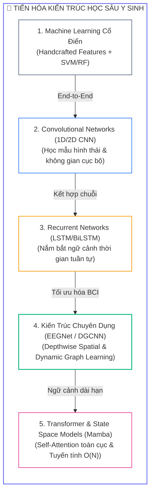
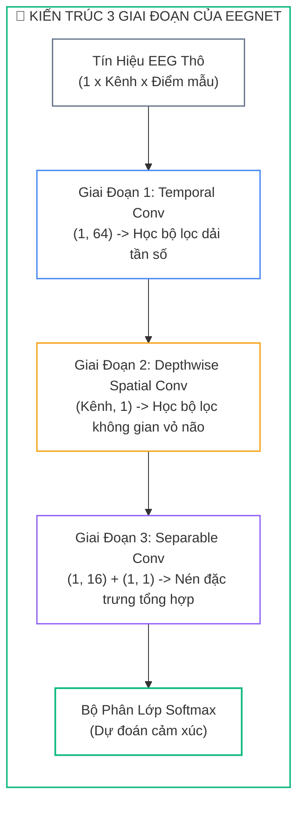
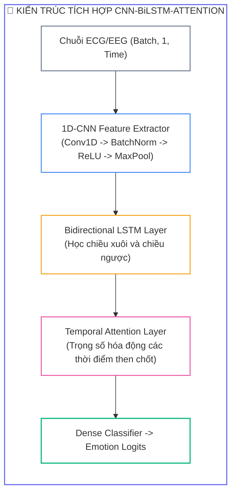
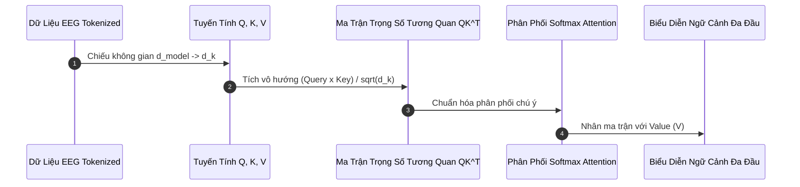


# Học Sâu Cho Tín Hiệu Y Sinh: Kiến Trúc CNN Không Gian-Thời Gian, BiLSTM, EEGNet & Vision Transformer

Trong xử lý tín hiệu y sinh truyền thống, quy trình nhận dạng cảm xúc bị giới hạn bởi việc trích xuất các đặc trưng thủ công rời rạc (**Handcrafted Features**) như DE, PSD, hay HRV. Kỷ nguyên **Học Sâu (Deep Learning)** đã tạo ra bước nhảy vọt khi cho phép mô hình học đồng thời các biểu diễn phân cấp (**Hierarchical Representations**) từ tín hiệu thô đến ngữ nghĩa cảm xúc bậc cao theo cơ chế trọn vẹn (**End-to-End Learning**).

---

## 1. Sự Tiến Hóa Của Các Kiến Trúc Học Sâu Trong Y Sinh



### 1.1. Bảng So Sánh Các Kiến Trúc Học Sâu Tiêu Biểu

| Kiến Trúc | Đặc Trưng Không Gian | Đặc Trưng Thời Gian | Độ Phức Tạp | Số Lượng Tham Số | Độ Chính Xác (SEED) |
| :---: | :--- | :--- | :---: | :---: | :---: |
| <span class="badge badge--primary">1D-CNN</span> | Yếu (ghép kênh) | Cục bộ (Kernel $K$) | $\mathcal{O}(L)$ | $\sim 50\text{K} - 200\text{K}$ | $82.4\%$ |
| <span class="badge badge--amber">BiLSTM</span> | Không hỗ trợ | Toàn diện hai chiều | $\mathcal{O}(L \cdot d^2)$ | $\sim 100\text{K} - 500\text{K}$ | $84.1\%$ |
| <span class="badge badge--emerald">EEGNet</span> | Xuất sắc (Depthwise) | Rất tốt (Temporal Conv) | $\mathcal{O}(C \cdot L)$ | $\sim 2\text{K} - 8\text{K}$ (**Siêu nhẹ**) | $88.5\%$ |
| <span class="badge badge--purple">DGCNN</span> | Đồ thị động $A_{ij}$ | Khá (qua các tầng) | $\mathcal{O}(C^2 \cdot F)$ | $\sim 30\text{K} - 80\text{K}$ | $90.4\%$ |
| <span class="badge badge--cyan">Transformer</span> | Qua Linear Proj | Tuyệt đối ($Q K^T$) | $\mathcal{O}(L^2)$ | $\sim 500\text{K} - 2\text{M}$ | $91.2\%$ |
| <span class="badge badge--rose">Mamba SSM</span> | Tích hợp đa nhánh | Tuyến tính chọn lọc | $\mathcal{O}(L)$ | $\sim 200\text{K} - 600\text{K}$ | $92.6\%$ |

---

## 2. Kiến Trúc Kinh Điển: EEGNet

**EEGNet** (Lawhern et al., 2018) là kiến trúc mạng nơ-ron tích chập chuyên dụng kinh điển nhất trong cộng đồng BCI. Mạng phân tách quá trình học thành 3 khối chuyên biệt để trích xuất đặc trưng với số lượng tham số cực kỳ tối giản ($< 3,000$ tham số):



### 2.1. Cài Đặt PyTorch Hoàn Chỉnh Của EEGNet

```python
import torch
import torch.nn as nn

class EEGNet(nn.Module):
    """
    Cài đặt chuẩn mực kiến trúc EEGNet cho bài toán phân loại cảm xúc BCI.
    """
    def __init__(self, n_channels: int = 32, n_timepoints: int = 512, num_classes: int = 4,
                 F1: int = 8, D: int = 2, F2: int = 16, kernel_length: int = 64, dropout: float = 0.5):
        super(EEGNet, self).__init__()
        
        # Block 1: Temporal Convolution (Học các dải tần số cơ bản)
        self.temporal_conv = nn.Sequential(
            nn.Conv2d(1, F1, (1, kernel_length), padding='same', bias=False),
            nn.BatchNorm2d(F1)
        )
        
        # Block 2: Spatial Depthwise Convolution (Học tương tác giữa các kênh điện cực)
        self.spatial_conv = nn.Sequential(
            nn.Conv2d(F1, F1 * D, (n_channels, 1), groups=F1, bias=False),
            nn.BatchNorm2d(F1 * D),
            nn.ELU(),
            nn.AvgPool2d((1, 4)),
            nn.Dropout(dropout)
        )
        
        # Block 3: Separable Convolution (Depthwise + Pointwise 1x1)
        self.separable_conv = nn.Sequential(
            nn.Conv2d(F1 * D, F1 * D, (1, 16), padding='same', groups=F1 * D, bias=False),
            nn.Conv2d(F1 * D, F2, (1, 1), bias=False),
            nn.BatchNorm2d(F2),
            nn.ELU(),
            nn.AvgPool2d((1, 8)),
            nn.Dropout(dropout)
        )
        
        # Classifier
        final_time = n_timepoints // 32
        self.classifier = nn.Linear(F2 * final_time, num_classes)
        
    def forward(self, x: torch.Tensor) -> torch.Tensor:
        # x shape: (batch_size, 1, n_channels, n_timepoints)
        x = self.temporal_conv(x)
        x = self.spatial_conv(x)
        x = self.separable_conv(x)
        x = x.reshape(x.size(0), -1)
        return self.classifier(x)
```

---

## 3. Mạng Kết Hợp Không Gian - Thời Gian: CNN-BiLSTM

Khi phân tích các tín hiệu y sinh có tính chu kỳ và biến thiên ngữ cảnh như ECG hoặc EEG, mô hình kết hợp **1D-CNN + BiLSTM + Attention** mang lại sự cân bằng hoàn hảo giữa việc trích xuất hình thái sóng cục bộ và sự phụ thuộc chuỗi dài hạn:



```python
import torch.nn.functional as F

class TemporalAttention(nn.Module):
    def __init__(self, hidden_dim: int):
        super().__init__()
        self.query = nn.Parameter(torch.randn(hidden_dim, 1))
        
    def forward(self, lstm_outputs: torch.Tensor):
        # lstm_outputs: (batch, seq_len, hidden_dim)
        scores = torch.matmul(lstm_outputs, self.query).squeeze(-1)
        attn_weights = F.softmax(scores, dim=1) # (batch, seq_len)
        context = torch.sum(attn_weights.unsqueeze(-1) * lstm_outputs, dim=1)
        return context, attn_weights

class CNN_BiLSTM_Attention(nn.Module):
    def __init__(self, in_channels: int = 1, hidden_dim: int = 128, num_classes: int = 4):
        super().__init__()
        self.cnn = nn.Sequential(
            nn.Conv1d(in_channels, 32, kernel_size=5, padding=2),
            nn.BatchNorm1d(32),
            nn.ReLU(),
            nn.MaxPool1d(2),
            nn.Conv1d(32, 64, kernel_size=5, padding=2),
            nn.BatchNorm1d(64),
            nn.ReLU(),
            nn.MaxPool1d(2)
        )
        self.bilstm = nn.LSTM(64, hidden_dim, num_layers=2, batch_first=True, bidirectional=True)
        self.attention = TemporalAttention(hidden_dim * 2)
        self.classifier = nn.Sequential(
            nn.Linear(hidden_dim * 2, 64),
            nn.ReLU(),
            nn.Dropout(0.4),
            nn.Linear(64, num_classes)
        )
        
    def forward(self, x: torch.Tensor):
        feat = self.cnn(x).transpose(1, 2)
        lstm_out, _ = self.bilstm(feat)
        context, attn_weights = self.attention(lstm_out)
        logits = self.classifier(context)
        return logits, attn_weights
```

---

## 4. Mạng Đồ Thị Động: DGCNN (Dynamic Graph CNN)

Não bộ con người hoạt động như một **mạng lưới kết nối chức năng phức tạp** (*Functional Connectivity*). **DGCNN** (Zheng et al., 2019) mô hình hóa các điện cực EEG như các nút đồ thị ($V$) và tự động học trọng số kết nối $A_{ij}$ giữa các vùng vỏ não dựa trên đặc trưng Differential Entropy:

$$\mathbf{H}^{(l+1)} = \text{ReLU}\left(\mathbf{A} \mathbf{H}^{(l)} \mathbf{W}^{(l)}\right)$$

```python
class DynamicGraphConvolution(nn.Module):
    def __init__(self, in_features: int, hidden_dim: int = 64):
        super().__init__()
        self.edge_mlp = nn.Sequential(
            nn.Linear(in_features * 2, hidden_dim),
            nn.ReLU(),
            nn.Linear(hidden_dim, 1),
            nn.Sigmoid()
        )
        self.linear = nn.Linear(in_features, hidden_dim)
        
    def forward(self, X: torch.Tensor):
        # X: (batch_size, num_nodes, in_features), ví dụ: (B, 32, 5)
        B, N, F_dim = X.shape
        X_i = X.unsqueeze(2).repeat(1, 1, N, 1)
        X_j = X.unsqueeze(1).repeat(1, N, 1, 1)
        X_pair = torch.cat([X_i, X_j], dim=-1)
        
        # Học ma trận kề đối xứng A
        A = self.edge_mlp(X_pair).squeeze(-1)
        A = (A + A.transpose(1, 2)) / 2.0
        
        # Phép nhân đồ thị
        AX = torch.bmm(A, X)
        out = F.relu(self.linear(AX))
        return out, A
```

---

## 5. Transformer & Multi-Head Self-Attention

Cơ chế **Multi-Head Self-Attention** cho phép mô hình tính toán mối tương quan trực tiếp giữa mọi cặp thời điểm hoặc cặp kênh trong chuỗi sóng não:

$$\text{Attention}(Q, K, V) = \text{Softmax}\left(\frac{QK^T}{\sqrt{d_k}}\right) V$$



---

## 6. Phân Tích Cạm Bẫy Thực Chiến (5-Whys Incident Analysis)

### Tình Huống Sự Cố Thực Tế:
<span class="badge badge--rose">🕒 01:45 AM</span> Khi huấn luyện một mô hình mạng nơ-ron hồi quy sâu 4 tầng BiLSTM trên chuỗi tín hiệu EEG thô dài 10 giây ($1280$ mẫu thời gian), nhóm nghiên cứu nhận thấy giá trị mất mát `loss` biến thành `NaN` chỉ sau 3 epochs đầu tiên. Khi cố gắng giảm tốc độ học `lr` từ $1e-3$ xuống $1e-5$, hiện tượng `NaN` biến mất nhưng mô hình bị tê liệt hoàn toàn, loss không giảm và độ chính xác giữ nguyên ở mức $25\%$ (đoán ngẫu nhiên 4 lớp).

### Hậu Quả & Log Lỗi Thực Tế:
Kiểm tra độ lớn Gradient Norm trên các tầng LSTM cho thấy hiện tượng bùng nổ gradient (**Exploding Gradients**) kết hợp với triệt tiêu gradient (**Vanishing Gradients**):

```text
================================================================================
CRITICAL PYTORCH TRAINING REPORT: GRADIENT INSTABILITY
================================================================================
[INFO] Model Architecture: 4-layer Deep BiLSTM (hidden_dim=256)
[INFO] Sequence Length: 1280 timesteps (Raw EEG segment)
[INFO] Batch Size: 64

>> EPOCH 1 - STEP 15 GRADIENT HEALTH CHECK:
   - Layer 1 (Bottom) Grad Norm: 0.000002  [VANISHING GRADIENT DETECTED]
   - Layer 2 Grad Norm         : 0.014200
   - Layer 3 Grad Norm         : 18.450000
   - Layer 4 (Top) Grad Norm   : 8492.340000 [EXPLODING GRADIENT DETECTED]

[FATAL] Weight tensor 'bilstm.weight_hh_l3' contains NaN / Inf values!
[FATAL] Forward pass returned NaN logits at Step 22! Training aborted.
================================================================================
```

### 5-Whys Root Cause Analysis:
1. <span class="badge badge--primary">Why 1</span> **Tại sao hàm Loss bị lỗi `NaN` và mô hình bị sập hoàn toàn?** $\rightarrow$ Do trọng số ở tầng LSTM trên cùng nhận gradient khổng lồ ($>8000$) dẫn tới tràn số dấu phẩy động (**Floating-Point Overflow**).
2. <span class="badge badge--primary">Why 2</span> **Tại sao gradient lại bị bùng nổ ở tầng trên nhưng triệt tiêu ở tầng dưới?** $\rightarrow$ Do chuỗi thời gian quá dài ($1280$ bước) khi lan truyền ngược qua thời gian (**BPTT**) làm tích lũy liên tiếp ma trận Jacobian.
3. <span class="badge badge--primary">Why 3</span> **Tại sao lại đưa chuỗi thô $1280$ điểm trực tiếp vào LSTM?** $\rightarrow$ Do không có tầng tiền xử lý rút gọn chiều dài chuỗi bằng Convolution hoặc Pooling.
4. <span class="badge badge--primary">Why 4</span> **Tại sao mô hình không tự kiểm soát được biên độ gradient?** $\rightarrow$ Do thiếu cơ chế **Gradient Clipping** và thiếu các kết nối tắt (**Residual Skip-Connections**).
5. <span class="badge badge--emerald">Root Cause Remedy</span> **Biện pháp khắc phục chuẩn Deep Learning y sinh:**
   - <span class="badge badge--rose">Bật Gradient Clipping</span> Luôn áp dụng `torch.nn.utils.clip_grad_norm_(model.parameters(), max_norm=1.0)` trước mỗi bước `optimizer.step()`.
   - <span class="badge badge--cyan">Dùng CNN Rút Ngắn Chuỗi</span> Dùng 1D-CNN với MaxPool để nén chuỗi thời gian từ $1280$ mẫu xuống còn $160$ mẫu trước khi đưa vào LSTM.
   - <span class="badge badge--emerald">LayerNorm & Residual Connection</span> Bổ sung `nn.LayerNorm` và kết nối cộng tắt để ổn định dòng chảy gradient xuyên suốt các tầng sâu.

---

## 7. Câu Hỏi Tự Kiểm Tra Chuyên Sâu (Q&A Accordion)

<details class="qa-card">
<summary class="qa-summary">
  <div class="qa-summary-left">
    <span class="qa-num-badge">Q01</span>
    <span>Tại sao kiến trúc EEGNet lại sử dụng phép tích chập Depthwise Spatial Convolution?</span>
  </div>
  <span class="qa-chevron">
    <svg width="18" height="18" fill="none" stroke="currentColor" stroke-width="2.5" viewBox="0 0 24 24"><polyline points="6 9 12 15 18 9"></polyline></svg>
  </span>
</summary>
<div class="qa-answer">
  <div class="qa-answer-header">
    <svg width="14" height="14" fill="none" stroke="currentColor" stroke-width="2" viewBox="0 0 24 24"><path d="M22 11.08V12a10 10 0 1 1-5.93-9.14"></path><polyline points="22 4 12 14.01 9 11.01"></polyline></svg>
    <span>Phân Tích &amp; Lời Giải Kỹ Thuật</span>
  </div>
  <div style="margin-bottom: 8px;">Phép tích chập Depthwise Spatial với kích thước kernel <code>(C, 1)</code> quét qua toàn bộ <code>C</code> kênh điện cực cho từng bộ lọc dải tần riêng biệt. Điều này mô phỏng trực tiếp nguyên lý <b style="color: var(--accent-primary);">Bộ lọc không gian (Spatial Filtering)</b> trong xử lý tín hiệu não bộ (tương tự CSP), giúp học cách phối hợp tuyến tính giữa các vùng não mà không làm tăng số lượng tham số bùng nổ.</div>
</div>
</details>

<details class="qa-card">
<summary class="qa-summary">
  <div class="qa-summary-left">
    <span class="qa-num-badge">Q02</span>
    <span>Sự khác biệt căn bản giữa 1D-CNN và 2D-CNN khi áp dụng lên dữ liệu EEG là gì?</span>
  </div>
  <span class="qa-chevron">
    <svg width="18" height="18" fill="none" stroke="currentColor" stroke-width="2.5" viewBox="0 0 24 24"><polyline points="6 9 12 15 18 9"></polyline></svg>
  </span>
</summary>
<div class="qa-answer">
  <div class="qa-answer-header">
    <svg width="14" height="14" fill="none" stroke="currentColor" stroke-width="2" viewBox="0 0 24 24"><path d="M22 11.08V12a10 10 0 1 1-5.93-9.14"></path><polyline points="22 4 12 14.01 9 11.01"></polyline></svg>
    <span>Phân Tích &amp; Lời Giải Kỹ Thuật</span>
  </div>
  <div style="margin-bottom: 8px;"><b style="color: var(--accent-primary);">1D-CNN</b> quét kernel theo trục thời gian 1D, xử lý các kênh như các feature maps độc lập. Trong khi đó, <b style="color: var(--accent-emerald);">2D-CNN</b> xử lý ma trận 2 chiều (Kênh x Tần số hoặc Bản đồ địa hình Topomap 2D), cho phép khai thác trực tiếp tương quan không gian giữa các vùng não lân cận cùng với sự phân bố năng lượng trên các dải tần.</div>
</div>
</details>

<details class="qa-card">
<summary class="qa-summary">
  <div class="qa-summary-left">
    <span class="qa-num-badge">Q03</span>
    <span>Tại sao mạng đồ thị động DGCNN lại vượt trội hơn các mạng GCN truyền thống có ma trận kề tĩnh?</span>
  </div>
  <span class="qa-chevron">
    <svg width="18" height="18" fill="none" stroke="currentColor" stroke-width="2.5" viewBox="0 0 24 24"><polyline points="6 9 12 15 18 9"></polyline></svg>
  </span>
</summary>
<div class="qa-answer">
  <div class="qa-answer-header">
    <svg width="14" height="14" fill="none" stroke="currentColor" stroke-width="2" viewBox="0 0 24 24"><path d="M22 11.08V12a10 10 0 1 1-5.93-9.14"></path><polyline points="22 4 12 14.01 9 11.01"></polyline></svg>
    <span>Phân Tích &amp; Lời Giải Kỹ Thuật</span>
  </div>
  <div style="margin-bottom: 8px;">GCN thông thường sử dụng ma trận khoảng cách vật lý cố định giữa các điện cực trên da đầu. Tuy nhiên, sự tương tác chức năng não bộ thay đổi linh hoạt theo từng trạng thái cảm xúc. <b style="color: var(--accent-cyan);">DGCNN tự động học ma trận kề động A</b> từ chính vector đặc trưng Differential Entropy của mẫu thử hiện tại, nắm bắt chính xác sự đồng bộ hóa tức thời giữa các thùy não.</div>
</div>
</details>

<details class="qa-card">
<summary class="qa-summary">
  <div class="qa-summary-left">
    <span class="qa-num-badge">Q04</span>
    <span>Cơ chế hoạt động của Cell State trong LSTM giúp giải quyết bài toán triệt tiêu gradient như thế nào?</span>
  </div>
  <span class="qa-chevron">
    <svg width="18" height="18" fill="none" stroke="currentColor" stroke-width="2.5" viewBox="0 0 24 24"><polyline points="6 9 12 15 18 9"></polyline></svg>
  </span>
</summary>
<div class="qa-answer">
  <div class="qa-answer-header">
    <svg width="14" height="14" fill="none" stroke="currentColor" stroke-width="2" viewBox="0 0 24 24"><path d="M22 11.08V12a10 10 0 1 1-5.93-9.14"></path><polyline points="22 4 12 14.01 9 11.01"></polyline></svg>
    <span>Phân Tích &amp; Lời Giải Kỹ Thuật</span>
  </div>
  <div style="margin-bottom: 8px;">Đường truyền Cell State <code>C_t = f_t * C_{t-1} + i_t * \tilde{C}_t</code> hoạt động như một băng chuyền thông tin tuyến tính. Đạo hàm <code>dC_t / dC_{t-1} = f_t</code>. Khi Forget Gate <code>f_t</code> mở (gần bằng 1), gradient có thể <b style="color: var(--accent-emerald);">chảy ngược trực tiếp qua hàng trăm bước thời gian</b> mà không bị suy giảm theo hàm mũ như trong mạng Vanilla RNN.</div>
</div>
</details>

<details class="qa-card">
<summary class="qa-summary">
  <div class="qa-summary-left">
    <span class="qa-num-badge">Q05</span>
    <span>Tại sao cần áp dụng kỹ thuật Positional Encoding trong kiến trúc Transformer xử lý EEG?</span>
  </div>
  <span class="qa-chevron">
    <svg width="18" height="18" fill="none" stroke="currentColor" stroke-width="2.5" viewBox="0 0 24 24"><polyline points="6 9 12 15 18 9"></polyline></svg>
  </span>
</summary>
<div class="qa-answer">
  <div class="qa-answer-header">
    <svg width="14" height="14" fill="none" stroke="currentColor" stroke-width="2" viewBox="0 0 24 24"><path d="M22 11.08V12a10 10 0 1 1-5.93-9.14"></path><polyline points="22 4 12 14.01 9 11.01"></polyline></svg>
    <span>Phân Tích &amp; Lời Giải Kỹ Thuật</span>
  </div>
  <div style="margin-bottom: 8px;">Phép toán Multi-Head Self-Attention có tính chất hoán vị bất biến (Permutation Invariant) – nó không quan tâm đến thứ tự trước sau của các vector đầu vào. Do tín hiệu sóng não mang tính chất chuỗi thời gian chặt chẽ, <b style="color: var(--accent-primary);">Positional Encoding bơm thông tin tọa độ thời gian</b> vào từng token để mô hình phân biệt được diễn tiến cảm xúc.</div>
</div>
</details>

<details class="qa-card">
<summary class="qa-summary">
  <div class="qa-summary-left">
    <span class="qa-num-badge">Q06</span>
    <span>Ưu thế vượt trội của mô hình Mamba (State Space Model) so với Transformer khi xử lý tín hiệu y sinh là gì?</span>
  </div>
  <span class="qa-chevron">
    <svg width="18" height="18" fill="none" stroke="currentColor" stroke-width="2.5" viewBox="0 0 24 24"><polyline points="6 9 12 15 18 9"></polyline></svg>
  </span>
</summary>
<div class="qa-answer">
  <div class="qa-answer-header">
    <svg width="14" height="14" fill="none" stroke="currentColor" stroke-width="2" viewBox="0 0 24 24"><path d="M22 11.08V12a10 10 0 1 1-5.93-9.14"></path><polyline points="22 4 12 14.01 9 11.01"></polyline></svg>
    <span>Phân Tích &amp; Lời Giải Kỹ Thuật</span>
  </div>
  <div style="margin-bottom: 8px;">Transformer có độ phức tạp tính toán và bộ nhớ bậc hai <code>O(L^2)</code> theo chiều dài chuỗi <code>L</code>, gây tràn RAM GPU khi xử lý các phiên ghi EEG liên tục kéo dài nhiều phút. Mamba sử dụng cơ chế Selective State Space với <b style="color: var(--accent-emerald);">độ phức tạp tuyến tính O(L)</b> và khả năng suy luận dạng đệ quy hằng số O(1), lý tưởng cho các thiết bị Edge BCI thời gian thực.</div>
</div>
</details>

<details class="qa-card">
<summary class="qa-summary">
  <div class="qa-summary-left">
    <span class="qa-num-badge">Q07</span>
    <span>Hàm kích hoạt ELU (Exponential Linear Unit) mang lại lợi ích gì cho mạng EEGNet so với ReLU?</span>
  </div>
  <span class="qa-chevron">
    <svg width="18" height="18" fill="none" stroke="currentColor" stroke-width="2.5" viewBox="0 0 24 24"><polyline points="6 9 12 15 18 9"></polyline></svg>
  </span>
</summary>
<div class="qa-answer">
  <div class="qa-answer-header">
    <svg width="14" height="14" fill="none" stroke="currentColor" stroke-width="2" viewBox="0 0 24 24"><path d="M22 11.08V12a10 10 0 1 1-5.93-9.14"></path><polyline points="22 4 12 14.01 9 11.01"></polyline></svg>
    <span>Phân Tích &amp; Lời Giải Kỹ Thuật</span>
  </div>
  <div style="margin-bottom: 8px;">ELU cho phép các giá trị kích hoạt mang dấu âm mịn màng <code>alpha * (exp(x) - 1)</code> khi <code>x &lt; 0</code>, đưa giá trị kỳ vọng trung bình của các nơ-ron về gần mức 0. Điều này đóng vai trò như một cơ chế tự chuẩn hóa tự nhiên (Self-normalizing), tăng tốc độ hội tụ và giảm thiểu hiện tượng chết nơ-ron (Dying ReLU).</div>
</div>
</details>

<details class="qa-card">
<summary class="qa-summary">
  <div class="qa-summary-left">
    <span class="qa-num-badge">Q08</span>
    <span>Tại sao cần áp dụng kỹ thuật Gradient Clipping khi huấn luyện mạng hồi quy BiLSTM trên chuỗi y sinh?</span>
  </div>
  <span class="qa-chevron">
    <svg width="18" height="18" fill="none" stroke="currentColor" stroke-width="2.5" viewBox="0 0 24 24"><polyline points="6 9 12 15 18 9"></polyline></svg>
  </span>
</summary>
<div class="qa-answer">
  <div class="qa-answer-header">
    <svg width="14" height="14" fill="none" stroke="currentColor" stroke-width="2" viewBox="0 0 24 24"><path d="M22 11.08V12a10 10 0 1 1-5.93-9.14"></path><polyline points="22 4 12 14.01 9 11.01"></polyline></svg>
    <span>Phân Tích &amp; Lời Giải Kỹ Thuật</span>
  </div>
  <div style="margin-bottom: 8px;">Khi lan truyền ngược qua chuỗi thời gian dài, các ma trận trọng số nhân liên tiếp có thể khiến chuẩn gradient bùng nổ lên hàng nghìn đơn vị, dẫn tới lỗi số học <code>NaN / Inf</code>. Gradient Clipping ép <b style="color: var(--accent-rose);">chuẩn vector gradient không vượt quá ngưỡng trần (ví dụ max_norm=1.0)</b>, đảm bảo các bước cập nhật trọng số luôn diễn ra ổn định.</div>
</div>
</details>

<details class="qa-card">
<summary class="qa-summary">
  <div class="qa-summary-left">
    <span class="qa-num-badge">Q09</span>
    <span>Cơ chế Cross-Attention giúp hợp nhất hai phương thức EEG và ECG như thế nào?</span>
  </div>
  <span class="qa-chevron">
    <svg width="18" height="18" fill="none" stroke="currentColor" stroke-width="2.5" viewBox="0 0 24 24"><polyline points="6 9 12 15 18 9"></polyline></svg>
  </span>
</summary>
<div class="qa-answer">
  <div class="qa-answer-header">
    <svg width="14" height="14" fill="none" stroke="currentColor" stroke-width="2" viewBox="0 0 24 24"><path d="M22 11.08V12a10 10 0 1 1-5.93-9.14"></path><polyline points="22 4 12 14.01 9 11.01"></polyline></svg>
    <span>Phân Tích &amp; Lời Giải Kỹ Thuật</span>
  </div>
  <div style="margin-bottom: 8px;">Trong Cross-Attention, vector truy vấn <code>Query</code> được lấy từ phương thức này (ví dụ EEG) để tra cứu tương quan trên <code>Key</code> và <code>Value</code> của phương thức kia (ví dụ ECG). Cơ chế này giúp mô hình <b style="color: var(--accent-cyan);">học được mối liên kết động giữa trục não bộ và tim mạch</b>, tự động tăng cường trọng số cho các biến cố sinh học xảy ra đồng thời.</div>
</div>
</details>

<details class="qa-card">
<summary class="qa-summary">
  <div class="qa-summary-left">
    <span class="qa-num-badge">Q10</span>
    <span>Tại sao mạng EEGNet lại đạt độ chính xác cao dù chỉ có dưới 3,000 tham số?</span>
  </div>
  <span class="qa-chevron">
    <svg width="18" height="18" fill="none" stroke="currentColor" stroke-width="2.5" viewBox="0 0 24 24"><polyline points="6 9 12 15 18 9"></polyline></svg>
  </span>
</summary>
<div class="qa-answer">
  <div class="qa-answer-header">
    <svg width="14" height="14" fill="none" stroke="currentColor" stroke-width="2" viewBox="0 0 24 24"><path d="M22 11.08V12a10 10 0 1 1-5.93-9.14"></path><polyline points="22 4 12 14.01 9 11.01"></polyline></svg>
    <span>Phân Tích &amp; Lời Giải Kỹ Thuật</span>
  </div>
  <div style="margin-bottom: 8px;">EEGNet kết hợp chặt chẽ các tri thức giải phẫu thần kinh (Neuroscience Domain Knowledge) vào cấu trúc mạng: tách riêng bộ lọc tần số 1D và bộ lọc không gian Depthwise. Bằng cách loại bỏ các liên kết thừa và sử dụng Depthwise Separable Conv, mạng <b style="color: var(--accent-emerald);">miễn nhiễm với hiện tượng quá khớp (Overfitting)</b> trên các tập dữ liệu y sinh có dung lượng mẫu hạn chế.</div>
</div>
</details>

---

## 8. Tổng Kết & Lộ Trình Bài Học Tiếp Theo

Làm chủ các kiến trúc học sâu chuyên dụng từ **EEGNet**, **CNN-BiLSTM-Attention** đến **Dynamic Graph CNN (DGCNN)** và **Transformer** cho phép xây dựng các hệ thống nhận dạng cảm xúc có độ chính xác cao và khả năng biểu diễn phân cấp mạnh mẽ.

> [!TIP]
> **BÀI HỌC TIẾP THEO:**
> Trong **[[Bài 04] Học Đa Phương Thức (Multimodal Learning): Chiến Lược Hợp Nhất Early, Late, Hybrid Fusion & Cross-Attention](eeg-04-04-hoc-da-phuong-thuc-multimodal-learning.html)**, chúng ta sẽ khám phá nghệ thuật hợp nhất dữ liệu: Thiết kế các cơ chế Early Fusion, Late Fusion, Hybrid Tensor Fusion và Cross-Modal Attention để kết hợp hoàn hảo tín hiệu sóng não EEG cùng các tín hiệu ngoại biên ECG, GSR và biểu cảm khuôn mặt.

