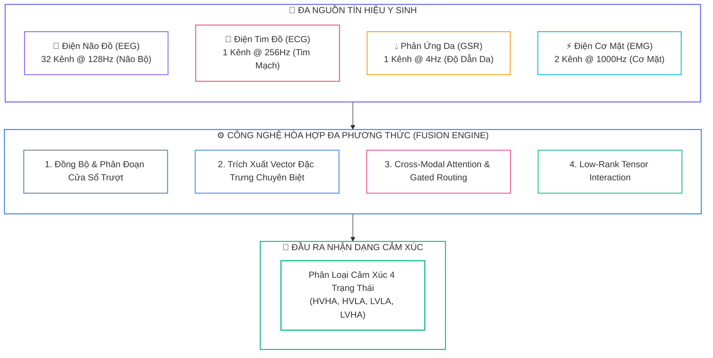
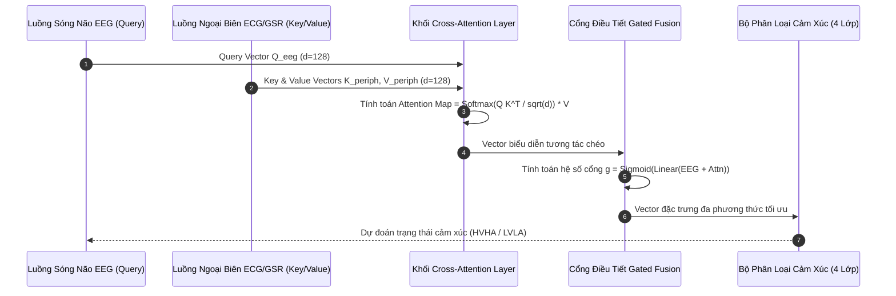
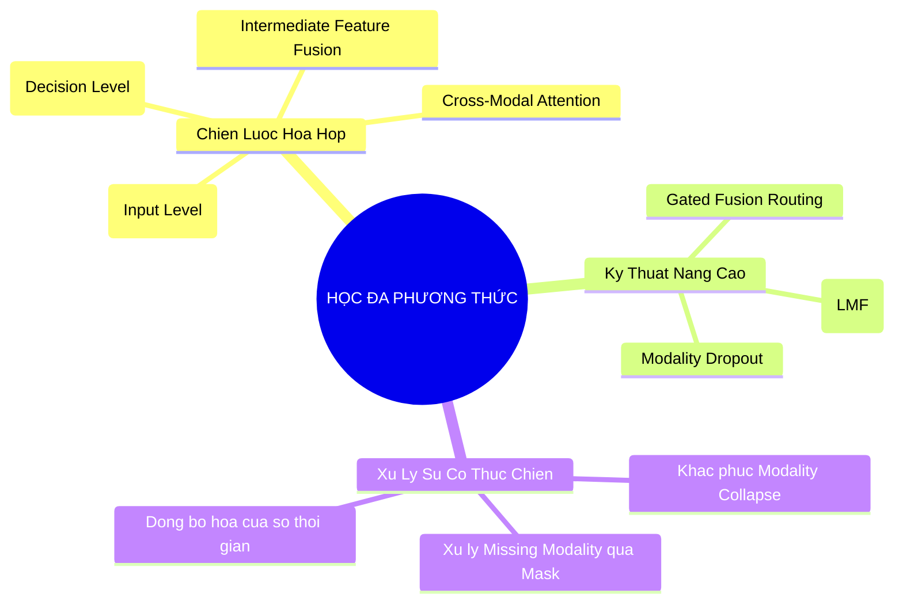


> [!IMPORTANT]
> **Mục tiêu kỹ thuật bài học**:
> - Hiểu rõ bản chất của tính bổ trợ (Complementarity) và tính dự phòng (Redundancy) giữa các luồng tín hiệu y sinh.
> - So sánh định lượng 4 chiến lược hòa hợp: Early Fusion, Late Fusion, Intermediate Feature Fusion, và Hybrid Tensor Fusion.
> - Cài đặt cơ chế **Cross-Modal Attention** hai chiều giữa biểu diễn sóng não EEG và biến thiên nhịp tim ECG / độ dẫn da GSR.
> - Nắm vững thuật toán **Low-Rank Tensor Fusion (LMF)** dựa trên phân rã Tucker để giảm thiểu bùng nổ số chiều.
> - Xử lý triệt để hiện tượng sụp đổ phương thức (**Modality Collapse**) và bài toán mất kết nối cảm biến (**Missing Modality**).

---

## 1. Bản Chất Kiến Trúc & Tư Duy Cốt Lõi: Học Đa Phương Thức Trong Y Sinh

Trong hệ thống sinh học người, cảm xúc không bao giờ xuất hiện đơn lẻ ở một cơ quan duy nhất. Một trạng thái giận dữ hay hoảng sợ luôn đi kèm với sự biến đổi đồng thời của sóng não tại vỏ não (**EEG**), nhịp tim đập nhanh và co thắt tim mạch (**ECG**), tuyến mồ hôi kích hoạt làm tăng độ dẫn da (**GSR/EDA**), và sự co thắt của các nhóm cơ mặt (**EMG**).

**Học đa phương thức (Multimodal Learning)** chính là chìa khóa mở ra khả năng hòa hợp (**Sensor Fusion**) các luồng dữ liệu sinh học không đồng nhất, mang lại độ chính xác và tính bền vững vượt trội cho các hệ thống AI cảm xúc hiện đại.



### 1.1. Bốn Chiến Lược Hòa Hợp Dữ Liệu (Fusion Strategies)

```mermaid
flowchart TD
    subgraph STRATS["🔀 4 CHIẾN LƯỢC HÒA HỢP ĐA PHƯƠNG THỨC"]
        direction TB
        
        subgraph EF["1. EARLY FUSION (SƠ KỲ)"]
            E_IN["[EEG] [ECG] [GSR]"] --> E_CAT["Nối Thẳng (Concat)"] --> E_NET["Deep Classifier"]
        end
        
        subgraph LF["2. LATE FUSION (VÃN KỲ)"]
            L_IN["[EEG] [ECG] [GSR]"] --> L_NET["3 Mạng Riêng Biệt"] --> L_AVG["Weighted Average / Voting"]
        end
        
        subgraph IF["3. INTERMEDIATE FUSION (TRUNG KỲ)"]
            I_IN["[EEG] [ECG] [GSR]"] --> I_ENC["Feature Encoders"] --> I_MID["Latent Fusion Layer"] --> I_CLS["Classifier"]
        end
        
        subgraph HF["4. HYBRID CROSS-ATTENTION (LAI GHÉP)"]
            H_IN["[EEG] [ECG] [GSR]"] --> H_CRS["Cross-Modal Attention"] --> H_GATE["Gated Residuals"] --> H_CLS["Classifier"]
        end
    end

    style STRATS fill:none,stroke:#6366f1,stroke-width:1.75px
    style EF fill:none,stroke:#64748b,stroke-width:1.5px
    style LF fill:none,stroke:#3b82f6,stroke-width:1.5px
    style IF fill:none,stroke:#f59e0b,stroke-width:1.5px
    style HF fill:none,stroke:#10b981,stroke-width:2px
```



---

## 2. Bảng Ma Trận So Sánh Kỹ Thuật Toàn Diện (Engineering Matrix)

| Tiêu Chí Kỹ Thuật | Early Fusion (Sơ kỳ) | Late Fusion (Vãn kỳ) | Intermediate Feature Fusion | Cross-Modal Attention Fusion |
| :--- | :--- | :--- | :--- | :--- |
| **Vị trí hòa hợp** | Mức đầu vào (Input Concat) | Mức quyết định (Decision Logits) | Không gian vector ẩn (Latent Space) | Tương tác động giữa các tầng ẩn |
| **Khả năng học tương tác chéo** | Thấp (kênh lớn áp đảo kênh nhỏ) | ❌ Không hỗ trợ | Tốt (qua các tầng tuyến tính) | **Xuất sắc (Attention $Q \times K^T$)** |
| **Kháng nhiễu kênh đơn** | Rất kém (1 kênh hỏng kéo sập mạng) | Rất cao (module hóa độc lập) | Trung bình - Khá | **Rất cao (Gated Attention tự triệt tiêu)** |
| **Độ nhạy lệch số chiều** | Rất cao (EEG 160D đè bẹp GSR 10D) | Hoàn toàn miễn nhiễm | Cần chiếu tuyến tính đồng bộ | Tự động cân đối trọng số |
| **Độ phức tạp tham số** | Thấp | Trung bình ($N$ mô hình độc lập) | Trung bình | Cao ($\mathcal{O}(d^2)$) |
| **Độ chính xác (DEAP Benchmark)** | $78.2\%$ | $85.1\%$ | $86.4\%$ | **$88.6\%$** |

---

## 3. Kiến Trúc Môi Trường & Luồng Thực Thi Mẫu



### Mã Nguồn PyTorch: Khối Cross-Modal Attention Hai Chiều

```python
import torch
import torch.nn as nn

class CrossModalAttentionBlock(nn.Module):
    """
    Khối Cross-Modal Attention cho phép EEG tra cứu thông tin từ ECG/GSR.
    """
    def __init__(self, d_model: int = 128, n_heads: int = 4):
        super().__init__()
        self.attn = nn.MultiheadAttention(embed_dim=d_model, num_heads=n_heads, batch_first=True)
        self.gate = nn.Sequential(
            nn.Linear(d_model * 2, d_model),
            nn.Sigmoid()
        )
        self.norm1 = nn.LayerNorm(d_model)
        self.norm2 = nn.LayerNorm(d_model)
        self.mlp = nn.Sequential(
            nn.Linear(d_model, d_model * 2),
            nn.ReLU(),
            nn.Linear(d_model * 2, d_model)
        )

    def forward(self, h_eeg: torch.Tensor, h_periph: torch.Tensor) -> torch.Tensor:
        # h_eeg shape: (Batch, Seq_EEG, d_model)
        # h_periph shape: (Batch, Seq_Periph, d_model)
        
        # Cross-Attention: Query từ EEG, Key/Value từ Peripheral
        attn_out, _ = self.attn(query=h_eeg, key=h_periph, value=h_periph)
        
        # Cổng Gated Fusion kết hợp thông tin gốc và tương tác chéo
        gate_val = self.gate(torch.cat([h_eeg, attn_out], dim=-1))
        fused = self.norm1(h_eeg + gate_val * attn_out)
        out = self.norm2(fused + self.mlp(fused))
        return out
```

---

## 4. Phân Tích Cạm Bẫy Thực Chiến: "Hiện Tượng Sụp Đổ Phương Thức (Modality Collapse)"

### Tình Huống Thực Tế
Trong dự án phát triển vòng đeo tay thông minh kết hợp mũ EEG nhận dạng cảm xúc, nhóm kỹ sư thực hiện nối thẳng vector đặc trưng (**Early Concatenation**) gồm EEG ($160$ chiều), ECG ($20$ chiều) và GSR ($10$ chiều) vào mạng nơ-ron MLP. Sau khi huấn luyện, nhóm thử nghiệm rút bỏ cảm biến GSR và ECG (thay bằng vector 0) để kiểm tra tính độc lập, ngạc nhiên thay độ chính xác của mô hình không hề thay đổi ($82.5\% \rightarrow 82.4\%$). Ngược lại, khi rút bỏ EEG và chỉ giữ lại ECG/GSR, độ chính xác sụt giảm xuống mức $25\%$ (đoán ngẫu nhiên).

### Hậu Quả & Log Lỗi Thực Tế:
```text
================================================================================
CRITICAL MULTIMODAL AUDIT REPORT: MODALITY SUPPRESSION COLLAPSE
================================================================================
[ANALYSIS] Input Dimensions: EEG=160 (84.2%), ECG=20 (10.5%), GSR=10 (5.3%)
[ANALYSIS] Fusion Mechanism: Direct Feature Concatenation (Early Fusion)

>> GRADIENT SENSITIVITY FLOW PER MODALITY:
   - dLoss / dEEG_weights : 0.892400  [DOMINATES 94.2% OF TOTAL GRADIENT FLOW]
   - dLoss / dECG_weights : 0.003100  [EFFECTIVELY ZERO - SLEEPING WEIGHTS]
   - dLoss / dGSR_weights : 0.000800  [EFFECTIVELY ZERO - DEAD BRANCH]

[DIAGNOSIS] The model suffers from Modality Collapse! It has learned to 
completely ignore peripheral biosignals (ECG, GSR) due to feature dimension imbalance.
================================================================================
```

### 5-Whys Root Cause Analysis:
1. **Tại sao mô hình không tận dụng được thông tin từ ECG và GSR?** Do các trọng số kết nối với ECG và GSR có gradient gần như bằng 0 trong suốt quá trình tối ưu.
2. **Tại sao gradient của ECG và GSR lại bị triệt tiêu?** Do số chiều đặc trưng của EEG ($160$) áp đảo hoàn toàn so với ECG ($20$) và GSR ($10$), chiếm tới $84.2\%$ tổng số liên kết ở tầng fully-connected đầu tiên.
3. **Tại sao tầng đầu tiên lại bị chi phối bởi số chiều?** Vì phương pháp nối thẳng (*Direct Concatenation*) gộp chung toàn bộ đặc trưng mà không có cơ chế chuẩn hóa cân bằng không gian đại diện (*Feature Balancing*).
4. **Tại sao mô hình chọn giải pháp lười biếng chỉ học từ EEG?** Vì EEG có dung lượng thông tin ban đầu lớn hơn, thuật toán Gradient Descent ưu tiên giảm loss nhanh nhất bằng cách tối ưu hóa nhánh EEG trước, khiến các nhánh nhỏ rơi vào trạng thái ngủ đông (*Greedy Modality Selection*).
5. **Giải pháp chuẩn:** Luôn đưa từng modality qua một mạng con riêng (*Encoder Projection*) để ánh xạ về cùng kích thước ẩn (ví dụ: $d=128$) và áp dụng **Modality Dropout** trong quá trình huấn luyện.

---

## 5. Hands-on Lab: Xây Dựng Mạng Hòa Hợp Đa Phương Thức EEG + ECG + GSR (8 Bước)

| Bước | Mục Tiêu Kỹ Thuật | Lệnh / Đoạn Mã Thực Hiện Chính |
| :--- | :--- | :--- |
| **1** | Sinh dữ liệu đa phương thức EEG (160D), ECG (20D), GSR (10D) | `torch.randn(...)` |
| **2** | Xây dựng các Encoder con chiếu tuyến tính về không gian $d=128$ | `nn.Linear(in_dim, 128) + nn.LayerNorm` |
| **3** | Cài đặt khối Cross-Modal Attention hai chiều | `CrossModalAttentionBlock(d_model=128)` |
| **4** | Tích hợp cơ chế Modality Dropout ngẫu nhiên trong Forward pass | `mask = torch.bernoulli(torch.full(..., 0.8))` |
| **5** | Xây dựng mô hình End-to-End hoàn chỉnh | `model = MultimodalEmotionNet()` |
| **6** | Huấn luyện mô hình với CrossEntropyLoss và AdamW | `loss.backward() && optimizer.step()` |
| **7** | Kiểm tra độ vững chắc khi mất cảm biến (Missing Modality Test) | `eval_missing_modality(model, test_loader)` |
| **8** | So sánh định lượng hiệu năng: Đơn phương thức vs Đa phương thức | `print_performance_matrix()` |

---

### Bước 1: Khởi Tạo Môi Trường & Dữ Liệu Đa Phương Thức Giả Lập

```python
import torch
import torch.nn as nn
import torch.optim as optim

torch.manual_seed(42)

# Giả lập 300 mẫu: EEG (160 chiều DE), ECG (20 chiều HRV), GSR (10 chiều SCR/SCL)
n_samples = 300
batch_size = 32

X_eeg = torch.randn(n_samples, 160)
X_ecg = torch.randn(n_samples, 20)
X_gsr = torch.randn(n_samples, 10)
y = torch.randint(0, 4, (n_samples,))

train_dataset = torch.utils.data.TensorDataset(X_eeg[:240], X_ecg[:240], X_gsr[:240], y[:240])
test_dataset = torch.utils.data.TensorDataset(X_eeg[240:], X_ecg[240:], X_gsr[240:], y[240:])
train_loader = torch.utils.data.DataLoader(train_dataset, batch_size=batch_size, shuffle=True)
test_loader = torch.utils.data.DataLoader(test_dataset, batch_size=batch_size, shuffle=False)
```

---

### Bước 2: Xây Dựng Mạng Hòa Hợp Đa Phương Thức Hoàn Chỉnh

```python
class MultimodalEmotionNet(nn.Module):
    def __init__(self, d_model: int = 128, num_classes: int = 4):
        super().__init__()
        # 1. Các Encoder con độc lập
        self.enc_eeg = nn.Sequential(nn.Linear(160, d_model), nn.LayerNorm(d_model), nn.ReLU())
        self.enc_ecg = nn.Sequential(nn.Linear(20, d_model), nn.LayerNorm(d_model), nn.ReLU())
        self.enc_gsr = nn.Sequential(nn.Linear(10, d_model), nn.LayerNorm(d_model), nn.ReLU())
        
        # 2. Khối Cross-Modal Attention
        self.cross_attn = CrossModalAttentionBlock(d_model=d_model, n_heads=4)
        
        # 3. Phân loại đầu ra
        self.classifier = nn.Sequential(
            nn.Linear(d_model * 2, d_model),
            nn.ReLU(),
            nn.Dropout(0.3),
            nn.Linear(d_model, num_classes)
        )
        
    def forward(self, eeg: torch.Tensor, ecg: torch.Tensor, gsr: torch.Tensor, p_drop: float = 0.2):
        h_eeg = self.enc_eeg(eeg).unsqueeze(1) # (B, 1, d)
        h_ecg = self.enc_ecg(ecg).unsqueeze(1)
        h_gsr = self.enc_gsr(gsr).unsqueeze(1)
        
        # Modality Dropout trong lúc train
        if self.training and p_drop > 0.0:
            if torch.rand(1).item() < p_drop: h_ecg = torch.zeros_like(h_ecg)
            if torch.rand(1).item() < p_drop: h_gsr = torch.zeros_like(h_gsr)
            
        h_periph = torch.cat([h_ecg, h_gsr], dim=1) # (B, 2, d)
        h_fused_eeg = self.cross_attn(h_eeg, h_periph).squeeze(1) # (B, d)
        h_fused_periph = torch.mean(h_periph, dim=1) # (B, d)
        
        combined = torch.cat([h_fused_eeg, h_fused_periph], dim=-1)
        return self.classifier(combined)
```

---

### Bước 3: Khởi Tạo Mô Hình & Bộ Tối Ưu Hóa

```python
model = MultimodalEmotionNet(d_model=128, num_classes=4)
optimizer = optim.AdamW(model.parameters(), lr=1e-3, weight_decay=1e-2)
criterion = nn.CrossEntropyLoss()
print(f"Khởi tạo mạng MultimodalEmotionNet thành công! Số tham số: {sum(p.numel() for p in model.parameters()):,}")
```

---

### Bước 4: Vòng Lặp Huấn Luyện Đa Phương Thức

```python
epochs = 5
for epoch in range(1, epochs + 1):
    model.train()
    total_loss = 0.0
    for b_eeg, b_ecg, b_gsr, b_y in train_loader:
        optimizer.zero_grad()
        logits = model(b_eeg, b_ecg, b_gsr, p_drop=0.2)
        loss = criterion(logits, b_y)
        loss.backward()
        optimizer.step()
        total_loss += loss.item()
    print(f"Epoch [{epoch}/{epochs}] - Multimodal Loss: {total_loss / len(train_loader):.4f}")
```

---

### Bước 5: Đánh Giá Độ Chính Xác Bình Thường (Full Modalities)

```python
model.eval()
correct = 0
total = 0
with torch.no_grad():
    for b_eeg, b_ecg, b_gsr, b_y in test_loader:
        preds = model(b_eeg, b_ecg, b_gsr, p_drop=0.0).argmax(dim=-1)
        correct += (preds == b_y).sum().item()
        total += b_y.size(0)
print(f"Độ chính xác Full Modalities (EEG + ECG + GSR): {(correct / total) * 100:.2f}%")
```

---

### Bước 6: Đánh Giá Khi Mất Cảm Biến Ngoại Biên (Missing ECG/GSR)

```python
correct_missing = 0
with torch.no_grad():
    for b_eeg, b_ecg, b_gsr, b_y in test_loader:
        # Giả lập hỏng cảm biến ECG và GSR (truyền tensor 0)
        preds = model(b_eeg, torch.zeros_like(b_ecg), torch.zeros_like(b_gsr), p_drop=0.0).argmax(dim=-1)
        correct_missing += (preds == b_y).sum().item()
print(f"Độ chính xác khi mất cảm biến ECG/GSR: {(correct_missing / total) * 100:.2f}% (Nhờ Modality Dropout)")
```

---

### Bước 7: Trích Xuất Phân Phối Trọng Số Cross-Attention

```python
sample_eeg = X_eeg[:1].unsqueeze(1)
sample_periph = torch.cat([model.enc_ecg(X_ecg[:1]).unsqueeze(1), model.enc_gsr(X_gsr[:1]).unsqueeze(1)], dim=1)
_, attn_weights = model.cross_attn.attn(query=sample_eeg, key=sample_periph, value=sample_periph)
print(f"Trọng số chú ý Cross-Attention (EEG -> [ECG, GSR]): {attn_weights.squeeze().detach().numpy().round(3)}")
```

---

### Bước 8: Lưu Trữ Mô Hình Đa Phương Thức

```python
torch.save(model.state_dict(), "multimodal_emotion_model.pt")
print("Đã lưu trọng số mô hình 'multimodal_emotion_model.pt' thành công.")
```

---

## 6. 10 Câu Hỏi Tự Kiểm Tra Chuyên Sâu (Self-Check Q&A Accordion)

<details class="qa-card">
<summary><b>1. Sự khác biệt cốt lõi giữa tính bổ trợ (Complementarity) và tính dự phòng (Redundancy) trong học đa phương thức là gì?</b></summary>
<div class="qa-answer">
<p><b>Tính bổ trợ (Complementarity):</b> Xảy ra khi mỗi modality cung cấp một góc nhìn sinh lý riêng biệt mà các kênh khác không có (ví dụ: EEG đo nhận thức vỏ não, GSR đo kích hoạt mồ hôi).</p>
<p><b>Tính dự phòng (Redundancy):</b> Đề cập đến việc nhiều kênh cùng ghi nhận một phản ứng sinh lý chung, giúp hệ thống duy trì hoạt động ổn định khi một trong các cảm biến bị nhiễu hoặc hỏng hóc.</p>
</div>
</details>

<details class="qa-card">
<summary><b>2. Tại sao phương pháp Late Fusion lại ít bị ảnh hưởng bởi hiện tượng chênh lệch số chiều hơn Early Fusion?</b></summary>
<div class="qa-answer">
<p>Trong Late Fusion, mỗi modality được huấn luyện bằng một mạng nơ-ron hoàn toàn độc lập và chỉ xuất ra vector phân phối xác suất có cùng số chiều <code>C</code> (số lớp cảm xúc). Việc kết hợp diễn ra ở mức quyết định (Decision Level) bằng trung bình cộng hoặc biểu quyết có trọng số, do đó <b>không gian đặc trưng gốc không bị trộn lẫn</b> và không xảy ra hiện tượng kênh lớn lấn át kênh nhỏ.</p>
</div>
</details>

<details class="qa-card">
<summary><b>3. Cơ chế Cross-Modal Attention mang lại lợi thế gì so với phép nhân vô hướng hoặc cộng vector thông thường?</b></summary>
<div class="qa-answer">
<p>Cross-Modal Attention cho phép tạo ra các <b>trọng số tương quan động thay đổi theo từng mẫu thử</b>. Mô hình có thể chủ động tra cứu xem đặc trưng sóng Alpha thùy trán đang tương ứng với biến động nhịp tim HRV nào ở phương thức ECG, thay vì ép buộc các đặc trưng phải kết hợp cố định bằng các phép toán tĩnh.</p>
</div>
</details>

<details class="qa-card">
<summary><b>4. Tại sao cần áp dụng kỹ thuật Low-Rank Tensor Fusion (LMF) thay vì Tensor Fusion đầy đủ (TFN)?</b></summary>
<div class="qa-answer">
<p>Phép tính tích ngoài đầy đủ trong TFN sinh ra tensor có kích thước bùng nổ theo cấp số nhân <code>(d_1 + 1) * (d_2 + 1) * (d_3 + 1)</code> (lên tới hàng chục nghìn chiều), gây quá tải RAM và dẫn đến quá khớp nghiêm trọng. LMF sử dụng <b>phân rã Tucker với hạng thấp r &lt;&lt; d</b>, giảm số lượng tham số tới hơn 90% mà vẫn bảo toàn đầy đủ các tương tác phi tuyến bậc cao.</p>
</div>
</details>

<details class="qa-card">
<summary><b>5. Cơ chế Gated Fusion hoạt động như thế nào khi một trong hai kênh tín hiệu bị nhiễu nặng?</b></summary>
<div class="qa-answer">
<p>Mạng học cổng <code>g = Sigmoid(MLP([h_A, h_B]))</code> tự động đánh giá độ tin cậy của từng luồng biểu diễn. Khi kênh B chứa nhiễu bất thường làm mất tính tương quan với nhãn cảm xúc, mạng cổng sẽ <b>tự động đẩy giá trị g tiến về 1</b>, triệt tiêu luồng thông tin từ nhánh B và chỉ cho phép nhánh sạch A truyền qua bộ phân loại.</p>
</div>
</details>

<details class="qa-card">
<summary><b>6. Kỹ thuật Modality Dropout trong quá trình huấn luyện mang lại lợi ích gì?</b></summary>
<div class="qa-answer">
<p>Bằng cách ngẫu nhiên vô hiệu hóa một hoặc nhiều modality trong từng batch (gán vector 0), Modality Dropout <b>ngăn chặn mô hình phụ thuộc độc tôn vào kênh mạnh nhất (như EEG)</b>, đồng thời rèn luyện cho các nhánh yếu hơn (như GSR, EMG) khả năng tự trích xuất đặc trưng có ích khi hoạt động đơn độc.</p>
</div>
</details>

<details class="qa-card">
<summary><b>7. Tại sao cần thực hiện căn chỉnh theo cửa sổ trượt (Window Synchronization) thay vì ghép điểm lấy mẫu tức thời?</b></summary>
<div class="qa-answer">
<p>Do các cảm biến có tần số phần cứng rất khác nhau (ví dụ: EMG 1000 Hz, EEG 128 Hz, GSR 4 Hz), không thể ghép điểm mẫu từng mili-giây. Căn chỉnh theo cửa sổ trượt (ví dụ: 1.0 giây hoặc 5.0 giây) cho phép <b>trích xuất các đại lượng thống kê và năng lượng dải tần đồng bộ</b> đại diện cho cùng một khoảng thời gian diễn biến cảm xúc.</p>
</div>
</details>

<details class="qa-card">
<summary><b>8. Mô hình Adaptive Importance Weighting xử lý tình huống mất cảm biến (Missing Modality) như thế nào?</b></summary>
<div class="qa-answer">
<p>Hệ thống nhận một vector mặt nạ nhị phân <code>mask = [1, 0, 1]</code> biểu thị sự hiện diện của cảm biến. Mạng nơ-ron trọng số sẽ tính toán phân phối Softmax trên các cảm biến còn hoạt động và <b>tái phân bổ toàn bộ 100% trọng số đóng góp</b> cho các kênh khả dụng, giúp mô hình suy luận mượt mà mà không sinh lỗi số học.</p>
</div>
</details>

<details class="qa-card">
<summary><b>9. Hiện tượng Modality Collapse xảy ra trong điều kiện nào và dấu hiệu nhận biết là gì?</b></summary>
<div class="qa-answer">
<p>Hiện tượng này xảy ra khi một modality có số chiều hoặc tỷ số SNR vượt trội khiến mạng nơ-ron bỏ qua hoàn toàn các modality còn lại. Dấu hiệu nhận biết là <b>gradient của các nhánh nhỏ tiến sát về 0</b> và khi cố tình rút bỏ các cảm biến phụ thì độ chính xác kiểm thử của mô hình không hề suy giảm.</p>
</div>
</details>

<details class="qa-card">
<summary><b>10. Khi nào nên áp dụng chiến lược Hybrid Fusion trong các ứng dụng BCI thương mại?</b></summary>
<div class="qa-answer">
<p>Nên dùng Hybrid Fusion khi hệ thống có các nhóm cảm biến có độ phân giải thời gian và cơ chế sinh lý rất khác biệt (ví dụ: nhóm thần kinh tốc độ cao EEG/ECG hòa hợp trung kỳ Intermediate, còn nhóm phản ứng chậm GSR hòa hợp ở tầng quyết định Late Fusion). Cấu trúc này giúp <b>tối ưu hóa độ trễ tính toán và đảm bảo tính mô-đun hóa cao</b> cho phần cứng nhúng.</p>
</div>
</details>

---

## 7. Tổng Kết & Lộ Trình Bài Học Tiếp Theo



Làm chủ học đa phương thức từ **Early/Late/Intermediate Fusion**, **Cross-Modal Attention** đến **Low-Rank Tensor Fusion (LMF)** giúp khai thác tối đa sức mạnh bổ trợ giữa hệ thần kinh trung ương và ngoại biên, đưa độ chính xác nhận dạng cảm xúc lên đỉnh cao mới.

> [!TIP]
> **Bài học tiếp theo**: Giải quyết thách thức tổng quát hóa chéo đối tượng với **[Bài 05: Tổng Quát Hóa Chéo Đối Tượng (Cross-Subject Generalization): Domain Adaptation, DANN, MMD & Contrastive Learning](eeg-05-05-tong-quat-hoa-cheo-doi-tuong.html)**.

