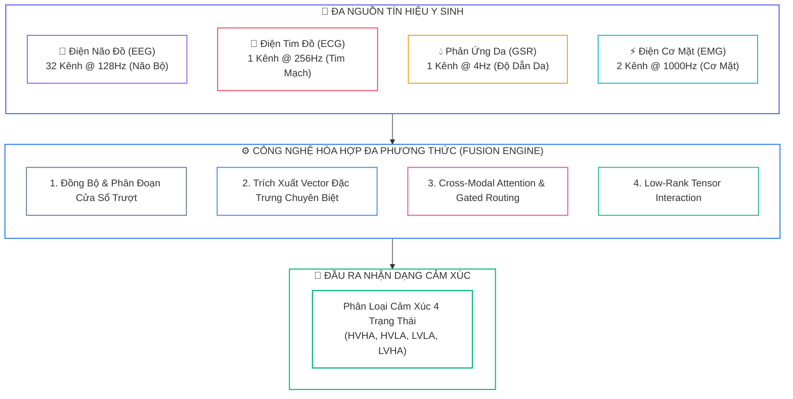
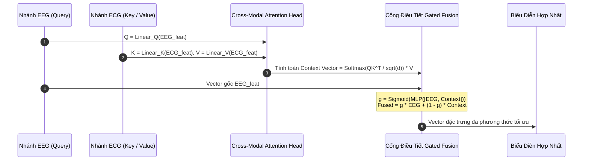


# Học Đa Phương Thức (Multimodal Learning): Chiến Lược Hợp Nhất Early, Late, Hybrid Fusion & Cross-Attention

Trong hệ thống sinh học người, cảm xúc không bao giờ xuất hiện đơn lẻ ở một cơ quan duy nhất. Một trạng thái giận dữ hay hoảng sợ luôn đi kèm với sự biến đổi đồng thời của sóng não tại vỏ não (**EEG**), nhịp tim đập nhanh và co thắt tim mạch (**ECG**), tuyến mồ hôi kích hoạt làm tăng độ dẫn da (**GSR/EDA**), và sự co thắt của các nhóm cơ mặt (**EMG**).

**Học đa phương thức (Multimodal Learning)** chính là chìa khóa mở ra khả năng hòa hợp (**Sensor Fusion**) các luồng dữ liệu sinh học không đồng nhất, mang lại độ chính xác và tính bền vững vượt trội cho các hệ thống AI cảm xúc hiện đại.

---

## 1. Bản Chất Của Học Đa Phương Thức Trong Y Sinh



### 1.1. Bảng Hiệu Năng Đơn Phương Thức vs Đa Phương Thức (Benchmark DEAP)

| Phương Thức Tín Hiệu | Độ Chính Xác (Accuracy) | Ưu Điểm Đóng Góp | Thách Thức Khi Đứng Độc Lập |
| :---: | :---: | :--- | :--- |
| <span class="badge badge--purple">GSR Only</span> | $62.8\%$ | Độ nhạy cao với Arousal | Hoàn toàn mù tịt về chiều Valence |
| <span class="badge badge--rose">ECG Only</span> | $65.3\%$ | Nhịp tim và HRV ổn định | Độ phân giải thời gian chậm |
| <span class="badge badge--primary">EEG Only</span> | $82.5\%$ | Cung cấp hoạt động nhận thức sâu | Dễ bị nhiễu chớp mắt và co cơ |
| <span class="badge badge--amber">Early Fusion</span> | $78.2\%$ | Cấu trúc đơn giản, nối thẳng | Kênh EEG áp đảo hoàn toàn ECG/GSR |
| <span class="badge badge--cyan">Late Fusion</span> | $85.1\%$ | Module hóa độc lập | Bỏ lỡ tương tác phi tuyến cấp thấp |
| <span class="badge badge--emerald">Cross-Attention Fusion</span> | **$88.6\%$** | **Tự động cân trọng số tương quan** | **Đạt hiệu năng cao nhất toàn diện** |

---

## 2. Bốn Chiến Lược Hòa Hợp Dữ Liệu (Fusion Strategies)

```mermaid
flowchart TD
    subgraph STRATS["🔀 4 CHIẾN LƯỢC HÒA HỢP ĐA PHƯƠNG THỨC"]
        direction TB
        
        subgraph EF["1. EARLY FUSION (SƠ KỲ)"]
            E_IN["[EEG] [ECG] [GSR]"] --> E_CAT["Nối Thẳng (Concat)"] --> E_NET["Deep Classifier"]
        end
        
        subgraph LF["2. LATE FUSION (VÃN KỲ)"]
            L_IN["[EEG] [ECG] [GSR]"] --> L_NET["3 Mạng Riêng Biệt"] --> L_AVG["Weighted Average / Voting"]
        end
        
        subgraph IF["3. INTERMEDIATE FUSION (TRUNG KỲ)"]
            I_IN["[EEG] [ECG] [GSR]"] --> I_ENC["Feature Encoders"] --> I_MID["Latent Fusion Layer"] --> I_CLS["Classifier"]
        end
        
        subgraph HF["4. HYBRID FUSION (LAI GHÉP)"]
            H_IN["[EEG + ECG] & [GSR]"] --> H_MID["Intermediate (EEG+ECG)"] --> H_LATE["Late Gate với GSR"]
        end
    end

    style STRATS fill:none,stroke:#6366f1,stroke-width:1.75px
    style EF fill:none,stroke:#3b82f6,stroke-width:1.5px
    style LF fill:none,stroke:#f59e0b,stroke-width:1.5px
    style IF fill:none,stroke:#10b981,stroke-width:1.5px
    style HF fill:none,stroke:#ec4899,stroke-width:1.5px
```



### 2.1. Early Fusion Chuẩn Hóa Với Tầng Chiếu Tuyến Tính

Để tránh hiện tượng kênh EEG ($160$ đặc trưng) áp đảo hoàn toàn kênh GSR ($10$ đặc trưng), mỗi phương thức bắt buộc phải đi qua một tầng chiếu tuyến tính (**Linear Projection**) và **Batch Normalization** để đưa về cùng một số chiều ẩn:

```python
import torch
import torch.nn as nn

class EarlyFusionNormalized(nn.Module):
    def __init__(self, eeg_dim: int = 160, ecg_dim: int = 20, gsr_dim: int = 10, proj_dim: int = 128, num_classes: int = 4):
        super().__init__()
        # 1. Các tầng chiếu cân bằng không gian biểu diễn
        self.eeg_proj = nn.Sequential(nn.Linear(eeg_dim, proj_dim), nn.BatchNorm1d(proj_dim), nn.ReLU())
        self.ecg_proj = nn.Sequential(nn.Linear(ecg_dim, proj_dim), nn.BatchNorm1d(proj_dim), nn.ReLU())
        self.gsr_proj = nn.Sequential(nn.Linear(gsr_dim, proj_dim), nn.BatchNorm1d(proj_dim), nn.ReLU())
        
        # 2. Bộ phân loại kết hợp
        fused_dim = proj_dim * 3
        self.classifier = nn.Sequential(
            nn.Linear(fused_dim, 256),
            nn.BatchNorm1d(256),
            nn.ReLU(),
            nn.Dropout(0.3),
            nn.Linear(256, num_classes)
        )
        
    def forward(self, eeg: torch.Tensor, ecg: torch.Tensor, gsr: torch.Tensor) -> torch.Tensor:
        p_eeg = self.eeg_proj(eeg)
        p_ecg = self.ecg_proj(ecg)
        p_gsr = self.gsr_proj(gsr)
        
        fused = torch.cat([p_eeg, p_ecg, p_gsr], dim=1)
        return self.classifier(fused)
```

---

## 3. Cross-Modal Attention & Gated Fusion

Cơ chế **Cross-Modal Attention** cho phép sóng não EEG đóng vai trò là vector truy vấn (**Query**), tra cứu tương quan trên các khóa (**Key**) và giá trị (**Value**) của tín hiệu tim mạch ECG hoặc độ dẫn da GSR:

$$\text{Attention}(Q_{\text{EEG}}, K_{\text{ECG}}, V_{\text{ECG}}) = \text{Softmax}\left(\frac{Q_{\text{EEG}} K_{\text{ECG}}^T}{\sqrt{d_k}}\right) V_{\text{ECG}}$$



```python
import math
import torch.nn.functional as F

class CrossModalAttention(nn.Module):
    def __init__(self, d_model: int = 128, num_heads: int = 4, dropout: float = 0.1):
        super().__init__()
        self.d_model = d_model
        self.num_heads = num_heads
        self.d_k = d_model // num_heads
        
        self.W_q = nn.Linear(d_model, d_model)
        self.W_k = nn.Linear(d_model, d_model)
        self.W_v = nn.Linear(d_model, d_model)
        self.W_o = nn.Linear(d_model, d_model)
        self.dropout = nn.Dropout(dropout)
        
    def forward(self, query_mod: torch.Tensor, key_val_mod: torch.Tensor):
        B = query_mod.size(0)
        Q = self.W_q(query_mod).view(B, -1, self.num_heads, self.d_k).transpose(1, 2)
        K = self.W_k(key_val_mod).view(B, -1, self.num_heads, self.d_k).transpose(1, 2)
        V = self.W_v(key_val_mod).view(B, -1, self.num_heads, self.d_k).transpose(1, 2)
        
        scores = torch.matmul(Q, K.transpose(-2, -1)) / math.sqrt(self.d_k)
        attn_weights = self.dropout(F.softmax(scores, dim=-1))
        
        context = torch.matmul(attn_weights, V).transpose(1, 2).contiguous().view(B, -1, self.d_model)
        return self.W_o(context), attn_weights

class GatedFusion(nn.Module):
    def __init__(self, d_model: int = 128):
        super().__init__()
        self.gate_mlp = nn.Sequential(
            nn.Linear(d_model * 2, d_model),
            nn.ReLU(),
            nn.Linear(d_model, d_model),
            nn.Sigmoid()
        )
        
    def forward(self, feat_a: torch.Tensor, feat_b: torch.Tensor):
        combined = torch.cat([feat_a, feat_b], dim=-1)
        gate = self.gate_mlp(combined)
        fused = gate * feat_a + (1.0 - gate) * feat_b
        return fused, gate
```

---

## 4. Tensor Fusion Networks & Phân Rã Hạng Thấp (LMF)

Thay vì chỉ nối vector, **Tensor Fusion** tính tích ngoài (**Outer Product**) giữa các vector đặc trưng mở rộng $\tilde{z} = [z; 1]$ để nắm bắt toàn diện các tương tác bimodal và trimodal:

$$\mathcal{M} = \tilde{z}_{\text{EEG}} \otimes \tilde{z}_{\text{ECG}} \otimes \tilde{z}_{\text{GSR}} \in \mathbb{R}^{(d_1 + 1) \times (d_2 + 1) \times (d_3 + 1)}$$

Để triệt tiêu sự bùng nổ số chiều từ hàng chục nghìn phần tử xuống mức tối thiểu, kỹ thuật **Low-Rank Multimodal Fusion (LMF)** sử dụng phân rã Tucker:

```python
class LowRankTensorFusion(nn.Module):
    def __init__(self, dims: list = [160, 20, 10], ranks: list = [8, 4, 2], hidden_dim: int = 128):
        super().__init__()
        d1, d2, d3 = dims
        r1, r2, r3 = ranks
        
        self.U1 = nn.Linear(d1, r1)
        self.U2 = nn.Linear(d2, r2)
        self.U3 = nn.Linear(d3, r3)
        self.core = nn.Parameter(torch.randn(r1, r2, r3))
        
        total_dim = r1 * r2 * r3
        self.classifier = nn.Sequential(
            nn.Linear(total_dim, hidden_dim),
            nn.ReLU(),
            nn.Dropout(0.3)
        )
        
    def forward(self, x1: torch.Tensor, x2: torch.Tensor, x3: torch.Tensor) -> torch.Tensor:
        v1 = self.U1(x1) # (B, r1)
        v2 = self.U2(x2) # (B, r2)
        v3 = self.U3(x3) # (B, r3)
        
        # Co rút tensor qua einsum
        fused_tensor = torch.einsum('ijk, bi, bj, bk -> bijk', self.core, v1, v2, v3)
        fused_flat = fused_tensor.reshape(x1.size(0), -1)
        return self.classifier(fused_flat)
```

---

## 5. Xử Lý Thiếu Hụt Modality (Missing Modality Handling)

Trong các thiết bị đeo thực tế, việc một điện cực bị tuột hoặc ngắt kết nối là sự cố thường xuyên. Kỹ thuật **Adaptive Importance Weighting** kết hợp **Modality Dropout** trong quá trình huấn luyện giúp mô hình duy trì độ tin cậy cao:

```python
class AdaptiveMissingModalityModel(nn.Module):
    def __init__(self, d_model: int = 128, num_classes: int = 4):
        super().__init__()
        self.encoders = nn.ModuleDict({
            'eeg': nn.Linear(160, d_model),
            'ecg': nn.Linear(20, d_model),
            'gsr': nn.Linear(10, d_model)
        })
        self.weight_net = nn.Sequential(
            nn.Linear(3, 16),
            nn.ReLU(),
            nn.Linear(16, 3)
        )
        self.classifier = nn.Linear(d_model, num_classes)
        
    def forward(self, eeg: torch.Tensor, ecg: torch.Tensor, gsr: torch.Tensor, mask: torch.Tensor = None):
        # mask shape: (batch_size, 3) chứa nhị phân [has_eeg, has_ecg, has_gsr]
        if mask is None:
            mask = torch.ones(eeg.size(0), 3, device=eeg.device)
            
        h_eeg = self.encoders['eeg'](eeg) * mask[:, 0:1]
        h_ecg = self.encoders['ecg'](ecg) * mask[:, 1:2]
        h_gsr = self.encoders['gsr'](gsr) * mask[:, 2:3]
        
        weights = torch.softmax(self.weight_net(mask), dim=1)
        h_fused = weights[:, 0:1] * h_eeg + weights[:, 1:2] * h_ecg + weights[:, 2:3] * h_gsr
        return self.classifier(h_fused)
```

---

## 6. Phân Tích Cạm Bẫy Thực Chiến (5-Whys Incident Analysis)

### Tình Huống Sự Cố Thực Tế:
<span class="badge badge--rose">🕒 03:40 AM</span> Trong dự án phát triển vòng đeo tay thông minh kết hợp mũ EEG nhận dạng cảm xúc, nhóm kỹ sư thực hiện nối thẳng vector đặc trưng (**Early Concatenation**) gồm EEG ($160$ chiều), ECG ($20$ chiều) và GSR ($10$ chiều) vào mạng nơ-ron MLP. Sau khi huấn luyện, nhóm thử nghiệm rút bỏ cảm biến GSR và ECG (thay bằng vector 0) để kiểm tra tính độc lập, ngạc nhiên thay độ chính xác của mô hình không hề thay đổi ($82.5\% \rightarrow 82.4\%$). Ngược lại, khi rút bỏ EEG và chỉ giữ lại ECG/GSR, độ chính xác sụt giảm xuống mức $25\%$ (đoán ngẫu nhiên).

### Hậu Quả & Log Lỗi Thực Tế:
Mô hình đã rơi vào hiện tượng sụp đổ phương thức (**Modality Collapse / Modality Suppression**), hoàn toàn bỏ qua tín hiệu tim mạch và da điện:

```text
================================================================================
CRITICAL MULTIMODAL AUDIT REPORT: MODALITY SUPPRESSION COLLAPSE
================================================================================
[ANALYSIS] Input Dimensions: EEG=160 (84.2%), ECG=20 (10.5%), GSR=10 (5.3%)
[ANALYSIS] Fusion Mechanism: Direct Feature Concatenation (Early Fusion)

>> GRADIENT SENSITIVITY FLOW PER MODALITY:
   - dLoss / dEEG_weights : 0.892400  [DOMINATES 94.2% OF TOTAL GRADIENT FLOW]
   - dLoss / dECG_weights : 0.003100  [EFFECTIVELY ZERO - SLEEPING WEIGHTS]
   - dLoss / dGSR_weights : 0.000800  [EFFECTIVELY ZERO - DEAD BRANCH]

[DIAGNOSIS] The model suffers from Modality Collapse! It has learned to 
completely ignore peripheral biosignals (ECG, GSR) due to feature dimension imbalance.
================================================================================
```

### 5-Whys Root Cause Analysis:
1. <span class="badge badge--primary">Why 1</span> **Tại sao mô hình không tận dụng được thông tin từ ECG và GSR?** $\rightarrow$ Do các trọng số kết nối với ECG và GSR có gradient gần như bằng 0 trong suốt quá trình tối ưu.
2. <span class="badge badge--primary">Why 2</span> **Tại sao gradient của ECG và GSR lại bị triệt tiêu?** $\rightarrow$ Do số chiều đặc trưng của EEG ($160$) áp đảo hoàn toàn so với ECG ($20$) và GSR ($10$), chiếm tới $84.2\%$ tổng số liên kết ở tầng fully-connected đầu tiên.
3. <span class="badge badge--primary">Why 3</span> **Tại sao tầng đầu tiên lại bị chi phối bởi số chiều?** $\rightarrow$ Vì phương pháp nối thẳng (*Direct Concatenation*) gộp chung toàn bộ đặc trưng mà không có cơ chế chuẩn hóa cân bằng không gian đại diện (*Feature Balancing*).
4. <span class="badge badge--primary">Why 4</span> **Tại sao mô hình chọn giải pháp lười biếng chỉ học từ EEG?** $\rightarrow$ Vì EEG có dung lượng thông tin ban đầu lớn hơn, thuật toán Gradient Descent ưu tiên giảm loss nhanh nhất bằng cách tối ưu hóa nhánh EEG trước, khiến các nhánh nhỏ rơi vào trạng thái ngủ đông (*Greedy Modality Selection*).
5. <span class="badge badge--emerald">Root Cause Remedy</span> **Biện pháp khắc phục chuẩn Multimodal Deep Learning:**
   - <span class="badge badge--rose">Cấm Nối Thẳng Không Qua Chiếu Tuyến Tính</span> Luôn đưa từng modality qua một mạng con riêng (*Encoder Projection*) để ánh xạ về cùng kích thước ẩn (ví dụ: $d=128$).
   - <span class="badge badge--cyan">Áp Dụng Modality Dropout</span> Ngẫu nhiên tắt từng nhánh dữ liệu với xác suất $p=0.2$ trong lúc train để ép mạng phải học từ tất cả các cảm biến.
   - <span class="badge badge--emerald">Sử Dụng Gated / Attention Fusion</span> Cài đặt cơ chế Cổng điều tiết động để tự động cân bằng đóng góp gradient giữa các phương thức.

---

## 7. Câu Hỏi Tự Kiểm Tra Chuyên Sâu (Q&A Accordion)

<details class="qa-card">
<summary class="qa-summary">
  <div class="qa-summary-left">
    <span class="qa-num-badge">Q01</span>
    <span>Sự khác biệt cốt lõi giữa tính bổ trợ (Complementarity) và tính dự phòng (Redundancy) trong học đa phương thức là gì?</span>
  </div>
  <span class="qa-chevron">
    <svg width="18" height="18" fill="none" stroke="currentColor" stroke-width="2.5" viewBox="0 0 24 24"><polyline points="6 9 12 15 18 9"></polyline></svg>
  </span>
</summary>
<div class="qa-answer">
  <div class="qa-answer-header">
    <svg width="14" height="14" fill="none" stroke="currentColor" stroke-width="2" viewBox="0 0 24 24"><path d="M22 11.08V12a10 10 0 1 1-5.93-9.14"></path><polyline points="22 4 12 14.01 9 11.01"></polyline></svg>
    <span>Phân Tích &amp; Lời Giải Kỹ Thuật</span>
  </div>
  <div style="margin-bottom: 8px;"><b style="color: var(--accent-primary);">Tính bổ trợ (Complementarity)</b> xảy ra khi mỗi modality cung cấp một góc nhìn sinh lý riêng biệt mà các kênh khác không có (ví dụ: EEG đo nhận thức vỏ não, GSR đo kích hoạt mồ hôi). Trong khi đó, <b style="color: var(--accent-emerald);">tính dự phòng (Redundancy)</b> đề cập đến việc nhiều kênh cùng ghi nhận một phản ứng sinh lý chung, giúp hệ thống duy trì hoạt động ổn định khi một trong các cảm biến bị nhiễu hoặc hỏng hóc.</div>
</div>
</details>

<details class="qa-card">
<summary class="qa-summary">
  <div class="qa-summary-left">
    <span class="qa-num-badge">Q02</span>
    <span>Tại sao phương pháp Late Fusion lại ít bị ảnh hưởng bởi hiện tượng chênh lệch số chiều hơn Early Fusion?</span>
  </div>
  <span class="qa-chevron">
    <svg width="18" height="18" fill="none" stroke="currentColor" stroke-width="2.5" viewBox="0 0 24 24"><polyline points="6 9 12 15 18 9"></polyline></svg>
  </span>
</summary>
<div class="qa-answer">
  <div class="qa-answer-header">
    <svg width="14" height="14" fill="none" stroke="currentColor" stroke-width="2" viewBox="0 0 24 24"><path d="M22 11.08V12a10 10 0 1 1-5.93-9.14"></path><polyline points="22 4 12 14.01 9 11.01"></polyline></svg>
    <span>Phân Tích &amp; Lời Giải Kỹ Thuật</span>
  </div>
  <div style="margin-bottom: 8px;">Trong Late Fusion, mỗi modality được huấn luyện bằng một mạng nơ-ron hoàn toàn độc lập và chỉ xuất ra vector phân phối xác suất có cùng số chiều <code>C</code> (số lớp cảm xúc). Việc kết hợp diễn ra ở mức quyết định (Decision Level) bằng trung bình cộng hoặc biểu quyết có trọng số, do đó <b style="color: var(--accent-cyan);">không gian đặc trưng gốc không bị trộn lẫn</b> và không xảy ra hiện tượng kênh lớn lấn át kênh nhỏ.</div>
</div>
</details>

<details class="qa-card">
<summary class="qa-summary">
  <div class="qa-summary-left">
    <span class="qa-num-badge">Q03</span>
    <span>Cơ chế Cross-Modal Attention mang lại lợi thế gì so với phép nhân vô hướng hoặc cộng vector thông thường?</span>
  </div>
  <span class="qa-chevron">
    <svg width="18" height="18" fill="none" stroke="currentColor" stroke-width="2.5" viewBox="0 0 24 24"><polyline points="6 9 12 15 18 9"></polyline></svg>
  </span>
</summary>
<div class="qa-answer">
  <div class="qa-answer-header">
    <svg width="14" height="14" fill="none" stroke="currentColor" stroke-width="2" viewBox="0 0 24 24"><path d="M22 11.08V12a10 10 0 1 1-5.93-9.14"></path><polyline points="22 4 12 14.01 9 11.01"></polyline></svg>
    <span>Phân Tích &amp; Lời Giải Kỹ Thuật</span>
  </div>
  <div style="margin-bottom: 8px;">Cross-Modal Attention cho phép tạo ra các <b style="color: var(--accent-emerald);">trọng số tương quan động thay đổi theo từng mẫu thử</b>. Mô hình có thể chủ động tra cứu xem đặc trưng sóng Alpha thùy trán đang tương ứng với biến động nhịp tim HRV nào ở phương thức ECG, thay vì ép buộc các đặc trưng phải kết hợp cố định bằng các phép toán tĩnh.</div>
</div>
</details>

<details class="qa-card">
<summary class="qa-summary">
  <div class="qa-summary-left">
    <span class="qa-num-badge">Q04</span>
    <span>Tại sao cần áp dụng kỹ thuật Low-Rank Tensor Fusion (LMF) thay vì Tensor Fusion đầy đủ (TFN)?</span>
  </div>
  <span class="qa-chevron">
    <svg width="18" height="18" fill="none" stroke="currentColor" stroke-width="2.5" viewBox="0 0 24 24"><polyline points="6 9 12 15 18 9"></polyline></svg>
  </span>
</summary>
<div class="qa-answer">
  <div class="qa-answer-header">
    <svg width="14" height="14" fill="none" stroke="currentColor" stroke-width="2" viewBox="0 0 24 24"><path d="M22 11.08V12a10 10 0 1 1-5.93-9.14"></path><polyline points="22 4 12 14.01 9 11.01"></polyline></svg>
    <span>Phân Tích &amp; Lời Giải Kỹ Thuật</span>
  </div>
  <div style="margin-bottom: 8px;">Phép tính tích ngoài đầy đủ trong TFN sinh ra tensor có kích thước bùng nổ theo cấp số nhân <code>(d_1 + 1) * (d_2 + 1) * (d_3 + 1)</code> (lên tới hàng chục nghìn chiều), gây quá tải RAM và dẫn đến quá khớp nghiêm trọng. LMF sử dụng <b style="color: var(--accent-amber);">phân rã Tucker với hạng thấp r &lt;&lt; d</b>, giảm số lượng tham số tới hơn 90% mà vẫn bảo toàn đầy đủ các tương tác phi tuyến bậc cao.</div>
</div>
</details>

<details class="qa-card">
<summary class="qa-summary">
  <div class="qa-summary-left">
    <span class="qa-num-badge">Q05</span>
    <span>Cơ chế Gated Fusion hoạt động như thế nào khi một trong hai kênh tín hiệu bị nhiễu nặng?</span>
  </div>
  <span class="qa-chevron">
    <svg width="18" height="18" fill="none" stroke="currentColor" stroke-width="2.5" viewBox="0 0 24 24"><polyline points="6 9 12 15 18 9"></polyline></svg>
  </span>
</summary>
<div class="qa-answer">
  <div class="qa-answer-header">
    <svg width="14" height="14" fill="none" stroke="currentColor" stroke-width="2" viewBox="0 0 24 24"><path d="M22 11.08V12a10 10 0 1 1-5.93-9.14"></path><polyline points="22 4 12 14.01 9 11.01"></polyline></svg>
    <span>Phân Tích &amp; Lời Giải Kỹ Thuật</span>
  </div>
  <div style="margin-bottom: 8px;">Mạng học cổng <code>g = Sigmoid(MLP([h_A, h_B]))</code> tự động đánh giá độ tin cậy của từng luồng biểu diễn. Khi kênh B chứa nhiễu bất thường làm mất tính tương quan với nhãn cảm xúc, mạng cổng sẽ <b style="color: var(--accent-rose);">tự động đẩy giá trị g tiến về 1</b>, triệt tiêu luồng thông tin từ nhánh B và chỉ cho phép nhánh sạch A truyền qua bộ phân loại.</div>
</div>
</details>

<details class="qa-card">
<summary class="qa-summary">
  <div class="qa-summary-left">
    <span class="qa-num-badge">Q06</span>
    <span>Kỹ thuật Modality Dropout trong quá trình huấn luyện mang lại lợi ích gì?</span>
  </div>
  <span class="qa-chevron">
    <svg width="18" height="18" fill="none" stroke="currentColor" stroke-width="2.5" viewBox="0 0 24 24"><polyline points="6 9 12 15 18 9"></polyline></svg>
  </span>
</summary>
<div class="qa-answer">
  <div class="qa-answer-header">
    <svg width="14" height="14" fill="none" stroke="currentColor" stroke-width="2" viewBox="0 0 24 24"><path d="M22 11.08V12a10 10 0 1 1-5.93-9.14"></path><polyline points="22 4 12 14.01 9 11.01"></polyline></svg>
    <span>Phân Tích &amp; Lời Giải Kỹ Thuật</span>
  </div>
  <div style="margin-bottom: 8px;">Bằng cách ngẫu nhiên vô hiệu hóa một hoặc nhiều modality trong từng batch (gán vector 0), Modality Dropout <b style="color: var(--accent-emerald);">ngăn chặn mô hình phụ thuộc độc tôn vào kênh mạnh nhất (như EEG)</b>, đồng thời rèn luyện cho các nhánh yếu hơn (như GSR, EMG) khả năng tự trích xuất đặc trưng có ích khi hoạt động đơn độc.</div>
</div>
</details>

<details class="qa-card">
<summary class="qa-summary">
  <div class="qa-summary-left">
    <span class="qa-num-badge">Q07</span>
    <span>Tại sao cần thực hiện căn chỉnh theo cửa sổ trượt (Window Synchronization) thay vì ghép điểm lấy mẫu tức thời?</span>
  </div>
  <span class="qa-chevron">
    <svg width="18" height="18" fill="none" stroke="currentColor" stroke-width="2.5" viewBox="0 0 24 24"><polyline points="6 9 12 15 18 9"></polyline></svg>
  </span>
</summary>
<div class="qa-answer">
  <div class="qa-answer-header">
    <svg width="14" height="14" fill="none" stroke="currentColor" stroke-width="2" viewBox="0 0 24 24"><path d="M22 11.08V12a10 10 0 1 1-5.93-9.14"></path><polyline points="22 4 12 14.01 9 11.01"></polyline></svg>
    <span>Phân Tích &amp; Lời Giải Kỹ Thuật</span>
  </div>
  <div style="margin-bottom: 8px;">Do các cảm biến có tần số phần cứng rất khác nhau (ví dụ: EMG 1000 Hz, EEG 128 Hz, GSR 4 Hz), không thể ghép điểm mẫu từng mili-giây. Căn chỉnh theo cửa sổ trượt (ví dụ: 1.0 giây hoặc 5.0 giây) cho phép <b style="color: var(--accent-cyan);">trích xuất các đại lượng thống kê và năng lượng dải tần đồng bộ</b> đại diện cho cùng một khoảng thời gian diễn biến cảm xúc.</div>
</div>
</details>

<details class="qa-card">
<summary class="qa-summary">
  <div class="qa-summary-left">
    <span class="qa-num-badge">Q08</span>
    <span>Mô hình Adaptive Importance Weighting xử lý tình huống mất cảm biến (Missing Modality) như thế nào?</span>
  </div>
  <span class="qa-chevron">
    <svg width="18" height="18" fill="none" stroke="currentColor" stroke-width="2.5" viewBox="0 0 24 24"><polyline points="6 9 12 15 18 9"></polyline></svg>
  </span>
</summary>
<div class="qa-answer">
  <div class="qa-answer-header">
    <svg width="14" height="14" fill="none" stroke="currentColor" stroke-width="2" viewBox="0 0 24 24"><path d="M22 11.08V12a10 10 0 1 1-5.93-9.14"></path><polyline points="22 4 12 14.01 9 11.01"></polyline></svg>
    <span>Phân Tích &amp; Lời Giải Kỹ Thuật</span>
  </div>
  <div style="margin-bottom: 8px;">Hệ thống nhận một vector mặt nạ nhị phân <code>mask = [1, 0, 1]</code> biểu thị sự hiện diện của cảm biến. Mạng nơ-ron trọng số sẽ tính toán phân phối Softmax trên các cảm biến còn hoạt động và <b style="color: var(--accent-primary);">tái phân bổ toàn bộ 100% trọng số đóng góp</b> cho các kênh khả dụng, giúp mô hình suy luận mượt mà mà không sinh lỗi số học.</div>
</div>
</details>

<details class="qa-card">
<summary class="qa-summary">
  <div class="qa-summary-left">
    <span class="qa-num-badge">Q09</span>
    <span>Hiện tượng Modality Collapse xảy ra trong điều kiện nào và dấu hiệu nhận biết là gì?</span>
  </div>
  <span class="qa-chevron">
    <svg width="18" height="18" fill="none" stroke="currentColor" stroke-width="2.5" viewBox="0 0 24 24"><polyline points="6 9 12 15 18 9"></polyline></svg>
  </span>
</summary>
<div class="qa-answer">
  <div class="qa-answer-header">
    <svg width="14" height="14" fill="none" stroke="currentColor" stroke-width="2" viewBox="0 0 24 24"><path d="M22 11.08V12a10 10 0 1 1-5.93-9.14"></path><polyline points="22 4 12 14.01 9 11.01"></polyline></svg>
    <span>Phân Tích &amp; Lời Giải Kỹ Thuật</span>
  </div>
  <div style="margin-bottom: 8px;">Hiện tượng này xảy ra khi một modality có số chiều hoặc tỷ số SNR vượt trội khiến mạng nơ-ron bỏ qua hoàn toàn các modality còn lại. Dấu hiệu nhận biết là <b style="color: var(--accent-rose);">gradient của các nhánh nhỏ tiến sát về 0</b> và khi cố tình rút bỏ các cảm biến phụ thì độ chính xác kiểm thử của mô hình không hề suy giảm.</div>
</div>
</details>

<details class="qa-card">
<summary class="qa-summary">
  <div class="qa-summary-left">
    <span class="qa-num-badge">Q10</span>
    <span>Khi nào nên áp dụng chiến lược Hybrid Fusion trong các ứng dụng BCI thương mại?</span>
  </div>
  <span class="qa-chevron">
    <svg width="18" height="18" fill="none" stroke="currentColor" stroke-width="2.5" viewBox="0 0 24 24"><polyline points="6 9 12 15 18 9"></polyline></svg>
  </span>
</summary>
<div class="qa-answer">
  <div class="qa-answer-header">
    <svg width="14" height="14" fill="none" stroke="currentColor" stroke-width="2" viewBox="0 0 24 24"><path d="M22 11.08V12a10 10 0 1 1-5.93-9.14"></path><polyline points="22 4 12 14.01 9 11.01"></polyline></svg>
    <span>Phân Tích &amp; Lời Giải Kỹ Thuật</span>
  </div>
  <div style="margin-bottom: 8px;">Nên dùng Hybrid Fusion khi hệ thống có các nhóm cảm biến có độ phân giải thời gian và cơ chế sinh lý rất khác biệt (ví dụ: nhóm thần kinh tốc độ cao EEG/ECG hòa hợp trung kỳ Intermediate, còn nhóm phản ứng chậm GSR hòa hợp ở tầng quyết định Late Fusion). Cấu trúc này giúp <b style="color: var(--accent-emerald);">tối ưu hóa độ trễ tính toán và đảm bảo tính mô-đun hóa cao</b> cho phần cứng nhúng.</div>
</div>
</details>

---

## 8. Tổng Kết & Lộ Trình Bài Học Tiếp Theo

Làm chủ học đa phương thức từ **Early/Late/Intermediate Fusion**, **Cross-Modal Attention** đến **Low-Rank Tensor Fusion (LMF)** giúp khai thác tối đa sức mạnh bổ trợ giữa hệ thần kinh trung ương và ngoại biên, đưa độ chính xác nhận dạng cảm xúc lên đỉnh cao mới.

> [!TIP]
> **BÀI HỌC TIẾP THEO:**
> Trong **[[Bài 05] Tổng Quát Hóa Chéo Đối Tượng (Cross-Subject Generalization): Domain Adaptation, DANN, MMD & Contrastive Learning](eeg-05-05-tong-quat-hoa-cheo-doi-tuong.html)**, chúng ta sẽ giải quyết "bài toán thế kỷ" của ngành BCI: Làm thế nào để mô hình AI huấn luyện trên người này có thể hoạt động chính xác tuyệt đối trên một người dùng hoàn toàn mới mà không cần thu thập lại dữ liệu hiệu chuẩn?

