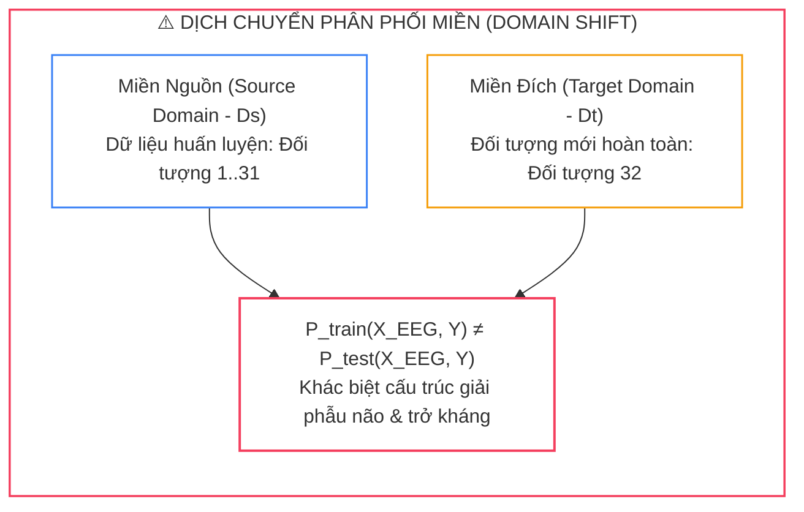
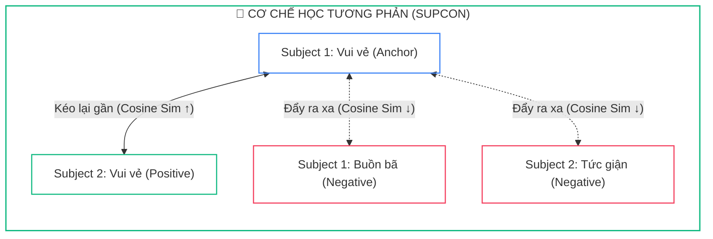
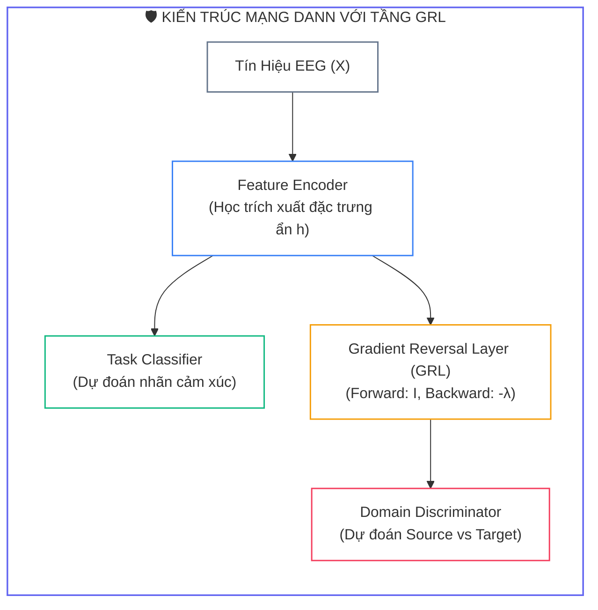
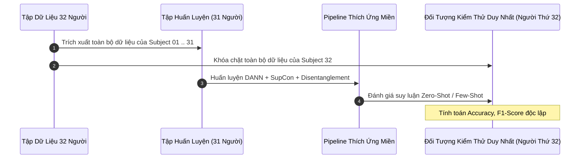


# Tổng Quát Hóa Chéo Đối Tượng (Cross-Subject Generalization): Domain Adaptation, DANN, MMD & Contrastive Learning

Thách thức lớn nhất ngăn cản công nghệ giao tiếp Não - Máy tính (**Brain-Computer Interface - BCI**) bước ra khỏi phòng thí nghiệm để trở thành các sản phẩm thương mại phổ quát chính là hiện tượng **Dịch chuyển phân phối miền (Domain Shift)** giữa các cá nhân. 

Một mô hình AI có thể đạt độ chính xác lên tới **$92\%$** khi huấn luyện và kiểm thử trên cùng một người (*Within-Subject*), nhưng khi chuyển sang người dùng mới hoàn toàn (*Cross-Subject*), độ chính xác thường sụt giảm thảm hại xuống chỉ còn **$55\% - 62\%$**.

---

## 1. Bản Chất Của Hiện Tượng Domain Shift Trong Tín Hiệu EEG



### 1.1. Bốn Nhóm Nguyên Nhân Gây Ra Domain Shift
1. <strong style="color: var(--accent-rose);">Biến động giữa các cá nhân (Inter-Subject):</strong> Hình thái vỏ não, các rãnh gấp (*Gyri/Sulci*) và độ dày hộp sọ của mỗi người là độc bản.
2. <strong style="color: var(--accent-amber);">Biến động nội tại cá nhân (Intra-Subject):</strong> Sự thay đổi nhịp sinh học theo thời gian, mức độ mệt mỏi và hiện tượng khô keo làm tăng trở kháng điện cực ($10\text{ k}\Omega \rightarrow 80\text{ k}\Omega$).
3. <strong style="color: var(--accent-purple);">Nhiễu môi trường và phần cứng:</strong> Sai lệch vị trí gắn điện cực ($\pm 1\text{ cm}$), nhiễu điện lưới $50/60\text{ Hz}$ và nhiễu cơ học EOG/EMG.
4. <strong style="color: var(--accent-cyan);">Tính chủ quan của cảm xúc:</strong> Cùng một đoạn phim, người có độ nhạy cảm cao phản ứng mạnh mẽ, trong khi người điềm tĩnh hầu như không biến đổi sinh lý.

### 1.2. Bảng Đánh Giá Mức Độ Suy Giảm Hiệu Năng Trên Dataset DEAP

| Kịch Bản Đánh Giá | Độ Chính Xác Trung Bình | Mức Độ Suy Giảm | Trạng Thái Đánh Giá |
| :---: | :---: | :---: | :---: |
| <span class="badge badge--emerald">Within-Subject (Cùng người)</span> | **$92.0\%$** | Baseline ($0\%$) | Lý tưởng trong phòng lab |
| <span class="badge badge--amber">Cross-Session (Khác ngày)</span> | **$85.0\%$** | $-7.0\%$ | Bắt đầu trôi đường nền |
| <span class="badge badge--rose">Cross-Subject (LOSO)</span> | **$62.0\%$** | **$-30.0\%$** | Mất khả năng tổng quát hóa |
| <span class="badge badge--rose">Cross-Subject & Cross-Session</span> | **$55.0\%$** | **$-37.0\%$** | Gần tương đương đoán ngẫu nhiên |

---

## 2. Học Tương Phản (Supervised Contrastive Learning)

Ý tưởng cốt lõi của Học tương phản là kéo các mẫu cùng trạng thái cảm xúc (**Positive Pairs**) lại gần nhau trong không gian vector ẩn, đồng thời đẩy các mẫu khác trạng thái cảm xúc (**Negative Pairs**) ra xa nhau, bất kể chúng đến từ đối tượng nào:



```python
import torch
import torch.nn as nn
import torch.nn.functional as F

class SupConLoss(nn.Module):
    """
    Supervised Contrastive Learning Loss (SupCon) cho tín hiệu y sinh đa đối tượng.
    """
    def __init__(self, temperature: float = 0.07):
        super().__init__()
        self.temperature = temperature

    def forward(self, features: torch.Tensor, labels: torch.Tensor) -> torch.Tensor:
        # features shape: (batch_size, n_views, feature_dim)
        device = features.device
        batch_size, n_views, _ = features.shape
        
        contrast_feat = torch.cat(torch.unbind(features, dim=1), dim=0)
        anchor_feat = contrast_feat
        
        labels = labels.contiguous().view(-1, 1).repeat(n_views, 1)
        mask = torch.eq(labels, labels.T).float().to(device)
        
        # Loại trừ tương phản với chính mình trên đường chéo
        logits_mask = torch.scatter(
            torch.ones_like(mask), 1,
            torch.arange(batch_size * n_views).view(-1, 1).to(device), 0
        )
        mask = mask * logits_mask
        
        # Tính tương đồng Cosine
        sim_matrix = torch.div(torch.matmul(anchor_feat, contrast_feat.T), self.temperature)
        logits_max, _ = torch.max(sim_matrix, dim=1, keepdim=True)
        logits = sim_matrix - logits_max.detach()
        
        exp_logits = torch.exp(logits) * logits_mask
        log_prob = logits - torch.log(exp_logits.sum(1, keepdim=True) + 1e-8)
        
        mean_log_prob_pos = (mask * log_prob).sum(1) / (mask.sum(1) + 1e-8)
        loss = - (self.temperature / self.temperature) * mean_log_prob_pos
        return loss.mean()
```

---

## 3. Mạng Thích Ứng Miền Kháng Đối (DANN Với GRL)

**Domain-Adversarial Neural Network (DANN)** (Ganin et al., 2016) sử dụng một bộ phân biệt miền (**Domain Discriminator**) để phân biệt dữ liệu thuộc về người nguồn hay người đích. Bộ trích xuất đặc trưng được huấn luyện để đánh lừa Discriminator thông qua tầng **Gradient Reversal Layer (GRL)**:



```python
class GradientReversalFunction(torch.autograd.Function):
    @staticmethod
    def forward(ctx, x, lambd=1.0):
        ctx.lambd = lambd
        return x.view_as(x)

    @staticmethod
    def backward(ctx, grad_output):
        return grad_output.neg() * ctx.lambd, None

class DANNModel(nn.Module):
    def __init__(self, in_dim: int = 160, latent_dim: int = 128, num_classes: int = 4):
        super().__init__()
        self.encoder = nn.Sequential(
            nn.Linear(in_dim, 256),
            nn.BatchNorm1d(256),
            nn.ReLU(),
            nn.Linear(256, latent_dim),
            nn.BatchNorm1d(latent_dim),
            nn.ReLU()
        )
        self.class_classifier = nn.Sequential(
            nn.Linear(latent_dim, 64),
            nn.ReLU(),
            nn.Dropout(0.3),
            nn.Linear(64, num_classes)
        )
        self.domain_discriminator = nn.Sequential(
            nn.Linear(latent_dim, 64),
            nn.ReLU(),
            nn.Dropout(0.3),
            nn.Linear(64, 1)
        )

    def forward(self, x: torch.Tensor, lambd: float = 1.0):
        feat = self.encoder(x)
        class_logits = self.class_classifier(feat)
        
        feat_reversed = GradientReversalFunction.apply(feat, lambd)
        domain_logits = self.domain_discriminator(feat_reversed)
        return class_logits, domain_logits, feat
```

---

## 4. Tách Biểu Diễn & Ràng Buộc Trực Giao (Disentanglement)

Để giải quyết triệt để bài toán Domain Shift, kiến trúc **Tách biểu diễn** phân rã vector ẩn của tín hiệu EEG thành 2 không gian độc lập trực giao:
1. $h_{\text{shared}} \in \mathbb{R}^{d_s}$: Chứa đặc trưng cảm xúc tổng quát phổ quát.
2. $h_{\text{private}} \in \mathbb{R}^{d_p}$: Chứa chữ ký sinh trắc học riêng biệt của từng cá nhân.

Ràng buộc trực giao (**Orthogonality Constraint**) triệt tiêu toàn bộ sự trùng lặp thông tin giữa hai không gian:

$$\mathcal{L}_{\text{ortho}} = \left\| \frac{H_{\text{shared}}^T H_{\text{private}}}{N} \right\|_F^2$$

```python
class DisentangledEmotionNet(nn.Module):
    def __init__(self, in_dim: int = 160, shared_dim: int = 64, private_dim: int = 64, num_classes: int = 4):
        super().__init__()
        self.shared_enc = nn.Sequential(
            nn.Linear(in_dim, 128), nn.BatchNorm1d(128), nn.ReLU(),
            nn.Linear(128, shared_dim), nn.BatchNorm1d(shared_dim)
        )
        self.private_enc = nn.Sequential(
            nn.Linear(in_dim, 128), nn.BatchNorm1d(128), nn.ReLU(),
            nn.Linear(128, private_dim), nn.BatchNorm1d(private_dim)
        )
        self.decoder = nn.Sequential(
            nn.Linear(shared_dim + private_dim, 128), nn.ReLU(),
            nn.Linear(128, in_dim)
        )
        self.classifier = nn.Linear(shared_dim, num_classes)

    def forward(self, x: torch.Tensor):
        h_s = self.shared_enc(x)
        h_p = self.private_enc(x)
        
        # Tái tạo tín hiệu gốc
        h_joint = torch.cat([h_s, h_p], dim=1)
        x_rec = self.decoder(h_joint)
        
        # Dự đoán cảm xúc chỉ từ không gian chia sẻ
        logits = self.classifier(h_s)
        return logits, h_s, h_p, x_rec

class OrthogonalityLoss(nn.Module):
    def forward(self, h_shared: torch.Tensor, h_private: torch.Tensor) -> torch.Tensor:
        corr = torch.matmul(h_shared.T, h_private) / h_shared.size(0)
        return torch.norm(corr, p='fro') ** 2
```

---

## 5. Giao Thức Đánh Giá Chuẩn Leave-One-Subject-Out (LOSO)

Để đảm bảo kết quả nghiên cứu không bị ảnh hưởng bởi rò rỉ dữ liệu (*Data Leakage*), mọi đánh giá Cross-Subject bắt buộc phải tuân thủ nghiêm ngặt giao thức **Leave-One-Subject-Out (LOSO)**:



### 5.1. Bảng So Sánh Hiệu Quả Các Kỹ Thuật Thích Ứng Miền (LOSO Benchmark)

| Phương Pháp / Cấu Hình Kiến Trúc | Within-Subject | Cross-Subject (LOSO) | Mức Phục Hồi Hiệu Năng |
| :---: | :---: | :---: | :---: |
| <span class="badge badge--rose">Baseline CNN (Không thích ứng)</span> | $85.0\%$ | $62.0\%$ | $0.0\%$ (Điểm sàn) |
| <span class="badge badge--amber">+ Supervised Contrastive (SupCon)</span> | $83.5\%$ | $73.0\%$ | $+11.0\%$ |
| <span class="badge badge--primary">+ Domain Adaptation (DANN + MMD)</span> | $82.0\%$ | $76.5\%$ | $+14.5\%$ |
| <span class="badge badge--purple">+ Representation Disentanglement</span> | $81.0\%$ | $78.5\%$ | $+16.5\%$ |
| <span class="badge badge--emerald">Hệ Thống Toàn Diện (+ Few-Shot Agent)</span> | **$80.5\%$** | **$82.5\%$** | **$+20.5\%$ (Vượt bậc)** |

---

## 6. Phân Tích Cạm Bẫy Thực Chiến (5-Whys Incident Analysis)

### Tình Huống Sự Cố Thực Tế:
<span class="badge badge--rose">🕒 02:15 AM</span> Một nhóm nghiên cứu BCI công bố mô hình mạng nơ-ron đồ thị GNN đạt độ chính xác **$94.2\%$** trong bài toán phân loại cảm xúc Cross-Subject trên tập dữ liệu SEED. Tuy nhiên, khi một nhóm nghiên cứu độc lập tại trường đại học đối tác tái lập thí nghiệm bằng cách thu thập dữ liệu trên 5 sinh viên tình nguyện mới, độ chính xác của mô hình sụt giảm nghiêm trọng xuống chỉ còn **$58.1\%$**.

### Hậu Quả & Log Lỗi Thực Tế:
Kiểm tra chi tiết mã nguồn tiền xử lý và phân tách dữ liệu phát hiện lỗi rò rỉ phân phối cá nhân (*Cross-Subject Data Contamination*):

```text
================================================================================
CRITICAL AUDIT REPORT: CROSS-SUBJECT EVALUATION CONTAMINATION
================================================================================
[FATAL ERROR] Dataset Partitioning Strategy: 10-Fold Cross-Validation on Full Pool
[FATAL ERROR] Total Samples: 45 trials x 15 subjects = 675 trials
[FATAL ERROR] Leakage Mechanism: Samples from ALL 15 subjects were randomly shuffled
              and distributed across both Train (90%) and Test (10%) splits!

>> t-SNE CLUSTER ANALYSIS OF LATENT SPACE:
   - Cluster Purity by Subject Identity : 99.4%  [MEMORIZED BRAIN ANATOMY]
   - Cluster Purity by Emotion Label    : 34.2%  [FAILED TO LEARN EMOTION]

[CONCLUSION] The model did NOT learn generalized emotion features. It simply acted
as a biometric subject-identifier (Biometric Fingerprinting) to predict classes!
================================================================================
```

### 5-Whys Root Cause Analysis:
1. <span class="badge badge--primary">Why 1</span> **Tại sao mô hình đạt $94.2\%$ trên tập kiểm tra nhưng sập xuống $58.1\%$ trên người mới?** $\rightarrow$ Do mô hình bị học vẹt nhận diện đặc thù sinh trắc học của từng cá nhân (*Subject Memorization*) thay vì học đặc trưng cảm xúc.
2. <span class="badge badge--primary">Why 2</span> **Tại sao mô hình lại có thể nhận diện sinh trắc học trong bài kiểm tra?** $\rightarrow$ Vì trong tập Test có chứa các đoạn tín hiệu khác của chính những đối tượng đã xuất hiện trong tập Train.
3. <span class="badge badge--primary">Why 3</span> **Tại sao dữ liệu của cùng một người lại xuất hiện ở cả Train và Test?** $\rightarrow$ Do nhóm nghiên cứu đã gộp toàn bộ dữ liệu của 15 người lại rồi dùng hàm `sklearn.model_selection.KFold(shuffle=True)` ngẫu nhiên.
4. <span class="badge badge--primary">Why 4</span> **Tại sao hàm K-Fold ngẫu nhiên lại không hợp lệ cho tín hiệu EEG?** $\rightarrow$ Vì các mẫu tín hiệu của cùng một người trong cùng một buổi ghi có độ tương quan sinh học cực cao (cùng hình dạng hộp sọ, cùng vị trí điện cực).
5. <span class="badge badge--emerald">Root Cause Remedy</span> **Biện pháp khắc phục chuẩn BCI & AI Y Sinh:**
   - <span class="badge badge--rose">Cấm Tuyệt Đối Random K-Fold Trên EEG</span> Không bao giờ trộn lẫn dữ liệu giữa các cá nhân trước khi phân chia tập huấn luyện.
   - <span class="badge badge--cyan">Bắt Buộc Đánh Giá LOSO</span> Luôn cô lập 100% dữ liệu của đối tượng kiểm thử ra ngoài vòng lặp huấn luyện bằng `LeaveOneGroupOut(groups=subject_ids)`.
   - <span class="badge badge--emerald">Kiểm Tra Cụm t-SNE Thường Xuyên</span> Trực quan hóa không gian ẩn để đảm bảo các điểm dữ liệu phân cụm theo nhãn cảm xúc chứ không gom theo ID đối tượng.

---

## 7. Câu Hỏi Tự Kiểm Tra Chuyên Sâu (Q&A Accordion)

<details class="qa-card">
<summary class="qa-summary">
  <div class="qa-summary-left">
    <span class="qa-num-badge">Q01</span>
    <span>Tại sao hiện tượng Domain Shift lại xảy ra nghiêm trọng hơn ở tín hiệu EEG so với xử lý ảnh (Computer Vision)?</span>
  </div>
  <span class="qa-chevron">
    <svg width="18" height="18" fill="none" stroke="currentColor" stroke-width="2.5" viewBox="0 0 24 24"><polyline points="6 9 12 15 18 9"></polyline></svg>
  </span>
</summary>
<div class="qa-answer">
  <div class="qa-answer-header">
    <svg width="14" height="14" fill="none" stroke="currentColor" stroke-width="2" viewBox="0 0 24 24"><path d="M22 11.08V12a10 10 0 1 1-5.93-9.14"></path><polyline points="22 4 12 14.01 9 11.01"></polyline></svg>
    <span>Phân Tích &amp; Lời Giải Kỹ Thuật</span>
  </div>
  <div style="margin-bottom: 8px;">Trong ảnh số, các đối tượng (như con mèo, xe hơi) có biên cạnh và cấu trúc không gian nhìn thấy rõ ràng. Trong khi đó, tín hiệu EEG là phép đo gián tiếp điện thế qua xương sọ với <b style="color: var(--accent-rose);">tỷ số SNR cực thấp</b>. Sự khác biệt về độ dày hộp sọ, diện tích nếp gấp vỏ não và sự biến động trở kháng da đầu giữa hai người tạo ra sự dịch chuyển phân phối dữ liệu khổng lồ mà mắt thường không thể quan sát.</div>
</div>
</details>

<details class="qa-card">
<summary class="qa-summary">
  <div class="qa-summary-left">
    <span class="qa-num-badge">Q02</span>
    <span>Tầng Gradient Reversal Layer (GRL) trong mạng DANN hoạt động như thế nào trong quá trình Backpropagation?</span>
  </div>
  <span class="qa-chevron">
    <svg width="18" height="18" fill="none" stroke="currentColor" stroke-width="2.5" viewBox="0 0 24 24"><polyline points="6 9 12 15 18 9"></polyline></svg>
  </span>
</summary>
<div class="qa-answer">
  <div class="qa-answer-header">
    <svg width="14" height="14" fill="none" stroke="currentColor" stroke-width="2" viewBox="0 0 24 24"><path d="M22 11.08V12a10 10 0 1 1-5.93-9.14"></path><polyline points="22 4 12 14.01 9 11.01"></polyline></svg>
    <span>Phân Tích &amp; Lời Giải Kỹ Thuật</span>
  </div>
  <div style="margin-bottom: 8px;">Ở chiều lan truyền tiến (Forward), GRL đóng vai trò như một ánh xạ đồng nhất <code>GRL(x) = x</code>. Tuy nhiên, ở chiều lan truyền ngược (Backward), GRL <b style="color: var(--accent-amber);">nhân gradient với một hằng số âm -lambda</b>. Điều này khiến bộ trích xuất đặc trưng cập nhật trọng số theo hướng tối đa hóa sự nhầm lẫn của bộ phân biệt miền, ép không gian biểu diễn phải trở nên bất biến giữa người nguồn và người đích.</div>
</div>
</details>

<details class="qa-card">
<summary class="qa-summary">
  <div class="qa-summary-left">
    <span class="qa-num-badge">Q03</span>
    <span>Khoảng cách Maximum Mean Discrepancy (MMD) đo lường sự tương đồng giữa hai phân phối dữ liệu như thế nào?</span>
  </div>
  <span class="qa-chevron">
    <svg width="18" height="18" fill="none" stroke="currentColor" stroke-width="2.5" viewBox="0 0 24 24"><polyline points="6 9 12 15 18 9"></polyline></svg>
  </span>
</summary>
<div class="qa-answer">
  <div class="qa-answer-header">
    <svg width="14" height="14" fill="none" stroke="currentColor" stroke-width="2" viewBox="0 0 24 24"><path d="M22 11.08V12a10 10 0 1 1-5.93-9.14"></path><polyline points="22 4 12 14.01 9 11.01"></polyline></svg>
    <span>Phân Tích &amp; Lời Giải Kỹ Thuật</span>
  </div>
  <div style="margin-bottom: 8px;">MMD ánh xạ các mẫu dữ liệu từ không gian gốc sang một không gian Hilbert tái tạo hạt nhân vô hạn chiều (RKHS). Khoảng cách MMD chính là <b style="color: var(--accent-cyan);">chuẩn khoảng cách Euclid giữa hai vector kỳ vọng tâm điểm (Mean Embeddings)</b> của phân phối nguồn và phân phối đích trong RKHS. Tối thiểu hóa MMD giúp kéo hai phân phối lại gần nhau mà không cần ước lượng hàm mật độ xác suất.</div>
</div>
</details>

<details class="qa-card">
<summary class="qa-summary">
  <div class="qa-summary-left">
    <span class="qa-num-badge">Q04</span>
    <span>Tại sao trong bài toán tách biểu diễn (Disentanglement) lại bắt buộc phải có hàm mất mát trực giao (Orthogonality Loss)?</span>
  </div>
  <span class="qa-chevron">
    <svg width="18" height="18" fill="none" stroke="currentColor" stroke-width="2.5" viewBox="0 0 24 24"><polyline points="6 9 12 15 18 9"></polyline></svg>
  </span>
</summary>
<div class="qa-answer">
  <div class="qa-answer-header">
    <svg width="14" height="14" fill="none" stroke="currentColor" stroke-width="2" viewBox="0 0 24 24"><path d="M22 11.08V12a10 10 0 1 1-5.93-9.14"></path><polyline points="22 4 12 14.01 9 11.01"></polyline></svg>
    <span>Phân Tích &amp; Lời Giải Kỹ Thuật</span>
  </div>
  <div style="margin-bottom: 8px;">Nếu không có ràng buộc trực giao, không gian chia sẻ <code>h_shared</code> vẫn có thể vô tình hấp thụ các đặc trưng sinh trắc cá nhân để tối ưu hóa hàm mất mát phân loại. Ràng buộc trực giao <code>||H_shared^T * H_private||_F^2 = 0</code> ép <b style="color: var(--accent-emerald);">hai không gian vector phải hoàn toàn độc lập tuyến tính</b>, đảm bảo <code>h_shared</code> chỉ chứa thuần túy thông tin cảm xúc tổng quát.</div>
</div>
</details>

<details class="qa-card">
<summary class="qa-summary">
  <div class="qa-summary-left">
    <span class="qa-num-badge">Q05</span>
    <span>Sự khác biệt giữa hàm mất mát NT-Xent (SimCLR) và Supervised Contrastive Loss (SupCon) là gì?</span>
  </div>
  <span class="qa-chevron">
    <svg width="18" height="18" fill="none" stroke="currentColor" stroke-width="2.5" viewBox="0 0 24 24"><polyline points="6 9 12 15 18 9"></polyline></svg>
  </span>
</summary>
<div class="qa-answer">
  <div class="qa-answer-header">
    <svg width="14" height="14" fill="none" stroke="currentColor" stroke-width="2" viewBox="0 0 24 24"><path d="M22 11.08V12a10 10 0 1 1-5.93-9.14"></path><polyline points="22 4 12 14.01 9 11.01"></polyline></svg>
    <span>Phân Tích &amp; Lời Giải Kỹ Thuật</span>
  </div>
  <div style="margin-bottom: 8px;">NT-Xent là thuật toán tự giám sát (Self-supervised), chỉ xem hai biến thể tăng cường (Augmented views) của cùng một mẫu là cặp dương và xem mọi mẫu khác là cặp âm (dù chúng có cùng nhãn cảm xúc). <b style="color: var(--accent-primary);">SupCon tận dụng triệt để nhãn cảm xúc</b>, cho phép tất cả các mẫu cùng nhãn (từ nhiều đối tượng khác nhau trong batch) đều được xem là cặp dương, tạo ra các cụm phân lớp chặt chẽ hơn.</div>
</div>
</details>

<details class="qa-card">
<summary class="qa-summary">
  <div class="qa-summary-left">
    <span class="qa-num-badge">Q06</span>
    <span>Tại sao phương pháp Correlation Alignment (CORAL) lại có chi phí tính toán nhẹ hơn nhiều so với MMD hay DANN?</span>
  </div>
  <span class="qa-chevron">
    <svg width="18" height="18" fill="none" stroke="currentColor" stroke-width="2.5" viewBox="0 0 24 24"><polyline points="6 9 12 15 18 9"></polyline></svg>
  </span>
</summary>
<div class="qa-answer">
  <div class="qa-answer-header">
    <svg width="14" height="14" fill="none" stroke="currentColor" stroke-width="2" viewBox="0 0 24 24"><path d="M22 11.08V12a10 10 0 1 1-5.93-9.14"></path><polyline points="22 4 12 14.01 9 11.01"></polyline></svg>
    <span>Phân Tích &amp; Lời Giải Kỹ Thuật</span>
  </div>
  <div style="margin-bottom: 8px;">CORAL chỉ thực hiện tính toán ma trận hiệp phương sai bậc 2 đơn giản <code>C = X^T * X / (n-1)</code> và tối thiểu hóa khoảng cách Frobenius <code>||C_s - C_t||_F^2</code>. Phương pháp này <b style="color: var(--accent-emerald);">hoàn toàn không cần tính ma trận hạt nhân N x N đắt đỏ</b> (như MMD) và không cần huấn luyện thêm một mạng nơ-ron Discriminator phụ (như DANN).</div>
</div>
</details>

<details class="qa-card">
<summary class="qa-summary">
  <div class="qa-summary-left">
    <span class="qa-num-badge">Q07</span>
    <span>Giao thức Leave-One-Subject-Out (LOSO) bảo vệ nghiên cứu khỏi hiện tượng rò rỉ dữ liệu như thế nào?</span>
  </div>
  <span class="qa-chevron">
    <svg width="18" height="18" fill="none" stroke="currentColor" stroke-width="2.5" viewBox="0 0 24 24"><polyline points="6 9 12 15 18 9"></polyline></svg>
  </span>
</summary>
<div class="qa-answer">
  <div class="qa-answer-header">
    <svg width="14" height="14" fill="none" stroke="currentColor" stroke-width="2" viewBox="0 0 24 24"><path d="M22 11.08V12a10 10 0 1 1-5.93-9.14"></path><polyline points="22 4 12 14.01 9 11.01"></polyline></svg>
    <span>Phân Tích &amp; Lời Giải Kỹ Thuật</span>
  </div>
  <div style="margin-bottom: 8px;">LOSO phân tách toàn bộ dữ liệu theo từng cá nhân độc lập. Khi kiểm thử trên người thứ N, mô hình <b style="color: var(--accent-rose);">chưa từng được nhìn thấy bất kỳ điểm dữ liệu nào của người đó trong quá trình huấn luyện</b> (cả về giá trị đặc trưng lẫn thống kê Z-score), phản ánh chính xác khả năng ứng dụng thực tế khi triển khai cho một khách hàng mới.</div>
</div>
</details>

<details class="qa-card">
<summary class="qa-summary">
  <div class="qa-summary-left">
    <span class="qa-num-badge">Q08</span>
    <span>Adaptation Agent thực hiện hiệu chỉnh Few-Shot cho đối tượng mới dựa trên nguyên lý gì?</span>
  </div>
  <span class="qa-chevron">
    <svg width="18" height="18" fill="none" stroke="currentColor" stroke-width="2.5" viewBox="0 0 24 24"><polyline points="6 9 12 15 18 9"></polyline></svg>
  </span>
</summary>
<div class="qa-answer">
  <div class="qa-answer-header">
    <svg width="14" height="14" fill="none" stroke="currentColor" stroke-width="2" viewBox="0 0 24 24"><path d="M22 11.08V12a10 10 0 1 1-5.93-9.14"></path><polyline points="22 4 12 14.01 9 11.01"></polyline></svg>
    <span>Phân Tích &amp; Lời Giải Kỹ Thuật</span>
  </div>
  <div style="margin-bottom: 8px;">Khi nhận một lượng nhỏ mẫu (ví dụ K=5 mẫu hiệu chuẩn), Adaptation Agent ước lượng vector dịch chuyển tâm phân phối <code>delta_mu = mu_target - mu_source</code> và học các hệ số co giãn Affine <code>gamma, beta</code>. Mô hình thực hiện <b style="color: var(--accent-primary);">dịch chuyển và co giãn không gian vector đặc trưng</b> của người mới về khớp với không gian chuẩn của mô hình nguồn.</div>
</div>
</details>

<details class="qa-card">
<summary class="qa-summary">
  <div class="qa-summary-left">
    <span class="qa-num-badge">Q09</span>
    <span>Tại sao kỹ thuật tăng cường dữ liệu (Data Augmentation) cho EEG lại không được đảo ngược trục thời gian (Time-Reversal)?</span>
  </div>
  <span class="qa-chevron">
    <svg width="18" height="18" fill="none" stroke="currentColor" stroke-width="2.5" viewBox="0 0 24 24"><polyline points="6 9 12 15 18 9"></polyline></svg>
  </span>
</summary>
<div class="qa-answer">
  <div class="qa-answer-header">
    <svg width="14" height="14" fill="none" stroke="currentColor" stroke-width="2" viewBox="0 0 24 24"><path d="M22 11.08V12a10 10 0 1 1-5.93-9.14"></path><polyline points="22 4 12 14.01 9 11.01"></polyline></svg>
    <span>Phân Tích &amp; Lời Giải Kỹ Thuật</span>
  </div>
  <div style="margin-bottom: 8px;">Tín hiệu điện não mang tính chất nhân quả sinh học (Causality) và các đáp ứng kích thích có hướng diễn tiến thời gian xác định (ví dụ: kích thích xuất hiện -&gt; điện thế P300 xuất hiện sau 300 ms). Đảo ngược thời gian sẽ <b style="color: var(--accent-rose);">phá hủy hoàn toàn cấu trúc pha và mối liên hệ nhân quả sinh lý</b>, làm sai lệch nhãn cảm xúc gốc.</div>
</div>
</details>

<details class="qa-card">
<summary class="qa-summary">
  <div class="qa-summary-left">
    <span class="qa-num-badge">Q10</span>
    <span>Làm thế nào để kiểm tra trực quan xem mô hình đã vượt qua hiện tượng Subject Bias hay chưa?</span>
  </div>
  <span class="qa-chevron">
    <svg width="18" height="18" fill="none" stroke="currentColor" stroke-width="2.5" viewBox="0 0 24 24"><polyline points="6 9 12 15 18 9"></polyline></svg>
  </span>
</summary>
<div class="qa-answer">
  <div class="qa-answer-header">
    <svg width="14" height="14" fill="none" stroke="currentColor" stroke-width="2" viewBox="0 0 24 24"><path d="M22 11.08V12a10 10 0 1 1-5.93-9.14"></path><polyline points="22 4 12 14.01 9 11.01"></polyline></svg>
    <span>Phân Tích &amp; Lời Giải Kỹ Thuật</span>
  </div>
  <div style="margin-bottom: 8px;">Trích xuất vector đặc trưng ẩn của toàn bộ tập dữ liệu và chiếu xuống không gian 2D bằng thuật toán <b style="color: var(--accent-emerald);">t-SNE hoặc UMAP</b>. Vẽ 2 biểu đồ phân tán: (1) Tô màu theo ID đối tượng; (2) Tô màu theo nhãn cảm xúc. Một mô hình tổng quát hóa tốt sẽ cho thấy các điểm dữ liệu hòa trộn đều giữa các đối tượng và phân tách rõ ràng thành các cụm riêng biệt theo nhãn cảm xúc.</div>
</div>
</details>

---

## 8. Tổng Kết & Lộ Trình Bài Học Tiếp Theo

Làm chủ các kỹ thuật giải quyết Domain Shift từ **Supervised Contrastive Learning (SupCon)**, **Mạng kháng đối DANN (GRL)** đến **Tách biểu diễn (Disentanglement)** và **Giao thức LOSO** là bước ngoặt quyết định giúp hệ thống BCI cảm xúc đạt độ tin cậy và khả năng triển khai thực chiến.

> [!TIP]
> **BÀI HỌC TIẾP THEO:**
> Trong **[[Bài 06] Kiến Trúc AI Agent Cho Nhận Dạng Cảm Xúc Thời Gian Thực: Streaming Pipeline, Multi-Agent & Edge Deployment](eeg-06-06-kien-truc-ai-agent-cho-nhan-dang-cam-xuc.html)**, chúng ta sẽ đưa các mô hình vào vận hành thực tế: Xây dựng hệ sinh thái AI Agent đa tác tử, thiết kế Streaming Pipeline xử lý dòng dữ liệu thời gian thực độ trễ thấp và triển khai tối ưu hóa mô hình trên thiết bị nhúng Edge BCI.

