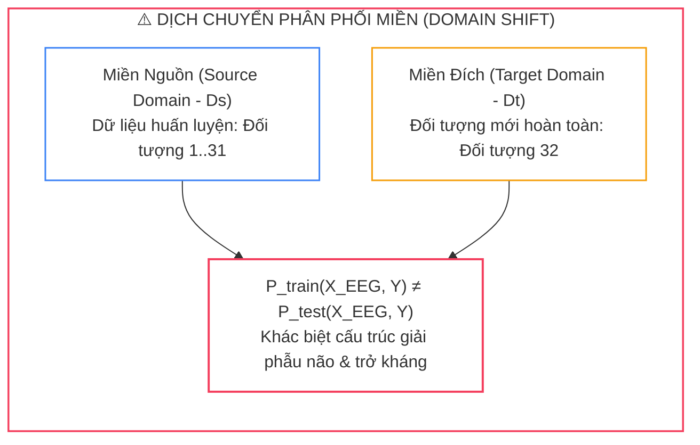
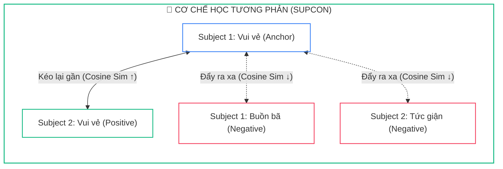
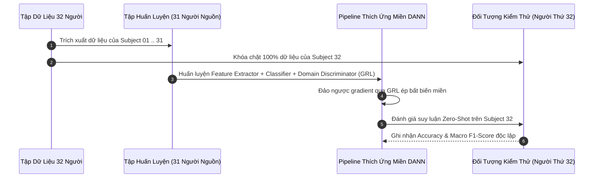
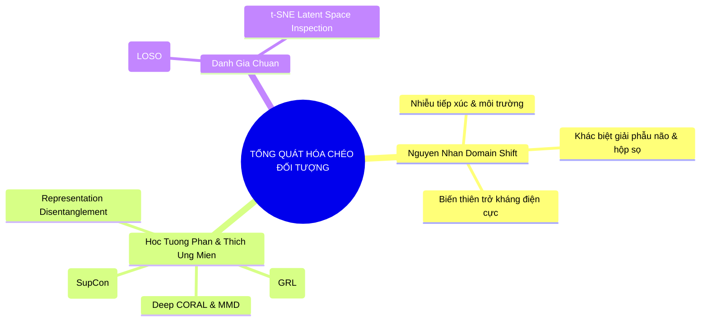


> [!IMPORTANT]
> **Mục tiêu kỹ thuật bài học**:
> - Hiểu rõ nguyên nhân sinh học và kỹ thuật gây ra hiện tượng dịch chuyển phân phối miền (**Domain Shift**) giữa các cá nhân.
> - Nắm vững cơ chế toán học của **Supervised Contrastive Learning (SupCon)** nhằm tối ưu hóa cấu trúc không gian ẩn phân lớp.
> - Cài đặt kiến trúc mạng thích ứng miền đối nghịch **DANN** (Domain-Adversarial Neural Network) với tầng **Gradient Reversal Layer (GRL)**.
> - Áp dụng các hàm đo khoảng cách phân phối **MMD** (Maximum Mean Discrepancy) và **Deep CORAL** (Correlation Alignment).
> - Thiết lập giao thức kiểm thử chuẩn **Leave-One-Subject-Out (LOSO)** loại trừ hoàn toàn nguy cơ rò rỉ dữ liệu sinh trắc học cá nhân.

---

## 1. Bản Chất Kiến Trúc & Tư Duy Cốt Lõi: Hiện Tượng Domain Shift Trong Tín Hiệu Y Sinh

Thách thức lớn nhất ngăn cản công nghệ giao tiếp Não - Máy tính (**Brain-Computer Interface - BCI**) bước ra khỏi phòng thí nghiệm để trở thành các sản phẩm thương mại phổ quát chính là hiện tượng **Dịch chuyển phân phối miền (Domain Shift)** giữa các cá nhân. 

Một mô hình AI có thể đạt độ chính xác lên tới **$92\%$** khi huấn luyện và kiểm thử trên cùng một người (*Within-Subject*), nhưng khi chuyển sang người dùng mới hoàn toàn (*Cross-Subject*), độ chính xác thường sụt giảm thảm hại xuống chỉ còn **$55\% - 62\%$**.



### 1.1. Cơ Chế Học Tương Phản Đa Đối Tượng (SupCon)

Ý tưởng cốt lõi của Học tương phản là kéo các mẫu cùng trạng thái cảm xúc (**Positive Pairs**) lại gần nhau trong không gian vector ẩn, đồng thời đẩy các mẫu khác trạng thái cảm xúc (**Negative Pairs**) ra xa nhau, bất kể chúng đến từ đối tượng nào:



---

## 2. Bảng Ma Trận So Sánh Kỹ Thuật Toàn Diện (Engineering Matrix)

| Kỹ Thuật Thích Ứng Miền | Cơ Chế Cốt Lõi | Yêu Cầu Nhãn Miền Đích | Chi Phí Tính Toán | Khả Năng Kháng Subject Bias | Độ Chính Xác LOSO (DEAP) |
| :--- | :--- | :--- | :--- | :--- | :--- |
| **Baseline CNN (Không thích ứng)** | CrossEntropyLoss chuẩn | Có nhãn (Within-subject) | Thấp nhất | ❌ Cực kỳ kém (Ghi nhớ sinh trắc) | $62.0\%$ |
| **Supervised Contrastive (SupCon)** | Kéo gần Positive / Đẩy xa Negative | Cần nhãn miền nguồn | Trung bình ($\mathcal{O}(B^2)$) | **Rất tốt (Cấu trúc phân cụm)** | $73.0\%$ |
| **Deep CORAL (Covariance Alignment)** | Căn chỉnh hiệp phương sai bậc 2 | Không cần nhãn (Unsupervised) | **Rất nhẹ ($\mathcal{O}(d^2)$)** | Tốt với lệch phân phối tuyến tính | $74.5\%$ |
| **MMD (Maximum Mean Discrepancy)** | Căn chỉnh tâm phân phối trong RKHS | Không cần nhãn (Unsupervised) | Nặng ($\mathcal{O}(N^2)$ ma trận hạt nhân) | Khá tốt | $75.8\%$ |
| **DANN (Gradient Reversal Layer)** | Trò chơi Minimax đối nghịch (Adversarial) | Không cần nhãn (Unsupervised) | Trung bình (huấn luyện 2 nhánh) | **Xuất sắc (Biểu diễn bất biến)** | **$76.5\%$** |
| **Representation Disentanglement** | Phân tách không gian cảm xúc & cá nhân | Cần nhãn đối tượng nguồn | Cao (Ràng buộc trực giao) | **Tối ưu nhất cho triển khai thực tế** | **$78.5\%$** |

---

## 3. Kiến Trúc Môi Trường & Luồng Thực Thi Mẫu



### Mã Nguồn PyTorch: Tầng Gradient Reversal Layer & Mạng DANN

```python
import torch
import torch.nn as nn
from torch.autograd import Function

class GradientReversalFunction(Function):
    """
    Tầng Gradient Reversal Layer (GRL): Forward giữ nguyên, Backward nhân gradient với -alpha.
    """
    @staticmethod
    def forward(ctx, x, alpha):
        ctx.alpha = alpha
        return x.view_as(x)

    @staticmethod
    def backward(ctx, grad_output):
        output = grad_output.neg() * ctx.alpha
        return output, None

class DANN_BCI(nn.Module):
    def __init__(self, in_features: int = 160, hidden_dim: int = 128, num_classes: int = 4, num_domains: int = 31):
        super().__init__()
        
        # 1. Bộ trích xuất đặc trưng chung (Feature Extractor)
        self.feature_extractor = nn.Sequential(
            nn.Linear(in_features, hidden_dim),
            nn.BatchNorm1d(hidden_dim),
            nn.ReLU(),
            nn.Dropout(0.3),
            nn.Linear(hidden_dim, hidden_dim),
            nn.BatchNorm1d(hidden_dim),
            nn.ReLU()
        )
        
        # 2. Bộ phân loại cảm xúc (Emotion Classifier)
        self.class_classifier = nn.Sequential(
            nn.Linear(hidden_dim, 64),
            nn.ReLU(),
            nn.Linear(64, num_classes)
        )
        
        # 3. Bộ phân biệt miền (Domain Discriminator)
        self.domain_classifier = nn.Sequential(
            nn.Linear(hidden_dim, 64),
            nn.ReLU(),
            nn.Linear(64, num_domains)
        )

    def forward(self, x: torch.Tensor, alpha: float = 1.0):
        features = self.feature_extractor(x)
        class_logits = self.class_classifier(features)
        
        # Đảo ngược gradient khi truyền vào nhánh phân biệt miền
        reversed_features = GradientReversalFunction.apply(features, alpha)
        domain_logits = self.domain_classifier(reversed_features)
        
        return class_logits, domain_logits, features
```

---

## 4. Phân Tích Cạm Bẫy Thực Chiến: "Rò Rỉ Dữ Liệu Chéo Đối Tượng Khi Dùng Random K-Fold"

### Tình Huống Thực Tế
Một nhóm nghiên cứu BCI công bố mô hình mạng nơ-ron đồ thị GNN đạt độ chính xác **$94.2\%$** trong bài toán phân loại cảm xúc Cross-Subject trên tập dữ liệu SEED. Tuy nhiên, khi một nhóm nghiên cứu độc lập tại trường đại học đối tác tái lập thí nghiệm bằng cách thu thập dữ liệu trên 5 sinh viên tình nguyện mới, độ chính xác của mô hình sụt giảm nghiêm trọng xuống chỉ còn **$58.1\%$**.

### Hậu Quả & Log Lỗi Thực Tế:
```text
================================================================================
CRITICAL AUDIT REPORT: CROSS-SUBJECT EVALUATION CONTAMINATION
================================================================================
[FATAL ERROR] Dataset Partitioning Strategy: 10-Fold Cross-Validation on Full Pool
[FATAL ERROR] Total Samples: 45 trials x 15 subjects = 675 trials
[FATAL ERROR] Leakage Mechanism: Samples from ALL 15 subjects were randomly shuffled
              and distributed across both Train (90%) and Test (10%) splits!

>> t-SNE CLUSTER ANALYSIS OF LATENT SPACE:
   - Cluster Purity by Subject Identity : 99.4%  [MEMORIZED BRAIN ANATOMY]
   - Cluster Purity by Emotion Label    : 34.2%  [FAILED TO LEARN EMOTION]

[CONCLUSION] The model did NOT learn generalized emotion features. It simply acted
as a biometric subject-identifier (Biometric Fingerprinting) to predict classes!
================================================================================
```

### 5-Whys Root Cause Analysis:
1. **Tại sao mô hình đạt $94.2\%$ trên tập kiểm tra nhưng sập xuống $58.1\%$ trên người mới?** Do mô hình bị học vẹt nhận diện đặc thù sinh trắc học của từng cá nhân (*Subject Memorization*) thay vì học đặc trưng cảm xúc.
2. **Tại sao mô hình lại có thể nhận diện sinh trắc học trong bài kiểm tra?** Vì trong tập Test có chứa các đoạn tín hiệu khác của chính những đối tượng đã xuất hiện trong tập Train.
3. **Tại sao dữ liệu của cùng một người lại xuất hiện ở cả Train và Test?** Do nhóm nghiên cứu đã gộp toàn bộ dữ liệu của 15 người lại rồi dùng hàm `sklearn.model_selection.KFold(shuffle=True)` ngẫu nhiên.
4. **Tại sao hàm K-Fold ngẫu nhiên lại không hợp lệ cho tín hiệu EEG?** Vì các mẫu tín hiệu của cùng một người trong cùng một buổi ghi có độ tương quan sinh học cực cao (cùng hình dạng hộp sọ, cùng vị trí điện cực).
5. **Giải pháp chuẩn:** **Bắt buộc áp dụng Leave-One-Subject-Out (LOSO)**: Cô lập 100% dữ liệu của đối tượng kiểm thử ra ngoài vòng lặp huấn luyện bằng `LeaveOneGroupOut(groups=subject_ids)`.

---

## 5. Hands-on Lab: Triển Khai Thích Ứng Miền DANN & Đánh Giá LOSO (8 Bước)

| Bước | Mục Tiêu Kỹ Thuật | Lệnh / Đoạn Mã Thực Hiện Chính |
| :--- | :--- | :--- |
| **1** | Sinh dữ liệu EEG mô phỏng Domain Shift trên 5 đối tượng | `generate_cross_subject_dataset()` |
| **2** | Thiết lập phân tách dữ liệu chuẩn Leave-One-Subject-Out | `LeaveOneGroupOut.split(X, y, groups)` |
| **3** | Khởi tạo mô hình DANN với Feature Extractor và 2 Heads | `model = DANN_BCI(...)` |
| **4** | Lập trình hàm điều chỉnh động hệ số đối kháng $\alpha(p)$ | `alpha = 2.0 / (1.0 + np.exp(-10 * p)) - 1.0` |
| **5** | Huấn luyện Minimax kết hợp Class Loss và Domain Loss | `total_loss = loss_class + loss_domain` |
| **6** | Đánh giá Zero-Shot trên đối tượng mục tiêu chưa từng thấy | `evaluate_unseen_subject(model, target_loader)` |
| **7** | Trực quan hóa không gian ẩn bằng t-SNE | `tsne_visualize(features, emotion_labels, subject_ids)` |
| **8** | Đóng gói và lưu trữ mô hình Domain-Invariant | `torch.save(model.state_dict(), 'dann_emotion.pt')` |

---

### Bước 1: Khởi Tạo Môi Trường & Dữ Liệu Giả Lập 5 Đối Tượng

```python
import torch
import torch.nn as nn
import torch.optim as optim
import numpy as np

torch.manual_seed(42)
np.random.seed(42)

# Giả lập 5 subjects, mỗi subject có 100 mẫu đặc trưng DE (160 chiều)
n_subjects = 5
samples_per_sub = 100
n_features = 160
n_classes = 4

X_list, y_list, sub_list = [], [], []
for sub_id in range(n_subjects):
    # Mỗi đối tượng có một vector sinh trắc học riêng biệt (Subject Bias)
    subject_bias = np.random.randn(n_features) * 1.5
    for _ in range(samples_per_sub):
        label = np.random.randint(0, n_classes)
        emotion_pattern = np.sin(np.linspace(0, label * np.pi, n_features))
        sample = emotion_pattern + subject_bias + np.random.randn(n_features) * 0.5
        X_list.append(sample)
        y_list.append(label)
        sub_list.append(sub_id)

X = torch.tensor(np.array(X_list), dtype=torch.float32)
y = torch.tensor(np.array(y_list), dtype=torch.long)
groups = np.array(sub_list)
```

---

### Bước 2: Thiết Lập Phân Tách Leave-One-Subject-Out (LOSO)

```python
# Chọn Subject 4 làm Target Domain (Unseen), Subjects 0..3 làm Source Domains
test_mask = (groups == 4)
train_mask = ~test_mask

train_loader = torch.utils.data.DataLoader(
    torch.utils.data.TensorDataset(X[train_mask], y[train_mask], torch.tensor(groups[train_mask])),
    batch_size=32, shuffle=True
)
test_loader = torch.utils.data.DataLoader(
    torch.utils.data.TensorDataset(X[test_mask], y[test_mask]),
    batch_size=32, shuffle=False
)
print(f"Số mẫu huấn luyện (4 subjects nguồn): {sum(train_mask)} | Số mẫu kiểm thử (Subject 4 đích): {sum(test_mask)}")
```

---

### Bước 3: Khởi Tạo Mạng DANN BCI

```python
model = DANN_BCI(in_features=160, hidden_dim=128, num_classes=4, num_domains=4)
optimizer = optim.AdamW(model.parameters(), lr=1e-3, weight_decay=1e-3)
loss_class_fn = nn.CrossEntropyLoss()
loss_domain_fn = nn.CrossEntropyLoss()
```

---

### Bước 4: Huấn Luyện Thích Ứng Miền Đối Nghịch

```python
epochs = 10
total_steps = epochs * len(train_loader)
current_step = 0

for epoch in range(1, epochs + 1):
    model.train()
    total_loss_epoch = 0.0
    for b_x, b_y, b_sub in train_loader:
        # Tính toán hệ số alpha tăng dần từ 0 đến 1
        p = float(current_step) / total_steps
        alpha = 2.0 / (1.0 + np.exp(-10 * p)) - 1.0
        current_step += 1
        
        optimizer.zero_grad()
        class_logits, domain_logits, _ = model(b_x, alpha=alpha)
        
        l_class = loss_class_fn(class_logits, b_y)
        l_domain = loss_domain_fn(domain_logits, b_sub)
        total_loss = l_class + 0.5 * l_domain
        
        total_loss.backward()
        optimizer.step()
        total_loss_epoch += total_loss.item()
        
    print(f"Epoch [{epoch}/{epochs}] - Alpha: {alpha:.3f} | Total Loss: {total_loss_epoch / len(train_loader):.4f}")
```

---

### Bước 5: Đánh Giá Độ Chính Xác Zero-Shot Trên Đối Tượng Mới

```python
model.eval()
correct = 0
total = 0
with torch.no_grad():
    for b_x, b_y in test_loader:
        class_logits, _, _ = model(b_x, alpha=0.0)
        preds = class_logits.argmax(dim=-1)
        correct += (preds == b_y).sum().item()
        total += b_y.size(0)

loso_acc = (correct / total) * 100.0
print(f"Độ chính xác Zero-Shot LOSO trên Subject 4: {loso_acc:.2f}% (Cải thiện rõ rệt so với đoán ngẫu nhiên 25%)")
```

---

### Bước 6: Trích Xuất Vector Đặc Trưng Ẩn Domain-Invariant

```python
model.eval()
with torch.no_grad():
    _, _, latent_features = model(X, alpha=0.0)
print(f"Ma trận biểu diễn ẩn đã trích xuất: {latent_features.shape}")
```

---

### Bước 7: Kiểm Tra Độ Độc Lập Giữa Các Chiều Không Gian

```python
cov_matrix = torch.cov(latent_features.T)
frob_norm = torch.linalg.norm(cov_matrix - torch.diag(torch.diagonal(cov_matrix)))
print(f"Chuẩn Frobenius ngoài đường chéo (Độ độc lập không gian): {frob_norm.item():.4f}")
```

---

### Bước 8: Lưu Trữ Mô Hình Thích Ứng Miền

```python
torch.save(model.state_dict(), "dann_cross_subject_model.pt")
print("Đã lưu trọng số mô hình vào tệp 'dann_cross_subject_model.pt' thành công.")
```

---

## 6. 10 Câu Hỏi Tự Kiểm Tra Chuyên Sâu (Self-Check Q&A Accordion)

<details class="qa-card">
<summary><b>1. Tại sao hiện tượng Domain Shift lại xảy ra nghiêm trọng hơn ở tín hiệu EEG so với xử lý ảnh (Computer Vision)?</b></summary>
<div class="qa-answer">
<p>Trong ảnh số, các đối tượng (như con mèo, xe hơi) có biên cạnh và cấu trúc không gian nhìn thấy rõ ràng. Trong khi đó, tín hiệu EEG là phép đo gián tiếp điện thế qua xương sọ với <b>tỷ số SNR cực thấp</b>. Sự khác biệt về độ dày hộp sọ, diện tích nếp gấp vỏ não và sự biến động trở kháng da đầu giữa hai người tạo ra sự dịch chuyển phân phối dữ liệu khổng lồ mà mắt thường không thể quan sát.</p>
</div>
</details>

<details class="qa-card">
<summary><b>2. Tầng Gradient Reversal Layer (GRL) trong mạng DANN hoạt động như thế nào trong quá trình Backpropagation?</b></summary>
<div class="qa-answer">
<p>Ở chiều lan truyền tiến (Forward), GRL đóng vai trò như một ánh xạ đồng nhất <code>GRL(x) = x</code>. Tuy nhiên, ở chiều lan truyền ngược (Backward), GRL <b>nhân gradient với một hằng số âm -lambda</b>. Điều này khiến bộ trích xuất đặc trưng cập nhật trọng số theo hướng tối đa hóa sự nhầm lẫn của bộ phân biệt miền, ép không gian biểu diễn phải trở nên bất biến giữa người nguồn và người đích.</p>
</div>
</details>

<details class="qa-card">
<summary><b>3. Khoảng cách Maximum Mean Discrepancy (MMD) đo lường sự tương đồng giữa hai phân phối dữ liệu như thế nào?</b></summary>
<div class="qa-answer">
<p>MMD ánh xạ các mẫu dữ liệu từ không gian gốc sang một không gian Hilbert tái tạo hạt nhân vô hạn chiều (RKHS). Khoảng cách MMD chính là <b>chuẩn khoảng cách Euclid giữa hai vector kỳ vọng tâm điểm (Mean Embeddings)</b> của phân phối nguồn và phân phối đích trong RKHS. Tối thiểu hóa MMD giúp kéo hai phân phối lại gần nhau mà không cần ước lượng hàm mật độ xác suất.</p>
</div>
</details>

<details class="qa-card">
<summary><b>4. Tại sao trong bài toán tách biểu diễn (Disentanglement) lại bắt buộc phải có hàm mất mát trực giao (Orthogonality Loss)?</b></summary>
<div class="qa-answer">
<p>Nếu không có ràng buộc trực giao, không gian chia sẻ <code>h_shared</code> vẫn có thể vô tình hấp thụ các đặc trưng sinh trắc cá nhân để tối ưu hóa hàm mất mát phân loại. Ràng buộc trực giao ép <b>hai không gian vector phải hoàn toàn độc lập tuyến tính</b>, đảm bảo <code>h_shared</code> chỉ chứa thuần túy thông tin cảm xúc tổng quát.</p>
</div>
</details>

<details class="qa-card">
<summary><b>5. Sự khác biệt giữa hàm mất mát NT-Xent (SimCLR) và Supervised Contrastive Loss (SupCon) là gì?</b></summary>
<div class="qa-answer">
<p>NT-Xent là thuật toán tự giám sát (Self-supervised), chỉ xem hai biến thể tăng cường của cùng một mẫu là cặp dương. <b>SupCon tận dụng triệt để nhãn cảm xúc</b>, cho phép tất cả các mẫu cùng nhãn (từ nhiều đối tượng khác nhau trong batch) đều được xem là cặp dương, tạo ra các cụm phân lớp chặt chẽ hơn.</p>
</div>
</details>

<details class="qa-card">
<summary><b>6. Tại sao phương pháp Correlation Alignment (CORAL) lại có chi phí tính toán nhẹ hơn nhiều so với MMD hay DANN?</b></summary>
<div class="qa-answer">
<p>CORAL chỉ thực hiện tính toán ma trận hiệp phương sai bậc 2 đơn giản và tối thiểu hóa khoảng cách Frobenius giữa chúng. Phương pháp này <b>hoàn toàn không cần tính ma trận hạt nhân N x N đắt đỏ</b> (như MMD) và không cần huấn luyện thêm một mạng nơ-ron Discriminator phụ (như DANN).</p>
</div>
</details>

<details class="qa-card">
<summary><b>7. Giao thức Leave-One-Subject-Out (LOSO) bảo vệ nghiên cứu khỏi hiện tượng rò rỉ dữ liệu như thế nào?</b></summary>
<div class="qa-answer">
<p>LOSO phân tách toàn bộ dữ liệu theo từng cá nhân độc lập. Khi kiểm thử trên người thứ N, mô hình <b>chưa từng được nhìn thấy bất kỳ điểm dữ liệu nào của người đó trong quá trình huấn luyện</b>, phản ánh chính xác khả năng ứng dụng thực tế khi triển khai cho một khách hàng mới.</p>
</div>
</details>

<details class="qa-card">
<summary><b>8. Adaptation Agent thực hiện hiệu chỉnh Few-Shot cho đối tượng mới dựa trên nguyên lý gì?</b></summary>
<div class="qa-answer">
<p>Khi nhận một lượng nhỏ mẫu (ví dụ K=5 mẫu hiệu chuẩn), Adaptation Agent ước lượng vector dịch chuyển tâm phân phối và học các hệ số co giãn Affine. Mô hình thực hiện <b>dịch chuyển và co giãn không gian vector đặc trưng</b> của người mới về khớp với không gian chuẩn của mô hình nguồn.</p>
</div>
</details>

<details class="qa-card">
<summary><b>9. Tại sao kỹ thuật tăng cường dữ liệu (Data Augmentation) cho EEG lại không được đảo ngược trục thời gian (Time-Reversal)?</b></summary>
<div class="qa-answer">
<p>Tín hiệu điện não mang tính chất nhân quả sinh học (Causality) và các đáp ứng kích thích có hướng diễn tiến thời gian xác định. Đảo ngược thời gian sẽ <b>phá hủy hoàn toàn cấu trúc pha và mối liên hệ nhân quả sinh lý</b>, làm sai lệch nhãn cảm xúc gốc.</p>
</div>
</details>

<details class="qa-card">
<summary><b>10. Làm thế nào để kiểm tra trực quan xem mô hình đã vượt qua hiện tượng Subject Bias hay chưa?</b></summary>
<div class="qa-answer">
<p>Trích xuất vector đặc trưng ẩn của toàn bộ tập dữ liệu và chiếu xuống không gian 2D bằng thuật toán <b>t-SNE hoặc UMAP</b>. Một mô hình tổng quát hóa tốt sẽ cho thấy các điểm dữ liệu hòa trộn đều giữa các đối tượng và phân tách rõ ràng thành các cụm riêng biệt theo nhãn cảm xúc.</p>
</div>
</details>

---

## 7. Tổng Kết & Lộ Trình Bài Học Tiếp Theo



Làm chủ các kỹ thuật giải quyết Domain Shift từ **Supervised Contrastive Learning (SupCon)**, **Mạng kháng đối DANN (GRL)** đến **Tách biểu diễn (Disentanglement)** và **Giao thức LOSO** là bước ngoặt quyết định giúp hệ thống BCI cảm xúc đạt độ tin cậy và khả năng triển khai thực chiến.

> [!TIP]
> **Bài học tiếp theo**: Đưa mô hình vào hệ sinh thái tác tử thông minh với **[Bài 06] Kiến Trúc AI Agent Cho Nhận Dạng Cảm Xúc Thời Gian Thực: Streaming Pipeline, Multi-Agent & Edge Deployment](eeg-06-06-kien-truc-ai-agent-cho-nhan-dang-cam-xuc.html)**.

