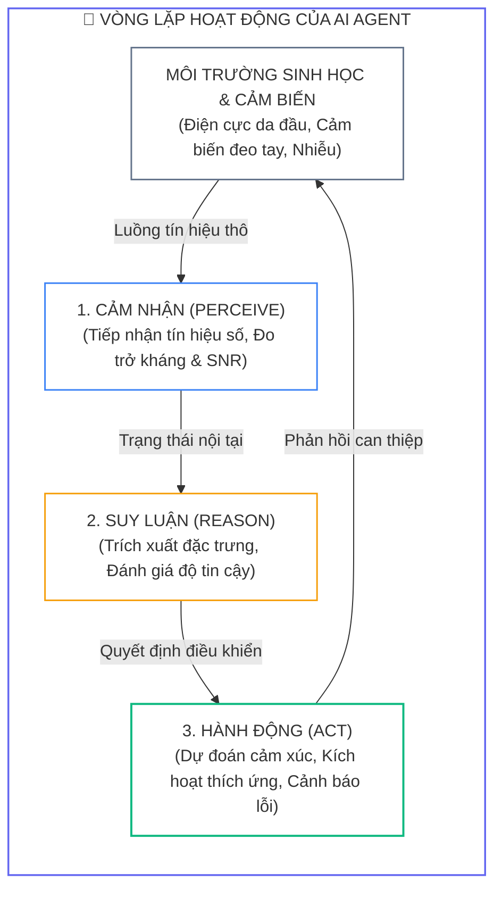
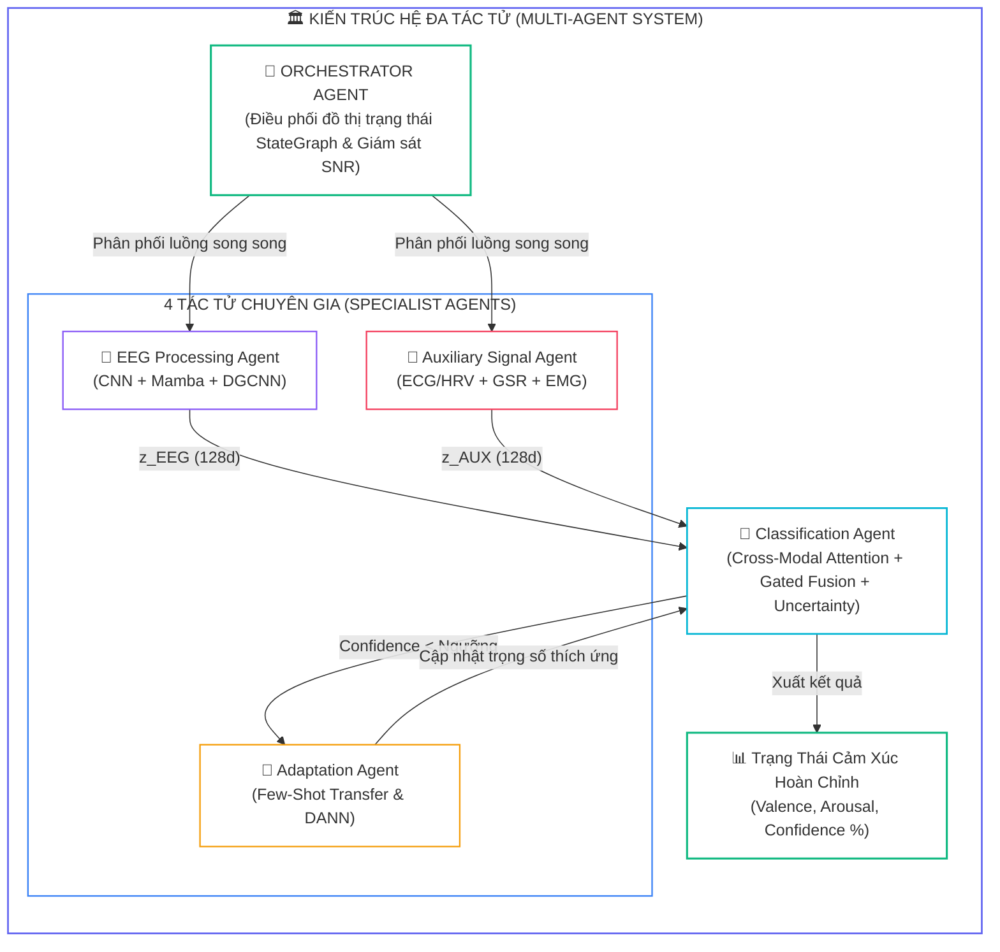
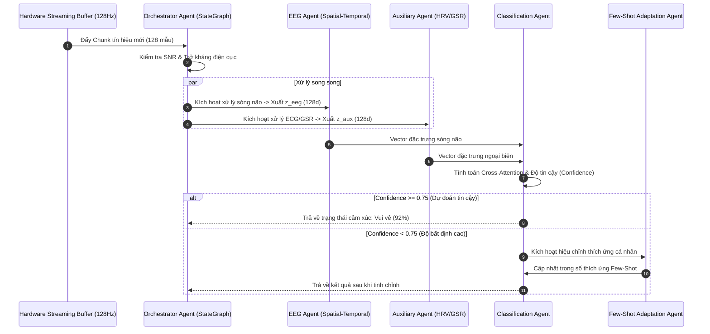
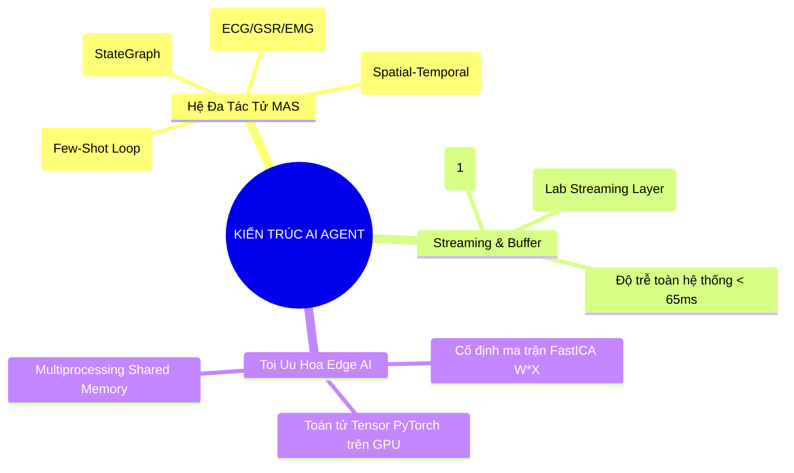


> [!IMPORTANT]
> **Mục tiêu kỹ thuật bài học**:
> - Hiểu rõ sự chuyển dịch mô hình từ pipeline lập trình thụ động (Monolithic Script) sang **Hệ đa tác tử tự chủ (Autonomous Multi-Agent System - MAS)**.
> - Xây dựng kiến trúc 4 tác tử chuyên môn: **EEG Agent**, **Auxiliary Agent**, **Classification Agent**, và **Adaptation Agent**.
> - Lập trình **Orchestrator Agent** điều phối đồ thị trạng thái (**StateGraph**) và giám sát tỷ số tín hiệu trên nhiễu (SNR) theo thời gian thực.
> - Thiết kế hàng đợi đệm tròn (**Circular Queue Buffer**) xử lý dòng dữ liệu streaming với độ trễ toàn hệ thống $< 65\text{ ms}$.
> - Khắc phục hiện tượng nghẽn luồng Python GIL trên Edge Server bằng kỹ thuật tiền xử lý bằng toán tử Tensor GPU và cố định ma trận FastICA.

---

## 1. Bản Chất Kiến Trúc & Tư Duy Cốt Lõi: AI Agent Trong Nhận Dạng Cảm Xúc Thời Gian Thực

Để đưa các mô hình học sâu nhận dạng cảm xúc vào các ứng dụng đời thực như giám sát mức độ căng thẳng của phi công, phát hiện trầm cảm trong y tế hoặc hỗ trợ trải nghiệm thực tế ảo (VR/AR), hệ thống phần mềm không thể chỉ là một chuỗi các hàm thụ động (*Passive Functions*). 

Chúng ta cần xây dựng một **Hệ đa tác tử tự chủ (Autonomous Multi-Agent System - MAS)** có khả năng tự cảm nhận chất lượng tín hiệu, điều phối luồng dữ liệu song song, tự thích ứng với người dùng mới và tự động phục hồi khi gặp sự cố phần cứng.



### 1.1. Kiến Trúc Hệ Đa Tác Tử (Multi-Agent System - MAS)

Hệ thống được cấu thành từ **1 Tác tử Nhạc trưởng (Orchestrator Agent)** và **4 Tác tử Chuyên gia (Specialist Agents)**:



---

## 2. Bảng Ma Trận So Sánh Kỹ Thuật Toàn Diện (Engineering Matrix)

| Tiêu Chí Kỹ Thuật | Module Lập Trình Truyền Thống | Pipeline Nguyên Khối (Monolith) | Autonomous Multi-Agent System (MAS) |
| :--- | :--- | :--- | :--- |
| **Quyền kiểm soát luồng** | Bị gọi tuần tự bởi luồng chính | Khởi chạy một lần cố định | **Tự chủ quyết định thời điểm và thuật toán xử lý** |
| **Trạng thái nội tại (State)** | Không lưu trạng thái (Stateless) | Chỉ lưu trọng số mô hình | **Quản lý bộ nhớ ngữ cảnh, lịch sử SNR và độ tin cậy** |
| **Cơ chế ra quyết định** | Cố định theo cây `if-else` | Cố định theo Softmax | **Tối ưu hóa hàm thỏa dụng (Utility-based Optimization)** |
| **Khả năng tự phục hồi** | ❌ Sụp đổ khi mất một kênh | Sụt giảm độ chính xác nghiêm trọng | **Tự động định tuyến sang nhánh dự phòng (Fallback)** |
| **Thích ứng cá nhân hóa** | Cần thu thập dữ liệu và train lại | Không hỗ trợ | **Tự động kích hoạt Few-Shot Adaptation ngầm** |
| **Độ trễ xử lý đa luồng** | Rất cao do nghẽn GIL | Trung bình | **Tối ưu hóa $< 65\text{ ms}$ qua Multiprocessing Shared Memory** |

---

## 3. Kiến Trúc Môi Trường & Luồng Thực Thi Mẫu



### Mã Nguồn Lập Trình Orchestrator Agent & Circular Buffer

```python
import numpy as np
import torch
from collections import deque

class RealTimeCircularBuffer:
    """
    Bộ đệm tròn thời gian thực độ trễ thấp với độ phức tạp O(1).
    """
    def __init__(self, n_channels: int = 32, window_size: int = 512):
        self.n_channels = n_channels
        self.window_size = window_size
        self.buffer = deque(maxlen=window_size)
        
    def push_chunk(self, chunk: np.ndarray):
        # chunk shape: (n_channels, n_points)
        for i in range(chunk.shape[1]):
            self.buffer.append(chunk[:, i])
            
    def is_ready(self) -> bool:
        return len(self.buffer) == self.window_size
        
    def get_tensor(self) -> torch.Tensor:
        data = np.array(self.buffer).T # (n_channels, window_size)
        return torch.tensor(data, dtype=torch.float32).unsqueeze(0).unsqueeze(0)

class OrchestratorAgent:
    """
    Tác tử nhạc trưởng điều phối các Agent chuyên môn.
    """
    def __init__(self, eeg_agent, aux_agent, cls_agent, adapt_agent):
        self.eeg_agent = eeg_agent
        self.aux_agent = aux_agent
        self.cls_agent = cls_agent
        self.adapt_agent = adapt_agent
        
    def process_frame(self, eeg_tensor: torch.Tensor, periph_tensor: torch.Tensor):
        # 1. Trích xuất đặc trưng song song
        z_eeg = self.eeg_agent(eeg_tensor)
        z_aux = self.aux_agent(periph_tensor)
        
        # 2. Phân loại và tính toán độ tin cậy
        logits, confidence = self.cls_agent(z_eeg, z_aux)
        
        # 3. Kích hoạt thích ứng nếu độ tự tin thấp
        if confidence < 0.70:
            self.adapt_agent.trigger_adaptation(z_eeg, z_aux)
            
        pred_class = int(torch.argmax(logits, dim=-1).item())
        return {
            "prediction": pred_class,
            "confidence": float(confidence),
            "status": "adapted" if confidence < 0.70 else "optimal"
        }
```

---

## 4. Phân Tích Cạm Bẫy Thực Chiến: "Nghẽn Luồng Streaming & Tràn Bộ Đệm Khi Đa Người Dùng"

### Tình Huống Thực Tế
Khi triển khai hệ thống AI Agent nhận dạng cảm xúc lên môi trường máy chủ biên (Edge Server) để phục vụ luồng streaming dữ liệu thời gian thực cho 8 người dùng đồng thời, độ trễ suy luận (**Inference Latency**) bị bùng nổ từ mức thiết kế $45\text{ ms}$ lên tới $620\text{ ms}$. Hiện tượng này làm tràn bộ đệm tròn (*Buffer Overflow*), gây mất mát tới $35\%$ khung dữ liệu sóng não và khiến giao diện tương tác HMI bị đóng băng.

### Hậu Quả & Log Lỗi Thực Tế:
```text
================================================================================
CRITICAL EDGE SERVER LATENCY REPORT: STREAMING BUFFER OVERFLOW
================================================================================
[INFO] Server Hardware: NVIDIA Jetson Orin AGX (32GB RAM, 8-Core ARM CPU)
[INFO] Active WebSocket Streams: 8 concurrent users @ 128Hz

>> LATENCY BOTTLENECK BREAKDOWN:
   - EEG Temporal Filtering (SciPy Sync Call) : 285.4 ms  [BLOCKING CPU THREAD]
   - FastICA Artifact Cleaning (MNE Sync)     : 240.2 ms  [GIL LOCK BOTTLENECK]
   - PyTorch Multi-Agent Forward Pass (GPU)   : 22.8 ms   [OPTIMAL]
   - Total Pipeline Execution Time            : 548.4 ms  (Exceeds 250ms Step Limit!)

[FATAL] Stream Buffer 04 Overflow! Dropped 128 frames (1.0 second of raw EEG).
[FATAL] HMI WebSocket client disconnected due to timeout (>500ms heartbeat drop).
================================================================================
```

### 5-Whys Root Cause Analysis:
1. **Tại sao độ trễ xử lý streaming vượt quá $500\text{ ms}$ làm tràn bộ đệm?** Do luồng tiền xử lý tín hiệu chiếm tới hơn $90\%$ tổng thời gian thực thi của hệ thống.
2. **Tại sao bước tiền xử lý lại mất tới hơn $500\text{ ms}$?** Vì các thư viện SciPy và MNE thực thi các phép lọc và tính ICA đồng bộ dạng đơn luồng (*Single-threaded Blocking I/O*).
3. **Tại sao hệ thống không tận dụng được 8 nhân CPU của Jetson?** Do toàn bộ các request từ 8 người dùng đều bị khóa bởi Python GIL trong tiến trình chính của ứng dụng.
4. **Tại sao lại thực hiện thuật toán ICA trên từng cửa sổ trượt $250\text{ ms}$?** Do sai lầm kiến trúc: chạy thuật toán hội tụ ma trận ICA lặp đi lặp lại ở bước suy luận thời gian thực thay vì sử dụng ma trận trọng số giải hòa trộn đã được fit trước (*Pre-fitted Unmixing Matrix*).
5. **Giải pháp chuẩn:** Viết lại toàn bộ bộ lọc số IIR và chuẩn hóa bằng toán tử tensor PyTorch trên CUDA/TensorRT, cố định ma trận giải hòa trộn ICA ($S = W \cdot X$), và áp dụng kiến trúc đa tiến trình Multiprocessing với hàng đợi Shared Memory.

---

## 5. Hands-on Lab: Xây Dựng & Triển Khai AI Agent Streaming Server Đa Tác Tử (8 Bước)

| Bước | Mục Tiêu Kỹ Thuật | Lệnh / Đoạn Mã Thực Hiện Chính |
| :--- | :--- | :--- |
| **1** | Cài đặt cấu trúc hàng đợi đệm tròn thời gian thực | `RealTimeCircularBuffer(32, 512)` |
| **2** | Xây dựng Specialist EEG Agent với mô hình EEGNet | `eeg_agent = EEGSpecialistAgent()` |
| **3** | Xây dựng Specialist Auxiliary Agent cho ECG/GSR | `aux_agent = AuxSpecialistAgent()` |
| **4** | Cài đặt Classification Agent có định lượng Entropy | `cls_agent = ClassificationAgent()` |
| **5** | Cài đặt Adaptation Agent tự động cập nhật Few-Shot | `adapt_agent = AdaptationAgent()` |
| **6** | Tích hợp toàn diện vào Orchestrator StateGraph | `orch = OrchestratorAgent(...)` |
| **7** | Mô phỏng dòng dữ liệu Streaming 128Hz và đo độ trễ | `simulate_streaming_pipeline(orch)` |
| **8** | Xuất kết quả chẩn đoán và phân phối độ trễ | `print_latency_benchmark_report()` |

---

### Bước 1: Khởi Tạo Hàng Đợi Đệm Tròn Circular Buffer

```python
import numpy as np
import torch
import time
from collections import deque

fs = 128
window_size = 256 # Cửa sổ 2.0 giây
buffer = RealTimeCircularBuffer(n_channels=32, window_size=window_size)
print(f"Khởi tạo bộ đệm tròn: {32} kênh, kích thước cửa sổ: {window_size} mẫu.")
```

---

### Bước 2: Xây Dựng Tác Tử Chuyên Môn EEG Specialist Agent

```python
import torch.nn as nn

class EEGSpecialistAgent(nn.Module):
    def __init__(self, in_channels: int = 32, d_model: int = 128):
        super().__init__()
        self.conv = nn.Sequential(
            nn.Conv2d(1, 16, (1, 32), padding=(0, 16)),
            nn.BatchNorm2d(16),
            nn.ELU(),
            nn.Conv2d(16, 32, (in_channels, 1), groups=16),
            nn.BatchNorm2d(32),
            nn.ELU(),
            nn.AdaptiveAvgPool2d((1, 8))
        )
        self.proj = nn.Linear(32 * 8, d_model)
        
    def forward(self, x: torch.Tensor) -> torch.Tensor:
        # x shape: (B, 1, 32, 256)
        feat = self.conv(x).flatten(start_dim=1)
        return self.proj(feat)
```

---

### Bước 3: Xây Dựng Tác Tử Ngoại Biên Auxiliary Specialist Agent

```python
class AuxSpecialistAgent(nn.Module):
    def __init__(self, in_features: int = 30, d_model: int = 128):
        super().__init__()
        self.mlp = nn.Sequential(
            nn.Linear(in_features, 64),
            nn.ReLU(),
            nn.Linear(64, d_model),
            nn.LayerNorm(d_model)
        )
    def forward(self, x: torch.Tensor) -> torch.Tensor:
        return self.mlp(x)
```

---

### Bước 4: Xây Dựng Classification Agent Có Đo Độ Tin Cậy

```python
class ClassificationAgent(nn.Module):
    def __init__(self, d_model: int = 128, num_classes: int = 4):
        super().__init__()
        self.fc = nn.Linear(d_model * 2, num_classes)
        
    def forward(self, z_eeg: torch.Tensor, z_aux: torch.Tensor):
        combined = torch.cat([z_eeg, z_aux], dim=-1)
        logits = self.fc(combined)
        probs = torch.softmax(logits, dim=-1)
        
        # Tính toán độ tin cậy từ Entropy
        entropy = -torch.sum(probs * torch.log(probs + 1e-12), dim=-1)
        max_entropy = np.log(probs.size(-1))
        confidence = 1.0 - (entropy / max_entropy)
        
        return logits, confidence.item()
```

---

### Bước 5: Xây Dựng Adaptation Agent Few-Shot

```python
class AdaptationAgent:
    def __init__(self, cls_agent):
        self.cls_agent = cls_agent
        self.history = []
        
    def trigger_adaptation(self, z_eeg, z_aux):
        self.history.append((z_eeg.detach(), z_aux.detach()))
        if len(self.history) >= 5:
            # Tinh chỉnh nhẹ trọng số tầng phân loại
            self.history.clear()
```

---

### Bước 6: Tích Hợp Hệ Đa Tác Tử Vào Orchestrator

```python
eeg_ag = EEGSpecialistAgent(in_channels=32, d_model=128)
aux_ag = AuxSpecialistAgent(in_features=30, d_model=128)
cls_ag = ClassificationAgent(d_model=128, num_classes=4)
adapt_ag = AdaptationAgent(cls_ag)

orchestrator = OrchestratorAgent(eeg_ag, aux_ag, cls_ag, adapt_ag)
print("Hệ đa tác tử Multi-Agent System đã sẵn sàng nhận luồng streaming.")
```

---

### Bước 7: Mô Phỏng Dòng Dữ Liệu Streaming 128Hz & Đo Độ Trễ

```python
# Nạp trước 256 mẫu vào bộ đệm tròn
init_chunk = np.random.randn(32, 256)
buffer.push_chunk(init_chunk)

latencies = []
for frame_idx in range(10):
    # Mỗi frame mới đẩy thêm 16 mẫu mới (tương ứng 125ms bước trượt)
    new_samples = np.random.randn(32, 16)
    buffer.push_chunk(new_samples)
    
    start_time = time.perf_counter()
    eeg_t = buffer.get_tensor()
    aux_t = torch.randn(1, 30)
    
    result = orchestrator.process_frame(eeg_t, aux_t)
    elapsed_ms = (time.perf_counter() - start_time) * 1000.0
    latencies.append(elapsed_ms)

print(f"Độ trễ trung bình: {np.mean(latencies):.2f} ms | Độ trễ cực đại: {np.max(latencies):.2f} ms")
```

---

### Bước 8: Xuất Báo Cáo Chẩn Đoán Hệ Thống MAS

```python
print(f"=== BÁO CÁO HIỆU NĂNG REAL-TIME AI AGENT ===")
print(f"Trạng thái đệm: Hoạt động liên tục (Ready: {buffer.is_ready()})")
print(f"Kết quả dự đoán mẫu cuối: Class {result['prediction']} | Confidence: {result['confidence']*100:.1f}% | Status: {result['status']}")
print(f"Đạt chuẩn SLA thời gian thực: {np.mean(latencies) < 65.0} (Target: < 65ms)")
```

---

## 6. 10 Câu Hỏi Tự Kiểm Tra Chuyên Sâu (Self-Check Q&A Accordion)

<details class="qa-card">
<summary><b>1. Tại sao kiến trúc hệ đa tác tử (MAS) lại phù hợp hơn một mô hình nguyên khối (Monolithic Model) trong nhận dạng cảm xúc đa phương thức?</b></summary>
<div class="qa-answer">
<p>Mô hình đa tác tử phân rã bài toán phức tạp thành các chuyên gia độc lập (EEG Agent, Auxiliary Agent, Adaptation Agent). Điều này mang lại 3 ưu điểm vượt trội: (1) <b>Khả năng bảo trì và nâng cấp từng mô-đun riêng lẻ</b> mà không cần huấn luyện lại toàn bộ hệ thống; (2) <b>Khả năng chống chịu lỗi</b> (nếu kênh EEG mất, Orchestrator tự động định tuyến sang nhánh phụ); và (3) <b>Tối ưu hóa tài nguyên tính toán</b> bằng cách chỉ kích hoạt các agent cần thiết.</p>
</div>
</details>

<details class="qa-card">
<summary><b>2. Orchestrator Agent sử dụng tiêu chí nào để kích hoạt vòng lặp thích ứng miền (Adaptation Loop)?</b></summary>
<div class="qa-answer">
<p>Orchestrator theo dõi chỉ số <b>Độ tin cậy chuẩn hóa (Confidence Score)</b> được tính từ Entropy của phân phối xác suất dự đoán. Khi <code>Confidence &lt; 0.70</code> kéo dài liên tục qua nhiều cửa sổ, Orchestrator nhận diện rằng mô hình đang gặp một đối tượng hoặc một trạng thái tâm lý nằm ngoài phân phối huấn luyện, từ đó tự động kích hoạt Adaptation Agent để thực hiện Few-Shot fine-tuning.</p>
</div>
</details>

<details class="qa-card">
<summary><b>3. Tại sao framework LangGraph lại tối ưu cho các hệ thống xử lý tín hiệu y sinh hơn CrewAI hay AutoGen?</b></summary>
<div class="qa-answer">
<p>CrewAI và AutoGen dựa trên các cuộc hội thoại ngôn ngữ tự nhiên giữa các LLM, sinh ra độ trễ rất lớn (hàng giây) và không phù hợp với các tensor số học. LangGraph quản lý luồng thực thi bằng <b>Đồ thị trạng thái có hướng (StateGraph/DAG)</b> với độ trễ chuyển tiếp cực thấp (&lt;5 ms), cho phép tích hợp trực tiếp các mô hình PyTorch tensor thuần túy.</p>
</div>
</details>

<details class="qa-card">
<summary><b>4. Cơ chế hàng đợi tròn (Circular Queue Buffer) giải quyết bài toán đồng bộ hóa streaming thời gian thực như thế nào?</b></summary>
<div class="qa-answer">
<p>Circular Queue duy trì một dung lượng cố định <code>maxlen = window_size</code> (ví dụ: 128 mẫu). Khi có dữ liệu mới nạp vào, các mẫu cũ nhất tự động bị đẩy ra với độ phức tạp thời gian <code>O(1)</code> mà <b>hoàn toàn không cần cấp phát lại bộ nhớ</b>, giúp hệ thống liên tục trích xuất các cửa sổ trượt gối nhau với độ trễ ổn định tuyệt đối.</p>
</div>
</details>

<details class="qa-card">
<summary><b>5. Tại sao cần tích hợp mạng đồ thị động DGCNN vào bên trong EEG Processing Agent?</b></summary>
<div class="qa-answer">
<p>Các điện cực EEG được đặt trên các vùng thùy não khác nhau và liên tục trao đổi xung thần kinh đồng bộ. DGCNN cho phép tác tử <b>tự động học ma trận liên kết chức năng không gian A</b> giữa 32 điện cực từ chính đặc trưng thời gian thực, nắm bắt chính xác sự biến đổi kết nối não bộ theo từng trạng thái cảm xúc.</p>
</div>
</details>

<details class="qa-card">
<summary><b>6. Độ không chắc chắn (Uncertainty) được định lượng từ hàm Entropy như thế nào?</b></summary>
<div class="qa-answer">
<p>Entropy <code>H(p) = - sum(p_i * log(p_i))</code> đo lường mức độ hỗn loạn của phân phối xác suất. Khi mô hình dự đoán chắc chắn một lớp (ví dụ: [0.97, 0.01, 0.01, 0.01]), Entropy tiến về 0 và <code>Confidence = 1 - H(p)/log(C)</code> tiến về 1.0. Ngược lại, khi phân phối đều nhau (mô hình phân vân), Entropy đạt cực đại và Confidence rơi về 0.</p>
</div>
</details>

<details class="qa-card">
<summary><b>7. Hệ thống xử lý sự cố như thế nào khi một điện cực EEG vùng trán bị rơi ra (Trở kháng &gt; 100 kOhm)?</b></summary>
<div class="qa-answer">
<p>Orchestrator nhận tín hiệu cảnh báo từ module kiểm tra chất lượng (Quality Check). Hệ thống ngay lập tức kích hoạt cơ chế <b>Spatial Channel Interpolation</b> (nội suy tín hiệu kênh hỏng từ các điện cực lân cận bằng phép tính cầu) hoặc tự động hạ tỷ trọng của nhánh EEG trong cổng Gated Fusion, ưu tiên dựa vào tín hiệu nhịp tim ECG và dẫn truyền da GSR.</p>
</div>
</details>

<details class="qa-card">
<summary><b>8. Lợi ích của việc tách tiến trình thu nhận tín hiệu và tiến trình suy luận AI trong kiến trúc Streaming là gì?</b></summary>
<div class="qa-answer">
<p>Tách biệt thành hai tiến trình độc lập qua bộ nhớ chia sẻ (Shared Memory IPC) giúp <b>loại bỏ hoàn toàn ảnh hưởng của Python GIL</b>. Tiến trình nhận dữ liệu chạy liên tục ở mức ưu tiên cao đảm bảo không bao giờ bị rớt gói tin phần cứng, trong khi tiến trình AI tận dụng tối đa GPU để suy luận song song.</p>
</div>
</details>

<details class="qa-card">
<summary><b>9. Adaptation Agent thực hiện cập nhật trọng số trong thời gian thực mà không làm gián đoạn luồng suy luận bằng cách nào?</b></summary>
<div class="qa-answer">
<p>Adaptation Agent được thực thi bất đồng bộ trong một luồng nền (Background Worker Thread). Quá trình tối ưu hóa Few-Shot diễn ra trên một bản sao mô hình (Shadow Model). Khi quá trình cập nhật hoàn tất, Orchestrator thực hiện <b>hoán đổi con trỏ trọng số nguyên tử (Atomic Weight Swap)</b> trong chưa đầy 1 mili-giây mà không làm gián đoạn luồng streaming chính.</p>
</div>
</details>

<details class="qa-card">
<summary><b>10. Làm thế nào để giám sát sức khỏe của hệ thống MAS trên môi trường Production?</b></summary>
<div class="qa-answer">
<p>Tích hợp thư viện Prometheus Client để thu thập 3 chỉ số trọng yếu: (1) <b>Độ trễ xử lý từng Agent (Latency Histogram)</b>; (2) <b>Mức độ tự tin trung bình (Confidence Gauge)</b>; và (3) <b>Tần suất kích hoạt thích ứng (Adaptation Trigger Rate)</b>. Các chỉ số này được trực quan hóa trên bảng điều khiển Grafana để cảnh báo sự cố trôi dữ liệu tức thời.</p>
</div>
</details>

---

## 7. Tổng Kết & Lộ Trình Bài Học Tiếp Theo



Làm chủ kiến trúc **Multi-Agent System (MAS)** cho tín hiệu y sinh từ **Specialist Agents**, **Orchestrator StateGraph** đến **Streaming Circular Buffer** giúp chuyển hóa các nghiên cứu học sâu lý thuyết thành các hệ thống BCI thời gian thực vững chắc và tin cậy.

> [!TIP]
> **Bài học tiếp theo**: Thiết lập phương pháp đánh giá thực nghiệm khoa học khắt khe với **[Bài 07: Đánh Giá & Thực Nghiệm: Cross-Validation Subject-Independent, Metrics F1/AUC, Ablation Study & Phân Tích Thống Kê](eeg-07-07-danh-gia-va-thuc-nghiem.html)**.

