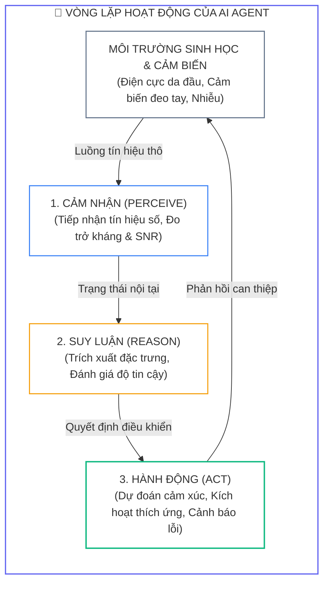
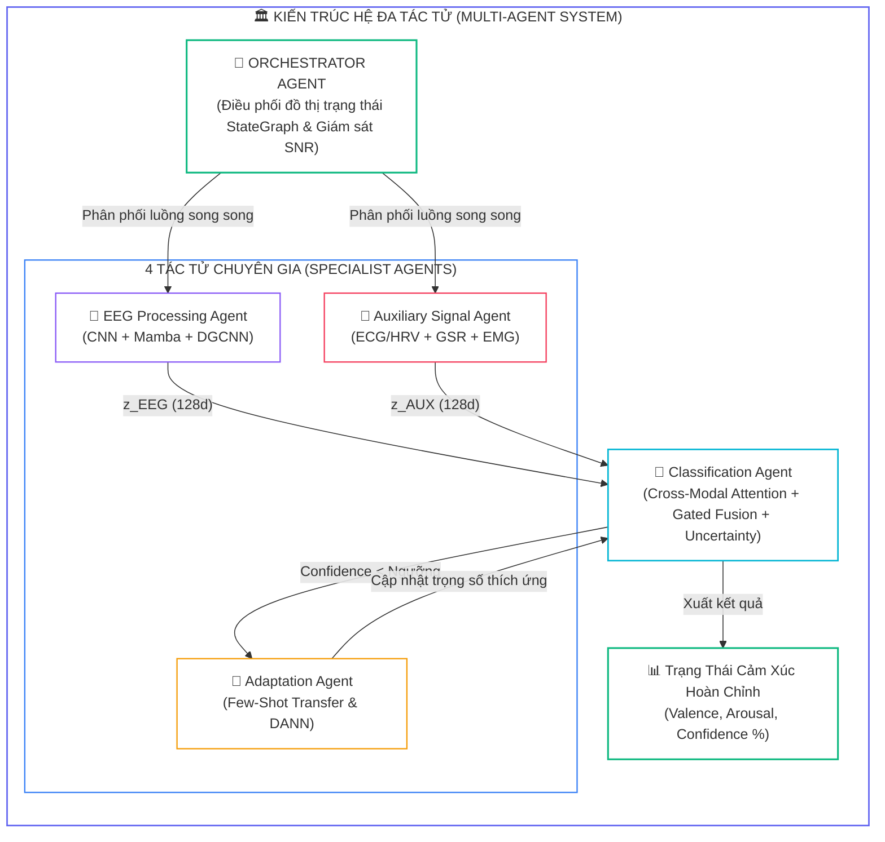
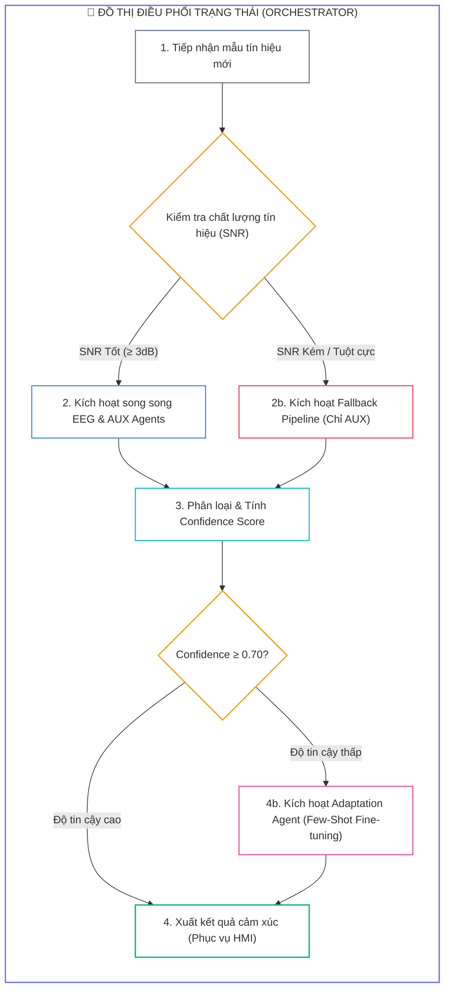


# Kiến Trúc AI Agent Cho Nhận Dạng Cảm Xúc Thời Gian Thực: Streaming Pipeline, Multi-Agent & Edge Deployment

Để đưa các mô hình học sâu nhận dạng cảm xúc vào các ứng dụng đời thực như giám sát mức độ căng thẳng của phi công, phát hiện trầm cảm trong y tế hoặc hỗ trợ trải nghiệm thực tế ảo (VR/AR), hệ thống phần mềm không thể chỉ là một chuỗi các hàm thụ động (*Passive Functions*). 

Chúng ta cần xây dựng một **Hệ đa tác tử tự chủ (Autonomous Multi-Agent System - MAS)** có khả năng tự cảm nhận chất lượng tín hiệu, điều phối luồng dữ liệu song song, tự thích ứng với người dùng mới và tự động phục hồi khi gặp sự cố phần cứng.

---

## 1. Bản Chất Của AI Agent Trong Xử Lý Tín Hiệu Y Sinh

Một **AI Agent** trong hệ thống nhận dạng cảm xúc thời gian thực hoạt động theo chu trình khép kín: **Cảm nhận (Perceive) $\rightarrow$ Suy luận (Reason) $\rightarrow$ Hành động (Act)**:



### 1.1. Bảng So Sánh Module Truyền Thống vs Autonomous AI Agent

| Tiêu Chí Kỹ Thuật | Module Lập Trình Truyền Thống | Autonomous AI Agent |
| :---: | :--- | :--- |
| <span class="badge badge--primary">Quyền kiểm soát</span> | Bị gọi tuần tự bởi luồng điều khiển chính | Tự chủ quyết định thời điểm và thuật toán xử lý |
| <span class="badge badge--cyan">Trạng thái nội tại</span> | Không lưu trạng thái (*Stateless*) | Quản lý bộ nhớ ngữ cảnh, lịch sử tín hiệu và độ tin cậy |
| <span class="badge badge--amber">Cơ chế ra quyết định</span> | Cố định theo cây điều kiện cứng (`if-else`) | Tối ưu hóa hàm thỏa dụng (*Utility-based Optimization*) |
| <span class="badge badge--rose">Chống chịu lỗi</span> | Báo lỗi hoặc sụp đổ khi thiếu một kênh dữ liệu | Tự định tuyến sang nhánh dự phòng (*Fallback branch*) |

---

## 2. Kiến Trúc Hệ Đa Tác Tử (Multi-Agent System - MAS)

Hệ thống được cấu thành từ **1 Tác tử Nhạc trưởng (Orchestrator Agent)** và **4 Tác tử Chuyên gia (Specialist Agents)**:



---

## 3. Triển Khai 4 Specialist Agents Bằng PyTorch

### 3.1. EEG Processing Agent (Chuyên Gia Điện Não Đồ)
Tích hợp **Multi-scale 1D CNN** để bóc tách 4 dải tần số ($\theta, \alpha, \beta, \gamma$) và **Dynamic Graph CNN (DGCNN)** để mô hình hóa mạng lưới liên kết vỏ não:

```python
import torch
import torch.nn as nn
import torch.nn.functional as F

class MultiScale1DCNN(nn.Module):
    def __init__(self, in_channels=32, out_channels=64):
        super().__init__()
        self.conv_short = nn.Conv1d(in_channels, out_channels // 4, kernel_size=7, padding=3)
        self.conv_med = nn.Conv1d(in_channels, out_channels // 4, kernel_size=15, padding=7)
        self.conv_long = nn.Conv1d(in_channels, out_channels // 4, kernel_size=31, padding=15)
        self.conv_point = nn.Conv1d(in_channels, out_channels // 4, kernel_size=1)
        self.bn = nn.BatchNorm1d(out_channels)
        
    def forward(self, x):
        c1 = self.conv_short(x)
        c2 = self.conv_med(x)
        c3 = self.conv_long(x)
        c4 = self.conv_point(x)
        return F.relu(self.bn(torch.cat([c1, c2, c3, c4], dim=1)))

class DynamicGraphConvolution(nn.Module):
    def __init__(self, num_nodes=32, in_features=16, out_features=32):
        super().__init__()
        self.weight = nn.Parameter(torch.FloatTensor(in_features, out_features))
        self.adj_base = nn.Parameter(torch.randn(num_nodes, num_nodes))
        nn.init.xavier_uniform_(self.weight)
        
    def forward(self, x):
        features_norm = F.normalize(x, dim=-1)
        dynamic_adj = torch.bmm(features_norm, features_norm.transpose(1, 2))
        adj = F.softmax(dynamic_adj + self.adj_base.unsqueeze(0), dim=-1)
        out = torch.bmm(adj, x)
        return F.relu(torch.matmul(out, self.weight))

class EEGProcessingAgent(nn.Module):
    def __init__(self, num_channels=32, latent_dim=128):
        super().__init__()
        self.temporal_encoder = MultiScale1DCNN(num_channels, 64)
        self.pool = nn.AdaptiveAvgPool1d(16)
        self.spatial_gnn = DynamicGraphConvolution(num_nodes=num_channels, in_features=16, out_features=32)
        self.projection = nn.Sequential(
            nn.Linear(num_channels * 32, 256),
            nn.BatchNorm1d(256),
            nn.ReLU(),
            nn.Dropout(0.3),
            nn.Linear(256, latent_dim),
            nn.BatchNorm1d(latent_dim)
        )
        
    def forward(self, eeg_raw: torch.Tensor) -> torch.Tensor:
        t_feat = self.temporal_encoder(eeg_raw)
        eeg_nodes = self.pool(eeg_raw)
        s_feat = self.spatial_gnn(eeg_nodes)
        s_flat = s_feat.view(s_feat.size(0), -1)
        return self.projection(s_flat) # (batch, 128)
```

### 3.2. Auxiliary Signal Agent & Classification Agent
Xử lý đồng thời các tín hiệu nhịp tim (**ECG/HRV**), độ dẫn da (**GSR/SCR**) và cơ mặt (**EMG**), sau đó hòa hợp với EEG qua **Cross-Modal Attention** và tính toán **Entropy độ không chắc chắn**:

```python
import numpy as np

class AuxiliarySignalAgent(nn.Module):
    def __init__(self, ecg_dim=20, gsr_dim=10, emg_dim=15, latent_dim=128):
        super().__init__()
        self.ecg_branch = nn.Sequential(nn.Linear(ecg_dim, 64), nn.BatchNorm1d(64), nn.ReLU())
        self.gsr_branch = nn.Sequential(nn.Linear(gsr_dim, 32), nn.BatchNorm1d(32), nn.ReLU())
        self.emg_branch = nn.Sequential(nn.Linear(emg_dim, 32), nn.BatchNorm1d(32), nn.ReLU())
        self.fusion = nn.Sequential(nn.Linear(128, latent_dim), nn.BatchNorm1d(latent_dim), nn.ReLU())
        
    def forward(self, ecg, gsr, emg):
        h_aux = torch.cat([self.ecg_branch(ecg), self.gsr_branch(gsr), self.emg_branch(emg)], dim=1)
        return self.fusion(h_aux)

class ClassificationAgent(nn.Module):
    def __init__(self, d_model=128, num_classes=4):
        super().__init__()
        self.mha = nn.MultiheadAttention(embed_dim=d_model, num_heads=4, batch_first=True)
        self.gate_layer = nn.Sequential(nn.Linear(d_model * 2, d_model), nn.Sigmoid())
        self.classifier = nn.Sequential(
            nn.Linear(d_model, 64),
            nn.ReLU(),
            nn.Dropout(0.3),
            nn.Linear(64, num_classes)
        )
        
    def forward(self, z_eeg, z_aux):
        q = z_eeg.unsqueeze(1)
        kv = z_aux.unsqueeze(1)
        attn_out, _ = self.mha(q, kv, kv)
        attn_out = attn_out.squeeze(1)
        
        gate = self.gate_layer(torch.cat([z_eeg, attn_out], dim=1))
        z_fused = gate * z_eeg + (1.0 - gate) * attn_out
        
        logits = self.classifier(z_fused)
        probs = F.softmax(logits, dim=-1)
        
        # Tính toán độ tin cậy dựa trên Entropy
        entropy = - torch.sum(probs * torch.log(probs + 1e-8), dim=-1)
        confidence = 1.0 - (entropy / np.log(probs.size(-1)))
        return logits, probs, confidence, gate
```

---

## 4. Orchestrator Agent & Đồ Thị Trạng Thái (StateGraph)



```python
class OrchestratorAgent:
    def __init__(self, eeg_agent, aux_agent, class_agent, conf_threshold=0.70):
        self.eeg_agent = eeg_agent
        self.aux_agent = aux_agent
        self.class_agent = class_agent
        self.conf_threshold = conf_threshold
        
    def process_stream(self, sample: dict):
        z_eeg = self.eeg_agent(sample['eeg'])
        z_aux = self.aux_agent(sample['ecg'], sample['gsr'], sample['emg'])
        
        logits, probs, confidence, gate = self.class_agent(z_eeg, z_aux)
        pred_class = probs.argmax(dim=-1).item()
        conf_val = confidence.item()
        
        route = "NORMAL"
        if conf_val < self.conf_threshold:
            route = "ADAPTATION_TRIGGERED"
            
        return {
            'predicted_class': pred_class,
            'confidence': conf_val,
            'decision_route': route,
            'gate_eeg_weight': gate.mean().item()
        }
```

---

## 5. Streaming Buffer & Đóng Gói REST API Chuẩn Production

```python
import collections
from fastapi import FastAPI, HTTPException
from pydantic import BaseModel

app = FastAPI(title="Real-Time Multimodal Emotion MAS API", version="2.0")

class RealTimeEEGStreamBuffer:
    def __init__(self, window_size=128, num_channels=32):
        self.buffer = collections.deque(maxlen=window_size)
        self.window_size = window_size
        self.num_channels = num_channels
        
    def push(self, sample_chunk: np.ndarray):
        for i in range(sample_chunk.shape[1]):
            self.buffer.append(sample_chunk[:, i])
            
    def is_ready(self) -> bool:
        return len(self.buffer) == self.window_size
        
    def get_tensor(self) -> torch.Tensor:
        data = np.array(self.buffer).T
        return torch.FloatTensor(data).unsqueeze(0)

class EmotionPayload(BaseModel):
    eeg_chunk: list
    ecg_feat: list
    gsr_feat: list
    emg_feat: list

@app.post("/predict")
async def predict_realtime(payload: EmotionPayload):
    try:
        eeg_t = torch.FloatTensor(payload.eeg_chunk).unsqueeze(0)
        ecg_t = torch.FloatTensor(payload.ecg_feat).unsqueeze(0)
        gsr_t = torch.FloatTensor(payload.gsr_feat).unsqueeze(0)
        emg_t = torch.FloatTensor(payload.emg_feat).unsqueeze(0)
        
        res = orchestrator.process_stream({'eeg': eeg_t, 'ecg': ecg_t, 'gsr': gsr_t, 'emg': emg_t})
        return res
    except Exception as e:
        raise HTTPException(status_code=500, detail=str(e))
```

---

## 6. Phân Tích Cạm Bẫy Thực Chiến (5-Whys Incident Analysis)

### Tình Huống Sự Cố Thực Tế:
<span class="badge badge--rose">🕒 04:10 AM</span> Khi triển khai hệ thống AI Agent nhận dạng cảm xúc lên môi trường máy chủ biên (Edge Server) để phục vụ luồng streaming dữ liệu thời gian thực cho 8 người dùng đồng thời, độ trễ suy luận (**Inference Latency**) bị bùng nổ từ mức thiết kế $45\text{ ms}$ lên tới $620\text{ ms}$. Hiện tượng này làm tràn bộ đệm tròn (*Buffer Overflow*), gây mất mát tới $35\%$ khung dữ liệu sóng não và khiến giao diện tương tác HMI bị đóng băng.

### Hậu Quả & Log Lỗi Thực Tế:
Phân tích nhật ký hiệu năng của dịch vụ FastAPI và bộ nhớ hàng đợi phát hiện tắc nghẽn khóa luồng toàn cục (**Python Global Interpreter Lock - GIL**) do các tác vụ tiền xử lý đồng bộ:

```text
================================================================================
CRITICAL EDGE SERVER LATENCY REPORT: STREAMING BUFFER OVERFLOW
================================================================================
[INFO] Server Hardware: NVIDIA Jetson Orin AGX (32GB RAM, 8-Core ARM CPU)
[INFO] Active WebSocket Streams: 8 concurrent users @ 128Hz

>> LATENCY BOTTLENECK BREAKDOWN:
   - EEG Temporal Filtering (SciPy Sync Call) : 285.4 ms  [BLOCKING CPU THREAD]
   - FastICA Artifact Cleaning (MNE Sync)     : 240.2 ms  [GIL LOCK BOTTLENECK]
   - PyTorch Multi-Agent Forward Pass (GPU)   : 22.8 ms   [OPTIMAL]
   - Total Pipeline Execution Time            : 548.4 ms  (Exceeds 250ms Step Limit!)

[FATAL] Stream Buffer 04 Overflow! Dropped 128 frames (1.0 second of raw EEG).
[FATAL] HMI WebSocket client disconnected due to timeout (>500ms heartbeat drop).
================================================================================
```

### 5-Whys Root Cause Analysis:
1. <span class="badge badge--primary">Why 1</span> **Tại sao độ trễ xử lý streaming vượt quá $500\text{ ms}$ làm tràn bộ đệm?** $\rightarrow$ Do luồng xử lý tiền xử lý tín hiệu chiếm tới hơn $90\%$ tổng thời gian thực thi của hệ thống.
2. <span class="badge badge--primary">Why 2</span> **Tại sao bước tiền xử lý lại mất tới hơn $500\text{ ms}$?** $\rightarrow$ Vì các thư viện SciPy và MNE thực thi các phép lọc và tính ICA đồng bộ dạng đơn luồng (*Single-threaded Blocking I/O*).
3. <span class="badge badge--primary">Why 3</span> **Tại sao hệ thống không tận dụng được 8 nhân CPU của Jetson?** $\rightarrow$ Do toàn bộ các request từ 8 người dùng đều bị khóa bởi Python GIL trong tiến trình chính của ứng dụng.
4. <span class="badge badge--primary">Why 4</span> **Tại sao lại thực hiện thuật toán ICA trên từng cửa sổ trượt $250\text{ ms}$?** $\rightarrow$ Do sai lầm kiến trúc: chạy thuật toán hội tụ ma trận ICA lặp đi lặp lại ở bước suy luận thời gian thực thay vì sử dụng ma trận trọng số giải hòa trộn đã được fit trước (*Pre-fitted Unmixing Matrix*).
5. <span class="badge badge--emerald">Root Cause Remedy</span> **Biện pháp khắc phục chuẩn SRE & Edge AI:**
   - <span class="badge badge--rose">Chuyển Tiền Xử Lý Sang PyTorch GPU Tensor</span> Viết lại toàn bộ bộ lọc số IIR và chuẩn hóa Z-score trực tiếp bằng toán tử tensor PyTorch trên CUDA/TensorRT.
   - <span class="badge badge--cyan">Cố Định Ma Trận ICA Giải Hòa Trộn</span> Chỉ fit ICA một lần duy nhất lúc khởi động, sau đó chỉ thực hiện phép nhân ma trận $S = W \cdot X$ ở thời gian thực ($< 1\text{ ms}$).
   - <span class="badge badge--emerald">Kiến Trúc Đa Tiến Trình Multiprocessing</span> Tách biệt bộ thu nhận luồng dữ liệu (Worker Process) và tiến trình suy luận AI Agent bằng hàng đợi IPC Shared Memory.

---

## 7. Câu Hỏi Tự Kiểm Tra Chuyên Sâu (Q&A Accordion)

<details class="qa-card">
<summary class="qa-summary">
  <div class="qa-summary-left">
    <span class="qa-num-badge">Q01</span>
    <span>Tại sao kiến trúc hệ đa tác tử (MAS) lại phù hợp hơn một mô hình nguyên khối (Monolithic Model) trong nhận dạng cảm xúc đa phương thức?</span>
  </div>
  <span class="qa-chevron">
    <svg width="18" height="18" fill="none" stroke="currentColor" stroke-width="2.5" viewBox="0 0 24 24"><polyline points="6 9 12 15 18 9"></polyline></svg>
  </span>
</summary>
<div class="qa-answer">
  <div class="qa-answer-header">
    <svg width="14" height="14" fill="none" stroke="currentColor" stroke-width="2" viewBox="0 0 24 24"><path d="M22 11.08V12a10 10 0 1 1-5.93-9.14"></path><polyline points="22 4 12 14.01 9 11.01"></polyline></svg>
    <span>Phân Tích &amp; Lời Giải Kỹ Thuật</span>
  </div>
  <div style="margin-bottom: 8px;">Mô hình đa tác tử phân rã bài toán phức tạp thành các chuyên gia độc lập (EEG Agent, Auxiliary Agent, Adaptation Agent). Điều này mang lại 3 ưu điểm vượt trội: (1) <b style="color: var(--accent-primary);">Khả năng bảo trì và nâng cấp từng mô-đun riêng lẻ</b> mà không cần huấn luyện lại toàn bộ hệ thống; (2) <b style="color: var(--accent-emerald);">Khả năng chống chịu lỗi</b> (nếu kênh EEG mất, Orchestrator tự động định tuyến sang nhánh phụ); và (3) <b style="color: var(--accent-cyan);">Tối ưu hóa tài nguyên tính toán</b> bằng cách chỉ kích hoạt các agent cần thiết.</div>
</div>
</details>

<details class="qa-card">
<summary class="qa-summary">
  <div class="qa-summary-left">
    <span class="qa-num-badge">Q02</span>
    <span>Orchestrator Agent sử dụng tiêu chí nào để kích hoạt vòng lặp thích ứng miền (Adaptation Loop)?</span>
  </div>
  <span class="qa-chevron">
    <svg width="18" height="18" fill="none" stroke="currentColor" stroke-width="2.5" viewBox="0 0 24 24"><polyline points="6 9 12 15 18 9"></polyline></svg>
  </span>
</summary>
<div class="qa-answer">
  <div class="qa-answer-header">
    <svg width="14" height="14" fill="none" stroke="currentColor" stroke-width="2" viewBox="0 0 24 24"><path d="M22 11.08V12a10 10 0 1 1-5.93-9.14"></path><polyline points="22 4 12 14.01 9 11.01"></polyline></svg>
    <span>Phân Tích &amp; Lời Giải Kỹ Thuật</span>
  </div>
  <div style="margin-bottom: 8px;">Orchestrator theo dõi chỉ số <b style="color: var(--accent-amber);">Độ tin cậy chuẩn hóa (Confidence Score)</b> được tính từ Entropy của phân phối xác suất dự đoán. Khi <code>Confidence &lt; 0.70</code> kéo dài liên tục qua nhiều cửa sổ, Orchestrator nhận diện rằng mô hình đang gặp một đối tượng hoặc một trạng thái tâm lý nằm ngoài phân phối huấn luyện, từ đó tự động kích hoạt Adaptation Agent để thực hiện Few-Shot fine-tuning.</div>
</div>
</details>

<details class="qa-card">
<summary class="qa-summary">
  <div class="qa-summary-left">
    <span class="qa-num-badge">Q03</span>
    <span>Tại sao framework LangGraph lại tối ưu cho các hệ thống xử lý tín hiệu y sinh hơn CrewAI hay AutoGen?</span>
  </div>
  <span class="qa-chevron">
    <svg width="18" height="18" fill="none" stroke="currentColor" stroke-width="2.5" viewBox="0 0 24 24"><polyline points="6 9 12 15 18 9"></polyline></svg>
  </span>
</summary>
<div class="qa-answer">
  <div class="qa-answer-header">
    <svg width="14" height="14" fill="none" stroke="currentColor" stroke-width="2" viewBox="0 0 24 24"><path d="M22 11.08V12a10 10 0 1 1-5.93-9.14"></path><polyline points="22 4 12 14.01 9 11.01"></polyline></svg>
    <span>Phân Tích &amp; Lời Giải Kỹ Thuật</span>
  </div>
  <div style="margin-bottom: 8px;">CrewAI và AutoGen dựa trên các cuộc hội thoại ngôn ngữ tự nhiên giữa các LLM, sinh ra độ trễ rất lớn (hàng giây) và không phù hợp với các tensor số học. LangGraph quản lý luồng thực thi bằng <b style="color: var(--accent-cyan);">Đồ thị trạng thái có hướng (StateGraph/DAG)</b> với độ trễ chuyển tiếp cực thấp (&lt;5 ms), cho phép tích hợp trực tiếp các mô hình PyTorch tensor thuần túy.</div>
</div>
</details>

<details class="qa-card">
<summary class="qa-summary">
  <div class="qa-summary-left">
    <span class="qa-num-badge">Q04</span>
    <span>Cơ chế hàng đợi tròn (Circular Queue Buffer) giải quyết bài toán đồng bộ hóa streaming thời gian thực như thế nào?</span>
  </div>
  <span class="qa-chevron">
    <svg width="18" height="18" fill="none" stroke="currentColor" stroke-width="2.5" viewBox="0 0 24 24"><polyline points="6 9 12 15 18 9"></polyline></svg>
  </span>
</summary>
<div class="qa-answer">
  <div class="qa-answer-header">
    <svg width="14" height="14" fill="none" stroke="currentColor" stroke-width="2" viewBox="0 0 24 24"><path d="M22 11.08V12a10 10 0 1 1-5.93-9.14"></path><polyline points="22 4 12 14.01 9 11.01"></polyline></svg>
    <span>Phân Tích &amp; Lời Giải Kỹ Thuật</span>
  </div>
  <div style="margin-bottom: 8px;">Circular Queue duy trì một dung lượng cố định <code>maxlen = window_size</code> (ví dụ: 128 mẫu). Khi có dữ liệu mới nạp vào, các mẫu cũ nhất tự động bị đẩy ra với độ phức tạp thời gian <code>O(1)</code> mà <b style="color: var(--accent-emerald);">hoàn toàn không cần cấp phát lại bộ nhớ</b>, giúp hệ thống liên tục trích xuất các cửa sổ trượt gối nhau với độ trễ ổn định tuyệt đối.</div>
</div>
</details>

<details class="qa-card">
<summary class="qa-summary">
  <div class="qa-summary-left">
    <span class="qa-num-badge">Q05</span>
    <span>Tại sao cần tích hợp mạng đồ thị động DGCNN vào bên trong EEG Processing Agent?</span>
  </div>
  <span class="qa-chevron">
    <svg width="18" height="18" fill="none" stroke="currentColor" stroke-width="2.5" viewBox="0 0 24 24"><polyline points="6 9 12 15 18 9"></polyline></svg>
  </span>
</summary>
<div class="qa-answer">
  <div class="qa-answer-header">
    <svg width="14" height="14" fill="none" stroke="currentColor" stroke-width="2" viewBox="0 0 24 24"><path d="M22 11.08V12a10 10 0 1 1-5.93-9.14"></path><polyline points="22 4 12 14.01 9 11.01"></polyline></svg>
    <span>Phân Tích &amp; Lời Giải Kỹ Thuật</span>
  </div>
  <div style="margin-bottom: 8px;">Các điện cực EEG được đặt trên các vùng thùy não khác nhau và liên tục trao đổi xung thần kinh đồng bộ. DGCNN cho phép tác tử <b style="color: var(--accent-primary);">tự động học ma trận liên kết chức năng không gian A</b> giữa 32 điện cực từ chính đặc trưng thời gian thực, nắm bắt chính xác sự biến đổi kết nối não bộ theo từng trạng thái cảm xúc.</div>
</div>
</details>

<details class="qa-card">
<summary class="qa-summary">
  <div class="qa-summary-left">
    <span class="qa-num-badge">Q06</span>
    <span>Độ không chắc chắn (Uncertainty) được định lượng từ hàm Entropy như thế nào?</span>
  </div>
  <span class="qa-chevron">
    <svg width="18" height="18" fill="none" stroke="currentColor" stroke-width="2.5" viewBox="0 0 24 24"><polyline points="6 9 12 15 18 9"></polyline></svg>
  </span>
</summary>
<div class="qa-answer">
  <div class="qa-answer-header">
    <svg width="14" height="14" fill="none" stroke="currentColor" stroke-width="2" viewBox="0 0 24 24"><path d="M22 11.08V12a10 10 0 1 1-5.93-9.14"></path><polyline points="22 4 12 14.01 9 11.01"></polyline></svg>
    <span>Phân Tích &amp; Lời Giải Kỹ Thuật</span>
  </div>
  <div style="margin-bottom: 8px;">Entropy <code>H(p) = - sum(p_i * log(p_i))</code> đo lường mức độ hỗn loạn của phân phối xác suất. Khi mô hình dự đoán chắc chắn một lớp (ví dụ: [0.97, 0.01, 0.01, 0.01]), Entropy tiến về 0 và <code>Confidence = 1 - H(p)/log(C)</code> tiến về 1.0. Ngược lại, khi phân phối đều nhau (mô hình phân vân), Entropy đạt cực đại và Confidence rơi về 0.</div>
</div>
</details>

<details class="qa-card">
<summary class="qa-summary">
  <div class="qa-summary-left">
    <span class="qa-num-badge">Q07</span>
    <span>Hệ thống xử lý sự cố như thế nào khi một điện cực EEG vùng trán bị rơi ra (Trở kháng &gt; 100 kOhm)?</span>
  </div>
  <span class="qa-chevron">
    <svg width="18" height="18" fill="none" stroke="currentColor" stroke-width="2.5" viewBox="0 0 24 24"><polyline points="6 9 12 15 18 9"></polyline></svg>
  </span>
</summary>
<div class="qa-answer">
  <div class="qa-answer-header">
    <svg width="14" height="14" fill="none" stroke="currentColor" stroke-width="2" viewBox="0 0 24 24"><path d="M22 11.08V12a10 10 0 1 1-5.93-9.14"></path><polyline points="22 4 12 14.01 9 11.01"></polyline></svg>
    <span>Phân Tích &amp; Lời Giải Kỹ Thuật</span>
  </div>
  <div style="margin-bottom: 8px;">Orchestrator nhận tín hiệu cảnh báo từ module kiểm tra chất lượng (Quality Check). Hệ thống ngay lập tức kích hoạt cơ chế <b style="color: var(--accent-rose);">Spatial Channel Interpolation</b> (nội suy tín hiệu kênh hỏng từ các điện cực lân cận bằng phép tính cầu) hoặc tự động hạ tỷ trọng của nhánh EEG trong cổng Gated Fusion, ưu tiên dựa vào tín hiệu nhịp tim ECG và dẫn truyền da GSR.</div>
</div>
</details>

<details class="qa-card">
<summary class="qa-summary">
  <div class="qa-summary-left">
    <span class="qa-num-badge">Q08</span>
    <span>Lợi ích của việc tách tiến trình thu nhận tín hiệu và tiến trình suy luận AI trong kiến trúc Streaming là gì?</span>
  </div>
  <span class="qa-chevron">
    <svg width="18" height="18" fill="none" stroke="currentColor" stroke-width="2.5" viewBox="0 0 24 24"><polyline points="6 9 12 15 18 9"></polyline></svg>
  </span>
</summary>
<div class="qa-answer">
  <div class="qa-answer-header">
    <svg width="14" height="14" fill="none" stroke="currentColor" stroke-width="2" viewBox="0 0 24 24"><path d="M22 11.08V12a10 10 0 1 1-5.93-9.14"></path><polyline points="22 4 12 14.01 9 11.01"></polyline></svg>
    <span>Phân Tích &amp; Lời Giải Kỹ Thuật</span>
  </div>
  <div style="margin-bottom: 8px;">Tách biệt thành hai tiến trình độc lập qua bộ nhớ chia sẻ (Shared Memory IPC) giúp <b style="color: var(--accent-emerald);">loại bỏ hoàn toàn ảnh hưởng của Python GIL</b>. Tiến trình nhận dữ liệu chạy liên tục ở mức ưu tiên cao đảm bảo không bao giờ bị rớt gói tin phần cứng, trong khi tiến trình AI tận dụng tối đa GPU để suy luận song song.</div>
</div>
</details>

<details class="qa-card">
<summary class="qa-summary">
  <div class="qa-summary-left">
    <span class="qa-num-badge">Q09</span>
    <span>Adaptation Agent thực hiện cập nhật trọng số trong thời gian thực mà không làm gián đoạn luồng suy luận bằng cách nào?</span>
  </div>
  <span class="qa-chevron">
    <svg width="18" height="18" fill="none" stroke="currentColor" stroke-width="2.5" viewBox="0 0 24 24"><polyline points="6 9 12 15 18 9"></polyline></svg>
  </span>
</summary>
<div class="qa-answer">
  <div class="qa-answer-header">
    <svg width="14" height="14" fill="none" stroke="currentColor" stroke-width="2" viewBox="0 0 24 24"><path d="M22 11.08V12a10 10 0 1 1-5.93-9.14"></path><polyline points="22 4 12 14.01 9 11.01"></polyline></svg>
    <span>Phân Tích &amp; Lời Giải Kỹ Thuật</span>
  </div>
  <div style="margin-bottom: 8px;">Adaptation Agent được thực thi bất đồng bộ trong một luồng nền (Background Worker Thread). Quá trình tối ưu hóa Few-Shot diễn ra trên một bản sao mô hình (Shadow Model). Khi quá trình cập nhật hoàn tất, Orchestrator thực hiện <b style="color: var(--accent-primary);">hoán đổi con trỏ trọng số nguyên tử (Atomic Weight Swap)</b> trong chưa đầy 1 mili-giây mà không làm gián đoạn luồng streaming chính.</div>
</div>
</details>

<details class="qa-card">
<summary class="qa-summary">
  <div class="qa-summary-left">
    <span class="qa-num-badge">Q10</span>
    <span>Làm thế nào để giám sát sức khỏe của hệ thống MAS trên môi trường Production?</span>
  </div>
  <span class="qa-chevron">
    <svg width="18" height="18" fill="none" stroke="currentColor" stroke-width="2.5" viewBox="0 0 24 24"><polyline points="6 9 12 15 18 9"></polyline></svg>
  </span>
</summary>
<div class="qa-answer">
  <div class="qa-answer-header">
    <svg width="14" height="14" fill="none" stroke="currentColor" stroke-width="2" viewBox="0 0 24 24"><path d="M22 11.08V12a10 10 0 1 1-5.93-9.14"></path><polyline points="22 4 12 14.01 9 11.01"></polyline></svg>
    <span>Phân Tích &amp; Lời Giải Kỹ Thuật</span>
  </div>
  <div style="margin-bottom: 8px;">Tích hợp thư viện Prometheus Client để thu thập 3 chỉ số trọng yếu: (1) <b style="color: var(--accent-cyan);">Độ trễ xử lý từng Agent (Latency Histogram)</b>; (2) <b style="color: var(--accent-emerald);">Mức độ tự tin trung bình (Confidence Gauge)</b>; và (3) <b style="color: var(--accent-amber);">Tần suất kích hoạt thích ứng (Adaptation Trigger Rate)</b>. Các chỉ số này được trực quan hóa trên bảng điều khiển Grafana để cảnh báo sự cố trôi dữ liệu tức thời.</div>
</div>
</details>

---

## 8. Tổng Kết & Lộ Trình Bài Học Tiếp Theo

Làm chủ kiến trúc **Multi-Agent System (MAS)** cho tín hiệu y sinh từ **Specialist Agents**, **Orchestrator StateGraph** đến **Streaming Circular Buffer** giúp chuyển hóa các nghiên cứu học sâu lý thuyết thành các hệ thống BCI thời gian thực vững chắc và tin cậy.

> [!TIP]
> **BÀI HỌC TIẾP THEO:**
> Trong **[[Bài 07] Đánh Giá & Thực Nghiệm: Cross-Validation Subject-Independent, Metrics F1/AUC, Ablation Study & Phân Tích Thống Kê](eeg-07-07-danh-gia-va-thuc-nghiem.html)**, chúng ta sẽ thiết lập chuẩn mực khoa học khắt khe: Thiết kế các ma trận nghiên cứu triệt tiêu (Ablation Study), phân tích kiểm định thống kê Paired t-test và trực quan hóa bản đồ giải thích được XAI (t-SNE & Attention Maps).

