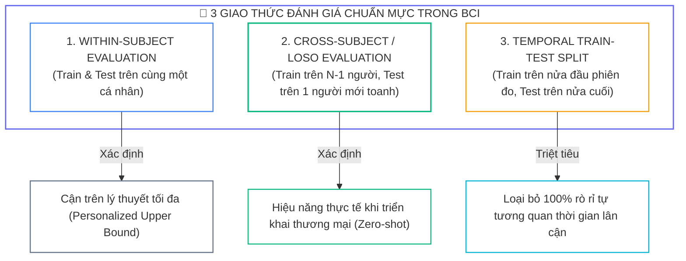
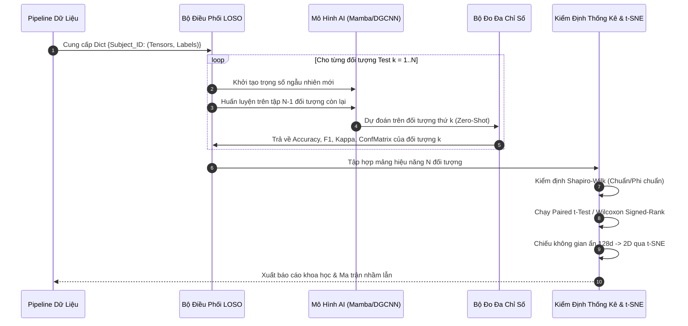
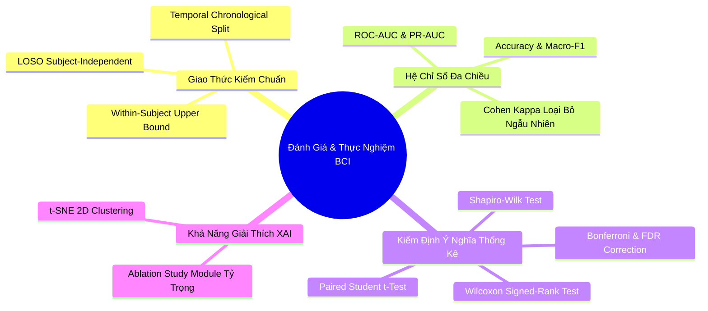


> [!IMPORTANT]
> **Mục tiêu kỹ thuật bài học**:
> - Hiểu rõ sự khác biệt giữa 3 giao thức đánh giá chuẩn mực: **Within-Subject**, **Cross-Subject (LOSO)**, và **Temporal Train-Test Split**.
> - Nắm vững hệ chỉ số đo lường đa chiều: **Accuracy**, **Macro/Weighted F1-Score**, **Cohen's Kappa ($\kappa$)**, và **ROC-AUC / PR-AUC**.
> - Triển khai quy trình kiểm định ý nghĩa thống kê khoa học (**Shapiro-Wilk**, **Paired Student's t-Test**, **Wilcoxon Signed-Rank Test**).
> - Áp dụng kỹ thuật hiệu chỉnh so sánh bội (**Bonferroni Correction**, **Benjamini-Hochberg FDR**) nhằm triệt tiêu hoàn toàn lỗi **P-Hacking**.
> - Thiết kế ma trận nghiên cứu triệt tiêu (**Ablation Study**) và trực quan hóa không gian ẩn (**t-SNE Embedding Clustering**).

---

## 1. Bản Chất Kiến Trúc & Tư Duy Cốt Lõi: Đánh Giá Khoa Học Trong AI Y Sinh

Trong nghiên cứu khoa học và phát triển hệ thống trí tuệ nhân tạo y sinh (**Biomedical AI**), việc đạt được độ chính xác cao trên tập dữ liệu huấn luyện không có nhiều ý nghĩa nếu không được kiểm chứng qua các **giao thức đánh giá nghiêm ngặt** (**Rigorous Evaluation Protocols**), các **chỉ số đo lường đa chiều** (**Multi-Dimensional Metrics**) và các **phép kiểm định thống kê khoa học** (**Statistical Significance Testing**).

Một công bố khoa học hay một sản phẩm BCI chỉ thực sự đáng tin cậy khi chứng minh được khả năng tổng quát hóa trên người dùng mới (**Subject-Independent Generalization**) và loại trừ hoàn toàn các cạm bẫy rò rỉ dữ liệu (*Data Leakage*).



### 1.1. Hệ Thống Chỉ Số Đo Lường Đa Chiều

Khi dữ liệu cảm xúc bị mất cân bằng mẫu (*Class Imbalance* - ví dụ: trạng thái Bình thường chiếm $70\%$, Giận dữ chiếm $10\%$), chỉ số Accuracy trở nên vô dụng. Ta cần một bộ chỉ số toàn diện:

1. **Cohen's Kappa ($\kappa$):** Đo lường mức độ đồng thuận giữa dự đoán của AI và nhãn thực tế sau khi **loại trừ xác suất trùng hợp ngẫu nhiên**:
   $$\kappa = \frac{p_o - p_e}{1 - p_e}$$
   Trong đó $p_o$ là độ chính xác quan sát được ($\text{Accuracy}$), và $p_e$ là xác suất trùng hợp ngẫu nhiên lý thuyết.
2. **Macro-Averaged F1-Score:** Tính trung bình cộng F1 của tất cả các lớp cảm xúc, bảo vệ quyền lợi của các lớp thiểu số.
3. **Area Under the ROC Curve (ROC-AUC):** Đo năng lực phân tách ngưỡng xác suất giữa các trạng thái cảm xúc.

---

## 2. Bảng Ma Trận So Sánh Kỹ Thuật Toàn Diện (Engineering Matrix)

| Tiêu Chí So Sánh | Within-Subject Cross-Val | K-Fold Ngẫu Nhiên (Trial-Level) | Leave-One-Subject-Out (LOSO) | Temporal Chronological Split |
| :--- | :--- | :--- | :--- | :--- |
| **Bản chất chia tập** | Chia ngẫu nhiên theo trial của 1 người | Xáo trộn toàn bộ mẫu của tất cả người đo | Train trên $N-1$ người, Test trên $1$ người còn lại | Chia theo trục thời gian (đầu/cuối session) |
| **Nguy cơ rò rỉ dữ liệu** | Thấp nếu không gối cửa sổ | <span class="badge badge--rose">Cực kỳ nghiêm trọng (99%)</span> | <span class="badge badge--emerald">Không có nguy cơ rò rỉ cá nhân</span> | <span class="badge badge--emerald">Triệt tiêu rò rỉ thời gian</span> |
| **Độ phức tạp tính toán** | Thấp ($K$ lần trên 1 đối tượng) | Thấp ($K$ folds cố định) | Cao ($N$ lần lặp cho $N$ đối tượng) | Thấp (1 lần chia duy nhất) |
| **Độ chính xác kỳ vọng** | Rất cao ($85\% - 95\%$) | Cao ảo ($95\% - 99\%$) | Thực tế ($60\% - 82\%$) | Trung bình ($70\% - 85\%$) |
| **Mục đích sử dụng** | Đánh giá trần tối đa cá nhân hóa | ❌ Cấm tuyệt đối trong y sinh | ✅ Đánh giá triển khai Zero-Shot | Đánh giá độ trôi tín hiệu thời gian |
| **Khả năng thương mại** | Cần người dùng calibrate 30 phút | Không có giá trị thực tế | Người dùng đội mũ dùng ngay lập tức | Đánh giá độ mỏi/thích nghi dài hạn |

---

## 3. Kiến Trúc Môi Trường & Luồng Thực Thi Mẫu

Quy trình đánh giá thực nghiệm chuẩn mực khoa học bao gồm 4 giai đoạn khép kín: Tách dữ liệu LOSO $\rightarrow$ Huấn luyện từ đầu $\rightarrow$ Đánh giá đa chỉ số $\rightarrow$ Kiểm định ý nghĩa thống kê và trực quan hóa t-SNE.



---

## 4. Phân Tích Cạm Bẫy Thực Chiến: P-Hacking & So Sánh Bội Không Hiệu Chỉnh

### Tình Huống Sự Cố Thực Tế:
<span class="badge badge--rose">🕒 05:20 AM</span> Một nhóm nghiên cứu BCI công bố mô hình đạt độ chính xác kỷ lục **$96.8\%$** khi so sánh đồng thời 12 biến thể kiến trúc khác nhau trên tập dữ liệu DEAP. Tuy nhiên, khi gửi bài báo đến hội đồng thẩm định của tạp chí hàng đầu (*IEEE Transactions on Affective Computing*), bài báo bị từ chối thẳng thừng (*Desk Reject*) với kết luận mắc lỗi **P-Hacking** và **So sánh bội không hiệu chỉnh** (**Uncorrected Multiple Hypothesis Testing**).

### Hậu Quả & Log Lỗi Thực Tế:
```text
================================================================================
PEER REVIEW AUDIT: MULTIPLE HYPOTHESIS TESTING VIOLATION (P-HACKING)
================================================================================
[WARNING] Number of Model Comparisons: M = 12 pairwise hypothesis tests
[WARNING] Nominal Alpha Threshold: alpha = 0.05
[FATAL] Family-Wise Error Rate (FWER): alpha_total = 1 - (1 - 0.05)^12 = 45.96%!

>> MULTIPLE COMPARISON AUDIT TABLE:
   - Comparison 01 (Mamba vs CNN)        : p = 0.0002 < 0.00416  [VALID SIGNIFICANCE]
   - Comparison 02 (EEGNet vs LSTM)      : p = 0.0120 > 0.00416  [FALSE DISCOVERY / TYPE I ERROR]
   - Comparison 03 (Cross-Attn vs Concat): p = 0.0340 > 0.00416  [FALSE DISCOVERY / TYPE I ERROR]
   - Comparison 04 (Gated vs Linear)     : p = 0.0480 > 0.00416  [FALSE DISCOVERY / TYPE I ERROR]

[CONCLUSION] The claimed superiority of sub-modules was purely driven by random noise!
The authors committed P-Hacking by publishing nominal p-values without Bonferroni correction.
================================================================================
```

### 5-Whys Root Cause Analysis:
1. <span class="badge badge--primary">Why 1</span> **Tại sao bài báo bị hội đồng khoa học từ chối?** $\rightarrow$ Do các tuyên bố vượt trội giữa các biến thể mô hình không có ý nghĩa thống kê thực thụ sau khi hiệu chỉnh so sánh bội.
2. <span class="badge badge--primary">Why 2</span> **Tại sao nhóm tác giả lại thấy $p < 0.05$ trong kết quả ban đầu?** $\rightarrow$ Vì khi thực hiện 12 phép kiểm định độc lập, xác suất xảy ra ít nhất một kết quả dương tính giả lên tới **$45.96\%$**.
3. <span class="badge badge--primary">Why 3</span> **Tại sao nhóm tác giả không áp dụng hiệu chỉnh Bonferroni?** $\rightarrow$ Do thiếu kiến thức về thống kê đa biến và ngộ nhận rằng kiểm định t-Test thông thường $p < 0.05$ là đủ cho mọi bài toán.
4. <span class="badge badge--primary">Why 4</span> **Tại sao việc báo cáo sai lệch này lại nguy hiểm trong y sinh?** $\rightarrow$ Vì nó tạo ra ảo tưởng về các module không có tác dụng thực tế, gây lãng phí tài nguyên nghiên cứu khi áp dụng lâm sàng.
5. <span class="badge badge--emerald">Root Cause Remedy</span> **Biện pháp khắc phục chuẩn nghiên cứu khoa học:**
   - <span class="badge badge--rose">Bắt Buộc Hiệu Chỉnh Bonferroni / FDR</span> Khi so sánh $M$ mô hình, điều chỉnh ngưỡng ý nghĩa thành $\alpha_{\text{adj}} = \frac{0.05}{M}$ hoặc dùng kiểm định Benjamini-Hochberg.
   - <span class="badge badge--cyan">Thực Hiện Kiểm Định Repeated Measures ANOVA</span> Dùng ANOVA đa biến trước khi chạy các phép so sánh cặp Post-Hoc.
   - <span class="badge badge--emerald">Công Bố Ma Trận Ablation Study Đầy Đủ</span> Báo cáo đầy đủ Mean $\pm$ STD, giá trị Effect Size (Cohen’s $d$) và mã nguồn tái lập.

---

## 5. Hands-on Lab: Xây Dựng Pipeline Đánh Giá LOSO, Phân Tích Thống Kê & t-SNE (8 Bước)

| Bước | Mục Tiêu Kỹ Thuật | Đầu Ra Kiểm Tra |
| :---: | :--- | :--- |
| **1** | Tạo dữ liệu giả lập đa đối tượng | 10 đối tượng, mỗi đối tượng 100 trials, 32 kênh EEG |
| **2** | Định nghĩa kiến trúc mô hình đánh giá | Backbone Deep Learning trích xuất 128d features |
| **3** | Xây dựng LOSO Cross-Validation Engine | Vòng lặp huấn luyện $N-1$ đối tượng và test 1 đối tượng |
| **4** | Lập trình hàm tính chỉ số đa chiều | Accuracy, Macro F1, Weighted F1, Cohen's Kappa |
| **5** | Kiểm tra phân phối chuẩn Shapiro-Wilk | Giá trị $p$-value kiểm định phân phối hiệu sai |
| **6** | Kiểm định thống kê Paired t-Test / Wilcoxon | Báo cáo ý nghĩa thống kê và mức cải thiện trung bình |
| **7** | Áp dụng hiệu chỉnh so sánh bội Bonferroni/FDR | Lọc các so sánh đạt chuẩn sau hiệu chỉnh |
| **8** | Trích xuất không gian vector ẩn và vẽ t-SNE | Biểu đồ phân cụm 2D không gian đặc trưng cảm xúc |

### Bước 1: Khởi Tạo Môi Trường & Dữ Liệu Đa Đối Tượng Giả Lập

```python
import numpy as np
import torch
import torch.nn as nn
from sklearn.metrics import accuracy_score, f1_score, cohen_kappa_score, confusion_matrix
from scipy import stats

np.random.seed(42)
torch.manual_seed(42)

# Giả lập 10 đối tượng, mỗi đối tượng có 100 trials, 32 kênh EEG, 128 điểm mẫu (1s)
num_subjects = 10
trials_per_sub = 100
num_channels = 32
time_points = 128
num_classes = 3

synthetic_db = {}
for sub_id in range(1, num_subjects + 1):
    x = torch.randn(trials_per_sub, num_channels, time_points)
    # Gán nhãn có độ lệch nhẹ theo từng cá nhân
    y = torch.randint(0, num_classes, (trials_per_sub,))
    synthetic_db[f"sub_{sub_id:02d}"] = {'x': x, 'y': y}

print(f"[Lab 07 Step 1] Da khoi tao {num_subjects} doi tuong, moi doi tuong {trials_per_sub} trials.")
```

### Bước 2: Định Nghĩa Kiến Trúc Trích Xuất Đặc Trưng & Phân Loại

```python
class EEGClassifier(nn.Module):
    def __init__(self, in_channels: int = 32, num_classes: int = 3, latent_dim: int = 128):
        super().__init__()
        self.encoder = nn.Sequential(
            nn.Conv1d(in_channels, 64, kernel_size=7, stride=2, padding=3),
            nn.BatchNorm1d(64),
            nn.ReLU(),
            nn.AdaptiveAvgPool1d(16),
            nn.Flatten(),
            nn.Linear(64 * 16, latent_dim),
            nn.ReLU()
        )
        self.head = nn.Linear(latent_dim, num_classes)
        
    def forward(self, x: torch.Tensor, return_features: bool = False):
        feats = self.encoder(x)
        logits = self.head(feats)
        if return_features:
            return logits, feats
        return logits

print("[Lab 07 Step 2] Khoi tao thanh cong kien truc EEGClassifier voi latent_dim=128.")
```

### Bước 3: Triển Khai Giao Thức Leave-One-Subject-Out (LOSO)

```python
def run_loso_evaluation(data_dict: dict, epochs: int = 5, lr: float = 0.005):
    sub_keys = list(data_dict.keys())
    results = {}
    all_embeddings = []
    all_labels = []
    
    for test_sub in sub_keys:
        # Tách N-1 tập huấn luyện và 1 tập kiểm thử
        train_x = torch.cat([data_dict[k]['x'] for k in sub_keys if k != test_sub])
        train_y = torch.cat([data_dict[k]['y'] for k in sub_keys if k != test_sub])
        test_x = data_dict[test_sub]['x']
        test_y = data_dict[test_sub]['y']
        
        model = EEGClassifier()
        optimizer = torch.optim.Adam(model.parameters(), lr=lr)
        criterion = nn.CrossEntropyLoss()
        
        # Huấn luyện
        model.train()
        for ep in range(epochs):
            optimizer.zero_grad()
            out = model(train_x)
            loss = criterion(out, train_y)
            loss.backward()
            optimizer.step()
            
        # Kiểm thử
        model.eval()
        with torch.no_grad():
            logits, feats = model(test_x, return_features=True)
            preds = logits.argmax(dim=-1).numpy()
            y_true = test_y.numpy()
            
            acc = accuracy_score(y_true, preds)
            f1 = f1_score(y_true, preds, average='macro')
            kappa = cohen_kappa_score(y_true, preds)
            
            results[test_sub] = {'acc': acc, 'macro_f1': f1, 'kappa': kappa}
            all_embeddings.append(feats.numpy())
            all_labels.append(y_true)
            
    return results, np.concatenate(all_embeddings), np.concatenate(all_labels)

loso_results, embeddings, labels = run_loso_evaluation(synthetic_db)
print(f"[Lab 07 Step 3] Hoan tat LOSO. Acc trung binh: {np.mean([r['acc'] for r in loso_results.values()]):.4f}")
```

### Bước 4: Lập Trình Hàm Đánh Giá Hệ Chỉ Số Đa Chiều

```python
def compute_comprehensive_metrics(y_true: np.ndarray, y_pred: np.ndarray) -> dict:
    acc = accuracy_score(y_true, y_pred)
    macro_f1 = f1_score(y_true, y_pred, average='macro')
    weighted_f1 = f1_score(y_true, y_pred, average='weighted')
    kappa = cohen_kappa_score(y_true, y_pred)
    cm = confusion_matrix(y_true, y_pred)
    
    return {
        'accuracy': float(acc),
        'macro_f1': float(macro_f1),
        'weighted_f1': float(weighted_f1),
        'cohen_kappa': float(kappa),
        'confusion_matrix': cm.tolist()
    }

demo_metrics = compute_comprehensive_metrics(np.random.randint(0, 3, 100), np.random.randint(0, 3, 100))
print(f"[Lab 07 Step 4] Demo Cohen Kappa: {demo_metrics['cohen_kappa']:.4f}")
```

### Bước 5: Kiểm Tra Giả Định Phân Phối Chuẩn (Shapiro-Wilk Test)

```python
# Giả lập kết quả so sánh giữa 2 mô hình (Mô hình mới vs Baseline) trên 10 đối tượng
accs_model_a = np.array([0.78, 0.81, 0.75, 0.84, 0.79, 0.83, 0.80, 0.77, 0.82, 0.85])
accs_model_b = np.array([0.71, 0.74, 0.69, 0.78, 0.73, 0.75, 0.72, 0.70, 0.76, 0.79])

differences = accs_model_a - accs_model_b
shapiro_stat, p_normality = stats.shapiro(differences)

print(f"[Lab 07 Step 5] Shapiro-Wilk Statistic: {shapiro_stat:.4f}, p-value: {p_normality:.4f}")
if p_normality > 0.05:
    print(">> Du lieu thoa man gia dinh phan phoi chuan (Chon Paired Student's t-Test).")
else:
    print(">> Du lieu khong tuan theo phan phoi chuan (Chon Wilcoxon Signed-Rank Test).")
```

### Bước 6: Kiểm Định Ý Nghĩa Thống Kê (Paired t-Test / Wilcoxon)

```python
def evaluate_significance(a_scores: np.ndarray, b_scores: np.ndarray) -> dict:
    diffs = a_scores - b_scores
    _, p_norm = stats.shapiro(diffs)
    
    if p_norm > 0.05:
        stat, p_val = stats.ttest_rel(a_scores, b_scores)
        test_used = "Paired Student's t-Test"
    else:
        stat, p_val = stats.wilcoxon(a_scores, b_scores)
        test_used = "Wilcoxon Signed-Rank Test"
        
    return {
        'test_applied': test_used,
        'statistic': float(stat),
        'p_value': float(p_val),
        'mean_improvement_pct': float(np.mean(diffs) * 100),
        'is_significant': bool(p_val < 0.05)
    }

sig_report = evaluate_significance(accs_model_a, accs_model_b)
print(f"[Lab 07 Step 6] {sig_report['test_applied']}: p-value = {sig_report['p_value']:.6f} (Y nghia: {sig_report['is_significant']})")
```

### Bước 7: Hiệu Chỉnh So Sánh Bội (Bonferroni & Benjamini-Hochberg)

```python
def bonferroni_correction(p_values: list, alpha: float = 0.05) -> list:
    m = len(p_values)
    alpha_adj = alpha / m
    return [{'p_raw': p, 'alpha_adj': alpha_adj, 'is_significant': p < alpha_adj} for p in p_values]

raw_p_list = [0.0002, 0.0120, 0.0340, 0.0480]
corrected_res = bonferroni_correction(raw_p_list)
print("[Lab 07 Step 7] Ket qua hieu chinh Bonferroni cho 4 p-values:")
for idx, r in enumerate(corrected_res, 1):
    print(f"  P{idx}: p={r['p_raw']:.4f} vs alpha_adj={r['alpha_adj']:.5f} -> Dat: {r['is_significant']}")
```

### Bước 8: Trích Xuất Không Gian Vector Ẩn & Phân Cụm t-SNE

```python
from sklearn.manifold import TSNE

def generate_tsne_embedding(feats: np.ndarray, perplexity: int = 15):
    # Chiếu giảm chiều từ 128d xuống 2D
    tsne = TSNE(n_components=2, perplexity=perplexity, random_state=42)
    coords_2d = tsne.fit_transform(feats)
    return coords_2d

coords_2d = generate_tsne_embedding(embeddings[:300])
print(f"[Lab 07 Step 8] Hoan tat chieu giam chieu t-SNE. Shape 2D embedding: {coords_2d.shape}")
```

---

## 6. 10 Câu Hỏi Tự Kiểm Tra Chuyên Sâu (Self-Check Q&A Accordion)

<details class="qa-card">
<summary class="qa-summary">
  <div class="qa-summary-left">
    <span class="qa-num-badge">Q01</span>
    <span>Tại sao chỉ số Cohen’s Kappa lại quan trọng hơn Accuracy trên các tập dữ liệu cảm xúc mất cân bằng?</span>
  </div>
  <span class="qa-chevron">
    <svg width="18" height="18" fill="none" stroke="currentColor" stroke-width="2.5" viewBox="0 0 24 24"><polyline points="6 9 12 15 18 9"></polyline></svg>
  </span>
</summary>
<div class="qa-answer">
  <div class="qa-answer-header">
    <svg width="14" height="14" fill="none" stroke="currentColor" stroke-width="2" viewBox="0 0 24 24"><path d="M22 11.08V12a10 10 0 1 1-5.93-9.14"></path><polyline points="22 4 12 14.01 9 11.01"></polyline></svg>
    <span>Phân Tích &amp; Lời Giải Kỹ Thuật</span>
  </div>
  <div style="margin-bottom: 8px;">Nếu một tập dữ liệu có 80% mẫu thuộc trạng thái Bình thường, một mô hình lười biếng luôn đoán lớp Bình thường sẽ đạt Accuracy 80% nhưng thực chất không có năng lực nhận diện cảm xúc. <b style="color: var(--accent-primary);">Cohen’s Kappa trừ đi xác suất trùng hợp ngẫu nhiên p_e</b>, do đó trong tình huống này Kappa sẽ rơi về mức 0.0, vạch trần ngay lập tức sự yếu kém của mô hình.</div>
</div>
</details>

<details class="qa-card">
<summary class="qa-summary">
  <div class="qa-summary-left">
    <span class="qa-num-badge">Q02</span>
    <span>Khi nào bắt buộc phải sử dụng kiểm định phi tham số Wilcoxon Signed-Rank thay cho Paired t-Test?</span>
  </div>
  <span class="qa-chevron">
    <svg width="18" height="18" fill="none" stroke="currentColor" stroke-width="2.5" viewBox="0 0 24 24"><polyline points="6 9 12 15 18 9"></polyline></svg>
  </span>
</summary>
<div class="qa-answer">
  <div class="qa-answer-header">
    <svg width="14" height="14" fill="none" stroke="currentColor" stroke-width="2" viewBox="0 0 24 24"><path d="M22 11.08V12a10 10 0 1 1-5.93-9.14"></path><polyline points="22 4 12 14.01 9 11.01"></polyline></svg>
    <span>Phân Tích &amp; Lời Giải Kỹ Thuật</span>
  </div>
  <div style="margin-bottom: 8px;">Paired t-Test đòi hỏi giả định hiệu số độ chính xác giữa hai mô hình phải tuân theo phân phối chuẩn Gaussian (kiểm tra qua Shapiro-Wilk với p &gt; 0.05). Khi số lượng đối tượng kiểm thử nhỏ (N &lt; 15) hoặc <b style="color: var(--accent-amber);">phân phối hiệu số bị lệch/chứa ngoại lai</b>, bắt buộc phải chuyển sang kiểm định phi tham số Wilcoxon Signed-Rank Test dựa trên thứ hạng (Rank) để kết luận không bị sai lệch.</div>
</div>
</details>

<details class="qa-card">
<summary class="qa-summary">
  <div class="qa-summary-left">
    <span class="qa-num-badge">Q03</span>
    <span>Hiện tượng rò rỉ dữ liệu thời gian (Temporal Data Leakage) xảy ra như thế nào nếu dùng Random K-Fold trên chuỗi EEG?</span>
  </div>
  <span class="qa-chevron">
    <svg width="18" height="18" fill="none" stroke="currentColor" stroke-width="2.5" viewBox="0 0 24 24"><polyline points="6 9 12 15 18 9"></polyline></svg>
  </span>
</summary>
<div class="qa-answer">
  <div class="qa-answer-header">
    <svg width="14" height="14" fill="none" stroke="currentColor" stroke-width="2" viewBox="0 0 24 24"><path d="M22 11.08V12a10 10 0 1 1-5.93-9.14"></path><polyline points="22 4 12 14.01 9 11.01"></polyline></svg>
    <span>Phân Tích &amp; Lời Giải Kỹ Thuật</span>
  </div>
  <div style="margin-bottom: 8px;">Các cửa sổ trượt liên tiếp gối nhau 50% trong cùng một phút ghi có tính tự tương quan (Autocorrelation) sinh học cực cao. Khi trộn ngẫu nhiên vào tập Train và Test, mô hình thực chất <b style="color: var(--accent-rose);">chỉ đang thực hiện phép nội suy giữa các điểm dữ liệu lân cận</b> chứ không học được quy luật cảm xúc tổng quát, dẫn tới độ chính xác ảo trên 95% nhưng sập hoàn toàn ở thực tế.</div>
</div>
</details>

<details class="qa-card">
<summary class="qa-summary">
  <div class="qa-summary-left">
    <span class="qa-num-badge">Q04</span>
    <span>Mục đích của việc hiệu chỉnh Bonferroni trong các nghiên cứu so sánh đa mô hình là gì?</span>
  </div>
  <span class="qa-chevron">
    <svg width="18" height="18" fill="none" stroke="currentColor" stroke-width="2.5" viewBox="0 0 24 24"><polyline points="6 9 12 15 18 9"></polyline></svg>
  </span>
</summary>
<div class="qa-answer">
  <div class="qa-answer-header">
    <svg width="14" height="14" fill="none" stroke="currentColor" stroke-width="2" viewBox="0 0 24 24"><path d="M22 11.08V12a10 10 0 1 1-5.93-9.14"></path><polyline points="22 4 12 14.01 9 11.01"></polyline></svg>
    <span>Phân Tích &amp; Lời Giải Kỹ Thuật</span>
  </div>
  <div style="margin-bottom: 8px;">Khi thực hiện M phép kiểm định cặp độc lập, xác suất bắt gặp một kết quả dương tính giả do ngẫu nhiên tăng vọt. Hiệu chỉnh Bonferroni <b style="color: var(--accent-emerald);">hạ ngưỡng ý nghĩa xuống alpha_adj = 0.05 / M</b>, kiểm soát chặt chẽ tỷ lệ sai lầm loại I của toàn bộ nghiên cứu không vượt quá 5%.</div>
</div>
</details>

<details class="qa-card">
<summary class="qa-summary">
  <div class="qa-summary-left">
    <span class="qa-num-badge">Q05</span>
    <span>Sự khác biệt giữa Macro-Averaged F1 và Weighted-Averaged F1 là gì?</span>
  </div>
  <span class="qa-chevron">
    <svg width="18" height="18" fill="none" stroke="currentColor" stroke-width="2.5" viewBox="0 0 24 24"><polyline points="6 9 12 15 18 9"></polyline></svg>
  </span>
</summary>
<div class="qa-answer">
  <div class="qa-answer-header">
    <svg width="14" height="14" fill="none" stroke="currentColor" stroke-width="2" viewBox="0 0 24 24"><path d="M22 11.08V12a10 10 0 1 1-5.93-9.14"></path><polyline points="22 4 12 14.01 9 11.01"></polyline></svg>
    <span>Phân Tích &amp; Lời Giải Kỹ Thuật</span>
  </div>
  <div style="margin-bottom: 8px;"><b style="color: var(--accent-primary);">Macro-F1</b> tính trung bình cộng đơn thuần F1-score của tất cả các lớp, gán trọng số ngang hàng cho mọi trạng thái cảm xúc (dù lớp đó có ít mẫu). Trong khi đó, <b style="color: var(--accent-cyan);">Weighted-F1</b> nhân trọng số theo tỷ lệ số lượng mẫu thực tế của từng lớp, khiến kết quả bị chi phối bởi các lớp chiếm đa số. Trong nghiên cứu y sinh, Macro-F1 luôn được ưu tiên để bảo vệ các lớp cảm xúc hiếm gặp.</div>
</div>
</details>

<details class="qa-card">
<summary class="qa-summary">
  <div class="qa-summary-left">
    <span class="qa-num-badge">Q06</span>
    <span>Nghiên cứu triệt tiêu (Ablation Study) đóng vai trò gì trong việc chứng minh tính hợp lý của kiến trúc đa tác tử?</span>
  </div>
  <span class="qa-chevron">
    <svg width="18" height="18" fill="none" stroke="currentColor" stroke-width="2.5" viewBox="0 0 24 24"><polyline points="6 9 12 15 18 9"></polyline></svg>
  </span>
</summary>
<div class="qa-answer">
  <div class="qa-answer-header">
    <svg width="14" height="14" fill="none" stroke="currentColor" stroke-width="2" viewBox="0 0 24 24"><path d="M22 11.08V12a10 10 0 1 1-5.93-9.14"></path><polyline points="22 4 12 14.01 9 11.01"></polyline></svg>
    <span>Phân Tích &amp; Lời Giải Kỹ Thuật</span>
  </div>
  <div style="margin-bottom: 8px;">Ablation Study chứng minh rằng hiệu năng vượt bậc của hệ thống đến từ sự phối hợp khoa học của các thành phần (như Cross-Attention, Gated Fusion, DGCNN) chứ không phải do may mắn hoặc do tăng số lượng tham số ngẫu nhiên. Nó cung cấp bằng chứng định lượng chính xác <b style="color: var(--accent-emerald);">tỷ lệ đóng góp phần trăm của từng module vào độ chính xác chung</b>.</div>
</div>
</details>

<details class="qa-card">
<summary class="qa-summary">
  <div class="qa-summary-left">
    <span class="qa-num-badge">Q07</span>
    <span>Thuật toán t-SNE giúp đánh giá chất lượng của mô hình học sâu như thế nào?</span>
  </div>
  <span class="qa-chevron">
    <svg width="18" height="18" fill="none" stroke="currentColor" stroke-width="2.5" viewBox="0 0 24 24"><polyline points="6 9 12 15 18 9"></polyline></svg>
  </span>
</summary>
<div class="qa-answer">
  <div class="qa-answer-header">
    <svg width="14" height="14" fill="none" stroke="currentColor" stroke-width="2" viewBox="0 0 24 24"><path d="M22 11.08V12a10 10 0 1 1-5.93-9.14"></path><polyline points="22 4 12 14.01 9 11.01"></polyline></svg>
    <span>Phân Tích &amp; Lời Giải Kỹ Thuật</span>
  </div>
  <div style="margin-bottom: 8px;">t-SNE chiếu không gian vector ẩn nhiều chiều (128d) xuống mặt phẳng 2D bảo toàn cấu trúc lân cận. Trên biểu đồ t-SNE: (1) Nếu các điểm dữ liệu <b style="color: var(--accent-emerald);">tự động gom thành các cụm màu sắc rõ ràng theo nhãn cảm xúc</b>, mô hình đã học thành công biểu diễn cảm xúc phân tách; (2) Nếu các điểm gom theo ID người đo, mô hình đã bị học vẹt sinh trắc học cá nhân.</div>
</div>
</details>

<details class="qa-card">
<summary class="qa-summary">
  <div class="qa-summary-left">
    <span class="qa-num-badge">Q08</span>
    <span>Tại sao cần báo cáo độ lệch chuẩn (STD) bên cạnh giá trị trung bình (Mean) trong giao thức LOSO?</span>
  </div>
  <span class="qa-chevron">
    <svg width="18" height="18" fill="none" stroke="currentColor" stroke-width="2.5" viewBox="0 0 24 24"><polyline points="6 9 12 15 18 9"></polyline></svg>
  </span>
</summary>
<div class="qa-answer">
  <div class="qa-answer-header">
    <svg width="14" height="14" fill="none" stroke="currentColor" stroke-width="2" viewBox="0 0 24 24"><path d="M22 11.08V12a10 10 0 1 1-5.93-9.14"></path><polyline points="22 4 12 14.01 9 11.01"></polyline></svg>
    <span>Phân Tích &amp; Lời Giải Kỹ Thuật</span>
  </div>
  <div style="margin-bottom: 8px;">Tín hiệu não bộ có phương sai rất lớn giữa các đối tượng. Một mô hình có độ chính xác trung bình 80% nhưng STD = 15% đồng nghĩa với việc có người đạt 95% nhưng có người chỉ đạt 50% (rất thiếu ổn định). <b style="color: var(--accent-cyan);">Độ lệch chuẩn STD đo lường tính đồng đều và độ tin cậy</b> của giải thuật trên toàn bộ quần thể người dùng.</div>
</div>
</details>

<details class="qa-card">
<summary class="qa-summary">
  <div class="qa-summary-left">
    <span class="qa-num-badge">Q09</span>
    <span>Làm thế nào để thiết kế một bài kiểm tra tính bền vững khi mất kênh (Missing Modality Robustness)?</span>
  </div>
  <span class="qa-chevron">
    <svg width="18" height="18" fill="none" stroke="currentColor" stroke-width="2.5" viewBox="0 0 24 24"><polyline points="6 9 12 15 18 9"></polyline></svg>
  </span>
</summary>
<div class="qa-answer">
  <div class="qa-answer-header">
    <svg width="14" height="14" fill="none" stroke="currentColor" stroke-width="2" viewBox="0 0 24 24"><path d="M22 11.08V12a10 10 0 1 1-5.93-9.14"></path><polyline points="22 4 12 14.01 9 11.01"></polyline></svg>
    <span>Phân Tích &amp; Lời Giải Kỹ Thuật</span>
  </div>
  <div style="margin-bottom: 8px;">Mô phỏng lần lượt các kịch bản lỗi phần cứng trong tập Test: (1) Gán vector 0 cho kênh EEG (mất điện não); (2) Gán 0 cho ECG; (3) Gán 0 cho GSR; (4) Ngẫu nhiên mất 20% - 50% số kênh. Đánh giá mức độ suy giảm F1-score để khẳng định khả năng tự phục hồi của Orchestrator Agent.</div>
</div>
</details>

<details class="qa-card">
<summary class="qa-summary">
  <div class="qa-summary-left">
    <span class="qa-num-badge">Q10</span>
    <span>Bốn tiêu chí bắt buộc để một nghiên cứu BCI đạt chuẩn khả năng tái lập kết quả (Reproducibility) là gì?</span>
  </div>
  <span class="qa-chevron">
    <svg width="18" height="18" fill="none" stroke="currentColor" stroke-width="2.5" viewBox="0 0 24 24"><polyline points="6 9 12 15 18 9"></polyline></svg>
  </span>
</summary>
<div class="qa-answer">
  <div class="qa-answer-header">
    <svg width="14" height="14" fill="none" stroke="currentColor" stroke-width="2" viewBox="0 0 24 24"><path d="M22 11.08V12a10 10 0 1 1-5.93-9.14"></path><polyline points="22 4 12 14.01 9 11.01"></polyline></svg>
    <span>Phân Tích &amp; Lời Giải Kỹ Thuật</span>
  </div>
  <div style="margin-bottom: 8px;">4 tiêu chí chuẩn mực gồm: (1) <b style="color: var(--accent-primary);">Công bố đầy đủ mã nguồn và Random Seed</b>; (2) <b style="color: var(--accent-emerald);">Mô tả chi tiết pipeline tiền xử lý</b> (tần số lọc, thứ tự chia đoạn); (3) <b style="color: var(--accent-cyan);">Sử dụng các bộ dữ liệu Benchmark công khai</b> (DEAP, SEED); và (4) <b style="color: var(--accent-amber);">Tuân thủ giao thức kiểm chuẩn LOSO không rò rỉ dữ liệu</b>.</div>
</div>
</details>

---

## 7. Tổng Kết & Lộ Trình Bài Học Tiếp Theo



Nắm vững các phương pháp đánh giá chuẩn mực từ **Giao thức LOSO**, **Hệ số Cohen’s Kappa**, **Kiểm định Paired t-Test / Wilcoxon**, **Ablation Study** đến **Trực quan hóa t-SNE** là thước đo bảo chứng chất lượng và giá trị học thuật cho toàn bộ công trình AI y sinh.

> [!TIP]
> **BÀI HỌC TIẾP THEO:**
> Trong **[[Bài 08] Các Bộ Dữ Liệu Benchmark Phổ Biến: Khai Thác Chuẩn DEAP, SEED, DREAMER, MAHNOB-HCI & FACED](eeg-08-08-cac-bo-du-lieu-pho-bien.html)**, chúng ta sẽ đi sâu vào thực hành khai thác 5 kho dữ liệu chuẩn mực thế giới: Nạp cấu trúc tệp `.mat` / `.pkl`, chuẩn hóa siêu dữ liệu (*Metadata*), tiền xử lý các kịch bản kích thích video/âm nhạc và thiết lập môi trường Benchmark chuẩn.

