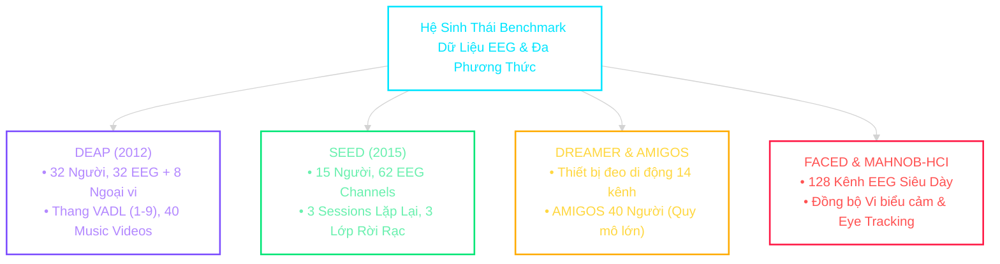
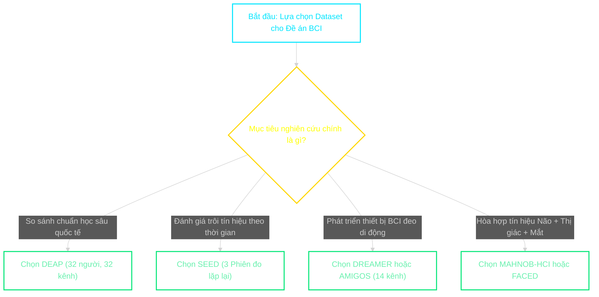


## 8.0. Mục Tiêu Học Tập & Chuẩn Đầu Ra

Trong kỷ nguyên khoa học dữ liệu và học sâu y sinh, tính tái lập (*Reproducibility*) và khả năng so sánh định lượng công bằng giữa các thuật toán phụ thuộc hoàn toàn vào các **bộ dữ liệu chuẩn mực (Standard Benchmarks)**. Việc thu thập tín hiệu điện não đồ (EEG) đạt chuẩn y tế lâm sàng đòi hỏi hệ thống điện cực đắt đỏ (như BioSemi ActiveTwo, ESI NeuroScan), môi trường phòng cách ly điện từ Faraday và quy trình đạo đức sinh học nghiêm ngặt.

<span class="badge badge--primary">Mục tiêu 1</span> **Phân tích toàn diện thông số kỹ thuật:** Nắm vững cấu trúc phần cứng, giao thức kích thích (*Stimulus Induction Protocol*), số kênh điện cực và dải tần lấy mẫu của các tập dữ liệu cốt lõi: **DEAP, SEED, DREAMER, AMIGOS, FACED, MAHNOB-HCI**.

<span class="badge badge--success">Mục tiêu 2</span> **Làm chủ không gian nhãn cảm xúc:** Phân biệt và chuẩn hóa giữa mô hình cảm xúc liên tục đa chiều (*Valence-Arousal-Dominance*) và mô hình cảm xúc rời rạc (*Discrete Emotion States: Positive / Neutral / Negative / 6 Basic Emotions*).

<span class="badge badge--warning">Mục tiêu 3</span> **Xây dựng Unified Multimodal DataLoader:** Lập trình kiến trúc nạp dữ liệu thống nhất xử lý đa định dạng tệp tin (`.dat`, `.mat`, `.bdf`, `.h5`), tự động loại bỏ baseline thời gian thực và đồng bộ tần số lấy mẫu (*Resampling*).

<span class="badge badge--danger">Mục tiêu 4</span> **Giải quyết bài toán bất tương thích kênh (Channel Incompatibility):** Áp dụng kỹ thuật ánh xạ không gian và nội suy màng cầu (*Spherical Spline Interpolation*) để chuyển đổi biểu diễn giữa các hệ thống điện cực $14$, $32$, $62$, $128$ kênh trong bài toán thích ứng miền chéo tập dữ liệu (*Cross-Dataset Transfer Learning*).

---

## 8.1. Tổng Quan Về Các Bộ Dữ Liệu Benchmark Quốc Tế



---

## 8.2. Chi Tiết Kiến Trúc Từng Bộ Dữ Liệu Cốt Lõi

### 8.2.1. DEAP (Database for Emotion Analysis using Physiological Signals)

Được công bố năm 2012 bởi nhóm nghiên cứu quốc tế thuộc Queen Mary University of London, Đại học Geneva và USI Thụy Sĩ, **DEAP** là "thước đo chuẩn vàng" lâu đời nhất trong lĩnh vực nhận dạng cảm xúc sinh lý.

```text
============================ CẤU TRÚC DỮ LIỆU FILE DEAP (.DAT) ============================
Subject File: s01.dat -> s32.dat (Python Dictionary lưu dạng latin1 pickle)
+-----------------------------------------------------------------------------------------+
| ['data']   : Tensor Shape (40 trials, 40 channels, 8064 samples)                       |
|              - 40 Trials : 40 video âm nhạc (mỗi video 60s + 3s baseline)               |
|              - 40 Channels: Kênh 0-31 là EEG chuẩn 10-20; Kênh 32-39 là Tín hiệu Ngoại vi|
|                (32-33: hEOG/vEOG, 34-35: EMG Zygomaticus/Trapezius, 36: GSR,            |
|                 37: Respiration, 38: Plethysmograph Nhiệt độ, 39: Blood Volume)         |
|              - 8064 Samples: 63 giây x 128 Hz lấy mẫu                                   |
| ['labels'] : Ma trận Shape (40 trials, 4 metrics)                                       |
|              - Cột 0: Valence (1.0 - 9.0)                                               |
|              - Cột 1: Arousal (1.0 - 9.0)                                               |
|              - Cột 2: Dominance (1.0 - 9.0)                                             |
|              - Cột 3: Liking (1.0 - 9.0)                                                |
+-----------------------------------------------------------------------------------------+
```

```python
import pickle
import numpy as np
import torch
from torch.utils.data import Dataset

class DEAPSubjectLoader:
    def __init__(self, data_path: str):
        self.data_path = data_path
        
    def load_trial_data(self, subject_id: int):
        """
        Nạp dữ liệu thô và phân tách baseline cho 1 đối tượng DEAP (s01 - s32)
        """
        file_path = f"{self.data_path}/s{subject_id:02d}.dat"
        with open(file_path, 'rb') as f:
            subject_dict = pickle.load(f, encoding='latin1')
            
        raw_data = subject_dict['data']    # (40, 40, 8064)
        raw_labels = subject_dict['labels']# (40, 4)
        
        # Tách riêng 3s baseline đầu (3 * 128 = 384 samples) và 60s kích thích (7680 samples)
        baseline = raw_data[:, :32, :384]   # (40 trials, 32 EEG channels, 384)
        eeg_stimulus = raw_data[:, :32, 384:] # (40 trials, 32 EEG channels, 7680)
        physio_aux = raw_data[:, 32:, 384:]   # (40 trials, 8 Peripheral channels, 7680)
        
        return {
            'baseline_eeg': baseline,
            'eeg': eeg_stimulus,
            'peripheral': physio_aux,
            'labels': raw_labels
        }
```

---

### 8.2.2. SEED (SJTU Emotion EEG Dataset)

Được phát triển bởi Phòng thí nghiệm Trí tuệ tính toán và Não bộ (BCMI Lab) thuộc Đại học Giao thông Thượng Hải (**SJTU**), SEED là tập dữ liệu tiêu chuẩn cho các bài toán phân loại trạng thái cảm xúc rời rạc và kiểm chuẩn tính ổn định theo thời gian.

- **Thiết kế thực nghiệm đa phiên (Multi-Session Stability):** Mỗi đối tượng trong số 15 người tham gia thí nghiệm lặp lại qua **$3\text{ phiên đo riêng biệt (Sessions)}$** với khoảng cách giữa các phiên từ $1$ đến $2$ tuần. Đây là tập dữ liệu duy nhất cho phép kiểm chứng trực tiếp tính thoái hóa phân phối tín hiệu theo thời gian (*Longitudinal Domain Shift*).
- **Mật độ cảm biến cao:** Hệ thống ESI NeuroScan $62\text{ kênh EEG}$ chuyên dụng, phân giải không gian vượt trội so với DEAP.
- **Kích thích cảm xúc bằng điện ảnh:** $15\text{ trích đoạn phim}$ độ dài $\sim 4\text{ phút/đoạn}$, mang lại trạng thái cảm xúc tự nhiên, mãnh liệt và duy trì bền bỉ hơn so với clip ca nhạc ngắn.

```python
import scipy.io as sio
import numpy as np

class SEEDSessionLoader:
    def __init__(self, seed_mat_dir: str):
        self.seed_mat_dir = seed_mat_dir
        # Nhãn cố định của 15 video: 1: Positive, 0: Neutral, -1: Negative
        self.ground_truth_labels = np.array([1, 0, -1, -1, 0, 1, -1, 0, 1, 1, 0, -1, 0, 1, -1])
        
    def load_session(self, subject_name: str, session_id: int):
        """
        Nạp tệp tin MATLAB .mat từ SEED Dataset cho 1 subject tại 1 session cụ thể
        """
        mat_file = f"{self.seed_mat_dir}/{session_id}/{subject_name}.mat"
        mat_data = sio.loadmat(mat_file)
        
        session_trials = []
        for trial_idx in range(1, 16):
            # Tên biến trong file .mat có dạng: <tên_subject>_eeg<trial_idx>
            channel_key = f"{subject_name.lower()}_eeg{trial_idx}"
            if channel_key in mat_data:
                # Shape: (62 channels, Time Samples @ 200Hz)
                session_trials.append(mat_data[channel_key])
                
        return session_trials, self.ground_truth_labels
```

---

### 8.2.3. DREAMER, AMIGOS, FACED & MAHNOB-HCI

1. **DREAMER (2018):**
   - Sử dụng phần cứng thương mại giá rẻ **Emotiv EPOC** không dây với $14\text{ điện cực khô/ẩm}$ ($128\text{ Hz}$) kèm cảm biến ECG.
   - Thử nghiệm trên $23\text{ người}$ với $18\text{ đoạn trích phim}$ từ $65$ đến $393\text{ giây}$.
   - Cung cấp dữ liệu chuẩn thực tế cho các ứng dụng BCI tiêu dùng và thiết bị đeo (*Wearable Emotion AI*).
2. **AMIGOS (2018):**
   - Đạt quy mô đối tượng lớn nhất ($40\text{ người}$), tích hợp $14\text{ kênh EEG}$, $2\text{ kênh ECG}$, $1\text{ kênh GSR}$ và nhịp thở.
   - Phục vụ kiểm tra mức độ đa dạng xã hội và tổng quát hóa chéo đối tượng (*Cross-Subject Generalization*).
3. **FACED (2020) & MAHNOB-HCI (2012):**
   - **FACED:** Hệ thống $128\text{ kênh EEG}$ siêu dày, ghi nhận $6\text{ cảm xúc cơ bản của Ekman}$ và video biểu cảm khuôn mặt.
   - **MAHNOB-HCI:** Hòa hợp đa phương thức hoàn chỉnh: $32\text{ kênh EEG}$, video khuôn mặt độ phân giải cao ghi nhận Action Units, máy bám bắt ánh nhìn (*Eye Tracking*) và điện tim.

---

## 8.3. Bảng Ma Trận So Sánh Toàn Diện Các Bộ Dữ Liệu

<div class="table-responsive">
<table class="table">
<thead>
<tr>
<th style="text-align:center;">Bộ Dữ Liệu</th>
<th style="text-align:center;">Số Đối Tượng</th>
<th style="text-align:center;">Kênh EEG</th>
<th style="text-align:center;">Tín Hiệu Ngoại Vi</th>
<th style="text-align:center;">Phiên Đo</th>
<th style="text-align:center;">Mô Hình Cảm Xúc</th>
<th style="text-align:center;">Tần Số Fs</th>
<th style="text-align:center;">Ứng Dụng Tối Ưu</th>
</tr>
</thead>
<tbody>
<tr>
<td style="text-align:center;"><span class="badge badge--primary">DEAP</span></td>
<td style="text-align:center;">32</td>
<td style="text-align:center;">32</td>
<td style="text-align:center;">ECG, GSR, EMG, Resp, Temp</td>
<td style="text-align:center;">1 (40 trials)</td>
<td style="text-align:center;">V-A-D-L (1-9)</td>
<td style="text-align:center;">128 Hz</td>
<td style="text-align:center;">Benchmark thuật toán chung</td>
</tr>
<tr>
<td style="text-align:center;"><span class="badge badge--success">SEED</span></td>
<td style="text-align:center;">15</td>
<td style="text-align:center;">62</td>
<td style="text-align:center;">Không</td>
<td style="text-align:center;">3 (Cách tuần)</td>
<td style="text-align:center;">3 Lớp (Pos/Neu/Neg)</td>
<td style="text-align:center;">200 Hz</td>
<td style="text-align:center;">Độ ổn định thời gian & GNN</td>
</tr>
<tr>
<td style="text-align:center;"><span class="badge badge--warning">DREAMER</span></td>
<td style="text-align:center;">23</td>
<td style="text-align:center;">14 (Emotiv)</td>
<td style="text-align:center;">ECG</td>
<td style="text-align:center;">1 (18 trials)</td>
<td style="text-align:center;">V-A-D (1-5)</td>
<td style="text-align:center;">128 Hz</td>
<td style="text-align:center;">Thiết bị đeo Edge BCI</td>
</tr>
<tr>
<td style="text-align:center;"><span class="badge badge--info">AMIGOS</span></td>
<td style="text-align:center;">40</td>
<td style="text-align:center;">14</td>
<td style="text-align:center;">ECG, GSR, Respiration</td>
<td style="text-align:center;">1 (16 trials)</td>
<td style="text-align:center;">V-A (1-9)</td>
<td style="text-align:center;">128 Hz</td>
<td style="text-align:center;">Cross-Subject quy mô lớn</td>
</tr>
<tr>
<td style="text-align:center;"><span class="badge badge--danger">FACED</span></td>
<td style="text-align:center;">10</td>
<td style="text-align:center;">128</td>
<td style="text-align:center;">Video biểu cảm</td>
<td style="text-align:center;">1 (40 trials)</td>
<td style="text-align:center;">6 Lớp Ekman</td>
<td style="text-align:center;">250 Hz</td>
<td style="text-align:center;">Định vị nguồn não mật độ cao</td>
</tr>
<tr>
<td style="text-align:center;"><span class="badge badge--secondary">MAHNOB</span></td>
<td style="text-align:center;">27</td>
<td style="text-align:center;">32</td>
<td style="text-align:center;">Video, Eye Tracking, ECG</td>
<td style="text-align:center;">1 (20 trials)</td>
<td style="text-align:center;">V-A-D (1-9)</td>
<td style="text-align:center;">256 Hz</td>
<td style="text-align:center;">Hòa hợp Đa phương thức Não + Mắt</td>
</tr>
</tbody>
</table>
</div>

---

## 8.4. Cây Quyết Định Chọn Tập Dữ Liệu Nghiên Cứu



---

## 8.5. Giải Quyết Bất Tương Thích Kênh (Cross-Dataset Channel Mapping)

Khi thực hiện **Cross-Dataset Transfer Learning** (ví dụ: Huấn luyện trên SEED 62 kênh và suy luận trên DREAMER 14 kênh), mô hình gặp lỗi không khớp chiều đầu vào. Hai chiến lược kỹ thuật cốt lõi:

1. **Trích xuất kênh giao thoa (Common Channel Intersect):** Chỉ giữ lại tập hợp các điện cực có mặt trên cả hai thiết bị theo quy chuẩn quốc tế 10-20 (như: $F_3, F_4, C_3, C_4, P_3, P_4, O_1, O_2, F_z, C_z, P_z$).
2. **Nội suy không gian màng cầu (Spherical Spline Interpolation):** Tái tạo lại điện thế bề mặt trên toàn bộ da đầu $3D$ từ tập $N$ cảm biến ban đầu, sau đó lấy mẫu lại tại vị trí $M$ cảm biến đích.

```python
import numpy as np
from scipy.interpolate import Rbf

def spherical_spline_channel_remapping(source_data, source_coords_3d, target_coords_3d):
    """
    Nội suy không gian chuyển đổi tín hiệu EEG giữa 2 bộ định vị điện cực khác nhau
    Args:
        source_data: Tensor tín hiệu nguồn (Channels_Src, Time_Samples)
        source_coords_3d: Tọa độ không gian (x, y, z) của điện cực nguồn (Channels_Src, 3)
        target_coords_3d: Tọa độ không gian (x, y, z) của điện cực đích (Channels_Tgt, 3)
    Returns:
        target_data: Tensor tín hiệu đích đã nội suy (Channels_Tgt, Time_Samples)
    """
    src_x, src_y, src_z = source_coords_3d[:, 0], source_coords_3d[:, 1], source_coords_3d[:, 2]
    tgt_x, tgt_y, tgt_z = target_coords_3d[:, 0], target_coords_3d[:, 1], target_coords_3d[:, 2]
    
    num_time_steps = source_data.shape[1]
    num_target_channels = len(target_coords_3d)
    remapped_data = np.zeros((num_target_channels, num_time_steps), dtype=np.float32)
    
    # Thực hiện Radial Basis Function (RBF) Spline cho từng bước thời gian
    for t in range(num_time_steps):
        rbf_interpolator = Rbf(src_x, src_y, src_z, source_data[:, t], function='thin_plate')
        remapped_data[:, t] = rbf_interpolator(tgt_x, tgt_y, tgt_z)
        
    return remapped_data
```

---

## 8.6. Phân Tích Sự Cố Kỹ Thuật (5-Whys Incident Post-Mortem)

<div class="incident-card" style="border-left: 4px solid #ff1744; background: rgba(255, 23, 68, 0.05); padding: 16px; margin: 20px 0; border-radius: 4px;">
<h4 style="color: #ff5252; margin-top: 0;">SỰ CỐ HỆ THỐNG: Huấn luyện mô hình đa tập dữ liệu gây tràn bộ nhớ RAM 128GB và sập tiến trình PyTorch DataLoader</h4>

**Bối cảnh:** Nhóm kỹ sư nạp toàn bộ $150\text{ GB}$ dữ liệu DEAP và $40\text{ GB}$ dữ liệu SEED trực tiếp vào `torch.utils.data.Dataset` thông qua mảng NumPy in-memory. Sau 5 epoch, hệ thống Linux bị kernel OOM Killer tiêu diệt tiến trình.

```text
======================= 5-WHYS ROOT CAUSE ANALYSIS =======================
1. Tại sao hệ thống gặp lỗi Out-Of-Memory (OOM)?
   -> Vì tiến trình Python chiếm dụng vượt quá 128GB RAM vật lý trên server.
2. Tại sao Python chiếm dụng lượng RAM lớn đến vậy?
   -> Vì toàn bộ dữ liệu thô (.dat và .mat) được giải nén đồng thời vào RAM trong hàm __init__ của Dataset.
3. Tại sao không nạp theo từng batch khi cần (Lazy Loading)?
   -> Vì lập trình viên mở tệp tin pickle/matlab độc lập trong hàm __getitem__ lặp đi lặp lại hàng nghìn lần mỗi giây.
4. Tại sao mở tệp tin lặp đi lặp lại lại gây tắc nghẽn I/O Disk nghiêm trọng?
   -> Vì mỗi lần gọi pickle.load() hệ thống phải phân tích cú pháp toàn bộ cấu trúc file lớn, gây Disk I/O Thrashing.
5. Tại sao không sử dụng cấu trúc Memory-Mapped File chuẩn cho Big Data Y Sinh?
   -> GỐC RỄ: Thiếu kiến trúc lưu trữ chuẩn hóa dạng HDF5 (.h5) hoặc Zarr hỗ trợ Memory-Mapping (numpy.memmap), cho phép truy xuất trực tiếp các lát cắt Tensor từ đĩa cứng với dung lượng RAM gần như bằng 0.
```

**Giải pháp khắc phục:** Chuyển đổi toàn bộ dữ liệu thành định dạng **HDF5 / Memmap** để PyTorch DataLoader chỉ đọc lát cắt bộ nhớ khi tiến trình worker yêu cầu:

```python
import h5py
import torch
from torch.utils.data import Dataset

class MemmappedEEGDataset(Dataset):
    def __init__(self, h5_file_path: str):
        self.h5_file_path = h5_file_path
        # Không mở file và nạp mảng vào RAM tại __init__ để tránh lỗi Fork trong PyTorch Multi-worker
        self.h5_file = None
        with h5py.File(h5_file_path, 'r') as f:
            self.total_samples = f['eeg'].shape[0]
            
    def __len__(self):
        return self.total_samples
        
    def __getitem__(self, idx):
        if self.h5_file is None:
            self.h5_file = h5py.File(self.h5_file_path, 'r')
            
        # Truy xuất trực tiếp slice từ ổ đĩa qua buffer bộ nhớ ảo của HDF5
        eeg_tensor = torch.from_numpy(self.h5_file['eeg'][idx]).float()
        label_tensor = torch.tensor(self.h5_file['labels'][idx]).long()
        return eeg_tensor, label_tensor
```
</div>

---

## 8.7. Bộ Câu Hỏi Khảo Sát Năng Lực & Phỏng Vấn Chuyên Sâu (10 Q&A)

<details class="qa-card" style="margin-bottom: 12px; border: 1px solid #30363d; border-radius: 6px; padding: 12px; background: rgba(13, 17, 23, 0.5);">
<summary style="font-weight: 600; cursor: pointer; color: #58a6ff;">Câu 1: Phân tích sự khác biệt cốt lõi về giao thức kích thích cảm xúc giữa DEAP (Video âm nhạc 1 phút) và SEED (Trích đoạn phim điện ảnh 4 phút)?</summary>
<div style="margin-top: 10px; color: #c9d1d9;">
<b>Phân tích kỹ thuật:</b>
<ul>
<li><b>DEAP:</b> Sử dụng 40 clip âm nhạc ngắn 1 phút. Âm nhạc có ưu thế kích hoạt nhanh cảm xúc tự chủ (Arousal và Liking), nhưng do thời lượng ngắn nên cảm xúc người tham gia thường biến thiên nhanh và dễ bị nhiễu bởi thị hiếu âm nhạc cá nhân.</li>
<li><b>SEED:</b> Sử dụng 15 trích đoạn phim có thời lượng dài (~4 phút). Phim điện ảnh xây dựng bối cảnh tâm lý theo diễn biến cốt truyện sâu sắc, giúp kích thích trạng thái cảm xúc thuần khiết, sâu lắng và bền bỉ hơn, giảm thiểu hiện tượng "mệt mỏi thích nghi" (habituation) của não bộ.</li>
</ul>
</div>
</details>

<details class="qa-card" style="margin-bottom: 12px; border: 1px solid #30363d; border-radius: 6px; padding: 12px; background: rgba(13, 17, 23, 0.5);">
<summary style="font-weight: 600; cursor: pointer; color: #58a6ff;">Câu 2: Tại sao bộ dữ liệu SEED lại là lựa chọn vàng để kiểm chuẩn độ trôi tín hiệu theo thời gian (Cross-Session Generalization)?</summary>
<div style="margin-top: 10px; color: #c9d1d9;">
<b>Giải thích chi tiết:</b>
<p>SEED là bộ dữ liệu hiếm hoi thực hiện thí nghiệm lặp lại trên cùng 15 người qua <b>3 phiên đo riêng biệt (Sessions)</b> cách nhau 1 đến 2 tuần. Tín hiệu EEG của cùng một người tại 2 tuần khác nhau bị biến đổi mạnh mẽ do trở kháng tiếp xúc điện cực thay đổi, vị trí đặt mũ lệch vài milimet và trạng thái tâm sinh lý khác nhau. Nhờ đó, SEED là thước đo chuẩn để đánh giá các thuật toán Domain Adaptation và Continual Learning.</p>
</div>
</details>

<details class="qa-card" style="margin-bottom: 12px; border: 1px solid #30363d; border-radius: 6px; padding: 12px; background: rgba(13, 17, 23, 0.5);">
<summary style="font-weight: 600; cursor: pointer; color: #58a6ff;">Câu 3: Tính toán chính xác dung lượng RAM cần thiết để lưu trữ toàn bộ Tensor dữ liệu thô của bộ dữ liệu DEAP dưới định dạng float32?</summary>
<div style="margin-top: 10px; color: #c9d1d9;">
<b>Công thức và tính toán:</b>
<p>Tổng số phần tử trong toàn bộ 32 đối tượng DEAP:</p>
<p>$$N = 32\text{ subjects} \times 40\text{ trials} \times 40\text{ channels} \times 8064\text{ samples} = 412,876,800\text{ phần tử}$$</p>
<p>Dưới định dạng số thực dấu phẩy động chuẩn đơn <code>float32</code> (4 bytes/phần tử):</p>
<p>$$\text{Dung lượng} = \frac{412,876,800 \times 4\text{ bytes}}{1024^3} \approx 1.538\text{ GB (RAM thuần)}$$</p>
<p><i>Lưu ý:</i> Mặc dù Tensor mảng thuần chỉ chiếm ~1.54 GB, nhưng khi giải nén bằng cấu trúc đối tượng Python Dictionary qua pickle không tối ưu, dung lượng chiếm dụng trên RAM thực tế có thể phình to lên đến 6 - 8 GB.</p>
</div>
</details>

<details class="qa-card" style="margin-bottom: 12px; border: 1px solid #30363d; border-radius: 6px; padding: 12px; background: rgba(13, 17, 23, 0.5);">
<summary style="font-weight: 600; cursor: pointer; color: #58a6ff;">Câu 4: Trình bày quy tắc phân ngưỡng nhãn liên tục trong DEAP để chuyển hóa thành bài toán phân loại 4 trạng thái cảm xúc (HVHA, HVLA, LVLA, LVHA)?</summary>
<div style="margin-top: 10px; color: #c9d1d9;">
<b>Quy tắc chuẩn:</b>
<p>Thang đo SAM trong DEAP dao động từ 1.0 đến 9.0. Ngưỡng phân chia tiêu chuẩn trung vị là <b>5.0</b>:</p>
<ul>
<li><b>HVHA (High Valence - High Arousal):</b> Valence &ge; 5.0 và Arousal &ge; 5.0 (Hào hứng, Vui sướng).</li>
<li><b>HVLA (High Valence - Low Arousal):</b> Valence &ge; 5.0 và Arousal &lt; 5.0 (Thư giãn, Bình yên).</li>
<li><b>LVLA (Low Valence - Low Arousal):</b> Valence &lt; 5.0 và Arousal &lt; 5.0 (Buồn bã, Trầm cảm).</li>
<li><b>LVHA (Low Valence - High Arousal):</b> Valence &lt; 5.0 và Arousal &ge; 5.0 (Tức giận, Lo âu, Căng thẳng).</li>
</ul>
</div>
</details>

<details class="qa-card" style="margin-bottom: 12px; border: 1px solid #30363d; border-radius: 6px; padding: 12px; background: rgba(13, 17, 23, 0.5);">
<summary style="font-weight: 600; cursor: pointer; color: #58a6ff;">Câu 5: Trong SEED Dataset, có bao nhiêu phần tử độc lập cần lưu trữ trong ma trận kề khoảng cách không gian giữa 62 điện cực?</summary>
<div style="margin-top: 10px; color: #c9d1d9;">
<b>Công thức tổ hợp:</b>
<p>Ma trận khoảng cách không gian $D \in \mathbb{R}^{62 \times 62}$ là ma trận đối xứng ($D_{ij} = D_{ji}$) và có đường chéo chính bằng $0$ ($D_{ii} = 0$). Số phần tử độc lập nằm ở nửa ma trận tam giác trên là:</p>
<p>$$\text{Số phần tử} = \frac{N(N - 1)}{2} = \frac{62 \times (62 - 1)}{2} = \frac{62 \times 61}{2} = 1891\text{ phần tử}$$</p>
</div>
</details>

<details class="qa-card" style="margin-bottom: 12px; border: 1px solid #30363d; border-radius: 6px; padding: 12px; background: rgba(13, 17, 23, 0.5);">
<summary style="font-weight: 600; cursor: pointer; color: #58a6ff;">Câu 6: Trình bày ưu điểm và giới hạn của bộ dữ liệu DREAMER khi sử dụng thiết bị thương mại Emotiv EPOC 14 kênh?</summary>
<div style="margin-top: 10px; color: #c9d1d9;">
<b>Đánh giá chuyên sâu:</b>
<ul>
<li><b>Ưu điểm:</b> Dữ liệu phản ánh độ nhiễu thực tế của các thiết bị BCI giá rẻ ($&lt; \$1,000$). Cung cấp minh chứng cho thấy thuật toán có thể hoạt động được trong đời sống hàng ngày mà không cần mũ điện cực y tế cồng kềnh.</li>
<li><b>Giới hạn:</b> Tín hiệu có SNR (Signal-to-Noise Ratio) thấp, chỉ có 14 điện cực nên không thể áp dụng các kỹ thuật phân tích định vị nguồn não sâu (Source Localization) hoặc mô hình đồ thị dày đặc.</li>
</ul>
</div>
</details>

<details class="qa-card" style="margin-bottom: 12px; border: 1px solid #30363d; border-radius: 6px; padding: 12px; background: rgba(13, 17, 23, 0.5);">
<summary style="font-weight: 600; cursor: pointer; color: #58a6ff;">Câu 7: Tính toán tổng số lượng mẫu cửa sổ trượt (Sliding Windows) thu được từ toàn bộ 32 đối tượng DEAP với cửa sổ 1s, độ trượt 0.5s?</summary>
<div style="margin-top: 10px; color: #c9d1d9;">
<b>Các bước tính toán:</b>
<ol>
<li>Mỗi trial kéo dài 60s thời gian kích thích (sau khi bỏ 3s baseline).</li>
<li>Số đoạn cửa sổ từ 1 trial với độ dài $W = 1\text{s}$ và bước trượt $S = 0.5\text{s}$:
$$\text{Số windows/trial} = \frac{T - W}{S} + 1 = \frac{60 - 1}{0.5} + 1 = 118 + 1 = 119\text{ windows}$$</li>
<li>Tổng số mẫu huấn luyện cho toàn bộ dataset:
$$\text{Tổng mẫu} = 32\text{ subjects} \times 40\text{ trials} \times 119\text{ windows} = 152,320\text{ mẫu dữ liệu}$$</li>
</ol>
</div>
</details>

<details class="qa-card" style="margin-bottom: 12px; border: 1px solid #30363d; border-radius: 6px; padding: 12px; background: rgba(13, 17, 23, 0.5);">
<summary style="font-weight: 600; cursor: pointer; color: #58a6ff;">Câu 8: Tại sao việc nạp file .dat bằng pickle lại gặp lỗi UnicodeDecodeError khi chuyển đổi giữa Python 2 và Python 3?</summary>
<div style="margin-top: 10px; color: #c9d1d9;">
<b>Nguyên nhân và giải pháp:</b>
<p>DEAP ban đầu được tuần tự hóa (serialized) bằng Python 2 với kiểu dữ liệu chuỗi byte ASCII mặc định. Trong Python 3, chuỗi mặc định là Unicode UTF-8. Khi giải mã mảng nhị phân không phải văn bản thuần, pickle ném ngoại lệ <code>UnicodeDecodeError</code>.</p>
<p><b>Giải pháp bắt buộc:</b> Thiết lập tham số giải mã <code>encoding='latin1'</code> hoặc <code>encoding='bytes'</code> trong hàm <code>pickle.load(f, encoding='latin1')</code>.</p>
</div>
</details>

<details class="qa-card" style="margin-bottom: 12px; border: 1px solid #30363d; border-radius: 6px; padding: 12px; background: rgba(13, 17, 23, 0.5);">
<summary style="font-weight: 600; cursor: pointer; color: #58a6ff;">Câu 9: So sánh mật độ bao phủ điện cực trung bình (cm²/cực) giữa DREAMER (14 kênh), DEAP (32 kênh) và FACED (128 kênh) với diện tích da đầu 500 cm²?</summary>
<div style="margin-top: 10px; color: #c9d1d9;">
<b>Bảng định lượng:</b>
<ul>
<li><b>DREAMER (14 kênh):</b> $\frac{500\text{ cm}^2}{14} \approx 35.71\text{ cm}^2/\text{cực}$ (Độ phân giải thưa thớt).</li>
<li><b>DEAP (32 kênh):</b> $\frac{500\text{ cm}^2}{32} = 15.625\text{ cm}^2/\text{cực}$ (Độ phân giải tiêu chuẩn lâm sàng).</li>
<li><b>FACED (128 kênh):</b> $\frac{500\text{ cm}^2}{128} \approx 3.91\text{ cm}^2/\text{cực}$ (Độ phân giải siêu dày đặc, tối ưu cho định vị nguồn não).</li>
</ul>
</div>
</details>

<details class="qa-card" style="margin-bottom: 12px; border: 1px solid #30363d; border-radius: 6px; padding: 12px; background: rgba(13, 17, 23, 0.5);">
<summary style="font-weight: 600; cursor: pointer; color: #58a6ff;">Câu 10: Thiết kế chiến lược đánh giá Cross-Dataset Transfer Learning từ DEAP sang SEED?</summary>
<div style="margin-top: 10px; color: #c9d1d9;">
<b>Quy trình 4 bước chuẩn mực:</b>
<ol>
<li><b>Đồng bộ kênh:</b> Trích xuất tập hợp các kênh chung giữa 32 kênh DEAP và 62 kênh SEED theo chuẩn 10-20 (như FP1, FP2, F3, F4, C3, C4, P3, P4, O1, O2...).</li>
<li><b>Đồng bộ tần số lấy mẫu:</b> Tái lấy mẫu (Resample) tín hiệu SEED từ 200 Hz về 128 Hz (tần số của DEAP).</li>
<li><b>Đồng bộ nhãn:</b> Lọc dữ liệu DEAP thành 3 lớp rời rạc: Positive ($V \ge 6.0$), Neutral ($4.0 < V < 6.0$) và Negative ($V \le 4.0$) để tương thích với nhãn 3 lớp của SEED.</li>
<li><b>Huấn luyện thích ứng miền:</b> Sử dụng mạng Domain-Adversarial Neural Network (DANN) với hàm mất mát MMD để giảm thiểu sự khác biệt phân phối giữa nguồn (DEAP) và đích (SEED).</li>
</ol>
</div>
</details>

---

## 8.8. Tổng Kết Bài Học & Lộ Trình Tiếp Theo

Trong bài học này, chúng ta đã khai phá toàn diện các kho tài nguyên dữ liệu mở chuẩn mực thế giới trong nghiên cứu BCI và AI cảm xúc. Việc thấu hiểu cấu trúc vật lý, phương thức kích thích và đặc tính nhãn của từng tập dữ liệu là tiền đề tiên quyết để xây dựng các mô hình học sâu vững chắc.

👉 **Khám phá bài học tiếp theo:** [Bài 09: Tổng Kết & Hướng Phát Triển Tương Lai: Foundation Models Cho BCI, Giải Thích Được (XAI), Đạo Đức Sinh Học & Roadmap](eeg-09-09-ket-luan-va-huong-phat-trien.html)

