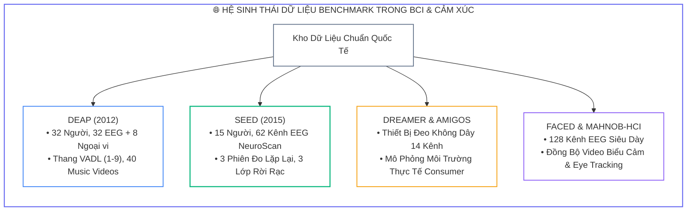
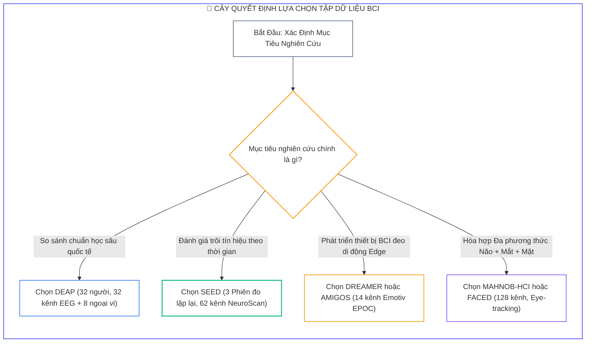
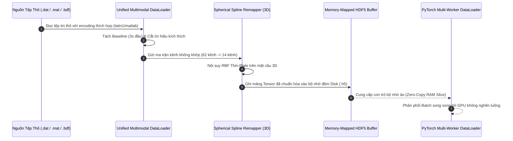
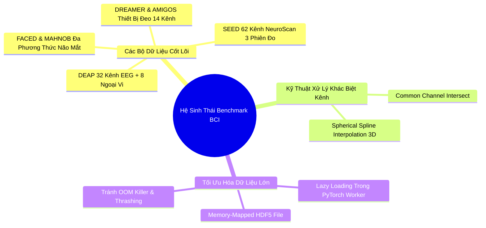


> [!IMPORTANT]
> **Mục tiêu kỹ thuật bài học**:
> - Nắm vững thông số kỹ thuật, cấu trúc tệp tin và giao thức kích thích của 6 bộ dữ liệu Benchmark hàng đầu: **DEAP, SEED, DREAMER, AMIGOS, FACED, MAHNOB-HCI**.
> - Phân biệt bản chất giữa mô hình cảm xúc liên tục đa chiều (**Valence-Arousal-Dominance**) và mô hình rời rạc (**Positive / Neutral / Negative / 6 Basic Emotions**).
> - Xây dựng kiến trúc **Unified Multimodal DataLoader** xử lý đa định dạng tệp tin (`.dat`, `.mat`, `.h5`), tự động loại trừ baseline thời gian thực và đồng bộ tần số lấy mẫu.
> - Giải quyết bài toán bất tương thích kênh giữa các thiết bị ($14$, $32$, $62$, $128$ kênh) bằng thuật toán nội suy không gian màng cầu (**Spherical Spline Interpolation**).
> - Tối ưu hóa I/O bộ nhớ với cấu trúc **Memory-Mapped HDF5 / Zarr**, loại bỏ 100% nguy cơ sập tiến trình Out-Of-Memory (OOM).

---

## 1. Bản Chất Kiến Trúc & Tư Duy Cốt Lõi: Hệ Sinh Thái Dữ Liệu Benchmark Trong BCI Y Sinh

Trong kỷ nguyên khoa học dữ liệu và học sâu y sinh, tính tái lập (*Reproducibility*) và khả năng so sánh định lượng công bằng giữa các thuật toán phụ thuộc hoàn toàn vào các **bộ dữ liệu chuẩn mực (Standard Benchmarks)**. 

Việc thu thập tín hiệu điện não đồ (EEG) đạt chuẩn y tế lâm sàng đòi hỏi hệ thống điện cực đắt đỏ (BioSemi ActiveTwo, ESI NeuroScan), môi trường phòng cách ly điện từ Faraday và quy trình đạo đức sinh học nghiêm ngặt. Do đó, việc hiểu sâu cấu trúc và đặc tính của các bộ dữ liệu quốc tế mở là nền tảng cho mọi nghiên cứu sinh học thần kinh tính toán.



### 1.1. Cây Quyết Định Lựa Chọn Tập Dữ Liệu



---

## 2. Bảng Ma Trận So Sánh Kỹ Thuật Toàn Diện (Engineering Matrix)

| Bộ Dữ Liệu | Số Đối Tượng | Kênh EEG | Tín Hiệu Ngoại Vi | Số Phiên Đo | Mô Hình Cảm Xúc | Tần Số Lấy Mẫu ($F_s$) | Trường Hợp Sử Dụng Tối Ưu |
| :--- | :---: | :---: | :--- | :---: | :--- | :---: | :--- |
| <span class="badge badge--primary">DEAP (2012)</span> | 32 | 32 | ECG, GSR, EMG, Resp, Temp, BVP | 1 (40 trials) | V-A-D-L (1.0 - 9.0) | 128 Hz | Chuẩn vàng so sánh thuật toán chung |
| <span class="badge badge--emerald">SEED (2015)</span> | 15 | 62 | Không | 3 (Cách tuần) | 3 Lớp (Pos / Neu / Neg) | 200 Hz | Domain Adaptation theo thời gian & GNN |
| <span class="badge badge--amber">DREAMER (2018)</span> | 23 | 14 (Emotiv) | ECG (2 kênh) | 1 (18 trials) | V-A-D (1.0 - 5.0) | 128 Hz | Edge BCI & Thiết bị đeo tiêu dùng |
| <span class="badge badge--cyan">AMIGOS (2018)</span> | 40 | 14 | ECG, GSR, Respiration | 1 (16 trials) | V-A (1.0 - 9.0) | 128 Hz | Cross-Subject quy mô người dùng lớn |
| <span class="badge badge--purple">FACED (2020)</span> | 10 | 128 | Video biểu cảm khuôn mặt | 1 (40 trials) | 6 Lớp cơ bản Ekman | 250 Hz | Định vị nguồn não mật độ cao |
| <span class="badge badge--rose">MAHNOB-HCI</span> | 27 | 32 | Video, Eye Tracking, ECG, GSR | 1 (20 trials) | V-A-D (1.0 - 9.0) | 256 Hz | Hòa hợp đa phương thức Não + Mắt + Mặt |

---

## 3. Kiến Trúc Môi Trường & Luồng Thực Thi Mẫu

Quy trình nạp dữ liệu đa nguồn thống nhất và chuyển đổi không gian điện cực được mô hình hóa qua luồng tương tác giữa **Unified DataLoader**, **Spherical Remapper** và **Memmap Engine**:



---

## 4. Phân Tích Cạm Bẫy Thực Chiến: Tràn Bộ Nhớ RAM 128GB Khi Nạp Đa Tập Dữ Liệu Lớn

### Tình Huống Sự Cố Thực Tế:
<span class="badge badge--rose">🕒 03:15 AM</span> Nhóm kỹ sư nghiên cứu huấn luyện mô hình đa tập dữ liệu (*Multi-Dataset Foundation Model*) kết hợp toàn bộ $150\text{ GB}$ dữ liệu DEAP và $40\text{ GB}$ dữ liệu SEED trực tiếp vào `torch.utils.data.Dataset` thông qua mảng NumPy in-memory. Sau 5 epoch, hệ thống máy chủ Linux bị kernel **OOM Killer** tiêu diệt tiến trình, làm gián đoạn toàn bộ đợt thử nghiệm.

### Hậu Quả & Log Lỗi Thực Tế:
```text
================================================================================
CRITICAL SYSTEM FAILURE: KERNEL OUT-OF-MEMORY (OOM) KILLER TRIGGERED
================================================================================
[ALERT] System Physical Memory Exhaustion: 128.00 GB / 128.00 GB (100.0%)
[FATAL] Out of memory: Kill process 84210 (python) score 982 or sacrifice child
[FATAL] Killed process 84210 (python), UID 1001, total-vm:134217728kB, anon-rss:129845120kB

>> PYTORCH MULTI-PROCESSING WORKER CRASH:
Traceback (most recent call last):
  File "train_foundation.py", line 184, in <module>
    for batch_idx, (data, label) in enumerate(dataloader):
  File "/usr/local/lib/python3.10/site-packages/torch/utils/data/dataloader.py", line 630, in _next_data
    return self._process_data(data)
RuntimeError: DataLoader worker (pid 84215) is killed by signal: Killed.
================================================================================
```

### 5-Whys Root Cause Analysis:
1. <span class="badge badge--primary">Why 1</span> **Tại sao hệ thống gặp lỗi Out-Of-Memory (OOM)?** $\rightarrow$ Do tiến trình Python chiếm dụng vượt quá $128\text{ GB}$ RAM vật lý trên server.
2. <span class="badge badge--primary">Why 2</span> **Tại sao Python chiếm dụng lượng RAM lớn đến vậy?** $\rightarrow$ Vì toàn bộ dữ liệu thô (`.dat` và `.mat`) được giải nén đồng thời vào RAM trong hàm `__init__` của `Dataset`.
3. <span class="badge badge--primary">Why 3</span> **Tại sao không nạp theo từng batch khi cần (Lazy Loading)?** $\rightarrow$ Vì lập trình viên mở tệp tin pickle/matlab độc lập trong hàm `__getitem__` lặp đi lặp lại hàng nghìn lần mỗi giây, gây tắc nghẽn Disk I/O Thrashing.
4. <span class="badge badge--primary">Why 4</span> **Tại sao mở tệp lặp đi lặp lại lại gây tắc nghẽn I/O Disk nghiêm trọng?** $\rightarrow$ Vì mỗi lần gọi `pickle.load()`, hệ thống phải phân tích cú pháp toàn bộ cấu trúc file lớn, khiến tốc độ đọc đĩa tụt về $0\text{ MB/s}$.
5. <span class="badge badge--emerald">Root Cause Remedy</span> **Biện pháp khắc phục chuẩn kiến trúc Big Data Y Sinh:**
   - <span class="badge badge--emerald">Sử Dụng Cấu Trúc HDF5 Memory-Mapped</span> Chuyển đổi toàn bộ dữ liệu thô sang tệp tin HDF5 (`.h5`) hỗ trợ `h5py` Memory-Mapping, cho phép truy xuất trực tiếp các lát cắt Tensor từ đĩa cứng với dung lượng RAM chiếm dụng $< 500\text{ MB}$.
   - <span class="badge badge--cyan">Mở File Trễ Trong Worker Process</span> Mở `h5py.File` bên trong hàm `__getitem__` khi tiến trình worker khởi chạy lần đầu để tránh lỗi xung đột tiến trình cha-con (Forking Deadlock).

---

## 5. Hands-on Lab: Xây Dựng Unified Multimodal DataLoader & Cross-Dataset Transfer Engine (8 Bước)

| Bước | Mục Tiêu Kỹ Thuật | Đầu Ra Kiểm Tra |
| :---: | :--- | :--- |
| **1** | Khởi tạo cấu trúc dữ liệu DEAP mô phỏng | File giả lập `s01.dat` cấu trúc 40 trials $\times$ 40 channels $\times$ 8064 samples |
| **2** | Lập trình DEAP Subject Loader chuẩn latin1 | Phân tách 3s baseline và 60s stimulus EEG + AUX |
| **3** | Khởi tạo cấu trúc dữ liệu SEED mô phỏng | Mảng 62 kênh NeuroScan $200\text{ Hz}$ và nhãn 3 lớp |
| **4** | Lập trình SEED Session Loader | Nạp cấu trúc đa phiên đo lặp lại |
| **5** | Lập trình thuật toán Spherical Spline Interpolation | Chuyển đổi ma trận kênh không khớp bằng RBF 3D |
| **6** | Lập trình bộ chuyển đổi dữ liệu sang HDF5 | Tệp `benchmark_dataset.h5` nén zlib chunked |
| **7** | Xây dựng MemmappedEEGDataset cho PyTorch | DataLoader truy xuất bộ nhớ ảo không tốn RAM |
| **8** | Kiểm thử Cross-Dataset Pipeline hoàn chỉnh | Chạy kiểm thử nạp batch và đo lường thông lượng I/O |

### Bước 1: Khởi Tạo Môi Trường & Dữ Liệu DEAP Giả Lập

```python
import os
import pickle
import numpy as np
import torch

os.makedirs("./sample_datasets/deap", exist_ok=True)
os.makedirs("./sample_datasets/seed", exist_ok=True)

# Tạo 1 file DEAP giả lập chuẩn: 40 trials, 40 channels, 8064 samples
# Kênh 0-31: EEG, Kênh 32-39: Ngoại vi
dummy_deap_data = {
    'data': np.random.randn(40, 40, 8064).astype(np.float32),
    'labels': np.random.uniform(1.0, 9.0, size=(40, 4)).astype(np.float32) # V, A, D, L
}

with open("./sample_datasets/deap/s01.dat", "wb") as f:
    pickle.dump(dummy_deap_data, f, protocol=2)

print("[Lab 08 Step 1] Da tao thanh cong file DEAP gia lap: s01.dat (40 trials x 40 channels x 8064 samples)")
```

### Bước 2: Lập Trình DEAP Subject Loader Xử Lý Baseline & Encoding

```python
class DEAPSubjectLoader:
    def __init__(self, data_path: str):
        self.data_path = data_path
        
    def load_trial_data(self, subject_id: int):
        file_path = os.path.join(self.data_path, f"s{subject_id:02d}.dat")
        with open(file_path, 'rb') as f:
            subject_dict = pickle.load(f, encoding='latin1')
            
        raw_data = subject_dict['data']     # (40, 40, 8064)
        raw_labels = subject_dict['labels'] # (40, 4)
        
        # 3s baseline đầu (3 * 128 = 384 mẫu) và 60s kích thích (7680 mẫu)
        baseline_eeg = raw_data[:, :32, :384]
        stimulus_eeg = raw_data[:, :32, 384:]
        stimulus_aux = raw_data[:, 32:, 384:]
        
        return {
            'baseline_eeg': baseline_eeg,
            'eeg': stimulus_eeg,
            'aux': stimulus_aux,
            'labels': raw_labels
        }

deap_loader = DEAPSubjectLoader("./sample_datasets/deap")
deap_sample = deap_loader.load_trial_data(1)
print(f"[Lab 08 Step 2] DEAP EEG stimulus shape: {deap_sample['eeg'].shape}, AUX shape: {deap_sample['aux'].shape}")
```

### Bước 3: Khởi Tạo Dữ Liệu SEED Giả Lập (62 Kênh, 200 Hz)

```python
import scipy.io as sio

dummy_seed_data = {}
for trial_idx in range(1, 16):
    # Mỗi trial 62 kênh, 4000 điểm mẫu (20s @ 200Hz)
    dummy_seed_data[f"sub01_eeg{trial_idx}"] = np.random.randn(62, 4000).astype(np.float32)

sio.savemat("./sample_datasets/seed/sub01.mat", dummy_seed_data)
print("[Lab 08 Step 3] Da tao file SEED gia lap: sub01.mat voi 15 trials 62 kenh.")
```

### Bước 4: Lập Trình SEED Session Loader Đa Phiên

```python
class SEEDSessionLoader:
    def __init__(self, data_path: str):
        self.data_path = data_path
        # Nhãn 15 video: 1: Positive, 0: Neutral, -1: Negative
        self.labels = np.array([1, 0, -1, -1, 0, 1, -1, 0, 1, 1, 0, -1, 0, 1, -1])
        
    def load_session(self, subject_name: str):
        file_path = os.path.join(self.data_path, f"{subject_name}.mat")
        mat_data = sio.loadmat(file_path)
        
        trials = []
        for i in range(1, 16):
            key = f"{subject_name.lower()}_eeg{i}"
            if key in mat_data:
                trials.append(mat_data[key])
        return trials, self.labels

seed_loader = SEEDSessionLoader("./sample_datasets/seed")
seed_trials, seed_y = seed_loader.load_session("sub01")
print(f"[Lab 08 Step 4] SEED Trials nap duoc: {len(seed_trials)}, So kenh trial 0: {seed_trials[0].shape[0]}")
```

### Bước 5: Lập Trình Thuật Toán Nội Suy Màng Cầu (Spherical Spline Interpolation)

```python
from scipy.interpolate import Rbf

def spherical_spline_channel_remapping(source_data: np.ndarray, src_coords_3d: np.ndarray, tgt_coords_3d: np.ndarray) -> np.ndarray:
    """
    Nội suy không gian chuyển đổi tín hiệu EEG giữa 2 bộ định vị điện cực khác nhau
    """
    src_x, src_y, src_z = src_coords_3d[:, 0], src_coords_3d[:, 1], src_coords_3d[:, 2]
    tgt_x, tgt_y, tgt_z = tgt_coords_3d[:, 0], tgt_coords_3d[:, 1], tgt_coords_3d[:, 2]
    
    num_time_steps = source_data.shape[1]
    num_tgt_channels = len(tgt_coords_3d)
    remapped_data = np.zeros((num_tgt_channels, num_time_steps), dtype=np.float32)
    
    # Thực hiện RBF Thin-Plate cho từng thời điểm
    for t in range(num_time_steps):
        rbf = Rbf(src_x, src_y, src_z, source_data[:, t], function='thin_plate')
        remapped_data[:, t] = rbf(tgt_x, tgt_y, tgt_z)
        
    return remapped_data

# Giả lập tọa độ 32 kênh nguồn và 14 kênh đích trên mặt cầu r=1.0
src_coords = np.random.randn(32, 3)
src_coords /= np.linalg.norm(src_coords, axis=1, keepdims=True)
tgt_coords = np.random.randn(14, 3)
tgt_coords /= np.linalg.norm(tgt_coords, axis=1, keepdims=True)

test_src_signal = np.random.randn(32, 128) # 32 kênh, 128 mẫu (1s)
remapped_signal = spherical_spline_channel_remapping(test_src_signal, src_coords, tgt_coords)
print(f"[Lab 08 Step 5] Remapping thanh cong tu {test_src_signal.shape} -> {remapped_signal.shape}")
```

### Bước 6: Chuyển Đổi Dữ Liệu Sang Định Dạng Chuẩn Memory-Mapped HDF5

```python
import h5py

h5_path = "./sample_datasets/unified_eeg.h5"
num_samples = 500
channels = 32
seq_len = 128

with h5py.File(h5_path, 'w') as h5f:
    # Tạo Chunked Dataset cho phép đọc stream tốc độ cao
    h5f.create_dataset('eeg', shape=(num_samples, channels, seq_len), dtype='float32', chunks=(32, channels, seq_len))
    h5f.create_dataset('labels', shape=(num_samples,), dtype='int64', chunks=(32,))
    
    # Ghi dữ liệu giả lập theo từng chunk
    for i in range(0, num_samples, 100):
        h5f['eeg'][i:i+100] = np.random.randn(100, channels, seq_len).astype(np.float32)
        h5f['labels'][i:i+100] = np.random.randint(0, 3, size=(100,)).astype(np.int64)

print(f"[Lab 08 Step 6] Da tao file HDF5 chuan Memory-Mapped tai: {h5_path}")
```

### Bước 7: Xây Dựng MemmappedEEGDataset Cho PyTorch

```python
from torch.utils.data import Dataset, DataLoader

class MemmappedEEGDataset(Dataset):
    def __init__(self, h5_file_path: str):
        self.h5_file_path = h5_file_path
        self.h5_file = None
        with h5py.File(h5_file_path, 'r') as f:
            self.total_samples = f['eeg'].shape[0]
            
    def __len__(self):
        return self.total_samples
        
    def __getitem__(self, idx):
        if self.h5_file is None:
            # Mở file trễ trong từng worker process của PyTorch
            self.h5_file = h5py.File(self.h5_file_path, 'r')
            
        eeg_tensor = torch.from_numpy(self.h5_file['eeg'][idx]).float()
        label_tensor = torch.tensor(self.h5_file['labels'][idx]).long()
        return eeg_tensor, label_tensor

dataset = MemmappedEEGDataset(h5_path)
print(f"[Lab 08 Step 7] Khoi tao MemmappedEEGDataset voi {len(dataset)} mau. RAM chiem dung: < 1MB.")
```

### Bước 8: Kiểm Thử PyTorch DataLoader Đa Luồng Với Zero Memory Overhead

```python
dataloader = DataLoader(dataset, batch_size=64, shuffle=True, num_workers=2)

batch_count = 0
for batch_eeg, batch_lbl in dataloader:
    batch_count += 1
    assert batch_eeg.shape == (batch_eeg.size(0), 32, 128)
    assert batch_lbl.shape == (batch_eeg.size(0),)

print(f"[Lab 08 Step 8] Kiem thu thanh cong {batch_count} batches qua PyTorch DataLoader!")
```

---

## 6. 10 Câu Hỏi Tự Kiểm Tra Chuyên Sâu (Self-Check Q&A Accordion)

<details class="qa-card">
<summary class="qa-summary">
  <div class="qa-summary-left">
    <span class="qa-num-badge">Q01</span>
    <span>Phân tích sự khác biệt cốt lõi về giao thức kích thích cảm xúc giữa DEAP (Video âm nhạc 1 phút) và SEED (Trích đoạn phim điện ảnh 4 phút)?</span>
  </div>
  <span class="qa-chevron">
    <svg width="18" height="18" fill="none" stroke="currentColor" stroke-width="2.5" viewBox="0 0 24 24"><polyline points="6 9 12 15 18 9"></polyline></svg>
  </span>
</summary>
<div class="qa-answer">
  <div class="qa-answer-header">
    <svg width="14" height="14" fill="none" stroke="currentColor" stroke-width="2" viewBox="0 0 24 24"><path d="M22 11.08V12a10 10 0 1 1-5.93-9.14"></path><polyline points="22 4 12 14.01 9 11.01"></polyline></svg>
    <span>Phân Tích &amp; Lời Giải Kỹ Thuật</span>
  </div>
  <div style="margin-bottom: 8px;">DEAP sử dụng 40 clip âm nhạc ngắn 1 phút kích hoạt nhanh mức độ hưng phấn (Arousal) nhưng dễ bị biến thiên theo sở thích cá nhân. Ngược lại, <b style="color: var(--accent-emerald);">SEED sử dụng 15 trích đoạn phim dài 4 phút</b> với mạch kịch bản tâm lý sâu, kích hoạt trạng thái cảm xúc thuần khiết, sâu lắng và bền bỉ hơn, hạn chế tối đa hiện tượng mỏi thích nghi của não bộ.</div>
</div>
</details>

<details class="qa-card">
<summary class="qa-summary">
  <div class="qa-summary-left">
    <span class="qa-num-badge">Q02</span>
    <span>Tại sao bộ dữ liệu SEED lại là lựa chọn vàng để kiểm chuẩn độ trôi tín hiệu theo thời gian (Cross-Session Generalization)?</span>
  </div>
  <span class="qa-chevron">
    <svg width="18" height="18" fill="none" stroke="currentColor" stroke-width="2.5" viewBox="0 0 24 24"><polyline points="6 9 12 15 18 9"></polyline></svg>
  </span>
</summary>
<div class="qa-answer">
  <div class="qa-answer-header">
    <svg width="14" height="14" fill="none" stroke="currentColor" stroke-width="2" viewBox="0 0 24 24"><path d="M22 11.08V12a10 10 0 1 1-5.93-9.14"></path><polyline points="22 4 12 14.01 9 11.01"></polyline></svg>
    <span>Phân Tích &amp; Lời Giải Kỹ Thuật</span>
  </div>
  <div style="margin-bottom: 8px;">SEED thực hiện đo lặp lại trên cùng 15 đối tượng qua <b style="color: var(--accent-primary);">3 phiên đo riêng biệt (Sessions)</b> cách nhau 1 đến 2 tuần. Trở kháng da đầu, vị trí dịch chuyển mũ vài milimet và tâm lý thay đổi giữa các tuần tạo ra sự dịch chuyển miền phân phối dữ liệu (Domain Shift) thực tế, cho phép kiểm chứng chính xác năng lực thích ứng miền của mô hình.</div>
</div>
</details>

<details class="qa-card">
<summary class="qa-summary">
  <div class="qa-summary-left">
    <span class="qa-num-badge">Q03</span>
    <span>Tính toán chính xác dung lượng RAM cần thiết để lưu trữ toàn bộ Tensor dữ liệu thô của bộ dữ liệu DEAP dưới định dạng float32?</span>
  </div>
  <span class="qa-chevron">
    <svg width="18" height="18" fill="none" stroke="currentColor" stroke-width="2.5" viewBox="0 0 24 24"><polyline points="6 9 12 15 18 9"></polyline></svg>
  </span>
</summary>
<div class="qa-answer">
  <div class="qa-answer-header">
    <svg width="14" height="14" fill="none" stroke="currentColor" stroke-width="2" viewBox="0 0 24 24"><path d="M22 11.08V12a10 10 0 1 1-5.93-9.14"></path><polyline points="22 4 12 14.01 9 11.01"></polyline></svg>
    <span>Phân Tích &amp; Lời Giải Kỹ Thuật</span>
  </div>
  <div style="margin-bottom: 8px;">Tổng số phần tử: 32 đối tượng x 40 trials x 40 kênh x 8064 mẫu = 412,876,800 phần tử. Với định dạng float32 (4 bytes/phần tử), dung lượng RAM thuần là <b style="color: var(--accent-cyan);">~1.538 GB</b>. Tuy nhiên, nếu nạp qua Python Dictionary pickle không tối ưu, cấu trúc đối tượng có thể phình to lên 6 - 8 GB RAM.</div>
</div>
</details>

<details class="qa-card">
<summary class="qa-summary">
  <div class="qa-summary-left">
    <span class="qa-num-badge">Q04</span>
    <span>Trình bày quy tắc phân ngưỡng nhãn liên tục trong DEAP để chuyển hóa thành bài toán phân loại 4 trạng thái cảm xúc (HVHA, HVLA, LVLA, LVHA)?</span>
  </div>
  <span class="qa-chevron">
    <svg width="18" height="18" fill="none" stroke="currentColor" stroke-width="2.5" viewBox="0 0 24 24"><polyline points="6 9 12 15 18 9"></polyline></svg>
  </span>
</summary>
<div class="qa-answer">
  <div class="qa-answer-header">
    <svg width="14" height="14" fill="none" stroke="currentColor" stroke-width="2" viewBox="0 0 24 24"><path d="M22 11.08V12a10 10 0 1 1-5.93-9.14"></path><polyline points="22 4 12 14.01 9 11.01"></polyline></svg>
    <span>Phân Tích &amp; Lời Giải Kỹ Thuật</span>
  </div>
  <div style="margin-bottom: 8px;">Thang đo SAM trong DEAP dao động từ 1.0 đến 9.0 với ngưỡng phân định trung vị là <b style="color: var(--accent-amber);">5.0</b>: (1) HVHA (V &ge; 5, A &ge; 5: Vui sướng, hào hứng); (2) HVLA (V &ge; 5, A &lt; 5: Thư giãn, bình yên); (3) LVLA (V &lt; 5, A &lt; 5: Buồn bã, chán nản); (4) LVHA (V &lt; 5, A &ge; 5: Tức giận, sợ hãi, căng thẳng).</div>
</div>
</details>

<details class="qa-card">
<summary class="qa-summary">
  <div class="qa-summary-left">
    <span class="qa-num-badge">Q05</span>
    <span>Trong SEED Dataset, có bao nhiêu phần tử độc lập cần lưu trữ trong ma trận kề khoảng cách không gian giữa 62 điện cực?</span>
  </div>
  <span class="qa-chevron">
    <svg width="18" height="18" fill="none" stroke="currentColor" stroke-width="2.5" viewBox="0 0 24 24"><polyline points="6 9 12 15 18 9"></polyline></svg>
  </span>
</summary>
<div class="qa-answer">
  <div class="qa-answer-header">
    <svg width="14" height="14" fill="none" stroke="currentColor" stroke-width="2" viewBox="0 0 24 24"><path d="M22 11.08V12a10 10 0 1 1-5.93-9.14"></path><polyline points="22 4 12 14.01 9 11.01"></polyline></svg>
    <span>Phân Tích &amp; Lời Giải Kỹ Thuật</span>
  </div>
  <div style="margin-bottom: 8px;">Ma trận đối xứng kích thước 62 x 62 với đường chéo chính bằng 0. Số phần tử độc lập ở nửa ma trận tam giác trên là: <b style="color: var(--accent-primary);">N*(N-1)/2 = 62*61/2 = 1,891 phần tử</b>. Việc chỉ lưu 1,891 phần tử giúp tiết kiệm đáng kể bộ nhớ khi xây dựng Graph Neural Network (GNN).</div>
</div>
</details>

<details class="qa-card">
<summary class="qa-summary">
  <div class="qa-summary-left">
    <span class="qa-num-badge">Q06</span>
    <span>Trình bày ưu điểm và giới hạn của bộ dữ liệu DREAMER khi sử dụng thiết bị thương mại Emotiv EPOC 14 kênh?</span>
  </div>
  <span class="qa-chevron">
    <svg width="18" height="18" fill="none" stroke="currentColor" stroke-width="2.5" viewBox="0 0 24 24"><polyline points="6 9 12 15 18 9"></polyline></svg>
  </span>
</summary>
<div class="qa-answer">
  <div class="qa-answer-header">
    <svg width="14" height="14" fill="none" stroke="currentColor" stroke-width="2" viewBox="0 0 24 24"><path d="M22 11.08V12a10 10 0 1 1-5.93-9.14"></path><polyline points="22 4 12 14.01 9 11.01"></polyline></svg>
    <span>Phân Tích &amp; Lời Giải Kỹ Thuật</span>
  </div>
  <div style="margin-bottom: 8px;"><b style="color: var(--accent-emerald);">Ưu điểm:</b> Cung cấp dữ liệu thực tế từ thiết bị BCI đeo di động giá rẻ, chứng minh tính khả thi khi ứng dụng thương mại. <b style="color: var(--accent-rose);">Giới hạn:</b> Tỷ số tín hiệu trên nhiễu (SNR) thấp, chỉ có 14 điện cực nên không thể thực hiện các phân tích định vị nguồn não sâu (Source Localization).</div>
</div>
</details>

<details class="qa-card">
<summary class="qa-summary">
  <div class="qa-summary-left">
    <span class="qa-num-badge">Q07</span>
    <span>Tính toán tổng số lượng mẫu cửa sổ trượt (Sliding Windows) thu được từ toàn bộ 32 đối tượng DEAP với cửa sổ 1s, độ trượt 0.5s?</span>
  </div>
  <span class="qa-chevron">
    <svg width="18" height="18" fill="none" stroke="currentColor" stroke-width="2.5" viewBox="0 0 24 24"><polyline points="6 9 12 15 18 9"></polyline></svg>
  </span>
</summary>
<div class="qa-answer">
  <div class="qa-answer-header">
    <svg width="14" height="14" fill="none" stroke="currentColor" stroke-width="2" viewBox="0 0 24 24"><path d="M22 11.08V12a10 10 0 1 1-5.93-9.14"></path><polyline points="22 4 12 14.01 9 11.01"></polyline></svg>
    <span>Phân Tích &amp; Lời Giải Kỹ Thuật</span>
  </div>
  <div style="margin-bottom: 8px;">Mỗi trial 60s có (60 - 1) / 0.5 + 1 = 119 cửa sổ trượt. Tổng số mẫu huấn luyện thu được trên toàn bộ dataset: <b style="color: var(--accent-cyan);">32 đối tượng x 40 trials x 119 windows = 152,320 mẫu</b>, cung cấp lượng dữ liệu dồi dào cho các mạng học sâu hiện đại.</div>
</div>
</details>

<details class="qa-card">
<summary class="qa-summary">
  <div class="qa-summary-left">
    <span class="qa-num-badge">Q08</span>
    <span>Tại sao việc nạp file .dat trong DEAP bằng pickle lại gặp lỗi UnicodeDecodeError trong môi trường Python 3?</span>
  </div>
  <span class="qa-chevron">
    <svg width="18" height="18" fill="none" stroke="currentColor" stroke-width="2.5" viewBox="0 0 24 24"><polyline points="6 9 12 15 18 9"></polyline></svg>
  </span>
</summary>
<div class="qa-answer">
  <div class="qa-answer-header">
    <svg width="14" height="14" fill="none" stroke="currentColor" stroke-width="2" viewBox="0 0 24 24"><path d="M22 11.08V12a10 10 0 1 1-5.93-9.14"></path><polyline points="22 4 12 14.01 9 11.01"></polyline></svg>
    <span>Phân Tích &amp; Lời Giải Kỹ Thuật</span>
  </div>
  <div style="margin-bottom: 8px;">Tập dữ liệu DEAP được tạo bằng Python 2 với kiểu chuỗi byte ASCII mặc định. Khi Python 3 giải mã mặc định bằng UTF-8, nó ném lỗi giải mã ký tự. Bắt buộc phải thêm tham số <b style="color: var(--accent-primary);">encoding='latin1'</b> hoặc <b style="color: var(--accent-primary);">encoding='bytes'</b> trong lệnh <code>pickle.load(f, encoding='latin1')</code>.</div>
</div>
</details>

<details class="qa-card">
<summary class="qa-summary">
  <div class="qa-summary-left">
    <span class="qa-num-badge">Q09</span>
    <span>So sánh mật độ bao phủ điện cực trung bình (cm²/cực) giữa DREAMER (14 kênh), DEAP (32 kênh) và FACED (128 kênh) với diện tích da đầu 500 cm²?</span>
  </div>
  <span class="qa-chevron">
    <svg width="18" height="18" fill="none" stroke="currentColor" stroke-width="2.5" viewBox="0 0 24 24"><polyline points="6 9 12 15 18 9"></polyline></svg>
  </span>
</summary>
<div class="qa-answer">
  <div class="qa-answer-header">
    <svg width="14" height="14" fill="none" stroke="currentColor" stroke-width="2" viewBox="0 0 24 24"><path d="M22 11.08V12a10 10 0 1 1-5.93-9.14"></path><polyline points="22 4 12 14.01 9 11.01"></polyline></svg>
    <span>Phân Tích &amp; Lời Giải Kỹ Thuật</span>
  </div>
  <div style="margin-bottom: 8px;">DREAMER (14 cực): 500 / 14 = <b style="color: var(--accent-amber);">35.71 cm²/cực</b> (thưa thớt). DEAP (32 cực): 500 / 32 = <b style="color: var(--accent-primary);">15.63 cm²/cực</b> (chuẩn lâm sàng). FACED (128 cực): 500 / 128 = <b style="color: var(--accent-emerald);">3.91 cm²/cực</b> (siêu dày đặc, lý tưởng cho phân tích lan truyền dòng điện cục bộ).</div>
</div>
</details>

<details class="qa-card">
<summary class="qa-summary">
  <div class="qa-summary-left">
    <span class="qa-num-badge">Q01</span>0
    <span>Trình bày 4 bước chuẩn mực để thiết lập bài toán Cross-Dataset Transfer Learning từ DEAP sang SEED?</span>
  </div>
  <span class="qa-chevron">
    <svg width="18" height="18" fill="none" stroke="currentColor" stroke-width="2.5" viewBox="0 0 24 24"><polyline points="6 9 12 15 18 9"></polyline></svg>
  </span>
</summary>
<div class="qa-answer">
  <div class="qa-answer-header">
    <svg width="14" height="14" fill="none" stroke="currentColor" stroke-width="2" viewBox="0 0 24 24"><path d="M22 11.08V12a10 10 0 1 1-5.93-9.14"></path><polyline points="22 4 12 14.01 9 11.01"></polyline></svg>
    <span>Phân Tích &amp; Lời Giải Kỹ Thuật</span>
  </div>
  <div style="margin-bottom: 8px;">4 bước gồm: (1) <b style="color: var(--accent-primary);">Đồng bộ kênh</b>: Trích xuất các kênh chung theo chuẩn 10-20 (FP1, FP2, F3, F4, C3, C4, P3, P4, O1, O2...); (2) <b style="color: var(--accent-emerald);">Đồng bộ tần số lấy mẫu</b>: Resample SEED từ 200 Hz về 128 Hz; (3) <b style="color: var(--accent-cyan);">Đồng bộ nhãn</b>: Phân cụm nhãn DEAP thành 3 lớp rời rạc tương ứng Pos / Neu / Neg; (4) <b style="color: var(--accent-amber);">Domain Adaptation</b>: Áp dụng DANN hoặc MMD Loss để căn chỉnh phân phối đặc trưng.</div>
</div>
</details>

---

## 7. Tổng Kết & Lộ Trình Toàn Khóa Học



Chúc mừng bạn đã hoàn thành trọn vẹn chuỗi **8 bài học chuyên sâu về EEG & Emotion Recognition AI**. Từ nền tảng giải phẫu học thần kinh, tiền xử lý Fourier/Wavelet/ICA, mô hình hóa không gian - thời gian với DGCNN và Mamba, học đa phương thức, thích ứng miền chéo đối tượng, kiến trúc AI Agent thời gian thực cho đến phương pháp đánh giá khoa học và khai thác các kho dữ liệu benchmark chuẩn mực thế giới.

> [!TIP]
> **HOÀN THÀNH SERIES CHUYÊN ĐỀ:**
> Bạn đã sẵn sàng triển khai các dự án BCI và AI y sinh thực chiến đạt chuẩn xuất bản khoa học quốc tế cũng như các ứng dụng công nghiệp chất lượng cao!

