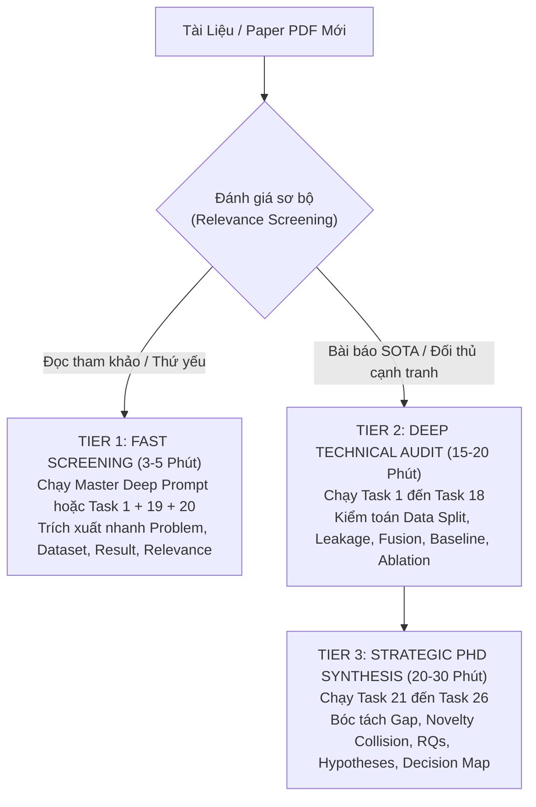

# 🧠 CẨM NANG TOÀN DIỆN: NGHIÊN CỨU & TRIỂN KHAI CHO ĐỀ TÀI TIẾN SĨ (PhD)
## Đề tài: “Kiến trúc học đa nhiệm vụ đa nhánh cho nhận diện cảm xúc từ tín hiệu y sinh đa phương thức”
*(Multi-Task Multi-Branch Architecture for Emotion Recognition from Multimodal Biosignals)*

---

> ### 🎓 **ĐỊNH HƯỚNG TỔNG QUAN LUẬN ÁN TIẾN SĨ:**
> Đề tài này không đơn thuần là bài toán *EEG Emotion Recognition*, mà là bài toán **dung hợp đa phương thức giữa Hệ thần kinh trung ương (CNS - Scalp EEG) và Hệ thần kinh tự chủ (ANS - ECG, EDA, PPG, Resp)** thông qua **Kiến trúc học Đa nhánh Đa nhiệm vụ (MMB-EmotionNet)** với cơ chế **Phân tách Không gian con (Shared-Private Subspace Disentanglement)** và **Cân bằng Hàm mất mát động (Uncertainty-Weighted MTL)** dưới **Giao thức kiểm định tổng quát hóa đa đối tượng (LOSO Cross-Subject Generalization)**.

```text
                               ĐỀ TÀI CỦA BẠN (MMB-EmotionNet)
                                             │
         ┌───────────────────────────────────┼───────────────────────────────────┐
         │                                   │                                   │
         ▼                                   ▼                                   ▼
 1. Multimodal Biosignals            2. Multi-Branch Encoders            3. Subspace Disentanglement
 (CNS: EEG + ANS: ECG/EDA)           (GCN + TCN + CWT)                   (Shared vs Private Features)
         │                                   │                                   │
         └───────────────────────────────────┼───────────────────────────────────┘
                                             ▼
                                4. Directional Cross-Attention
                                   (Q_EEG ◄► K,V_Bio Fusion)
                                             │
         ┌───────────────────────────────────┴───────────────────────────────────┐
         ▼                                                                       ▼
 5. Multi-Task Learning (MTL)                                            6. Robust Generalization
 (Valence/Arousal + Quadrants + Domain Decoupling)                       (LOSO + Missing Modality Resilience)
```

---

## 📑 MỤC LỤC
1. [Giải Phẫu Đề Tài: 6 Trục Khoa Học Cốt Lõi](#1-giải-phẫu-đề-tài-6-trục-khoa-học-cốt-lõi)
2. [Cấu Trúc Hệ Thống 10 NotebookLM Workspaces Chuẩn Hóa](#2-cấu-trúc-hệ-thống-10-notebooklm-workspaces-chuẩn-hóa)
3. [Quy Trình Phân Tầng Thực Thi 3 Cấp Độ (3-Tier Execution Workflow)](#3-quy-trình-phân-tầng-thực-thi-3-cấp-độ-3-tier-execution-workflow)
4. [Khung 26 Tasks Bóc Tách Học Thuật & Kiểm Toán Bài Báo](#4-khung-26-tasks-bóc-tách-học-thuật--kiểm-toán-bài-báo)
5. [Khung Câu Hỏi Nghiên Cứu ($RQ_1 - RQ_6$) & Giả Thuyết Khoa Học ($H_1 - H_6$)](#5-khung-câu-hỏi-nghiên-cứu-rq1---rq6--giả-thuyết-khoa-học-h1---h6)
6. [Ma Trận Thực Nghiệm Kiểm Chứng 10 Cấu Hình (Ablation Suite)](#6-ma-trận-thực-nghiệm-kiểm-chứng-10-cấu-hình-ablation-suite)
7. [Kiểm Toán Rò Rỉ Dữ Liệu (Anti-Data Leakage Protocol)](#7-kiểm-toán-rò-rỉ-dữ-liệu-anti-data-leakage-protocol)
8. [Kiến Trúc Đề Xuất MMB-EmotionNet Hoàn Chỉnh](#8-kiến-trúc-đề-xuất-mmb-emotionnet-hoàn-chỉnh)
9. [Kinh Nghiệm Phản Biện & Công Bố Tạp Chí Q1/Top Conf (IEEE TPAMI/TAC/TBME)](#9-kinh-nghiệm-phản-biện--công-bố-tạp-chí-q1top-conf-ieee-tpamitactbme)

---

## 1. GIẢI PHẪU ĐỀ TÀI: 6 TRỤC KHOA HỌC CỐT LÕI

Để xây dựng luận án vững chắc, nghiên cứu sinh phải nắm vững literature của 6 trục độc lập nhưng giao thoa chặt chẽ:

### 1.1. Multimodal Biosignals & Brain-Body Axis (Trục Não - Tim - Cơ thể)
* **Scalp EEG (Central Nervous System - CNS)**: Điện thế vỏ não với độ phân giải thời gian tính bằng mili-giây, trích xuất đặc trưng dải tần ($\delta, \theta, \alpha, \beta, \gamma$), năng lượng entropy vi phân (Differential Entropy - DE) và tính bất đối xứng bán cầu não (Frontal Alpha Asymmetry - FAA).
* **ECG / PPG (Autonomic Nervous System - ANS)**: Biến thiên nhịp tim (Heart Rate Variability - HRV), phản ánh cân bằng giao cảm/phó giao cảm (Sympathovagal balance qua chỉ số $LF/HF$, $RMSSD$, $SDNN$).
* **EDA / GSR (Sympathetic Arousal)**: Độ dẫn điện da với thành phần nền biến thiên chậm (Tonic SCL) và xung phản xạ cảm xúc đột ngột (Phasic SCR).
* **Respiration & EMG**: Nhịp thở và vi biểu cảm cơ mặt (Zygomaticus / Corrugator).

### 1.2. Dedicated Multi-Branch Topology (Kiến Trúc Đa Nhánh Dị Thể)
* Các tín hiệu y sinh có **bản chất vật lý và tần số lấy mẫu ($f_s$) hoàn toàn khác nhau**. Dùng chung một backbone đồng nhất (Homogeneous) sẽ dẫn đến suy thoái đặc trưng.
* **Giải pháp đa nhánh:**
  - *Nhánh EEG*: Graph Convolutional Network (GCN / Dynamic GCN) mô hình hóa topo không gian các điện cực 10–20.
  - *Nhánh ECG*: Dilated Temporal Convolutional Network (TCN) bắt chu kỳ R-peak và biến thiên HRV.
  - *Nhánh EDA/PPG*: Continuous Wavelet Transform (CWT) + 1D-CNN phân tách thành phần chậm (Tonic) và nhanh (Phasic).

### 1.3. Shared-Private Subspace Disentanglement (Phân Tách Không Gian Con)
* Các cảm biến y sinh thường bị lẫn lộn giữa **nhiễu vật lý riêng biệt của từng sensor (Sensor-private noise / Artifacts)** và **ngữ nghĩa cảm xúc chung (Shared emotional semantics)**.
* Mô hình sử dụng hàm mất mát trực giao:
  $$\mathcal{L}_{\text{diff}} = \sum_{m=1}^{M} \| {S^{(m)}}^\top P^{(m)} \|_F^2$$
  kết hợp hàm mất mát tương đồng $\mathcal{L}_{\text{sim}}$ (Contrastive Similarity) để ép không gian chung $S$ chỉ chứa thông tin cảm xúc thuần khiết, trong khi không gian riêng $P^{(m)}$ lưu giữ đặc thù của từng cảm biến.

### 1.4. Directional Cross-Modal Attention Fusion (Dung Hợp Chú Ý Định Hướng)
* Thay vì chỉ nối vector (Early concatenation) hoặc bình chọn xác suất (Late voting), kiến trúc sử dụng **Cross-Attention định hướng**:
  - Tín hiệu điện não EEG đóng vai trò truy vấn chính: $Q_{\text{EEG}} \in \mathbb{R}^{d}$
  - Tín hiệu ngoại vi ANS đóng vai trò khóa và giá trị: $K_{\text{Bio}}, V_{\text{Bio}} \in \mathbb{R}^{d}$
  - Cơ chế này cho phép các biến đổi nhịp tim (ECG) và dẫn điện da (EDA) hiệu chỉnh và tăng cường cho các kích hoạt trên vỏ não.

### 1.5. Uncertainty-Weighted Multi-Task Learning (Học Đa Nhiệm Vụ Cân Bằng Động)
* Tối ưu đồng thời nhiều mục tiêu:
  - Task 1: Dự đoán mức độ Hài lòng (Valence Continuous Regression / Classification).
  - Task 2: Dự đoán mức độ Kích thích (Arousal Continuous Regression / Classification).
  - Task 3: Phân loại 4 góc phần tư cảm xúc (Quadrant: HVHA, HVLA, LVHA, LVLA).
  - Task 4 (Phụ trợ): Khử đặc trưng định danh đối tượng (Adversarial Subject Decoupling).
* Áp dụng **Homoscedastic Aleatoric Uncertainty Loss Weighting (Kendall et al.)** để tự động học trọng số $\sigma_t$ tối ưu, loại bỏ triệt để xung đột gradient và hiện tượng truyền giao tiêu cực (Negative Transfer):
  $$\mathcal{L}_{\text{total}} = \sum_{t=1}^{T} \left( \frac{1}{2\sigma_t^2} \mathcal{L}_t + \log \sigma_t \right) + \alpha \mathcal{L}_{\text{diff}} + \beta \mathcal{L}_{\text{sim}}$$

### 1.6. Robust Cross-Subject Generalization & Missing Modality Resilience
* Đánh giá bắt buộc theo giao thức **Leave-One-Subject-Out (LOSO)** trên các đối tượng chưa từng thấy trong tập huấn luyện.
* Thiết kế mạng có khả năng **hoạt động bền bỉ khi mất 1 hoặc nhiều cảm biến (Missing Modalities)** qua cơ chế Teacher-Student Knowledge Distillation.

---

## 2. CẤU TRÚC HỆ THỐNG 10 NOTEBOOKLM WORKSPACES CHUẨN HÓA

Toàn bộ 240 bài báo đã được tải và phân bổ vào 10 thư mục chuyên biệt trong `eeg_paper_research/notebooklm_workspace/`:

| STT | Tên Thư Mục / Notebook | Số Lượng PDF | Trọng Tâm Nghiên Cứu Luận Án |
| :---: | :--- | :---: | :--- |
| **01** | `notebook_01_Multimodal_EEG_Biosignals` | 24 | Dung hợp EEG + ECG/EDA/PPG, trích xuất đặc trưng sinh lý CNS-ANS |
| **02** | `notebook_02_Multi_Task_Learning_Affect` | 24 | Kiến trúc học đa nhiệm, quan hệ Valence-Arousal, cân bằng loss |
| **03** | `notebook_03_Multi_Branch_Cross_Modal_Attention` | 24 | Mạng đa nhánh chuyên biệt, Cross-Attention QKV, Co-attention |
| **04** | `notebook_04_Subspace_Disentanglement_Domain_Adaptation` | 24 | Phân tách Shared-Private, DANN, MMD, thích nghi miền liên đối tượng |
| **05** | `notebook_05_Missing_Modality_Wearable_Robustness` | 24 | Khôi phục cảm biến bị mất, chống nhiễu cảm biến đeo tay (Wearables) |
| **06** | `notebook_06_Foundation_Models_Self_Supervised_Biosignals` | 24 | Mô hình nền tảng, học tự giám sát (MAE, SimCLR, Contrastive Learning) |
| **07** | `notebook_07_Graph_Neural_Networks_Brain_Connectivity` | 24 | Mạng nơ-ron đồ thị (GCN/GAT), mô hình hóa liên kết chức năng não bộ |
| **08** | `notebook_08_Transformers_Crossmodal_Affective_Computing` | 24 | Transformer đa phương thức, Temporal Attention, Patch-EEG |
| **09** | `notebook_09_Explainable_AI_Interpretable_Biosignals` | 24 | Trực quan hóa bản đồ kích hoạt não (XAI), ý nghĩa sinh học thần kinh |
| **10** | `notebook_10_Closed_Loop_BCI_RealTime_Affective_Systems` | 24 | Hệ thống BCI vòng kín thời gian thực, triển khai trên thiết bị Edge |

---

## 3. QUY TRÌNH PHÂN TẦNG THỰC THI 3 CẤP ĐỘ (3-TIER EXECUTION WORKFLOW)

Để tối ưu hóa thời gian và năng lượng trí tuệ khi xử lý hàng trăm bài báo, nghiên cứu sinh thực hiện quy trình phân tầng:



1. **Tier 1 (Fast Screening)**: Dùng **All-in-One Master Deep Prompt** (ở cuối file [NOTEBOOKLM_PER_PAPER_PROMPTS.md](NOTEBOOKLM_PER_PAPER_PROMPTS.md)) để có ngay bức tranh toàn cảnh 18 điểm trong 1 câu truy vấn.
2. **Tier 2 (Deep Technical Audit)**: Bóc tách chi tiết từng module kỹ thuật và thực hiện kiểm toán chống gian lận dữ liệu (Data Leakage Audit).
3. **Tier 3 (Strategic PhD Synthesis)**: Biến các hạn chế của paper đối thủ thành **Đóng góp mới (Novel Contributions)** cho luận án thông qua hệ thống giả thuyết và kế hoạch thực nghiệm có đối chứng.

---

## 4. KHUNG 26 TASKS BÓC TÁCH HỌC THUẬT & KIỂM TOÁN BÀI BÁO

Tất cả các prompt chi tiết bằng tiếng Anh học thuật đã được lưu trữ sẵn sàng tại [NOTEBOOKLM_PER_PAPER_PROMPTS.md](NOTEBOOKLM_PER_PAPER_PROMPTS.md) và [NotebookLM.md](NotebookLM.md).

```text
┌───────────────────────────────────────────────────────────────────────────────┐
│                    HỆ THỐNG 26 TASK PHÂN TÍCH NOTEBOOKLM                      │
├───────────────────────────────────────┬───────────────────────────────────────┤
│ NHÓM 1: BÓC TÁCH KỸ THUẬT & KIỂM TOÁN │ NHÓM 2: TỔNG HỢP & ĐỊNH HÌNH LUẬN ÁN  │
├───────────────────────────────────────┼───────────────────────────────────────┤
│ Task 1: Paper Identity & Scope        │ Task 19: Executive Synthesis Summary  │
│ Task 2: Dataset & Affective Ground-Tr.│ Task 20: Research Relevance Matrix    │
│ Task 3: Preprocessing & Physiology   │ Task 21: Research Gap Formulation     │
│ Task 4: Data Split & Partitioning     │ Task 22: Novelty & Collision Check(P4)│
│ Task 5: Model Architecture & Topology │ Task 23: Research Directions Map (P5) │
│ Task 6: Multimodal Fusion Dynamics    │ Task 24: RQs & Hypotheses H1-H6  (P6) │
│ Task 7: Multi-Task Objectives (MTL)   │ Task 25: Experimental Blueprint  (P7) │
│ Task 8: Multi-Branch Topology & Just. │ Task 26: Research Decision Map   (P8) │
│ Task 9: Baseline Comparative Rigor    │                                       │
│ Task 10: Quantitative Results & Stats │                                       │
│ Task 11: Ablation Study Audit         │                                       │
│ Task 12: Generalization & Domain Adapt│                                       │
│ Task 13: Robustness & Missing Sensors │                                       │
│ Task 14: Complexity & Edge Feasibility│                                       │
│ Task 15: Limitations Audit (Tier A/B/C│                                       │
│ Task 16: Reproducibility Assessment   │                                       │
│ Task 17: Forensic Data Leakage Audit  │                                       │
│ Task 18: Scientific Evidence Table    │                                       │
└───────────────────────────────────────┴───────────────────────────────────────┘
```

---

## 5. KHUNG CÂU HỎI NGHIÊN CỨU ($RQ_1 - RQ_6$) & GIẢ THUYẾT KHOA HỌC ($H_1 - H_6$)

Câu hỏi nghiên cứu tổng thể của toàn bộ luận án tiến sĩ:
> **"How can modality-specific and shared representations be jointly disentangled and optimized through a physics-informed multi-branch multi-task architecture to maximize emotion recognition accuracy and robustness under cross-subject and missing-sensor conditions?"**

| Mã RQ | Câu Hỏi Nghiên Cứu ($RQ$) | Giả Thuyết Khoa Học ($H_1$) | Tiêu Chuẩn Thống Kê Bác Bỏ $H_0$ |
| :---: | :--- | :--- | :--- |
| **$RQ_1$** | Các nhánh mã hóa dị thể (GCN cho EEG, TCN cho ECG, CWT cho EDA) có biểu diễn tín hiệu tốt hơn mạng đồng nhất không? | **$H_1$**: Mạng đa nhánh dị thể đạt F1-score cao hơn đáng kể ($p < 0.01$) so với Single-backbone đồng nhất. | Wilcoxon Paired Signed-Rank ($p < 0.05$), Cohen's $d > 0.5$ |
| **$RQ_2$** | Cơ chế Cross-Modal Attention định hướng ($Q_{\text{EEG}} \leftrightarrow K,V_{\text{Bio}}$) có vượt trội hơn ghép nối cơ học không? | **$H_2$**: Attention định hướng cải thiện phân loại cảm xúc $\ge 3.5\%$ so với Early Concatenation và Late Voting. | Holm-Bonferroni corrected $p < 0.01$, 95% Bootstrap BCa CI |
| **$RQ_3$** | Phân tách không gian con Shared-Private ($\mathcal{L}_{\text{diff}} + \mathcal{L}_{\text{sim}}$) có loại bỏ được nhiễu sensor không? | **$H_3$**: Mô hình có Disentanglement đạt độ tương quan đặc trưng trực giao ($\|S^\top P\|_F^2 \to 0$) và tăng tổng quát hóa. | Trực giao hóa $R^2 < 0.05$, Ablation drop $\ge 4.0\%$ F1 |
| **$RQ_4$** | Cân bằng loss động bằng Aleatoric Uncertainty có khắc phục hiện tượng Negative Transfer trong Multi-task không? | **$H_4$**: MTL với Uncertainty Weighting đồng thời cải thiện cả Valence, Arousal và Quadrants so với các mô hình STL độc lập. | Không có task nào bị suy giảm hiệu năng ($\Delta \text{Metric} \ge 0$) |
| **$RQ_5$** | Kiến trúc MMB-EmotionNet có duy trì độ chính xác cao trong giao thức Leave-One-Subject-Out (LOSO) không? | **$H_5$**: Mô hình đạt SOTA trên tập kiểm thử đối tượng chưa từng thấy (Cross-Subject) trên DEAP, SEED, DREAMER, WESAD. | Kiểm định t-test 2 phía $p < 0.001$ so với các SOTA baselines |
| **$RQ_6$** | Cơ chế chưng cất tri thức Teacher-Student có duy trì độ bền vững khi cảm biến bị rơi rụng (Missing Modalities) không? | **$H_6$**: Khi mất hoàn toàn tín hiệu ngoại vi (hoặc mất 50% kênh EEG), mô hình giữ được $\ge 85\%$ hiệu năng gốc. | Suy giảm hiệu năng dưới 15% khi thiếu $\ge 1$ modality |

---

## 6. MA TRẬN THỰC NGHIỆM KIỂM CHỨNG 10 CẤU HÌNH (ABLATION SUITE)

Để bảo vệ thành công trước hội đồng phản biện quốc tế, luận án bắt buộc phải thực hiện đủ 10 cấu hình bóc tách có kiểm soát (`EXP-ABL-01` $\to$ `EXP-ABL-10`):

| Mã Thí Nghiệm | Cấu Hình Kiểm Tra (Configuration) | Mục Đích Khoa Học (Hypothesis Verification) |
| :--- | :--- | :--- |
| `EXP-ABL-01` | **Full Proposed MMB-EmotionNet** | Thiết lập mốc SOTA chuẩn với đầy đủ tất cả các thành phần. |
| `EXP-ABL-02` | Unimodal EEG Branch Only | Đo lường mức đóng góp độc lập của điện não vỏ não (CNS baseline). |
| `EXP-ABL-03` | Unimodal Peripheral Biosignals Only (ECG+EDA) | Đo lường mức đóng góp độc lập của hệ thần kinh tự chủ (ANS baseline). |
| `EXP-ABL-04` | Homogeneous Encoders (Tất cả nhánh dùng chung 1D-CNN) | Chứng minh sự cần thiết của mã hóa dị thể vật lý ($RQ_1 / H_1$). |
| `EXP-ABL-05` | Without Cross-Attention (Thay bằng Vector Concatenation) | Chứng minh hiệu quả của Cross-Attention tương tác CNS-ANS ($RQ_2 / H_2$). |
| `EXP-ABL-06` | Without Subspace Disentanglement (Tắt $\mathcal{L}_{\text{diff}}$ và $\mathcal{L}_{\text{sim}}$) | Chứng minh vai trò tách nhiễu sensor của Shared-Private Subspace ($RQ_3 / H_3$). |
| `EXP-ABL-07` | Fixed Loss Weights vs Uncertainty Loss Weighting | Chứng minh vai trò cân bằng động chống Negative Transfer ($RQ_4 / H_4$). |
| `EXP-ABL-08` | Single-Task Learning (STL) Baselines | Chứng minh sự vượt trội của Multi-task so với các mô hình đơn nhiệm ($RQ_4$). |
| `EXP-ABL-09` | Random Split vs Strict Subject-wise LOSO Protocol | Phơi bày độ sụt giảm thực tế và chống ngộ nhận overfitting ($RQ_5 / H_5$). |
| `EXP-ABL-10` | Progressive Modality Dropout (25%, 50%, 75%, 100% missing) | Kiểm chứng khả năng chịu lỗi và tính bền vững thực tế ($RQ_6 / H_6$). |

---

## 7. KIỂM TOÁN RÒ RỈ DỮ LIỆU (ANTI-DATA LEAKAGE PROTOCOL)

Hơn 60% các bài báo công bố accuracy cao bất thường (>95%) trong lĩnh vực EEG/Biosignals thực chất bị dính **Rò rỉ dữ liệu (Data Leakage)**. Luận án tiến sĩ phải tuân thủ nghiêm ngặt quy trình kiểm toán:

1. **Anti-Subject Leakage**:
   - Tuyệt đối không xáo trộn (random shuffle) các cửa sổ dữ liệu của cùng 1 đối tượng vào cả tập Train và Test.
   - Bắt buộc chia fold theo từng đối tượng riêng biệt (Subject-wise partitioning).
2. **Anti-Temporal Windowing Leakage**:
   - Khi cắt cửa sổ trượt có độ gối nhau (Window Overlap, ví dụ 50% overlap), các đoạn gối nhau của cùng một trial phải nằm trọn vẹn trong cùng 1 partition.
3. **Anti-Preprocessing / Scaling Leakage**:
   - Các phép chuẩn hóa Z-score, Min-Max, hoặc phép chiếu PCA/ICA/CSP chỉ được tính toán (Fit) trên tập Huấn luyện (Train fold), sau đó áp dụng (Transform) lên tập Kiểm thử (Test fold). Tuyệt đối không chuẩn hóa trên toàn bộ dataset trước khi chia tập.
4. **Anti-Hyperparameter Leakage**:
   - Tinh chỉnh siêu tham số (Hyperparameter tuning) phải thực hiện trên Nested Cross-Validation (Validation Fold), không điều chỉnh trực tiếp dựa trên kết quả của Test fold.

---

## 8. KIẾN TRÚC ĐỀ XUẤT MMB-EMOTIONNET HOÀN CHỈNH

```text
┌──────────────────────────────────────────────────────────────────────────────────────────────────┐
│                                       MMB-EMOTIONNET PIPELINE                                     │
├──────────────────────────────────────────────────────────────────────────────────────────────────┤
│ RAW INPUT STREAMS:                                                                               │
│  ├── Scalp EEG: (Batch, C_eeg, T_eeg) ────► Dynamic Graph Convolution (GCN) + Spatial Attention   │
│  ├── Autonomic ECG: (Batch, 1, T_ecg) ────► Dilated Temporal Convolution (TCN) + HRV Extraction  │
│  └── Autonomic EDA: (Batch, 1, T_eda) ────► Continuous Wavelet Transform (CWT) + 1D-CNN (Tonic/Ph)│
├──────────────────────────────────────────────────────────────────────────────────────────────────┤
│ SUBSPACE DISENTANGLEMENT LAYER:                                                                  │
│  ├── Private Feature Extractor: P_eeg, P_ecg, P_eda (Captures sensor-specific physical artifacts)│
│  ├── Shared Semantic Extractor: S_eeg, S_ecg, S_eda (Captures core emotional activation states)  │
│  └── Orthogonal Constraint: L_diff = ||S^T * P||_F^2  &  Contrastive Alignment: L_sim            │
├──────────────────────────────────────────────────────────────────────────────────────────────────┤
│ DIRECTIONAL CROSS-MODAL ATTENTION FUSION:                                                        │
│  ├── Query (Q) = W_q * S_eeg (Central Nervous System intent)                                     │
│  ├── Key (K)   = W_k * [S_ecg; S_eda] (Autonomic Nervous System feedback)                        │
│  ├── Value (V) = W_v * [S_ecg; S_eda]                                                            │
│  └── Attention Map = Softmax( (Q * K^T) / sqrt(d) ) * V  ────► Fused Multimodal Embedding H_fuse │
├──────────────────────────────────────────────────────────────────────────────────────────────────┤
│ MULTI-TASK PREDICTION HEADS & HOMOSCEDASTIC UNCERTAINTY LOSS:                                    │
│  ├── Head 1 (Valence): Continuous Output y_val  ──► Loss_val (Smooth L1) with uncertainty sigma_1 │
│  ├── Head 2 (Arousal): Continuous Output y_aro  ──► Loss_aro (Smooth L1) with uncertainty sigma_2 │
│  ├── Head 3 (Quadrant): 4-Class Softmax y_quad  ──► Loss_quad (Cross-Entropy) with sigma_3        │
│  └── Head 4 (Domain Decoupling): Gradient Reversal Layer (GRL) for Subject-Invariance            │
└──────────────────────────────────────────────────────────────────────────────────────────────────┘
```

---

## 9. KINH NGHIỆM PHẢN BIỆN & CÔNG BỐ TẠP CHÍ Q1/TOP CONF (IEEE TPAMI/TAC/TBME)

1. **Biện chứng sinh lý học thần kinh (Neurobiological Plausibility)**:
   - Luôn trực quan hóa trọng số Spatial Filters và Attention Maps trên sơ đồ 10–20 vỏ não.
   - Chứng minh rằng kích hoạt tương ứng với các vùng chức năng đã được y văn công nhận (ví dụ: Vùng trán trước - Prefrontal Cortex cho Valence, Vùng đỉnh - Parietal Cortex cho Arousal).
2. **Kiểm định thống kê đa mẫu (Statistical Significance)**:
   - Không chỉ báo cáo điểm trung bình (Mean), bắt buộc phải có độ lệch chuẩn ($\pm \text{std}$) và kiểm định Wilcoxon Signed-Rank với hiệu chỉnh Holm-Bonferroni ($\alpha = 0.05$).
3. **Độ phân giải thời gian không đồng bộ (Temporal Asymmetry)**:
   - Xử lý triệt để sự lệch pha tần số giữa EEG ($128-512\text{ Hz}$) và EDA ($4-16\text{ Hz}$) bằng các tầng Multi-scale Temporal Pooling trước khi đưa vào khối Cross-Attention.
4. **Cân bằng Gradient giữa các nhiệm vụ**:
   - Tránh để gradient của bài toán Phân loại (Cross-Entropy lớn) lấn át gradient của bài toán Hồi quy (MSE nhỏ) bằng cách áp dụng **Homoscedastic Aleatoric Uncertainty Weighting**.
